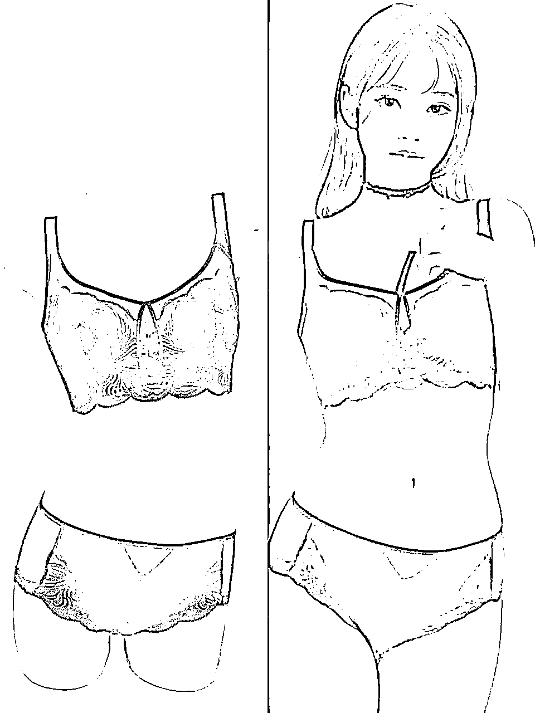
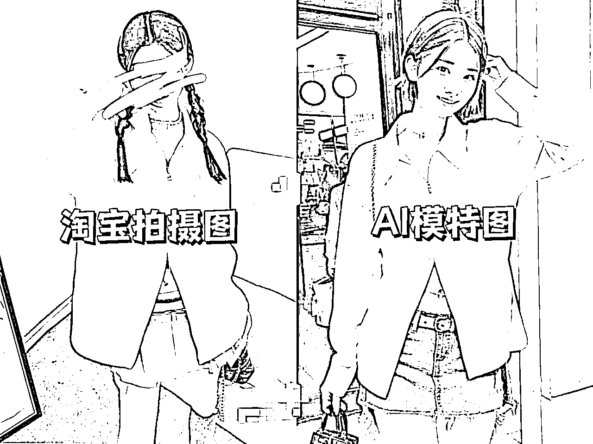
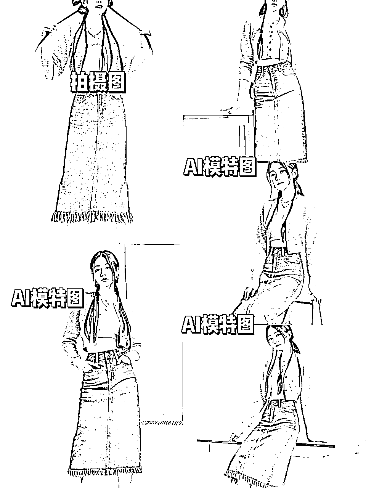
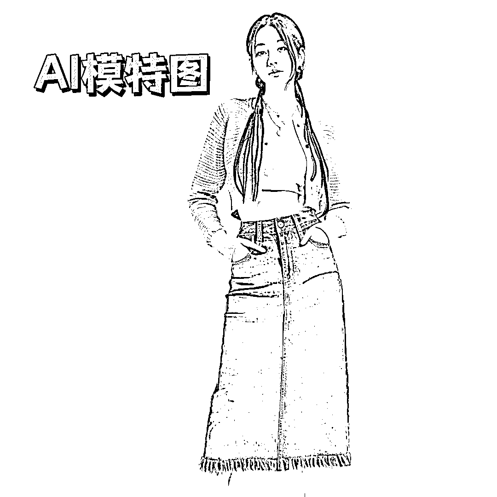
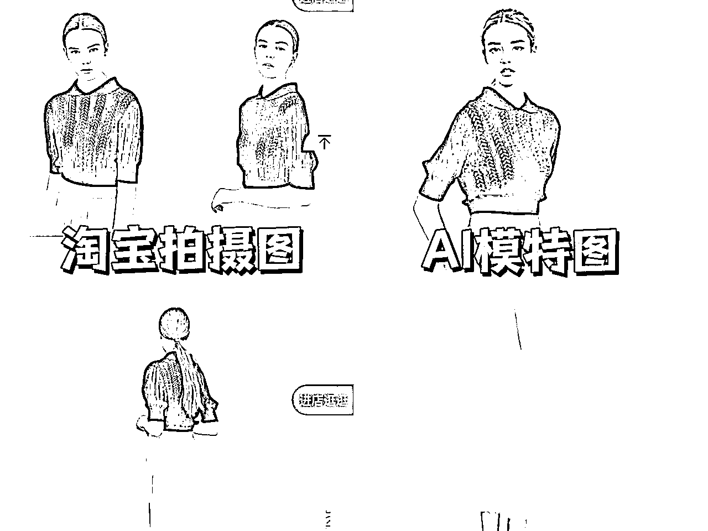
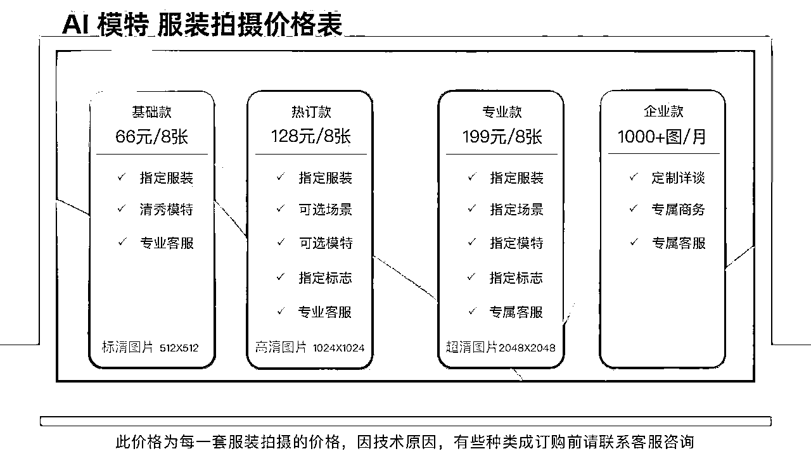
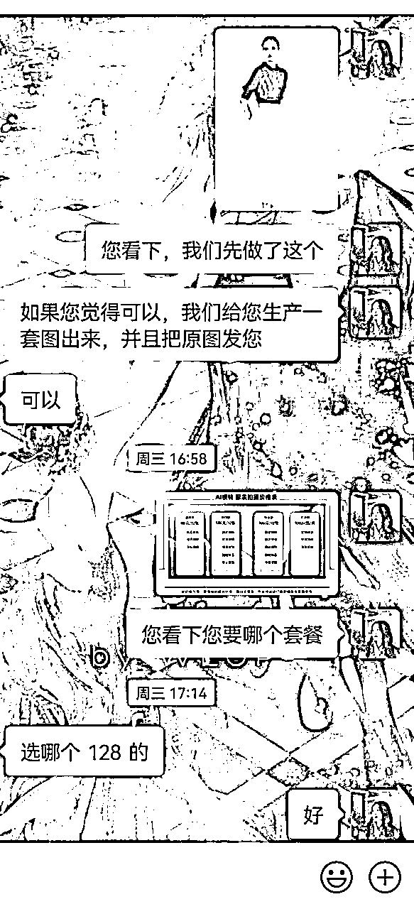
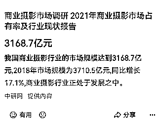

# 失业危机自救:AI模特项目7天跑通变现闭环的复盘实录

> 来源：[https://hte5jh8fk0.feishu.cn/docx/XrPAdRpZKomTgrxPZ3Ac1Ejonso](https://hte5jh8fk0.feishu.cn/docx/XrPAdRpZKomTgrxPZ3Ac1Ejonso)

Hello，大家好，我是温妮，坐标苏州，电商摄影领域的创业者～

最近AI相关内容大火，让我不由产生了失业危机，之前还批斗过这些工具。

但是思考了一段时间后，发现大道汤汤，势不可挡。

于是本着“打不过就加入”的想法，决定入局AI模特项目，尝试用AI模特代替真人模特，入局电商摄影，做第一波“买铲子的人”。

所幸效果不错，我们7天时间，跑通了变现闭环，感觉前景市场广阔，以下就是我们实操的内容复盘：

# 一、AI模特项目缘起

3月19日，一个名叫”浪猪灰头“的账号在微博发了两张照片，并配文：

“今年我们拍衣服不需要花四五万一天，去雇摄影师和模特了，完全够我们用了。”如下：

这张网图很快爆火互联网。

电商模特，摄影师被AI替代的讨论瞬间成为了现象级话题。

作为已经入行5年电商摄影的小妮，看到消息的时候感到非常的震惊和焦虑：

我知道这一天会来，但是我不知道这一天会这么快的到来，发生在一个平平无奇的我刚打开小红书的早上。

那时候我的心情和状态到达了冰点，觉得自己离失业不远了。

去年10月AICG火出圈的时候我就有了浓烈的不安全感，那时候我一边询问一些前辈对于摄影会不会被ai替代的看法，一边开始研究起了第二曲线。

那时，摄影师们普遍对自己的工作和技术门槛持有乐观态度，认为ai的水平达不到商用标准，自己的工作不会被AI取代。

但是AI发展到现在，我能很明显感到朋友圈的摄影师不淡定了：

有的也找我讨论起了AI，希望能够从我这里获得更多信息，对自己的职业表示非常焦虑。

焦虑之下，我尽可能的去了解各种信息，最开始就是刷小红书的各种相关笔记，然后联系到了一些博主，交流和测试了一些AI的功能。

此时的我还是一个围观者的角色，对AI的了解还是非常浅薄，这些信息对我来说完全不够。

恰好，我在上一次的航海中被邀请做小红书笔记航海的经验分享，认识了隔壁小红书IP航海领队 ，并得知他在AICG航海中做教练，便和他交流了相关信息。

聊着聊着，两个人一拍即合，不如我们试试这个项目的商业化吧。无论这个项目成与不成，这对我们来说，都是一件有意义的事情。

了解到这个时代的顶尖科技，这样，即使自己的行业受到冲击甚至覆灭，我们也能提前一步规划自己要走的路。

# 二、AI模特的商业化实践

和小伙伴常常达成共识后，我们就立刻在电话里确认了我们的商业规划和两个人的各自分工。

开始做同行调研，技术测试，找商家反馈，努力形成闭环。

## 1.同行调研：

我们联系了100+小红书AI博主，调研了他们的技术掌握情况和产品：

在这100个博主中，去掉没有回复我的或者回复了让我自己去学的，有可变现产品的只有不到20家。

而在这20家中，能够达到商业摄影级别应用的（以我多年做电商摄影的经验来看），只有一两家。

也就是说，虽然这个领域密密麻麻的都是人，像红海。但是大部分人只是先占个坑位过来玩玩，或者说他们想变现但是并不知道如何变现。

真正有可变现产品的非常少，而能够达到商业落地的产品更少。也就是，这是一个红海中的蓝海。

## 2.技术测试：

我们请教了一些技术人员，同时也自己动手尝试，并且得到了一些结论：

### 2.1　AI模特服装图是否能够达到商用标准：

答案是能

### 2.2　AI模特服装图有多少能够达到商用标准：

对于简单的基础款，标准并不高的图片要求，AI可以达到。

但是对于比较复杂的款式，高定的拍摄要求，AI目前达不到。

（下图为商家给的参考图和我们出的图）

### 2.3　AI模特服装图的成本大概是多少：

AI模特图的成本主要是时间成本和电脑的算力成本，一组能达到商用的AI模特图，快的话也需要半小时，慢的话可能4-5小时都搞不定。

### 2.4　AI模特服装模特图和传统电商摄影的优势对比：

成本：

AI模特图主要成本为生产者的时间成本，入局门槛低；

传统摄影需要摄影师、模特、搭配师、化妆师、场地费，费用较高。

效率：

AI模特图单人单机生产效率较慢，且有生产失败风险；

传统摄影一天可拍摄80－100套服装，效率较高。

所以AI模特图如果投入商用，更适合多人分工协作，不适合一个人单机作战。

可调节性：

AI模特服装图调节灵活，只要有台电脑，就可以重做；

传统摄影重拍成本高且时间慢。

局限性：

AI模特服装图复杂的款式目前技术达不到，不能满足较高要求的拍摄；

传统摄影：只要预算够，所有产品都可以拍。

## 3.商家反馈：

技术测试完成后，我们就开始寻找商家，对该项目进行商业化测试。

由于我一直深耕再珠宝首饰类的电商拍摄，所以私域积累了1700＋首饰类商家资源。

所以我发朋友圈通过我的商家帮我找了一些意向的服装商家，开始调研商家对AI模特服装图的反馈。

### 3.1技术认知度

发现不少商家会理所当然的认为这是一件非常简单的事情：

“你们不能一键出图吗？”

“你们只要把产品和模特分离出来，然后再合成就可以了。”

总体来说，商家对这块的技术了解程度较少，但是不会有太多“这不是实拍图，我不能用”的思想包袱。

左图为商家供图，右图为我们出图。

### 3.2价格接受度

价格接受度，我们目前的定价大概是传统摄影价格的一半。

虽然商家都希望越便宜越好，最好不要钱，但是这样的价格商家基本可以接受。

### 3.3后续合作意向

拿到我们图片的商家有给出”如果之后有需要，还会找你们”的反馈。

说明如果图片能够达到商家的标准，过程中的服务让商家觉得满意的话，那么是可以实现长期合作的。

# 三、AI模特服装图的技术介绍以及商用标准

## 1.技术介绍

不同于MJ的以文生图的随机性。AI模特需要将特定的服装穿到特定的模特身上，使用过程中运用更多的是stable diffusion的功能。

（不过听说MJ又要进化了，MJ的V6版本在之后也具备这个功能）

目前使用stable diffusion软件或者其他开源模型，进行生成AI模特或者其他AI摄影，主要需要商家提供同一商品8~20张图式，通过在软件中调整步数以及使用的参数进行绘制。

AI模特摄影图绘制的本质更偏向于360°虚拟建模，通过提供多个角度不同的人物模型，对人物进行快速建模，然后将衣物与模型进行匹配。

这是耗时耗力成本最高的绘制办法。目前市面上低成本省力的办法，是转变思路，不再进行训练衣物模型，通过对商家图示中的模特进行换脸来实现同样的效果。

总结而言，目前市面上能够实现AI模型商用效果的方法有两种：

1.  8~20张衣物模型，全面训练，绘制虚拟衣物模型，通过衣物模型的建模，生成满足商家需求的AI模特图。缺点是耗时耗力成本高，需要较高的技术掌控，出图效果非常理想。

1.  衣物模型不炼制，通过对模特进行换脸操作，实现同样的效果，缺点是姿势较少，根据衣服版型绘制，个人操作空间较小。

AI模特商业化的技术最大难点是稳定性（生成对应的模特和服装）和细节准确性（服装的细节把控，比如衣领，扣子）。这是AI模特技术的两大弱项。

AI并不能完全智能的一键生成，也不是能够生成完全准确的图片，要学习才能够会使用。

并且，其中细节的把控和加工仍然需要人为的手动去调整。

## 2.商用标准

商用的门槛比较严格，版型对是基本的门槛。产品需要达到95％－100％的正确才能够投入商用。

就算只是领子或者袖子或者长度不一样，已经有80％的相似度，但是，这样的图片就是无法达到商用级别的。

对于这些，仍然需要人工通过PS进行二次调整。

# 四、AI模特和传统摄影的市场规模以及发展推测

中国的电商摄影市场是一个千亿级别的市场，会有AI摄影的发展空间，也会有传统摄影的生存条件。

（下图数据来自百度）

近期的入局实操，让我对AI模特摄影的认知发生了很多转变。

刚开始，我担心AI模特图会取代传统拍摄。

后来，我了解到，还有很多领域，尤其涉及到很多精细化细节的领域，比如珠宝首饰，比如化妆品护肤品等，AI的技术仍然达不到。

AI的成本低，但并不是没有，AI需要出图的素材，素材的好坏会直接影响到AI出图的质量。

对于特定产品，如果没有合适的素材，那么还是需要一次基础拍摄然后再生成的。

此外，AI需要时间和算力成本。所以，AI模特图的价格随着技术的进步，可以降低，但是不可能边际成本到０。

最后，还需要考虑到商家选择和消费者接受度。

即使AI真假难变，大量消费者仍然希望自己看到的商品图是实拍而不是AI合成的，所以，传统摄影会仍然存在。

而从时代发展趋势来说，AI模特图一定会应用于市场中，AI图片成本低，质量稳定，修改调整迅速，真假难辨，具有独到的竞争优势。

总之，目前看来，AI模特图和传统摄影会是共生的关系，就像当年的绘画和摄影一样。

# 五、如何入局AI模特项目

随着AI技术的不断进步，AI模特图片的精细度和真实感都会大幅提升，成本、技术和使用门槛都会进一步降低。

但是，那时候的竞争也会加剧，并且，也已经失去了先机。

所以，如果想要入局AI模特（摄影），现在就是一个比较合适的时间点。

并且，即使不做这个项目，长远看，学习使用ai也是有必要的。时代趋势不可逆转，了解并会使用ai将成为一个人被看重的能力之一。

那么，如果想要学习或者入局这个项目，应该如果下手呢？

### 5.1技术基础

虽然sd的源技术非常复杂，但是学习使用sd并不是一件非常困难的事情，学习其中一个分支——ai模特图，并且，即使你的电脑配置没有达到，市面上也有平替的软件可以使用，方法总比困难多，这些都不是问题。

新手可以多链接，去了解并学习这个技术，然后做出一些可以达到商用化的案例，找到愿意付费的商家，就可以跑通闭环啦。

### 5.2如何找到合作商家

一是可以利用自己的现有资源，问问自己的朋友有没有认识的商家，从而找到商家，和他们介绍AI模特图的项目。

二是可以在小红书抖音等平台上发作品和案例从而吸引到商家过来。

### 5.3如何交付——用户视角

电商的审美和传统的CG审美有着不小的差异，CG容易看着像假人，而商家喜欢的都是真假难辨的真人。

此外，商品是整个图片的重中之重，产品的版型一定要对，对于AI不能够调节的细节还需要通过PS进行进一步的调整和改善。

这两个点是交付中的两大重点事项，其他和别的产品一样交付就可以了。