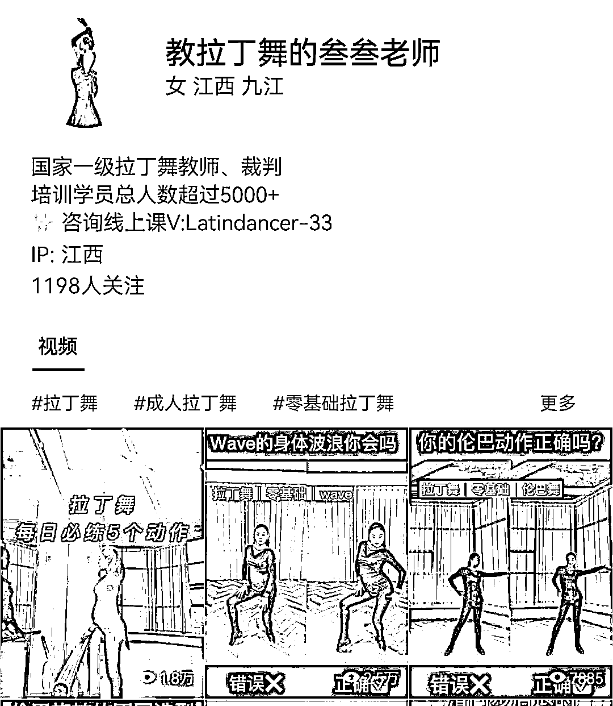
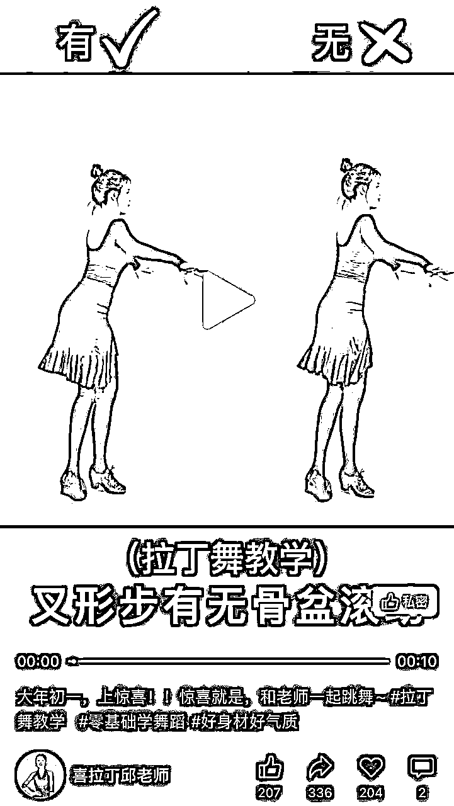
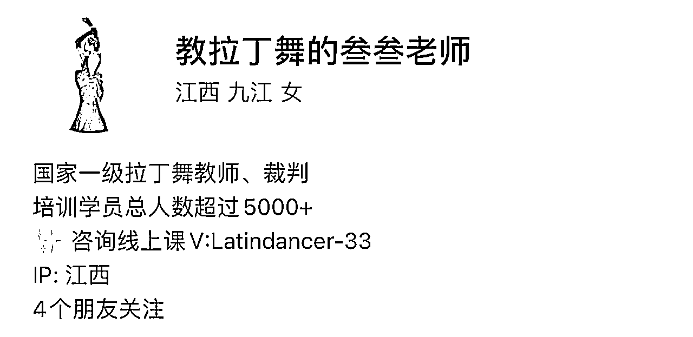
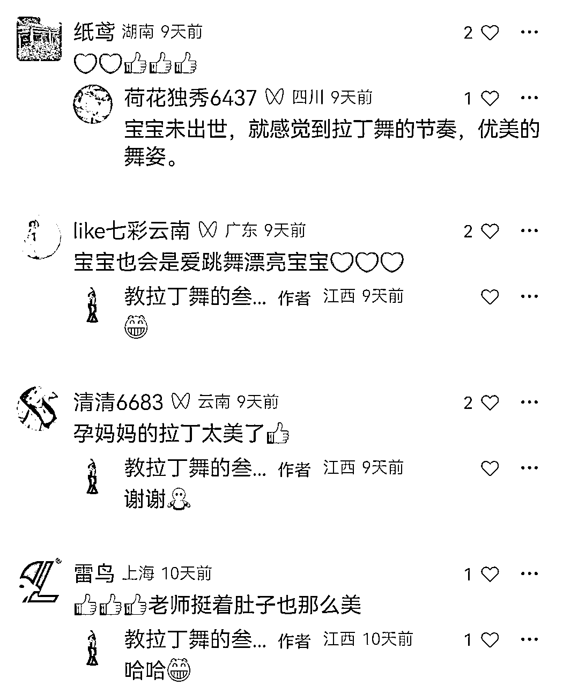
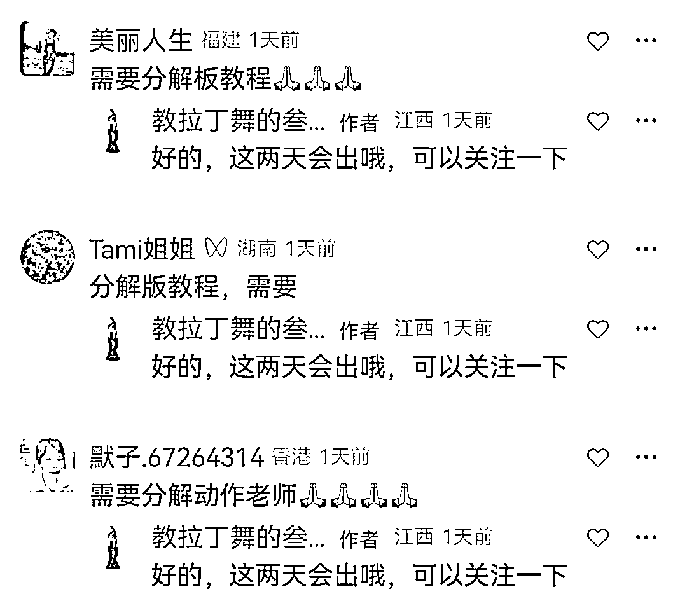
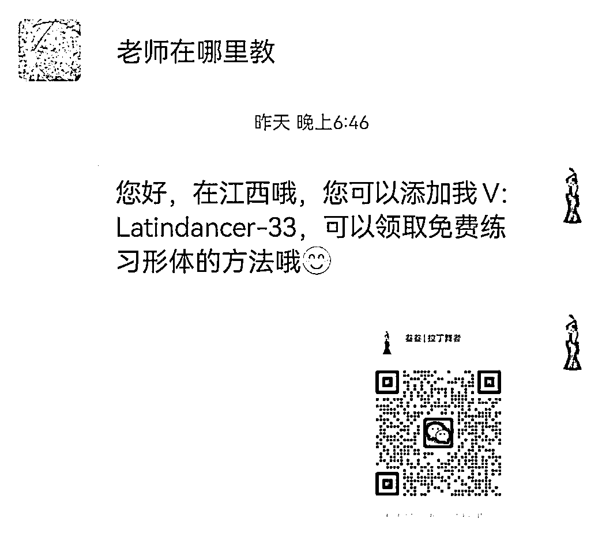

# 孕晚期准妈妈，通过视频号10天涨粉1000+，成功引流私域的案例复盘

> 来源：[https://n28vbku1px.feishu.cn/docx/ZvLLdhX11oD4Lyxby36ct8GfnXe](https://n28vbku1px.feishu.cn/docx/ZvLLdhX11oD4Lyxby36ct8GfnXe)

各位小伙伴大家好，我是叁叁。

国家一级拉丁舞教师及裁判，线下机构主理人，7年专业拉丁舞教师，视频号/小红书内容创作者，同时也是一名孕晚期准妈妈。

今天要复盘的是关于我在视频号10天涨粉1000+并且成功引流私域的实操细节，希望对各位小伙伴有所帮助。

我一开始想在视频号更新内容的起因是因为我看到很多同类目的博主开始在视频号上更新自己的舞蹈视频，而我考虑到后期也要做自己的知识付费产品，相比于抖音，视频号更适合我这样的素人入场，所以提前筹备起来是我必须要做的动作。

一.在起号前，我主要做了两个准备工作：

1.寻找对标账号，建立自己的内容更新体系

我在寻找对标账号时，主要是看几个方面：每篇笔记的内容数据、是否有引流私域动作、是否有自己的变现路径，根据这几个点我找到了3-5个同类目账号，将他们数据好的视频内容主题依此进行整理归纳，为我自己后期更新内容提供参考；除了视频内容本身，封面图也是非常重要的，我通过对比视频数据，发现“对比类”的视频封面，普遍数据都比较好，事实证明封面上越是有非常明显极致的反差，越是能吸引用户点击

2.思考账号的变现路径

一个账号如果无法变现，哪怕数据再漂亮，也是一堆垃圾！

结合我自己所在的垂直行业，我主要罗列出了以下几种变现路径：

·知识付费课程

·橱窗带货

·直播带货

·商务合作

二.账号设置

1.名称设置。一个好的名称，可以让用户非常快的了解你是干什么的，一目了然，这里有一个起名称的公式：行业+名字。

2.头像设置。因为我本身是做舞蹈结合形体领域的教学，所以对于头像需要具备一定的专业性，且能透露出“有气质”的感觉。试想一下如果一个做此领域的人头像非常普通，甚至看不出任何气质的感觉，那用户会不会关注这个人呢？适当的包装非常重要

3.个人简介设置。个人简介的内容说明是非常好的用户可以快速了解你的一个窗口，所以需要将自己的身份介绍+经历背书+私域钩子，通通展示在个人简介的位置。

三.账号更新

1.根据对标账号的内容提前筹划我的内容更新主题，并统一罗列出来；因为我在孕期，不方便经常跑去舞房录制视频，所以我会提前筹备半个月左右的内容主题，统一一次性在舞房录制完成，这样到了要更新的时候，我只需要翻开手机相册把视频提前剪辑出来就可以，大大提高了整体效率。

2.做账号很重要的一点就是：保持更新频率，不管之前的内容数据怎么样，都不要影响你接下来的更新节奏，用数量去对抗质量！

3.因为我在孕期，所以我的视频下方经常会有人评论：你这是怀孕了吗？怀孕了还在跳舞？怀孕了就最好不要跳舞等等之类的评论，不论什么样的评论，我都尽可能做到评论必回复，这样可以有效的帮助内容数据更快的跑起来。

4.同样的我也会利用标题引导评论，比如想要分解版教程，评论区告诉我，以这样的方式增加内容的活跃度，也可以有效的帮助内容数据更快的跑起来。

5.定期整理评论区内容，根据评论区内容更好的了解用户需求，为后期内容提供更新方向；用户需求都在评论里。

6.及时回复私信。我的视频内容更新后，渐渐的有用户私信我在哪里教课，我会有一个统一的话术，直接发给用户。这里需要重点提一下：视频号的用户主要为中老年群体居多，很多人手机操作不是很灵活，所以我在将话术发于用户后，还会额外将我的微信二维码直接发于用户，方便用户直接扫码添加，增加引流私域动作的转化率。

三.后期规划

1.前面提到我目前处在孕晚期，为了更好的实现整个变现路径，所以我提前规划了课程上线的时间，预计本月底上线，这样做既不影响我月子期间的产品变现，还能让我抓住这个空隙通过课程不断了解用户的需求，这样当我做完月子后就可以进行2.0的产品迭代，任何事情做到先完成再完美，没有人一上来就可以做到100分，迭代的过程也是很好的复盘提升的过程。

2.开启认证舞蹈博主，增加账号的权重同时继续深入了解视频号的运营技巧，和视频号小店的入驻流程，为后期开启直播教学和带货做准备，任何事情都要提前预留出规划的时间，不仅为了更好的完成该事项，也是对于完成事项的自信心建立提供帮助。

3.提前学习直播方面的相关话术，以及参考同类目博主的直播内容，为了我做完月子后能够更好更快的开直播教学提供参考。

我是叁叁，一个专注于舞蹈形体和个人成长的孕晚期准妈妈，欢迎追求个人成长的小伙伴一起交流学习哦！