# 壹，店铺批量自动发POST | AMZ与RPA

> 来源：[https://i0ejcw7gsm.feishu.cn/docx/doxcnXIOtkZmPJLb1izKrreOuMg](https://i0ejcw7gsm.feishu.cn/docx/doxcnXIOtkZmPJLb1izKrreOuMg)

2023.07.27日更新

亚马逊更新了POST的整个界面板块

本地电脑和VPS都需要调整位置

新增图片识别板块，下载压缩包导入即可，新教程待写

该文档所在飞书云空间已满，压缩包无法再上传，图片都没办法贴上来，请联系我发送

新教程：

新版本采用按钮识别技术，中间只需要调整两处：

1.  电脑浏览器页面需要看得到上传按钮，如果看不到请调整到75%缩放

1.  请人工发送POST走一遍流程，确保文件上传按钮点击后，即是图片素材包所在文件夹

1.  图片素材页面文件最大化，且在左上角（此处你可能看不懂，还是找我调整吧，你可以先不管，这个很简单，一看就会）

2022.07.19日所写

备注：经过沟通，紫鸟浏览器，不可使用RPA，因为他们在推自己的服务。

我目前是RPA的UIBOT软件配合VPS使用，多个账号可以直接复制代码。

壹，店铺批量自动发POST | AMZ与RPA

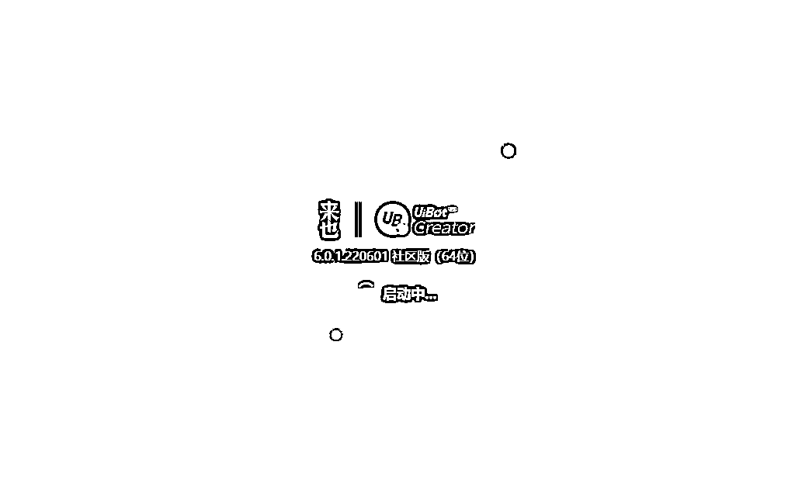

本来今天打算写跨境物流费十年来的变化，因为我在个群里看到相关讨论，也有个网站打算好好研究下。

不过事实上我一直在鼓捣RPA自动发AMZON POST的事情，首先是获取大量图片，其次是把上传帖子的流程捋顺，最后是不断测试看程序可优化的点。

我之前发了一篇视频号自动批量发布的RPA程序，后面就有程序员开发出了自动定时发布的软件。

几年前刚毕业还在深圳的时候，我是用按键精灵，批量自动发布售后邮件，当时几千封发送的单调动作，真是让人觉得生无可恋。

后来我在生财，看到阿愚呱呱从发现RPA可以自动化微信号加入，到全职投入去搭建团队做培训，那是两年之内的事情了。

为什么我比较热衷这类技术呢，一部分原因可能是我属于理工男，另一部分是我确实不懂代码，但见识到了那些程序员，依靠软件批量生产视频，完全自动化躺赚的威力。

君子性非异也，善假于物也。

代码，软件，程序本质上是杠杆，不仅解放你的双手，还能复制你的时间。

我在写文章的此刻，已经整理好两个店铺的流程，程序在自动化批量发布POST了。

本文是完全教程，考虑到发布后可能引起行业内卷，我就把价格设置得高点，因为如果你不懂RPA，那大概率要花费挺多时间研究，所以不建议来看也可能看不懂。

如果你真的买了，有需要可以找我来协助配置。

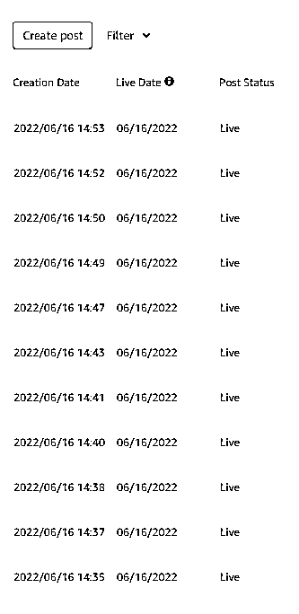

# 一，引言

今天在拓跋勇群里，勇哥向我确认了，他差不多两三分钟发个帖子，由此我就安心大批量发布了，本来还打算等发完的帖子看情况。

现在广告的付费流量那么昂贵，POST是完全免费且小众的一个工具。

我们作为商家，站内可做的动作真心不多，早期评论人已经关闭，免费赠送样品早就没了，AMZ VINE又那么昂贵，来领取的人还少，于是太多人在广告投放上烧钱。

其实我觉得亚马逊完全可以开放视频发布功能给到商家，你看淘宝和拼多多都被抖快比得改版，估计AMZ早晚被TIKTOK取代。

# 二，基础

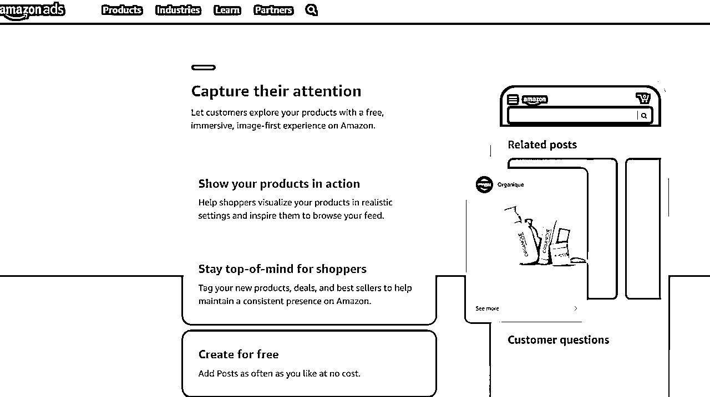

AMZON POST是去年亚马逊推出的一项测试计划，仅适用于在美国市场中拥有活跃店面的品牌注册卖家。

目前是免费的，但需要完成店铺创建并上传链接的条件。

我很早就听说过，有人通过大量上传产品相关的图片，以此获取非常多的亚马逊站内免费流量。

但我一直都还没试过，一来是上班时公司没重视，店铺都没创建，也没产品素材；二来搭建团队的时候，碍于整体成本和时间精力，顾不上那边去。

现在我则有比较多的时间，也达到了基础认知，通过一些方法能够比较快速地完成大量的帖子发布。

# 三，软件

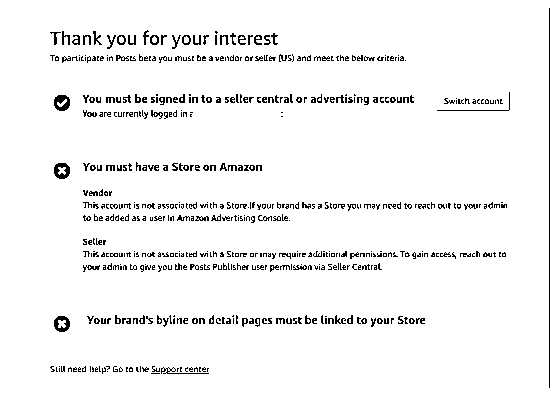

在你创建好店铺，品牌下有产品正常在售时，还需要两个东西：

一个是完成RPA的软件，国内创业者做的，影刀或者来也，都可以。

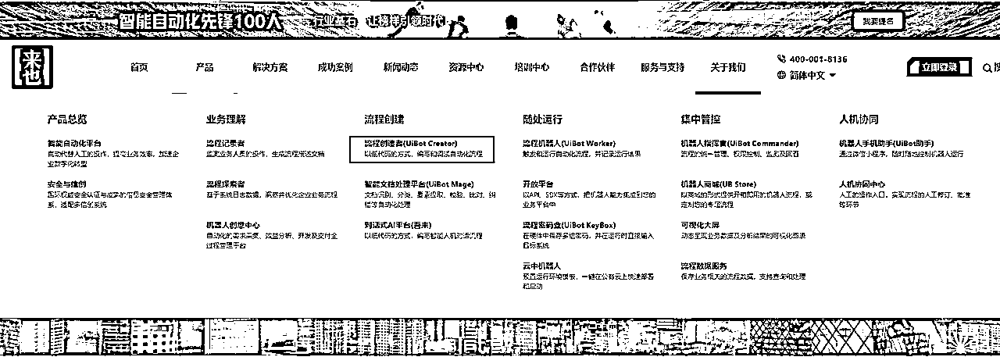

https://laiye.com/about

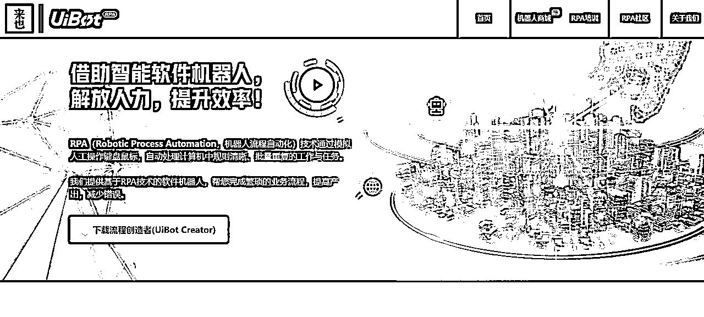

https://www.uibot.com.cn/

我这里选用的是UIBOT CREATOR，因为这个生态化更成熟，虽然影刀对新手最友好。

另一个是谷歌浏览器，批量下载图片的插件。

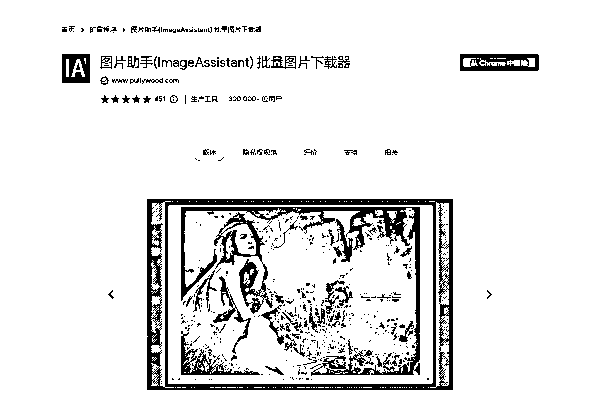

https://chrome.google.com/webstore/detail/

imageassistant-batch-imag/dbjbempljhcmhlfpfacalomonjpalpko

批量下载图片的其实很多，我选这个也是用了很多年了，里面的两个功能对图片类型和大小的筛选很实用。

# 四，流程

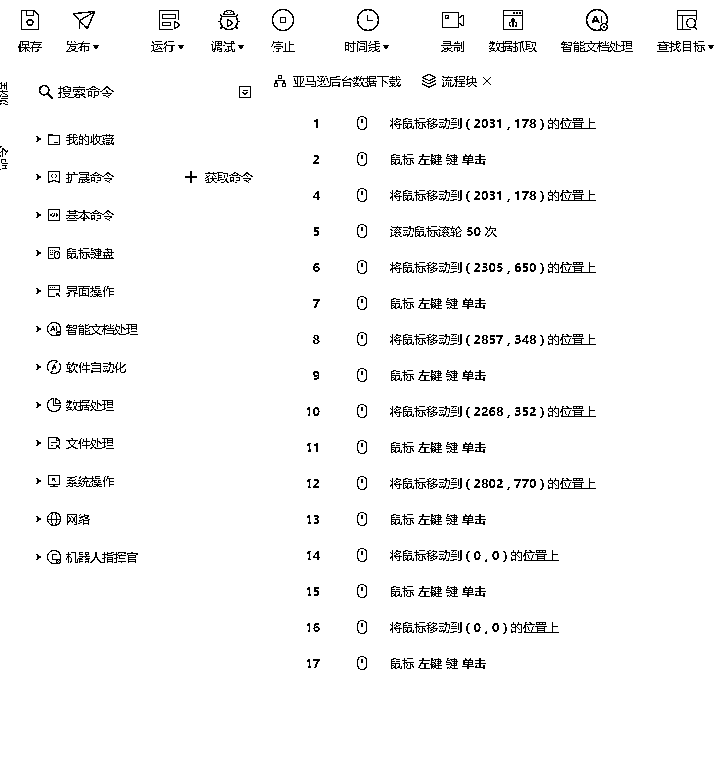

好，在你安装上述软件和插件之后，请在进入POST发布页面，确保店铺已经创建完成。

RPA自动上传POST代码：https://blbze7axys.feishu.cn/docx/doxcnidpwNGvhrnrk7aiDGTVUSf

如果你什么都不懂，那就按照截图步骤来，实在不行，我后续可以录个视频，或者直接远程一对一辅助搭建。

第一步，打开软件，UIBOT CREATOR，点击新建

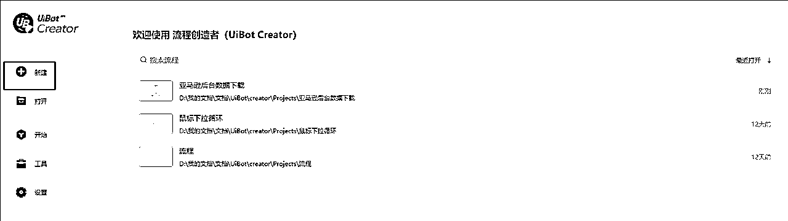

第二步，点击创建，可以命名也可以不用管

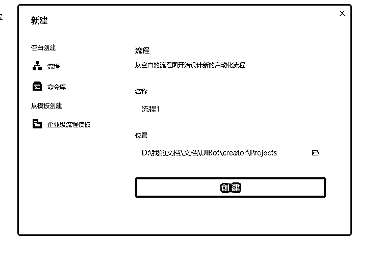

第三步，点击箭头所指和红框圈住的笔框，

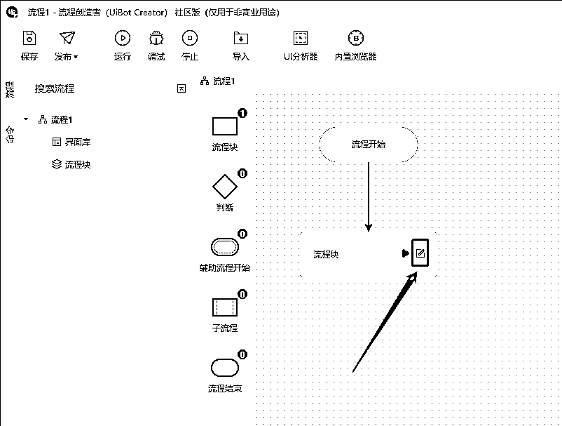

第四步，点击右上方可视化按钮，

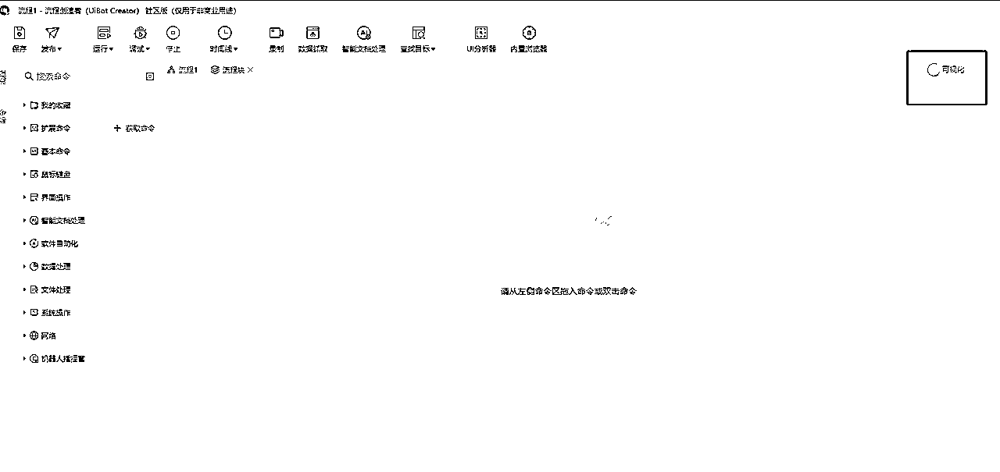

第五步，复制代码到空白处，选用4.0版本，有多重容错机制

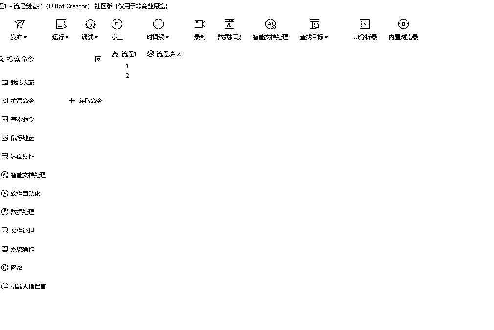

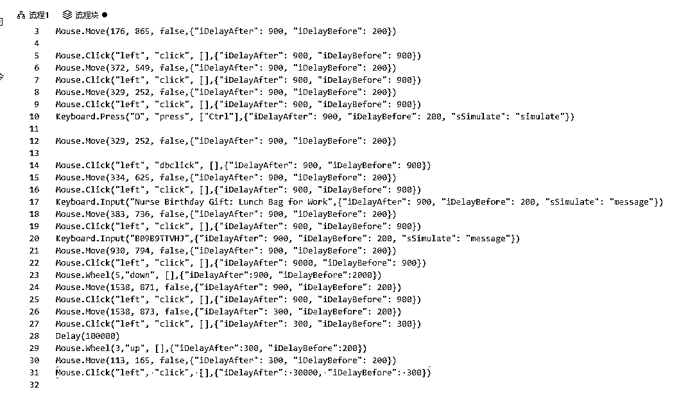

第六步，点击源代码，

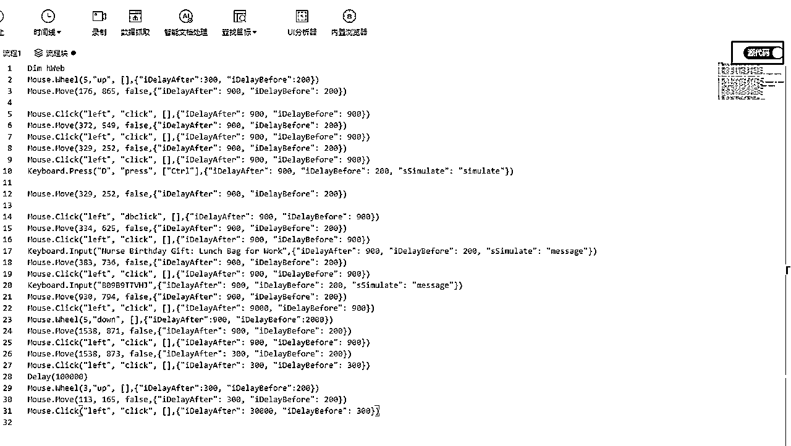

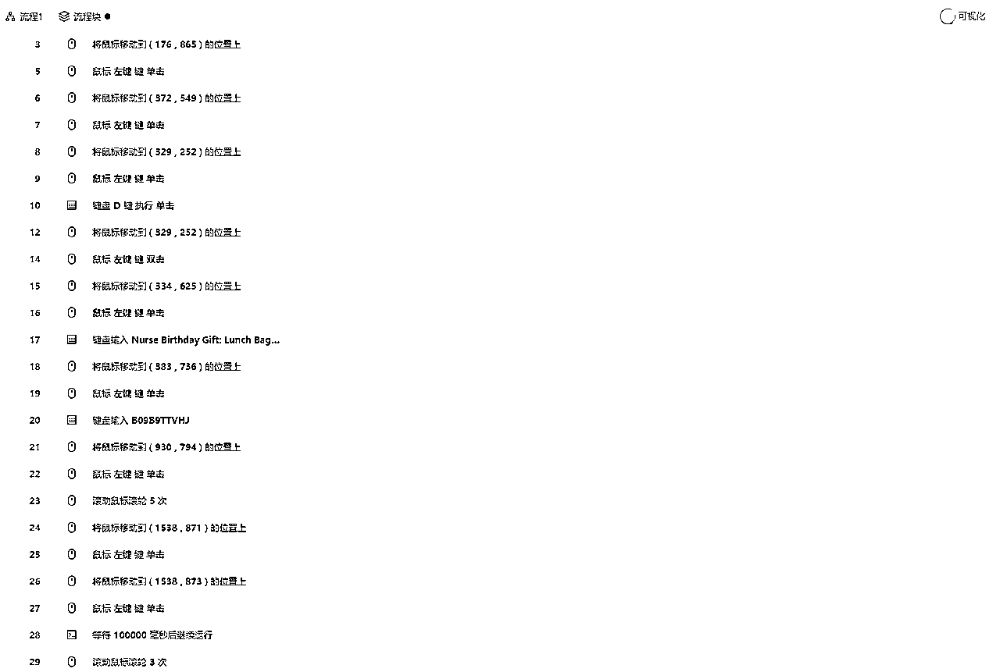

第七步，尝试手动上传一次AMZON POST，

目的是设置好图片上传文件夹；

第八步，点击运行测试一下流程如何

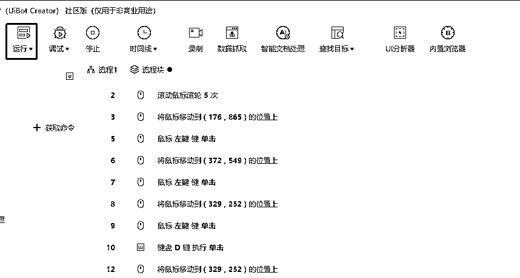

第九步，点击流程1，如果测试OK，那就走这步；如果出现问题，需要调试，更多教程，值得请教搜索引擎

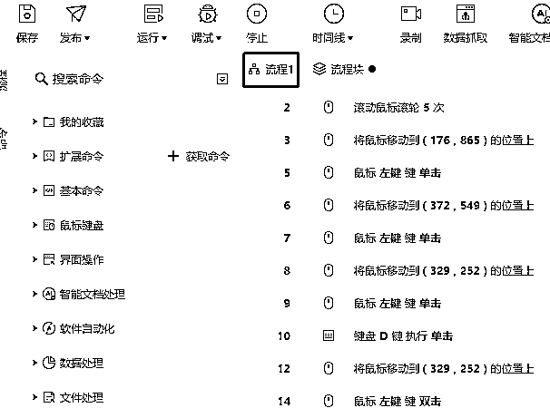

第十步，右键单击流程块，选择复制

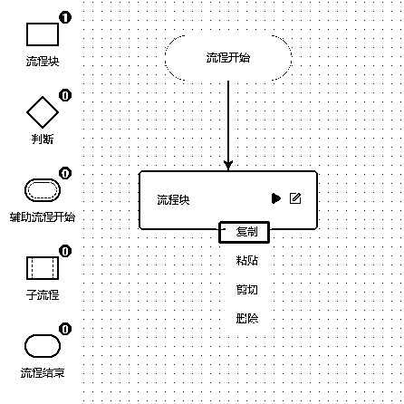

第十一步，下方右键单击，选择粘贴

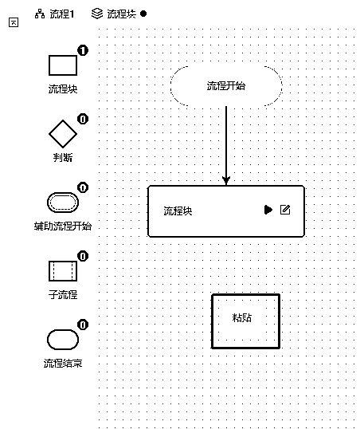

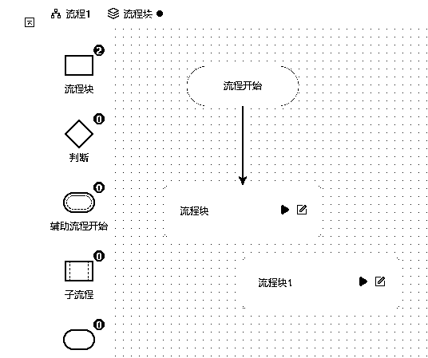

第十二步，鼠标左键长按，遵循图中箭头路径，出现十字架的时候开始，拉出来一条线到下一个流程块

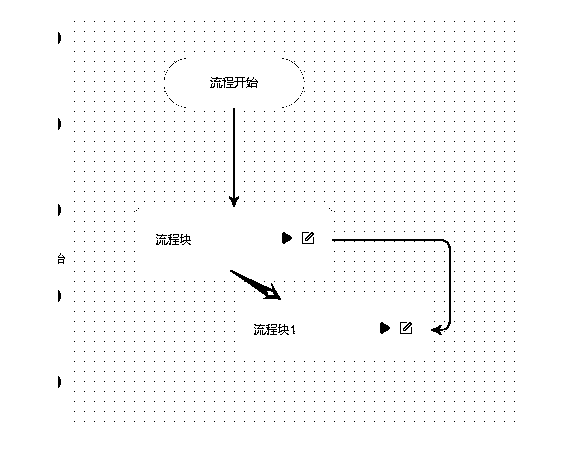

第十三步，同上，从下面的流程块，拉出来一条线到上面的流程块

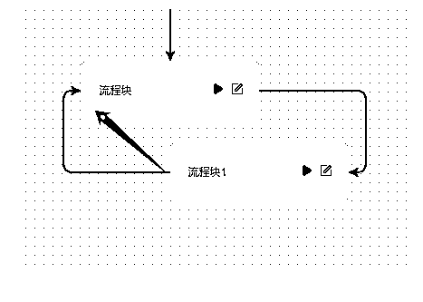

第十四步，点击运行，

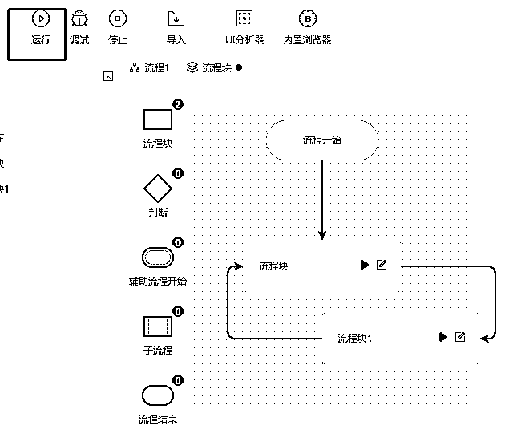

第十五步，观察二十分钟，看程序点击情况

最后一步，如果出现任何问题，请录屏，或者最好联系我远程协助处理，因为每天电脑的浏览器和软件都不相同。

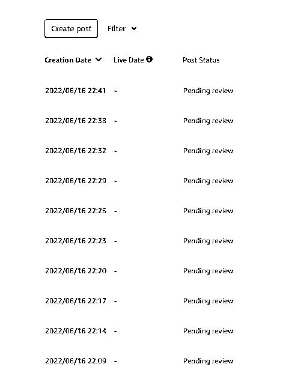

# 五，图片

咦，你是不是觉得，我少讲了，那么多图片素材，哪里来呢？

方法很简单，你不需要完全去真正拍摄或者修图所售产品，只需要找到产品同类的场景，以及对应的受众即可。

比如我在《蓝海产品方法论》当中所讲的几大人群：教师，司机，护士，父母等等。

其实这里，顾小北的精细化运营文章之一，给了我启发，不信你可以自己查阅一下：亚马逊如何巧用post ，让新店0-1。

其实这个也是潮汕牛肉丸的抖音策略，批量发布产品相关视频，反正只要有免费流量，就出现你的产品链接就好，受众尽可能精准。

最开始我是打算设置定时发布策略的，但是后面核算了下，这个真的很麻烦，还不如超级简单的，直接延时即可，如果你仔细研究的话，会发现我是设置了两分钟，也就是200000毫秒延后。

给你个大批量获取产品相关图片的方法：

第一步，打开谷歌浏览器，输入google.com

第二步，搜索无版权网站

第三步，在这些网站里，搜索你的产品关键词

第四步，安装好浏览器插件后，右键单击会出现这个按钮

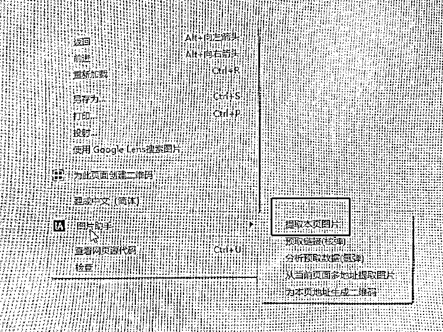

这个没法截图，手机上拍了张。

第五步，点击提取本页图片

第六步，依次按照顺序，点击图中红框

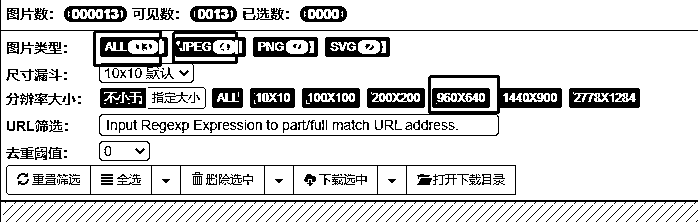

第七步，点击全选和下载选中

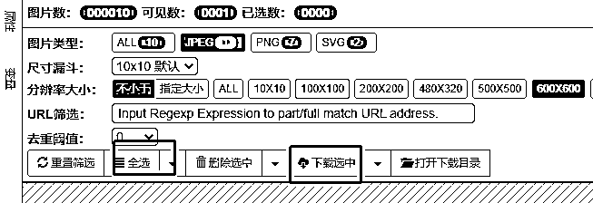

第八步，依次点击自动下载和继续下载

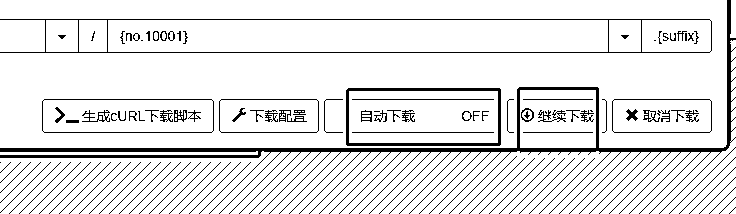

如此，整个页面上的所有图片，全部都下载完成。

# 六，注意

AMZ POST，图片标准是

*   Image size: 640 x 320 px or larger

*   Aspect ratio: Between 1:2 and 2:1

*   File format: JPG or PNG

*   Color format: RGB

不建议图片上带文字。

请仔细阅读亚马逊官方POST规则。

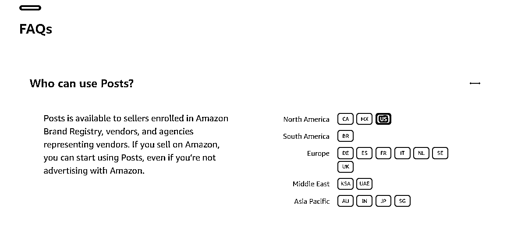

以上，欢迎实操与提问！