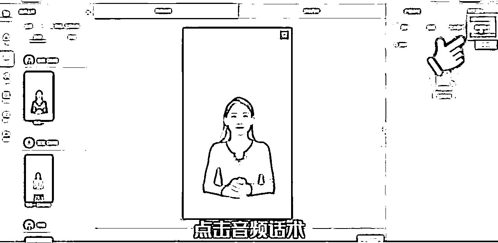
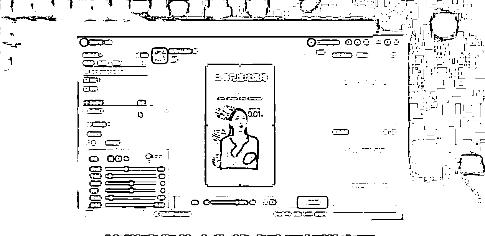
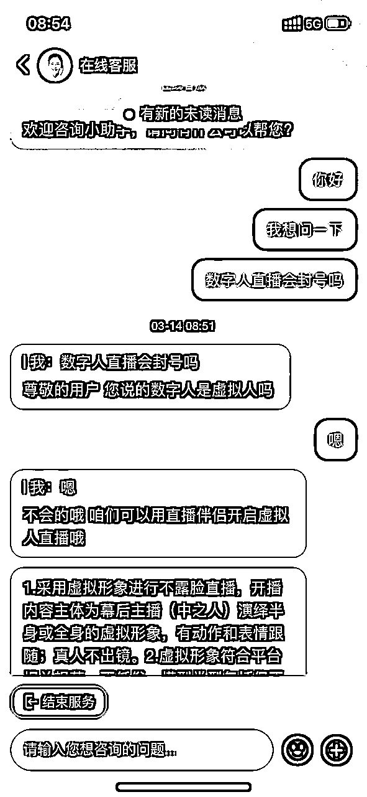
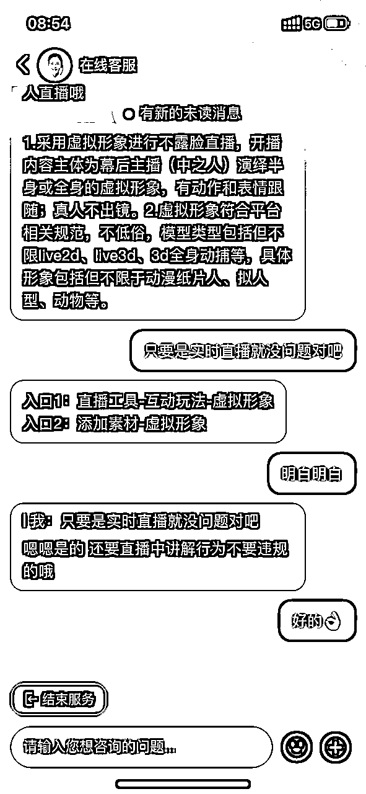
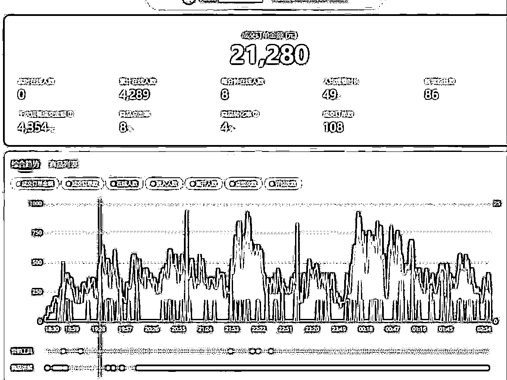
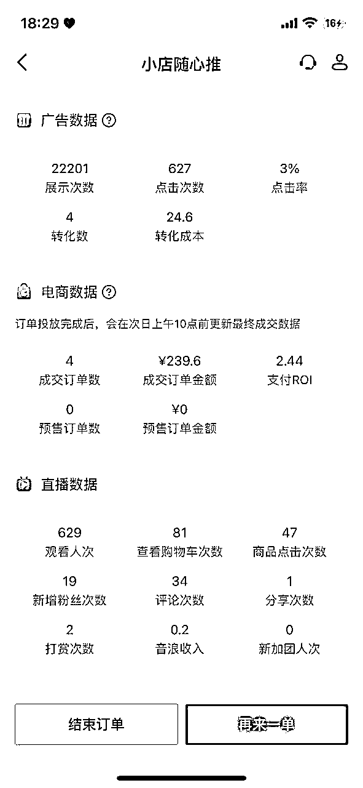

# 数字人直播，未来已来？

> 来源：[https://jingyijuejin.feishu.cn/docx/PtLId31Z8obw2gxV5xvcy0UhnQh](https://jingyijuejin.feishu.cn/docx/PtLId31Z8obw2gxV5xvcy0UhnQh)

最近数字人直播的概念火了起来，我们能在抖音刷到好多的数字人直播间。而且效果非常逼真，几乎以假乱真，不是专业的直播运营，根本分辨不出来。

所以最近问我数字人直播的小伙伴非常多，大家也提出了很多现实的问题：

1.  数字人直播收费多少钱

1.  数字人直播会违规吗？

1.  数字人主播能根据真人定制吗？

……

刘润的很多视频已经在使用数字人进行制作

恰好最近我也在研究数字人直播，了解了很多这个技术的实际效果与坑。

今天就结合我对数字人直播的了解和去年做无人直播的经验，跟大家聊聊如何用数字人直播来做直播的可行性与方法论。

### 什么是数字人直播，数字人直播有啥优势？

先直接来看一段效果视频：

可以看到，还是很真实的：主播口型动作自然，说话很舒服。不说的话，很难意识到是真人。

简单来说，数字人我们可以理解为一个AI主播：我们自己写话术，然后由AI数字人自然地表达出来。

相比真人直播，数字人的直播的优势很明显：

*   数字人不会累，完全可以实现24小时日不落无人直播

*   AI的形象和气质都不错，免去了挑选和管理主播的麻烦

*   最重要的，出镜障碍卡住了80%的电商人进入直播行业，和之前的无人直播一样，这是一种快速入局直播的模式

当然，数字人主播的缺点也很明显，目前还无法完全替代真人主播，比如：

*   无法真实的演示商品

*   无法完全随机应变的回答问题（可以做关键词回复）

### 怎么用数字人做直播

那目前数字人直播具体的技术原理是什么，不同的方案技术有啥区别呢？

其实这也并不是特别神秘的东西，要在直播间使用数字人主播，（以某个数字人软件为例）需要这么几步：

1.  录制一段语音；

1.  将语音导入到软件中，选择喜欢的主播，软件会根据你选择的人物形象和语音，自动生成一段虚拟主播念这段话术的视频。这一步也是真正的“数字人软件核心技术”，即根据录音生成人物形象；

1.  使用软件为上述视频添加绿幕背景，方便抠图；

1.  在直播助手中，直接添加“窗口采集”，将软件中生成的数字人视频导入进直播伴侣，绿幕抠图，添加背景图片或者视频，就完成了一个数字人直播间的搭建。

从本质上来讲，“数字人主播软件”做的事情，就是智能的把一段录音，生成一段数字人主播的视频。

目前市面上最主流的数字人解决方案名为硅语，据说刘润的数字人就是采用了他们的家技术，目前大部分的直播间售卖的也是这个方案。

但是价格很高，要5500/月，如果根据真人形象来定制，要8000/月。昨天了解到还有一个新的方案，便宜很多，只要999/年，但是只支持制作60分钟的素材。

了解了一下之后，做了一个两种方案的对比表：

|  | 5500方案 | 999方案 |
| 价格周期 | 每月 | 每年 |
| 视频时长 | 不限 | 60分钟 |
| 是否支持真人定制 | 支持，价格为8000/月 | 不支持 |
| 是否支持智能回复 | 可以设置关键词回复 | 不支持 |
| 是否支持多平台 | 支持 | 支持 |
| 是否支持实时直播 | 支持 | 支持 |

可以看出，贵的方案

*   可以不限时长的随意自由生成视频

*   封装了关键字回复的功能，可以检测观众的评论关键字

*   调用预先准备好的话术音频

*   支持实时生成素材。

但是，不能忽略的一点是：两种方案的价格，差了55倍。

所以，如果做本地生活直播，从性价比角度来说，还是更推荐先尝试999/年的方案起步的。

### 数字人直播的实践

#### 绿幕数字人的简单替代方案

理解了数字人的原理后，其实不难发现，如果只是想搭建日不落直播间，或者没有好主播的话，即便不使用数字人技术，我们也可以低成本达到“数字人主播”的效果。

刚刚我们分析过，所谓的数字人直播，最终的产出实际就是一个“讲我们写好的话术的主播视频”，然后通过直播伴侣等软件，输出到我们的直播间。

那么我们可以雇佣一个临时的专业主播（如果自己直播能力强的话自己也可以），在绿幕背景下，用话术空播20分钟-1小时，录制出来一个纯净的绿幕主播视频。这样，这个视频抠掉绿幕以后，就是一个“自制数字人”了，完全能达到甚至超越一些数字人主播的效果了。（自己录制可以拿商品讲解）

以下面这个直播间为例，

仔细看不难发现，左边的主播是真人主播，右边的主播就是使用绿幕抠出来的主播，而且提前录好了声音，还能展示商品。

这样的直播间效果其实是很好的，虽然也有一个真人主播，但是对这个主播的要求近乎为0，而且可以有效的缓解违规问题。

关于如何把主播抠干净，有一个好的效果，在生财11月的航海中，教练平头哥详细讲过直播间打光和优化的方法，可以参考：

11月绿幕航海-如何打造一个优质直播间 by 平头哥

https://shengcaiyoushu01.feishu.cn/minutes/obcnzicw4u5mn7219568ants

#### 本地生活直播中使用数字人

知道了数字人的原理，大家最关注的一个问题是，会违规吗？

目前大部分数字人营销方案中给出的案例都是抖音平台的本地生活直播，并且强调说，咨询过官方，不会违规。

大家都知道，今年抖音在力推本地生活，前期要大量的跑马圈地，所以目前对这种形式的“无人直播”是睁一只眼闭一只眼的状态，所以现阶段抖音的本地生活直播间，确实是非常适合使用数字人来进行直播的。无需过分关心违规问题，也是容易拿到一些成绩的。

连锁餐饮直播

旅游直播

目前本地生活有一定流量扶持，数据还是不错的。

这里额外提一句，很多还没入局抖音本地生活直播的同学，一定要慎重。做本地生活的直播带货没有想象的那么美好。

现阶段本地生活最大的问题是：核销率和佣金太低！

目前常见的本地生活商品有全国餐饮（各种连锁品牌的券）、本地餐饮（优惠套餐）、生活娱乐（比如洗浴）、旅游等几个大类。

其中，本地餐饮核销率是最高的，在40%~50%之间，连锁餐饮和生活娱乐的核销率也就在30%左右的水平，旅游的核销率在10%。

而且相比带货，本地生活的佣金都较低，在1%到5%的区间。假设我们做了10w的GMV，按照30%的核销率计算，只有3w的有效GMV，再乘以5%的佣金，最后的实际佣金只有1500。

所以，本地生活直播看上去很美好，流量好获得，还可以无人直播，但实际上，不要被大数字所欺骗。因为同一时间，每个数字人只能支持一个直播间来开播，所以，想做本地生活直播，一定要计算好投入产出比再入局。

#### 带货直播中使用数字人

如果想使用直播带货，是较高的违规风险的。关于抖音无人直播违规的底层逻辑，大家可以查看我在生财11月抖音绿幕直播航海的分享，这里就不再展开讲解了。

11月抖音绿幕航海-半无人直播进阶玩法 by Erik

http://shengcaiyoushu01.feishu.cn/minutes/obcn2kqrn363e886931ake49

数字人直播会违规的核心原因就是视频循环被查重。

那么想解决这个问题，有几个方案：

1.  使用更高级的数字人版本，比如5500元/月的“硅语”方案，可以制作长时间不重复的视频；

1.  真人+数字人组合，真人不定时插播回答观众问题，让视频“不循环”；

1.  人工将循环的视频进行重新的剪切组合，对每一段视频做处理，比如放大缩小、添加图层、修改音调音色、调整语音速度等操作，也能大大降低违规概率。

实际上，目前在抖音平台上，使用数字人带货的主播虽然少，但是也有。昨天群里的小伙伴找到一个数字人带货的直播间后，给他投了一笔随心推，测试了一下数字人主播的转化效果。

可以看到，没有用千川，只是使用了随心推，就拿到了不错的数据。从这个数据至少证明了，数字人带货是可行的，无非是需要在技术上做好细节优化。

* * *

从上面的分析不难发现，数字人直播目前还处在初级阶段，效果不错，但是由于平台的现状和高昂的费用，导致目前处在一个比较“鸡肋”的状态，如果是没有直播经验的小白，我个人并不建议现在入局。

但是之前有无人直播的经验同学，其实看完这篇文章，脑子里应该会有很多想法了，还是建议试一试的。

我们现在也开始在用之前无人直播的经验，测试用数字人主播进行无人直播，过段时间我会再给大家更新玩法~