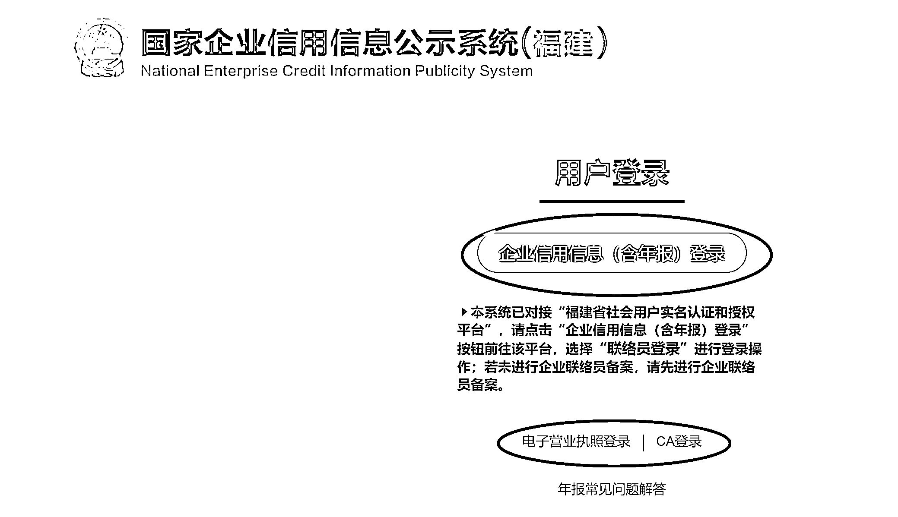
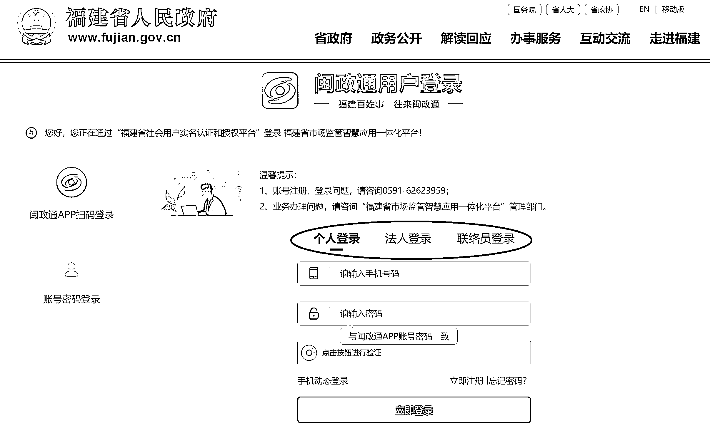
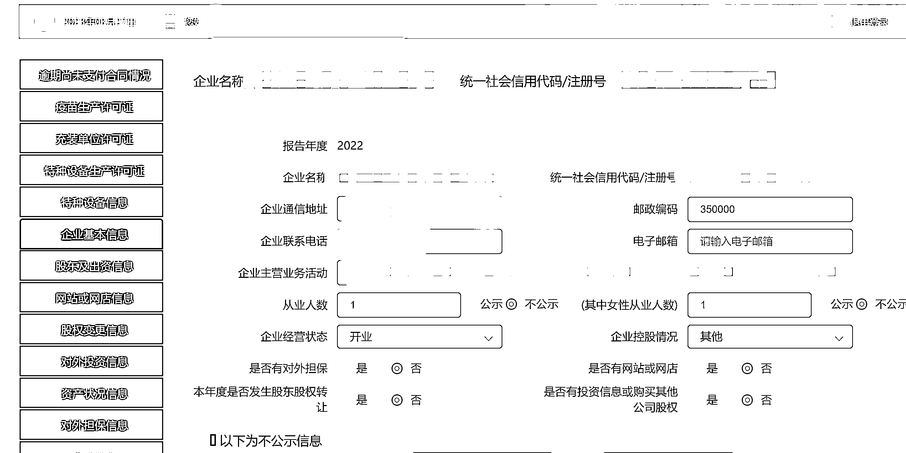
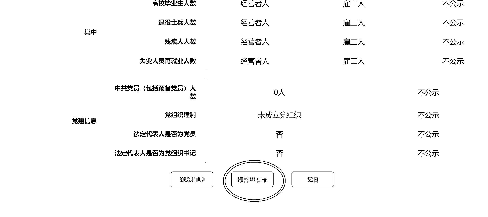

# 《营业执照不按时年检可能会受到的处罚》

> 原文：[`www.yuque.com/for_lazy/thfiu8/dln6oyuh9pe8bcoz`](https://www.yuque.com/for_lazy/thfiu8/dln6oyuh9pe8bcoz)

<ne-h2 id="e4c8ef38" data-lake-id="e4c8ef38"><ne-heading-ext><ne-heading-anchor></ne-heading-anchor><ne-heading-fold></ne-heading-fold></ne-heading-ext><ne-heading-content><ne-text id="u7b6ee7ae">(77 赞)《营业执照不按时年检可能会受到的处罚》</ne-text></ne-heading-content></ne-h2> <ne-p id="u446ca7e8" data-lake-id="u446ca7e8"><ne-text id="ucc5a353c">作者： 🌸🌸🌸</ne-text></ne-p> <ne-p id="u26d3b231" data-lake-id="u26d3b231"><ne-text id="ucb503d41">日期：2023-03-27</ne-text></ne-p> <ne-p id="uadf3a462" data-lake-id="uadf3a462"><ne-text id="u96bb50dd">2022 年 12 月 31 日之前有注册营业执照的朋友们注意啦！2022 年的营业执照年检要开始做了，需要在 2023 年 6 月 30 日前进行营业执照的年检！</ne-text></ne-p> <ne-p id="uc0f5853d" data-lake-id="uc0f5853d"><ne-text id="u31d44f36">大家好，我是马小婷，这是我加入星球写的第一篇文章。</ne-text></ne-p> <ne-p id="u1f95fb2f" data-lake-id="u1f95fb2f"><ne-text id="u7523272a">看了一篇《关于执照年报一个省钱，一个赚钱方法》，我觉得还是有必要跟大家说一下营业执照年检。</ne-text></ne-p> <ne-p id="u7488577b" data-lake-id="u7488577b"><ne-text id="u07691a0b">我在代理记账公司做过 3 年代理记账会计，每年都会做上百家营业执照年检，其实自己做年检步骤也不像大家想的那样复杂。</ne-text></ne-p> <ne-p id="ub895d7e6" data-lake-id="ub895d7e6"><ne-text id="ufbd98956">在生财这个圈子里，可能有不少需要用到营业执照的吧，营业执照是每年的 6 月底之前做上一年的营业执照年检（也可以叫工商年检），注意：个体户也是需要年检的哦！</ne-text></ne-p> <ne-p id="u587cad3d" data-lake-id="u587cad3d"><ne-text id="ua2fa81ce">如果不按时年检的话可能会受到以下处罚：</ne-text></ne-p> <ne-p id="u71c9fe15" data-lake-id="u71c9fe15"><ne-text id="ue23b0de1">1.企业未按时进行年报的，将被市监部门列入经营异常名录；若满 3 年企业还未移出的，将被列入严重违法失信企业名单；</ne-text></ne-p> <ne-p id="u85300aa1" data-lake-id="u85300aa1"><ne-text id="ue94f635b">2.被列入严重违法失信名单后，企业将不能贷款、投资、出入境、参与招投标、政府采购等，严重影响个人发展；</ne-text></ne-p> <ne-p id="ub6b1bb2d" data-lake-id="ub6b1bb2d"><ne-text id="u6bf27a3c">3.被列入严重违法失信名单后，企业法人等在进行注册新公司、经营、从业任职资格等将被限制；</ne-text></ne-p> <ne-p id="ud1caa1a5" data-lake-id="ud1caa1a5"><ne-text id="uc84c8b42">4.被列入严重违法失信名单后，在企业与他人合作时信用将会遭到质疑，严重影响公司的长远发展。</ne-text></ne-p> <ne-p id="u95097798" data-lake-id="u95097798"><ne-text id="u79e71828">其实有时候处理挺麻烦的，尤其是你的地址不是自己的，是买的、借的等等，被列入异常名录后，工商管理员可能会要下户看点，也就是去你的经营地址看看你是否在营业，可能还要看你的账本，假如你买的是虚假地址，后续可能还要去变更经营地址，所以最好还是按时年检！！！</ne-text></ne-p> <ne-p id="u5e42789f" data-lake-id="u5e42789f"><ne-text id="ue1215f01">话不多说，上步骤</ne-text> [<ne-text id="u27fef627">https://www.gsxt.gov.cn/index.html</ne-text>](https://www.gsxt.gov.cn/index.html)<ne-card data-card-name="image" data-card-type="inline" id="A20HO" data-event-boundary="card">  <ne-p id="ue5472657" data-lake-id="ue5472657"><ne-card data-card-name="image" data-card-type="inline" id="UE7ey" data-event-boundary="card">  <ne-p id="u10dc3380" data-lake-id="u10dc3380"><ne-card data-card-name="image" data-card-type="inline" id="JHSfx" data-event-boundary="card">  <ne-p id="ucf5768ef" data-lake-id="ucf5768ef"><ne-card data-card-name="image" data-card-type="inline" id="VhkNC" data-event-boundary="card">  <ne-p id="u09213abc" data-lake-id="u09213abc"><ne-card data-card-name="image" data-card-type="inline" id="cvQOR" data-event-boundary="card">  <ne-p id="u9675cb82" data-lake-id="u9675cb82"><ne-card data-card-name="image" data-card-type="inline" id="Al6ae" data-event-boundary="card">  <ne-p id="u4c61f015" data-lake-id="u4c61f015"><ne-card data-card-name="image" data-card-type="inline" id="ahrnV" data-event-boundary="card"></ne-card></ne-p> <ne-p id="u87e27569" data-lake-id="u87e27569"><ne-card data-card-name="image" data-card-type="inline" id="aq2QP" data-event-boundary="card">  <ne-p id="u8ab2bd88" data-lake-id="u8ab2bd88"><ne-card data-card-name="image" data-card-type="inline" id="FtYl9" data-event-boundary="card">  <ne-hole id="u0f6a2763" data-lake-id="u0f6a2763"><ne-card data-card-name="hr" data-card-type="block" id="ZCHpg" data-event-boundary="card"><ne-p id="u1f6f7f85" data-lake-id="u1f6f7f85"><ne-text id="u747e9922">评论区：</ne-text></ne-p> <ne-p id="uc1592843" data-lake-id="uc1592843"><ne-text id="ub5487ab3">🌸🌸🌸 : 最后最好再截个图留档，免得因为系统问题判定你没有年检，可以拿着图找管理员</ne-text> <ne-text id="u5db9fcac">正宇 : 这个实用</ne-text> <ne-text id="u1a97cb29">🌸🌸🌸 : 谢谢，能帮到大家我很开心[偷笑]</ne-text> <ne-text id="ub8752067">海之云 : 现在不叫年检，改为年度报告了</ne-text> <ne-text id="u0f15a8f2">general : 请教一下，个体户每年的年报，金额都写 0 有影响吗，我听说连续 3 年都写 0 有影响。如果写一点金额不会扣税吧</ne-text> <ne-text id="u3bf97040">wot : 请问下是否有网站或网店？要真实勾选吗</ne-text> <ne-text id="u92d6e078">大成冲冲冲 : 谢谢大佬，这几天天有第三方公司打电话给我，要我做审核，收费 100，这不就省下来了嘛~</ne-text></ne-p></ne-card></ne-hole></ne-card></ne-p></ne-card></ne-p></ne-card></ne-p></ne-card></ne-p></ne-card></ne-p></ne-card></ne-p></ne-card></ne-p></ne-card></ne-p>