# 《一个工具管理上百个社媒账号？指纹浏览器使用全攻略》

> 原文：[`www.yuque.com/for_lazy/thfiu8/fh0xq2lwakogf8q8`](https://www.yuque.com/for_lazy/thfiu8/fh0xq2lwakogf8q8)

<ne-h2 id="855dde05" data-lake-id="855dde05"><ne-heading-ext><ne-heading-anchor></ne-heading-anchor><ne-heading-fold></ne-heading-fold></ne-heading-ext><ne-heading-content><ne-text id="u32904895">(77 赞)《一个工具管理上百个社媒账号？指纹浏览器使用全攻略》</ne-text></ne-heading-content></ne-h2> <ne-p id="u9bd9933c" data-lake-id="u9bd9933c"><ne-text id="u6e8514fa">作者： 希声。</ne-text></ne-p> <ne-p id="uf8d4006f" data-lake-id="uf8d4006f"><ne-text id="u0703506d">日期：2023-03-27</ne-text></ne-p> <ne-p id="u5b13c69f" data-lake-id="u5b13c69f"><ne-card data-card-name="image" data-card-type="inline" id="Khp50" data-event-boundary="card">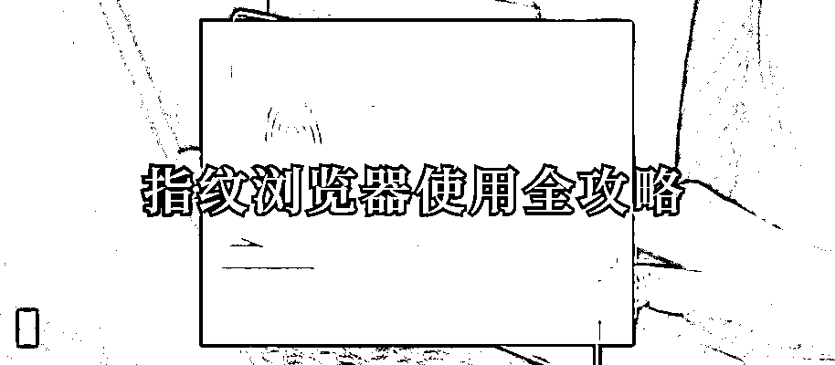  <ne-p id="u9e4429a9" data-lake-id="u9e4429a9"><ne-text id="u613f66e0">你还在用困扰怎么在一台电脑登录同平台多个账号？</ne-text></ne-p> <ne-p id="u4654608d" data-lake-id="u4654608d"><ne-text id="ud5116241">你还在用浏览器多开和插件的方式来实现账号隔离？</ne-text></ne-p> <ne-p id="u8ee08f8c" data-lake-id="u8ee08f8c"><ne-text id="u3f861c44">你还在困扰怎么一个账号一个环境一个网络？</ne-text></ne-p> <ne-p id="ue72258a0" data-lake-id="ue72258a0"><ne-text id="u3993e5cb">你还在困扰公司中多账号的信息安全问题？</ne-text></ne-p> <ne-p id="u2043e97f" data-lake-id="u2043e97f"><ne-text id="ubcfe597e">你还在困扰怎么在团队协作中更好地分配和管理账号？</ne-text></ne-p> <ne-p id="u30d3d8cf" data-lake-id="u30d3d8cf"><ne-text id="u97543bca">看完这篇文章相信就能解答以上的所有问题。</ne-text></ne-p> <ne-h1 id="72064d9d" data-lake-id="72064d9d"><ne-heading-ext><ne-heading-anchor></ne-heading-anchor><ne-heading-fold></ne-heading-fold></ne-heading-ext><ne-heading-content><ne-text id="uc883d676" ne-bold="true">本文目录：</ne-text></ne-heading-content></ne-h1> <ne-p id="u2ab82f3f" data-lake-id="u2ab82f3f"><ne-text id="u69c1369a" ne-underline="true">为什么要使用指纹浏览器？</ne-text></ne-p> <ne-p id="uc57b2109" data-lake-id="uc57b2109"><ne-text id="ucec053ff" ne-underline="true">有哪些账号隔离方案？</ne-text></ne-p> <ne-p id="u70f9f427" data-lake-id="u70f9f427"><ne-text id="u4c6909b7" ne-underline="true">什么是浏览器的指纹？指纹浏览器有什么用？</ne-text></ne-p> <ne-p id="u54ffb609" data-lake-id="u54ffb609"><ne-text id="u459bf1d9" ne-underline="true">有哪些指纹浏览器软件？有什么区别？</ne-text></ne-p> <ne-p id="ue0b94e7d" data-lake-id="ue0b94e7d"><ne-text id="u67d23440" ne-underline="true">什么是住宅 IP？什么是服务器 IP？什么是动态 IP？什么是动态住宅 IP？什么是手机 IP？</ne-text></ne-p> <ne-p id="u9087834a" data-lake-id="u9087834a"><ne-text id="ubf890f6a" ne-underline="true">不同的 IP 是怎么收费的？</ne-text></ne-p> <ne-p id="u2b4b9b3b" data-lake-id="u2b4b9b3b"><ne-text id="u4c7b46df" ne-underline="true">最简单的指纹浏览器使用方法的图文实操</ne-text></ne-p> <ne-p id="uab9dcb8f" data-lake-id="uab9dcb8f"><ne-text id="ue6e0fa88" ne-underline="true">指纹浏览器搭配动态 IP 的使用图文实操</ne-text></ne-p> <ne-p id="ucb268945" data-lake-id="ucb268945"><ne-text id="u14fbdd93" ne-underline="true">常见问题</ne-text></ne-p> <ne-p id="ud9f59279" data-lake-id="ud9f59279"><ne-card data-card-name="image" data-card-type="inline" id="qM32p" data-event-boundary="card">  <ne-h1 id="29261414" data-lake-id="29261414"><ne-heading-ext><ne-heading-anchor></ne-heading-anchor><ne-heading-fold></ne-heading-fold></ne-heading-ext><ne-heading-content><ne-text id="u0a119afe" ne-bold="true">为什么要使用指纹浏览器？</ne-text></ne-heading-content></ne-h1> <ne-p id="ua3f6ff69" data-lake-id="ua3f6ff69"><ne-text id="u9d3376cb">我们做跨境电商业务常见的几个场景是：</ne-text></ne-p> <ne-p id="uf6ae8a1c" data-lake-id="uf6ae8a1c"><ne-text id="ue86758bc">1.一台电脑要登录同个平台的不同店铺（如有多个亚马逊店铺需要登录）。</ne-text></ne-p> <ne-p id="u604fcd2b" data-lake-id="u604fcd2b"><ne-text id="u596fd384">2.一台电脑要登录不同平台的店铺（如有亚马逊店铺、速卖通店铺需要登录）。</ne-text></ne-p> <ne-p id="ucb500417" data-lake-id="ucb500417"><ne-text id="u3eb69444">3.一台电脑要登录同个社交平台的不同账号（如有多个 facebook 账号需要登录）。</ne-text></ne-p> <ne-p id="u9a6c4d46" data-lake-id="u9a6c4d46"><ne-text id="u2387dc37">4.一台电脑要登录不同社交平台的不同账号（如登录 facebook、Instagram、Twitter 等不同账号）。</ne-text></ne-p> <ne-p id="ud427abb2" data-lake-id="ud427abb2"><ne-text id="uef93a337">在上面假设的场景里面，风险最高，最需要注意的是 1 和 3 的场景，就是我们需要用一台电脑登录同个平台下的多个不同账号。</ne-text></ne-p> <ne-p id="u5930b642" data-lake-id="u5930b642"><ne-text id="u4143e5bd">因为大多数平台的都是不允许一个人拥有多个账号，所以我们需要让平台检测不到是同一个人在操作多个账号。.不仅仅是国外的平台账号，对于国内的一些平台账号也是有这方面的注意事项。</ne-text></ne-p> <ne-p id="u2363556a" data-lake-id="u2363556a"><ne-text id="u5cfaf550">那解决方案是什么呢？</ne-text></ne-p> <ne-p id="u7591619f" data-lake-id="u7591619f"><ne-text id="u1b1aa991">解决方案就是我们要把同个平台的不同账号做好隔离，用不同的浏览器+不同的 IP（IP 可以简单理解为一条宽带网络）来实现账号隔离。</ne-text></ne-p> <ne-p id="ue92f8603" data-lake-id="ue92f8603"><ne-text id="ua43ee630">每一个账号分配在一个单独的浏览器环境下，每一个浏览器环境再分配一个单独使用的 IP，那么简单来说，这些账号就是互相隔离的了，平台就无法识别到这些账号是在同一台电脑上的，或者说是同一跟网线上。</ne-text></ne-p> <ne-p id="uc6f85792" data-lake-id="uc6f85792"><ne-card data-card-name="image" data-card-type="inline" id="ysXFX" data-event-boundary="card">  <ne-h1 id="11a37591" data-lake-id="11a37591"><ne-heading-ext><ne-heading-anchor></ne-heading-anchor><ne-heading-fold></ne-heading-fold></ne-heading-ext><ne-heading-content><ne-text id="u12f44029" ne-bold="true">有哪些账号隔离方案？</ne-text></ne-heading-content></ne-h1> <ne-p id="ua8aaeff2" data-lake-id="ua8aaeff2"><ne-text id="ub7667d61">让我们来举个例子。</ne-text></ne-p> <ne-p id="ua337b874" data-lake-id="ua337b874"><ne-text id="u8c9c0749">假设，我有两个亚马逊店铺，为了防止店铺关联，那么常规做法就是：我需要买两台电脑 A 和 B，拉两条宽带 C 和 D，然后 A 电脑搭配 C 宽带，在上面登录一个店铺；B 电脑搭配 D 宽带，在上面登录另一个店铺。</ne-text></ne-p> <ne-p id="u8e253381" data-lake-id="u8e253381"><ne-text id="u4f6bbd07">这样虽然能做到账号的隔离，但问题也很明显：成本太高，而且操作起来也麻烦，我需要在不同的电脑上操作店铺。</ne-text></ne-p> <ne-p id="u0a1e3f65" data-lake-id="u0a1e3f65"><ne-text id="ua8c939e7">所以业内现在通用的解决方案有两种。</ne-text></ne-p> <ne-p id="u124d7490" data-lake-id="u124d7490"><ne-text id="u8ae9b028">第一种方案是用 VPS。就是找云服务商（比如阿里云，腾讯云），在上面租一台 Windows 系统的服务器（也可以理解为一台电脑），然后用自己的电脑远程操控这台服务器。</ne-text></ne-p> <ne-p id="ueba62df4" data-lake-id="ueba62df4"><ne-text id="u7e9ebad6">优点是也能做到隔离，浏览器环境和 IP 都不同。但缺点是 VPS 远程操作比较卡，使用体验差。</ne-text></ne-p> <ne-p id="uc1d8be1c" data-lake-id="uc1d8be1c"><ne-text id="uc9c5000c">第二种方案是用紫鸟浏览器。这是一个软件，在上面可以开出无数个互相隔离的浏览器环境，然后再给不同的浏览器环境配上一条专属的 IP 就可以了。</ne-text></ne-p> <ne-p id="u7ee38be5" data-lake-id="u7ee38be5"><ne-text id="u2478d830">优点是不卡顿，IP 可以在紫鸟上面直接购买，浏览器配 IP 的过程也很简单，价格也比一般的 vps 便宜些，而且可以设置账号权限，方便团队管理协作。</ne-text></ne-p> <ne-p id="u3338c36f" data-lake-id="u3338c36f"><ne-text id="u4f19bae4">目前来说，第二种方案就是业内一般通用的解决方案。</ne-text></ne-p> <ne-p id="ud13ba598" data-lake-id="ud13ba598"><ne-text id="ud82436b1">但是紫鸟浏览器也有个很明显的问题，因为政策原因，是不能上 Facebook、谷歌等国内禁止的平台。</ne-text></ne-p> <ne-p id="u0c9ad86b" data-lake-id="u0c9ad86b"><ne-card data-card-name="image" data-card-type="inline" id="noExB" data-event-boundary="card">  <ne-h1 id="94f71f04" data-lake-id="94f71f04"><ne-heading-ext><ne-heading-anchor></ne-heading-anchor><ne-heading-fold></ne-heading-fold></ne-heading-ext><ne-heading-content><ne-text id="ua910430d" ne-bold="true">什么是浏览器的指纹？指纹浏览器有什么用？</ne-text></ne-heading-content></ne-h1> <ne-p id="u15e2aa20" data-lake-id="u15e2aa20"><ne-text id="u40351d2b">浏览器指纹是一项技术，它能够通过浏览器的各种配置和设置（浏览器指纹辨识的信息可以是 UA、时区、地理位置、IP 或者是使用的语言）来识别用户的浏览器，从而区分不同的用户。就像我们手上的指纹一样，浏览器指纹也具有辨识度，只不过它只能辨别浏览器。</ne-text></ne-p> <ne-p id="u53ec8f1d" data-lake-id="u53ec8f1d"><ne-text id="u77615591">浏览器指纹有什么用呢？它可以记录用户的 UA、时区、地理位置、IP 地址、使用的语言等等，这些信息都能够帮助网站精准地识别和标记用户，从而实现个性化推送和广告定向。</ne-text></ne-p> <ne-p id="u4740e7c1" data-lake-id="u4740e7c1"><ne-text id="uf6ee3824">所以简单来说，如果我们在一个浏览器上登录同个平台的多个账号，比如在一个浏览器上登录两个亚马逊店铺，那么亚马逊公司是可以轻松地通过浏览器的指纹信息和 ip 信息来判断出这两个店铺是在同一台电脑上，那么就会导致店铺账号关联，从而导致被封店。</ne-text></ne-p> <ne-p id="ua1de8558" data-lake-id="ua1de8558"><ne-text id="u462bf55f">而指纹浏览器是能够同时开出多个浏览器环境，并且自定义修改浏览器的指纹信息，这样就可以在同一设备上使用多个账号，而不用担心被账号的关联问题了。</ne-text></ne-p> <ne-p id="udbb10e3b" data-lake-id="udbb10e3b"><ne-text id="u740b5e9d">同时指纹浏览器还有个很大的用处就是能用来做团队协作：一个浏览器环境是可以多人在不同电脑上同时打开，而账号信息可以直接保存在浏览器环境内。</ne-text></ne-p> <ne-p id="uc56de478" data-lake-id="uc56de478"><ne-text id="u0dd83cea" ne-bold="true">在进行下一步的前，有必要说明一下：不同的平台对于安全风控的强弱是不一样的，不是说做好环境和 ip 隔离就一定能防止账号关联，只是说如果想实现账号隔离的目的，那么这就是最基本的要求。</ne-text></ne-p> <ne-p id="uac036a56" data-lake-id="uac036a56"><ne-card data-card-name="image" data-card-type="inline" id="S0vq7" data-event-boundary="card">  <ne-h1 id="afb3458f" data-lake-id="afb3458f"><ne-heading-ext><ne-heading-anchor></ne-heading-anchor><ne-heading-fold></ne-heading-fold></ne-heading-ext><ne-heading-content><ne-text id="u1c98357a" ne-bold="true">有哪些指纹浏览器软件？有什么区别？</ne-text></ne-heading-content></ne-h1> <ne-p id="u97dddde7" data-lake-id="u97dddde7"><ne-text id="u29a5f58d">常见的指纹浏览器软件有：紫鸟浏览器，比特浏览器，adspower，Hubstudio，vmlogin 浏览器，候鸟浏览器，悦互联等等。</ne-text></ne-p> <ne-p id="ub0f77206" data-lake-id="ub0f77206"><ne-text id="u742d5963">比特浏览器，adspower，这两个软件我曾经使用过，悦互联、紫鸟浏览器和 Hubstudio 是我的必备软件，vmlogin 浏览器，候鸟浏览器我没有使用过。</ne-text></ne-p> <ne-p id="u92c860fe" data-lake-id="u92c860fe"><ne-text id="u94d4cba5">下面是我简单的调研情况，数据可能会因为软件服务商的调整而出现出入，所以仅供参考，具体要使用前可以咨询他们客服或者在官网查询。</ne-text></ne-p> <ne-p id="u0672df5a" data-lake-id="u0672df5a"><ne-card data-card-name="image" data-card-type="inline" id="cx3ck" data-event-boundary="card">  <ne-p id="u05b30e35" data-lake-id="u05b30e35"><ne-text id="u53a2b685">上面就是这些软件的一些调研情况。</ne-text></ne-p> <ne-p id="u3c0e6c39" data-lake-id="u3c0e6c39"><ne-text id="u26be27a6">在具体的技术层面我不做评判，因为我也不够专业。</ne-text></ne-p> <ne-p id="u9a295ae0" data-lake-id="u9a295ae0"><ne-text id="u9c540298">如果要给出我的软件使用建议就是：如果你是个人使用且账号不多的情况下，这些软件的使用体验都差不多。这些软件之间比较明显的差异是表现在自动化的功能，API，增值服务（比如 ip 服务等），浏览器的内核类型，团队协作的成员数量和易用性上面会有一些差异。</ne-text></ne-p> <ne-p id="u15bdb69d" data-lake-id="u15bdb69d"><ne-card data-card-name="image" data-card-type="inline" id="wfOyE" data-event-boundary="card">  <ne-h1 id="0701614c" data-lake-id="0701614c"><ne-heading-ext><ne-heading-anchor></ne-heading-anchor><ne-heading-fold></ne-heading-fold></ne-heading-ext><ne-heading-content><ne-text id="uaa65a828" ne-bold="true">什么是住宅 IP？什么是服务器 IP？什么是动态 IP？什么是动态住宅 IP？什么是手机 IP？</ne-text></ne-heading-content></ne-h1> <ne-p id="ue56aa142" data-lake-id="ue56aa142"><ne-text id="ucee5e6c4">为了更好地了解接下来的内容，我们需要先科普下什么是住宅 IP？什么是服务器 IP？什么是动态 IP？什么是动态住宅 IP？什么是手机 IP？</ne-text></ne-p> <ne-p id="uddccdb1c" data-lake-id="uddccdb1c"><ne-text id="ue45bd11f">直接上专业的资料（来自于网络）来解释：</ne-text></ne-p> <ne-p id="u8693e433" data-lake-id="u8693e433"><ne-text id="ue4b92267">住宅 IP 和家庭宽带 IP 是一样的，只是在不同的地方叫法不同。</ne-text></ne-p> <ne-p id="ufac20646" data-lake-id="ufac20646"><ne-text id="u687b9321">住宅 IP 是由互联网网络运营商（ISP）提供的 IP 地址。所以我们一般个人用的就是这种 IP 地址。</ne-text></ne-p> <ne-p id="u60d0af02" data-lake-id="u60d0af02"><ne-text id="ue9b4d8b5">住宅 IP 是具有地址具体地理位置的 IP。但这个住宅 IP 地址并不是固定的，因为互联网提供商一般会动态分配这个 IP 地址。一般会因为路由器重启，网络运营服务商会重新分配一个住宅 IP 地址。</ne-text></ne-p> <ne-p id="u4942737f" data-lake-id="u4942737f"><ne-text id="u48ee45d6">住宅 IP 地址在实际分配中，并不是一定是用户所在地域的 IP 地址。这是因为世界上的 IP 地址是有限的。如果您所在的地区，上网的设备比较多，那么就可能分配一个其它非你本地区的 IP 给你。</ne-text></ne-p> <ne-p id="u5dd20545" data-lake-id="u5dd20545"><ne-text id="ub60ab832">综上所述，家庭的住宅 IP 地址也不是固定的，是随着时间和地域轮转的，所以家庭 IP 又称动态住宅 IP。</ne-text></ne-p> <ne-p id="u8072cdfe" data-lake-id="u8072cdfe"><ne-text id="ufd5c3c4d">数据中心 IP 也被称为机房 IP 或者服务器 IP，三者是一样的，只是叫法不同。</ne-text></ne-p> <ne-p id="u07e1399e" data-lake-id="u07e1399e"><ne-text id="u0b42b732">机房 IP 就是由大量服务器组成的机房中心，机房 IP 一般都是来自 IDC 机房的，来自企业专线、云服务器等 IP 地址。</ne-text></ne-p> <ne-p id="u353887e1" data-lake-id="u353887e1"><ne-text id="uade16d8f">数据中心 IP 具有 IP 固定、稳定在线的特点。但是机房的号段一般是连号的，无法灵活变更。在具体业务中，容易被风控。</ne-text></ne-p> <ne-p id="u97fb3491" data-lake-id="u97fb3491"><ne-text id="u1a9d5957">静态住宅 IP 就是 IP 地址是固定的，不是动态的。需要向当地的运营商单独申请，一般供企业用户使用，价格比较贵，也叫专线，并不适合民用。</ne-text></ne-p> <ne-p id="u1a264565" data-lake-id="u1a264565"><ne-text id="u8cb2d13a">动态住宅 IP 的安全可靠性是要高于静态住宅 IP 的。因为动态住宅 IP 就是家庭宽带 IP。在实际的使用中，更加的安全。</ne-text></ne-p> <ne-p id="ub07d363c" data-lake-id="ub07d363c"><ne-text id="u51a2c823">手机 IP 是最高质量的 IP，来自真实用户的手机和基站的 P，就和我们平常手机上网的 IP 样，更能代表真人环境。</ne-text></ne-p> <ne-p id="u0add6441" data-lake-id="u0add6441"><ne-text id="u5a94f538">动态手机 IP 就是可以自动变化的手机 IP。</ne-text></ne-p> <ne-p id="u02e3da27" data-lake-id="u02e3da27"><ne-text id="u54a8d1b3">专业的解释就到这里了。</ne-text></ne-p> <ne-p id="u757377ee" data-lake-id="u757377ee"><ne-text id="uf76bf737">简单总结，IP 的安全性（就是不容易引起风控的可能性）排行是：</ne-text></ne-p> <ne-p id="u634cd116" data-lake-id="u634cd116"><ne-text id="u0f6750b5">手机 IP>住宅 IP>服务器 IP</ne-text></ne-p> <ne-p id="u7587ef0c" data-lake-id="u7587ef0c"><ne-text id="uc4eb955f">一般来说，我们日常运营使用，只要用到住宅 IP 或者服务器 IP 即可。服务器 IP 是最便宜的，动态住宅 IP 就要贵一些，静态住宅 IP 更贵。</ne-text></ne-p> <ne-p id="u309e3d2f" data-lake-id="u309e3d2f"><ne-text id="u90c1792e">具体选择什么类似的 IP 是要根据业务环境和不同平台的风控程度来选择的。</ne-text></ne-p> <ne-p id="u0ebea17e" data-lake-id="u0ebea17e"><ne-text id="u05d37cfd">同时说个重点避坑点：市面上非常多号称是静态住宅 IP 的，其实都是服务器 IP 冒充的，真正的静态住宅 IP 一般很少有服务商提供，同时价格也较贵。</ne-text></ne-p> <ne-p id="ud6b06f7a" data-lake-id="ud6b06f7a"><ne-card data-card-name="image" data-card-type="inline" id="jnGlY" data-event-boundary="card">  <ne-h1 id="f97083b4" data-lake-id="f97083b4"><ne-heading-ext><ne-heading-anchor></ne-heading-anchor><ne-heading-fold></ne-heading-fold></ne-heading-ext><ne-heading-content><ne-text id="u43efa6dc" ne-bold="true">不同的 IP 是怎么收费的？</ne-text></ne-heading-content></ne-h1> <ne-p id="u0724baae" data-lake-id="u0724baae"><ne-text id="u559ab9d3">不同的 IP 服务商收费标准都不一样，下面举例的是一般情况。</ne-text></ne-p> <ne-p id="u0cb97d91" data-lake-id="u0cb97d91"><ne-text id="ude94426f">静态服务器 IP 一般是按月收费，一个月一两美金到几十美金的都有。</ne-text></ne-p> <ne-p id="ua46004a3" data-lake-id="ua46004a3"><ne-text id="ue602fd36">动态住宅 IP 一般是按消耗的流量大小收费，比如一个 G 的流量 10 美金。</ne-text></ne-p> <ne-p id="u3ca7f98d" data-lake-id="u3ca7f98d"><ne-text id="u6c32e831">静态住宅 IP 一般是按月收费，再加流量收费，比如一个月 20 美金，同时消耗一个 G 的流量 25 美金。</ne-text></ne-p> <ne-p id="u51031efd" data-lake-id="u51031efd"><ne-card data-card-name="image" data-card-type="inline" id="krRsU" data-event-boundary="card">  <ne-h1 id="236b66c5" data-lake-id="236b66c5"><ne-heading-ext><ne-heading-anchor></ne-heading-anchor><ne-heading-fold></ne-heading-fold></ne-heading-ext><ne-heading-content><ne-text id="u164927cd" ne-bold="true">最简单的指纹浏览器使用方法的图文实操</ne-text></ne-heading-content></ne-h1> <ne-p id="u08293bb0" data-lake-id="u08293bb0"><ne-text id="u6e299185">前面我们提到，指纹浏览器需要搭配 ip 使用（有的软件不搭配也可以使用，但这是就是默认使用本地的网络），那么浏览器环境怎么搭配 ip 呢？</ne-text></ne-p> <ne-p id="ud69f7b6b" data-lake-id="ud69f7b6b"><ne-text id="u9370a2ce">最简单的方式就是购买一个云服务器，然后给每个浏览器环境配一个云服务器的 ip 就行。</ne-text></ne-p> <ne-p id="ucf87c635" data-lake-id="ucf87c635"><ne-text id="ue219bb8e">云服务器常厂商能提供的 ip 地点和收费情况各有不同。</ne-text></ne-p> <ne-p id="u2242d29d" data-lake-id="u2242d29d"><ne-text id="u80c004c2">常见的云服务如：阿里云、腾讯云、ucloud、华为云、亚马逊云、谷歌云。</ne-text></ne-p> <ne-p id="u5d7c562e" data-lake-id="u5d7c562e"><ne-text id="ude333326">下面我们以 adspower 这个指纹浏览器软件和阿里云的美国服务器来具体实操怎么使用。</ne-text></ne-p> <ne-p id="u94750875" data-lake-id="u94750875"><ne-text id="uc95c07bc">需要注意的是，下面演示的过程用的是 ssh 的链接方式，这并不是很好的一种链接方式（用久了可能会出现连不上的情况，具体原因就不展开说了），但是因为比较简单易用，所以可以当做新手上路的一种方式。</ne-text></ne-p> <ne-p id="u61317d15" data-lake-id="u61317d15"><ne-text id="ua739731f">进入官网，选择云服务器。</ne-text></ne-p> <ne-p id="u620566a6" data-lake-id="u620566a6"><ne-card data-card-name="image" data-card-type="inline" id="RSQvM" data-event-boundary="card">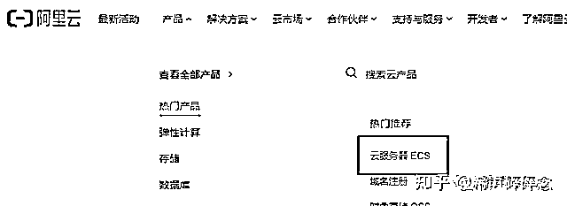  <ne-p id="u525c8913" data-lake-id="u525c8913"><ne-card data-card-name="image" data-card-type="inline" id="yKpUg" data-event-boundary="card">  <ne-p id="ubc843b39" data-lake-id="ubc843b39"><ne-text id="u794ca5dd">选择你需要的地区，配置选择最低就好了。</ne-text></ne-p> <ne-p id="u70c38b9d" data-lake-id="u70c38b9d"><ne-card data-card-name="image" data-card-type="inline" id="KxHLx" data-event-boundary="card">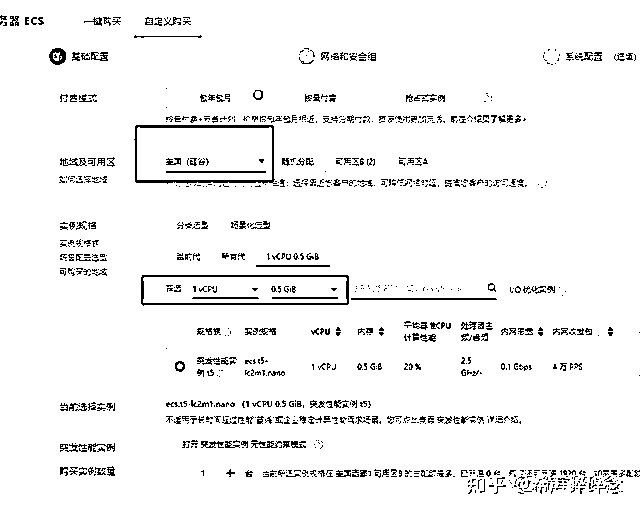  <ne-p id="u9b16e930" data-lake-id="u9b16e930"><ne-text id="uc560c221">镜像这里选择 CentOS。</ne-text></ne-p> <ne-p id="ub3487350" data-lake-id="ub3487350"><ne-card data-card-name="image" data-card-type="inline" id="AUPqq" data-event-boundary="card">  <ne-p id="u38cc5eda" data-lake-id="u38cc5eda"><ne-text id="u57a2a793">然后选择下一步。</ne-text></ne-p> <ne-p id="ub48cf89b" data-lake-id="ub48cf89b"><ne-card data-card-name="image" data-card-type="inline" id="Cfs2G" data-event-boundary="card">  <ne-p id="u84f182ac" data-lake-id="u84f182ac"><ne-text id="u7696ce1f">这里没有什么要设置的。</ne-text></ne-p> <ne-p id="u4da4e604" data-lake-id="u4da4e604"><ne-text id="ubd8d830e">我一般选择按照固定带宽。</ne-text></ne-p> <ne-p id="u15e5e670" data-lake-id="u15e5e670"><ne-card data-card-name="image" data-card-type="inline" id="oa9ns" data-event-boundary="card">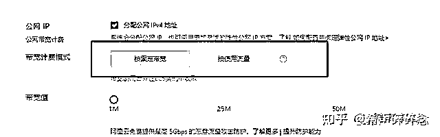  <ne-p id="u7bba9ee7" data-lake-id="u7bba9ee7"><ne-text id="u1905b137">然后选择下一步。</ne-text></ne-p> <ne-p id="ua8e9995f" data-lake-id="ua8e9995f"><ne-card data-card-name="image" data-card-type="inline" id="BYkDj" data-event-boundary="card">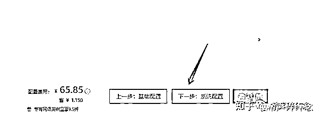  <ne-p id="u460a9a6a" data-lake-id="u460a9a6a"><ne-text id="u824c2f41">这里要选择自定义密码，记住你设定的密码。</ne-text></ne-p> <ne-p id="u84bab2d6" data-lake-id="u84bab2d6"><ne-text id="u395d692d">至于实例名称和主机名，按照你自己的喜好命名即可。</ne-text></ne-p> <ne-p id="u7d6567b8" data-lake-id="u7d6567b8"><ne-card data-card-name="image" data-card-type="inline" id="xeNED" data-event-boundary="card">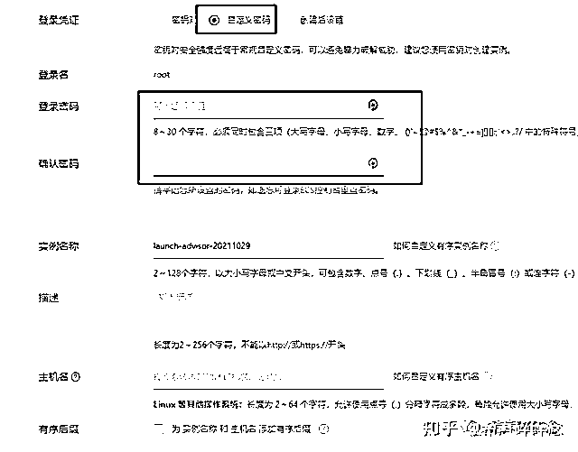  <ne-p id="u28073203" data-lake-id="u28073203"><ne-text id="ud0e01b4d">这一步我一般不操作什么，直接点下一步。</ne-text></ne-p> <ne-p id="u7aa258e2" data-lake-id="u7aa258e2"><ne-card data-card-name="image" data-card-type="inline" id="r3Idn" data-event-boundary="card">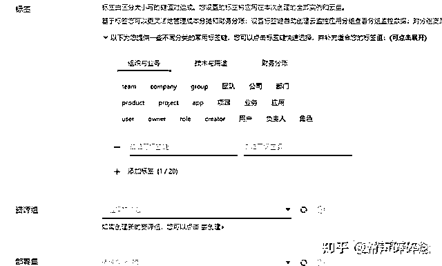  <ne-p id="u2a05408e" data-lake-id="u2a05408e"><ne-text id="ub27fbfa1">然后选择你喜欢的付费周期，付款购买即可。</ne-text></ne-p> <ne-p id="u9141f608" data-lake-id="u9141f608"><ne-text id="ued95d1b9">然后回到我们的控制台。</ne-text></ne-p> <ne-p id="ud803b21c" data-lake-id="ud803b21c"><ne-card data-card-name="image" data-card-type="inline" id="uYVVn" data-event-boundary="card">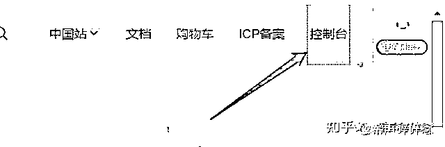  <ne-p id="uc680aa63" data-lake-id="uc680aa63"><ne-card data-card-name="image" data-card-type="inline" id="CBxkx" data-event-boundary="card">  <ne-p id="u95d07c53" data-lake-id="u95d07c53"><ne-text id="u30424ded">就能看到刚刚购买的服务器，把公网 ip 复制下来备用。</ne-text></ne-p> <ne-p id="ue0997fe8" data-lake-id="ue0997fe8"><ne-card data-card-name="image" data-card-type="inline" id="nlc8Z" data-event-boundary="card">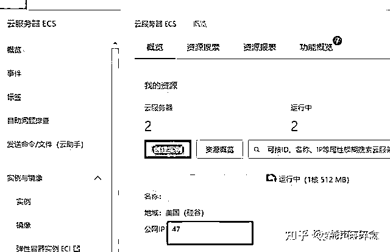  <ne-p id="uf0f5e4cc" data-lake-id="uf0f5e4cc"><ne-text id="uf39ad38b">我们需要的其实就三个数据：公网 ip、服务器账号、服务器密码。</ne-text></ne-p> <ne-p id="u4f3d9b47" data-lake-id="u4f3d9b47"><ne-text id="u5e9588f5">在上面设置密码的位置，我们能看到这个服务器默认的账号是：root。</ne-text></ne-p> <ne-p id="u0f4e88b3" data-lake-id="u0f4e88b3"><ne-text id="ubc4ec9aa">密码就是我们自己在前面设定的。</ne-text></ne-p> <ne-p id="u530f5ee4" data-lake-id="u530f5ee4"><ne-card data-card-name="image" data-card-type="inline" id="hlMqk" data-event-boundary="card">  <ne-p id="u752a8de3" data-lake-id="u752a8de3"><ne-text id="u4f969781">如果你是在腾讯云买服务器，整个操作流程也是一个道理：选择你想要的 ip 所在的国家/地区。然后选择 CentOS 镜像（或者说是服务器的系统）。设置好密码（记得看清楚服务器的登录名，一般都是 root）就可以。选择最低的配置，然后付款购买。</ne-text></ne-p> <ne-p id="u8e4c438d" data-lake-id="u8e4c438d"><ne-text id="u3b61a808">之后就比较简单了，到</ne-text>[<ne-text id="u5b0e6467">https://www.adspower.net/</ne-text>](https://www.adspower.net)<ne-text id="u03265a78">官网下载软件。</ne-text></ne-p> <ne-p id="u05d9761e" data-lake-id="u05d9761e"><ne-text id="u30a85308">注册账号登陆。</ne-text></ne-p> <ne-p id="u57eb23fd" data-lake-id="u57eb23fd"><ne-text id="ub26d70cc">选择导入。</ne-text></ne-p> <ne-p id="u2180915b" data-lake-id="u2180915b"><ne-card data-card-name="image" data-card-type="inline" id="hKxYS" data-event-boundary="card">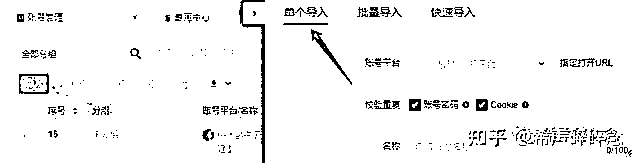  <ne-p id="u24a6cf6b" data-lake-id="u24a6cf6b"><ne-text id="u079e8f33">选择账号的平台。比如 facebook。</ne-text></ne-p> <ne-p id="uda155b4e" data-lake-id="uda155b4e"><ne-text id="u69e26189">可以提前把 facebook 的账号密码输入在“用户账号”，“用户密码”那一栏。</ne-text></ne-p> <ne-p id="u5b0f18a8" data-lake-id="u5b0f18a8"><ne-text id="ucc815c04">“浏览器指纹”下面的设置可以不用去改动。</ne-text></ne-p> <ne-p id="ucc8a0e19" data-lake-id="ucc8a0e19"><ne-card data-card-name="image" data-card-type="inline" id="ZZBO7" data-event-boundary="card">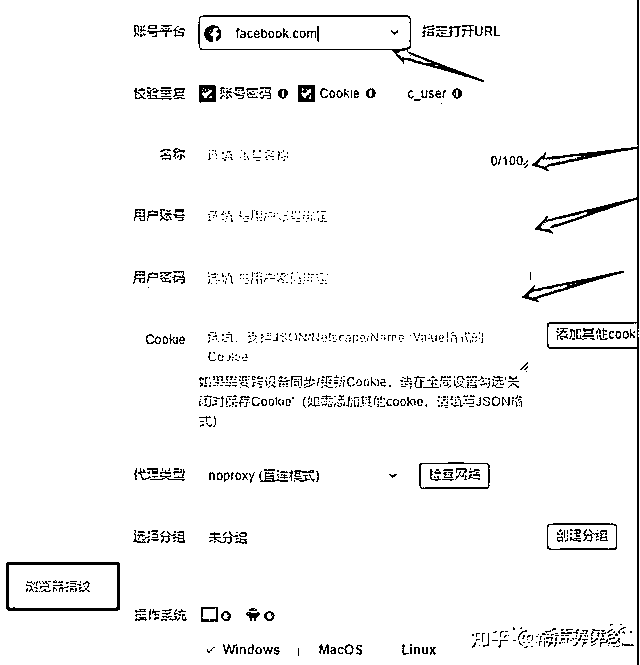  <ne-p id="udab9e610" data-lake-id="udab9e610"><ne-text id="ud802fb0a">选择 SSH 的代理模式。</ne-text></ne-p> <ne-p id="u0b427c84" data-lake-id="u0b427c84"><ne-card data-card-name="image" data-card-type="inline" id="trShC" data-event-boundary="card">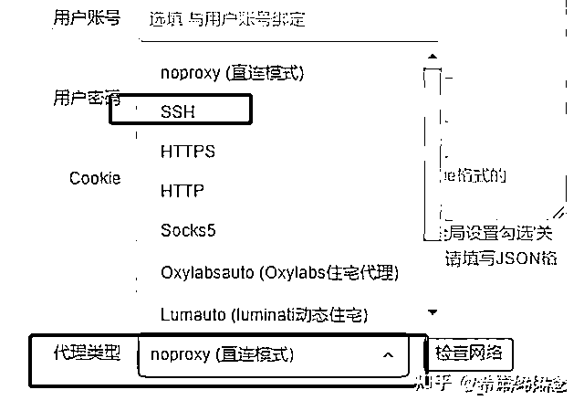  <ne-p id="u2af70236" data-lake-id="u2af70236"><ne-text id="u0f412d35">我们刚才搜集的三个数据按照下面的方式填写。</ne-text></ne-p> <ne-p id="u52cb6264" data-lake-id="u52cb6264"><ne-card data-card-name="image" data-card-type="inline" id="oRJRp" data-event-boundary="card">  <ne-p id="u00997fd0" data-lake-id="u00997fd0"><ne-text id="uf71b07ad">点击右侧的“检查代理”。</ne-text></ne-p> <ne-p id="u03b6ff31" data-lake-id="u03b6ff31"><ne-card data-card-name="image" data-card-type="inline" id="McVSx" data-event-boundary="card">  <ne-p id="u16c57a26" data-lake-id="u16c57a26"><ne-text id="u6460878a">如果显示测试成功，那么点击保存即可。然后回到主页点击“打开”可以登陆这个浏览器啦。</ne-text></ne-p> <ne-p id="uef795cae" data-lake-id="uef795cae"><ne-card data-card-name="image" data-card-type="inline" id="hIv9b" data-event-boundary="card">  <ne-p id="u13820a93" data-lake-id="u13820a93"><ne-text id="ud753dba2">浏览器的使用方法和一个普通的浏览器没什么太大的区别。</ne-text></ne-p> <ne-p id="ua7c15f90" data-lake-id="ua7c15f90"><ne-card data-card-name="image" data-card-type="inline" id="Bff9j" data-event-boundary="card">  <ne-h1 id="36da4102" data-lake-id="36da4102"><ne-heading-ext><ne-heading-anchor></ne-heading-anchor><ne-heading-fold></ne-heading-fold></ne-heading-ext><ne-heading-content><ne-text id="u87b5debf" ne-bold="true">指纹浏览器搭配动态 IP 的使用图文实操</ne-text></ne-heading-content></ne-h1> <ne-p id="uc6b877e9" data-lake-id="uc6b877e9"><ne-text id="u60e434fb">如何用最低成本来运营上百个社媒账号？</ne-text></ne-p> <ne-p id="u97ab47f5" data-lake-id="u97ab47f5"><ne-text id="u55ebf9f8">最低成本的做法是：用动态 ip+指纹浏览器。</ne-text></ne-p> <ne-p id="u92315a7c" data-lake-id="u92315a7c"><ne-text id="u7dd8ce75">能提供动态 IP 的服务商很多。这里就不举例说了，我们直接以 hubstudio 指纹浏览器和 IProayl 这家 IP 服务商为例，简单说下怎么使用。</ne-text></ne-p> <ne-p id="u137909f9" data-lake-id="u137909f9"><ne-text id="uf568a19d">首先，下载 hubstudio（网址</ne-text>[<ne-text id="u7bec10d5">hubstudio.cn</ne-text>](http://hubstudio.cn)<ne-text id="u5017dd99">）软件并注册，同时注册 IProyal（网址</ne-text>[<ne-text id="ud37c82b2">IProyal.com</ne-text>](http://IProyal.com)<ne-text id="u9060309d">）账号并充值。</ne-text></ne-p> <ne-p id="ufd88c001" data-lake-id="ufd88c001"><ne-text id="ua931c0dd">打开 hubstudio，新建一个环境。</ne-text></ne-p> <ne-p id="ub5992550" data-lake-id="ub5992550"><ne-text id="u74680075">新建一个环境可以理解为就是新建了一个已经被隔离的浏览器环境。</ne-text></ne-p> <ne-p id="u4100e0e1" data-lake-id="u4100e0e1"><ne-card data-card-name="image" data-card-type="inline" id="GFCNG" data-event-boundary="card">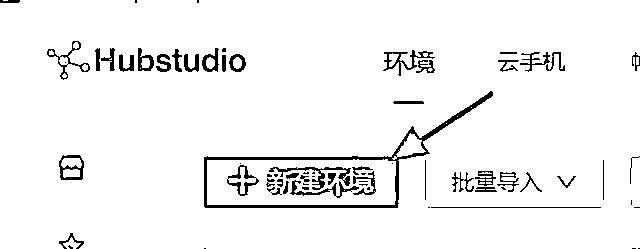  <ne-p id="u83ca8c86" data-lake-id="u83ca8c86"><ne-text id="ucc225165">环境名称自己填写，其他内容根据需要自己设定，不设定按默认也是可以的。</ne-text></ne-p> <ne-p id="u3e8e52fc" data-lake-id="u3e8e52fc"><ne-card data-card-name="image" data-card-type="inline" id="dCYmb" data-event-boundary="card">  <ne-p id="u2b45d7b5" data-lake-id="u2b45d7b5"><ne-text id="u38fa610e">进入代理设置这里，这里就是设置 IP 了。</ne-text></ne-p> <ne-p id="u80c93c41" data-lake-id="u80c93c41"><ne-text id="u56f271d8">一般来说，所用的代理类型主要有 http、https，socks5 这三种，具体选那种看 IP 服务商提供的链接方式是哪种。</ne-text></ne-p> <ne-p id="u88a1e44e" data-lake-id="u88a1e44e"><ne-text id="u823712ce">使用方式有两种：按静态 IP 规则使用和按动态 IP 规则使用。如果我们要用的是动态住宅 IP，那这里就要选择“按动态 IP 规则使用”，如果我们要用的是服务器 IP（一般的服务器 IP 是不会变的，除非购买的就是动态服务器 IP），那就要选择“按静态 IP 规则使用”。</ne-text></ne-p> <ne-p id="u73a6cf2c" data-lake-id="u73a6cf2c"><ne-card data-card-name="image" data-card-type="inline" id="Bm0jk" data-event-boundary="card">  <ne-p id="u61a49dab" data-lake-id="u61a49dab"><ne-card data-card-name="image" data-card-type="inline" id="aSDMp" data-event-boundary="card">  <ne-p id="u40e282c1" data-lake-id="u40e282c1"><ne-text id="u7d58cd45">这里我们以动态住宅 IP 来举例。</ne-text></ne-p> <ne-p id="ubbacecbe" data-lake-id="ubbacecbe"><ne-text id="u85a2cb97">我们需要先进入 IProyal，选择轮转住宅代理（就是动态住宅 IP 的意思）。</ne-text></ne-p> <ne-p id="ud27946bb" data-lake-id="ud27946bb"><ne-card data-card-name="image" data-card-type="inline" id="Pyjsu" data-event-boundary="card">  <ne-p id="uad2e968c" data-lake-id="uad2e968c"><ne-text id="u623c34cb">使用前要先点“创建新订单”，先购买 1 个 G 的流量。</ne-text></ne-p> <ne-p id="u38698063" data-lake-id="u38698063"><ne-text id="u9987d92f">购买之后，我们就可以先选我们要的住宅 IP 的所在地区。</ne-text></ne-p> <ne-p id="uca52f576" data-lake-id="uca52f576"><ne-card data-card-name="image" data-card-type="inline" id="toTq0" data-event-boundary="card">  <ne-p id="ub57110b1" data-lake-id="ub57110b1"><ne-text id="u81d8b1ef">这里我们一般选粘性 IP。</ne-text></ne-p> <ne-p id="u56b99a64" data-lake-id="u56b99a64"><ne-card data-card-name="image" data-card-type="inline" id="kgCkp" data-event-boundary="card">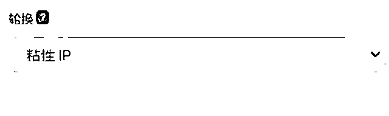  <ne-p id="uc351c7cb" data-lake-id="uc351c7cb"><ne-text id="u3818e01f">然后这里选 24 时。</ne-text></ne-p> <ne-p id="ub947d25e" data-lake-id="ub947d25e"><ne-text id="u6a96c02a">意思就是一个 IP 分配给我们之后，一般在 24h 之内，这个 IP 是不会变动的。</ne-text></ne-p> <ne-p id="ua05c4a89" data-lake-id="ua05c4a89"><ne-card data-card-name="image" data-card-type="inline" id="brV7g" data-event-boundary="card">  <ne-p id="ue2faac28" data-lake-id="ue2faac28"><ne-text id="u806a2ec0">输入方式可以选 http/https 或者 socks5 都可以。</ne-text></ne-p> <ne-p id="u120fa54d" data-lake-id="u120fa54d"><ne-card data-card-name="image" data-card-type="inline" id="CGvrG" data-event-boundary="card">  <ne-p id="u74c953df" data-lake-id="u74c953df"><ne-text id="u6d1c8a22">然后，往下滑，格式这里我们可以选择下面这种。</ne-text></ne-p> <ne-p id="u6cc8a87e" data-lake-id="u6cc8a87e"><ne-card data-card-name="image" data-card-type="inline" id="SqRGa" data-event-boundary="card">  <ne-p id="u1487f9a3" data-lake-id="u1487f9a3"><ne-text id="u3891ec16">然后我们就能看到这样一串的数字和密码的组合信息。</ne-text></ne-p> <ne-p id="u5c483e47" data-lake-id="u5c483e47"><ne-text id="u640e76d9">包含了代理主机，代理端口，代理账号用户名，代理密码四种信息。</ne-text></ne-p> <ne-p id="ua8bac66f" data-lake-id="ua8bac66f"><ne-card data-card-name="image" data-card-type="inline" id="TZjht" data-event-boundary="card">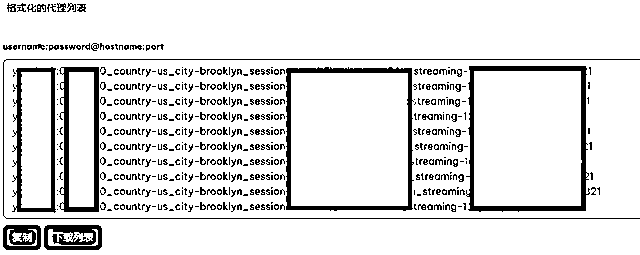  <ne-p id="u156bc17d" data-lake-id="u156bc17d"><ne-text id="udcc5edff">默认是帮我们生成了十组的信息，这十组的信息就可以分别用在十个浏览器环境里面。</ne-text></ne-p> <ne-p id="u8b8b2c9d" data-lake-id="u8b8b2c9d"><ne-text id="u97578bcb">如果你需要的更多，就生成更多的信息即可。</ne-text></ne-p> <ne-p id="u21d024cd" data-lake-id="u21d024cd"><ne-text id="uc9687ba0">接下来，我们先复制其中的一组信息。</ne-text></ne-p> <ne-p id="uc5b868da" data-lake-id="uc5b868da"><ne-text id="u36cb25d7">直接粘贴在代理主机那一栏里面，系统会帮我们自动填写到四个空格里面。</ne-text></ne-p> <ne-p id="u17c72700" data-lake-id="u17c72700"><ne-text id="ucea0a399">如果系统没有自动填写，我们就手动填写这四格的信息。</ne-text></ne-p> <ne-p id="uee7b481f" data-lake-id="uee7b481f"><ne-text id="uf0ccbabc">在 IProayl 提供的代理信息里面， 代理主机，代理端口，代理账号用户名，代理密码这四种信息之间是用冒号来隔开的，所以填写的时候记得删除冒号。</ne-text></ne-p> <ne-p id="u03d4bd60" data-lake-id="u03d4bd60"><ne-card data-card-name="image" data-card-type="inline" id="bxSl3" data-event-boundary="card">  <ne-p id="u6378e346" data-lake-id="u6378e346"><ne-text id="ue1f9fcee">然后点击检查代理。</ne-text></ne-p> <ne-p id="u9f12e3e4" data-lake-id="u9f12e3e4"><ne-card data-card-name="image" data-card-type="inline" id="WGFgp" data-event-boundary="card">  <ne-p id="u645a176d" data-lake-id="u645a176d"><ne-text id="u1cda45f4">这样就成功了。</ne-text></ne-p> <ne-p id="ua2f3e255" data-lake-id="ua2f3e255"><ne-text id="u5a3ad1cd">如果提示是这样的：</ne-text></ne-p> <ne-p id="u9450ab52" data-lake-id="u9450ab52"><ne-card data-card-name="image" data-card-type="inline" id="AeYJN" data-event-boundary="card">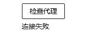  <ne-p id="u1591fbc1" data-lake-id="u1591fbc1"><ne-text id="uc00d986f">那么可以检查下信息填写的有没有问题，或者代理类型是不是选错了。</ne-text></ne-p> <ne-p id="u345d9809" data-lake-id="u345d9809"><ne-text id="u1d20fe10">如果还不行，可以在 IProayl 选择其他的代理类型，比如从 http/https 换为 socks5，指纹浏览器这里也可换成 socks5 试试。</ne-text></ne-p> <ne-p id="ua07301db" data-lake-id="ua07301db"><ne-text id="ucf762431">创建成功之后，我们就可以打开环境，在浏览器的地址栏里输入你想要运营的平台网站的网址就可以了。</ne-text></ne-p> <ne-p id="ua08eeab1" data-lake-id="ua08eeab1"><ne-card data-card-name="image" data-card-type="inline" id="HNbeq" data-event-boundary="card">  <ne-h1 id="e060ba06" data-lake-id="e060ba06"><ne-heading-ext><ne-heading-anchor></ne-heading-anchor><ne-heading-fold></ne-heading-fold></ne-heading-ext><ne-heading-content><ne-text id="u956f1ad3" ne-bold="true">常见问题</ne-text></ne-heading-content></ne-h1> <ne-p id="u3d1e9e6e" data-lake-id="u3d1e9e6e"><ne-text id="ubfef9f89">最后，再说下一些可能会遇到的问题。</ne-text></ne-p> <ne-p id="uda43961a" data-lake-id="uda43961a"><ne-text id="u143aa474">Q：一个 ip 可以配在不同的浏览器环境上吗？</ne-text></ne-p> <ne-p id="ud7360b48" data-lake-id="ud7360b48"><ne-text id="uf6b54587">A：可以的，但这时意味着不同的浏览器环境在用着同一个 ip，那么这些浏览器环境最好就不要登录同一个平台的账号，防止 ip 关联。</ne-text></ne-p> <ne-p id="u6c7085de" data-lake-id="u6c7085de"><ne-text id="ua8f32a75">Q：检查代理成功之后，所有网站都可以正常打开了吗？</ne-text></ne-p> <ne-p id="u78e2735b" data-lake-id="u78e2735b"><ne-text id="ub4bb2912">A：不是的，有的 IP 服务商会屏蔽某些特定的网站，比如用 IProayl 这个服务商的 IP，就打不开 Facebook。这时候你只能选择换个 IP 服务商，比如这个（网址：</ne-text>[<ne-text id="u7310eacb">rola-ip.co</ne-text>](http://rola-ip.co)<ne-text id="ufa003b7c">） 。</ne-text></ne-p> <ne-p id="uca1c26dc" data-lake-id="uca1c26dc"><ne-text id="uc6a789e1">Q：为什么我检查代理是成功的，但是打开浏览器之后却打不开 Facebook 这些网站。</ne-text></ne-p> <ne-p id="u3430a2b1" data-lake-id="u3430a2b1"><ne-text id="u1ed6abb0">A：这里有两个可能。第一个可能就是像上面第一个问题说的那样，IP 服务商屏蔽了这个网站。第二个可能的解决方案就是你自己的电脑也需要开启梯子的功能，然后你会发现就可以了。</ne-text></ne-p> <ne-p id="u5f3f15a6" data-lake-id="u5f3f15a6"><ne-text id="u520d3f2b">Q：使用 hubstudio 检查代理的时候，提醒已经被使用过了怎么办？</ne-text></ne-p> <ne-p id="u0c8b04f3" data-lake-id="u0c8b04f3"><ne-text id="ub75b3c04">A：意思就是这个 IP 已经有人在 Hubstudio 上添加过了，用过了，被 Hubstudio 记录了下来。如果是动态 IP，其实不用太在意，因为就算没有这个提醒，IP 也可能被别人在别的软件上用过。如果是静态 IP，或者用来注册很重要的账号/风控要求很高的账号，那么可以更换一个。</ne-text></ne-p> <ne-p id="u94d61692" data-lake-id="u94d61692"><ne-text id="u4bd5a03e">Q：不同的 IP 服务商有啥区别？</ne-text></ne-p> <ne-p id="u27795ff3" data-lake-id="u27795ff3"><ne-text id="u7d2090ee">A：第一个区别是价格不同，第二个区别就是 IP 的质量不同。一般来说，越便宜的 IP，质量越差，因为被用的人太多了。还有就是不同服务商的 IP 稳定性也不一样，有的很流畅，有的用起来就会卡顿。还有的服务商的动态 IP 并不会像设置的那样在某个州或者某个城市里变动，有可能会在全国乱跳。</ne-text></ne-p> <ne-p id="u43f0c35b" data-lake-id="u43f0c35b"><ne-text id="uc8ca9a6a">Q：不同的 IP 类型有啥区别？什么时候要选动态住宅 IP，什么时候要选服务器 IP？</ne-text></ne-p> <ne-p id="ubb24a794" data-lake-id="ubb24a794"><ne-text id="u7fea7aa0">A：这要根据自己的实际使用情况和平台风控来安排。</ne-text></ne-p> <ne-p id="ua7681eba" data-lake-id="ua7681eba"><ne-text id="ua89641e4">举个我自己的例子：</ne-text></ne-p> <ne-p id="u5510df91" data-lake-id="u5510df91"><ne-text id="u9d185e10">发帖，聊天的社交账号用服务器 IP，因为发帖聊天会消耗比较多的流量，用动态 IP 太贵，服务器 IP 是包月付费不限流量的，会比较划算。</ne-text></ne-p> <ne-p id="u13dc3fe0" data-lake-id="u13dc3fe0"><ne-text id="u044d1f5e">那些不常用的账号，或者特别重要的账号用动态住宅 IP，因为是按流量付费，不用就不收费，更划算也更安全。</ne-text></ne-p> <ne-p id="ue48691fd" data-lake-id="ue48691fd"><ne-text id="u554922d6">Q：这动态 IP 每次都开都是不同的 IP，真的没影响吗？</ne-text></ne-p> <ne-p id="u1f8d2117" data-lake-id="u1f8d2117"><ne-text id="ue52aed26">A：一般来说，老美家的宽带也是会变 IP 的，所以不影响。只要 IP 在一个固定的地方（比如只在某个城市）内变动，那么影响就不大。</ne-text></ne-p> <ne-p id="u9f5b711f" data-lake-id="u9f5b711f"><ne-text id="u8c700dfa">Q：动态 IP 池不会用完吗？不同的浏览器不会重复到同一个 IP 吗？</ne-text></ne-p> <ne-p id="uf33c39d8" data-lake-id="uf33c39d8"><ne-text id="uc3ebaac0">A：会用完的，但是会在里面循环更替。不同的浏览器如果用的都是一个地区的动态 IP，是会有一定概率用到同一个 IP。但是就像上面那个问题说的，国外的宽带网络也是会变 IP 的。</ne-text></ne-p> <ne-p id="u3175fc38" data-lake-id="u3175fc38"><ne-text id="u03211e7d">Q：我有一个 facebook 账号，一个 Instagram 账号，我可以用同一个浏览器环境，同一个 IP 同时登陆吗？</ne-text></ne-p> <ne-p id="u2c902eb4" data-lake-id="u2c902eb4"><ne-text id="u511a6e25">A：当然可以，因为平台不一样。</ne-text></ne-p> <ne-p id="u5abfff90" data-lake-id="u5abfff90"><ne-text id="ua3f97960">Q：为什么 IP 服务商这里买的 IP 是美国的，用 hubstudio 测出来的却是其他国家？</ne-text></ne-p> <ne-p id="ua400dd0a" data-lake-id="ua400dd0a"><ne-text id="ucbe69cbd">A：这种情况经常发生。一是看服务商的 IP 质量，一般好的服务商的 IP 和 hubstudio 测出来的地址会一致。但如果不一致，那也不能说就一定是 IP 服务商错了，因为用的数据库不一样。</ne-text></ne-p> <ne-p id="u3ea817ae" data-lake-id="u3ea817ae"><ne-text id="u0e4952f0">所以我的建议是，如果你想简单点，就以 hubstudio 的结果为准，如果每次测出来都不一样，就换个服务商好了，毕竟 IP 服务商那么多。</ne-text></ne-p> <ne-p id="udf2ddedd" data-lake-id="udf2ddedd"><ne-text id="ubb5a83f9">Q：什么情况下用紫鸟浏览器，什么情况下用 hubstudio+IP 服务商这种方式？</ne-text></ne-p> <ne-p id="uf4e0fd9f" data-lake-id="uf4e0fd9f"><ne-text id="u3dc3259f">A：还是要看平台和运营情况。</ne-text></ne-p> <ne-p id="u9e38e2d6" data-lake-id="u9e38e2d6"><ne-text id="uf756b1bf">首先要注意，紫鸟浏览器里面也有多种不同的 IP 可供选择。比如你是注册亚马逊店铺（这个时候亚马逊的风控是很高的），那么紫鸟浏览器里面提供的服务器 IP 就不行，你可能就要购买紫鸟浏览器里面提供的宽带网络。</ne-text></ne-p> <ne-p id="uc83991e7" data-lake-id="uc83991e7"><ne-text id="u63e4429c">但比如你已经是注册好的亚马逊店铺，并运营了一段时间，那么转移到紫鸟浏览器并搭配服务器 IP 其实就没太大问题。</ne-text></ne-p> <ne-p id="u103055f2" data-lake-id="u103055f2"><ne-text id="u3e30e0f3" ne-bold="true">注意：我建议注册亚马逊店铺这种高风险操作，最好是用自己的电脑和真实宽带。</ne-text></ne-p> <ne-p id="ucadae75d" data-lake-id="ucadae75d"><ne-text id="u11ce95dd">如果是运营 facebook，tiktok 这种社媒账号，那么只能用 hubstudio+IP 服务商这种方式。</ne-text></ne-p> <ne-p id="u00543987" data-lake-id="u00543987"><ne-text id="u8dcd35c2">Q：要怎么判断 IP 是服务器 IP 还是住宅 IP？</ne-text></ne-p> <ne-p id="u28aaf490" data-lake-id="u28aaf490"><ne-text id="u4765a089">A：用这个网址查询：</ne-text>[<ne-text id="u0ff0a8bf">https://scamalytics.com/IP</ne-text>](https://scamalytics.com/IP)</ne-p> <ne-p id="u59a3755f" data-lake-id="u59a3755f"><ne-text id="ud65b7e27" style="color: rgb(0, 0, 0);">输入 IP，点击查询，如果是服务器 IP，ISP Name 一般会显示服务商的名字，比如下面这个就是：</ne-text><ne-text id="ubcef1024">深圳市腾讯电脑系统有限公司。</ne-text></ne-p> <ne-p id="u1cfa06c1" data-lake-id="u1cfa06c1"><ne-card data-card-name="image" data-card-type="inline" id="QWIjs" data-event-boundary="card">  <ne-p id="u39170b6a" data-lake-id="u39170b6a"><ne-text id="ub0b4f168">而如果是显示下面这种：</ne-text></ne-p> <ne-p id="u4f937b9c" data-lake-id="u4f937b9c"><ne-card data-card-name="image" data-card-type="inline" id="o5VQf" data-event-boundary="card">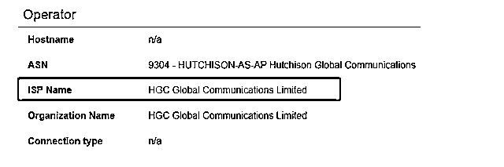  <ne-p id="u034c9b37" data-lake-id="u034c9b37"><ne-text id="u9f349471">百度查一下公司，我们就知道这是一家香港提供网络宽度的公司，那么这个 IP 就是住宅 IP。</ne-text></ne-p> <ne-p id="u29f324c5" data-lake-id="u29f324c5"><ne-card data-card-name="image" data-card-type="inline" id="KbWuD" data-event-boundary="card">  <ne-p id="u3dcaf125" data-lake-id="u3dcaf125"><ne-text id="udb8c89d6">不过大多数情况下我们并不需要判断，IP 服务商都会直接帮我们做好区分，毕竟这两者的价格是不一样的。</ne-text></ne-p> <ne-p id="u3ebfbd44" data-lake-id="u3ebfbd44"><ne-text id="ue314264e">同时，这个网站还可以辅助判断 IP 的干净程度。</ne-text></ne-p> <ne-p id="ua7c364ae" data-lake-id="ua7c364ae"><ne-card data-card-name="image" data-card-type="inline" id="dYdTj" data-event-boundary="card">  <ne-p id="u5979b501" data-lake-id="u5979b501"><ne-text id="u0be21b7d">垃圾值越高，IP 被用过的次数就越多。</ne-text></ne-p> <ne-p id="u733fc5e6" data-lake-id="u733fc5e6"><ne-text id="u9ef14a6a">不过网站数据只能做辅助参考，平时我们并不用太纠结这个数值，只是在运营一些风控要求高的平台时，可以先看下自己的 IP 垃圾值。</ne-text></ne-p> <ne-p id="ua70e5c77" data-lake-id="ua70e5c77"><ne-card data-card-name="image" data-card-type="inline" id="tTvZN" data-event-boundary="card">  <ne-p id="u4f8e5f7f" data-lake-id="u4f8e5f7f"><ne-text id="u8bf3a4a9" ne-bold="true">最后，再做个提醒，因为不同平台在不同时期的风控都是在变动的，所以具体使用什么指纹浏览器软件和 IP 要自己衡量风险或者咨询服务商客服，这里不做任何背书和承诺。</ne-text></ne-p> <ne-hole id="u4f83983f" data-lake-id="u4f83983f"><ne-card data-card-name="hr" data-card-type="block" id="gnoE5" data-event-boundary="card"><ne-p id="u8a3daca3" data-lake-id="u8a3daca3"><ne-text id="u133ac787">评论区：</ne-text></ne-p> <ne-p id="u569f0285" data-lake-id="u569f0285"><ne-text id="u3b3dc00e">芷蓝 : 自媒体必备啊</ne-text> <ne-text id="u3506cd0f">Karp : 是不是可以用同样的原理（浏览器环境搭配硅谷 ip）登陆 GPT？</ne-text> <ne-text id="u220e89c8">希声。 : 是的😃</ne-text> <ne-text id="uc120fde1">希声。 : Bingo</ne-text> <ne-text id="u5842b87b">暗淡枫叶 : 太厉害了，看的发晕[大哭]</ne-text> <ne-text id="u1ad96d54">希声。 : 实操起来其实很容易</ne-text> <ne-text id="u0639aeae">邵杰 Neil : 太赞了，工作室做矩阵必备啊[爱心]</ne-text> <ne-text id="uabd435fd">邵杰 Neil : 大佬经常用哪个 ip 服务商，价格大概多少呢，有好的国内的 ip 服务商推荐吗？[呲牙]</ne-text></ne-p></ne-card></ne-hole></ne-card></ne-p></ne-card></ne-p></ne-card></ne-p></ne-card></ne-p></ne-card></ne-p></ne-card></ne-p></ne-card></ne-p></ne-card></ne-p></ne-card></ne-p></ne-card></ne-p></ne-card></ne-p></ne-card></ne-p></ne-card></ne-p></ne-card></ne-p></ne-card></ne-p></ne-card></ne-p></ne-card></ne-p></ne-card></ne-p></ne-card></ne-p></ne-card></ne-p></ne-card></ne-p></ne-card></ne-p></ne-card></ne-p></ne-card></ne-p></ne-card></ne-p></ne-card></ne-p></ne-card></ne-p></ne-card></ne-p></ne-card></ne-p></ne-card></ne-p></ne-card></ne-p></ne-card></ne-p></ne-card></ne-p></ne-card></ne-p></ne-card></ne-p></ne-card></ne-p></ne-card></ne-p></ne-card></ne-p></ne-card></ne-p></ne-card></ne-p></ne-card></ne-p></ne-card></ne-p></ne-card></ne-p></ne-card></ne-p></ne-card></ne-p></ne-card></ne-p></ne-card></ne-p></ne-card></ne-p></ne-card></ne-p>