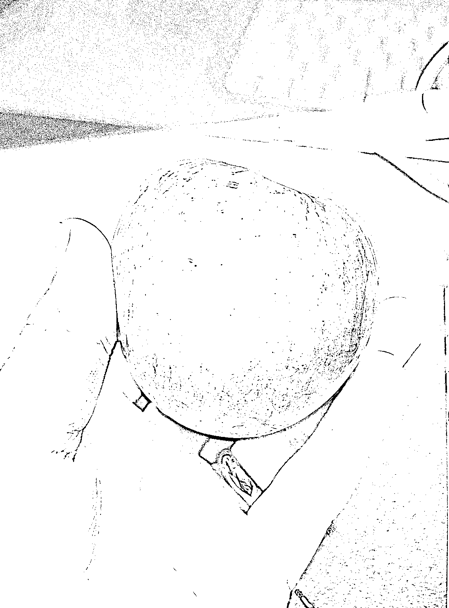
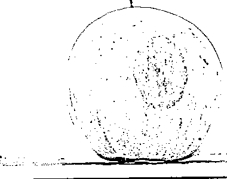

# 《如何正确利用见面会获得的信息？》

> 原文：[`www.yuque.com/for_lazy/thfiu8/gidmt34pgu3a1atn`](https://www.yuque.com/for_lazy/thfiu8/gidmt34pgu3a1atn)

<ne-h2 id="feb77c08" data-lake-id="feb77c08"><ne-heading-ext><ne-heading-anchor></ne-heading-anchor><ne-heading-fold></ne-heading-fold></ne-heading-ext><ne-heading-content><ne-text id="u38435a49">(104 赞)《如何正确利用见面会获得的信息？》</ne-text></ne-heading-content></ne-h2> <ne-p id="u873bb2ad" data-lake-id="u873bb2ad"><ne-text id="u6be2ef6e">作者： 郭晓文</ne-text></ne-p> <ne-p id="u3f8c6da0" data-lake-id="u3f8c6da0"><ne-text id="u825393ee">日期：2023-03-29</ne-text></ne-p> <ne-h2 id="b79d3c74" data-lake-id="b79d3c74"><ne-heading-ext><ne-heading-anchor></ne-heading-anchor><ne-heading-fold></ne-heading-fold></ne-heading-ext><ne-heading-content><ne-text id="ufc452025">【新人参加见面会后必读】如何正确利用见面会获得的信息？</ne-text></ne-heading-content></ne-h2> <ne-p id="u1ebb2dd0" data-lake-id="u1ebb2dd0"><ne-text id="u5a8319f4">大家好，我是郭晓文，江湖人称最懂新手的男人。</ne-text> <ne-text id="u47179560">也是写过 9 篇精华帖的三届老生财圈友。</ne-text> <ne-text id="uab4c3b7a">还是参加过四次生财有术线下见面会，接下来大概率还会一直参加的男人。</ne-text></ne-p> <ne-h2 id="8d939ff7" data-lake-id="8d939ff7"><ne-heading-ext><ne-heading-anchor></ne-heading-anchor><ne-heading-fold></ne-heading-fold></ne-heading-ext><ne-heading-content><ne-text id="u3a246ecd">我本来很想和大家分享一下我这次参加见面会的收获。</ne-text> <ne-text id="uc8839fe7">但，这两天脑海里，浮现出自己还是创业小白时，参加见面会后，没能正确的利用从见面会上获得的信息，然后踩了大坑的经历。</ne-text> <ne-text id="uda968959">并且，同样的坑，好几个当时一起参加的小伙伴，都相继踩了。</ne-text> <ne-text id="u2c9785fc">今天，就和大家分享一下我当时的经历。</ne-text></ne-heading-content></ne-h2> <ne-p id="ua2bfa64f" data-lake-id="ua2bfa64f"><ne-text id="u8938f27b">简单来说，就是：</ne-text> <ne-text id="ucfb34e80">「当时第一次参加见面会后，我和几个小伙伴跟打了鸡血一般，觉得未来可期，觉得自己仿佛能改变世界。但结果却是，回来后都经历了好几个月的低谷期。」</ne-text></ne-p> <ne-p id="ub0432aae" data-lake-id="ub0432aae"><ne-text id="ud02b90dd">如果你也是这样的状态，希望，今天的分享，能帮大家正确的看待见面会的利与弊，更好的利用见面会这把双刃剑，强大自己的同时，也避免被其所伤。</ne-text> <ne-text id="u159c13e5">文章较长，为了方便排版，请大家移步飞书阅读</ne-text> [<ne-text id="u458d1c0d">https://y2mt3o47i3.feishu.cn/docx/Bz45d66zRorMbMx7jzVcbSXIncf</ne-text>](https://y2mt3o47i3.feishu.cn/docx/Bz45d66zRorMbMx7jzVcbSXIncf)<ne-card data-card-name="image" data-card-type="inline" id="dFhSK" data-event-boundary="card"></ne-card></ne-p> <ne-p id="uaad45b88" data-lake-id="uaad45b88"><ne-card data-card-name="image" data-card-type="inline" id="ulSIj" data-event-boundary="card"></ne-card></ne-p> <ne-hole id="u213e5a61" data-lake-id="u213e5a61"><ne-card data-card-name="hr" data-card-type="block" id="RUhrf" data-event-boundary="card"><ne-p id="u64af102b" data-lake-id="u64af102b"><ne-text id="u8ab5011d">评论区：</ne-text></ne-p> <ne-p id="ue5d18b2b" data-lake-id="ue5d18b2b"><ne-text id="u58087407">微信用户 : 老大写的深入我心</ne-text> <ne-text id="ue79cf76d">千维 : 抬头看天，低头赶路</ne-text> <ne-text id="ua07ca0e4">值得 : 3.18 刚进生财的萌新学习</ne-text> <ne-text id="u96b01ee6">吾爱诗词 : 生财萌新学习打卡</ne-text> <ne-text id="u4e8f404a">辰安 : 幸存者偏差！只看到做的成功的某几个人，看不到同样做这件事失败的某一大群人</ne-text> <ne-text id="ubf488e61">浩辰 : 抬头看天，低头赶路</ne-text> <ne-text id="ueb132515">感谢晓文老师，受益了</ne-text> <ne-text id="u60354a6a">王威 : 是我网不好，打不开，还是文章没了</ne-text> <ne-text id="ud7751183">郭晓文 : 可以打开的</ne-text></ne-p></ne-card></ne-hole>