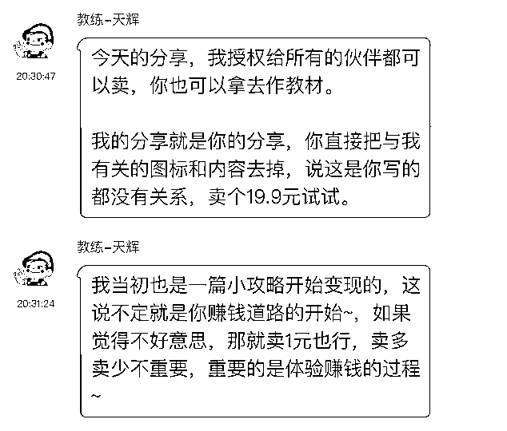
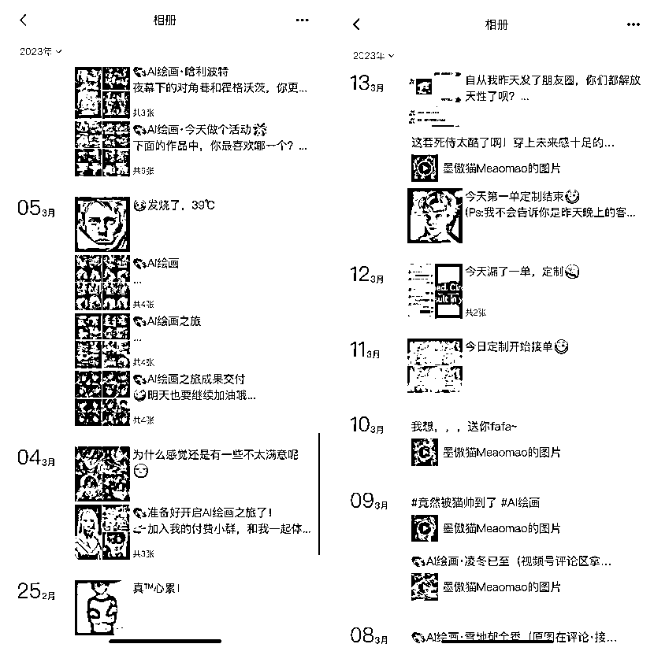

# 《1 年没赚回门票，2 月航海我赚了 5 倍》

> 原文：[`www.yuque.com/for_lazy/thfiu8/vhc55euvah7vkfa1`](https://www.yuque.com/for_lazy/thfiu8/vhc55euvah7vkfa1)

<ne-h2 id="25790433" data-lake-id="25790433"><ne-heading-ext><ne-heading-anchor></ne-heading-anchor><ne-heading-fold></ne-heading-fold></ne-heading-ext><ne-heading-content><ne-text id="u3530a10b">(114 赞)《1 年没赚回门票，2 月航海我赚了 5 倍》</ne-text></ne-heading-content></ne-h2> <ne-p id="u81280668" data-lake-id="u81280668"><ne-text id="uf8c1eef3">作者： 浅色 8ug 的喵</ne-text></ne-p> <ne-p id="uee626a7b" data-lake-id="uee626a7b"><ne-text id="u98dcce4e">日期：2023-03-27</ne-text></ne-p> <ne-p id="u26553fc2" data-lake-id="u26553fc2"><ne-text id="u9952e6cb">Hey! 是我 浅色 Bug 的喵 ，一个真正的萌新小透明。第 6 期生财是我生财之旅的第 1 年，算算时间，也即将结束。自加入生财起，一直无间断的参加了，视频号项目的每一期航海。直到 2 月航海之前，一直属于变现不多，门票没回的情况...</ne-text></ne-p> <ne-p id="ubf321edf" data-lake-id="ubf321edf"><ne-text id="ubb613fa3">截止到目前，我大致跑通了两个项目：AI 绘画和视频号带货。视频号带货目前最高记录是单天佣金 1000+，AI 绘画每天基本上平均收入在 200 左右。这次 2 月航海视频号目前为止变现了 1.3w，AI 绘画也有 6000+，妥妥的赚回门票了！</ne-text></ne-p> <ne-h2 id="38211230" data-lake-id="38211230"><ne-heading-ext><ne-heading-anchor></ne-heading-anchor><ne-heading-fold></ne-heading-fold></ne-heading-ext><ne-heading-content><ne-text id="ua52e57c2">一、我在这次航海中是如何做项目的</ne-text></ne-heading-content></ne-h2> <ne-p id="ue19bd993" data-lake-id="ue19bd993"><ne-text id="u7c12e625">说到这次航海的变现，要感谢@天辉 教练。</ne-text></ne-p> <ne-p id="u99860100" data-lake-id="u99860100"><ne-text id="u078c4b25">作为一个社恐，我的朋友圈真的是一年都没几条的。我 AIGC 项目的第一笔变现的核心就是天辉教练的第一次分享。当时给我的鼓励非常大。</ne-text></ne-p> <ne-p id="u7c513590" data-lake-id="u7c513590"><ne-card data-card-name="image" data-card-type="inline" id="D0ePd" data-event-boundary="card">  <ne-p id="ub491f050" data-lake-id="ub491f050"><ne-text id="ud0c9650c">就是这段话，让我发了第一条关于 AIGC 的朋友圈，也是在发圈的第二天开始有人询问，第三天变现了第一单。一直到现在为止，我的客户群体主要仍然还来自朋友圈和朋友圈大佬们的转介绍。（当然现在已经开始进行向外扩展的动作了）</ne-text></ne-p> <ne-p id="u04ce96f2" data-lake-id="u04ce96f2"><ne-text id="uac6eafbd">随着心态的不断转变，感觉在航海中也越来越顺手，这次不仅仅 AIGC 的航线有变现，之前的视频号航线本次航海中也突破到了单日变现 1000+ 的成绩。</ne-text></ne-p> <ne-p id="u99e62e69" data-lake-id="u99e62e69"><ne-text id="u0261d5ef">我的变现路径比较简单，先简单的说下吧，后面有时间我整理下给大家。</ne-text></ne-p> <ne-p id="u42e4b694" data-lake-id="u42e4b694"><ne-text id="u3f4fc058">首先，是第一次培训的时候天辉教练分享的一个小方法：朋友圈，买课，建群。这也是目前我变现的第一步，我先是创建了一个 21 天 AI 绘画之旅的付费小群，但是到现在为止入群人数为 1 但是也算是第一桶金；</ne-text></ne-p> <ne-p id="u11e2382e" data-lake-id="u11e2382e"><ne-text id="u4b474c7b">第二步，我发现好像我的圈子里对学习 AI 绘画好像不感兴趣，然后我就开始每天发我生成出来的图，各个风格都有，就是想尽可能的命中朋友圈的人群喜好。果然，有人来问我相关的问题了。那时候的思路还是向往 21 天 AI 绘画之旅的小群去引导。但是效果嘛....也不至于现在还是 1 个人了；</ne-text></ne-p> <ne-p id="ue9ebe612" data-lake-id="ue9ebe612"><ne-text id="u6a074d51">第三步，然后我就思考要是做活动送定制图大家会不会有点兴趣，我就尝试做了一个小活动，朋友圈评论送定制图。也许是我朋友圈比较高冷，只有 1 个人参与。But，意外的是，很一些朋友直接找我帮忙绘图。因为都是朋友关系，所以最开始我也不是很好意思收费（本人脸皮薄...优点，也是缺点...主要是缺钱）</ne-text></ne-p> <ne-p id="ufcf8b138" data-lake-id="ufcf8b138"><ne-card data-card-name="image" data-card-type="inline" id="XM2OS" data-event-boundary="card">  <ne-p id="u89f38b85" data-lake-id="u89f38b85"><ne-text id="u4ce79ac5">第四步，发现朋友圈里的其实大家对怎么用 AI 绘图不感兴趣，但是对于怎么简单赚钱还是比较感兴趣的，所以我果断的建了第二个群，AI 绘画 21 天变现计划。果然这个群就相对来说好很多了，现在已经停止入新人了，总共有 20 个学员。</ne-text></ne-p> <ne-p id="ub3557371" data-lake-id="ub3557371"><ne-text id="u32c820b8">这个变现群根本目的是，怎么简单的变现。后来想了下 AI 绘画的变现路径，我决定我这边负责进行 AI 出图，然后教群里的做抖音、小红书的壁纸号邀请到一个团队，到时候收益我这边也要分成。他们的定制客户会转介绍给我这边。</ne-text></ne-p> <ne-p id="ucc8957ed" data-lake-id="ucc8957ed"><ne-card data-card-name="image" data-card-type="inline" id="FiAZI" data-event-boundary="card">  <ne-p id="u524ff422" data-lake-id="u524ff422"><ne-text id="u632d4297">简单的说，这些就算是目前为止我的变现方式。当然，我也尝试了视频号发一些绘出来的图，没啥流量，几百播放。但是应该多少让一些朋友看到了，所以才找过来的。</ne-text></ne-p> <ne-p id="u6ca4c733" data-lake-id="u6ca4c733"><ne-text id="u7e3c10a4">当时和群里群友@东淼 交流的时候，还在讨论说壁纸号如果自己没有经验，去指导学员是否可行。这点我是这样解决的：</ne-text></ne-p> <ne-p id="u7c036d72" data-lake-id="u7c036d72"><ne-text id="u959c5558">1、我自己报有小说的项目，对抖音运营有所涉及。</ne-text></ne-p> <ne-p id="u853c401a" data-lake-id="u853c401a"><ne-text id="u96da09ef">2、我个人也是做新媒体运营的，所以也算是多少有一点经验。</ne-text></ne-p> <ne-p id="ua68c03f7" data-lake-id="ua68c03f7"><ne-text id="ua6578b89">3、生财的资料宝库是最大的资源，看看之前抖音项目的手册，融合下观点，目前对我来说足够了</ne-text></ne-p> <ne-p id="u6264abe9" data-lake-id="u6264abe9"><ne-text id="uf2391ed2">其实，也有一些运气成分在，最重要的是，付出行动。别管赚多赚少，付出行动了，才有下一步优化行动。</ne-text></ne-p> <ne-p id="uf4ca667a" data-lake-id="uf4ca667a"><ne-text id="u8b551000">我就是那种很纠结的人，之前一直不知道选什么风格，什么方向，一直都这样。然后在天辉教练那次分享后，我就想着试试吧，反正也没啥成本。再说了好看的图我自己都想发朋友圈，就迈出了第一步。</ne-text></ne-p> <ne-hole id="udb83426b" data-lake-id="udb83426b"><ne-card data-card-name="hr" data-card-type="block" id="X8G5E" data-event-boundary="card"><ne-p id="u0c9cf1c5" data-lake-id="u0c9cf1c5"><ne-text id="ud454b94c">其实我觉得我最大的突破，不是赚到多少钱，而是打开了航海的正确姿势，并且认识了一群很可爱的人，所以这次我想多讲讲我最大的突破，和链接我、陪伴我的人们。</ne-text></ne-p> <ne-h2 id="2c870350" data-lake-id="2c870350"><ne-heading-ext><ne-heading-anchor></ne-heading-anchor><ne-heading-fold></ne-heading-fold></ne-heading-ext><ne-heading-content><ne-text id="u7bed561e">二、初入航海：对于社恐新人来说，确实有一些“煎熬”</ne-text></ne-heading-content></ne-h2> <ne-p id="u71a131c7" data-lake-id="u71a131c7"><ne-text id="u0e1b3004">去年 5 月 30 日 18：34 以 3865 元 的价格加入了生财，正好面临着航海的改革。由于没有参加过之前的航海，我并不清楚哪种模式对生财萌新来说更合适。只谈现在的航海形式，目前的形式好吗？个人觉得从各方面来说算是相对的最优解了，也让更多的圈友可以参与进来。但...对于一个有一些社恐的萌新来说，确实有一些“煎熬”。</ne-text></ne-p> <ne-p id="u77f968bf" data-lake-id="u77f968bf"><ne-text id="u92de5adc">说下我初入生财的心态：真的看谁都像是大佬，看谁都比自己牛 x。甚至每次航海的自我介绍环节，都要费尽了脑细胞。当然这除了社恐以外，也和对自己资源的认知和总结不够有关系。所以这一年来，基本上我没有在星球中发过 1 篇帖子，就算是回复也是一双手可以数得过来的（来自萌新的瑟瑟发抖...</ne-text></ne-p> <ne-p id="u853aff78" data-lake-id="u853aff78"><ne-text id="u57f34762">作为一个比较社恐的航海新人，每次我参加航海的第一想法就是：看手册、看教练分享、看大佬交流、自己遇到问题也可以咨询一下。但事实上，实际参加航海都是：看手册、看教练分享、看大佬交流，就没了...真的是生怕自己的问题看起来是那样的小白，甚至大佬们都不愿意回复，想想那样多尴尬啊...</ne-text></ne-p> <ne-p id="u6e8bc243" data-lake-id="u6e8bc243"><ne-text id="u16ec8a69">所以，</ne-text><ne-text id="uebc4c96a" ne-bold="true">我基本上遇到问题就是自己去摸索尝试，以及默默的盯着航海群，看看有没有人遇到和自己一样的问题</ne-text><ne-text id="u22680051">（几率真的不大...再加上不可能一直盯着群...</ne-text></ne-p> <ne-p id="u2f9dd396" data-lake-id="u2f9dd396"><ne-text id="udcd5fdd3">因此，虽然自我加入生财起一直有报名视频号航海，也有一些变现，但加起来门票大概都还没回本？ 😂</ne-text></ne-p> <ne-h2 id="3fac1488" data-lake-id="3fac1488"><ne-heading-ext><ne-heading-anchor></ne-heading-anchor><ne-heading-fold></ne-heading-fold></ne-heading-ext><ne-heading-content><ne-text id="uf58aba4e">三、自我突破的起点：敢于主动提问</ne-text></ne-heading-content></ne-h2> <ne-p id="uc59e273c" data-lake-id="uc59e273c"><ne-text id="uad87eb53">很庆幸，2 月航海我报了 AI 绘画&ChatGPT 的项目并被分配到了 5 群这个大家庭中——这里是自我突破的起点...</ne-text></ne-p> <ne-p id="u56a589d6" data-lake-id="u56a589d6"><ne-text id="u4db5fa9e">AIGC 5 群的各位群友很热情，大家都很乐意的去回答和解决别人提出问题。</ne-text><ne-text id="u67e13f77" ne-bold="true">当我在 AIGC 群里第一条，第二条问题得到解决后，就开始疯狂输出自己碰到过的问题。</ne-text><ne-text id="ued233576">很开心的是，绝大多数的问题都被群友和教练们解决了。这也让我在 AIGC 这个航线中向前行驶了很大一段，也算是社恐萌新迈出去的第一步——敢于主动提问。</ne-text></ne-p> <ne-p id="u1fd4701b" data-lake-id="u1fd4701b"><ne-text id="u689e4dbe">正当我摩拳擦掌准备大干一场时，在这次航海的第 3 天，我发烧了...39℃，将我之前的计划完全打乱了。躺在床上也没办法剪视频，而之前的 AI 绘画因为是在用 SD 部署在本地电脑上，也没办法使用了。没办法，我只好将目标转变到 MJ 上，相对来说 MJ 更加方便，也更加简单。</ne-text></ne-p> <ne-p id="u721f5b4d" data-lake-id="u721f5b4d"><ne-text id="u841400e2">也许是因祸得福，我获得了前所未有的突破。</ne-text></ne-p> <ne-p id="udb032a42" data-lake-id="udb032a42"><ne-text id="ub0282c1a">由于发烧后可以做的事情也不多，逐步的将关注点放在了群里。我发现对于 AIGC 这个领域，有太多的新手玩家了，很多人的问题都是我之前问过或者遇到过的。尤其看到一些问题，手册中有讲但还被反复问到时，我有些莫名的心疼教练和领队。每天回复着同样的问题，关键还是手册中写的很详细的问题，心态应该也挺爆炸的吧？</ne-text></ne-p> <ne-p id="u57741064" data-lake-id="u57741064"><ne-text id="ufc417c0d">我开始帮着回复一些比较基础的问题，和我之前得到过回答的问题。慢慢的，我好像适应了在群里发言和提问，开始在 AIGC 的群里开始变得活跃，也开始在航海日志中分享自己学到的内容。</ne-text></ne-p> <ne-p id="u10bb4c91" data-lake-id="u10bb4c91"><ne-card data-card-name="image" data-card-type="inline" id="HkVMA" data-event-boundary="card">  <ne-h2 id="2f20234f" data-lake-id="2f20234f"><ne-heading-ext><ne-heading-anchor></ne-heading-anchor><ne-heading-fold></ne-heading-fold></ne-heading-ext><ne-heading-content><ne-text id="uf743c097">四、志愿者们让我从 “社恐” 变 “社牛”</ne-text></ne-heading-content></ne-h2> <ne-p id="uda7a1d0a" data-lake-id="uda7a1d0a"><ne-text id="u5c210662">要说我为什么在链接上有了突破，除了发烧这个契机之外，最重要的推手，大概是志愿者们了。</ne-text></ne-p> <ne-p id="u673c7c40" data-lake-id="u673c7c40"><ne-text id="ua38ad917">这次航海我报名了 4 条航线，让我印象最为深刻的领队是小红书 IP 的 @常常 （某人，这里不是你有没有感觉很桑心啊？哈哈哈</ne-text></ne-p> <ne-p id="u321610eb" data-lake-id="u321610eb"><ne-text id="u810de7ad">常常领队在群里真的是非常非常非常活跃，也很乐于分享。我对常常领队的感观也很好。但是根据最开始我对这 4 条航线的计划来说，小红书反而是陪跑的，就是想先了解下，主要精力是要放在小说推文上的。所以关注度也就慢慢的淡化了下来。这里和常常领队说声抱歉，总感觉辜负了他的热情...</ne-text></ne-p> <ne-p id="uc4748f6f" data-lake-id="uc4748f6f"><ne-text id="ub21e90b2">如果说让我印象最深的领队是常常的话，那对我影响最大的领队（叹气...还是绕不过某人）就是这次 AIGC 5 群的领队@Y024 了。</ne-text></ne-p> <ne-p id="u2d7134b7" data-lake-id="u2d7134b7"><ne-text id="ue3e2879a">Y 哥不像是常常领队那样，在群内非常的活跃，年龄也比我大（个人感觉，至少我还没结婚...）但是他给我的感觉竟然是很“皮”？？每次他的出现总会伴随着一个小奥特曼（多大的人了...还喜欢奥特曼），现在猛地回想一下，好像他也没给我什么“实质性”的技能上的帮助...吧？</ne-text></ne-p> <ne-p id="ue9a944c8" data-lake-id="ue9a944c8"><ne-text id="u1993205b">不过说起来 Y 哥对我的影响，那还是必须记得的。</ne-text></ne-p> <ne-p id="u028f67c6" data-lake-id="u028f67c6"><ne-text id="uce036997">我第一篇航海日志被精选和好事儿的时候，随着小奥特曼的出现，我被 Y 哥在群里点名了。大家是不知道，当时我尴尬的回复也不是，不回复也不是。后来结束后，Y 哥很皮的让我分享下变现的思路。他这个人吧，很难让人产生那种距离感，再加上皮的性格也挺对胃口的。慢慢的我放下了尴尬，做了第一次的群内分享。</ne-text></ne-p> <ne-p id="u08e1c4eb" data-lake-id="u08e1c4eb"><ne-text id="ucdf7706d">这次分享之后就有一些群里的圈友加我，问我一些问题。我也有很耐心的和他们分享了自己的一些经历，然后就有圈友给我发了红包。我这个社恐体质又开始感觉尴尬的不要不要的...而且那时候我抢红包的插件没有关！！！没有关！！！卧槽...我真的是尴尬到家了！不过现在脸皮厚了，来吧，用红包砸死我吧～</ne-text></ne-p> <ne-p id="ub6be3102" data-lake-id="ub6be3102"><ne-text id="u6cd662da">回到 Y 哥，就像我之前说的，我真的不记得我俩关系是咋变得好起来的，一切好像都很自然。以至于后面有群友加我好友问我，你是不是 Y 哥的托儿？😂也是从那之后我和 Y 哥聊天，我就不再说我是萌新，我就说我是专业的托。不可否认 Y 哥还是给我了一些“特殊服务”的，有问题我也习惯性找他和@黑皮 组长了。一个提供“特殊服务”，一个负责“按摩”服务，还挺搭配的🤪</ne-text></ne-p> <ne-p id="udf72c477" data-lake-id="udf72c477"><ne-card data-card-name="image" data-card-type="inline" id="kYcst" data-event-boundary="card">  <ne-p id="u7e792fa7" data-lake-id="u7e792fa7"><ne-text id="ucb6d0b2c">黑皮，是我的组长。</ne-text></ne-p> <ne-p id="ueb9428aa" data-lake-id="ueb9428aa"><ne-text id="u54a3128b">好了，关于黑皮组长就说到这里（小玩笑～🤪）</ne-text></ne-p> <ne-p id="ua59ba159" data-lake-id="ua59ba159"><ne-text id="u161cc55b">黑皮组长也是一个话少的要死但是很温暖的一个人。黑皮的皮是不同于 Y 哥的皮，他俩的皮各有千秋。</ne-text></ne-p> <ne-p id="u0bcc9009" data-lake-id="u0bcc9009"><ne-text id="uaa4b289f">据我所知，黑皮组长偷偷地给不少组员“服务”过，这年头服务都不光明正大的！过分！（别想多哦，指的是心理按摩服务😂）</ne-text></ne-p> <ne-p id="u52a1bf0f" data-lake-id="u52a1bf0f"><ne-card data-card-name="image" data-card-type="inline" id="fJsl2" data-event-boundary="card">  <ne-p id="u2dcc18e9" data-lake-id="u2dcc18e9"><ne-text id="u96f7de2d">感谢 Y 哥和黑皮，是他们让我对这个群体有了更深刻的认可，也让我融渐渐地入了这个群体。</ne-text></ne-p> <ne-h2 id="e144cfc8" data-lake-id="e144cfc8"><ne-heading-ext><ne-heading-anchor></ne-heading-anchor><ne-heading-fold></ne-heading-fold></ne-heading-ext><ne-heading-content><ne-text id="u531e3e93">五、综上，想再给大家提供一些建议</ne-text></ne-heading-content></ne-h2> <ne-p id="u2770d1b0" data-lake-id="u2770d1b0"><ne-text id="uecf7787e">在这即将进入生财纳新的阶段，作为一个生财一年级新生中的社恐萌新。想对即将进入“生财大学”的也有社恐属性的圈友提供一些建议。</ne-text></ne-p> <ne-p id="ue193b601" data-lake-id="ue193b601"><ne-text id="u1dc96953" ne-bold="true">1、尝试去和至少 1 个老圈友交朋友</ne-text></ne-p> <ne-p id="uaa966bd3" data-lake-id="uaa966bd3"><ne-text id="u651fb9be">生财的圈友基数是非常大的，而且也有非常多乐于分享的圈友。找一个和自己性格比较匹配的，尝试着去进行第一次的评论，第一次的请教。你会发现好像，大佬也是凡人😂当然，找我这个小白“学长”也是可以哒～</ne-text></ne-p> <ne-p id="u0921c20c" data-lake-id="u0921c20c"><ne-text id="u68b5593a" ne-bold="true">2、积极地参加航海</ne-text></ne-p> <ne-p id="ufcc64665" data-lake-id="ufcc64665"><ne-text id="u386939c7">到现在为止，我对星球都还有一种“敬畏”的情绪在，总觉得在里面发东西的都是大佬，都和我这个萌新不沾边。但是，当参加航海的时候，我就会发现好像并不是这样。也有很多和我们一样程度的人，或者还不如我们的人存在。对自己的自信心培养还是很有好处的。</ne-text></ne-p> <ne-p id="u0d46724b" data-lake-id="u0d46724b"><ne-text id="uf479ce72" ne-bold="true">3、努力的去链接</ne-text></ne-p> <ne-p id="u75e8f679" data-lake-id="u75e8f679"><ne-text id="u2be8c75c">积极主动大胆的去沟通，去告诉大家你需要什么资源，你可以提供什么资源。这样你才会获得更多的资源。（想想都是泪啊，我究竟是错过了多少的机遇啊...)</ne-text></ne-p> <ne-p id="uecfc689c" data-lake-id="uecfc689c"><ne-text id="ua681f324" ne-bold="true">4、不要恐惧分享</ne-text></ne-p> <ne-p id="ua91c12ac" data-lake-id="ua91c12ac"><ne-text id="u2686629f">其实在生财大胆的分享是被鼓励的，哪怕这个问题非常的浅显，也是被欢迎的。当然，希望大家在分享前可以善用搜索，尽量不要分享一些重复的内容哦～</ne-text></ne-p> <ne-p id="ucff7d5df" data-lake-id="ucff7d5df"><ne-text id="u545a318d">最后的最后，还想想要再次感谢本次航海对我有所帮助的所有人，无论是给我答疑解惑的，还是去加我好友咨询问题的，亦或者给我打鸡血灌鸡汤的。真的非常感谢大家对我的帮助！谢谢！</ne-text></ne-p> <ne-hole id="u298ca7a7" data-lake-id="u298ca7a7"><ne-card data-card-name="hr" data-card-type="block" id="yQFKa" data-event-boundary="card"><ne-p id="ud2f94b8d" data-lake-id="ud2f94b8d"><ne-text id="u684222e5">评论区：</ne-text></ne-p> <ne-p id="ubfd6ab92" data-lake-id="ubfd6ab92"><ne-text id="ua09e076d">肉松 : 个人航海历程榜第一的人，果然不同凡响[奸笑]</ne-text> <ne-text id="u7cc7394c">浅色 8ug 的喵 : [捂脸]作为社恐的我，真不知道该怎么回...😂</ne-text> <ne-text id="ubbd6c249">月影 : 先赞后看，已成习惯，给喵哥打 call</ne-text> <ne-text id="udc2b4aa5">饼公子 : 🐮的嘞</ne-text> <ne-text id="ue5ad7e76">莫莉有魔力 : 我是今年新人，给大佬赞一个，你是我的目标。</ne-text> <ne-text id="u1cf3dd97">嘟嘟 MD🔫 : 厉害啊，我内心也想整个 midjourney 陪跑营，但目前还在整理资料，还没正式开始，向你学习，浅色的喵~</ne-text> <ne-text id="u1b11f6c4">肉松 : 加油！[嘿哈]</ne-text> <ne-text id="u0ba18911">潮州痞子蔡 : 有空可以分享下视频号这块的变现</ne-text></ne-p></ne-card></ne-hole></ne-card></ne-p></ne-card></ne-p></ne-card></ne-p></ne-card></ne-hole></ne-card></ne-p></ne-card></ne-p></ne-card></ne-p>