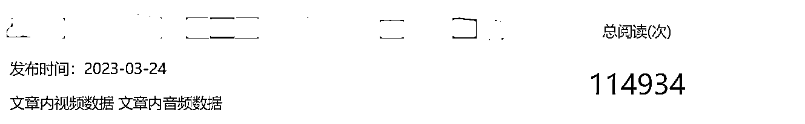
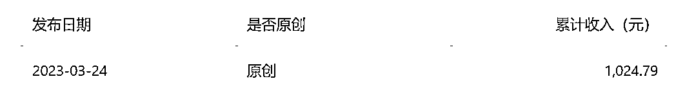
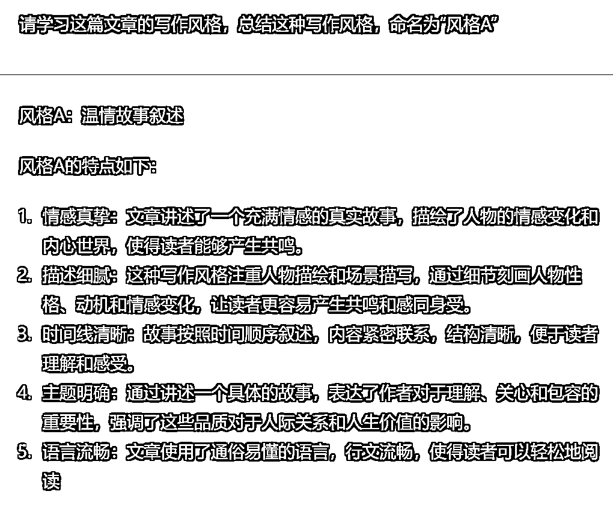
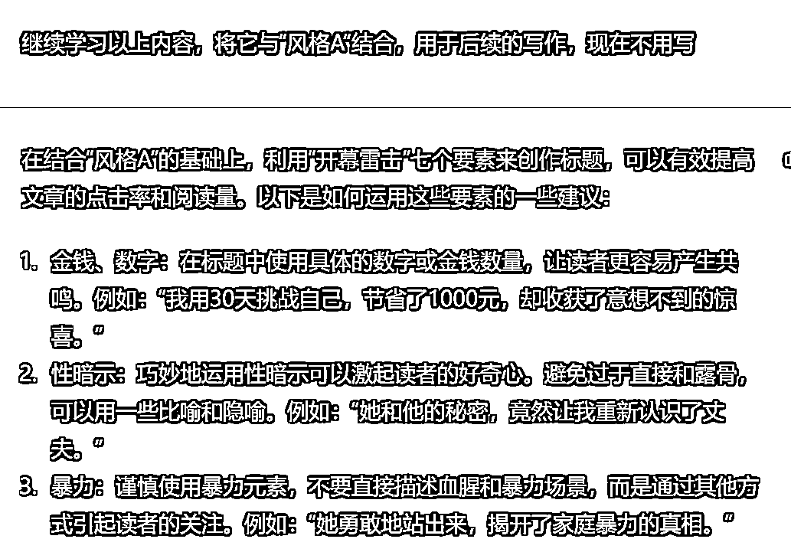
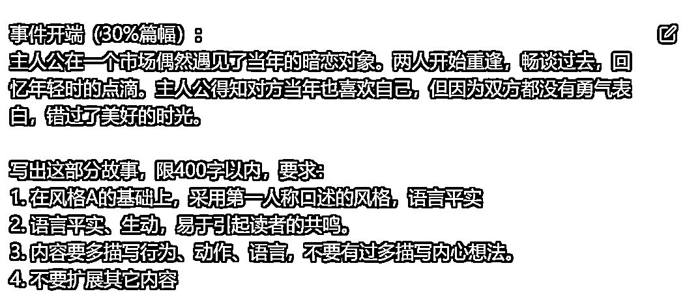

# 《ChatGPT + 公众号爆文写作，从 0 开始 7 天达成阅读 10W+方法分享》

> 原文：[`www.yuque.com/for_lazy/thfiu8/ay2rrz1qd2evsghg`](https://www.yuque.com/for_lazy/thfiu8/ay2rrz1qd2evsghg)

<ne-h2 id="d4329f7a" data-lake-id="d4329f7a"><ne-heading-ext><ne-heading-anchor></ne-heading-anchor><ne-heading-fold></ne-heading-fold></ne-heading-ext><ne-heading-content><ne-text id="u499bbafa">(167 赞)《ChatGPT + 公众号爆文写作，从 0 开始 7 天达成阅读 10W+方法分享》</ne-text></ne-heading-content></ne-h2> <ne-p id="u6aa51744" data-lake-id="u6aa51744"><ne-text id="u46317382">作者： 木白</ne-text></ne-p> <ne-p id="u4be35ca1" data-lake-id="u4be35ca1"><ne-text id="ub3cd284b">日期：2023-03-27</ne-text></ne-p> <ne-p id="u0de7ae62" data-lake-id="u0de7ae62"><ne-text id="u7213fc19">为节约时间，文本只包含使用 ChatGPT 写作的流程和心得。⌈公众号爆文写作⌋的具体方法，全部来自 3 月份的航海手册，请自行查阅。</ne-text></ne-p> <ne-h2 id="dd942604" data-lake-id="dd942604"><ne-heading-ext><ne-heading-anchor></ne-heading-anchor><ne-heading-fold></ne-heading-fold></ne-heading-ext><ne-heading-content><ne-text id="u4f93ba2e">成果展示</ne-text></ne-heading-content></ne-h2> <ne-p id="u7e164816" data-lake-id="u7e164816"><ne-text id="u7ea0c273">公众号从 0 开始，自 3 月 18 日起，每天发一篇情感文，全是用 ChatGPT 写的。3 月 24 日发的第 7 篇文章，单篇阅读量 10W+，单篇收益 1000+。</ne-text></ne-p> <ne-p id="u72523ee5" data-lake-id="u72523ee5"><ne-text id="u5dc63b59">这是单篇阅读量</ne-text></ne-p> <ne-p id="u2d2114f9" data-lake-id="u2d2114f9"><ne-card data-card-name="image" data-card-type="inline" id="u5Bl9" data-event-boundary="card">  <ne-p id="u2c5ccae5" data-lake-id="u2c5ccae5"><ne-text id="u1fed1115">这是单篇收益</ne-text></ne-p> <ne-p id="u6ca6dbfa" data-lake-id="u6ca6dbfa"><ne-card data-card-name="image" data-card-type="inline" id="ton4g" data-event-boundary="card">  <ne-h2 id="1dfa578e" data-lake-id="1dfa578e"><ne-heading-ext><ne-heading-anchor></ne-heading-anchor><ne-heading-fold></ne-heading-fold></ne-heading-ext><ne-heading-content><ne-text id="u4930b8fe">ChatGPT 写作流程</ne-text></ne-heading-content></ne-h2> <ne-p id="u75c9a868" data-lake-id="u75c9a868"><ne-text id="u60078b64">写作流程分为 6 个步骤：</ne-text></ne-p> <ne-oli><ne-oli-i>1</ne-oli-i><ne-oli-c class="ne-oli-content" id="u1dbb8908" data-lake-id="u1dbb8908"><ne-text id="u3716566d">调教写作风格，一次调教后可长期使用。</ne-text></ne-oli-c></ne-oli> <ne-oli><ne-oli-i>2</ne-oli-i><ne-oli-c class="ne-oli-content" id="u937d790c" data-lake-id="u937d790c"><ne-text id="u4c7525af">选题。</ne-text></ne-oli-c></ne-oli> <ne-oli><ne-oli-i>3</ne-oli-i><ne-oli-c class="ne-oli-content" id="u3a0e497d" data-lake-id="u3a0e497d"><ne-text id="u2af30051">写大纲。</ne-text></ne-oli-c></ne-oli> <ne-oli><ne-oli-i>4</ne-oli-i><ne-oli-c class="ne-oli-content" id="u69857ae4" data-lake-id="u69857ae4"><ne-text id="u33d0daab">详写各部分内容。</ne-text></ne-oli-c></ne-oli> <ne-oli><ne-oli-i>5</ne-oli-i><ne-oli-c class="ne-oli-content" id="uc0ac90ea" data-lake-id="uc0ac90ea"><ne-text id="u810d30b9">合并内容，人工润色。</ne-text></ne-oli-c></ne-oli> <ne-oli><ne-oli-i>6</ne-oli-i><ne-oli-c class="ne-oli-content" id="ub06c8c8b" data-lake-id="ub06c8c8b"><ne-text id="ube49891d">写标题。</ne-text></ne-oli-c></ne-oli> <ne-p id="ue5acada8" data-lake-id="ue5acada8"><ne-text id="u0a16c9a0">以下图片中包含 prompt，可以作为参考。</ne-text></ne-p> <ne-h3 id="3ada6489" data-lake-id="3ada6489"><ne-heading-ext><ne-heading-anchor></ne-heading-anchor><ne-heading-fold></ne-heading-fold></ne-heading-ext><ne-heading-content><ne-text id="u6925be62" ne-bold="true">1 调教写作风格</ne-text></ne-heading-content></ne-h3> <ne-p id="u8bb2f0c4" data-lake-id="u8bb2f0c4"><ne-text id="ub4c68643">从航海手册中找出⌈爆文模板⌋、⌈开屏雷击⌋这些内容，一股脑的都给 ChatGPT 喂进去。</ne-text></ne-p> <ne-p id="u331a3ca1" data-lake-id="u331a3ca1"><ne-text id="u6db38a53">还可以在公众号上找几篇文章作为范文喂进去，让 ChatGPT 学习。</ne-text></ne-p> <ne-p id="uee6c58fb" data-lake-id="uee6c58fb"><ne-card data-card-name="image" data-card-type="inline" id="QKsb6" data-event-boundary="card">  <ne-p id="u54c62514" data-lake-id="u54c62514"><ne-card data-card-name="image" data-card-type="inline" id="F8CML" data-event-boundary="card">  <ne-h3 id="b650a9fd" data-lake-id="b650a9fd"><ne-heading-ext><ne-heading-anchor></ne-heading-anchor><ne-heading-fold></ne-heading-fold></ne-heading-ext><ne-heading-content><ne-text id="ucdb29611" ne-bold="true">2 选题</ne-text></ne-heading-content></ne-h3> <ne-p id="ub743516b" data-lake-id="ub743516b"><ne-text id="u7facb7eb">从公众号上找一篇爆过的文章，提取情节喂给 ChatGPT。以此作为选题案例，让 ChatGPT 生成多个选项。觉得不满意就提出具体修改要求，然后继续生成，直到出现相对满意的选题。再经人工对选题进行修改，最终确定选题。</ne-text></ne-p> <ne-p id="ued1fc97d" data-lake-id="ued1fc97d"><ne-text id="uc069f224">用了这个方法，从此再也不用自己编故事了，题材取之不尽。</ne-text></ne-p> <ne-p id="u3825843c" data-lake-id="u3825843c"><ne-card data-card-name="image" data-card-type="inline" id="RNbtD" data-event-boundary="card">  <ne-h3 id="55219072" data-lake-id="55219072"><ne-heading-ext><ne-heading-anchor></ne-heading-anchor><ne-heading-fold></ne-heading-fold></ne-heading-ext><ne-heading-content><ne-text id="ub014dd85" ne-bold="true">3 写大纲</ne-text></ne-heading-content></ne-h3> <ne-p id="u1f588af5" data-lake-id="u1f588af5"><ne-text id="ua1c5ecc8">让 ChatGPT 根据选题写大纲。同样，不满意就让它改，改到满意为止。</ne-text></ne-p> <ne-p id="uafdabdbe" data-lake-id="uafdabdbe"><ne-card data-card-name="image" data-card-type="inline" id="bBEty" data-event-boundary="card">  <ne-h3 id="4254e19f" data-lake-id="4254e19f"><ne-heading-ext><ne-heading-anchor></ne-heading-anchor><ne-heading-fold></ne-heading-fold></ne-heading-ext><ne-heading-content><ne-text id="u2e8c18d8" ne-bold="true">4 详写各部分内容</ne-text><ne-text id="u446fdd70">。</ne-text></ne-heading-content></ne-h3> <ne-p id="ub111f8b7" data-lake-id="ub111f8b7"><ne-text id="u2a950b47">可以提出需要重点描写的内容、字数限制和其它要求。</ne-text></ne-p> <ne-p id="u892498a6" data-lake-id="u892498a6"><ne-card data-card-name="image" data-card-type="inline" id="anOil" data-event-boundary="card">  <ne-h3 id="4fe8b9dd" data-lake-id="4fe8b9dd"><ne-heading-ext><ne-heading-anchor></ne-heading-anchor><ne-heading-fold></ne-heading-fold></ne-heading-ext><ne-heading-content></ne-heading-content></ne-h3><ne-h3 id="501dbf4c" data-lake-id="501dbf4c"><ne-heading-ext><ne-heading-anchor></ne-heading-anchor><ne-heading-fold></ne-heading-fold></ne-heading-ext><ne-heading-content><ne-text id="u22b89c90" ne-bold="true">5 合并内容，人工润色</ne-text></ne-heading-content></ne-h3> <ne-p id="u2b5663fa" data-lake-id="u2b5663fa"><ne-text id="u941acb5a">人工修改润色必不可少，ChatGPT 不能保证每个部分衔接的非常好，经常会有多余的内容。</ne-text></ne-p> <ne-h3 id="8a5ecc28" data-lake-id="8a5ecc28"><ne-heading-ext><ne-heading-anchor></ne-heading-anchor><ne-heading-fold></ne-heading-fold></ne-heading-ext><ne-heading-content><ne-text id="u1260fa5c" ne-bold="true">6 写标题</ne-text></ne-heading-content></ne-h3> <ne-p id="u7a037751" data-lake-id="u7a037751"><ne-text id="u2896c524">人工起一个吸引人的标题。尝试过 ChatGPT 直接生成标题，但不是太满意。可以让 ChatGPT 起几个提供灵感。</ne-text></ne-p> <ne-p id="u6cb37f1d" data-lake-id="u6cb37f1d"><ne-text id="u310a0f3d">如何让 ChatGPT 生成一个好标题，我还在调教中。</ne-text></ne-p> <ne-h2 id="45a2bd67" data-lake-id="45a2bd67"><ne-heading-ext><ne-heading-anchor></ne-heading-anchor><ne-heading-fold></ne-heading-fold></ne-heading-ext><ne-heading-content><ne-text id="u44958103">ChatGPT 写作心得</ne-text></ne-heading-content></ne-h2> <ne-oli><ne-oli-i>1</ne-oli-i><ne-oli-c class="ne-oli-content" id="u4e6e2817" data-lake-id="u4e6e2817"><ne-text id="ue08d18c2">一定要用 GPT-4。相比 3.5 提升很多，除了速度。</ne-text></ne-oli-c></ne-oli> <ne-oli><ne-oli-i>2</ne-oli-i><ne-oli-c class="ne-oli-content" id="ua3d13e5c" data-lake-id="ua3d13e5c"><ne-text id="u6f43d80d">不要想文章全部由 ChatGPT 自动写，或批量生成，那样质量不会太高。</ne-text></ne-oli-c></ne-oli> <ne-oli><ne-oli-i>3</ne-oli-i><ne-oli-c class="ne-oli-content" id="uc04ceb2a" data-lake-id="uc04ceb2a"><ne-text id="u2e441bd0">一篇文章从构思到发布，耗时约 1~2 小时。主要是因为 GPT-4 速度太慢，我本人长时间处于待机状态。最好不要晚上写，速度比白天慢很多，还经常出现网络问题。</ne-text></ne-oli-c></ne-oli> <ne-oli><ne-oli-i>4</ne-oli-i><ne-oli-c class="ne-oli-content" id="uf1b4c6a1" data-lake-id="uf1b4c6a1"><ne-text id="uf2bd1271">一篇文章人工占 40%，ChatGPT 占 60%。人工包括：选题、设定情节、调整润色 ChatGPT 生成的文章，写标题，上传发布。</ne-text></ne-oli-c></ne-oli> <ne-oli><ne-oli-i>5</ne-oli-i><ne-oli-c class="ne-oli-content" id="uc0f67c3c" data-lake-id="uc0f67c3c"><ne-text id="u532f1946">具体到文字部分，ChatGPT 可以完成 80%以上，人工主要是删除多余的内容。</ne-text></ne-oli-c></ne-oli> <ne-p id="u6a9a599d" data-lake-id="u6a9a599d"><ne-text id="u25bbfa13">以上是最近使用 ChatGPT 的实战结果和心得，全部奉上，毫无保留。如何让 ChatGPT 写得更好，以及 ChatGPT 的其它应用，我也在学习中，欢迎交流。</ne-text></ne-p> <ne-p id="u1402f889" data-lake-id="u1402f889"><ne-text id="u407d4abd">最后，这篇文章是我自己写的，没用 ChatGPT。</ne-text></ne-p> <ne-hole id="ud4cfa7a6" data-lake-id="ud4cfa7a6"><ne-card data-card-name="hr" data-card-type="block" id="T0MOU" data-event-boundary="card"><ne-p id="u6809bb22" data-lake-id="u6809bb22"><ne-text id="u892c8910">评论区：</ne-text></ne-p> <ne-p id="ubb2d04c0" data-lake-id="ubb2d04c0"><ne-text id="ua2f7c6c4">一蓑烟雨 : 别人还在问自己会不会被 ChatGPT 取代，而有远见的人都开始用它赚钱了</ne-text> <ne-text id="u4e6d401e">亦小亮 : 这个喂，是指粘贴复制一下吗？</ne-text> <ne-text id="udfa2c8af">木白 : 是的，把内容粘贴到 ChatGPT 的输入框</ne-text> <ne-text id="ucc3840ad">亦小亮 : 一整篇爆款文章都粘贴进去啊</ne-text> <ne-text id="uc5ebd41e">木白 : 一般情况下，一篇爆文 1500 字，粘贴进去没问题。</ne-text> <ne-text id="u6b260854">陈陈陈 : 哇哦，有变现吗</ne-text> <ne-text id="uda0555a1">认知小窗-认哥 : 收入 1000 加，有写的</ne-text> <ne-text id="u04a2241e">Wang : 流量主收入吗</ne-text></ne-p></ne-card></ne-hole></ne-card></ne-p></ne-card></ne-p></ne-card></ne-p></ne-card></ne-p></ne-card></ne-p></ne-card></ne-p></ne-card></ne-p>