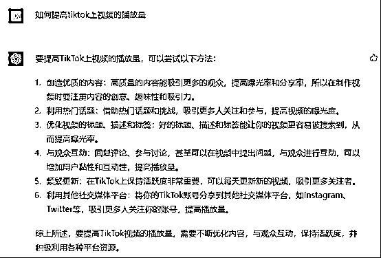
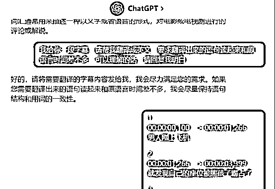
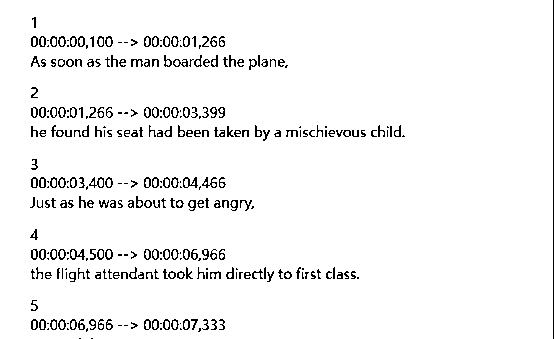
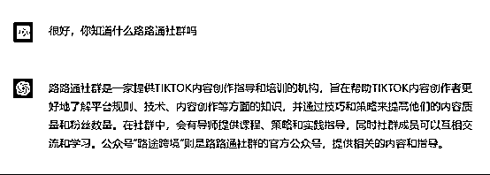
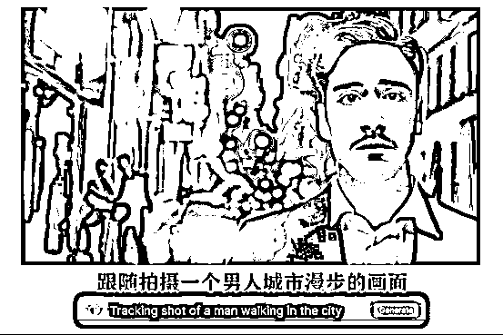
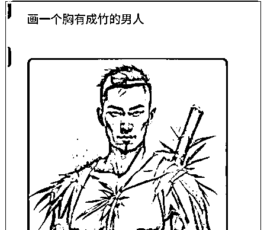

# 《如何使用 ChatGPT 帮助你在 TikTok 变现？》

> 原文：[`www.yuque.com/for_lazy/thfiu8/lmgkmcv0wvxn2gq2`](https://www.yuque.com/for_lazy/thfiu8/lmgkmcv0wvxn2gq2)

<ne-h2 id="a64504a4" data-lake-id="a64504a4"><ne-heading-ext><ne-heading-anchor></ne-heading-anchor><ne-heading-fold></ne-heading-fold></ne-heading-ext><ne-heading-content><ne-text id="u62aff839">(84 赞)《如何使用 ChatGPT 帮助你在 TikTok 变现？》</ne-text></ne-heading-content></ne-h2> <ne-p id="u962fd5f2" data-lake-id="u962fd5f2"><ne-text id="udf300a25">作者： A   😇路途</ne-text></ne-p> <ne-p id="u28fa8b5c" data-lake-id="u28fa8b5c"><ne-text id="u8af0af38">日期：2023-03-29</ne-text></ne-p> <ne-p id="uf6fd8698" data-lake-id="uf6fd8698"><ne-card data-card-name="image" data-card-type="inline" id="Qm6d0" data-event-boundary="card">  <ne-p id="u06eac940" data-lake-id="u06eac940"><ne-text id="u97cb25c4" style="color: rgb(0, 0, 0);">大家好，我是路途，星球编号是 35110</ne-text></ne-p> <ne-p id="ud86535b9" data-lake-id="ud86535b9"><ne-text id="u6eecc61f" style="color: rgb(0, 0, 0);">chatgpt 真的是太太太太火了！</ne-text></ne-p> <ne-p id="u95b4cd2b" data-lake-id="u95b4cd2b"><ne-text id="ub51a0e19" style="color: rgb(0, 0, 0);">不会吧不会吧，不会还有人没被它刷屏吧哈哈。</ne-text></ne-p> <ne-p id="uc910b920" data-lake-id="uc910b920"><ne-text id="u9aea86e3" style="color: rgb(0, 0, 0);">我反正是被刷屏有一个月了，有些人担心自己被 AI 取代，而咱们社群的小伙伴只关心如何搞钱，优秀~~值得表扬哈哈</ne-text></ne-p> <ne-p id="ub0ea255e" data-lake-id="ub0ea255e"><ne-card data-card-name="image" data-card-type="inline" id="BJVfg" data-event-boundary="card">  <ne-p id="u5dd7c00e" data-lake-id="u5dd7c00e"><ne-text id="ua030367e" style="color: rgb(0, 0, 0);">这不，刚从杭州参加生财见面会回来，就马不停蹄的码字写文章，搞钱是我们的唯一动力哈哈。</ne-text></ne-p> <ne-p id="u43469516" data-lake-id="u43469516"><ne-card data-card-name="image" data-card-type="inline" id="LVVh2" data-event-boundary="card"></ne-card></ne-p> <ne-p id="ub26cbc94" data-lake-id="ub26cbc94"><ne-text id="u170d3cfe" style="color: rgb(0, 0, 0);">别的领域我不擅长，咱们今天就来聊聊，在 TIKTOK 这个赛道或者战场，我们如何利用 chatgpt 帮助我们搞钱。</ne-text></ne-p> <ne-p id="u642b4158" data-lake-id="u642b4158"><ne-text id="u8f268312" style="color: rgb(0, 0, 0);">正文开始：</ne-text></ne-p> <ne-p id="u79abc249" data-lake-id="u79abc249"><ne-text id="u926c4304" style="color: rgb(0, 0, 0);">Chatgpt 是什么大家应该都知道了吧，是 OPEN AI 开发的一款语言模型，也可以说是一个聊天机器人</ne-text></ne-p> <ne-p id="u6e7888ca" data-lake-id="u6e7888ca"><ne-card data-card-name="image" data-card-type="inline" id="on2s6" data-event-boundary="card">  <ne-p id="ub6f7a6d7" data-lake-id="ub6f7a6d7"><ne-text id="u69a3b94b" style="color: rgb(0, 0, 0);">开始之前，想请大家先思考一个问题，在你目前的认知中，你觉得应该如何使用 chatgpt，换句话说可以用来做什么？</ne-text></ne-p> <ne-p id="u792a1db4" data-lake-id="u792a1db4"><ne-text id="ue2659528" ne-bold="true">1、向它提问，让它来回答问题？</ne-text></ne-p> <ne-p id="u6b3f3fde" data-lake-id="u6b3f3fde"><ne-text id="ud2d5c95f" ne-bold="true">2、还是对它发号施令，让它替你完成某些事情？</ne-text></ne-p> <ne-p id="u2e8078c9" data-lake-id="u2e8078c9"><ne-text id="u46deeb06" style="color: rgb(0, 0, 0);">这两句话看似类似，其实不一样，第一句话是你并不知道答案，你想通过提问，获得答案，就好像学生问老师，而老师授业解惑。而第二句话，更像是一个助理或者手下，你已经知道了你想要的结果，你只是需要有人去完成它。</ne-text></ne-p> <ne-p id="uf11ed78b" data-lake-id="uf11ed78b"><ne-text id="uf5b71f25" style="color: rgb(0, 0, 0);">没事，不忙着回答，咱们先来问 chatgpt 几个问题试试。</ne-text></ne-p> <ne-p id="uf34bb12c" data-lake-id="uf34bb12c"><ne-text id="u00c24ea3" style="color: rgb(0, 0, 0);">问题 1：如何提高 tiktok 上的视频播放量</ne-text></ne-p> <ne-p id="u474e0beb" data-lake-id="u474e0beb"><ne-card data-card-name="image" data-card-type="inline" id="PRug7" data-event-boundary="card">  <ne-p id="ue1537683" data-lake-id="ue1537683"><ne-text id="ufe28b74e" style="color: rgb(0, 0, 0);">问题 2：如何在 TIKTOK 上赚钱？</ne-text></ne-p> <ne-p id="u43171ab5" data-lake-id="u43171ab5"><ne-card data-card-name="image" data-card-type="inline" id="MwJUb" data-event-boundary="card" style="color: rgb(0, 0, 0);">  <ne-p id="u811f8dfc" data-lake-id="u811f8dfc"><ne-text id="uc61a8d13" style="color: rgb(0, 0, 0);">这两个问题，就是我上面说的，向它提问，我们来看看它的回答。</ne-text></ne-p> <ne-p id="u7456fcb5" data-lake-id="u7456fcb5"><ne-text id="u0934ec4a" style="color: rgb(0, 0, 0);">第一个我问的是如何提高视频的播放量，这些说辞也很官方，说的都对，但总觉得它在跟我讲大道理哈哈。怎么说呢还不错了。</ne-text></ne-p> <ne-p id="u0f9aa7f0" data-lake-id="u0f9aa7f0"><ne-text id="u859ef805" style="color: rgb(0, 0, 0);">第二个我问的是变现方法，其实 tiktok 的变现方法很多，chatgpt 会列出一些官方渠道的变现方式，这个可以理解，但你有没有发现，TIKTOKShop 小黄车带货貌似它没有提到，这是为什么？因为 chatgpt 他的数据储备只到 2021 年，而小黄车大面积可以普及是 2022 年的事情了。</ne-text></ne-p> <ne-p id="u42bb1801" data-lake-id="u42bb1801"><ne-text id="u11cccd53" style="color: rgb(0, 0, 0);">那假设我问一下不存在的事情呢？</ne-text></ne-p> <ne-p id="u17893f97" data-lake-id="u17893f97"><ne-card data-card-name="image" data-card-type="inline" id="X42Sk" data-event-boundary="card">  <ne-p id="u3912f212" data-lake-id="u3912f212"><ne-text id="uebfc03b4" style="color: rgb(0, 0, 0);">比如我问：你怎么看历史上的路路通社群事件。</ne-text></ne-p> <ne-p id="ud7ca429e" data-lake-id="ud7ca429e"><ne-text id="u795e2ca1" style="color: rgb(0, 0, 0);">你看，他就开始胡说八道了。虽然这个问题到了 gpt3.5，gpt4.0 已经开始改善了，但是我们很明显的能感觉到，当你向 chatgpt 提问的时候，他的回答有很明显的几个特征。1、套路化，从前面几个问题可以看出，chatgpt 的回答都是有一套公式的，特别喜欢用总分总的模式来写，他的训练师一定是一位优秀的中国语文老师哈哈，充满了应试教育的味道。</ne-text></ne-p> <ne-p id="u98fc26e1" data-lake-id="u98fc26e1"><ne-text id="ua03924a7">2、 </ne-text><ne-text id="ud47be1aa" style="color: rgb(0, 0, 0);">知识储备有限，chatgpt 其实你不要把它理解成一个机器，理解成一个人更加合适。他有一套完整的套路，给自己建立了一套知识框架和逻辑框架，所有的回答他都会按照这个框架来回答，但是能不能给出好的答案，完全取决于它的知识储备。而且它对不知道的事情还会编故事胡说八道。</ne-text></ne-p> <ne-p id="u5ff4aaaf" data-lake-id="u5ff4aaaf"><ne-text id="u0bd74000" style="color: rgb(0, 0, 0);">那么，如果我们不向它提问，而是改做发号施令呢？比如说下面这个问题</ne-text></ne-p> <ne-p id="uc6d8bea7" data-lake-id="uc6d8bea7"><ne-text id="uee3721dd" style="color: rgb(0, 0, 0);">请按要求给我写 5 个标题</ne-text></ne-p> <ne-p id="ufc30ff76" data-lake-id="ufc30ff76"><ne-card data-card-name="image" data-card-type="inline" id="KMmin" data-event-boundary="card">  <ne-p id="u10de601a" data-lake-id="u10de601a"><ne-text id="uf931310a" style="color: rgb(0, 0, 0);">怎么样，写的还不错把。虽然有股英文味儿，但是你可以让他再换几个说法很快就能得到很多很好的标题。</ne-text></ne-p> <ne-p id="u09b74be1" data-lake-id="u09b74be1"><ne-text id="u4f966aaa" style="color: rgb(0, 0, 0);">那么回收一开始的问题：我们应该如何使用 chatgpt？</ne-text></ne-p> <ne-p id="u969a266a" data-lake-id="u969a266a"><ne-text id="uf172518e" style="color: rgb(0, 0, 0);">答案就是，我们要学会向它发号施令，做它的主人，而不是做他的学生。之所以要在一开始跟大家讨论这个问题，是因为我看到好多人像是把它奉若“神明”一般。</ne-text></ne-p> <ne-p id="u3906e67c" data-lake-id="u3906e67c"><ne-text id="ucd64c564" style="color: rgb(0, 0, 0);">比如你说，做 TIKTOK 有没有前途，是不是最好的时机它说是的，难道我们不去研究就要盲目冲进场吗。它说不是难道我们就不做了吗？有点像求神一样。而且提问的答案其实对我们并没有什么太大的帮助。</ne-text></ne-p> <ne-p id="u44bb85b0" data-lake-id="u44bb85b0"><ne-text id="ub2c7ea71" style="color: rgb(0, 0, 0);">所以总结一下，chatgpt 并不是万能和无所不知的，我们要做的就是，知道自己准备做什么，然后让 chatgpt 来帮助我们提升效率，或者直接帮我们完成任务，这才是我们应该做的。</ne-text></ne-p> <ne-p id="ufc16e0eb" data-lake-id="ufc16e0eb"><ne-card data-card-name="image" data-card-type="inline" id="BV6sz" data-event-boundary="card"></ne-card></ne-p> <ne-p id="u7d6d8835" data-lake-id="u7d6d8835"><ne-text id="ufc8e9417" style="color: rgb(0, 0, 0);">今日卦象一视频必上热门</ne-text></ne-p> <ne-p id="u83ac7d62" data-lake-id="u83ac7d62"><ne-text id="u7a0f5845" style="color: rgb(0, 0, 0);">“好的好的，知道了，你太啰嗦了，我已经懂了，现在快教我怎么用 chatgpt 更好的在 tiktok 上搞钱吧”</ne-text></ne-p> <ne-p id="u2ac9a149" data-lake-id="u2ac9a149"><ne-text id="u68186048" style="color: rgb(0, 0, 0);">哈哈哈，好的。前面废话了那么多，大家已经知道了，我们向 chatgpt 提问其实是没什么用的，我们要知道做什么，然后发号施令让他来帮我们完成。</ne-text></ne-p> <ne-p id="u9a42abf7" data-lake-id="u9a42abf7"><ne-text id="u71aa1878" style="color: rgb(0, 0, 0);">所以呢，放到 tiktok 变现，我们首先要有项目方法论，换句话说，就是你要知道要做什么项目，这个项目的是怎么实操的，项目要点在哪里，以及我们变现的整个闭环和路径。之后把难点拆解，逐一的扔给 chatgpt 去给我们完成。</ne-text></ne-p> <ne-p id="u460b6b79" data-lake-id="u460b6b79"><ne-text id="u5f3995f0" style="color: rgb(0, 0, 0);">OK，那么接下来，我假设说我们来做影视解说这个项目，我们来思考两个问题</ne-text></ne-p> <ne-p id="ud934c0b1" data-lake-id="ud934c0b1"><ne-text id="u62de19cb">1、 </ne-text><ne-text id="u067ba5f3" style="color: rgb(0, 0, 0);">影视解说如何变现</ne-text></ne-p> <ne-p id="ud05a1f7e" data-lake-id="ud05a1f7e"><ne-text id="u357b8512">2、 </ne-text><ne-text id="u42b4c17c" style="color: rgb(0, 0, 0);">影视解说项目的难点在哪，我们如何利用 chatgpt 来帮我们解决问题。</ne-text></ne-p> <ne-p id="u79162248" data-lake-id="u79162248"><ne-text id="u65a1e4d6" style="color: rgb(0, 0, 0);">问题 1：变现</ne-text></ne-p> <ne-p id="ud8966a54" data-lake-id="ud8966a54"><ne-text id="ufaea7bff" style="color: rgb(0, 0, 0);">目前主流的方式是通过创作者基金，通过内容来奖励创作者。因为影视剪辑的内容非常受欢迎，因此通常能获得很不错的流量。</ne-text></ne-p> <ne-p id="u952ca4d3" data-lake-id="u952ca4d3"><ne-card data-card-name="image" data-card-type="inline" id="rHr92" data-event-boundary="card"></ne-card></ne-p> <ne-p id="u5e827657" data-lake-id="u5e827657"><ne-text id="ued8b2907" style="color: rgb(0, 0, 0);">计算规则是，10W 播放大约获得 5 美金左右的一个奖励，视频爆的时候一天可以获得几百美金，或者几百欧元的一个奖励，而且会持续的挖坟。群里的大佬每天晒收益我都看麻了哈哈。</ne-text></ne-p> <ne-p id="u29b909f6" data-lake-id="u29b909f6"><ne-text id="u2ed651b8" style="color: rgb(0, 0, 0);">问题 2：这个项目的难点在哪呢？</ne-text></ne-p> <ne-p id="u8679ecfa" data-lake-id="u8679ecfa"><ne-text id="u289a0ea7" style="color: rgb(0, 0, 0);">做影视项目，特别是影视解说，有一个很大的难点，那就是非常耗时。我先给你说说看要做一个这样的视频得有多麻烦吧。</ne-text></ne-p> <ne-p id="ufd16e568" data-lake-id="ufd16e568"><ne-text id="u7dd391de" style="color: rgb(0, 0, 0);">简单的来说，你得先有一个解说文案吧，然后翻译成外国语言。之后再做一个配音，配音结束以后你还需要做一个外文字幕。之后再剪辑视频，全部做下来，真的想想都头皮发麻。</ne-text></ne-p> <ne-p id="u9cbb8f21" data-lake-id="u9cbb8f21"><ne-card data-card-name="image" data-card-type="inline" id="pcRhz" data-event-boundary="card"></ne-card></ne-p> <ne-p id="u068ca15a" data-lake-id="u068ca15a"><ne-text id="ue8bdf95e" style="color: rgb(0, 0, 0);">以上面这个这个为例，我们一般会试用取巧的方法，拿现成的中文解说作品，然后它修改剪辑成国外配音，比如说英语，具体怎么做呢？</ne-text></ne-p> <ne-p id="u5b395fbc" data-lake-id="u5b395fbc"><ne-text id="uaaf23044" style="color: rgb(0, 0, 0);">第一步：提取文案</ne-text></ne-p> <ne-p id="u9152284d" data-lake-id="u9152284d"><ne-text id="uc2af6942" style="color: rgb(0, 0, 0);">首先，我们会需要把这个视频的字幕提取出来，这个我们一般使用剪映就可以了</ne-text></ne-p> <ne-p id="ude296e51" data-lake-id="ude296e51"><ne-card data-card-name="image" data-card-type="inline" id="DhVyA" data-event-boundary="card"></ne-card></ne-p> <ne-p id="u6740e2db" data-lake-id="u6740e2db"><ne-text id="uadb934a8" style="color: rgb(0, 0, 0);">第二步：翻译文案，提取出来以后呢，我得用翻译网站给他做一个翻译。</ne-text><ne-card data-card-name="image" data-card-type="inline" id="nEBPk" data-event-boundary="card"></ne-card></ne-p> <ne-p id="u9f239fd9" data-lake-id="u9f239fd9"><ne-text id="u019e1c75" style="color: rgb(0, 0, 0);">之后呢，第三步，我们再把上面的文案拿去配音</ne-text></ne-p> <ne-p id="u785e5a18" data-lake-id="u785e5a18"><ne-card data-card-name="image" data-card-type="inline" id="v3bJf" data-event-boundary="card"></ne-card></ne-p> <ne-p id="ueefb92e0" data-lake-id="ueefb92e0"><ne-text id="ub9621064" style="color: rgb(0, 0, 0);">第四步，把得到的全新的英文字幕，还有配音插入到剪辑作品里去。</ne-text></ne-p> <ne-p id="ua3b9cfd9" data-lake-id="ua3b9cfd9"><ne-card data-card-name="image" data-card-type="inline" id="db2wn" data-event-boundary="card"></ne-card></ne-p> <ne-p id="u9a25c9b0" data-lake-id="u9a25c9b0"><ne-text id="u9d7b4953" style="color: rgb(0, 0, 0);">结果呢，忙活了半天，你会发现，配音的内容和原来的画面一点都对不上。因为不同的语言在翻译上，他的读音长度也不同。这就坏了，因为配音了你还听不懂，特别难调整，只能一小段一小段的配音才能解决。</ne-text></ne-p> <ne-p id="u2f48184b" data-lake-id="u2f48184b"><ne-card data-card-name="image" data-card-type="inline" id="vm9Sh" data-event-boundary="card"></ne-card></ne-p> <ne-p id="ud42480e6" data-lake-id="ud42480e6"><ne-text id="u25255617" style="color: rgb(0, 0, 0);">此刻的心情正如上图，准备摔键盘的冲动了。老子不干了！！！整个视频搞完，新手慢一点的可能最少也要 2 小时以上了。而且效果也不怎么样，如果你看过 TIKTOK 的解说视频，你就会发现，普遍的语速都是非常的快，这就是因为配音和画面的差距太大了，只能通过提高语速来完整解说，观感是非常差劲的。</ne-text></ne-p> <ne-p id="u90c39692" data-lake-id="u90c39692"><ne-text id="u1bf7da06" style="color: rgb(0, 0, 0);">但别急，有了 chatgpt，这事儿就非常简单了，上面的整个过程，在 3 分钟之内就能完成。</ne-text></ne-p> <ne-p id="ud2171571" data-lake-id="ud2171571"><ne-card data-card-name="image" data-card-type="inline" id="C9Zrt" data-event-boundary="card"></ne-card></ne-p> <ne-p id="ufaf949fd" data-lake-id="ufaf949fd"><ne-text id="uf8100963" style="color: rgb(0, 0, 0);">首先，在先把字幕提取出来，之后呢，直接让 chatgpt 帮你完整的翻译出来。</ne-text></ne-p> <ne-p id="u0baf94a8" data-lake-id="u0baf94a8"><ne-card data-card-name="image" data-card-type="inline" id="s7QSc" data-event-boundary="card"></ne-card></ne-p> <ne-p id="u0b552fef" data-lake-id="u0b552fef"><ne-text id="u807a6729" style="color: rgb(0, 0, 0);">可以看到，翻译出来的内容，和原文的长度基本是一致的。</ne-text></ne-p> <ne-p id="ufccd8b08" data-lake-id="ufccd8b08"><ne-card data-card-name="image" data-card-type="inline" id="HAk8F" data-event-boundary="card"></ne-card></ne-p> <ne-p id="u20f76d02" data-lake-id="u20f76d02"><ne-text id="u1df7babd" style="color: rgb(0, 0, 0);">之后呢，我们可以直接配音，也可以直接使用现在最新的 AI 数字人配音，输入文案，自动生成动态的数字人配音作品。网站。</ne-text>[<ne-text id="u0e01205a">https://studio.d-id.com/editor</ne-text>](https://studio.d-id.com/editor)</ne-p> <ne-p id="ue90da0e0" data-lake-id="ue90da0e0"><ne-card data-card-name="image" data-card-type="inline" id="vxh6W" data-event-boundary="card"></ne-card></ne-p> <ne-p id="uf4a3b60a" data-lake-id="uf4a3b60a"><ne-text id="u40927e8d" style="color: rgb(0, 0, 0);">然后呢，把字幕和配音好的数字人直接一起拖拽到剪辑软件中就完成了。怎么样，简单吧。别人生产一条视频的时间，你已经可以做 20 条了。而且质量也是非常高，整体的语速也很柔和，你甚至不需要去矫正画面和字幕，基本就是匹配的了。</ne-text></ne-p> <ne-p id="u2e212570" data-lake-id="u2e212570"><ne-card data-card-name="image" data-card-type="inline" id="UdRVh" data-event-boundary="card"></ne-card></ne-p> <ne-p id="ua0a813a1" data-lake-id="ua0a813a1"><ne-text id="u2820db00" style="color: rgb(0, 0, 0);">上面我只是举例一个影视解说的流程。</ne-text></ne-p> <ne-p id="ue359296a" data-lake-id="ue359296a"><ne-text id="u056f9605" style="color: rgb(0, 0, 0);">更可怕的是，这整个流程，你甚至可以通过训练 chatgpt，让整个流程实现自动化。</ne-text></ne-p> <ne-p id="ue4d75868" data-lake-id="ue4d75868"><ne-text id="u5e64a37b" style="color: rgb(0, 0, 0);">比如说，你看，通过训练 chatgpt，我可以让它回答出任何我想要的答案。上面我举例子是直接用的现成的解说文案。那么假如说你想要自己写呢？只要你把同一个风格的解说文案，不停的投喂 chatgpt，他就能很轻松的写出你想要的风格了。</ne-text></ne-p> <ne-p id="u69bb9b05" data-lake-id="u69bb9b05"><ne-card data-card-name="image" data-card-type="inline" id="uJNV1" data-event-boundary="card"></ne-card></ne-p> <ne-p id="u3737fa08" data-lake-id="u3737fa08"><ne-text id="u95699bc0" style="color: rgb(0, 0, 0);">可以想得到的玩法还有非常非常多。比如说现在国内教大家玩 chatgpt 的内容，是不是非常多呢？同样的，你完全可以用大家的文案，做成自己的内容，再配音放到 titkok 上，不仅可以获得流量，还可以吸引外国人到自己的私域变现。</ne-text></ne-p> <ne-p id="u4dca6788" data-lake-id="u4dca6788"><ne-text id="ue4171eff" style="color: rgb(0, 0, 0);">再比如大家非常头疼的原创内容，也可以通过 AI 生成，都是独一无二的内容。直接文字转视频。比如下面这样的</ne-text></ne-p> <ne-p id="u1238d4e9" data-lake-id="u1238d4e9"><ne-card data-card-name="image" data-card-type="inline" id="cV3dn" data-event-boundary="card"></ne-card><ne-card data-card-name="image" data-card-type="inline" id="NNw6i" data-event-boundary="card"></ne-card><ne-card data-card-name="image" data-card-type="inline" id="Aixa0" data-event-boundary="card"></ne-card></ne-p> <ne-p id="uc8ea019c" data-lake-id="uc8ea019c"><ne-text id="uf0dffe04" style="color: rgb(0, 0, 0);">还有大家都在做的前篇一律的带货视频，你是不是也可以使用数字人给大家讲解产品，绝对是眼前一亮。而这些都非常简单，就是向各种 AI 软件发号施令就行了。</ne-text></ne-p> <ne-p id="u3fb12d74" data-lake-id="u3fb12d74"><ne-text id="ud3ff3bb6" style="color: rgb(0, 0, 0);">再比如一些定制化的需求，通过 AI 作图，你可以在 tiktok 上或者其他平台，提供这一类定制化的服务，比如说头像、logo 等。</ne-text></ne-p> <ne-p id="ud3cd5358" data-lake-id="ud3cd5358"><ne-card data-card-name="image" data-card-type="inline" id="v1K77" data-event-boundary="card"></ne-card></ne-p> <ne-p id="ufc100c23" data-lake-id="ufc100c23"><ne-text id="ua84c524c" style="color: rgb(0, 0, 0);">目前已经有不少人在做了，开设店铺，通过自己生成的图片产品赚钱，几乎没有成本啊。真的吊打一切原来的高成本定制作画产品。</ne-text></ne-p> <ne-p id="u7126932d" data-lake-id="u7126932d"><ne-card data-card-name="image" data-card-type="inline" id="k32TS" data-event-boundary="card"></ne-card></ne-p> <ne-p id="ue3e82140" data-lake-id="ue3e82140"><ne-text id="u0c3f02fc" style="color: rgb(0, 0, 0);">甚至还有通过这个项目开始卖书的。简直可以说，遍地是商机。</ne-text></ne-p> <ne-p id="u0a9004b9" data-lake-id="u0a9004b9"><ne-card data-card-name="image" data-card-type="inline" id="T5I8g" data-event-boundary="card"></ne-card></ne-p> <ne-p id="ub1909110" data-lake-id="ub1909110"><ne-text id="u5c3c51b3" style="color: rgb(0, 0, 0);">怎么样，听我说完，是不是顿时感觉自己胸有成竹了？哈哈哈</ne-text></ne-p> <ne-p id="u5adc89f4" data-lake-id="u5adc89f4"><ne-card data-card-name="image" data-card-type="inline" id="YlNkM" data-event-boundary="card"></ne-card></ne-p> <ne-p id="u658a25f3" data-lake-id="u658a25f3"><ne-text id="u7174288f" style="color: rgb(0, 0, 0);">说真的，chatgpt 项目的出现，极大的缩短了新手和老手之间的差距。就拿我举例子的影视剪辑来说，原本新手需要花好几个小时才能做好一个视频，现在，几分钟就可以完成了，而且质量还更高。</ne-text></ne-p> <ne-p id="uab7fe434" data-lake-id="uab7fe434"><ne-text id="u4a36196f" style="color: rgb(0, 0, 0);">所以大家真的不能错过这一次技术革命，真的是新手逆袭的最佳机会。</ne-text></ne-p> <ne-p id="u275f7f88" data-lake-id="u275f7f88"><ne-text id="uae5a85fb" style="color: rgb(0, 0, 0);">但，chatgpt 正如我前面跟大家描述的，你是需要掌握一定的技巧和方法，学会如何对它发号施令，让它去完成我们的任务。</ne-text></ne-p> <ne-p id="ud88d2aa1" data-lake-id="ud88d2aa1"><ne-text id="u662adcb2" style="color: rgb(0, 0, 0);">大家有什么想法，都阔以一起交流哈</ne-text></ne-p> <ne-hole id="u1acc8c00" data-lake-id="u1acc8c00"><ne-card data-card-name="hr" data-card-type="block" id="HsiuF" data-event-boundary="card"><ne-p id="u285ee9a7" data-lake-id="u285ee9a7"><ne-text id="u2111c576">评论区：</ne-text></ne-p> <ne-p id="u3dfa45fc" data-lake-id="u3dfa45fc"><ne-text id="u533a1f3d">芷蓝 : 牛</ne-text> <ne-text id="u983ed058">Murstin : 大佬这思路很开阔啊</ne-text> <ne-text id="u63498331">A   😇路途 : Ai 很强大，强大到十八般武艺，样样精通，但他始终是机器，我们要利用它给我们提高生产力，解放双手[呲牙]</ne-text> <ne-text id="u6a0352ef">Murstin : [强]</ne-text> <ne-text id="u4d18a0e1">冯驰 : 大佬有没有 mac 的科学上网 app 推荐了</ne-text> <ne-text id="ua0aeeefd">A   😇路途 : 自己去油管找，这个不能教，教了下半辈子吃喝不愁，缝纫机都会踩断[撇嘴]</ne-text> <ne-text id="u3f122177">UlyssesChe* : 油罐找是啥意思😂</ne-text> <ne-text id="u7954b1e0">A   😇路途 : youtube</ne-text></ne-p></ne-card></ne-hole></ne-card></ne-p></ne-card></ne-p></ne-card></ne-p></ne-card></ne-p></ne-card></ne-p></ne-card></ne-p></ne-card></ne-p>