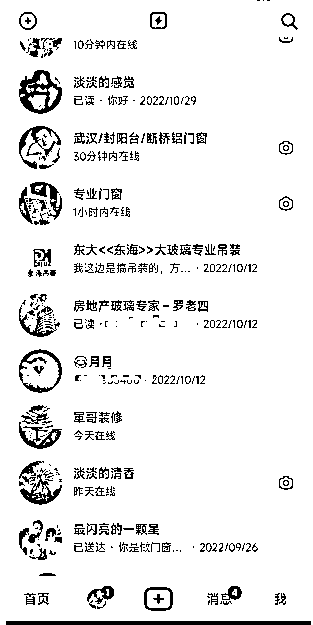

# 《通过 ChatGPT + BOSS 直聘 + RPA 来挖掘适合普通人赚钱的项目》

> 原文：[`www.yuque.com/for_lazy/thfiu8/pvsu8wxbw1lrx0zu`](https://www.yuque.com/for_lazy/thfiu8/pvsu8wxbw1lrx0zu)

<ne-h2 id="1544e8ef" data-lake-id="1544e8ef"><ne-heading-ext><ne-heading-anchor></ne-heading-anchor><ne-heading-fold></ne-heading-fold></ne-heading-ext><ne-heading-content><ne-text id="u57b7e956">(89 赞)《通过 ChatGPT + BOSS 直聘 + RPA 来挖掘适合普通人赚钱的项目》</ne-text></ne-heading-content></ne-h2> <ne-p id="uffaba948" data-lake-id="uffaba948"><ne-text id="uec992f59">作者： 渣渣浩</ne-text></ne-p> <ne-p id="u3b4c7034" data-lake-id="u3b4c7034"><ne-text id="ub519f262">日期：2023-03-31</ne-text></ne-p> <ne-p id="u0653e219" data-lake-id="u0653e219"><ne-text id="u771d79b4">通过 chatgpt+BOSS 直聘+RPA 来挖掘适合普通人赚钱的项目</ne-text></ne-p> <ne-p id="u996d36c6" data-lake-id="u996d36c6"><ne-text id="uf968b668">1.BOSS 直聘上项目的优势</ne-text></ne-p> <ne-p id="ub219aef1" data-lake-id="ub219aef1"><ne-text id="uc4af703d">很多路子，基本上见了光之后，就成千上万的人跟着做，</ne-text> <ne-text id="uc414ccf7">所谓的路子，最后连平台都知道了，也就挂了。</ne-text> <ne-text id="uf4f113c7">很多时候，不是别人吝啬分享，</ne-text> <ne-text id="ud11f7645">分享往往意味着自掘坟墓。</ne-text> <ne-text id="ue748b5f0">所以生财这无数的项目分享，是多么的珍贵。</ne-text> <ne-text id="u776ced43">由于人口基数足够大，又聪明，又勤快，一旦大量的人进入，再好的项目，内卷之后，赚钱都会越来越难。</ne-text> <ne-text id="ue280e2d9">保姆式教程意味着人人都会，人人都会就意味着。。。</ne-text> <ne-text id="u13cea4ee">零和博弈，它不是你死就是我亡，所以人见人爱，和睦一家亲是不存在的。</ne-text> <ne-text id="u96186825">但是 BOSS 直聘这样的招聘网站就不一样了，</ne-text> <ne-text id="ud969dd51">每一个招聘需求的背后，都是一个项目，</ne-text> <ne-text id="u86ec67ab">每一个持续招聘需求的背后，都是一个大概率稳定赚钱的项目。</ne-text> <ne-text id="u7d9a00cf">而且 BOSS 直聘很多项目是线下的。</ne-text> <ne-text id="u4b5e8b22">是很小很小的很普通的个体。</ne-text> <ne-text id="u27c12ead">被普通人验证过的，同为普通人的你拿到结果的概率相对更大。</ne-text></ne-p> <ne-p id="u6b5fe00d" data-lake-id="u6b5fe00d"><ne-text id="u3c5b5ccf">2.用 chatgpt 和 RPA 分析和调研项目</ne-text></ne-p> <ne-p id="u4c6f4efa" data-lake-id="u4c6f4efa"><ne-text id="ue4cd9031">从 2 个方向来分析和研究竞争对手：</ne-text> <ne-text id="u9f094a40">1：发布同样的招聘信息</ne-text> <ne-text id="ubf5c3ab0">2：以求职者的身份来调研竞争对手</ne-text> <ne-text id="u4c614578">用 RPA 采集招聘信息和求职者信息，再通过 chatgpt 整合生成出招聘文案以及求职简历，再用 RPA 批量发布到全国。</ne-text> <ne-text id="u7923bc7c">项目库+人才库+流量库   搞定！</ne-text> <ne-text id="uf834c056">保险公司天天招月月招年年招，他招的是求职者吗？</ne-text> <ne-text id="u81ac5f93">不，他招的是客户！！！</ne-text> <ne-text id="u2696aa63">有的大 V 天天找月月招年年招，他招的是员工吗？</ne-text> <ne-text id="u8336ba48">不，他招的是粉丝！！！</ne-text> <ne-text id="udbd6e1fa">他招的是搜索，点击和浏览！！！</ne-text></ne-p> <ne-p id="ud7bab62b" data-lake-id="ud7bab62b"><ne-text id="u15d45c02">3.普通人通过 BOSS 直聘来找项目</ne-text></ne-p> <ne-p id="u73e7cd76" data-lake-id="u73e7cd76"><ne-text id="u81158f9f">普通人没有对公账户，没有公司，更没有办公场所，没有 BOSS 直聘招聘账户，怎么用这个赚钱？</ne-text> <ne-text id="u8d4ffbba">当你用 3,5 个账号，挂出 3,5 个 BOSS 直聘简历之后，那就不是你找项目了，是项目送上门来找你。</ne-text> <ne-text id="uf38b049b">有人可能会心虚，完全不懂的行业，被问问题，回答不上来怎么办？</ne-text></ne-p> <ne-p id="u2b4ff247" data-lake-id="u2b4ff247"><ne-text id="u73762b20">chatgpt！！！</ne-text></ne-p> <ne-p id="u16397d7d" data-lake-id="u16397d7d"><ne-text id="u100ce61a">你像海选一样去查看这些项目，哪些是你能胜任的，上班或者合作都是不错的选择。</ne-text> <ne-text id="u373c3db4">做个有准备的人，不要等到需要找工作的时候才去找工作。</ne-text></ne-p> <ne-p id="ufbf400b3" data-lake-id="ufbf400b3"><ne-text id="uda4613af">4.自动化是最后一步</ne-text></ne-p> <ne-p id="u2e9b6039" data-lake-id="u2e9b6039"><ne-text id="ubee6ddec">先跑完手动流程，再来想自动化的需求</ne-text></ne-p> <ne-p id="uaf05f3c0" data-lake-id="uaf05f3c0"><ne-text id="uba1c75be">5.案例</ne-text></ne-p> <ne-p id="ubc7a0b96" data-lake-id="ubc7a0b96"><ne-text id="ue95232d6">通过 boss 直聘，找到了一个门窗的项目，先发作品，再直接抖音找门窗厂家处理订单，批发零售都可以接。</ne-text> <ne-text id="u84fbfc62">单个账户的咨询不多，一个月差不多 30 到 60 个询盘，好在封阳台的客单价还可以，利润也比 9 块 9 包邮日出百单来的实在一些。选择门窗的原因是发现同行很多都是线下小门面的小夫妻，压根就不懂什么互联网或者抖音，甚至门窗厂家的画面也都比较 low，不像线上的蜂蜜，很多王炸卖家。非常符合从盗坤那学到的蓝海思维，选择幼儿园的小朋友来打。</ne-text><ne-card data-card-name="image" data-card-type="inline" id="PKl5S" data-event-boundary="card">  <ne-p id="uf4f7404a" data-lake-id="uf4f7404a"><ne-card data-card-name="image" data-card-type="inline" id="Ni2on" data-event-boundary="card">  <ne-hole id="u2b66d9c9" data-lake-id="u2b66d9c9"><ne-card data-card-name="hr" data-card-type="block" id="rHcah" data-event-boundary="card"><ne-p id="u132f67e7" data-lake-id="u132f67e7"><ne-text id="ub92241f7">评论区：</ne-text></ne-p> <ne-p id="u987df644" data-lake-id="u987df644"><ne-text id="u170d04b8">坤坤 : 我就在看 BOOS 直聘的时候看这些公司，想着他们凭什么赚钱，凭什么招聘人还开这么高工资💰。</ne-text> <ne-text id="u0f38fcdd">哈哈哈哈哈 ，还可以这样挖掘项目。圈友👍</ne-text> <ne-text id="u1a70af96">金九渊 : 通过 boss 直聘找厂家合作？</ne-text> <ne-text id="u4f78099e">趣旅游 : 好像看出点门道，能具体点吗，或者私聊？</ne-text> <ne-text id="uc04eafac">书情小跟班 : 经典</ne-text> <ne-text id="u1fc83103">保险公司天天招月月招年年招，他招的是求职者吗？</ne-text> <ne-text id="u57f0b89a">不，他招的是客户！！！</ne-text> <ne-text id="u6180217f">有的大 V 天天找月月招年年招，他招的是员工吗？</ne-text> <ne-text id="uf6f0b4c4">不，他招的是粉丝！！！</ne-text> <ne-text id="u48fdd0e4">他招的是搜索，点击和浏览！！！</ne-text> <ne-text id="ub2ae01c3">渣渣浩 : 可以的。不同的角度获取的信息也不一样，没人会比你的员工更了解你正在做的项目。</ne-text></ne-p> <ne-p id="u15ba58f3" data-lake-id="u15ba58f3"><ne-text id="u03e48d99">如果同行公开的信息挖掘的不够深入，那通过招聘会是一个思路。</ne-text></ne-p> <ne-p id="uc890222b" data-lake-id="uc890222b"><ne-text id="u44d18e03">这篇文章更多的是想表达建立项目库，人才库的重要性，有些项目，boss 直聘也是流量的获取渠道，手机号，微信号都直接拿到了，没有哪个平台比性价比这更高了，说 boss 直聘是流量库一点也不过分。</ne-text> <ne-text id="uf6ed1e56">渣渣浩 : 嗯，和厂家合作是其中一个思路</ne-text> <ne-text id="u6133aab7">来说 Web3 : 高级的猎手往往以猎物出现</ne-text> <ne-text id="uf8221b0c">趣旅游 : 嗯，流量获取是一个不错的方向 ，只是要跑通一个项目得集合自己的资源和实际情况看看能不能更好的变现，相信老师在这方面早已走在前面，希望不吝多多指教。</ne-text></ne-p></ne-card></ne-hole></ne-card></ne-p></ne-card></ne-p>