# 《行动起来，就会有好事发生：AI 绘画万字使用手册》

> 原文：[`www.yuque.com/for_lazy/thfiu8/xftu0r1282k5zf2n`](https://www.yuque.com/for_lazy/thfiu8/xftu0r1282k5zf2n)

## (245 赞)《行动起来，就会有好事发生：AI 绘画万字使用手册》 

作者： 天辉 

日期：2023-03-27 

大家好哇，我是天辉~，「AI 绘画联盟」星球创始人，「生财有术航海家」成员，今年 2 月份「AI 绘画&ChatGPT」航海内容出品人及教练之一。 

今天跟大家分享两个东东， 

第一部分，是帮助你行动起来的分享（航海分享） 

第二部分，是辅助你行动赚钱的材料（AI 绘画万字使用手册） <ne-h3 id="cb543d78" data-lake-id="cb543d78">一、生财分享</ne-h3> 

去年 10 月份在生财的首发帖《生财一句话，衍生一个“AI 绘图”IP》[https://articles.zsxq.com/id_jja2zeh2r7nc.html](https://articles.zsxq.com/id_jja2zeh2r7nc.html)拿到了一颗龙珠，随后专注于 AI 绘画，在生财的帮助下不断地破圈，认识了更多圈友，帮到了更多伙伴。 

今年 3 月初，收到 张子安@生财有术 的邀请，我在航海中进行了《AI 绘画的新进展和未来趋势：ChatGPT 带来的变革》的启航主题分享，内容虽然不多，但是可以鼓励伙伴们行动起来。行动起来，就会有好事发生。 

为了进一步降低圈友们行动的卡点，我将当天分享的全部内容授权给了所有航海的伙伴，用于下场变现。所有伙伴无论有没有基础，都可以通过一键转发或者小小修改的方式，获得第一桶金。 

很多圈友当天变现，拿到了正反馈，很多伙伴给我发了感谢红包。 

今天发帖的圈友@浅色 8ug 的喵 通过这个行动点，开启了自己的 AI 绘画之旅，也让我非常开心~ 

《1 年没赚回门票，2 月航海我赚了 5 倍 @浅色 8ug 的喵》[https://t.zsxq.com/0cMfh2oKR](https://t.zsxq.com/0cMfh2oKR) 

大家的反馈还不错，很荣幸今天再次收到子安的邀请，将当日分享的全文带给更多的圈友，希望能对大家有所帮助或启发，分享全文： 

[https://i.shengcaiyoushu.com/docx/UKHPdTS6jo4Dwpxn3cfcwBenngb](https://i.shengcaiyoushu.com/docx/UKHPdTS6jo4Dwpxn3cfcwBenngb) <ne-h3 id="9039450f" data-lake-id="9039450f"> </ne-h3> <ne-h3 id="a835517e" data-lake-id="a835517e">二、Midjourney 基础使用手册（万字干货文）</ne-h3> 

能帮得的到伙伴才是人脉，所以我也希望能够帮助到更多的伙伴， 

再额外分享给圈友一份 AI 绘画基础攻略， 

能够覆盖 AI 绘画工具 Midjourney 目前所有的参数以及命令的底层应用逻辑。 

抛砖引玉，希望能够带来更多的启发，碰撞出更多的火花 

如果它对你有一点帮助，我会很开心，谢谢大家~ <ne-h4 id="e6d6b84d" data-lake-id="e6d6b84d">目录：</ne-h4> 

一、核心操作 

1.1 出图核心 

1.2 付费订阅 

二、绘图 

2.1 prompt（出图用的描述词） 

2.2 blend（图像融合） 

三、模型与分辨率扩大 

3.1 模型（出图效果） 

3.2 分辨率扩大（Upscalers） 

四、出图命令 

4.1 最全命令列表 

4.2 用户信息查询命令 

4.3 设置与预设命令（用以节省时间） 

4.4 复现自己历史图片命令 

五、出图参数 

5.1 最全参数列表 

5.2 比例参数（--ar） 

5.3 稳定参数（--chaos） 

5.4 质量参数（--q） 

5.5 种子参数（--seed） 

5.6 停止参数（--stop） 

5.7 风格参数（--style or --s） 

5.8 平铺参数（--tile） 

5.9 版本参数（--v） 

5.10 视频参数（--video） 

六、进阶描述词 

6.1 图生图进阶 

6.2 修图重要参数（Remix） 

6.3 复杂提示词（多样 prompt） 

七、获得免费出图时长 

这是一份基础教程，译自官方手册，加以我自己的经验补充。 

全文有一万七千字，上百张示意图。一份文章，完整度超过市面上千元的课程。 

写它的目的，除了帮助新手们系统入门，帮助高手们查漏补缺以外，还想以它为基础，咱们整个大的~ 

任何文章中对你有所启发的小片段，都可以写一下你在使用过程中的经验心得。 

任何你觉得还能补充的地方，都可以写点补充，@我，并写上对应的章节编号。 

无论长短，适合的内容，我都会将你的文章链接贴在对应攻略的下方，让今后所有的后续伙伴们都能够因为你而有所得，有所启发。 

随着学习的伙伴越来越多，这篇文章也会越来越丰富，直到成为市面上独一无二，最大、最全、最有用的 Midjourney 实用手册！ 

## 一、核心操作 <ne-h3 id="8f52810a" data-lake-id="8f52810a">1.1 出图核心</ne-h3> 

聊天框输入“/imagine”描述词，会跳出一个菜单栏， 

选中“imagine prompt”, 之后会跳出一个输入框， 

在输入框里输入文字，比如“vibrant califonia flower”(充满活力的加利福尼亚花朵)， 

按一下回车即可 

  

会看到图片逐渐生成 

  

以上就是核心操作，1 分钟不到生成一张图， 

所有与 Midjourney 有关的图像生成，都离不开这一步。 <ne-h3 id="b2b361dd" data-lake-id="b2b361dd">1.2 付费订阅</ne-h3> 

Midjourney 免费额度很少，如果想要使用更多，需要付费订阅 

[https://www.midjourney.com/account/](https://www.midjourney.com/account/) 

基础版：10 美元 / 月（少量图片，轻度使用） 

标准版：30 美元 / 月（无限图片，重度使用） 

企业版：60 美元 / 月（重要图片，保密使用） 

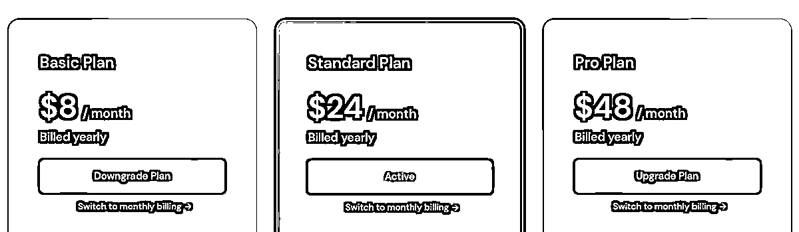 

如果直接订阅年费，价格可以打八折。 

以上是付费订阅简单介绍，更详细的内容，参考后续章节 

## 二、绘图 

如何到达核心操作，还不会的伙伴，可以移步飞书[https://vxcni1izs8.feishu.cn/docx/ATzUdYFxCo8QtbxMAIaceDJmnQc](https://vxcni1izs8.feishu.cn/docx/ATzUdYFxCo8QtbxMAIaceDJmnQc) 

接下来，我会将官方使用手册的内容解读给大家，查漏补缺，也许你会有更新的理解 <ne-h3 id="1525b546" data-lake-id="1525b546">2.1 Prompt</ne-h3> 

它是一个简短的文本短语，用于生成图像。也就是你输入，让机器进行识别，并绘图的描述词。 <ne-h3 id="6d47ac66" data-lake-id="6d47ac66">Prompt 的组成结构</ne-h3> <ne-h4 id="3cdf2838" data-lake-id="3cdf2838">2.1.1 基础 Prompts</ne-h4> 

一个基础的描述词可以是简单的一个单词，短语，或者 emoji 表情 

比如， 

一只狗：a dog 

街道旁的大树：The big tree beside the street 

🤖(一个 emoji 表情) 

输入在这个聊天框里即可 

  <ne-h4 id="9134f040" data-lake-id="9134f040">2.1.2 进阶 Prompts</ne-h4> 

更高级的提示词可以包括一个或多个图像 url、多个文本短语和一个或多个参数 

  

Image Prompts：（图生图，垫图，都是指这个，可以加入多个图 

你可以通过提供图片的方式，告诉 Midjourney 你想要生成的图像信息，包括，构图，色彩，风格，人物等信息，使用方式如下：(苹果机演示的，但网页端，电脑端都一样) 

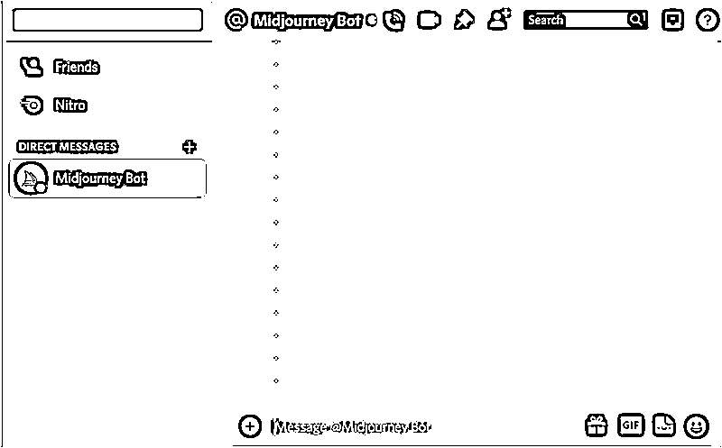  

Prompt Text 

要生成的图像的文本描述。会有一篇文章来介绍 

Parameters 

参数改变图像生成的方式。参数可以改变纵横比、模型等等非常多的影响。参数放在提示符的末尾。 

有固定的格式，一般是，“--对应的英文字符”，这个章节会专门写一篇文章来介绍 

比如 

--ar 3:4   👉设置图片的纵横比为 3 比 4 

--v 4       👉使用第 4 版本的模型 <ne-h3 id="80caa5d2" data-lake-id="80caa5d2">Prompting 简要笔记</ne-h3> <ne-h4 id="6b2d7caa" data-lake-id="6b2d7caa">2.1.3 Prompt 长度</ne-h4> 

提示可以非常简单。单个单词(甚至是一个表情符号!)就可以生成一张图像。非常短的提示，那就以 Midjourney 的默认风格为主，如果想要更具体的意向场景，需要对应的提示词。然而，太长的提示也不一定更好，不是所有的图像元素都会得到表达。 <ne-h4 id="80ebcc63" data-lake-id="80ebcc63">2.1.4 语法</ne-h4> 

“Midjourney”对语法、句子结构不敏感，对用词敏感。更具体的同义词在很多情况下效果更好。与其说 big，不如试着用 enormous，larger，crucial，important，considerable，material。 

与大家理解的越大越全不同，实际上，单词越少，每个单词的影响力就越大。用逗号分割语义，如果想让某些元素组合表达，用括号或者连字符以及 and , with , of 等词汇进行结合。 <ne-h4 id="904115de" data-lake-id="904115de">2.1.5 表达要的，而非表达不要的</ne-h4> 

最好描述你想要什么，而不是你不想要什么。如果你要求一个“没有蛋糕”的派对，你的形象可能会包括一个蛋糕。如果要去除元素，可以参考 --no 参数，具体使用方式，后续会说。 <ne-h4 id="c20d6acf" data-lake-id="c20d6acf">2.1.6 多想一点细节</ne-h4> 

一个反常规的思路：描述词不是描述词，而是限定词，你所限定的内容，由 Midjourney 理解并体会表达。你所不限定的，它将自由发挥。自由发挥的内容可能很好，也可能很差，所以，如果你已经有比较好的细节想法，多想一想，把它描述出来 

一些简单的细节参考思路示例： 

主题：person, animal, character, location, object, etc. 

（人物、动物、人物、地点、物体等） 

媒介：photo, painting, illustration, sculpture, doodle, tapestry, etc 

（照片、绘画、插画、雕塑、涂鸦、挂毯等） 

环境： indoors, outdoors, on the moon, in Narnia, underwater, the Emerald City, etc. 

（室内、室外、月球上、纳尼亚、水下、翡翠城等） 

灯光：soft, ambient, overcast, neon, studio lights, etc 

（柔和，环境，阴天，霓虹灯，工作室灯等） 

颜色：vibrant, muted, bright, monochromatic, colorful, black and white, pastel, etc. 

（鲜艳、柔和、明亮、单色、彩色、黑白、粉彩等） 

情绪：Sedate, calm, raucous, energetic, etc. 

（稳重、冷静、沙哑、精力充沛等） 

构图：Portrait, headshot, closeup, birds-eye view, etc. 

（人像、大头照、特写、鸟瞰图等） <ne-h4 id="e8261426" data-lake-id="e8261426">2.1.7 具体的数量词，而非含糊的量词</ne-h4> 

“three cats”（3 只猫）要比“cats”（猫们）效果更具象，“a flock of birds”（一群鸟）要比“birds”（鸟们）效果更具象。 

2.1.8 一些修饰词示例 

简短的单词提示，也会在 Midjourney 的默认风格中产生很棒的效果 

但也有很多的修饰词，对画面影响很大 

比如，想要生成一只猫，有多少种不同的猫 <ne-h4 id="9b18531f" data-lake-id="9b18531f">2.1.8.1 艺术介质</ne-h4> 

颜料？蜡笔？刮板？印刷机？亮片？墨水？彩纸？...... 

产生时尚形象的最好方法之一，是指定一种艺术媒介。 

 

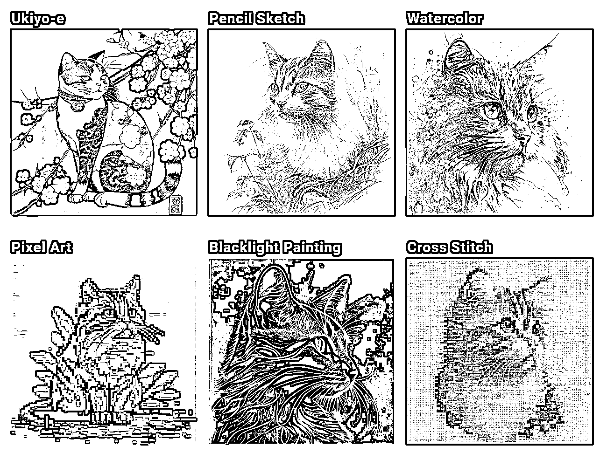  <ne-h4 id="0a41fa8d" data-lake-id="0a41fa8d">2.1.8.2 精确描述</ne-h4> 

更精确的单词和短语将有助于创建具有正确外观和感觉的图像。 

  <ne-h4 id="dc83501d" data-lake-id="dc83501d">2.1.8.3 时间旅行者</ne-h4> 

不同的时代有不同的视觉风格 

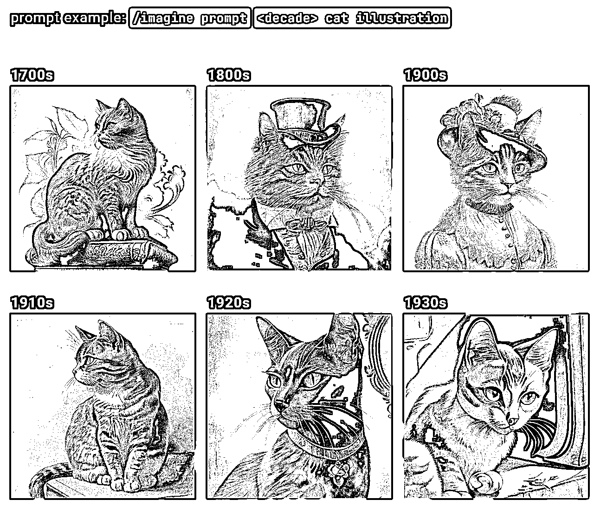 

 <ne-h4 id="6974d0da" data-lake-id="6974d0da">2.1.8.4 表情</ne-h4> 

使用情感词汇赋予角色个性 

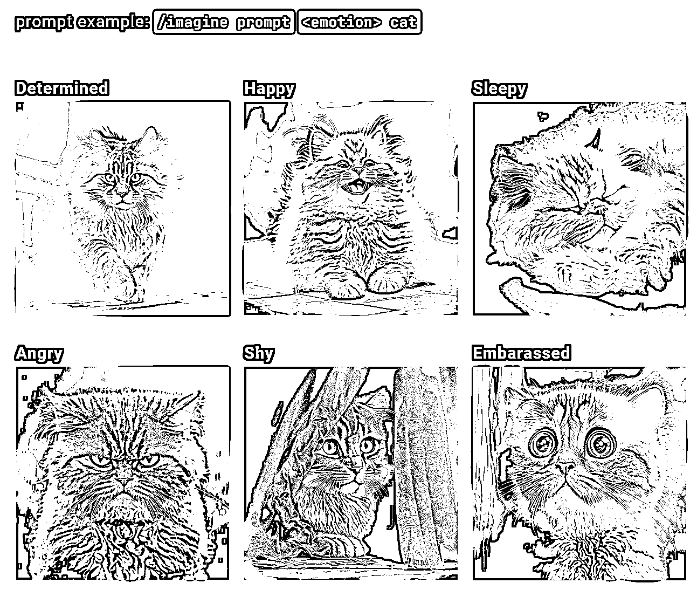  <ne-h4 id="ca3d4d40" data-lake-id="ca3d4d40">2.1.8.5 颜色化</ne-h4> 

使用不同的颜色赋予风格 

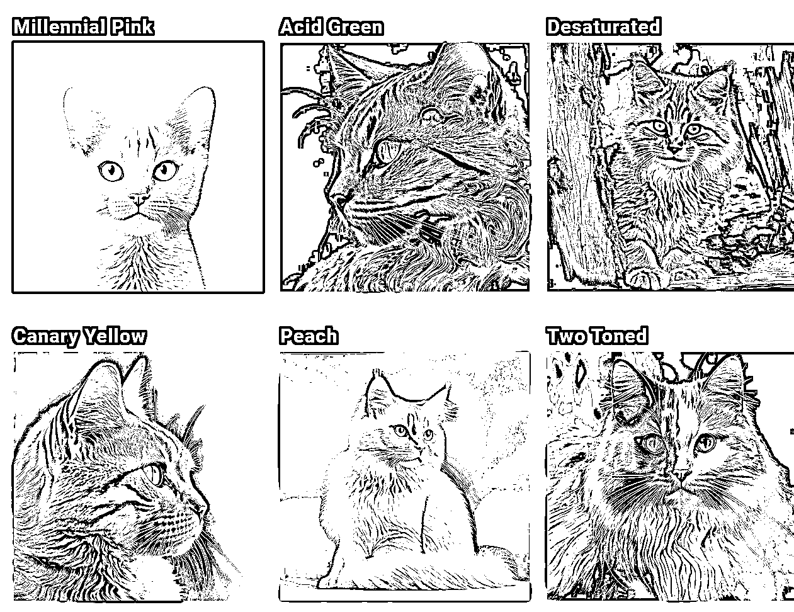 

 <ne-h4 id="e27c01a2" data-lake-id="e27c01a2">2.1.8.6 环境变化</ne-h4> 

不同的环境会出现不同的模式 

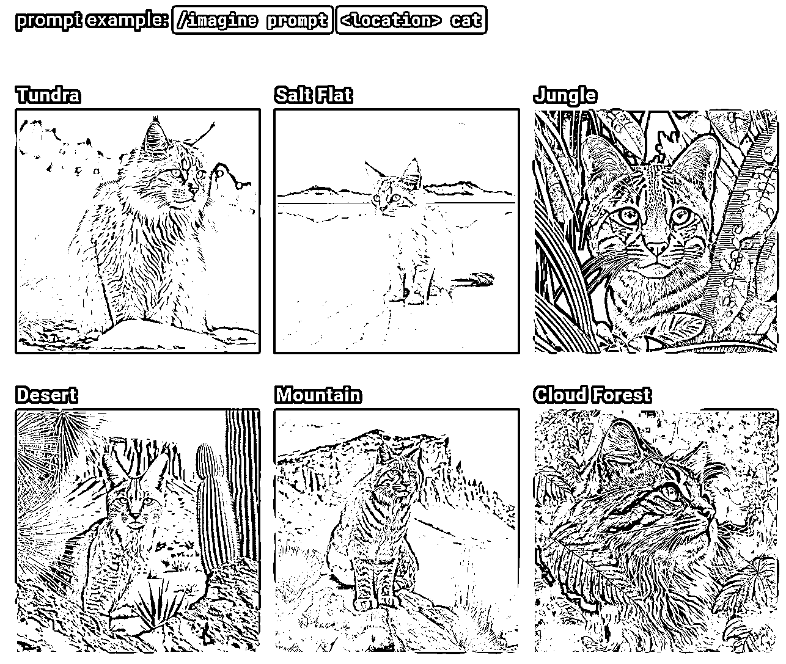 

以上是一些介绍，帮助大家理解，还有更多修饰词 <ne-h3 id="53d153dd" data-lake-id="53d153dd">2.2 Blend</ne-h3> 

2.2.1 介绍 

Blend 功能，是无需描述词，直接将 2 ~ 5 张图融合在一起产生新图像的方式。 

它融合图片效果很好，但是不能在图的基础上加入文字描述词 

如果想加描述词，或者融合超过 5 张图，参考 2.1.1 章节的垫图部分 

为了效果好，融合的两张图，比例最好保持一致 

2.2.2 使用方式 

输入“/blend”，再从跳出的框中选择 blend，随后，按提示上传图片进行融合，最后按发送，开始生成图像 

 

2.2.3 图像比例 

可以点“more”来找到“dimensons”, 改变图像纵横比 

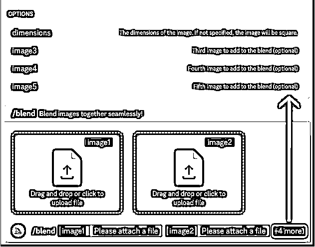 

## 三、模型与分辨率扩大 <ne-h3 id="93d39605" data-lake-id="93d39605">3.1 模型</ne-h3> 

目前，有 1，2，3，4，5（数字越高，越是是升级版），Niji（动漫），Test，Testp 几个模型 

使用方式： 

在对应的描述词后，加上对应的后缀 

--v 1 

--v 2 

--v 3 

--v 4 

--v 5 

--niji 

--test 

--testp 

效果展示： 

3.1.1 v5 模型 

--v 5 模型，该模型具有非常高的一致性，擅长解释自然语言提示，具有更高的分辨率 

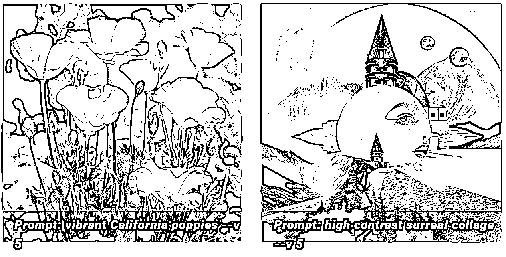 

3.1.2 v4 模型 

--v 4 模型：Midjourney 当前的默认模型，也就是不加后缀的前提下，会默认使用。有更多的生物、地点、物体等知识。它在处理小细节方面做得更好，可以处理包含多个字符或对象的复杂提示。 

 

它分为三个版本，4a，4b，4c，有一些细微的差别 

使用方式：描述词后缀加 

--style 4a 

--style 4b 

--style 4c（这个其实就是--v 4） 

差别演示： 

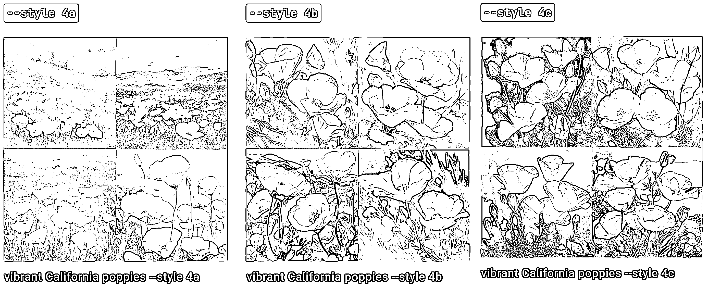 

 

3.1.3 旧模型 v1，v2，v3，hd 

 

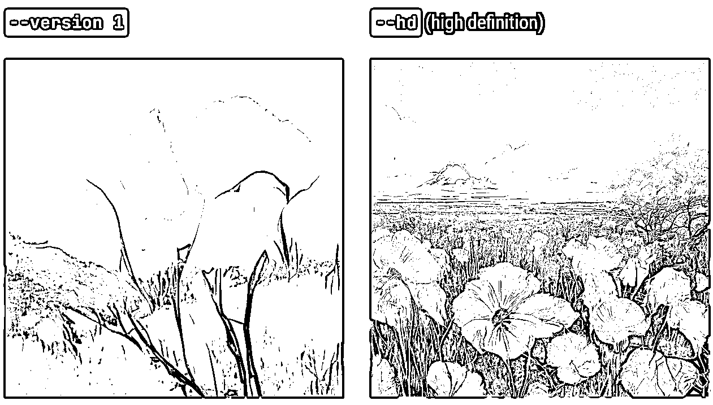 

3.1.4 动漫模型 niji 

niji 模型是 Midjourney 和 Spellbrush 之间的合作，用于制作动画和插图风格。它对动漫、动漫风格和动漫美学有更多的了解，在动态和动作镜头以及以人物为中心的构图方面表现出色。 

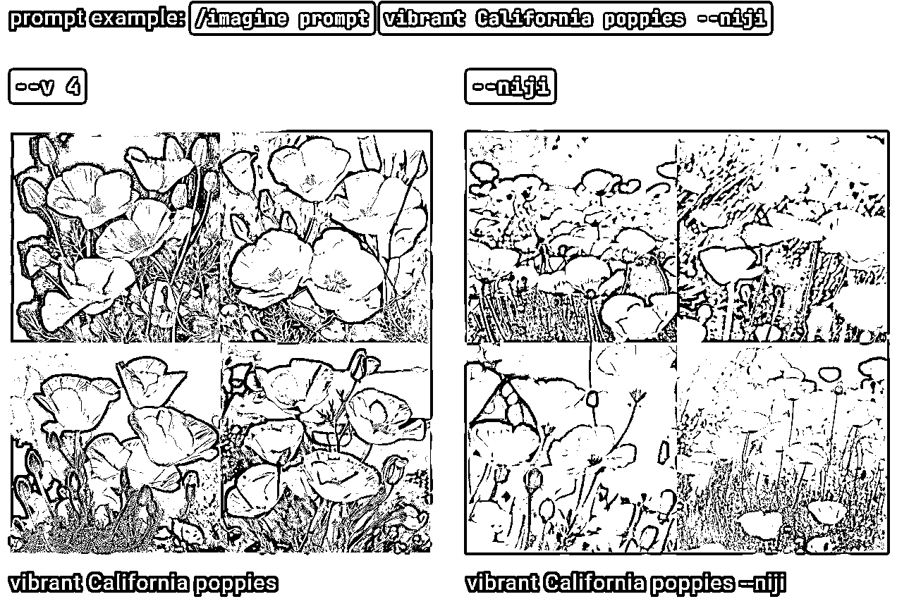 

 

3.1.5 测试模型 Test 

偶尔会临时发布新模型以进行社区测试和反馈。 

旧的有两个可用的测试模型:test 和 testp，它们可以与 --creative 参数结合使用，以获得更多样化的组合。 

更风格化的 test 

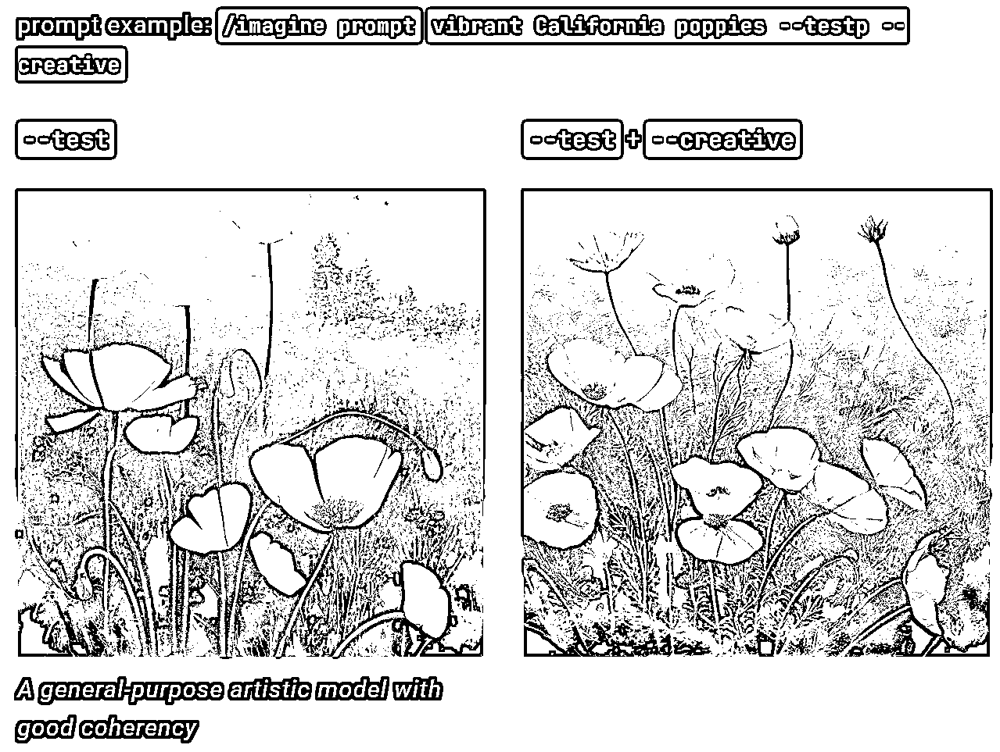 

更写实的 Testp 

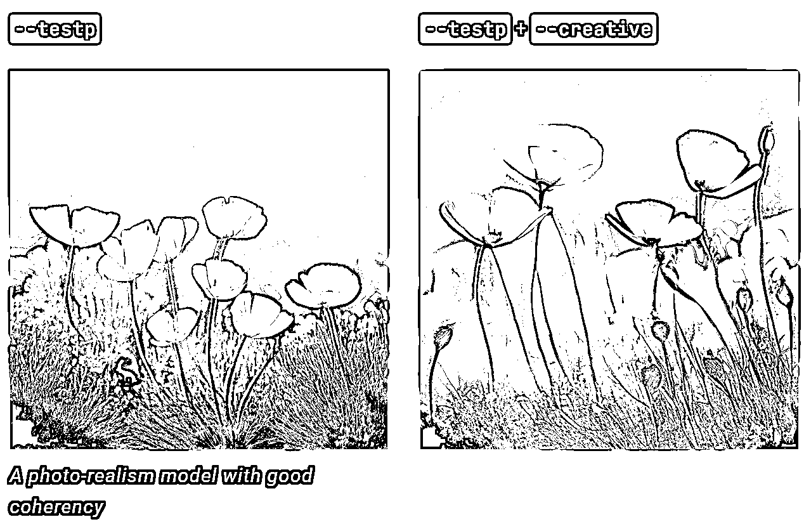 

3.1.6 怎么转换模型？ 

只要在描述词后，追加对应的后缀即可 

 

也可以使用/settings 命令（具体见后文的命令章节） 

1️⃣ MJ Version 1 2️⃣ MJ Version 2 3️⃣ MJ Version 3 4️⃣ MJ Version 4 🌈 Niji Mode 🤖MJ Test 📷 MJ Test Photo <ne-h3 id="f417ba12" data-lake-id="f417ba12">3.2 分辨率扩大</ne-h3> 

Midjourney 首先为每个任务生成一个低分辨率图像选项网格。可以之后通过按钮，添加额外的细节。不同的按钮，增加分辨率，添加细节的方式不同。 

（U1，U2，U3，U4，代表放大对应位置图片的分辨率） 

（V1，V2，V3，V4，代表以对应图片为基础，再分别生成 4 张图） 

 

点过 U 之后的图像，出现新的放大按钮如下： 

 

各放大分辨率一览表（在图像默认比为 1:1 的前提下）： 

从左到右，代表放大前后 

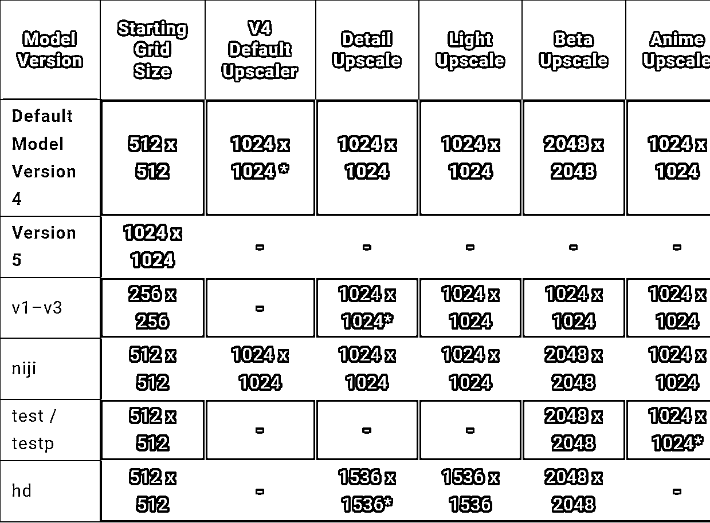 

3.2.1 默认的 U 增加分辨率（U1,U2,U3,U4） 

平滑地增加细节，增加图像大小。一些小的元素可能会在初始网格图像和完成的升级之间发生变化。 

使用方式：按钮 U1，U2，U3，U4 

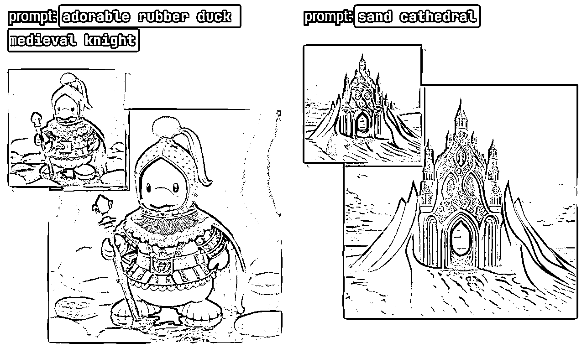 

3.2.2 Light Upscale 

少量细节与纹理的放大（也可用于减少细节的使用） 

使用方式：按钮 Light Upscale Redo，或者描述词后缀添加 --uplight 

 

3.2.3 Beta Upscale 

没有太多额外的细节，比较适合面部和光滑表面的放大。 

使用方式：按钮 Beta Upscale Redo，或者描述词后缀添加 --upbeta 

 

3.2.4 Upscale to Max 

v1，v2，v3，hd 模型时期的按钮，会将图片放大增加更多的细节，其他模型不适用 

 

3.2.5 Niji 模型默认的 U 增加分辨率（U1,U2,U3,U4） 

同 3.2.1，区别是，它是动漫模型 --niji 生成的四张图的放大，经过优化，可以很好地使用插图和动漫风格 

使用方式：按钮 U1，U2，U3，U4 或者参数 --upanime 

3.2.6 Remaster（理解为旧版本图片的新模型重塑即可） 

是先前使用 v1、v2 或 v3 模型版本，制作的放大图像的附加按钮。Remaster 将使用 --test 和 --creative 参数将原始图像的组成和更新的 --test 模型的一致性混合，再次升级图像 

 

（右为重塑后的图像） 

## 四、出图命令 <ne-h3 id="949659f7" data-lake-id="949659f7">4.1 最全命令列表</ne-h3> 

命令，是指在聊天框中输入“/+英文字符”， 

在出来的菜单栏选中后，点击发送调出相应功能的方式 

最熟悉的，是绘图命令“/imagine” 

  

其实，还有更多的命令，有不同的功能，标蓝色的是常用命令，按照首字母排序 

4.1.1 <ne-h3 id="28ce6881" data-lake-id="28ce6881">/ask</ne-h3> 

可以用来查询问题 

4.1.2 <ne-h3 id="03281dce" data-lake-id="03281dce">/blend</ne-h3> 

融合图片 

4.1.3 <ne-h3 id="684d3464" data-lake-id="684d3464">/daily_theme</ne-h3> 

查看每日主题通知 

4.1.4 <ne-h3 id="05b6be12" data-lake-id="05b6be12">/docs</ne-h3> 

查找官方使用手册内容（此命令需要频道内有Charon the FAQ Bot机器人） 

如果不知道怎么添加，就去 Midjourney 官方频道发送指令就好了 

4.1.5 <ne-h3 id="43702d86" data-lake-id="43702d86">/faq</ne-h3> 

快捷获得问答 

4.1.6 <ne-h3 id="f7feea63" data-lake-id="f7feea63">/fast</ne-h3> 

转换为，fast 出图模式（之后会说明这是啥） 

4.1.7 <ne-h3 id="6158ac26" data-lake-id="6158ac26">/help</ne-h3> 

获取一些帮助信息 

4.1.8 <ne-h3 id="3689d308" data-lake-id="3689d308">/imagine</ne-h3> 

生成图像的核心 

4.1.9 <ne-h3 id="bcbf2c95" data-lake-id="bcbf2c95">/info</ne-h3> 

获取账户信息，比如，还有多久的出图时长等 

4.1.10 <ne-h3 id="263359a6" data-lake-id="263359a6">/stealth</ne-h3> 

转换为，私密出图模式，你出的图片，不会被别人搜索到描述词 

4.1.11 <ne-h3 id="e04a733b" data-lake-id="e04a733b">/public</ne-h3> 

转换为，公开出图模式，你出的图片，会被别人在画廊搜索到描述词 

4.1.12 <ne-h3 id="2ff357ff" data-lake-id="2ff357ff">/subscribe</ne-h3> 

获得付费订阅的链接 

4.1.13 <ne-h3 id="6b8c0337" data-lake-id="6b8c0337">/settings</ne-h3> 

查看默认设置 

4.1.14 <ne-h3 id="450f6b21" data-lake-id="450f6b21">/prefer option</ne-h3> 

创建一些自己想要的喜好描述词组合参数 

4.1.15 <ne-h3 id="f03ba01c" data-lake-id="f03ba01c">/prefer option list</ne-h3> 

查看自己的描述词组合清单 

4.1.16 <ne-h3 id="78696017" data-lake-id="78696017">/prefer suffix</ne-h3> 

每个描述词后加个默认后缀 

4.1.17 <ne-h3 id="0e750f15" data-lake-id="0e750f15">/show</ne-h3> 

用 Job ID 来复现图像 

4.1.18 <ne-h3 id="192d6d8c" data-lake-id="192d6d8c">/relax</ne-h3> 

转换为，relax 出图模式 

4.1.19 <ne-h3 id="f29fda1c" data-lake-id="f29fda1c">/remix</ne-h3> 

开启修饰模式 <ne-h3 id="ed5180ca" data-lake-id="ed5180ca">4.2 用户信息查询命令</ne-h3> <ne-h4 id="4800c37a" data-lake-id="4800c37a">4.2.1 基础信息查询（/info）</ne-h4> 

查看有关当前排队和正在运行的作业、订阅类型、更新日期等的信息。 

动图演示： 

 

静态展示： 

 

会显示现在的使用时长等信息，比如这张图，还有 14.98h 的 fast 模式使用时长 

4.2.2 付费订阅及查询（/subscribe） 

查看目前付费订阅情况，以及用来订阅 <ne-h4 id="363c6077" data-lake-id="363c6077">4.2.3 出图工作模式（/fast 和 /relax）</ne-h4> 

/fast 模式，是 Midjourney 出图的基础剩余时长，也会优先调用其后端资源。 

通俗理解，就是更快地生成图片，但是每个月有时长限制，使用结束后，就无法再生成 

/relax 模式，使用 Midjourney 闲置服务器资源来生成图片，不限制时长，所以可以无限出图片。 

平时速度差别不大，使用人数过多时，卡顿比较明显。（只有付费的标准版和企业版可用） <ne-h4 id="1f28152e" data-lake-id="1f28152e">4.2.4 是否公开可见（/public 和 /stealth）</ne-h4> 

每个人的图片，都可以在画廊被人搜索到使用的描述词 

如果不想被被人搜索到，想要保密描述词资源，就要转换为/stealth 模式 <ne-h3 id="bdf006fb" data-lake-id="bdf006fb">4.3 设置与预设</ne-h3> <ne-h4 id="725ff81d" data-lake-id="725ff81d">4.3.1 默认选项更改（/settings）</ne-h4> 

很多时候，每次都手动进行更改，太慢了，这个指令可以快捷更改默认选项 

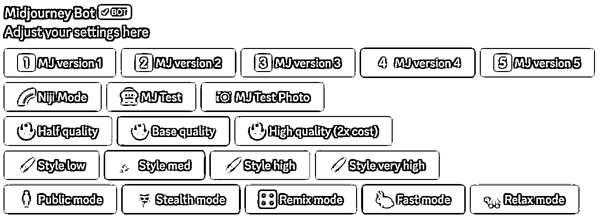 

按钮变成绿色，就表示，接下来，无需每次进行命令或者参数调整，都默认选中按钮所示的功能 

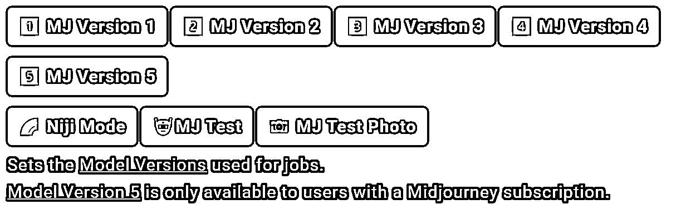 

1，2，3，4，5，niji，MJ Test，MJ Test Photo， 

就代表着之前所述的模型，选中之后，无需使用--v 4 等参数，默认你使用该参数 

其他按钮同理，其对应参数关系如下： 

 

 

 

 

 

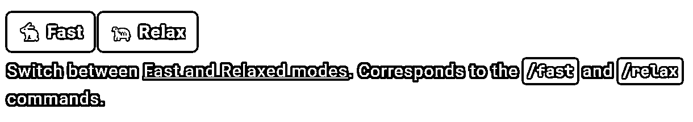 

4.3.2 自定义参数集（/prefer 系列） 

使用 prefer 命令创建自定义选项，自动将常用参数添加到提示符的末尾。 

/prefer auto_dm      已完成的作业将自动发送到“直接消息” 

/prefer option 创建或管理自定义选项 

/prefer option list 查看当前自定义选项。 

/prefer suffix 指定要添加到每个提示符末尾的后缀。 

4.3.2.1 Prefer Option 

/prefer option set <name> <value> 

创建一个自定义参数，可以使用它在快速提示的末尾添加多个参数。 

 

比如，按照如上设置，点击发送后， 

就相当于用/prefer option setmine--hd --ar 7:4创建了一个“--mine”参数， 

“--mine”的效果，等于“--hd --ar 7:4” 

（当然，只是一个示例，现在--hd 已经是过时的参数，7 比 4 的图像也不适应现在的新模型，但原理是相通的） 

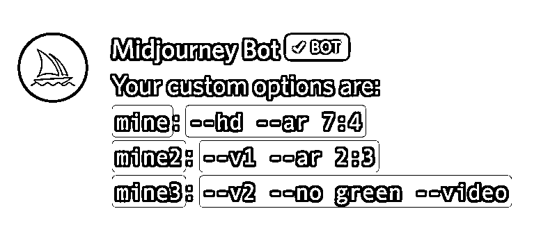 

注：如果想要删除自定义参数，那就输入同样的设置，把 value 后面的内容都删去，点击发送即可 

/prefer option list 点击发送，展示目前自定义的参数代表的含义列表 

 <ne-h4 id="940a58aa" data-lake-id="940a58aa">4.3.2.2 Prefer Suffix</ne-h4> 

/prefer suffix 自动在所有描述词后添加指定后缀 

比如：  /prefer suffix --uplight --video 

注意：只有参数可以这样设置，其他文字不行， 

也就是 --uplight 等可以，a dog，a cat 等词汇不行 <ne-h3 id="675b4038" data-lake-id="675b4038">4.4 复现自己的历史图片（Show）</ne-h3> 

这个功能，可以让你找到你的历史生成图片，然后继续进行后续处理 

（为什么要找它，因为后期图片多了，很难找到自己当时处理的界面，这样就可以再处理了） 

关键在于找到你的历史图片的 Job_ID 一长串的字符（只有自己生成的图才可以用这个命令，别人的不行） 

使用示例： 

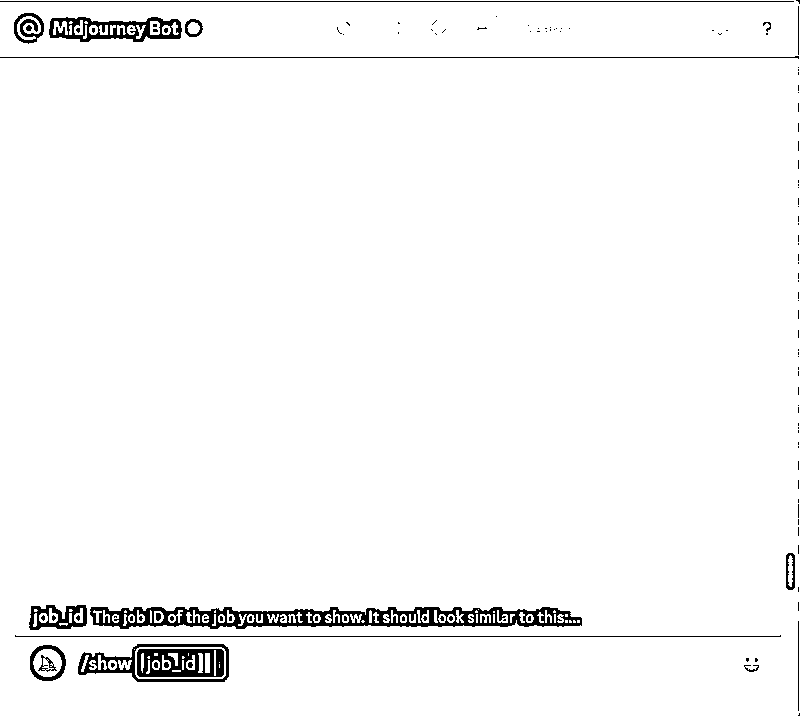 

4.4.1 从个人主页寻找 

[https://www.midjourney.com/app/](https://www.midjourney.com/app/)（你的用户主页） 

 

 

4.4.2 从图片链接寻找 

比如，自己的图片网址 URL 是 

[https://www.midjourney.com/app/users/381590592095911946/?jobId=](https://www.midjourney.com/app/users/381590592095911946?jobId=)9333dcd0-681e-4840-a29c-801e502ae424. 

那么绿色的部分，就是 Job_ID

 

4.4.3 从文件名寻找 

如果你下载的图片，有相应的信息，可以复制 

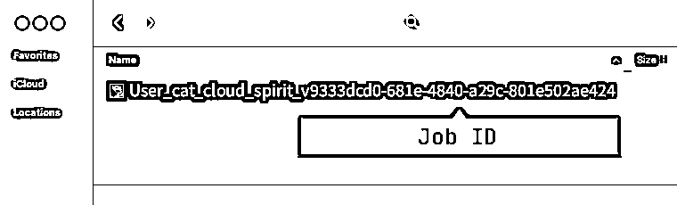 

4.4.4 用 Discord 的 emoji 表情找 

发送一个📧反应贴在图片下方，则机器人会发给你对应的图片信息 

如何发送📧，参照以下图片👇 

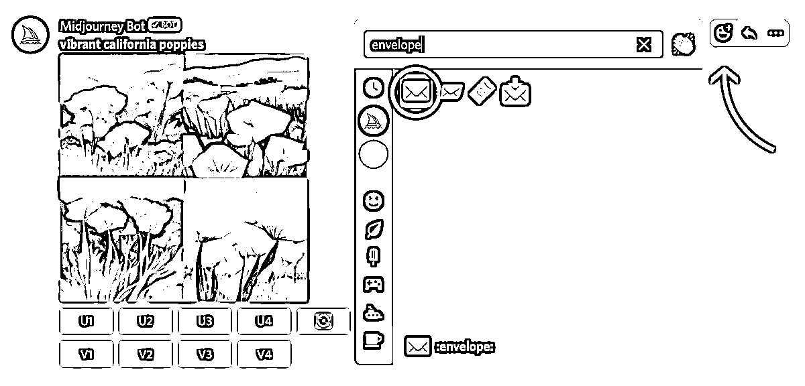 

Job_ID在这里👇 

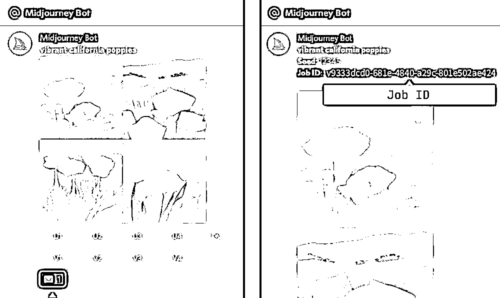 

如果你找不到上图右边的信息，那么，它在这里 

 

## 五、出图参数 <ne-h3 id="9c669b17" data-lake-id="9c669b17">5.1 最全参数列表</ne-h3> 

现在，来说说，很重要的，影响图片生成的，参数部分（橘黄色区域） 

  

现行参数： 

--ar, --chaos, --no, --q, --seed, --stop, --style, --stylize, --uplight, --upbeta, --niji, --hd, --test, --testp, --v, --creative, --iw, --sameseed, --video 

弃用，过时参数： 

--width and --w (被 --ar 替代)，--height and --h (被 --ar 替代)，--fast (被 --quality 替代)，--vibe，--hq，--newclip，--nostretch，--old，--beta <ne-h4 id="5396db07" data-lake-id="5396db07">5.1.1 基础参数</ne-h4> <ne-h3 id="9039450f-1" data-lake-id="9039450f-1"> </ne-h3> <ne-h4 id="f701ba5c" data-lake-id="f701ba5c">5.1.1.1 Aspect Ratios</ne-h4> 

--aspect or --ar 

改变图像的纵横比 

比如， 

适合小红书的用 --ar 3:4 

适合在抖音的用 --ar 9:16 <ne-h4 id="f8a786a2" data-lake-id="f8a786a2">5.1.1.2 Chaos</ne-h4> 

--chaos <数字 0–100>  

改变结果的多样性。更高的数值会产生更不同寻常和意想不到的图片。 

比如： 

--chaos 4 

--chaos 99 <ne-h4 id="d56ae557" data-lake-id="d56ae557">5.1.1.3 No</ne-h4> 

--no 后面接不想图片产生的元素描述，会进行去除 

--no yellow（不要黄色这个色彩） <ne-h4 id="8aaa25ff" data-lake-id="8aaa25ff">5.1.1.4 Quality</ne-h4> 

--quality <.25, .5, 1, or 2>, or --q <.25, .5, 1, or 2> 

图片质量等级， 

比如， 

--q 0.25 （四分之一质量） 

--q 2（两倍质量） <ne-h4 id="78ceb1e1" data-lake-id="78ceb1e1">5.1.1.5 Seed</ne-h4> 

--seed <integer between 0–4294967295> 

Midjourney 机器人使用一个种子号来创建一个视觉噪声场，就像电视静态一样，作为生成初始图像网格的起点。种子号是为每个图像随机生成的，但可以使用 --seed 或 --sameseed 参数指定。使用相同的种子号和提示符将产生类似的结果图像。 

比如， 

--seed 25252322 <ne-h4 id="11d4f92d" data-lake-id="11d4f92d">5.1.1.6 Chaos</ne-h4> 

--stop <integer between 10–100>  

使迭代步数停留在早期，也就是你看到图像正在生成时，中途停止 

数字越靠前，图像生成停止越提前 

比如， 

--stop 40 <ne-h4 id="caefeccb" data-lake-id="caefeccb">5.1.1.7 Style</ne-h4> 

--style <4a, 4b or 4c> 

转换模型为 4a，4b 或 4c 

比如 

--style 4b <ne-h4 id="34af5b57" data-lake-id="34af5b57">5.1.1.8 Stylize</ne-h4> 

--stylize <number>, or --s <number>  

参数影响了 Midjourney 的默认美学风格在图像生成上的应用程度，数字越高，越风格化 

比如， 

--s 480 <ne-h4 id="f048350d" data-lake-id="f048350d">5.1.1.9 Uplight</ne-h4> 

--uplight 

放大后的图像细节更少，更平滑，参照本文3.2.2 <ne-h4 id="392f7673" data-lake-id="392f7673">5.1.1.10 Upbeta</ne-h4> 

--upbeta 

结果更接近原始网格图像，放大后的图像添加的细节明显更少，参照本文3.2.3 <ne-h4 id="4fefa63d" data-lake-id="4fefa63d">v4 模型默认参数，以及参数可变范围</ne-h4> 

 <ne-h4 id="5ae99d7e" data-lake-id="5ae99d7e">v5 模型默认参数，以及参数可变范围</ne-h4> 

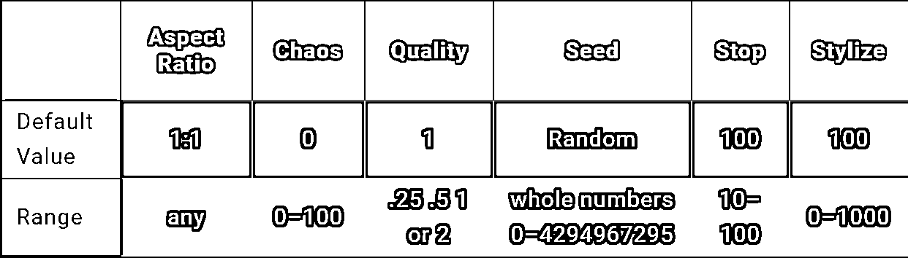 <ne-h4 id="1e515f68" data-lake-id="1e515f68">5.1.2 模型参数</ne-h4> 

Midjourney 定期发布新的模型版本以提高效率、一致性和质量。不同的模型擅长不同类型的图像。 <ne-h4 id="3dec5b64" data-lake-id="3dec5b64">5.1.2.1 Niji</ne-h4> 

--niji  

可选的漫画风格模型 <ne-h4 id="7d9bb4a8" data-lake-id="7d9bb4a8">5.1.2.2 High Definition</ne-h4> 

--hd 

早期的模型之一，可以生成更大、不太一致的图像。该算法适用于抽象图像和景观图像。 <ne-h4 id="cb98d472" data-lake-id="cb98d472">5.1.2.3 Test</ne-h4> 

--test 

使用 test 模型，介绍见本文3.1模型章节 <ne-h4 id="477c4cf8" data-lake-id="477c4cf8">5.1.2.4 Testp</ne-h4> 

--testp 

使用 test 模型，介绍见本文3.1模型章节 <ne-h4 id="415d91bd" data-lake-id="415d91bd">5.1.2.5 Version</ne-h4> 

--version <1, 2, 3, 4, or 5> or --v <1, 2, 3, 4, or 5> 

使用 1 或 2 或 3 或 4 或 5 模型，介绍见本文3.1模型章节 

目前默认是 4 模型 <ne-h4 id="dacdd967" data-lake-id="dacdd967">5.1.3 其他参数</ne-h4> 

这些参数只在早期的一些模型中生效 <ne-h4 id="1ab7764c" data-lake-id="1ab7764c">5.1.3.1 Creative</ne-h4> 

--creative 

修改 test 和 testp 模型，使其更具多样性和创造性。 <ne-h4 id="2c699453" data-lake-id="2c699453">5.1.3.2 Image Weight</ne-h4> 

--iw 

设置图像提示权重相对于文本权重，默认值是 --iw 0.25. 

详情见本文6.1.3 <ne-h4 id="93d5062d" data-lake-id="93d5062d">5.1.3.3 Sameseed</ne-h4> 

--sameseed  

种子值创建一个大的随机噪声场，应用于初始网格中的所有图像。当指定 --sameseed 值时，初始网格中的所有图像都使用相同的起始噪声，并将生成非常相似的生成图像。 <ne-h4 id="f9cff8cb" data-lake-id="f9cff8cb">5.1.3.4 Video</ne-h4> 

--video 

保存正在生成的 4 张图像的进度视频。发送✉️时，会同步生成一个视频并发送。 <ne-h4 id="b9abad1d" data-lake-id="b9abad1d">不同模型，与可使用的参数，以及参数可变范围一览表</ne-h4> 

 <ne-h3 id="369adec4" data-lake-id="369adec4">5.2 比例参数（--ar）</ne-h3> 

--aspect 或 --ar 参数改变生成图像的纵横比。 

长宽比是图像的宽高比，它通常表示为用冒号分隔的两个数字，例如 7:4 或 4:3 一类。 

正方形图像具有相等的宽度和高度，称为 1:1 的长宽比。图像可以是 1000px × 1000px，或者 1500px × 1500px，纵横比仍然是 1:1 

默认长宽比为 1:1。 

必须使用整数，比如，用 --ar 139:100 而不是 --ar 1.39:1 

纵横比影响生成图像的形状和组成。 

当分辨率扩大时，一些纵横比可能会略有改变 

5.2.1 不同模型纵横比范围表格 

 

5.2.2 一图直观了解纵横比 

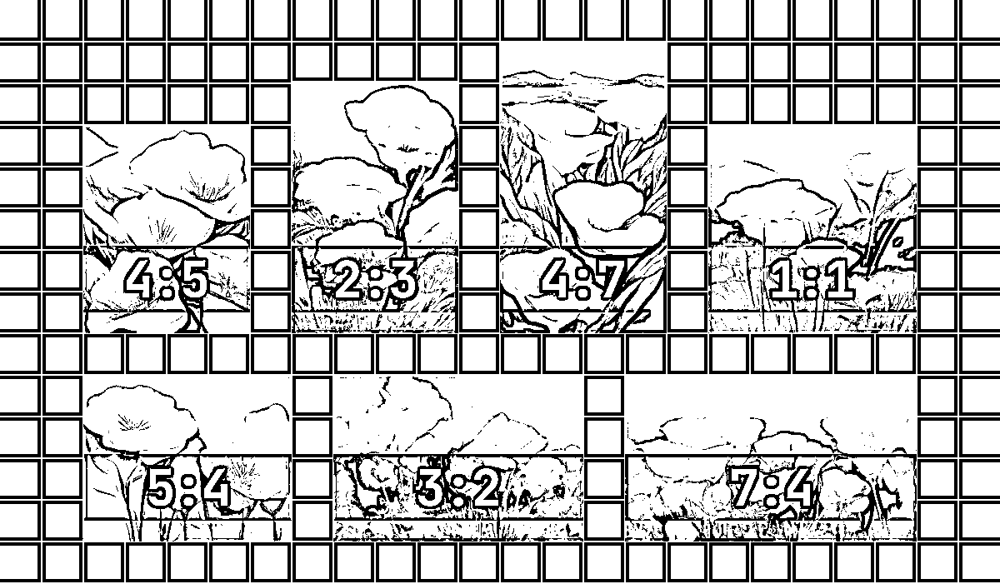 

5.2.3 如何使用 

在描述词后，加上相应的后缀即可，比如 --ar 2:3 

 <ne-h3 id="a537aaf8" data-lake-id="a537aaf8">5.3 稳定参数（--chaos）</ne-h3> 

--chaos 或 --c 参数影响初始图像网格的变化程度。 

高 chaos 值将产生更多不寻常和意想不到的结果和组成。 

低 chaos 值具有更可靠、可重复的结果。 

默认值为 0，可变范围为 0 ~ 100 

--chao 24 

示例：watermelon owl hybrid 

（西瓜猫头鹰杂合） 

5.3.1 低 chaos 数值演示 

 

 

5.3.2 高 chaos 数值演示 

 

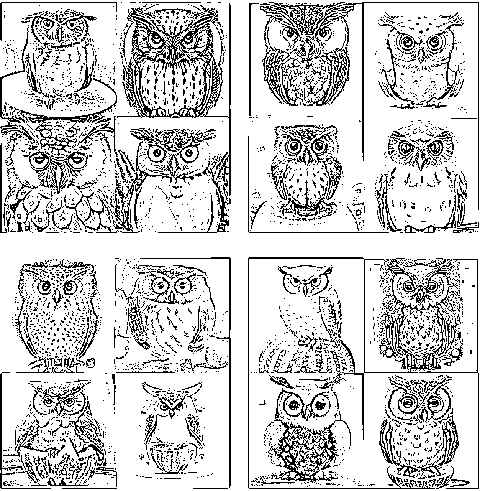 

5.3.3 超高 chaos 数值演示 

 

 

5.3.4 如何使用 chaos 值 

--chaos 或 --c 都可以 

 <ne-h3 id="c5d2ebc9" data-lake-id="c5d2ebc9">5.4 质量参数（--q）</ne-h3> 

--quality 或 --q 参数改变生成图像所花费的时间。高质量的设置需要更长的时间来处理和产生更多的细节。更高的值还意味着每个作业使用更多的 GPU 分钟，质量设置不影响分辨率。 

高质量的设置并不总是更好。有时候，低质量的设置可以产生更好的效果，这取决于你想要创建的图像。 

低质量的设置可能是最好的手势抽象表现。 

高质量的值可以改善建筑图像的表现，这与细节有关。 

试一试，并选择最匹配的设置。 

5.4.1 v4 版本的木森林测试 

 

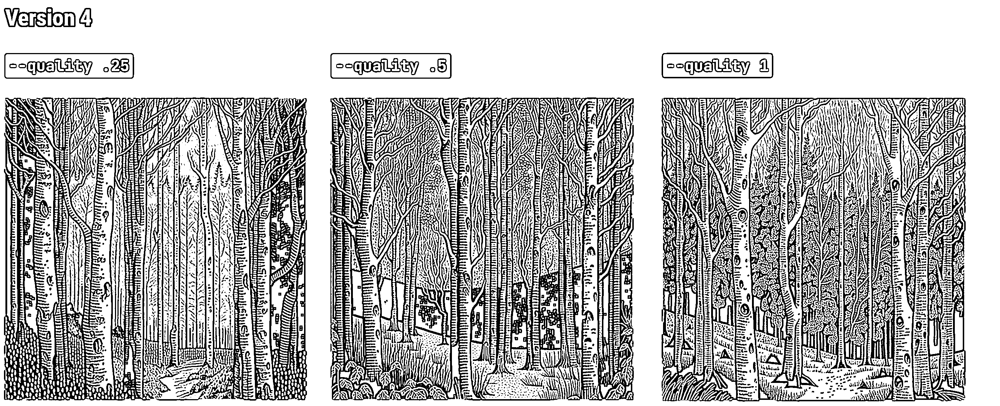 

5.4.2 v5 版本的牡丹花测试 

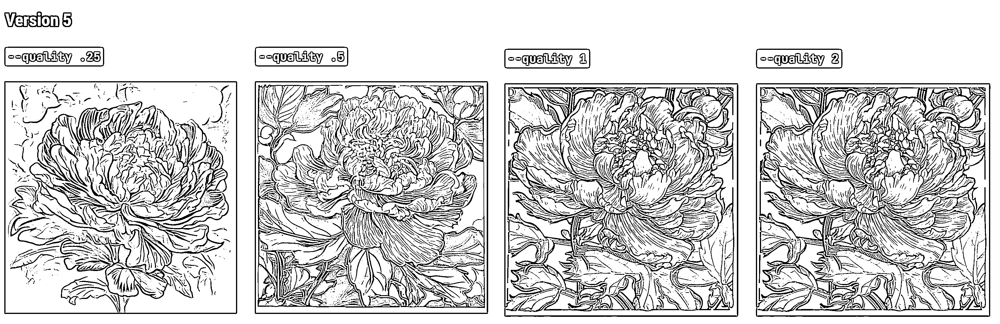 

5.4.3 模型与参数兼容性测试 

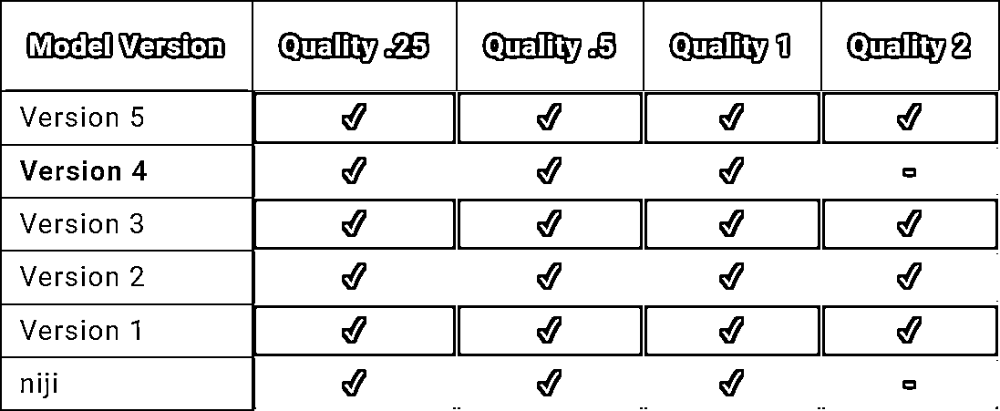 

5.4.4 如何使用 

使用方式一，聊天框后缀 

--q 0.25 

--q 0.5 

--q 1 

--q 2 

 

使用方式二 

/settings 命令，设置默认值 

Half，Base，High quality 

 

👇 

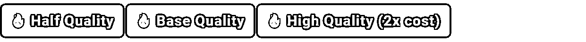 <ne-h3 id="7c7ff3de" data-lake-id="7c7ff3de">5.5 种子参数（--seed 和 --sameseed）</ne-h3> 

Midjourney 机器人使用一个种子号来创建一个视觉噪声场，就像电视静态一样，作为生成初始图像网格的起点。种子号是为每个图像随机生成的，但可以使用 --seed 或 --sameseed 参数指定。使用相同的种子号和提示符将产生类似的结果图像。 

--seed 接受整数 0 - 4294967295。 

种子值只影响初始图像网格。 

模型版本 1、2、3、test 和 testp是不确定的，将产生相似的，不相同的图像。 

模型版本 4、5 和 niji 中使用相同的“prompt + seed + 参数”将生成相同的图像。 

示例： 

celadon owl pitcher 

（青瓷猫头鹰水罐） 

5.5.1 随机种子值 

即使其他参数完全一致，生成的图像也不同 

 

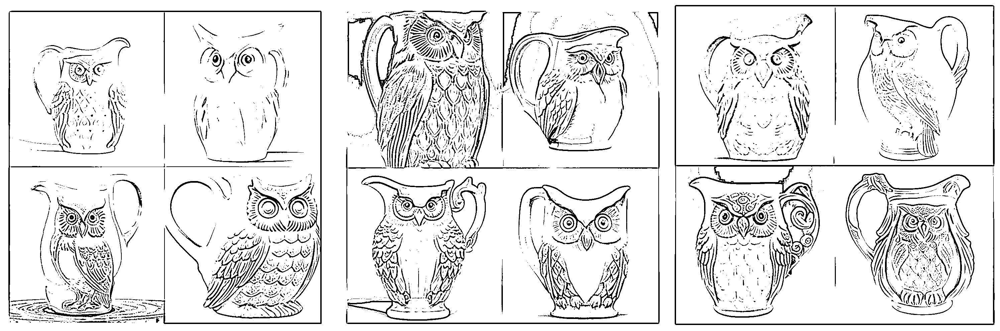 

可以看到，3 次生成结果相差很大 

5.5.2 固定种子值 

比如，固定为 --seed 123，所有参数不变的情况下， 

无论多少次，生成的图像都一模一样（一模一样这个特性，仅 v4,v5,niji 模型生效） 

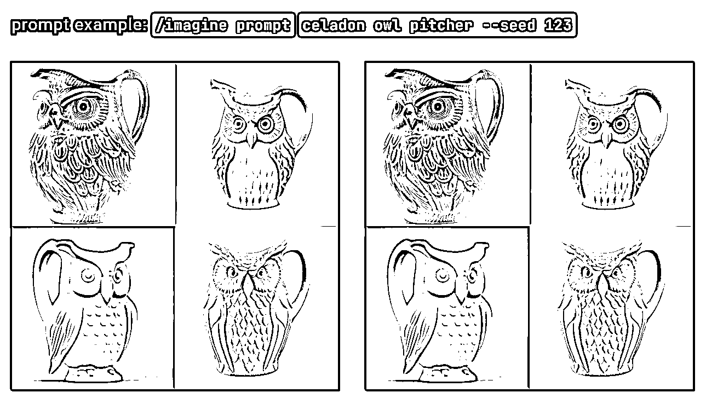 

5.5.3 sameseed 与 seed 的区别 

区别就是 

seed 只有第 1 张图遵循初始生成 

sameseed 是全部 4 张图遵循初始生成 

--sameseed 数值范围 0 - 4294967295 

--sameseed 只兼容模型版本 1，2，3，test 和 testp 

固定 sameseed 前后生成对比 

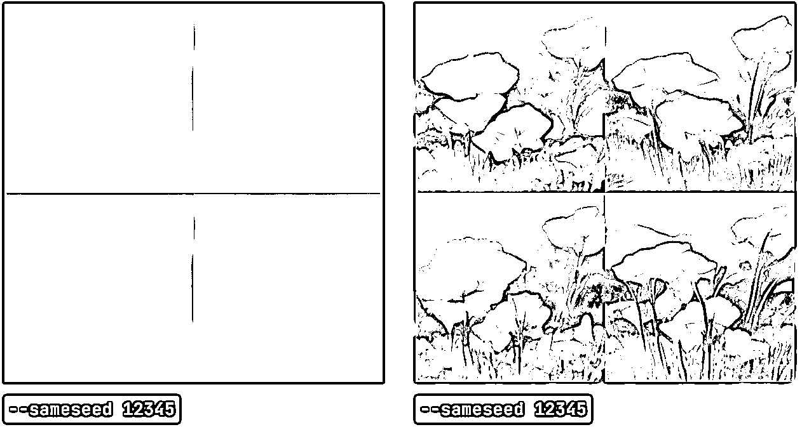 

固定 seed 前后生成对比 

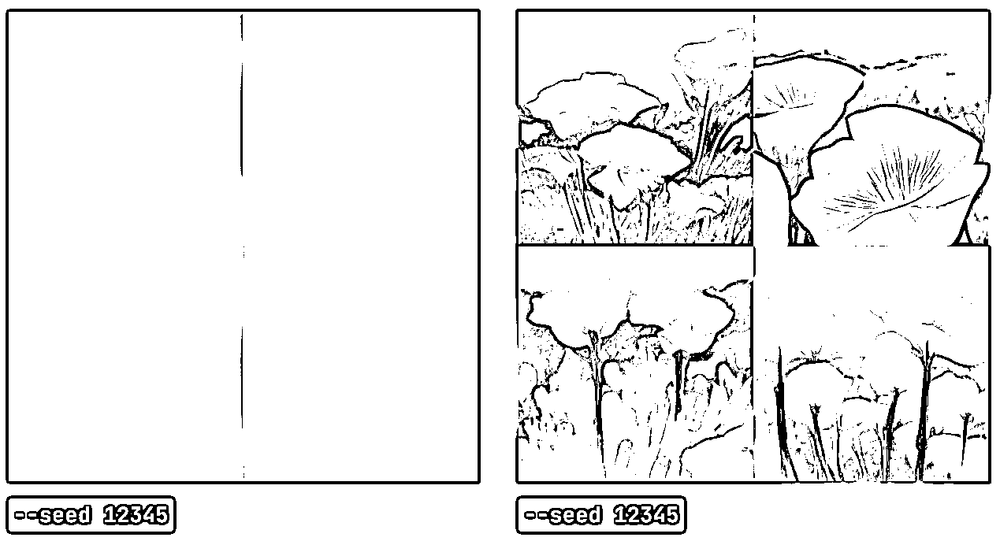 

5.5.4 如何寻找种子值 

在对应的图像上，添加✉反应，参照本文 4.4.4 章节 

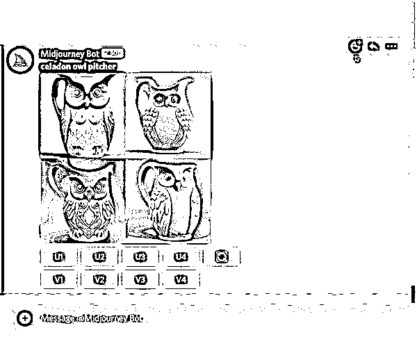 

5.5.5 使用种子值 

在聊天框加后缀 

比如： 

--seed 12345 

 <ne-h3 id="b50d4fbc" data-lake-id="b50d4fbc">5.6 停止参数（--seed 和 --sameseed）</ne-h3> 

使用 --stop 参数， 

提前中止图像生成工作， 

以较早的百分比停止，可能会产生更模糊、更不详细的结果。 

--stop 的默认值 100 

--stop 可变范围 10-100 

--stop 在图像放大时不起作用 

举例：splatter art painting of acorns 

（橡子飞溅艺术画） 

5.6.1 基础用法 

 

 

5.6.2 进阶用法 

--stop 参数虽然在图像放大时没有作用。 

但是，如果初始图像停在一个更柔和，更不详细的初始图像上，会将影响最终放大结果的细节级别。 

下面放大的图片使用的是 Beta Upscale 

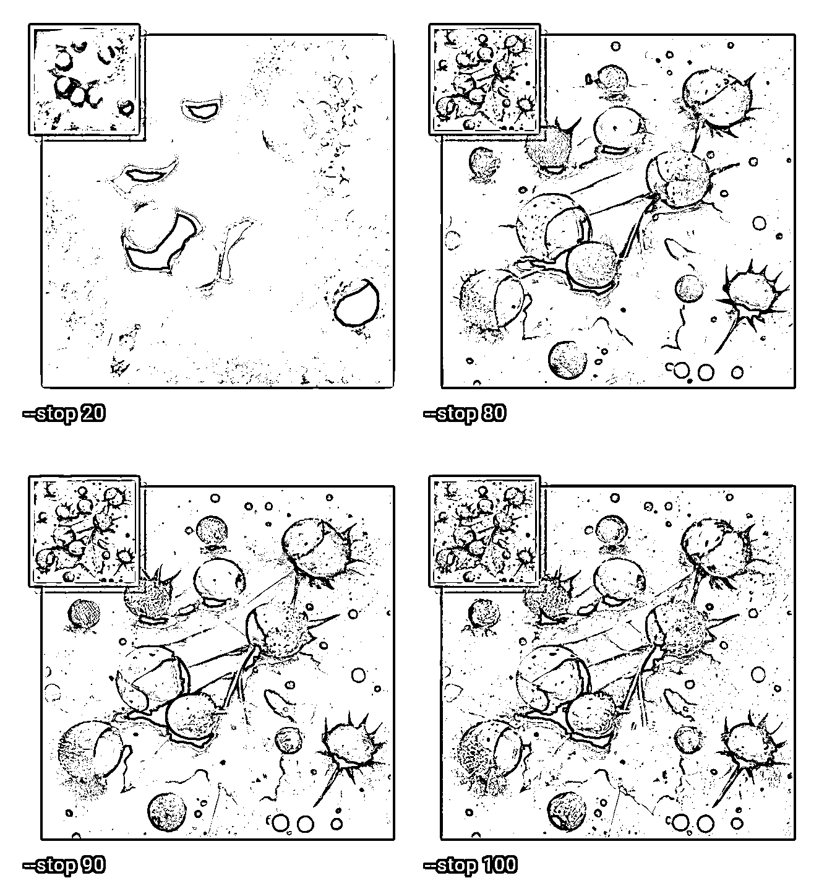 

5.6.3 如何使用 Stop 值 

在聊天框加后缀 

比如： 

--stop 90 

 <ne-h3 id="04b59bfc" data-lake-id="04b59bfc">5.7 风格参数（--stylize 或 --s）</ne-h3> 

Midjourney Bot 经过训练，可以生成具有艺术色彩、构图和形式的图像。 

--stylize 或 --s 参数影响该训练的应用强度。 

低风格化值生成的图像与提示符紧密匹配，但不太具有艺术性。 

高风格化值创建的图像非常艺术，但与提示符联系较少。 

5.7.1 风格参数在不同的模型中，默认值与可变范围 

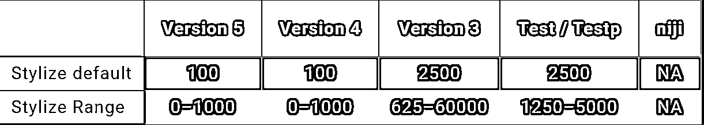 

5.7.2 风格参数在 v4 模型的效果演示 

illustrated figs 

（无花果插图） 

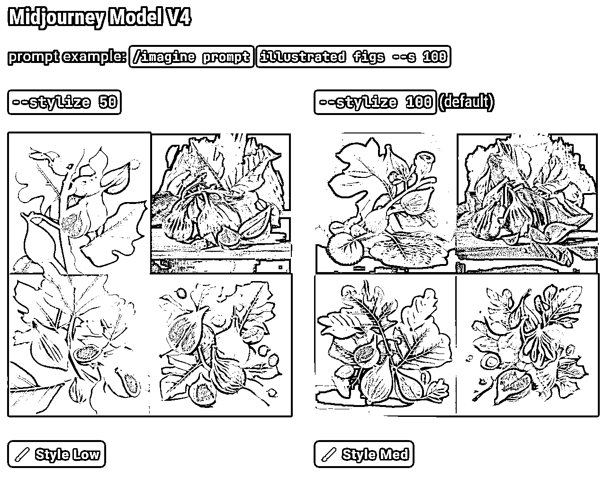 

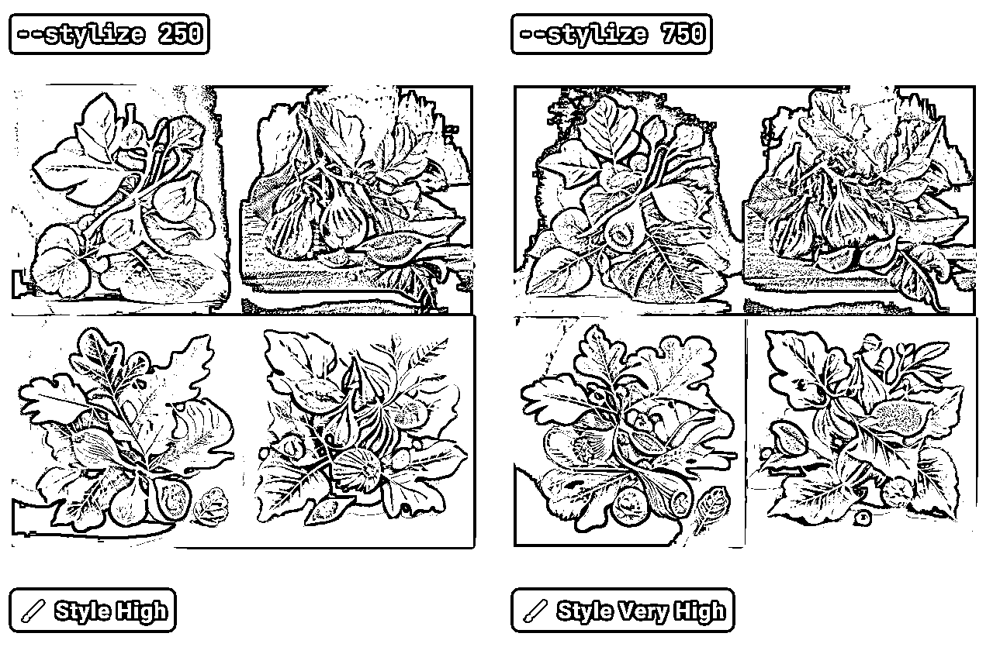 

5.7.3 风格参数在 v5 模型的效果演示 

colorful risograph of a fig 

（无花果的彩色等线图） 

 

5.7.4 如何使用风格参数 

使用方式一，聊天框后缀 

比如 

--s 1000 

 

使用方式二 

/settings 命令，设置默认值 

Style low，Style med，Style high，Style very high 

 

👇 

 <ne-h3 id="2c561984" data-lake-id="2c561984">5.8 平铺参数（--tile）</ne-h3> 

tile 参数生成的图像可用于重复瓷砖，为织物、壁纸和纹理创建无缝图案。 

--tile 适用于模型版本 1，2，3 和 5 

--tile 只生成一个贴图 

使用图案制作工具，如 [https://www.pycheung.com/checker/](https://www.pycheung.com/checker/)，可以产生多平铺图 

5.8.1 平铺参数在 test 和 testp 模型的效果演示 

colorful tiger stripes（彩色虎纹） 

torn cardboard roses（破碎的纸板玫瑰） 

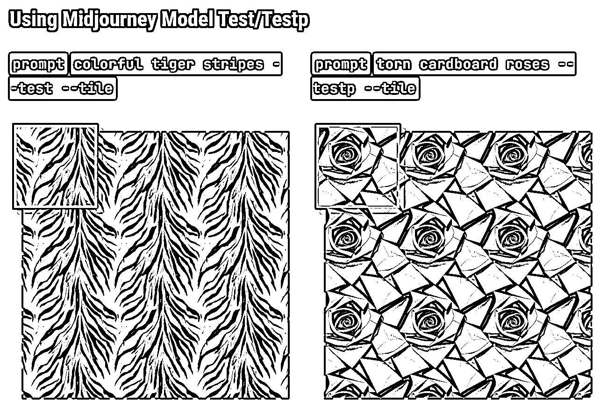 

5.8.2 平铺参数在 v5 模型的效果演示 

scribble of moss on rocks（在岩石上画苔藓） 

watercolor koi（水彩锦鲤） 

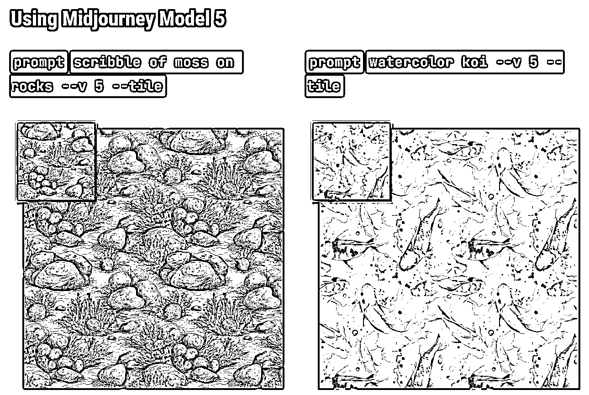 

5.8.3 如何使用平铺参数 

使用方式一，聊天框后缀，加入 --tile 

 <ne-h3 id="659adc0e" data-lake-id="659adc0e">5.9 版本参数（--v）</ne-h3> 

Midjourney 定期发布新的模型版本以提高效率、一致性和质量。 

一般默认为最新模型，但测试版的除外，比如虽然现在 v5 发布了，但它是测试版。 

所以目前默认还是 v4 

其他模型也可以使用， 

用 --version 或 --v 参数，或使用/settings 命令并选择一个模型版本。 

不同的模型擅长不同类型的图像。 

--version 的可选项：1、2、3、4 和 5。 

--version 也可以是 --v ，效果等同 

比如： 

--v 5 

模型对比，已经展示过，在本文的3.1章节，可以看不同模型的对比 

5.9.1 如何使用模型参数 

使用方式，聊天框后缀，加入 --v 参数+模型版本数字 

比如， --v 4 

 <ne-h3 id="80fdd2fa" data-lake-id="80fdd2fa">5.10 视频参数（--video）</ne-h3> 

保存正在生成的 4 张图像的进度视频。发送✉️时，会同步生成一个视频并发送。 

视频只能在 4 张初始图生成时的视频，不能放大。 

视频目前，只在模型版本 1，2，3，test，和 testp 中有用 

5.10.1 视频参数的效果演示 

Vibrant California Poppies 

（充满活力的加州花） 

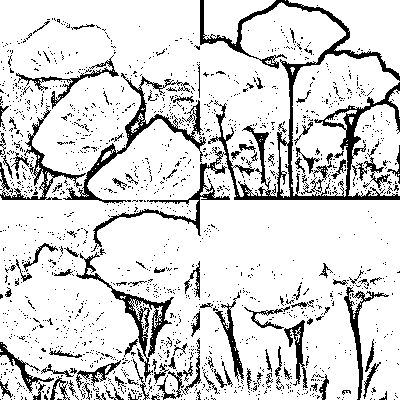 

Botanical Sketch of Fanciful Ferns 

（奇异蕨类植物素描） 

 

5.10.2 怎么样获得上述视频 

1\. 在描述词结尾添加 --video 作为后缀 

2\. 等待图像生成完毕 

3\. 在对应图片的记录添加信封反应，操作同本文 4.4.4 章节 

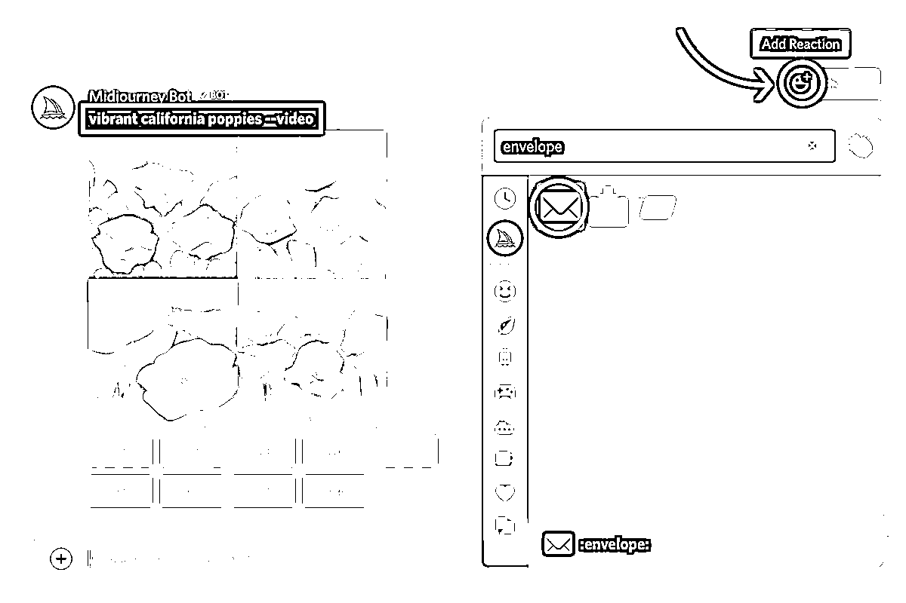 

4\. 得到下载链接 

 

## 六、进阶描述词 <ne-h3 id="cd74be4e" data-lake-id="cd74be4e">6.1 图生图进阶</ne-h3> 

可以将图像作为提示符的一部分来影响画面的结构、样式和颜色。 

图像提示可以单独使用，也可以与文本提示一起使用 

将不同风格的图像组合在一起，会获得神奇的效果 

更高级的提示词可以包括一个或多个图像 url、多个文本短语和一个或多个参数 

  

6.1.1 基础操作 

1\. 上传一张图 

2\. 在出图时，跳出 prompt 聊天框后，直接将上传好的图拖动入聊天框，这样，描述词就出现了上述绿色部分的链接。 

（可以不止上传一个参考图，可以上传多个） 

3\. 在链接后，写后续的描述词和参数即可 

4\. 写完，点击发送，开始生成图片 

  

6.1.2 v4 模型和 v5 模型示例 

仅作展示用，个人觉得下面这些案例并不是很好看，但也看过很好看的，这个功能还是很强的。 

这两个新模型的图生图，图像是作为生图的起点，所以在结构、配色、构成上，都会更接近图片。同样，有时候会看上去很牵强，各有利弊。 <ne-h4 id="be1e89e2" data-lake-id="be1e89e2">6.1.2.1 基础图片素材</ne-h4> 

① 阿波罗雕像 

② 复古花卉插图 

③ 恩斯特·海克尔的水母 

④ 恩斯特·海克尔的地衣 

⑤ 北斋的《巨浪》 

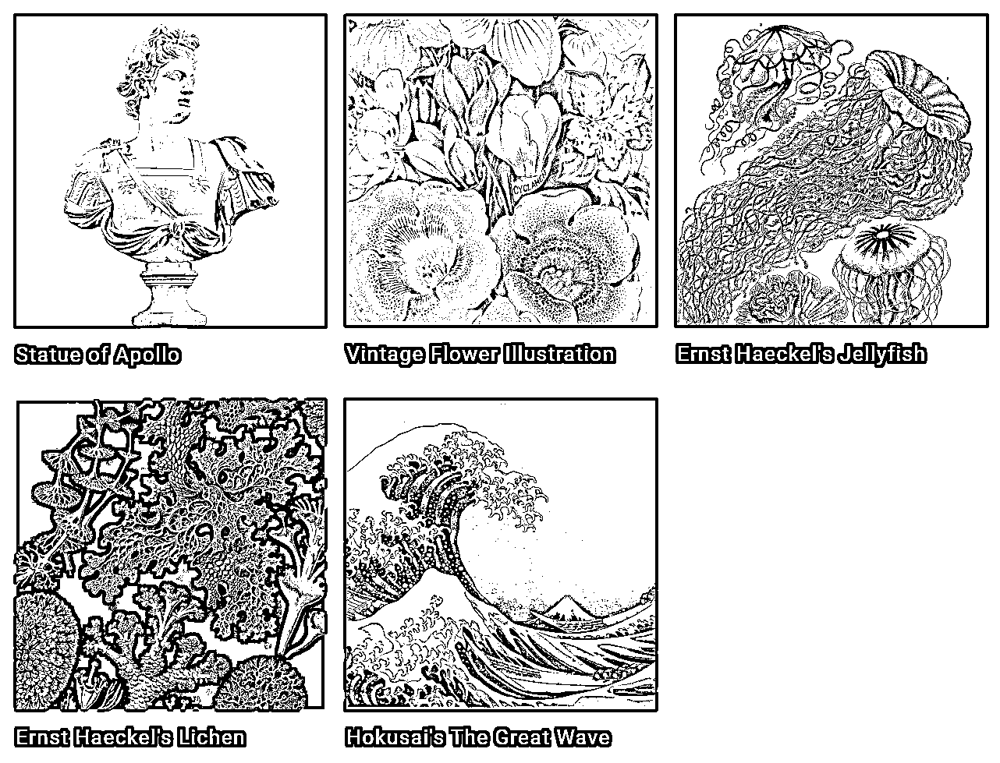 <ne-h4 id="a5d28658" data-lake-id="a5d28658">6.1.2.2 v4 模型的素材融合</ne-h4> 

① 雕像 + 花 

② 雕像 + 水母 

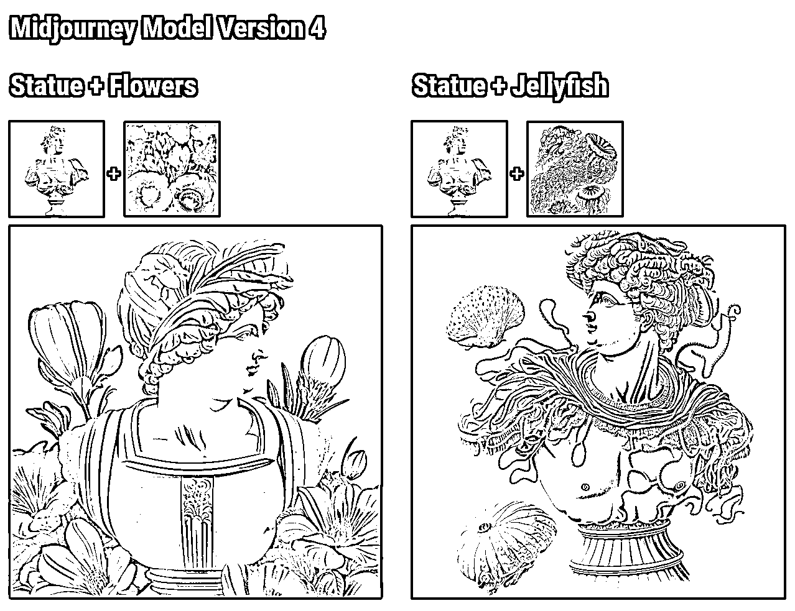 

③ 雕像 + 苔藓 

④ 雕像 + 波浪 

 

⑤ 雕像 + 苔藓 + 花 

 <ne-h4 id="47747e87" data-lake-id="47747e87">6.1.2.2 v5 模型的素材融合</ne-h4> 

① 雕像 + 花 

② 雕像 + 水母 

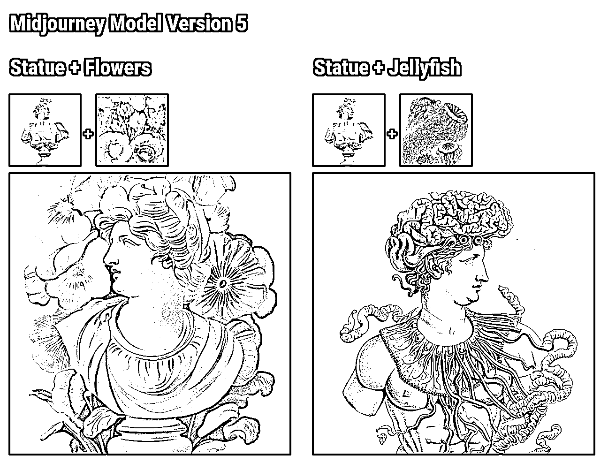 

③ 雕像 + 苔藓 

④ 雕像 + 波浪 

 

⑤ 雕像 + 苔藓 + 花 

 

6.1.3 v3 模型的示例 

早期，模型版本的图像提示比目前的模型更加抽象。 

图像提示被用作视觉灵感，而不是作为起点。这一点，我个人非常喜欢。 

有一个概念，叫做图片的权重，数值越高，参考图片的影响就越大 <ne-h4 id="f823216f" data-lake-id="f823216f">Image Weight  👉 --iw</ne-h4> 

--iw 图像的权重 

早期的 Midjourney 模型版本可以使用图像权重参数 --iw 来调整图像 url， 

--iw 0.25 是默认值，可变范围为 -10000 ~ 10000 

数值越大，则意味着上传的图像会有更大的影响。 

举个例子： 

描述词： [http://kandinsky.png](http://kandinsky.png) vibrant California poppies --v 3 --iw <value> 

上传图像与描述词不变的情况下，改变 --iw 后的数值，对图像造成的影响👇 

最左上角为上传的参考图 

 

描述词 2： [http://sunflowers.png](http://sunflowers.png) vibrant California poppies --v 3 --iw <value> 

上传图像与描述词不变的情况下，改变 --iw 后的数值，对图像造成的影响👇 

最左上角为上传的参考图 

 <ne-h3 id="da48ecc7" data-lake-id="da48ecc7">6.2 修图重要参数（Remix）</ne-h3> 

使用 Remix 模式更改提示符、参数、模型版本或其他参数。Remix 将采用初始图像的一般组成，并将其用作新 Job 的一部分。Remix 可以帮助改变图像的设置或光影，演变主题，或实现棘手的构图。 

Remix 是一个实验性的参数，有可能随时更改或删除，目前可以用。 

6.2.1 Remix 开关 

打开方式一： 

聊天框调用命令 /prefer remix 

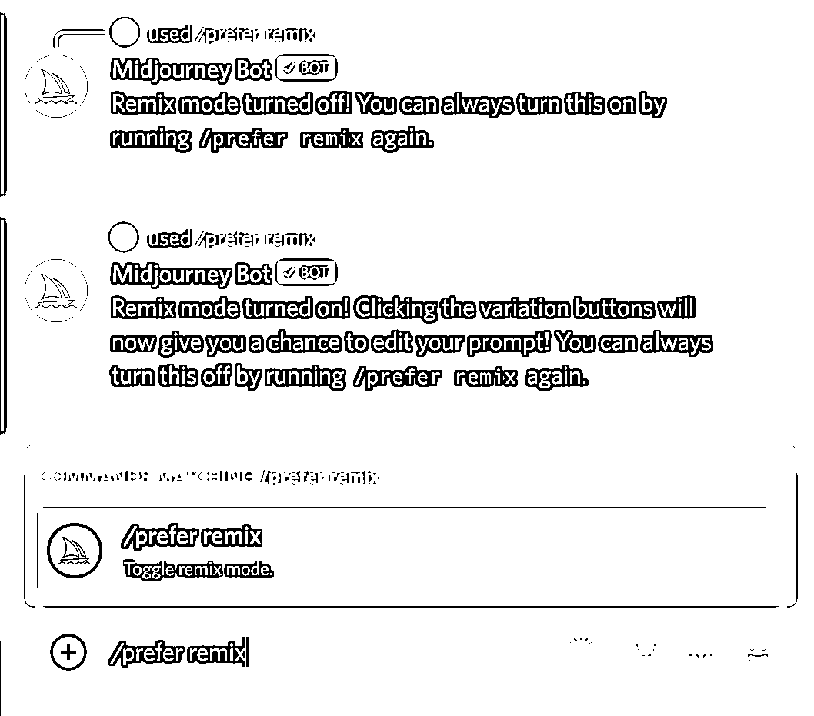 

打开方式二： 

/settings 命令，设置默认值 

Remix mode 

 

👇 

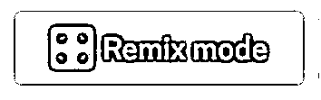 

点一下，变成绿色，就启用了 

6.2.2 Remix 效果展示 <ne-h4 id="9039450f-2" data-lake-id="9039450f-2"> </ne-h4> <ne-h4 id="d8e2ee23" data-lake-id="d8e2ee23">6.2.2.1 概括介绍</ne-h4> 

涉及 V1，V2，V3，V4，以及 Make Variations 的按钮，都会先跳出一个文本框，在原有文本的基础上作修改 

 

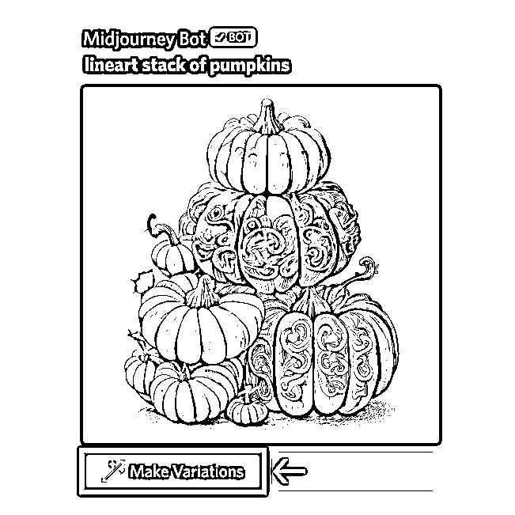 <ne-h4 id="36df1c1a" data-lake-id="36df1c1a">6.2.2.2 实际展示-修改内容词</ne-h4> 

 

① 点一下 Make Variations 

② 修改描述词为“pile of cartoon owls”（一堆卡通猫头鹰） 

③ 点“Submit”，开始生成，在原图的基础结构上，出现一堆猫头鹰👇 

 

6.2.2.3 实际展示-修改模型词 

其他过程不变，最后输入词汇时，添加 --test (相当于补充修改了模型参数) 

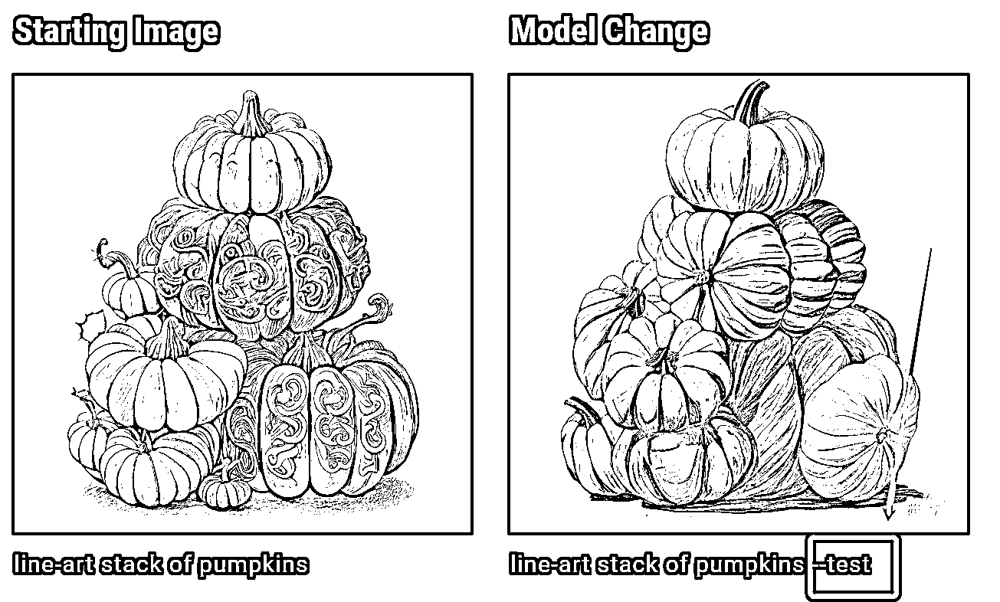 

6.2.2.3 实际展示-修改主题，修改绘图媒介 

 

6.2.3 Remix 搭配参数修改 

可以添加或者删除参数，但是参数之间必须要能契合搭配，数值在可变范围区间之内。 

参照之前的参数模型匹配表 

在对应影响范围内的参数才能工作 

左边一列，是初始生成的影响参数（也就是产生 4 张小图） 

右边一列，是影响变化的影响参数（也就是放大分辨率，以及变化等操作） 

同样，Remix 修改的适用范围也在这里 

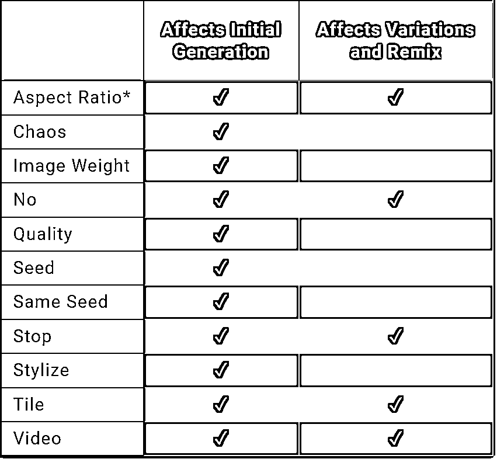 <ne-h3 id="f84bffd4" data-lake-id="f84bffd4">6.3 复杂提示词（多样 prompt）</ne-h3> 

6.3.1 多样提示词基础 

Midjourney Bot 可以使用 :: 作为分隔符，分别考虑两个或多个独立的概念。 

分离提示符可以独立分配每个单词部分的权重，也就是多生成或少生成一点。 

在下面的例子中，对于提示“hot dog”，所有的单词都被放在一起考虑，Midjourney Bot 会生成美味热狗的图像。如果提示符分为两部分，则分别考虑“hot:: dog”这两个概念，创建一个温暖的狗的图片。 

双冒号之间没有空格 :: 

多提示符适用于模型版本 1，2，3，4 和 niji 

 

（左图）杯子蛋糕插图被认为是一起的，出现了杯子蛋糕的插图图像。 

（右图）杯子和蛋糕插图是分开考虑的，蛋糕的图像是放在杯子里的。 

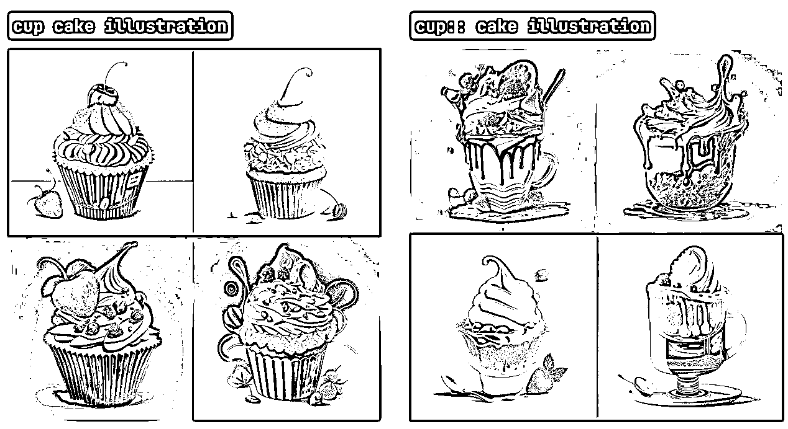 

杯子、蛋糕和插图分别考虑，在杯子中制作一个蛋糕，其中有常见的插图元素，如花和蝴蝶。 

 

6.3.2 描述词权重 

当使用双冒号 :: 将提示符分隔为不同的部分时，可以在双冒号后立即添加一个数字，以分配提示符该部分的相对重要性。 

模型 1,2,3 只接受整数作为权重（比如::2） 

模型 4 可以接受小数权重（比如::1.2） 

未指定的权重默认为 1 

在下面的例子中，提示符 hot:: dog 生成了一条热的狗。将提示符更改为 hot::2 dog 会使单词 hot 比单词 dog 重要两倍，从而产生一个非常热的狗的图像! 

 

注意：权重只与相对比有关，与具体数值无关， 

比如，权重为 2 的 hot 加权重为 1 的 dog，与权重为 100 的 hot 加权重为 50 的 dog，效果是等同的 

6.3.3 负向描述词 

不想要的元素，可以去除 

通过将权重调为负数实现 

下图，红色被调成 -0.5 的权重，因此，红色程度就降低了 

 

6.3.4 --no 参数 

--no 加上不想要的词，等同于将其权重调为 -0.5 

“vibrant tulip fields:: red::-.5”和“vibrant tulip fields --no red”在语义上是一样的 

## 七、获得免费出图时长 

你可能不知道，还可以用评分赚取免费出图时长！ 

在任何地方，都可以通过点😊，选择你喜欢的图像 

 

每天，排名前 1000 的图像评分者可以获得一小时的免费 Fast 模式时间。 

评级高的图片会出现在社区 Rank 部分。 

如果你是当天的最高评分者之一，当你获得小时数时， 

就能收到来自 Midjourney Bot 机器人的赠送时长消息。 

 

Web 评分入口： 

[https://www.midjourney.com/app/ranking/](https://www.midjourney.com/app/ranking/) 

如果足够幸运，就能得到免费时长👇 

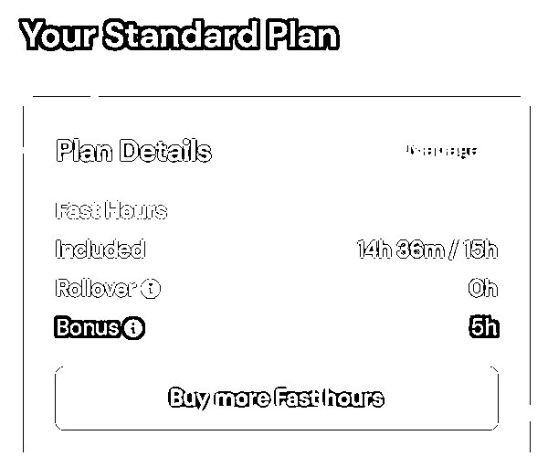 

好啦，关于 Midjourney，基础的介绍大概就到这里啦。 

评论区： 

一 an 严 : 这个量，这个详细程度，强推加精[强] 北辰 : 赞～[玫瑰]学习了 气急败坏灰太狼 : 大佬有没有做成飞书云链接，感觉好长，得多研究研究[奋斗][奋斗] 余锟 : 先点赞，再看[强] Andy Weng🍍 : [发呆]有幸见面会坐在大佬旁边，这么详细的教程，值得仔细拜读 胡椒面 : 期待 sd 的详细操作[色] 琨儿 : 太赞了，天辉教练的分享也太详细了！ 那个雨的夜 : 强推加精+1[强]