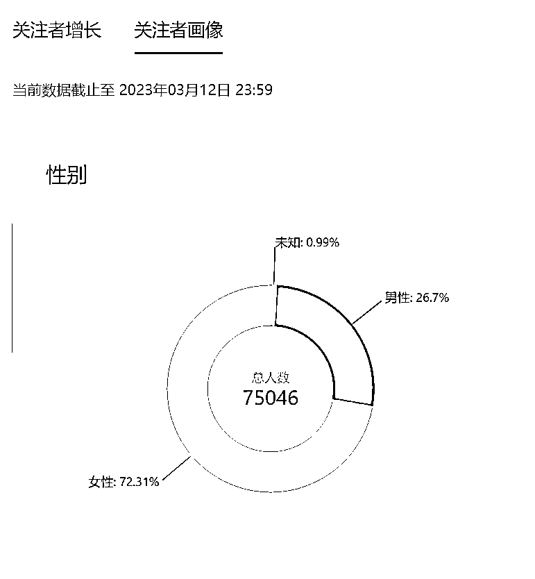
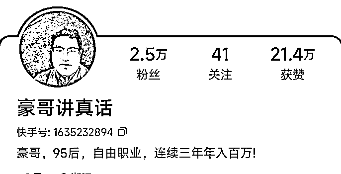
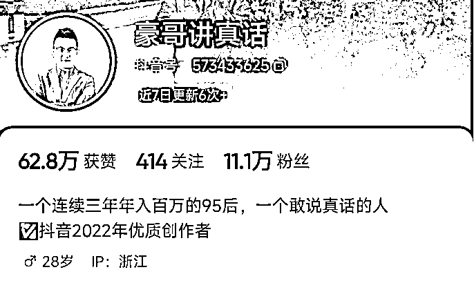
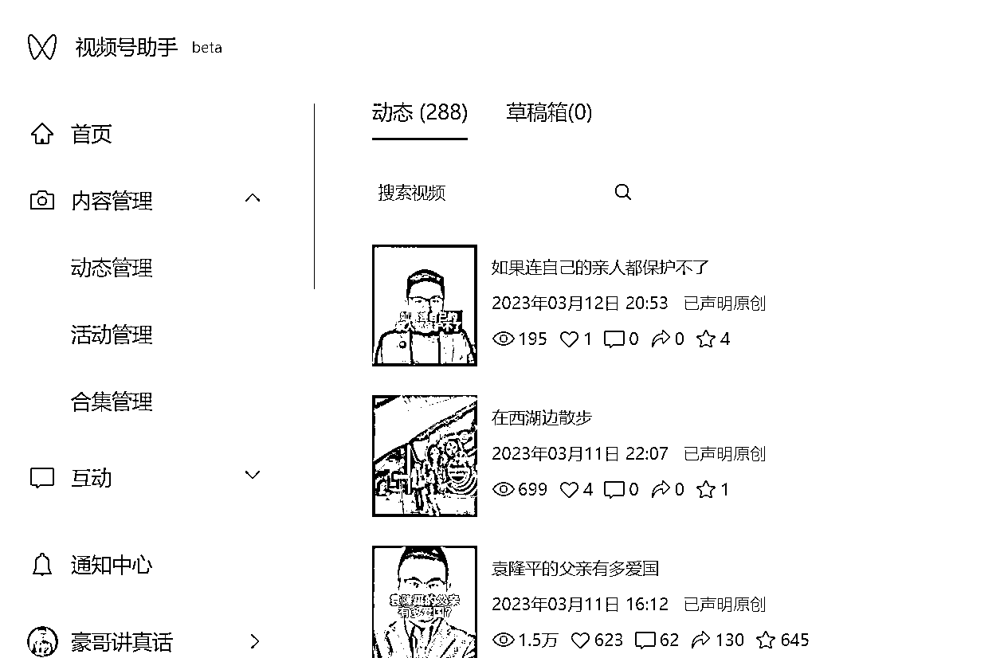
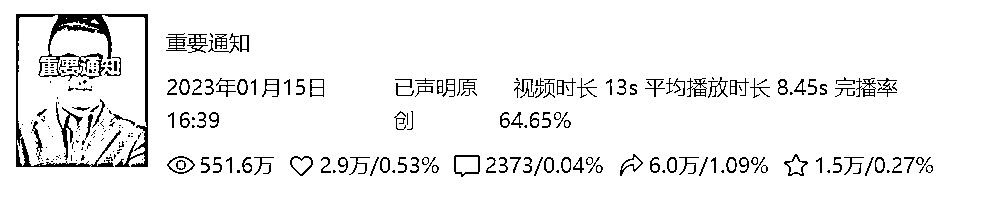
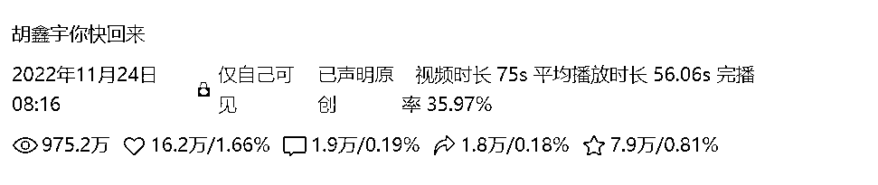

# 《6 个月时间视频号从 0 到 75254 粉丝，多个视频播放超 500 万的实践经验思考》

> 原文：[`www.yuque.com/for_lazy/thfiu8/br7ea0la4q32spu0`](https://www.yuque.com/for_lazy/thfiu8/br7ea0la4q32spu0)

<ne-h2 id="d1628dbf" data-lake-id="d1628dbf"><ne-heading-ext><ne-heading-anchor></ne-heading-anchor><ne-heading-fold></ne-heading-fold></ne-heading-ext><ne-heading-content><ne-text id="u7ac39675">(74 赞)《6 个月时间视频号从 0 到 75254 粉丝，多个视频播放超 500 万的实践经验思考》</ne-text></ne-heading-content></ne-h2> <ne-p id="u5bc6b1c9" data-lake-id="u5bc6b1c9"><ne-text id="uf3380715">作者： 书豪</ne-text></ne-p> <ne-p id="u3159bc59" data-lake-id="u3159bc59"><ne-text id="uff50901a">日期：2023-03-28</ne-text></ne-p> <ne-p id="uf5d087be" data-lake-id="uf5d087be"><ne-text id="u35681e24">大家好，我是在杭州的圈友书豪，一个连续创业三年的 95 后，目前连续三年都年入百万，今年应该能连续四年都达到年入百万。</ne-text></ne-p> <ne-p id="u9792bc5b" data-lake-id="u9792bc5b"><ne-text id="u7d8c4830">曾经靠公众号时代的红利赚到了第一桶金，2022 年 9 月开始，6 个月不到的时间，把豪哥讲真话这个 IP 做到了视频号 7.5 万粉丝，全网 30 万粉丝，其实一开始，我是很没有信心的，面对出镜录制视频讲话，总感觉不自信。</ne-text></ne-p> <ne-p id="u023b72c4" data-lake-id="u023b72c4"><ne-text id="u87aca2ee">视频号：</ne-text></ne-p> <ne-p id="u1a937972" data-lake-id="u1a937972"><ne-card data-card-name="image" data-card-type="inline" id="zU0C2" data-event-boundary="card">  <ne-p id="u67f476bb" data-lake-id="u67f476bb"><ne-text id="u7d88187c">百家号：</ne-text></ne-p> <ne-p id="ue670e49e" data-lake-id="ue670e49e"><ne-card data-card-name="image" data-card-type="inline" id="OC2ld" data-event-boundary="card">  <ne-p id="uf32ec86d" data-lake-id="uf32ec86d"><ne-text id="u8dc38099">快手：</ne-text></ne-p> <ne-p id="ud4485623" data-lake-id="ud4485623"><ne-card data-card-name="image" data-card-type="inline" id="c8GIY" data-event-boundary="card">  <ne-p id="u64ee5019" data-lake-id="u64ee5019"><ne-text id="ue2bf7882">抖音：</ne-text></ne-p> <ne-p id="u94078bed" data-lake-id="u94078bed"><ne-card data-card-name="image" data-card-type="inline" id="hF60J" data-event-boundary="card">  <ne-p id="ue16379a5" data-lake-id="ue16379a5"><ne-text id="ua8bf3e33">视频号我也没做过，我能做到第一个 1000 粉丝吗？回头看，自己真的好傻，有什么能不能的！必须能啊！</ne-text></ne-p> <ne-p id="u8dfca22a" data-lake-id="u8dfca22a"><ne-text id="u6738b624">2022 年 9 月的时候，看到朋友博主小肥羊在读书做的视频单个口播视频上千万播放，上百万播放，心里欣赏又羡慕！必须追上！</ne-text></ne-p> <ne-p id="uc50e74e8" data-lake-id="uc50e74e8"><ne-text id="u9efe2a61">干就对了！</ne-text></ne-p> <ne-p id="u026b044f" data-lake-id="u026b044f"><ne-text id="u2bfefd16">短视频直播的时代，</ne-text><ne-text id="u75a39f8f" ne-bold="true">只要你有行动力，怕什么红利太短？</ne-text></ne-p> <ne-p id="u79bbf14c" data-lake-id="u79bbf14c"><ne-text id="u4f022ff3">我最早刚开始做视频的时候，总觉得，视频号是短视频和直播的产品，我有内容天赋吗？</ne-text></ne-p> <ne-p id="ue519196c" data-lake-id="ue519196c"><ne-text id="u48ff4510">我会怀疑自己，但是自己这 6 个月的实践经验走下来，我发现，</ne-text><ne-text id="u5c4b0c71" ne-bold="true">视频号虽然是内容为王，内容取胜，但是根本就不需要拼内容天赋，本质拼的是跟进爆款内容的执行力和复制爆款的思路！</ne-text></ne-p> <ne-p id="u942b56e8" data-lake-id="u942b56e8"><ne-text id="u86307730">我的视频号：豪哥讲真话</ne-text></ne-p> <ne-p id="u91cf6562" data-lake-id="u91cf6562"><ne-text id="ua6ec348c">下面开始正式的分享</ne-text></ne-p> <ne-h2 id="abecfb5b" data-lake-id="abecfb5b"><ne-heading-ext><ne-heading-anchor></ne-heading-anchor><ne-heading-fold></ne-heading-fold></ne-heading-ext><ne-heading-content><ne-text id="u2d2e8cf0" ne-bold="true">1、为什么我能在 6 个月内做到 7.5 万粉丝？</ne-text></ne-heading-content></ne-h2> <ne-p id="u616c531f" data-lake-id="u616c531f"><ne-text id="ubae45852">首先，各位，让我向各位公布一个数据，就是我做视频号这 6 个月以来，我是日更的，总计有 288 个视频，有的时候有热点内容出现的时候每天是更新 3 到 5 个视频。</ne-text></ne-p> <ne-p id="u44c4aa71" data-lake-id="u44c4aa71"><ne-text id="u51e81e9b">日更真的非常重要，即便是在国庆假期周末元旦 2023 年的春节等节假日，我都是保持日更的，为什么我要坚持日更呢！？因为我相信坚持的力量，滴水穿石的力量是我所坚信的，你如果做不到日复一日的坚持更新一个视频，凭什么你能脱颖而出呢！？即便视频号有流量红利，知道红利的人多了去了，凭什么获得流量和粉丝的人是你呢？</ne-text></ne-p> <ne-p id="uaa5f1cc1" data-lake-id="uaa5f1cc1"><ne-card data-card-name="image" data-card-type="inline" id="YYqyM" data-event-boundary="card">  <ne-h2 id="dd9854cf" data-lake-id="dd9854cf"><ne-heading-ext><ne-heading-anchor></ne-heading-anchor><ne-heading-fold></ne-heading-fold></ne-heading-ext><ne-heading-content><ne-text id="u6a5b3155" ne-bold="true">2、追热点重要吗？</ne-text></ne-heading-content></ne-h2> <ne-p id="ucbd1df36" data-lake-id="ucbd1df36"><ne-text id="u11cce02d">给大家看组数据：</ne-text></ne-p> <ne-p id="u68e20b1c" data-lake-id="u68e20b1c"><ne-card data-card-name="image" data-card-type="inline" id="Jsje4" data-event-boundary="card">  <ne-p id="uc682a120" data-lake-id="uc682a120"><ne-card data-card-name="image" data-card-type="inline" id="UqfFF" data-event-boundary="card">  <ne-p id="ud0d169da" data-lake-id="ud0d169da"><ne-card data-card-name="image" data-card-type="inline" id="dkvHP" data-event-boundary="card">  <ne-p id="uf9d5cfa5" data-lake-id="uf9d5cfa5"><ne-text id="ub848abea">上面几个视频都是当下的社会热点。</ne-text></ne-p> <ne-p id="ubca05a10" data-lake-id="ubca05a10"><ne-text id="uf8b10b1c">视频号单个视频我最高做到过 975 万播放，16.2w 点赞，1.8w 转发，7.9w 收藏，14 天增粉将近 5w。</ne-text></ne-p> <ne-p id="u648bfc2c" data-lake-id="u648bfc2c"><ne-text id="uda7784c4">我也主要是靠三个爆款视频增长了 7w 粉丝，剩下的 200 多个视频总计积累了 5000 左右粉丝。</ne-text></ne-p> <ne-p id="uc3a849f1" data-lake-id="uc3a849f1"><ne-text id="u46dffc1a">短视频领域，你不去追热点，很难快速增粉涨粉丝。</ne-text><ne-text id="u56483f86" ne-bold="true">热点必须要追的！</ne-text><ne-text id="u398b91fd">而且只要追到了，一个爆款视频就够吃好久的！</ne-text></ne-p> <ne-h2 id="3326c4be" data-lake-id="3326c4be"><ne-heading-ext><ne-heading-anchor></ne-heading-anchor><ne-heading-fold></ne-heading-fold></ne-heading-ext><ne-heading-content><ne-text id="u8866042c" ne-bold="true">3、我的文案怎么找的？</ne-text></ne-heading-content></ne-h2> <ne-p id="u4be11e93" data-lake-id="u4be11e93"><ne-text id="u39a6cb5b" ne-bold="true">第一，小圈子互相分享的文案。</ne-text><ne-text id="u2dbee1ae">新手可以直接拿来用（新手应先找自己的表现形式，后面再考虑原创，原创文案对没有功底的人来说太费时间了），老手只用金句就好了。</ne-text></ne-p> <ne-p id="u960a4a48" data-lake-id="u960a4a48"><ne-text id="u8602559e" ne-bold="true">第二，比如海天酱油添加剂事件、李宁的衣服款式设计的像日本军服事件、胡萝卜 HXY 事件</ne-text><ne-text id="uc0d6fc84">这么火爆，</ne-text><ne-text id="u3ce0f745" ne-bold="true">抖音、快手、视频号用关键字搜索</ne-text><ne-text id="ufe1bbc99">，找到高赞的内容提取金句。</ne-text></ne-p> <ne-p id="u7df0d35d" data-lake-id="u7df0d35d"><ne-text id="u9aa8bc3c" ne-bold="true">第三，建立自己的对标账号，整理 100 个+对标账号。模仿爆款对标账号的高赞视频！</ne-text></ne-p> <ne-p id="u201f69c9" data-lake-id="u201f69c9"><ne-text id="ub8a09ba7" ne-bold="true">第四，视频号中随时随手刷到的爆款视频，模仿干！</ne-text></ne-p> <ne-h2 id="e0b188de" data-lake-id="e0b188de"><ne-heading-ext><ne-heading-anchor></ne-heading-anchor><ne-heading-fold></ne-heading-fold></ne-heading-ext><ne-heading-content><ne-text id="u57d09f52" ne-bold="true">4、赚没赚到钱？</ne-text></ne-heading-content></ne-h2> <ne-p id="u96e1a4ab" data-lake-id="u96e1a4ab"><ne-text id="u3a39884a">不同平台有不同的收益模式</ne-text></ne-p> <ne-p id="u9a731416" data-lake-id="u9a731416"><ne-text id="u098bccf3">视频号方面，在朋友的帮助下做了几个书单号，累计也有 2000+的佣金</ne-text></ne-p> <ne-p id="ud6a955c1" data-lake-id="ud6a955c1"><ne-text id="u5bb7bf5f">抖音和快手有创作者广告计划，但是分成比较低，累计几百块钱</ne-text></ne-p> <ne-p id="u0ca72673" data-lake-id="u0ca72673"><ne-text id="u2b126974">百家号方面，在发现百家号对内容创作者扶持较大后，我也把视频同步到百家号，赚到了超过</ne-text><ne-text id="u161bb626" ne-bold="true">2 万元以上</ne-text><ne-text id="u508a0728">的现金</ne-text></ne-p> <ne-p id="u484d912d" data-lake-id="u484d912d"><ne-text id="uca5d83fe">各个平台或多或少都有赚到钱，感兴趣的可以一起沟通</ne-text></ne-p> <ne-h2 id="c0027cfb" data-lake-id="c0027cfb"><ne-heading-ext><ne-heading-anchor></ne-heading-anchor><ne-heading-fold></ne-heading-fold></ne-heading-ext><ne-heading-content><ne-text id="u5fbf5401" ne-bold="true">5、我对视频号的一次认知提升</ne-text></ne-heading-content></ne-h2> <ne-p id="udce1b8e5" data-lake-id="udce1b8e5"><ne-text id="u3f15fab0">朋友让我做了一个视频，一个普通男孩的十年。</ne-text></ne-p> <ne-p id="u2df9f7e9" data-lake-id="u2df9f7e9"><ne-text id="ub5a20e08">我花了一天的时间，把这个视频做出来了，然后发到了朋友圈，哇塞，太多了夸赞过去的 10 年非常精彩非常励志，白手起家赚到了 300 万+。</ne-text></ne-p> <ne-p id="u6c5bca40" data-lake-id="u6c5bca40"><ne-card data-card-name="image" data-card-type="inline" id="D8dJC" data-event-boundary="card">  <ne-p id="u49902214" data-lake-id="u49902214"><ne-text id="ue8ac5c16">这个视频记录了我过去十年从进入大学到毕业后 6 年的摸爬滚打读书到毕业进入社会到工作再到创业 10 年起起落落经历酸甜苦辣的十年。</ne-text></ne-p> <ne-p id="uc53da5ea" data-lake-id="uc53da5ea"><ne-card data-card-name="image" data-card-type="inline" id="de7L1" data-event-boundary="card">  <ne-p id="u68c88392" data-lake-id="u68c88392"><ne-text id="u96d2a7be" ne-bold="true">没想到我做的一个普通男孩的十年，有那么多多年没联系的朋友默默的在看着你观察着你，然后你发出来这个视频后，那么多人私信你夸赞你，给予你认可和鼓励。</ne-text></ne-p> <ne-p id="ub80457f0" data-lake-id="ub80457f0"><ne-text id="u85da86e0" ne-bold="true">就是这个短视频，让我认识到，原来视频号短视频用图片+BGM+文案的形式做成视频能让那么多人产生感动和激励！</ne-text></ne-p> <ne-p id="u3a3b52da" data-lake-id="u3a3b52da"><ne-text id="u8828ce92" ne-bold="true">这坚信了我继续把视频号坚持做下去的希望！</ne-text></ne-p> <ne-h2 id="8ddb9ead" data-lake-id="8ddb9ead"><ne-heading-ext><ne-heading-anchor></ne-heading-anchor><ne-heading-fold></ne-heading-fold></ne-heading-ext><ne-heading-content><ne-text id="ua5aba5de" ne-bold="true">6、我的心路历程如何？</ne-text></ne-heading-content></ne-h2> <ne-p id="u16e356f8" data-lake-id="u16e356f8"><ne-text id="uc0882fdc">我最早在 2022 年 10 月份有在快手爆发过一个 165 万播放量的视频，紧接着在抖音上也有了 70 万播放的数据，这让我找到了做真人出镜口播 IP 号的信心。</ne-text></ne-p> <ne-p id="u6b0d3cde" data-lake-id="u6b0d3cde"><ne-text id="ua8f3d112">因为同样的视频我在视频号上只有几百几千播放，所以如果你的视频只有几百几千播放，不要动摇信心，试试多平台分发。</ne-text></ne-p> <ne-p id="udde3456b" data-lake-id="udde3456b"><ne-text id="u8f65539a" ne-bold="true">如果其他平台爆了，说明你的视频抢流量的能力还是可以的。</ne-text></ne-p> <ne-p id="u9b0b7296" data-lake-id="u9b0b7296"><ne-text id="ua93e85c3">你既然做了一个视频，一定要在视频号、百家号、快手、抖音上都分发一下，测试一下各个平台的播放量和转发量收藏量这些数据。</ne-text></ne-p> <ne-p id="u4bfb0944" data-lake-id="u4bfb0944"><ne-text id="u472f0570">追热点是一定要追的，哪怕追热点来的粉丝没有粘性没有灵魂。</ne-text></ne-p> <ne-p id="u989aff69" data-lake-id="u989aff69"><ne-text id="uea0189ca">但是没关系，此阶段我们需要做的是靠追热点最快找到正反馈，最快找到自己的出镜感觉，最快培养自己的镜头表现力，最快感知视频号平台用户群体的喜好的一种方式。</ne-text></ne-p> <ne-p id="u3bf056f1" data-lake-id="u3bf056f1"><ne-text id="ub9ce06aa">同时也是最节省时间的，你自己写文案，可能半个月都写不出一篇爆款文案。</ne-text></ne-p> <ne-h2 id="a6b87b29" data-lake-id="a6b87b29"><ne-heading-ext><ne-heading-anchor></ne-heading-anchor><ne-heading-fold></ne-heading-fold></ne-heading-ext><ne-heading-content><ne-text id="ub888a1a0" ne-bold="true">7、几个建议。</ne-text></ne-heading-content></ne-h2> <ne-p id="u699ac6a1" data-lake-id="u699ac6a1"><ne-text id="ufe095ccd" ne-bold="true">第一、原创的视频号出镜口播号一定要做一个，可以练自己的表达能力，镜头表现力，演讲能力和文案能力等等，特别是能够让你极大程度的提升网感。</ne-text></ne-p> <ne-p id="u38c28c8f" data-lake-id="u38c28c8f"><ne-text id="u2b234d15" ne-bold="true">第二、坚持日更，持续寻找不同的对标博主和视频号爆款内容素材。</ne-text></ne-p> <ne-p id="u4c39caf3" data-lake-id="u4c39caf3"><ne-text id="u11dace1e" ne-bold="true">第三、别着急变现的事，先混圈子，积累人脉，你身边一帮做视频号做抖音的，你自然而然能有商业变现。</ne-text></ne-p> <ne-p id="u7da5bb76" data-lake-id="u7da5bb76"><ne-text id="u545deb27" ne-bold="true">第四、先种树后乘凉，这是一个最朴素的道理，别想着很快赚到几十万几百万，先赚到第一个 100 块钱，第一个 1 万块钱</ne-text></ne-p> <ne-h2 id="2511604e" data-lake-id="2511604e"><ne-heading-ext><ne-heading-anchor></ne-heading-anchor><ne-heading-fold></ne-heading-fold></ne-heading-ext><ne-heading-content><ne-text id="u0875e0f2" ne-bold="true">最后</ne-text><ne-text id="ub8b2f4ea">抱团取暖才是王道</ne-text></ne-heading-content></ne-h2> <ne-p id="u9db373e8" data-lake-id="u9db373e8"><ne-text id="u3035d93c" ne-bold="true"> 在视频号抖音百家号做短视频、直播的同学咱们都多多交流，市场是大家一起推高天花板的！</ne-text></ne-p> <ne-hole id="u889c84b7" data-lake-id="u889c84b7"><ne-card data-card-name="hr" data-card-type="block" id="Zs377" data-event-boundary="card"><ne-p id="u51ce7610" data-lake-id="u51ce7610"><ne-text id="ucbc7cdbb">评论区：</ne-text></ne-p> <ne-p id="uff2bc18a" data-lake-id="uff2bc18a"><ne-text id="ud614967c">小花 : 求链接</ne-text> <ne-text id="u3642cff7">书豪 : 都做短视频和直播方向业务嘛？微信聊 wshinvest1</ne-text> <ne-text id="u66cc3f9d">李华 : 书豪之前是”人工智能爱好者社区”公众号负责人吗？卧龙行天下公众号是你的吗？</ne-text> <ne-text id="uc0a84e7c">书豪 : 哈哈哈，过去的商业机密都被你挖出来发现了，果然生成的朋友都是擅长挖掘信息的</ne-text> <ne-text id="uf5d7f519">芷蓝 : 牛，再搞几个好产品</ne-text> <ne-text id="u69aedc97">李华 : [强][强]膜拜啊，之前就关注过你</ne-text> <ne-text id="uacc4a889">书豪 : 谢谢您的认可，现在 AI 和 chatGpt 很热，内容高热度</ne-text> <ne-text id="ue70b36d3">书豪 : 谢谢芷蓝，最近在跑了</ne-text></ne-p></ne-card></ne-hole></ne-card></ne-p></ne-card></ne-p></ne-card></ne-p></ne-card></ne-p></ne-card></ne-p></ne-card></ne-p></ne-card></ne-p></ne-card></ne-p></ne-card></ne-p></ne-card></ne-p>