# 《80-90 后童年时光怀旧短视频副业项目，视频号起号再到 10W+复盘》

> 原文：[`www.yuque.com/for_lazy/thfiu8/tpbeadesvu7td3sw`](https://www.yuque.com/for_lazy/thfiu8/tpbeadesvu7td3sw)

<ne-h2 id="1af56aa5" data-lake-id="1af56aa5"><ne-heading-ext><ne-heading-anchor></ne-heading-anchor><ne-heading-fold></ne-heading-fold></ne-heading-ext><ne-heading-content><ne-text id="ua0f40c23">(52 赞)《80-90 后童年时光怀旧短视频副业项目，视频号起号再到 10W+复盘》</ne-text></ne-heading-content></ne-h2> <ne-p id="ue7423767" data-lake-id="ue7423767"><ne-text id="u4a0a12db">作者： 黄岛主</ne-text></ne-p> <ne-p id="uae8a92f2" data-lake-id="uae8a92f2"><ne-text id="u94655e9f">日期：2023-03-29</ne-text></ne-p> <ne-p id="u6d6cac30" data-lake-id="u6d6cac30"><ne-text id="ueb15e796" ne-bold="true">大家好，我是黄岛主！</ne-text></ne-p> <ne-p id="ub9e9eb1a" data-lake-id="ub9e9eb1a"><ne-text id="u11841c32">今天分享的这篇复盘笔记，是我们上年 12 月份操作的一个“80/90 后童年时光怀旧短视频副业项目”，后来没有坚持做下去，主要原因是那个月我们工作室的人都阳了，导致那个月大家都集体罢工回家养病去了。</ne-text></ne-p> <ne-p id="u938fa18e" data-lake-id="u938fa18e"><ne-text id="u3b6ea6a4">后来，今年 1 月份元旦后我们正常上班再去做这个项目的时候，基本上搁置一段时间的账号没流量了，说来也是很可惜，做这个项目的原因也是因为我个人比较怀旧，再加上这个项目可以接广告以及带货或卖号变现，所以我们就批量搞了一波视频号，因为视频号的年龄段比较符合这类粉丝群体。</ne-text></ne-p> <ne-p id="u4b0197a2" data-lake-id="u4b0197a2"><ne-text id="uc85431c1">我相信圈友们很多都是农村走出来的，面对这样的视频场景都是比较感兴趣的，如果正在刷视频的时候看到这种，肯定会点击主页多刷几个，因为这个确实是怀念小时候的那种心理哈。当然，怀旧方向的不光这一种，最近也有很多农村神嫲嫲鬼神之类的怀旧视频，都比较吸引人去点击和观看，这种的话变现都以抖音同步西瓜视频做中视频为主。</ne-text></ne-p> <ne-p id="u7e8fd85a" data-lake-id="u7e8fd85a"><ne-text id="ucee6c93d" ne-bold="true">具体长什么样呢？简单看下案例图：</ne-text></ne-p> <ne-p id="u080e1c9b" data-lake-id="u080e1c9b"><ne-card data-card-name="image" data-card-type="inline" id="TlaGa" data-event-boundary="card">  <ne-p id="u3ae44088" data-lake-id="u3ae44088"><ne-text id="ufb447133" ne-bold="true">具体数据我简单截个图，给大家看下：</ne-text></ne-p> <ne-p id="uc80085b1" data-lake-id="uc80085b1"><ne-card data-card-name="image" data-card-type="inline" id="tSs4V" data-event-boundary="card">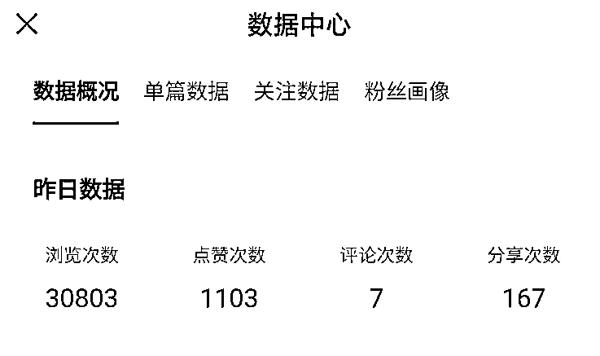  <ne-p id="u7847eafb" data-lake-id="u7847eafb"><ne-card data-card-name="image" data-card-type="inline" id="xC9lk" data-event-boundary="card">  <ne-p id="u9454f242" data-lake-id="u9454f242"><ne-text id="u3219945d" ne-bold="true">这个单号的每天播放量，简单截图给大家看看：</ne-text></ne-p> <ne-p id="u2bc83362" data-lake-id="u2bc83362"><ne-card data-card-name="image" data-card-type="inline" id="HrRVE" data-event-boundary="card">  <ne-p id="u476aafd9" data-lake-id="u476aafd9"><ne-card data-card-name="image" data-card-type="inline" id="j6rJh" data-event-boundary="card">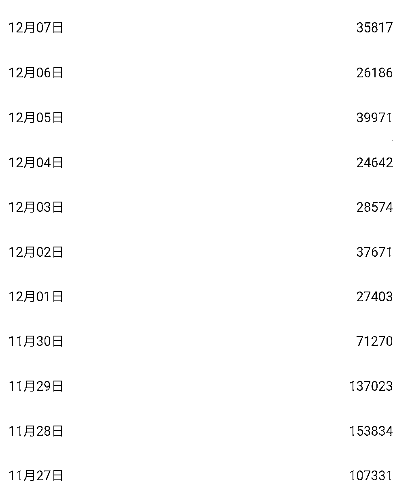  <ne-p id="u9cdb8f6e" data-lake-id="u9cdb8f6e"><ne-card data-card-name="image" data-card-type="inline" id="mQ3pl" data-event-boundary="card">  <ne-p id="ub743a8cd" data-lake-id="ub743a8cd"><ne-text id="u62e4bda4" ne-bold="true">后来基本上不给流量了，就是因为有二十多天的空白期，如图：</ne-text></ne-p> <ne-p id="uf321709a" data-lake-id="uf321709a"><ne-card data-card-name="image" data-card-type="inline" id="D5ceP" data-event-boundary="card">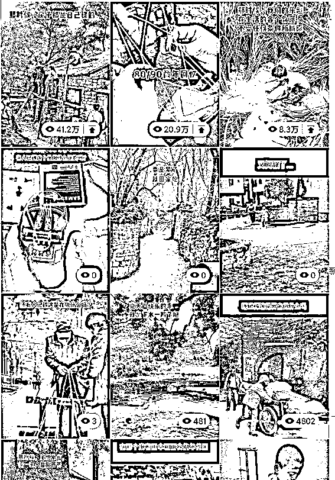  <ne-p id="u1ea02e7f" data-lake-id="u1ea02e7f"><ne-text id="ue9da5673" ne-bold="true">这种农村盖房子的，很多怀旧的人感兴趣，看下过十万的数据都还是很客观的，基本上如果更新完整个 12 月份，这个号很容易成大号去变现：</ne-text></ne-p> <ne-p id="ueea801c2" data-lake-id="ueea801c2"><ne-card data-card-name="image" data-card-type="inline" id="i5ILQ" data-event-boundary="card">  <ne-p id="u20a9e483" data-lake-id="u20a9e483"><ne-text id="u6e7fbc78">说真的，现在这个依然很火，怀旧的离不开 80、90 后的怀念之心，如果你想去试试这个，哪怕不赚钱，也可以操作下看看，接下来，我将分享我们操作这个项目全过程的一条龙大解析，保证里看完即可操作，我会以保姆的形式去写复盘笔记。</ne-text></ne-p> <ne-p id="u4d16f5f7" data-lake-id="u4d16f5f7"><ne-text id="u0536c3ec" ne-bold="true">那么，先说下这篇内容包含哪些：账号注册方法、素材获取方法、视频制作方法、视频发布方法、视频运营方法等，对于大家来说很全面了，好了，我们继续阅读：</ne-text></ne-p> <ne-p id="uf3a485ac" data-lake-id="uf3a485ac"><ne-text id="uc97bd015" ne-bold="true">一、账号注册</ne-text></ne-p> <ne-p id="ue20ae729" data-lake-id="ue20ae729"><ne-text id="ud5f454e9">我这里讲的是以视频号为主，因为这个用户群体比较符合属性，也容易产生共鸣感！</ne-text></ne-p> <ne-p id="u211508f8" data-lake-id="u211508f8"><ne-text id="udb1bc652" ne-bold="true">视频号开通前的建议：</ne-text></ne-p> <ne-p id="uc6b10a10" data-lake-id="uc6b10a10"><ne-text id="uf7f62d18" ne-bold="true">1、我建议大家去新开一个视频号！</ne-text><ne-text id="u9cb6c1ac">因为从 0-1 会更顺畅，不会有那么多的烦心事，而且新号是有扶持期的。</ne-text></ne-p> <ne-p id="uae3776e1" data-lake-id="uae3776e1"><ne-text id="u2a8b2a62" ne-bold="true">2、如果你是老帐号，</ne-text><ne-text id="u1d1e3d38">譬如做了一段时间其他赛道的账号，再拿来做现在的现在的赛道的话，如果真心想做，我建议重新养号，但是可能做的效果不是太好，因为之前赛道的标签定死了，垂直度不是那么的号。而且，也过了扶持期。</ne-text></ne-p> <ne-p id="u2c44d182" data-lake-id="u2c44d182"><ne-text id="udfe7858f" ne-bold="true">老账号里的视频，我给你这个处理建议：</ne-text><ne-text id="u4c9ceceb">可以隐藏视频，但不要删除，删除会降权，后期在刷领域垂直。如果已经发几百个了也可以隐藏起来，后期刷垂直去测试。</ne-text></ne-p> <ne-p id="u6f15ca1a" data-lake-id="u6f15ca1a"><ne-text id="u7c752e4f" ne-bold="true">3、如果是之前注册的，</ne-text><ne-text id="ub09b7aab">从来没做发过视频，只是随便刷刷视频的，这种情况你也可以用，但扶持期过了，肯定起号没新号快。</ne-text></ne-p> <ne-p id="uf061930c" data-lake-id="uf061930c"><ne-text id="u1d9c77e7" ne-bold="true">手机号的注册和环境的建议：</ne-text></ne-p> <ne-p id="u0f0aea7e" data-lake-id="u0f0aea7e"><ne-text id="uadcfa1a0" ne-bold="true">账号注册环境：</ne-text></ne-p> <ne-p id="u5eb21724" data-lake-id="u5eb21724"><ne-text id="u2f03e9e7">要一机一卡一号，要在 4G/5G 环境下注册微信，以及运营视频号，不要在 WiFi 环境下注册和运营哈！</ne-text></ne-p> <ne-p id="u9ba6cc52" data-lake-id="u9ba6cc52"><ne-text id="u84b4cc7b" ne-bold="true">不用 WiFi 的说明：</ne-text></ne-p> <ne-p id="u8c1d5699" data-lake-id="u8c1d5699"><ne-text id="u52bb59f4">1、用 WiFi 注册，有可能会导致账号流量减少、限流、风控。</ne-text></ne-p> <ne-p id="u5a0a8221" data-lake-id="u5a0a8221"><ne-text id="u1b3e535b">2、安卓手机可以限制 WiFi，只让微信仅使用流量上网，这样以便防止误用无线网！（仅限安卓）</ne-text></ne-p> <ne-p id="u38d21b8b" data-lake-id="u38d21b8b"><ne-text id="u91506a4f" ne-bold="true">手机卡注册建议：</ne-text></ne-p> <ne-p id="u8372af7f" data-lake-id="u8372af7f"><ne-text id="ua231b3ca" ne-bold="true">0、</ne-text><ne-text id="u4f2c8b65">推荐用实名注册的卡，不要用虚拟卡、接码的号、物联卡等。</ne-text></ne-p> <ne-p id="ub82953d2" data-lake-id="ub82953d2"><ne-text id="u8034bf93" ne-bold="true">1、</ne-text><ne-text id="ud8d2bc22">有手机号和微信的，跳过</ne-text></ne-p> <ne-p id="u4aa1745e" data-lake-id="u4aa1745e"><ne-text id="u3bf1f3d3" ne-bold="true">2、</ne-text><ne-text id="ue2fc0b11">没有手机号或重新在注册个手机号，再去注册微信</ne-text></ne-p> <ne-p id="uc4e23114" data-lake-id="uc4e23114"><ne-text id="u31c28f83" ne-bold="true">手机卡注册方法：</ne-text></ne-p> <ne-p id="ud8990d00" data-lake-id="ud8990d00"><ne-text id="u554978c6">去营业厅直接注册手机卡，可以注册电信、移动、联通，各五张卡，我建议你去注册移动的卡，跟营业厅说注册个副卡，和主卡流量通用。</ne-text></ne-p> <ne-p id="ub292459e" data-lake-id="ub292459e"><ne-text id="u6dc658af" ne-bold="true">流量包的建议：</ne-text></ne-p> <ne-p id="ud91a3250" data-lake-id="ud91a3250"><ne-text id="u7d924906">可以开个流量稍微大一点的套餐吧，因为视频号不怎么费流量，够发视频的套餐流量就行。</ne-text></ne-p> <ne-p id="ue59bdbb4" data-lake-id="ue59bdbb4"><ne-text id="u6f309db4" ne-bold="true">账号注册流程，看下具体的</ne-text></ne-p> <ne-p id="udbdfe052" data-lake-id="udbdfe052"><ne-text id="u7fa8817c">1、有微信的或者刚注册号的微信，可以直接开通视频号。（如果开通过的，已经发过视频了，建议换号）</ne-text></ne-p> <ne-p id="u88faa13d" data-lake-id="u88faa13d"><ne-text id="u883502ce">2、注册的时候，会让你填写资料，这个资料大家填写下，我以下指标，大家也可以视频号里搜 80 后怀旧，找到对标参考对标</ne-text></ne-p> <ne-p id="u52ddad17" data-lake-id="u52ddad17"><ne-text id="ue2ced5bb" ne-bold="true">昵称：</ne-text><ne-text id="uddfbf5aa">80 后童年怀旧、80 后怀旧时光、80 后童年怀旧时光</ne-text></ne-p> <ne-p id="ue2323a14" data-lake-id="ue2323a14"><ne-text id="uf25aa909" ne-bold="true">签名：</ne-text><ne-text id="u76b1ee18">你的青春，我的回忆，致 70-80-90 后</ne-text></ne-p> <ne-p id="ua6d3ec3b" data-lake-id="ua6d3ec3b"><ne-text id="u7ed1e02a" ne-bold="true">头像：</ne-text><ne-text id="ub349698a">以这个形式去作图，也可以直接拿来用，建议自己改下，这个没什么影响</ne-text></ne-p> <ne-p id="u01b06af0" data-lake-id="u01b06af0"><ne-card data-card-name="image" data-card-type="inline" id="sswWM" data-event-boundary="card">  <ne-p id="uc337b228" data-lake-id="uc337b228"><ne-text id="uf1108a52" ne-bold="true">关于注销的我跟大家说下</ne-text></ne-p> <ne-p id="u320bd170" data-lake-id="u320bd170"><ne-text id="u1c331918" ne-bold="true">现在注销是一年只能 3 次哈！</ne-text></ne-p> <ne-p id="uf47af86f" data-lake-id="uf47af86f"><ne-text id="u89c1feb9" ne-bold="true">特别要注意的是：</ne-text><ne-text id="u116b4ba8">如果以前有绑定过商店，在注销的时候一定要把绑定的商店关联给解除了，还有分数一定不要扣到 60 分以下，不然都会被继承的哈！</ne-text></ne-p> <ne-p id="ue26da6a8" data-lake-id="ue26da6a8"><ne-text id="u8d1082bf" ne-bold="true">二、视频素材获取方法</ne-text></ne-p> <ne-p id="u505ca8f8" data-lake-id="u505ca8f8"><ne-text id="ub49fbfb4" ne-bold="true">素材获取方法</ne-text></ne-p> <ne-p id="uf7a33cc9" data-lake-id="uf7a33cc9"><ne-text id="u72f5fc2b" ne-bold="true">基本上，找素材我们主要以抖音上的为主，不建议你在视频号上找素材，因为我们后期做好的视频主要发视频号，如果从视频号上找素材，做好的视频，可能会被检测到搬运等。以防万一，我们就 A 平台拷贝 B 平台。</ne-text></ne-p> <ne-p id="uebd7853c" data-lake-id="uebd7853c"><ne-text id="ud10f3152" ne-bold="true">手机端的下载素材的方法：</ne-text></ne-p> <ne-p id="ua6889d36" data-lake-id="ua6889d36"><ne-text id="u623d220e" ne-bold="true">第一步：</ne-text><ne-text id="u3efbeaa7">打开抖音，搜索关键词“80 后怀旧”，会出现很多下拉框，随便点击搜索，能看到很多对标视频</ne-text></ne-p> <ne-p id="u8199d680" data-lake-id="u8199d680"><ne-text id="ub9ed7553" ne-bold="true">建议：</ne-text><ne-text id="u57770046">对关注一些对标账号，这些账号都是长期更新的，我们也长期取素材</ne-text></ne-p> <ne-p id="ufff41f65" data-lake-id="ufff41f65"><ne-text id="ucabc548d" ne-bold="true">第二步：</ne-text><ne-text id="uff0658b0">找到视频，点一下右下角的箭头，有一个复制链接，复制链接之后去微信里面搜索小程序轻抖去水印，打开小程序后，把链接粘贴进去，提取后保存视频到相册就可以了。</ne-text></ne-p> <ne-p id="uc24ba9db" data-lake-id="uc24ba9db"><ne-card data-card-name="image" data-card-type="inline" id="Hwe6q" data-event-boundary="card">  <ne-p id="uc3e52eee" data-lake-id="uc3e52eee"><ne-text id="u2337178f" ne-bold="true">轻抖步骤如图：</ne-text></ne-p> <ne-p id="u5a5c74c4" data-lake-id="u5a5c74c4"><ne-card data-card-name="image" data-card-type="inline" id="DqNMG" data-event-boundary="card"></ne-card></ne-p> <ne-p id="ub5921765" data-lake-id="ub5921765"><ne-card data-card-name="image" data-card-type="inline" id="WD9Jo" data-event-boundary="card"></ne-card></ne-p> <ne-p id="u5990f185" data-lake-id="u5990f185"><ne-text id="ubaf1b34d" ne-bold="true">电脑端的下载素材的方法：</ne-text></ne-p> <ne-p id="ucb4a521f" data-lake-id="ucb4a521f"><ne-text id="ueb7a12ba" ne-bold="true">第一步：</ne-text><ne-text id="u4758137a">打开抖音官网：</ne-text>[<ne-text id="udffddf47">https://www.douyin.com/</ne-text>](https://www.douyin.com)</ne-p> <ne-p id="u9e79c65c" data-lake-id="u9e79c65c"><ne-text id="u60ffd664" ne-bold="true">第二步：</ne-text><ne-text id="u6693c338">搜“80 后怀旧”等关键词 找到素材，如图</ne-text></ne-p> <ne-p id="u24ba256b" data-lake-id="u24ba256b"><ne-card data-card-name="image" data-card-type="inline" id="WQTes" data-event-boundary="card">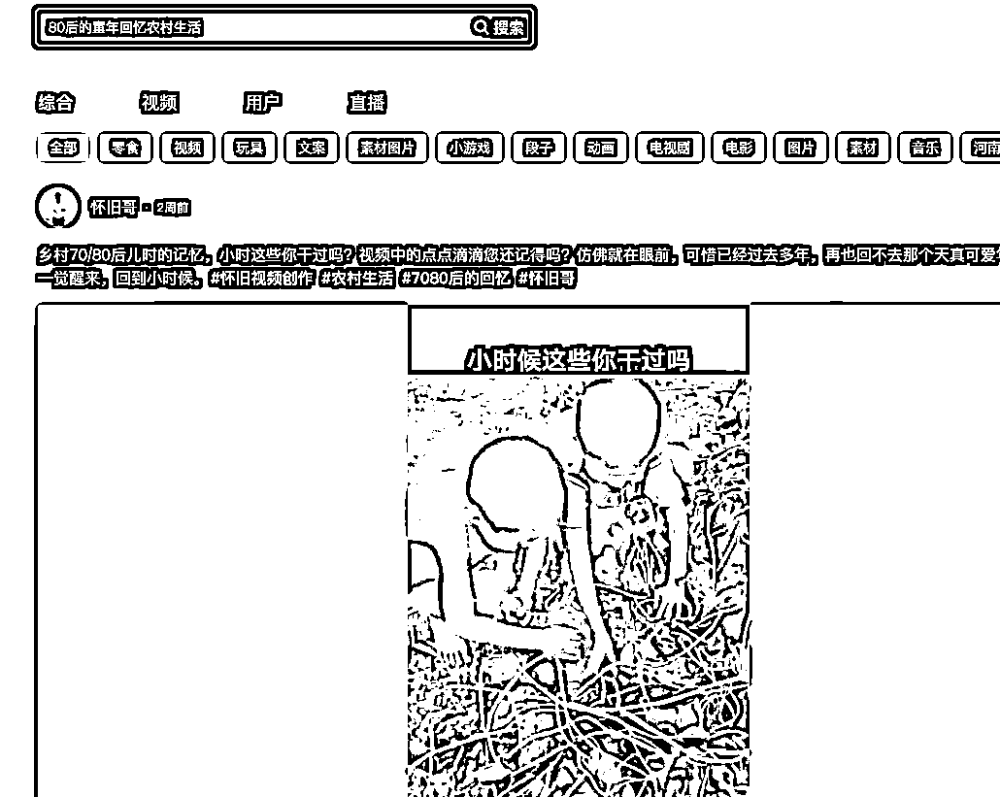  <ne-p id="u279648d0" data-lake-id="u279648d0"><ne-text id="u5e30d89a" ne-bold="true">第三步：</ne-text><ne-text id="u41ea84a2">软件下载视频素材</ne-text></ne-p> <ne-p id="u087d177f" data-lake-id="u087d177f"><ne-text id="ue6aa7fb4" ne-bold="true">PC 端：</ne-text><ne-text id="ud113bd6b">Apowersoft 视频下载王（可以去网上下载，也可以找我要），打开这个软件，复制链接下载视频即可</ne-text></ne-p> <ne-p id="u0214825d" data-lake-id="u0214825d"><ne-text id="u06c7808b" ne-bold="true">步骤如图：</ne-text></ne-p> <ne-p id="u2d591ff3" data-lake-id="u2d591ff3"><ne-text id="ue9f192c6" ne-bold="true">打开软件</ne-text></ne-p> <ne-p id="uf46719f4" data-lake-id="uf46719f4"><ne-card data-card-name="image" data-card-type="inline" id="hnqHx" data-event-boundary="card">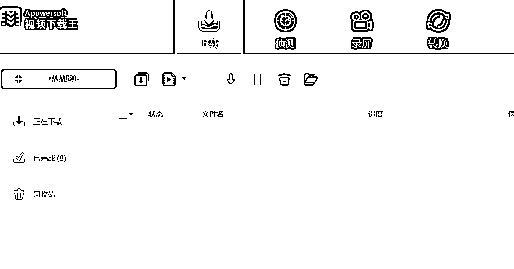  <ne-p id="u946a6cf7" data-lake-id="u946a6cf7"><ne-text id="u515d0758" ne-bold="true">点击侦测，输入网址，完了按回车键，访问下</ne-text></ne-p> <ne-p id="ua91ec51c" data-lake-id="ua91ec51c"><ne-card data-card-name="image" data-card-type="inline" id="o2vSi" data-event-boundary="card">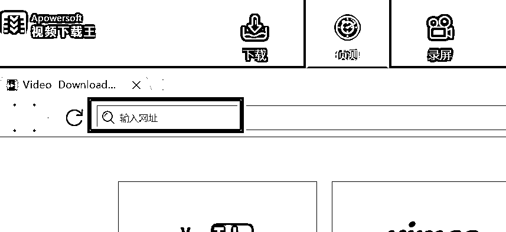  <ne-p id="u9a2ac0d2" data-lake-id="u9a2ac0d2"><ne-text id="u95a3c3cb" ne-bold="true">网页端就可以获取链接地址</ne-text></ne-p> <ne-p id="u27f0143c" data-lake-id="u27f0143c"><ne-card data-card-name="image" data-card-type="inline" id="MfeyQ" data-event-boundary="card">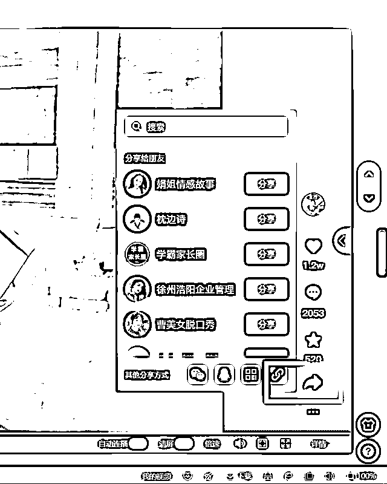  <ne-p id="ucd216c5a" data-lake-id="ucd216c5a"><ne-text id="u348a7def" ne-bold="true">网址只保留这段链接，然后点回车键访问，会自动侦测和下载</ne-text></ne-p> <ne-p id="ub1ceb1e9" data-lake-id="ub1ceb1e9"><ne-card data-card-name="image" data-card-type="inline" id="vIXKa" data-event-boundary="card">  <ne-p id="ud883cd28" data-lake-id="ud883cd28"><ne-text id="uae0a2a05" ne-bold="true">点击下载，点击已完成，找到这个视频，右键选择打开文件夹，就可以看到下载的视频</ne-text></ne-p> <ne-p id="u2a5e691f" data-lake-id="u2a5e691f"><ne-card data-card-name="image" data-card-type="inline" id="GudEw" data-event-boundary="card">  <ne-p id="uf3917808" data-lake-id="uf3917808"><ne-text id="uccac11e2" ne-bold="true">当然了，我这也有很多视频素材，也可以分享给大家：</ne-text></ne-p> <ne-p id="u37ec844a" data-lake-id="u37ec844a"><ne-card data-card-name="image" data-card-type="inline" id="f6vRR" data-event-boundary="card">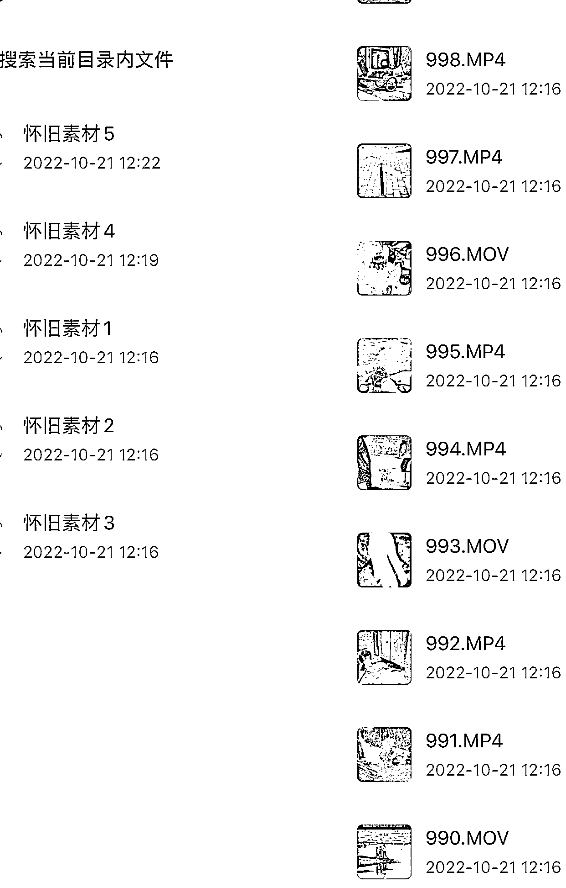  <ne-p id="ufb9063f4" data-lake-id="ufb9063f4"><ne-text id="u6307b568" ne-bold="true">三、视频制作方法</ne-text></ne-p> <ne-p id="u16a00b78" data-lake-id="u16a00b78"><ne-text id="ucfcfbb56">素材我们拿到之后，就可以去制作了，下面我将以图文的形式去写复盘。</ne-text></ne-p> <ne-p id="uc2bdd8ba" data-lake-id="uc2bdd8ba"><ne-text id="ued3de953" ne-bold="true">下面是图文细节解说</ne-text></ne-p> <ne-p id="u673cb2d4" data-lake-id="u673cb2d4"><ne-text id="u547487c9" ne-bold="true">1、直接打开剪映，点击加号选中我们需要的素材</ne-text></ne-p> <ne-p id="u5d6d37b9" data-lake-id="u5d6d37b9"><ne-text id="u283e81ea">选中之后把几个视频添加到里面去， 然后对视频进行二次剪辑，不是我们需要的开头和片尾直接删掉，把视频剪成一个一个的镜头，不要的镜头删掉，每小段都删掉 1 秒左右。</ne-text></ne-p> <ne-p id="u54bd0866" data-lake-id="u54bd0866"><ne-text id="u2c57cd63" ne-bold="true">一些细节我在表达下：</ne-text></ne-p> <ne-p id="u0d61371f" data-lake-id="u0d61371f"><ne-text id="u5ce261db">A：把需要的视频片段出来之后，多余的直接删除</ne-text></ne-p> <ne-p id="ud5d50d9e" data-lake-id="ud5d50d9e"><ne-text id="u6a855d64">剪出来的东西一定是最精华的，表达最好怀旧概念的镜头，30 秒左右就可以，然后把镜头全部打乱，把后面的几个镜头往前移，或者把前面的镜头往后移，总之完全打乱顺序就可以，打乱到连自己都不知道顺序，只要不影响观看怎么打乱都可以。</ne-text></ne-p> <ne-p id="u26daacfa" data-lake-id="u26daacfa"><ne-text id="u7885f3bf">B：建议做视频最好得有个主题，或围绕大概的点去做</ne-text></ne-p> <ne-p id="u95a5cd63" data-lake-id="u95a5cd63"><ne-text id="u76542753">可以多观察同行，比如过年时候、比如上学时候，意思其实很容易理解，就是最好视频垂直一些。当然，也可以多个情景混在一起，具体我们在孵化。</ne-text></ne-p> <ne-p id="u45eaa06b" data-lake-id="u45eaa06b"><ne-text id="u64ef0ebd">C：前三个镜头一定是所有镜头中最好的</ne-text></ne-p> <ne-p id="ua57c4170" data-lake-id="ua57c4170"><ne-text id="u562ac7bc">因为前三秒非常重要，能够吸引用户停留观看才是重点，可以多参考对标视频</ne-text></ne-p> <ne-p id="u36245d9b" data-lake-id="u36245d9b"><ne-text id="u1a5e8a88" ne-bold="true">2、单个视频镜头调速度</ne-text></ne-p> <ne-p id="uf86dfa48" data-lake-id="uf86dfa48"><ne-text id="u4250ef5d">调到 1.1、0.9 都可以，一定不能太快，动作很快的话会影响观感，一般调 1.1、0.9，基本上看不出来。</ne-text></ne-p> <ne-p id="ub2bf09bb" data-lake-id="ub2bf09bb"><ne-card data-card-name="image" data-card-type="inline" id="ROVQi" data-event-boundary="card"></ne-card></ne-p> <ne-p id="u4a6e2f79" data-lake-id="u4a6e2f79"><ne-text id="u309840af" ne-bold="true">3、单个视频镜头调镜像</ne-text></ne-p> <ne-p id="ufb0f3b4a" data-lake-id="ufb0f3b4a"><ne-text id="uf46d69e8">调镜像是在编辑里，镜像就是把画面反转过来，如果有字的尽量不调，没有字的尽量把它调过来，有字也可以切掉，镜像一定要做，每个镜头都去调一下。</ne-text></ne-p> <ne-p id="u77fc3192" data-lake-id="u77fc3192"><ne-card data-card-name="image" data-card-type="inline" id="ef9pE" data-event-boundary="card">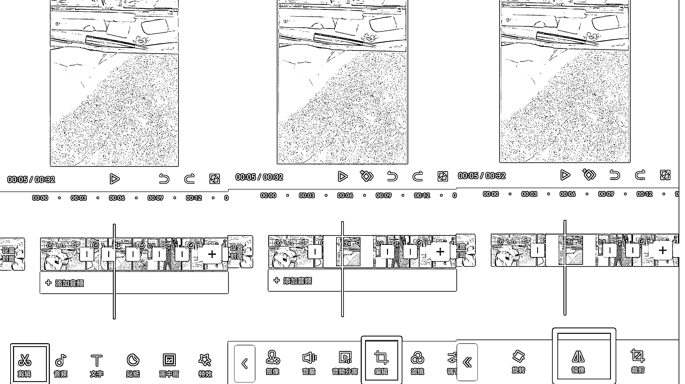</ne-card></ne-p> <ne-p id="u621cdab2" data-lake-id="u621cdab2"><ne-text id="ue2df8842" ne-bold="true">4、整个视频调滤镜</ne-text></ne-p> <ne-p id="u27255eb8" data-lake-id="u27255eb8"><ne-text id="ubcdadcbb">像我们做怀旧的滤镜，用的比较多的是黑白滤镜，黑白里分为牛皮纸、江浙沪等滤镜，这些都可以，可以根据自己的视频需求去选择，自己喜欢哪种就用哪种，调完滤镜之后，把滤镜一直往后拉，拉到和视频末尾对齐。</ne-text></ne-p> <ne-p id="u32424e42" data-lake-id="u32424e42"><ne-card data-card-name="image" data-card-type="inline" id="u9nwg" data-event-boundary="card"></ne-card></ne-p> <ne-p id="ub973c4f6" data-lake-id="ub973c4f6"><ne-text id="ua6e9d421" ne-bold="true">5、整个视频调特效</ne-text></ne-p> <ne-p id="u5c12298b" data-lake-id="u5c12298b"><ne-text id="uad971f6c">基本上复古特效，适合怀旧视频的，看了很多对标视频也是这个特效，所以我们一般会用到的特效是黑色噪点、荧幕噪点这两个，这个调完特效之后把特效拉到最后，和视频末尾对齐。</ne-text></ne-p> <ne-p id="uf697a09b" data-lake-id="uf697a09b"><ne-card data-card-name="image" data-card-type="inline" id="QH29G" data-event-boundary="card"></ne-card></ne-p> <ne-p id="u60b1847d" data-lake-id="u60b1847d"><ne-text id="u86d1a56e" ne-bold="true">6、调节</ne-text></ne-p> <ne-p id="ub53f2688" data-lake-id="ub53f2688"><ne-text id="uce8af3b1">调节后，可以把视频做的更清晰，看起来更舒服，颜色更饱满。</ne-text></ne-p> <ne-p id="ub01b7fce" data-lake-id="ub01b7fce"><ne-text id="u5eb7a300">我们这里新增调节，调对比度 10、饱和度 10，锐化 20，饱和度让整个画面看起来更有质感，锐化增加清晰度，调好之后一样要拉到最后。</ne-text></ne-p> <ne-p id="u254d28f1" data-lake-id="u254d28f1"><ne-card data-card-name="image" data-card-type="inline" id="zarej" data-event-boundary="card"></ne-card></ne-p> <ne-p id="u10085a80" data-lake-id="u10085a80"><ne-text id="ued903000" ne-bold="true">7、添加音频</ne-text></ne-p> <ne-p id="uf158c9dc" data-lake-id="uf158c9dc"><ne-text id="ud876cd18">音频我给大家整理好一个了，大家可以用现成的，另外，每个视频 36 秒左右，也就是跟音频对齐就行。</ne-text></ne-p> <ne-p id="uf7723e2e" data-lake-id="uf7723e2e"><ne-text id="uf5cfd0b0">可以网盘下载，链接：</ne-text>[<ne-text id="u4f2f26e9">https://pan.baidu.com/s/1SQL6RxiqGsUzdxZmgcCeAw?pwd=6666</ne-text>](https://pan.baidu.com/s/1SQL6RxiqGsUzdxZmgcCeAw?pwd=6666)</ne-p> <ne-p id="ua8638237" data-lake-id="ua8638237"><ne-text id="u41790453">提取码：6666</ne-text></ne-p> <ne-p id="u95f93609" data-lake-id="u95f93609"><ne-text id="u451564c3" ne-bold="true">音频导入剪映方法：</ne-text><ne-text id="u4d4913af">先发在 QQ 上，然后从 QQ 导入到剪映，前提是建议里有视频了，才能导入，不然导入不进去！具体看步骤！</ne-text></ne-p> <ne-p id="u0a76bef3" data-lake-id="u0a76bef3"><ne-text id="u1ae9ffb7" ne-bold="true">当然了，假如觉得其他人的音频文案不错也可以复制过来用</ne-text></ne-p> <ne-p id="u37e23e0b" data-lake-id="u37e23e0b"><ne-text id="u063da100">先用轻抖去水印下载视频，然后把视频导入剪映，并关闭原声，点击添加提取音乐，仅导入视频的声音就可以了。</ne-text></ne-p> <ne-p id="ud334e2ff" data-lake-id="ud334e2ff"><ne-text id="u4464917d">暂时无法在飞书文档外展示此内容</ne-text></ne-p> <ne-p id="ua6b40b6b" data-lake-id="ua6b40b6b"><ne-text id="u7f087d7e" ne-bold="true">视频处理好了之后，我们要做一些文字点缀，具体看下</ne-text></ne-p> <ne-p id="u3134eda2" data-lake-id="u3134eda2"><ne-text id="uf7f80791" ne-bold="true">8、做抬头文字</ne-text></ne-p> <ne-p id="u8b01ae22" data-lake-id="u8b01ae22"><ne-text id="u650071a7">好的抬头文字，可以留住用户观看视频！</ne-text></ne-p> <ne-p id="u0eaffde0" data-lake-id="u0eaffde0"><ne-card data-card-name="image" data-card-type="inline" id="Z5bbM" data-event-boundary="card">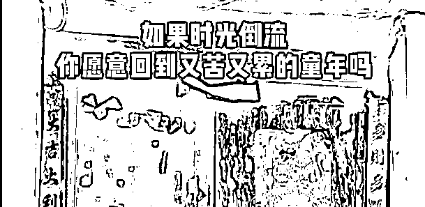  <ne-p id="uf29978ef" data-lake-id="uf29978ef"><ne-text id="uc8e27761" ne-bold="true">可以这么解释：</ne-text></ne-p> <ne-p id="ubcf7ea8b" data-lake-id="ubcf7ea8b"><ne-text id="uf2896a4b">如果说刚好刷到一群对视频不太感冒的人很容易刷过去，但是有一个抬头吸引的话可能就会停留一会，假如我写经历过的至少已经 35 岁了，发现我自己 40 岁了，那看一下到底经历过什么东西，会有看下去的吸引力，在完播率到很大的作用。</ne-text></ne-p> <ne-p id="ue03cc6f6" data-lake-id="ue03cc6f6"><ne-text id="u362add42" ne-bold="true">具体操作：</ne-text></ne-p> <ne-p id="u6329c9ba" data-lake-id="u6329c9ba"><ne-text id="u6f383f34">有一个画中画，点一下新增画中画，新增之后点一下素材库，点到素材库之后有黑白布，点黑布添加上面去，添加之后会把视频遮掉，可以移到上面，移到上面之后发现太小了，可以用两只手往两边拉大，拉到我们需要的位置，拉好之后把长度拉到和镜头长度一样长，选择好合适的位置。</ne-text></ne-p> <ne-p id="u7b0bf968" data-lake-id="u7b0bf968"><ne-text id="ub27b1483">下面没有遮住的话，复制个一样的画中画把它拉到下面来，拖过去叠加一层，拉到差不多上下遮掉了之后就开始做抬头，抬头需要文字，点击添加文本，新建文本，直接输入文字就可以了。</ne-text></ne-p> <ne-p id="uf42f429d" data-lake-id="uf42f429d"><ne-text id="uf95124a6">抬头文案弄好之后要拉到跟视频对齐，给字调颜色、大小、字体，编辑字体有很多样式，颜色，用自己喜欢的就可以，通常用比较偏复古的黄色，比较醒目，适合主题，也可以用别的颜色。</ne-text></ne-p> <ne-p id="ufbcb9aa1" data-lake-id="ufbcb9aa1"><ne-card data-card-name="image" data-card-type="inline" id="pW8RJ" data-event-boundary="card">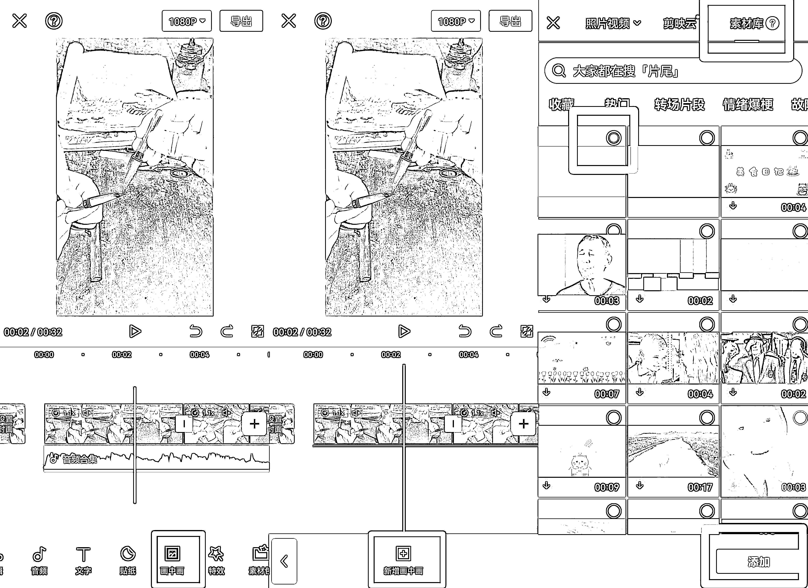</ne-card></ne-p> <ne-p id="u9743c169" data-lake-id="u9743c169"><ne-card data-card-name="image" data-card-type="inline" id="UGgT7" data-event-boundary="card"></ne-card></ne-p> <ne-p id="ub67efdbd" data-lake-id="ub67efdbd"><ne-text id="u94506f7a">也可以不用放画中画添加抬头文，直接在视频最上方输入文字也是可以的，这两种方式都可以，看个人的选择，文案可以多去参考热门的同行，多搜集一些热门的文案保存到自己的备忘录里面，每次需要用的时候直接去里面复制粘贴就可以了。</ne-text></ne-p> <ne-p id="u4e05213c" data-lake-id="u4e05213c"><ne-card data-card-name="image" data-card-type="inline" id="qGNhB" data-event-boundary="card"></ne-card></ne-p> <ne-p id="u7c5da259" data-lake-id="u7c5da259"><ne-text id="u2a209b38" ne-bold="true">最后视频做出来了，效果没法展示了，这里没法上传视频，大家可以去视频号搜 80 后童年时光机，看看这个对标账号，我们基本上都是对标他的去操作的。如图：</ne-text></ne-p> <ne-p id="u9dfdf425" data-lake-id="u9dfdf425"><ne-card data-card-name="image" data-card-type="inline" id="FNUcx" data-event-boundary="card">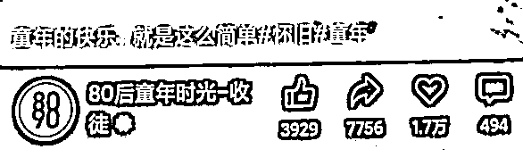  <ne-p id="u09c363eb" data-lake-id="u09c363eb"><ne-text id="u6c10c3d3" ne-bold="true">四、发布视频方法</ne-text></ne-p> <ne-p id="ud3fa7368" data-lake-id="ud3fa7368"><ne-text id="uc8465223">发布很简单，打开视频号，点击发布，选中视频，添加描述和标签，选择好封面，可以直接发布。</ne-text></ne-p> <ne-p id="uca04812c" data-lake-id="uca04812c"><ne-text id="uf27a28d3" ne-bold="true">看下简单的步骤图：</ne-text></ne-p> <ne-p id="u80f48dee" data-lake-id="u80f48dee"><ne-card data-card-name="image" data-card-type="inline" id="fuGro" data-event-boundary="card"></ne-card></ne-p> <ne-p id="uc928a4c0" data-lake-id="uc928a4c0"><ne-card data-card-name="image" data-card-type="inline" id="eK8po" data-event-boundary="card"></ne-card></ne-p> <ne-p id="u798e1cb6" data-lake-id="u798e1cb6"><ne-card data-card-name="image" data-card-type="inline" id="AbYkp" data-event-boundary="card"></ne-card></ne-p> <ne-p id="ufb33b279" data-lake-id="ufb33b279"><ne-text id="uf1febbc8" ne-bold="true">五、运营方法</ne-text></ne-p> <ne-p id="ubc923f85" data-lake-id="ubc923f85"><ne-text id="uf1520c18">视频发布之后，基本上要去运营了，不能只发不管不问，肯定做不出效果，一点要注意：我们要去做权重，上热门，需要从小一点点的去运营！</ne-text></ne-p> <ne-p id="uc4675b62" data-lake-id="uc4675b62"><ne-text id="ub1f8b866" ne-bold="true">这里我简单的跟大家讲下我们是怎么运营的：</ne-text></ne-p> <ne-p id="u6d7e4ec4" data-lake-id="u6d7e4ec4"><ne-text id="u8d1b8e21" ne-bold="true">我们现在主要做的是：公域流量，你要了解清楚</ne-text></ne-p> <ne-p id="u308b3b21" data-lake-id="u308b3b21"><ne-text id="ud5c62550">大家都是没粉丝的微信开通的视频号，所以我们在做公域流量。那么，想要发展起来，这个就要看你你的作品质量了。</ne-text></ne-p> <ne-p id="ud7a55af7" data-lake-id="ud7a55af7"><ne-text id="u5926c35f">那么，在视频号里，不断创作优质内容，账号权重有了一定积累之后，官方会给你匹配一定的基础播放量。</ne-text></ne-p> <ne-p id="u0c7e912f" data-lake-id="u0c7e912f"><ne-text id="ucd96ae47">例如：最开始的时候，发布视频后，大概是几十人，不到 100 的播放。然后想爬梯子一样往上爬。</ne-text></ne-p> <ne-p id="u75650cfa" data-lake-id="u75650cfa"><ne-text id="u230bd4bc">到了第二个梯队是 500 播放，第三个梯队是 3000 左右，然后第四个梯队到了 5000，第五个梯队到 1 万，再往上还有一波一波的播放流量。</ne-text></ne-p> <ne-p id="u74514d17" data-lake-id="u74514d17"><ne-text id="uaff3a25a">这里有一个关键数据，用户平均观看时长。这是视频号判定一条视频质量的核心数据，不是大家以为的完播率，也不是点赞或评论这些数据。当然，其他的数据也会影响视频的质量分，只是说，平均观看时长是一个更为重要的维度。</ne-text></ne-p> <ne-p id="uef2b5982" data-lake-id="uef2b5982"><ne-text id="ub4e61317" ne-bold="true">简单运营思路说下</ne-text></ne-p> <ne-p id="uc6333dc3" data-lake-id="uc6333dc3"><ne-text id="u6ba23c39" ne-bold="true">1、每天养号 1 小时</ne-text></ne-p> <ne-p id="u8776318c" data-lake-id="u8776318c"><ne-text id="ub2c47ea4">虽然，我们前期没让养号，但我还是建议大家每天发布视频之后或之前，都搜下 80 后怀旧等关键词，看看同行的视频，这个等于活跃账号权重</ne-text></ne-p> <ne-p id="u309d1fd3" data-lake-id="u309d1fd3"><ne-text id="u23e495da">如果你不去看别人的视频，平台可能会认为你的视频号是营销号，而且权重也会下降，刚开始扶持期给推荐，后期就没有了。</ne-text></ne-p> <ne-p id="u9c7c33e5" data-lake-id="u9c7c33e5"><ne-text id="ud046c5b8">所以，我这个建议要每天都按时养号，去刷刷同视频。</ne-text></ne-p> <ne-p id="u38c3b94f" data-lake-id="u38c3b94f"><ne-text id="u5b8146ca" ne-bold="true">2、每个视频发布后，要自己去点赞、评论、完播、转发</ne-text></ne-p> <ne-p id="u57a0463d" data-lake-id="u57a0463d"><ne-text id="ud53aa5d7">这样能够破个零，推动视频的推荐量，这个要养成习惯。可以转发你其他有粉丝的账号或者微信群。</ne-text></ne-p> <ne-p id="u0544fbab" data-lake-id="u0544fbab"><ne-text id="u74ff8b26" ne-bold="true">3、多准备几个小号，去做点赞、评论、完播、转发</ne-text></ne-p> <ne-p id="uf7395f3c" data-lake-id="uf7395f3c"><ne-text id="udc5a02c1" ne-bold="true">A：大号发了作品，用小号进去完播一下播放，然后再点赞，评论、 收藏、转发。</ne-text></ne-p> <ne-p id="ue9bdd26f" data-lake-id="ue9bdd26f"><ne-text id="uab935b39">好处是：系统误以为是用户喜欢这个作品才点赞评论的。</ne-text></ne-p> <ne-p id="u31b8d0c6" data-lake-id="u31b8d0c6"><ne-text id="u5fc3c81f" ne-bold="true">B：小号评论的时候也不是瞎写的，最好设计一个很吸引人的评论</ne-text></ne-p> <ne-p id="u4aba1aef" data-lake-id="u4aba1aef"><ne-text id="u85e10fa3">这种评论的好处：可以吸引他人给你点赞、跟评。（这个评论就带动了一大堆评论出来），例如，小时候这样的生活，你还记得吗？是不是深有感触，等等。</ne-text></ne-p> <ne-p id="ua3454c0c" data-lake-id="ua3454c0c"><ne-text id="uaa6f38ff">系统不管他为什么给你评论，哪怕他写了一个句号，系统也会认为是你的视频足够好，他才评论的。</ne-text></ne-p> <ne-p id="ua001e93c" data-lake-id="ua001e93c"><ne-text id="u843ce10c">基本上，一个作品，点赞评论的多了，系统就会认 为是个好作品，然后继续给你推送，可能不知不觉就火了。</ne-text></ne-p> <ne-p id="uac2c6a24" data-lake-id="uac2c6a24"><ne-text id="u2dc42c8b" ne-bold="true">C： 多关注下对标的大号</ne-text></ne-p> <ne-p id="u9ca5e994" data-lake-id="u9ca5e994"><ne-text id="u87f03f45">同行更新视频，我们也能从关注刷到对标视频。</ne-text></ne-p> <ne-p id="u86b7c670" data-lake-id="u86b7c670"><ne-text id="u4344d52b" ne-bold="true">4、有用户评论了，一定要多和用户互动，这样会提高推荐量</ne-text></ne-p> <ne-p id="u3375a425" data-lake-id="u3375a425"><ne-text id="u7edfa392" ne-bold="true">5、删除这两个字不要用</ne-text></ne-p> <ne-p id="u993bd96a" data-lake-id="u993bd96a"><ne-text id="u7ef02114">永远记住，任何时间，不要删作品，就是设置仅自己可见，隐藏起来就行了</ne-text></ne-p> <ne-p id="uca578726" data-lake-id="uca578726"><ne-text id="u1e5a0be0" ne-bold="true">6、视频发布周期 7-15 天，看下这段期间的播放量如何，是否都过 500</ne-text></ne-p> <ne-p id="u6fdbdd42" data-lake-id="u6fdbdd42"><ne-text id="u4506f506">前 5 天每天过 500 说明作品质量还不错</ne-text></ne-p> <ne-p id="u80c8fc81" data-lake-id="u80c8fc81"><ne-text id="u9df5bb0e">7-15 天看下账号的整体数据，我们在做调整。</ne-text></ne-p> <ne-p id="ufb6e4334" data-lake-id="ufb6e4334"><ne-text id="u9c8476ff" ne-bold="true">7、可以用加热投放去快速热门</ne-text></ne-p> <ne-p id="u3cca87b9" data-lake-id="u3cca87b9"><ne-text id="u13de47f6">有过 5W 的数据，可以找我交流这个方法</ne-text></ne-p> <ne-p id="u5ce11fe7" data-lake-id="u5ce11fe7"><ne-text id="u5bbd7624" ne-bold="true">8、什么时候不用 4G，而用无线网？</ne-text></ne-p> <ne-p id="ud582cba3" data-lake-id="ud582cba3"><ne-text id="ub8bca23f">我们遵循一机一卡一号，我建议起号之后，可以切换无线网。起号之前，都要 4G 或 5G，IP 不要换。</ne-text></ne-p> <ne-p id="u1758ff1d" data-lake-id="u1758ff1d"><ne-text id="u28a604b8" ne-bold="true">9、发完之后，没流量，不要隐藏重新发</ne-text></ne-p> <ne-p id="u8013a6c4" data-lake-id="u8013a6c4"><ne-text id="u3abc0e76">按照标准化，正常发，等 7-15 天，看整体数据</ne-text></ne-p> <ne-p id="u6af0f0c4" data-lake-id="u6af0f0c4"><ne-text id="ua4457c00" ne-bold="true">10、老号和新号，看看数据怎么样，在反馈我</ne-text></ne-p> <ne-p id="u55ec7112" data-lake-id="u55ec7112"><ne-text id="uea3143ba" ne-bold="true">11、账号 0 播放的原因，我能想到的说下</ne-text></ne-p> <ne-p id="ub4ac92b4" data-lake-id="ub4ac92b4"><ne-text id="u19d552da">视频号出现 0 播放一般有好几种原因，一种是账号违规过，还有的是新号开始很猛突然一下就变 0 了或者数据很差了，还有就是同 ip 下账号登录太多，视频发布的数量过多了，和视频发布的不是原创同质化太多了，没去重好。</ne-text></ne-p> <ne-p id="u6c2e8ce6" data-lake-id="u6c2e8ce6"><ne-text id="u6e488b54">按照这个去运营，基本上可以正常起号！</ne-text></ne-p> <ne-p id="u3f55fa1d" data-lake-id="u3f55fa1d"><ne-text id="u719231b3" ne-bold="true">六、复盘总结汇总</ne-text></ne-p> <ne-p id="u7e319a9f" data-lake-id="u7e319a9f"><ne-text id="uc51c3ecb" ne-bold="true">这个每天的总结说来惭愧，这是我们工作室的员工记录下来的，充分说明用心去做了，简单的给大家看下这个：</ne-text></ne-p> <ne-p id="u0240a33f" data-lake-id="u0240a33f"><ne-text id="u9f4bb94a">10.21 注册账号。手机上双开应用登录另一个微信，新开视频号账号。制作头像，取名字，加上签名。</ne-text></ne-p> <ne-p id="u2b305bc9" data-lake-id="u2b305bc9"><ne-text id="u959c9b92">10.22 获取素材和开始制作视频。建议可以统一一下，给视频形式模板化，如背景音乐，时长，文字（字体，行距，字间距，排列，描边等），滤镜，转场等。这样可以加快视频剪辑速度。</ne-text></ne-p> <ne-p id="ubd760a9b" data-lake-id="ubd760a9b"><ne-text id="u57aab78e">10.23 开始每天发布 2 个视频</ne-text></ne-p> <ne-p id="uaa363495" data-lake-id="uaa363495"><ne-text id="u2c40a014">前 2 条视频浏览量比较低，一两百左右；后面就基本都超过 500，差不多隔一天有一条上千。</ne-text></ne-p> <ne-p id="u66a7ee32" data-lake-id="u66a7ee32"><ne-text id="u9ea93164">11.05 收到平台的原创发表任务。任务期间发布 14 条视频，每条视频浏览量大于 500，即可获得 1000 流量。</ne-text></ne-p> <ne-p id="uc84addb3" data-lake-id="uc84addb3"><ne-text id="u195173b7">11.13 成功完成任务，获得 1000 流量奖励，也是这个视频当天上万浏览量，现在有 4.5 万浏览量。</ne-text></ne-p> <ne-p id="u140a3966" data-lake-id="u140a3966"><ne-text id="ucba64fd1">11.13 当天收到第二条原创发表任务，要求同上。</ne-text></ne-p> <ne-p id="u7d700ff6" data-lake-id="u7d700ff6"><ne-text id="u08189917">11.15 粉丝数到 100，开启视频变现功能。累计获赞到 1000。</ne-text></ne-p> <ne-p id="ue8ff3fb7" data-lake-id="ue8ff3fb7"><ne-text id="u10b918fe">11.15-20 前几条效果不是很好，所以开始每天发三条视频，到现在几乎每天都有视频上千。</ne-text></ne-p> <ne-p id="u94a890cf" data-lake-id="u94a890cf"><ne-text id="u97ea19c7">11.20 共有三条视频上万，分别是 2.1 万，2.4 万和 4.5 万。</ne-text></ne-p> <ne-p id="u0f02c444" data-lake-id="u0f02c444"><ne-text id="ub9c31fb8">现在主要是找了三个音频，一个没有歌词的，适用于 8-10 秒左右的视频；另外两个带歌词的，适用于 20 秒以上的视频。</ne-text></ne-p> <ne-p id="ub608463e" data-lake-id="ub608463e"><ne-text id="ub4954c81" ne-bold="true">做视频主要流程：</ne-text></ne-p> <ne-p id="ucf5f5e3a" data-lake-id="ucf5f5e3a"><ne-text id="ub8ad6f76">1\. 确定内容。先从提供的素材里面找，看哪个视频比较好，然后再找同类型的混剪在一起。没灵感时，可参考对标账号内容。</ne-text></ne-p> <ne-p id="u33a5f16c" data-lake-id="u33a5f16c"><ne-text id="ud6ba8a3f">2\. 选择音频。按时长，选择自己准备好的音频模板。</ne-text></ne-p> <ne-p id="u373ee4ca" data-lake-id="u373ee4ca"><ne-text id="u55aa3750">3\. 剪辑视频。按不同画面进行剪切，再按教程内容操作。这里建议模板化，比较快速操作。</ne-text></ne-p> <ne-p id="uedb66e9b" data-lake-id="uedb66e9b"><ne-text id="u3a089640">4\. 文案。这里的文案包括画面上的文案和发布时的文案，也可以一样，可参考对标账号比较好的内容。</ne-text></ne-p> <ne-p id="u945fb319" data-lake-id="u945fb319"><ne-text id="ua8e76d7a">5\. 发布频率。一般我是早上上班前发一条，中午吃饭时发一条。最近有任务，压迫感比较强，就是一天发三条，晚上下班时加一条。</ne-text></ne-p> <ne-p id="u733e71fb" data-lake-id="u733e71fb"><ne-text id="uc5279a17" ne-bold="true">最终过 10W+起号成功~</ne-text></ne-p> <ne-p id="ua8e75b93" data-lake-id="ua8e75b93"><ne-text id="u45b2f785" ne-bold="true">七、变现建议</ne-text></ne-p> <ne-p id="u69a403c3" data-lake-id="u69a403c3"><ne-text id="u2eda1bcb">我们变现方式其实主要还是带货为主、我们谈了一个辣条这样的小吃去做的变现，其实更多的我们还是起号卖号了，这个变现效果比较明显，买家买过去在做粉丝的变现，具体其实我也不太清楚啦。变现的话，没什么可讲的了，你可以自己操作再去发展新的变现方法！</ne-text></ne-p> <ne-p id="u5e1b21af" data-lake-id="u5e1b21af"><ne-text id="u95a94a4f" ne-bold="true">写在最后：</ne-text></ne-p> <ne-p id="ub57ce500" data-lake-id="ub57ce500"><ne-text id="ucbf811ee">好了，我们分享到这里，如果你感兴趣，可以按照这个复盘笔记去操作，如果有什么问题可以找我交流！</ne-text></ne-p> <ne-hole id="u8be92858" data-lake-id="u8be92858"><ne-card data-card-name="hr" data-card-type="block" id="CcZu7" data-event-boundary="card"><ne-p id="ufaa9957b" data-lake-id="ufaa9957b"><ne-text id="u3a8bd582">评论区：</ne-text></ne-p> <ne-p id="u7064b77a" data-lake-id="u7064b77a"><ne-text id="u5b1164c2">豆豆 : 卖号的话，万粉一般多价位呢</ne-text> <ne-text id="u498f4469">黄岛主 : 800-1000 左右</ne-text> <ne-text id="u88480fc0">吾爱诗词 : 视频号粉丝什么价啊，我有个 40 万粉丝的诗词书单号，没有好的变现方式[流泪]</ne-text> <ne-text id="u6f8536ec">黄岛主 : 粉丝不清楚了，汗</ne-text> <ne-text id="u07df00a3">星夜 : 视频号是怎么卖 不能把微信号一起卖吧😃</ne-text> <ne-text id="u662fbcff">米斯特 LIu : 带书啊</ne-text> <ne-text id="u42f7d291">电商阿旺 : 带货图书试试？</ne-text> <ne-text id="uec296200">黄岛主 : 单独的微信号</ne-text></ne-p></ne-card></ne-hole></ne-card></ne-p></ne-card></ne-p></ne-card></ne-p></ne-card></ne-p></ne-card></ne-p></ne-card></ne-p></ne-card></ne-p></ne-card></ne-p></ne-card></ne-p></ne-card></ne-p></ne-card></ne-p></ne-card></ne-p></ne-card></ne-p></ne-card></ne-p></ne-card></ne-p></ne-card></ne-p></ne-card></ne-p></ne-card></ne-p></ne-card></ne-p>