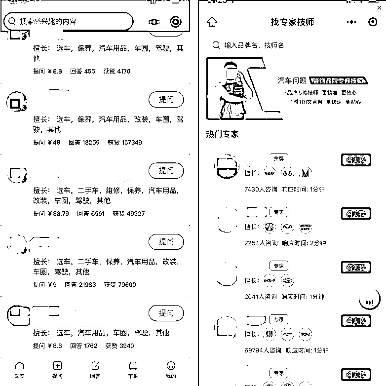
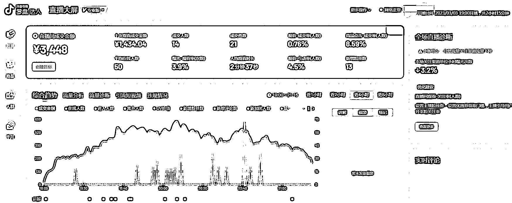
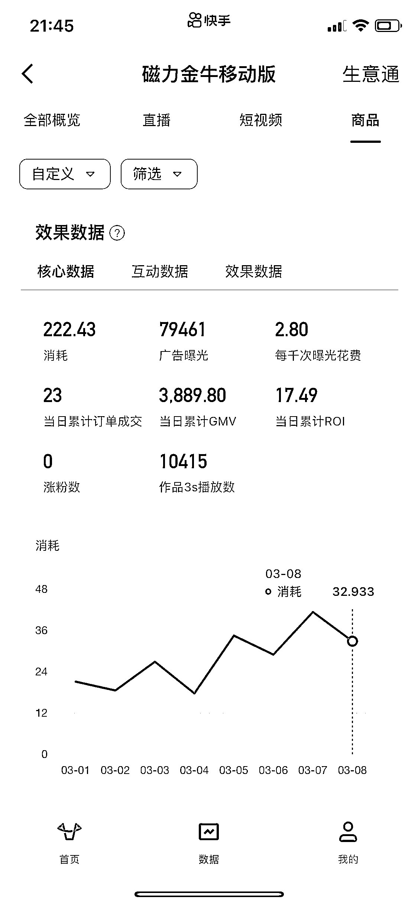
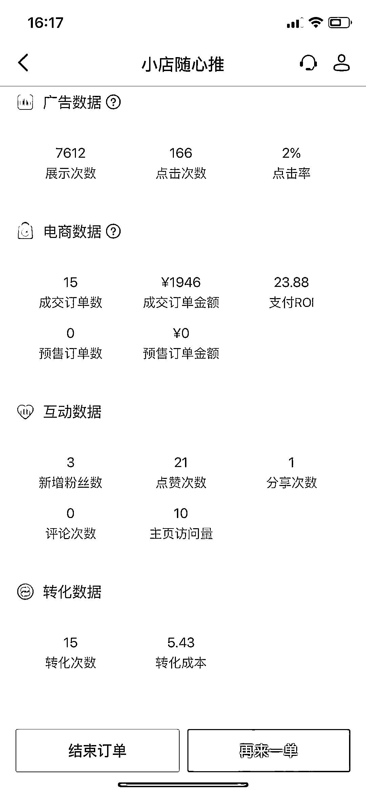

# 《小团队通过做矩阵短视频，卖汽车用品单月直接变现 10W+》

> 原文：[`www.yuque.com/for_lazy/thfiu8/eqoac02ygsyqmhk6`](https://www.yuque.com/for_lazy/thfiu8/eqoac02ygsyqmhk6)

<ne-h2 id="62d2b90a" data-lake-id="62d2b90a"><ne-heading-ext><ne-heading-anchor></ne-heading-anchor><ne-heading-fold></ne-heading-fold></ne-heading-ext><ne-heading-content><ne-text id="u559ff3fd">(32 赞)《小团队通过做矩阵短视频，卖汽车用品单月直接变现 10W+》</ne-text></ne-heading-content></ne-h2> <ne-p id="u7f778e3c" data-lake-id="u7f778e3c"><ne-text id="u5e98a7f6">作者： 米戈</ne-text></ne-p> <ne-p id="u2ce8b70d" data-lake-id="u2ce8b70d"><ne-text id="u623701b2">日期：2023-03-28</ne-text></ne-p> <ne-p id="u9ba8db8a" data-lake-id="u9ba8db8a"><ne-text id="u284b0814">我卖汽车卖不过人家，那我就转成卖燃油宝、轮胎，卖能够解决汽车疑难杂症的用品，是不是就更有机会。</ne-text></ne-p> <ne-p id="udd627410" data-lake-id="udd627410"><ne-text id="u8cb87e2b">你想一想车主会怎么去解决汽车漏气、掉漆等问题，在保修期内还好说，可以去 4S 店，过了保修期呢？是不是得购买这些产品替换？</ne-text></ne-p> <ne-p id="uf3ccbda0" data-lake-id="uf3ccbda0"><ne-text id="u1569be6a">我刚开始做汽车行业时入局晚，加上单单卖汽车的门槛很高，根本竞争不过头部达人，后来在大家都在卷汽车的时候，我带着小团队转型做解决汽车各种症状的业务，为用户提供能够替换的产品。</ne-text></ne-p> <ne-p id="uce989d57" data-lake-id="uce989d57"><ne-text id="u3ad406e8">我就发现这些产品利润非常高,，也很容易让用户多次复购，是一个很不错的市场，如果你做短视频进入瓶颈期时或者新人加入不知道怎么选择时，其实可以考虑考虑小类目的市场，会是一个新的赚钱赛道。</ne-text></ne-p> <ne-p id="uc64cbcab" data-lake-id="uc64cbcab"><ne-text id="u2148d876">各位圈友好，我是米戈，汽车自媒体创业者，账号主做用车类知识分享，抖音过百万粉丝，快手近百万粉丝，目前主要通过抖音和快手直播卖货。</ne-text></ne-p> <ne-p id="u4e929dd1" data-lake-id="u4e929dd1"><ne-text id="ud57e7f69">这次我结合账号运营的情况，分享下汽车类垂直细分小类目，三五人小团队模式，如何获取流量并逐步实现流量的自动供给，流量来了如何快速变现，并持续变现的经验和教训。</ne-text></ne-p> <ne-p id="u354eb59c" data-lake-id="u354eb59c"><ne-text id="ue6284fd4">具体目录如下：</ne-text></ne-p> <ne-p id="uf524cfc9" data-lake-id="uf524cfc9"><ne-text id="u8415c780">一、流量如何获取并实现自动供给</ne-text></ne-p> <ne-p id="u59ef1c54" data-lake-id="u59ef1c54"><ne-text id="u2175c697">二、如何变现：知识付费、卖货、其它</ne-text></ne-p> <ne-p id="u459da106" data-lake-id="u459da106"><ne-text id="u9f1dc7af">三、不主动推销如何做好私域</ne-text></ne-p> <ne-p id="u5bc42628" data-lake-id="u5bc42628"><ne-text id="u5c408f16">四、项目教训与建议</ne-text></ne-p> <ne-h1 id="614a3723" data-lake-id="614a3723"><ne-heading-ext><ne-heading-anchor></ne-heading-anchor><ne-heading-fold></ne-heading-fold></ne-heading-ext><ne-heading-content><ne-text id="ue3f2a446">一、如何获取流量：全网铺内容，实现流量自动供给</ne-text></ne-heading-content></ne-h1> <ne-p id="u107b2b9d" data-lake-id="u107b2b9d"><ne-text id="ubd07c6eb" ne-bold="true">铺内容，到底要铺哪些内容？</ne-text></ne-p> <ne-p id="u1f5a1108" data-lake-id="u1f5a1108"><ne-text id="u5860facc">这里就用了一招：</ne-text><ne-text id="u7a33d08f" ne-bold="true">围绕产品做内容！</ne-text></ne-p> <ne-p id="u72596ff0" data-lake-id="u72596ff0"><ne-text id="u1baf4698">咱就卖燃油宝的，重点就围绕燃油宝能解决啥问题来做内容，把燃油宝能解决的车辆症状，也是车主普遍关心的。</ne-text></ne-p> <ne-p id="uf3d38c4b" data-lake-id="uf3d38c4b"><ne-text id="u2c215962">比如油耗高、抖动、烧机油、尾气超标等，全部整理成话题，以汽修专家解疑答惑的方式拍摄视频，全年不断围绕</ne-text></ne-p> <ne-p id="ubf77c3be" data-lake-id="ubf77c3be"><ne-text id="u11ec455a">这些话题生产内容。</ne-text></ne-p> <ne-p id="u3dd3fc2a" data-lake-id="u3dd3fc2a"><ne-text id="uf266ea47">此处以刘团长的视频作为案例，燃油宝清积碳，这种实景拍摄效果更好。</ne-text></ne-p> <ne-p id="u37383eee" data-lake-id="u37383eee"><ne-card data-card-name="image" data-card-type="inline" id="rwdBd" data-event-boundary="card">  <ne-p id="u0fa247c4" data-lake-id="u0fa247c4"><ne-text id="u04f2dded">小团队运作，内容形式咱就秉承一切从简，数量大于质量的原则，把内容复用做到最大化，混剪为主，实拍为辅，</ne-text></ne-p> <ne-p id="uc9b6a693" data-lake-id="uc9b6a693"><ne-text id="u3c15f825">内容不够，直播切片来凑。</ne-text></ne-p> <ne-p id="uce62ca22" data-lake-id="uce62ca22"><ne-text id="u0c5d08a0" ne-bold="true">有了内容，铺到哪里有效果？</ne-text></ne-p> <ne-p id="u006bc21c" data-lake-id="u006bc21c"><ne-text id="ud5b0d5fe">能发布的地方都先试试，哪里引流效果好，最后就重点运营哪里。</ne-text></ne-p> <ne-p id="u5b4af531" data-lake-id="u5b4af531"><ne-text id="u47d89a0b">懂车帝、汽车之家、易车、爱卡、太平洋、车友头条、汽车头条、今日头条、抖音、火山、快手、秒拍、腾讯、优酷、UC 大鱼号、爱奇艺、凤凰网、一点资讯、趣头条、知乎、百度、搜狐、新浪、搜狗、网易、A 站、B 站、公众号、视频号等渠道都发布下，量大出奇迹。</ne-text></ne-p> <ne-p id="uaabd4926" data-lake-id="uaabd4926"><ne-text id="u02b4fda4">至今各个平台累计发布了 10000+ 部作品，对比来看还是</ne-text><ne-text id="ue5ff71b1" ne-bold="true">抖音和快手流量最香。</ne-text></ne-p> <ne-p id="u0ff9dca9" data-lake-id="u0ff9dca9"><ne-text id="u8a605aab">找到适合内容的最优平台</ne-text><ne-text id="u2824f2ff" ne-bold="true">，</ne-text><ne-text id="u948d9e5d">就重点运营这些平台，持续不断的发布内容，就能够逐步实现流量自动供给。</ne-text></ne-p> <ne-h1 id="18872446" data-lake-id="18872446"><ne-heading-ext><ne-heading-anchor></ne-heading-anchor><ne-heading-fold></ne-heading-fold></ne-heading-ext><ne-heading-content><ne-text id="u5a9a4a8e">二、如何变现：知识付费、卖货、其它</ne-text></ne-heading-content></ne-h1> <ne-p id="u259bf644" data-lake-id="u259bf644"><ne-text id="u66beb7f6">流量来了，如何变现？</ne-text></ne-p> <ne-p id="u28154367" data-lake-id="u28154367"><ne-text id="ucb77171b" ne-bold="true">同行就是最好的老师</ne-text><ne-text id="ua91c6659">，模仿学习！</ne-text></ne-p> <ne-h2 id="46783323" data-lake-id="46783323"><ne-heading-ext><ne-heading-anchor></ne-heading-anchor><ne-heading-fold></ne-heading-fold></ne-heading-ext><ne-heading-content><ne-text id="uef72cc35">（1）知识付费</ne-text></ne-heading-content></ne-h2> <ne-p id="u4bf6e213" data-lake-id="u4bf6e213"><ne-text id="uc0c618d0">天干三年，饿不死手艺人。</ne-text></ne-p> <ne-p id="ue36b1712" data-lake-id="ue36b1712"><ne-text id="uf2a5d23b">有手艺，培训要搞起来！</ne-text></ne-p> <ne-p id="u4c537d8a" data-lake-id="u4c537d8a"><ne-text id="ud3c4abdd">从抖音或者快手搜索：烧机油、镗缸、电喷、二手车等与汽车行业相关的关键词，都有人在做培训。</ne-text></ne-p> <ne-p id="u70843a31" data-lake-id="u70843a31"><ne-card data-card-name="image" data-card-type="inline" id="I9qVW" data-event-boundary="card">  <ne-p id="u33f6e768" data-lake-id="u33f6e768"><ne-text id="u26bbeb47">以视频中电喷账号为例，常年招募学员，线下开课，同时卖解码器等维修设备，月营业额能做到 100W+（根据线下设备代理商提供数据推测）。</ne-text></ne-p> <ne-p id="u247c5825" data-lake-id="u247c5825"><ne-text id="u9fc32a75">如果这类培训做不了，可以做相对简单的付费问答、付费诊断修车，入驻</ne-text><ne-text id="ub8da8710" ne-bold="true" ne-italic="true">大家车问、汽车大师</ne-text> <ne-text id="u56e9c3ff">这类平台，利用行业专业知识和技术，为付费用户及时提供服务。</ne-text></ne-p> <ne-p id="u9d48e71f" data-lake-id="u9d48e71f"><ne-card data-card-name="image" data-card-type="inline" id="y1kun" data-event-boundary="card">  <ne-h2 id="04f00db3" data-lake-id="04f00db3"><ne-heading-ext><ne-heading-anchor></ne-heading-anchor><ne-heading-fold></ne-heading-fold></ne-heading-ext><ne-heading-content><ne-text id="ua762a185">（2）卖货</ne-text></ne-heading-content></ne-h2> <ne-p id="u86f26616" data-lake-id="u86f26616"><ne-text id="u122453ce">IP 已成，卖货不停~~</ne-text></ne-p> <ne-p id="uc62e750f" data-lake-id="uc62e750f"><ne-text id="uc72c6229" ne-bold="true">抖音、快手两个平台同步直播。</ne-text></ne-p> <ne-p id="u2a742437" data-lake-id="u2a742437"><ne-text id="u6976d295">直接开播，是否有流量？</ne-text></ne-p> <ne-p id="u74a23684" data-lake-id="u74a23684"><ne-text id="ufb0326ad">前期围绕产品已经铺了足够的内容，车子有问题的车友，看到视频进入直播间，开播就会有流量，客户精准度也有保证，剩下的就是重点转化。</ne-text></ne-p> <ne-p id="u59e081de" data-lake-id="u59e081de"><ne-text id="ub98c415b">目前我们的做法就是，直播间一对一连麦，为咨询问题的车友，提供免费诊断；</ne-text></ne-p> <ne-p id="u22427b82" data-lake-id="u22427b82"><ne-text id="ua9f28f62">遇到咱上面说的，车子如果出现了油耗高、抖动等症状的，这类客户就是我们的精准客户，需要做重点做转化，针对性的推荐小黄车里面的自营产品。</ne-text></ne-p> <ne-p id="u8f05a93c" data-lake-id="u8f05a93c"><ne-text id="u5d6b2f19">这里选了抖音和快手同一天的直播数据，供各位圈友参考。</ne-text></ne-p> <ne-p id="u3318b532" data-lake-id="u3318b532"><ne-card data-card-name="image" data-card-type="inline" id="g5ugl" data-event-boundary="card">  <ne-p id="u396d2fd5" data-lake-id="u396d2fd5"><ne-card data-card-name="image" data-card-type="inline" id="NV762" data-event-boundary="card">  <ne-p id="u73bce8dd" data-lake-id="u73bce8dd"><ne-text id="u0a629ec9">面对大量用户群体，一对一连麦的方式，效率还是比较低，那如何在现有的条件下，进一步提高收益？</ne-text></ne-p> <ne-p id="uc42a28de" data-lake-id="uc42a28de"><ne-text id="u3e3418f0" ne-bold="true">做无人直播和短视频带货，实现自动赚钱</ne-text><ne-text id="u69b8e5c3">。</ne-text></ne-p> <ne-p id="ucf8d79d6" data-lake-id="ucf8d79d6"><ne-text id="u2865cb12" ne-bold="true">无人直播：</ne-text><ne-text id="u70afd34a">我们每天基本都会真人直播，素材不缺，把直播回放作为无人直播的视频素材，播放 2 个小时左右也能</ne-text></ne-p> <ne-p id="uf0c7d2ae" data-lake-id="uf0c7d2ae"><ne-text id="ud45e2140">达到正常直播的效果。</ne-text></ne-p> <ne-p id="u7a477831" data-lake-id="u7a477831"><ne-text id="u2502e0ff">真人直播是连麦方式，开展无人直播时记得关掉连麦，人进来就只让他负责听就行，一样会主动下单购买。</ne-text></ne-p> <ne-p id="u37e95ee3" data-lake-id="u37e95ee3"><ne-text id="u656c93e9">目前这么操作还没有收到过违规通知。</ne-text></ne-p> <ne-p id="ua4c5b299" data-lake-id="ua4c5b299"><ne-text id="u53b559af" ne-bold="true">短视频带货：</ne-text><ne-text id="u6450359a">自营产品的，把直播回放，稍加处理，每天发布用来带货；</ne-text></ne-p> <ne-p id="u9ede309e" data-lake-id="u9ede309e"><ne-text id="u17203e92">合作产品的，哪个视频带货数据好，就参考哪个，1:1 复制拍摄，一次拍摄，反复混剪。</ne-text></ne-p> <ne-p id="u5cf6fd94" data-lake-id="u5cf6fd94"><ne-text id="ua51ec3eb">抖音精选联盟和快手快分销中的汽车用品，一般都会给到 40% 以上的佣金，如果没有自营产品，就找这种合作产品一件代发，自己专心做内容就可以。</ne-text></ne-p> <ne-p id="u085ac63c" data-lake-id="u085ac63c"><ne-card data-card-name="image" data-card-type="inline" id="w9qTU" data-event-boundary="card">  <ne-p id="ufd9b94de" data-lake-id="ufd9b94de"><ne-text id="udd115a77">能付费推广的产品就重点做，小店随心推、千川、磁力金牛都用上，持续付费推广，即使打不爆，也能持续带来收益。</ne-text></ne-p> <ne-p id="uc20c6e7d" data-lake-id="uc20c6e7d"><ne-card data-card-name="image" data-card-type="inline" id="XrnUl" data-event-boundary="card">  <ne-p id="ud0736497" data-lake-id="ud0736497"><ne-card data-card-name="image" data-card-type="inline" id="EFYVN" data-event-boundary="card">  <ne-h2 id="5cb85a1a" data-lake-id="5cb85a1a"><ne-heading-ext><ne-heading-anchor></ne-heading-anchor><ne-heading-fold></ne-heading-fold></ne-heading-ext><ne-heading-content><ne-text id="ub66860a4">（3）其它</ne-text></ne-heading-content></ne-h2> <ne-p id="ua53b2571" data-lake-id="ua53b2571"><ne-text id="u6d9ac0b7">汽车行业，没有资源，就尽量做大粉丝体量；有体量，就不会缺广告。</ne-text></ne-p> <ne-p id="ucfc482a5" data-lake-id="ucfc482a5"><ne-text id="u1cdaec01">靠广告变现就是多、快、好、省的一种方式，汽车广告单价相对也高，巴适得很。</ne-text></ne-p> <ne-p id="u221e54f7" data-lake-id="u221e54f7"><ne-text id="uc362881d">跨入百万粉丝体量，后台谈合作的就会多起来；有汽车品牌投放广告的，有汽车用品合作推广的......</ne-text></ne-p> <ne-p id="u8f293aff" data-lake-id="u8f293aff"><ne-text id="u510dd587">除了广告，靠平台福利，遇到合适机会，有时也能狠狠撸一波。</ne-text></ne-p> <ne-p id="uad982e59" data-lake-id="uad982e59"><ne-text id="u675f1407">以头条系为例，当年刚推出 PICK 计划时，传 1 部视频就给 100 元；直播推广懂车帝 APP，新车线索可得 XX 元；中视频、问答、文章、付费专栏、图文或者视频带货、</ne-text></ne-p> <ne-p id="ubf6277d6" data-lake-id="ubf6277d6"><ne-text id="uacf683da">微头条......</ne-text></ne-p> <ne-p id="ubc1f7eba" data-lake-id="ubc1f7eba"><ne-text id="ueb82310f">之前圈友分享风向标时，其中提到过山水重庆这个头条号，这类账号的佼佼者山东也有一个；</ne-text></ne-p> <ne-p id="ue9e04470" data-lake-id="ue9e04470"><ne-text id="u173e6dda">这里就不说账号了，也是全平台发山水重庆的这类文章，一天至少发布七八条，每年各种变现超 1000 万以上。</ne-text></ne-p> <ne-p id="u08165a52" data-lake-id="u08165a52"><ne-text id="u0f76d944">有收益的地方深入进去，总能发现生财的快乐~~</ne-text></ne-p> <ne-p id="u0393411a" data-lake-id="u0393411a"><ne-text id="u41c56b7c">这里用我后台收益数据供大家参考，友情提示：该收益不代表现在的收益情况。</ne-text></ne-p> <ne-p id="u6b2756c9" data-lake-id="u6b2756c9"><ne-card data-card-name="image" data-card-type="inline" id="JnwkL" data-event-boundary="card">  <ne-h1 id="91ad8931" data-lake-id="91ad8931"><ne-heading-ext><ne-heading-anchor></ne-heading-anchor><ne-heading-fold></ne-heading-fold></ne-heading-ext><ne-heading-content><ne-text id="ucb6903be">三、私域运营和代理分销</ne-text></ne-heading-content></ne-h1> <ne-h2 id="1c245853" data-lake-id="1c245853"><ne-heading-ext><ne-heading-anchor></ne-heading-anchor><ne-heading-fold></ne-heading-fold></ne-heading-ext><ne-heading-content><ne-text id="u3154494c">（1）私域运营</ne-text></ne-heading-content></ne-h2> <ne-p id="u7e9f975e" data-lake-id="u7e9f975e"><ne-text id="u3ac290d8" ne-bold="true">重点做好朋友圈的运营；</ne-text></ne-p> <ne-p id="u8cb730ad" data-lake-id="u8cb730ad"><ne-text id="u1a615dd2">通过短视频和直播，吸引车友关注加微信之后，通过朋友圈从早到晚地宣传产品和活动；</ne-text></ne-p> <ne-p id="uc727d8b4" data-lake-id="uc727d8b4"><ne-text id="u213a3929">用其它车友的订单评价和真实反馈，做好价值勾引。</ne-text></ne-p> <ne-p id="u002ccf36" data-lake-id="u002ccf36"><ne-text id="u1571a02d">不做主动推销，让用户自己决定买不买。一旦买了体验了，都是老司机，立马试车感觉不错，大多都会成为高</ne-text></ne-p> <ne-p id="uda4706ba" data-lake-id="uda4706ba"><ne-text id="u9252a92a">粘性高复购用户。</ne-text></ne-p> <ne-p id="ucf15c89f" data-lake-id="ucf15c89f"><ne-card data-card-name="image" data-card-type="inline" id="aZ5do" data-event-boundary="card">  <ne-h2 id="e3e6c115" data-lake-id="e3e6c115"><ne-heading-ext><ne-heading-anchor></ne-heading-anchor><ne-heading-fold></ne-heading-fold></ne-heading-ext><ne-heading-content><ne-text id="uefc10a64">（2）代理分销</ne-text></ne-heading-content></ne-h2> <ne-p id="u582f0a5a" data-lake-id="u582f0a5a"><ne-text id="u8772f9fe" ne-bold="true">用好一招：自用省钱，分享赚钱！</ne-text></ne-p> <ne-p id="u887effd6" data-lake-id="u887effd6"><ne-text id="ucafce32c">产品好、利润足，借助有赞分销员和分销商功能，构建代理分销体系，和更多人一起做好服务和变现。</ne-text></ne-p> <ne-p id="u54e017ab" data-lake-id="u54e017ab"><ne-card data-card-name="image" data-card-type="inline" id="QNH3w" data-event-boundary="card">  <ne-h1 id="f741e3da" data-lake-id="f741e3da"><ne-heading-ext><ne-heading-anchor></ne-heading-anchor><ne-heading-fold></ne-heading-fold></ne-heading-ext><ne-heading-content><ne-text id="u89d26649">四、项目教训和建议</ne-text></ne-heading-content></ne-h1> <ne-p id="u55138300" data-lake-id="u55138300"><ne-text id="u37dbd96e">切入细分领域，选择有积累性的项目，这套流程操作下来，不需要过多的人力，也可以做到半自动赚钱的程度。</ne-text></ne-p> <ne-p id="u54578782" data-lake-id="u54578782"><ne-text id="uc27157a8">但依然还是没有逐步放大到想要的水平，向上突破就成了难题。</ne-text></ne-p> <ne-p id="uf6458241" data-lake-id="uf6458241"><ne-text id="u1b7e74f2">机油、清洗剂这类汽车产品有一定的特殊性，虽然利润高，复购率也高，但是有些平台难以付费推广，就很难快速放大。</ne-text></ne-p> <ne-p id="u993c3c86" data-lake-id="u993c3c86"><ne-text id="uf2fad33b">最后还是回到了选品的重要性，选择高粘性、高复购、高利润产品，自播的同时，发展更多达人带播，借助付费流</ne-text></ne-p> <ne-p id="ue87df65b" data-lake-id="ue87df65b"><ne-text id="ua571dc7e">量来放大，线下有汽修厂的，结合本地生活服务，会达到更高的收益水平。</ne-text></ne-p> <ne-p id="uc4579f2b" data-lake-id="uc4579f2b"><ne-text id="u44c0968e">最后给大家来个参考账号：小阿兰修车，邻家修车小妹，贴心微笑服务；</ne-text></ne-p> <ne-p id="u54fa2c4e" data-lake-id="u54fa2c4e"><ne-text id="u4084a406">内容产出形式流量好，内容复用持续爆款，带货能力十分强悍，不愁流量和变现；</ne-text></ne-p> <ne-p id="u32cee730" data-lake-id="u32cee730"><ne-text id="u1d9e8017">每天一群老爷们，夜夜围着直播间，有事没事跑到小妹汽修厂，给车子来个大保养~~</ne-text></ne-p> <ne-hole id="u99d64888" data-lake-id="u99d64888"><ne-card data-card-name="hr" data-card-type="block" id="ITWMx" data-event-boundary="card"><ne-p id="ufe2d60d9" data-lake-id="ufe2d60d9"><ne-text id="u4df15ee9">评论区：</ne-text></ne-p> <ne-p id="u594a71eb" data-lake-id="u594a71eb"><ne-text id="u7ddf47f1">雨林 : 写的好，有几个问题请教，咋联系呢</ne-text> <ne-text id="u2557cde5">浅念临风（济南） : 活塞环释放剂  除碳剂高利润产品</ne-text> <ne-text id="u17a072cf">A 孟世扬 : 我是做汽修行业的[微笑]</ne-text> <ne-text id="u9401bc1e">Jia : 写的真好</ne-text> <ne-text id="ub286adb3">小谢先生 : 我是开汽美店的，想开始做抖音了</ne-text></ne-p></ne-card></ne-hole></ne-card></ne-p></ne-card></ne-p></ne-card></ne-p></ne-card></ne-p></ne-card></ne-p></ne-card></ne-p></ne-card></ne-p></ne-card></ne-p></ne-card></ne-p></ne-card></ne-p></ne-card></ne-p>