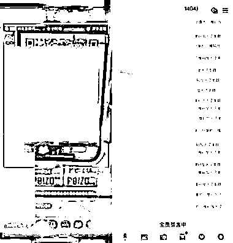

# 《抖音直播引流私域的 6 个方法》

> 原文：[`www.yuque.com/for_lazy/thfiu8/dg48edfgp672z0e8`](https://www.yuque.com/for_lazy/thfiu8/dg48edfgp672z0e8)

<ne-h2 id="269e58dd" data-lake-id="269e58dd"><ne-heading-ext><ne-heading-anchor></ne-heading-anchor><ne-heading-fold></ne-heading-fold></ne-heading-ext><ne-heading-content><ne-text id="u19bcb7b3">(41 赞)《抖音直播引流私域的 6 个方法》</ne-text></ne-heading-content></ne-h2> <ne-p id="u1a2d3d12" data-lake-id="u1a2d3d12"><ne-text id="uc6684374">作者： 大宝~</ne-text></ne-p> <ne-p id="u720b5270" data-lake-id="u720b5270"><ne-text id="u3f18c1d6">日期：2023-03-28</ne-text></ne-p> <ne-p id="u188c03a1" data-lake-id="u188c03a1"><ne-text id="u81fc16b5">【抖音直播引流私域的 6 个方法】——宝哥</ne-text></ne-p> <ne-p id="u987d4291" data-lake-id="u987d4291"><ne-text id="u776b144b">方法 1：一键跳转卡片引流</ne-text> <ne-text id="uca7cf3f1">方法 2：微信群引流</ne-text> <ne-text id="uc2b1e5e7">方法 3：卖课程引流</ne-text> <ne-text id="uc1596f68">方法 4：直播间展示二维码引流</ne-text> <ne-text id="u8d731daa">方法 5：小风车挂载引流</ne-text> <ne-text id="u2578365e">方法 6：客服私信引流</ne-text></ne-p> <ne-p id="u5135e9c4" data-lake-id="u5135e9c4"><ne-text id="u6b5da94e">查看全文请移步【腾讯文档】</ne-text> [<ne-text id="ubd708ab8">https://docs.qq.com/doc/DRFpGbnBtY3dVSFRz</ne-text>](https://docs.qq.com/doc/DRFpGbnBtY3dVSFRz)<ne-card data-card-name="image" data-card-type="inline" id="Gv7bW" data-event-boundary="card">  <ne-p id="udc8ef199" data-lake-id="udc8ef199"><ne-card data-card-name="image" data-card-type="inline" id="sUPuW" data-event-boundary="card">  <ne-hole id="u788196b5" data-lake-id="u788196b5"><ne-card data-card-name="hr" data-card-type="block" id="Tjk7l" data-event-boundary="card"><ne-p id="ue388ea17" data-lake-id="ue388ea17"><ne-text id="u50f118a2">评论区：</ne-text></ne-p> <ne-p id="u60309cef" data-lake-id="u60309cef"><ne-text id="u9c925a16">暂无评论</ne-text></ne-p></ne-card></ne-hole></ne-card></ne-p></ne-card></ne-p>