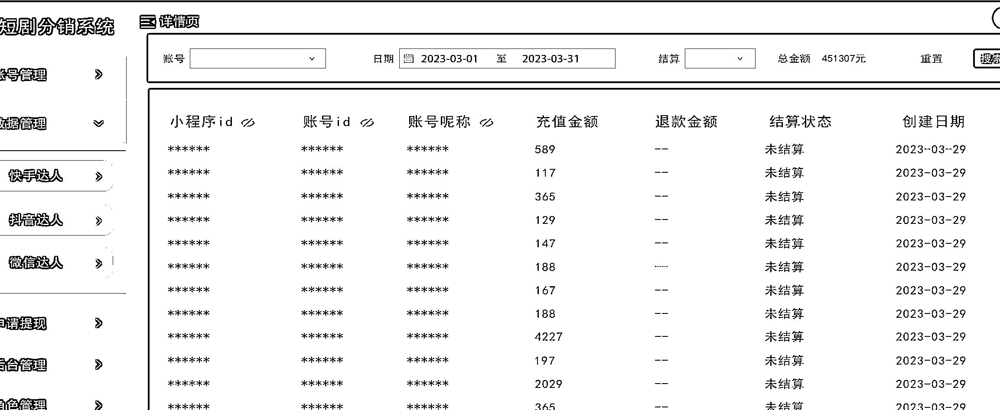
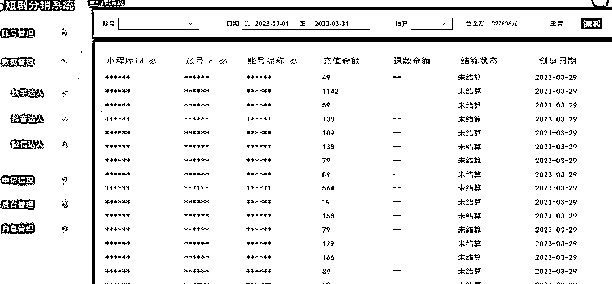

# 《聊一聊短剧的发展》

> 原文：[`www.yuque.com/for_lazy/thfiu8/gg1s0vt2mch92nph`](https://www.yuque.com/for_lazy/thfiu8/gg1s0vt2mch92nph)

<ne-h2 id="1d08cd98" data-lake-id="1d08cd98"><ne-heading-ext><ne-heading-anchor></ne-heading-anchor><ne-heading-fold></ne-heading-fold></ne-heading-ext><ne-heading-content><ne-text id="u56ee4ff9">(92 赞)《聊一聊短剧的发展》</ne-text></ne-heading-content></ne-h2> <ne-p id="uf4dbe3a0" data-lake-id="uf4dbe3a0"><ne-text id="u66226daa">作者： 晓飞</ne-text></ne-p> <ne-p id="u19e0cf0a" data-lake-id="u19e0cf0a"><ne-text id="u3543c133">日期：2023-03-29</ne-text></ne-p> <ne-p id="ud53bf58e" data-lake-id="ud53bf58e"><ne-text id="u4af69cc6">一个月了，再来聊聊短剧，随手写的</ne-text> <ne-text id="uc037a834">短剧</ne-text> <ne-text id="u95be5da9">之前发过两次短剧的帖子，然后自己开始干了 39 天。截止今天发帖</ne-text> <ne-text id="ud945acb9">电脑卡死，pr 软件正在渲染视频，舍不得重启，趁着今天在家空闲发个帖子[偷笑]</ne-text> <ne-text id="u82ded2c4">先算账：前期支出费用</ne-text> <ne-text id="ubddf65e9">1.二手手机：华为 mate20 6+64 450 元*60 个，27000 元[微笑]</ne-text></ne-p> <ne-p id="u25fca1ba" data-lake-id="u25fca1ba"><ne-text id="ufd520ada">2.学生兼职：底薪+视频条数 1 元/条+提成 5-10%  底薪一个月是 1000/人，</ne-text> <ne-text id="u9fe05786">30 个人 3 万块钱这个基本上费用！然后条数那个跟分成是结账后另外计算的！[微笑]</ne-text></ne-p> <ne-p id="ufa14c36c" data-lake-id="ufa14c36c"><ne-text id="u1a0f29db">这个费用一开始，一直改，最后才确定稳定下来，因为这个一开始困难重重！很多无法想象不到的难题！</ne-text></ne-p> <ne-p id="ue9b4205d" data-lake-id="ue9b4205d"><ne-text id="u02ef8fd8">3.手机卡：300 张卡，月租 5 块钱，就电信和联通的，卡里面还得充值 30 块钱，这个成本 45000 元</ne-text></ne-p> <ne-p id="ue9e848fb" data-lake-id="ue9e848fb"><ne-text id="ufbb66561">这一下子就花了 102000 元，我跟我朋友一起合作的！[微笑]</ne-text></ne-p> <ne-p id="uc8cdd6ca" data-lake-id="uc8cdd6ca"><ne-text id="ud597fd83">我们当时的想法跟真正实施推进的时候，很多事情就不一样了！</ne-text></ne-p> <ne-p id="u23ef6c42" data-lake-id="u23ef6c42"><ne-text id="ud04165e6">主要原因就是：短剧前期收益不稳定，运气成分太高，而且很容易劝退。</ne-text> <ne-text id="uc3b5d82e">数据平台原因集中两点：</ne-text> <ne-text id="ufbc1820d">1.播放量高的，充值不一定高</ne-text> <ne-text id="ucc8d8886">2.直接搬运的，抖音快手限流，封号，有点废号</ne-text> <ne-text id="uf2b72a25">3.很难洗原创，那种 ai 自动剪辑软件搞这个视频很难。爆款模板抄袭搬运根本就是运气成分。</ne-text></ne-p> <ne-p id="u5f445911" data-lake-id="u5f445911"><ne-text id="ubdf967b9">在一开始，我们在学校，我跟我朋友，还有学校的一个老师，社团社长，一开始是把影视后期专业的学生，都推广下，愿意来做就做，结果从 200 多人，最后剩下 60 多人，在到目前稳定 30 人，</ne-text></ne-p> <ne-p id="ud0e569e6" data-lake-id="ud0e569e6"><ne-text id="ue5606e07">我们从一开始按分成---到按条---到底薪---底薪条数分成三个一起。</ne-text> <ne-text id="u15a7e560">为什么会这么折腾了，两点：管理问题和收益问题，这个就不写了！很复杂！</ne-text></ne-p> <ne-p id="u7a7761a4" data-lake-id="u7a7761a4"><ne-text id="u72e86963">一开始我跟其他招代理，没啥区别，我只是招的学生代理，可能底薪给点，提成少点，有点要求而已！但是这个收益很不乐观！而且账号这个很难批量！</ne-text></ne-p> <ne-p id="u4cd727cc" data-lake-id="u4cd727cc"><ne-text id="u47bd92f9">你看别人招代理，只要代理赚钱了，他就赚钱，分成很低，而且数据他自己掌控，给你他自己的后台展示！</ne-text> <ne-text id="u5b028baa">这里面可操作空间就很大！</ne-text> <ne-text id="ud51c14c4">1.充值流水跟分成有信息差，对于代理来讲</ne-text> <ne-text id="u5e540540">2.代理赚不赚钱，反正他不亏钱，可以一直拉新人，补充新鲜血液。</ne-text> <ne-text id="u1fb38b31">3.一个代理赚钱，他就可以赚更多钱！他也没有其他成本，最多社群发点资料，偶尔管理，开直播讲解下！搞定活动！（熊猫短剧活动力度是最大的，我加了四个同行这种群，来对比）</ne-text></ne-p> <ne-p id="ud554becd" data-lake-id="ud554becd"><ne-text id="ub1633185">其实抖音快手在三月就把短剧开放到全部达人，就是你注册新号也能接到短剧 cps 推广</ne-text></ne-p> <ne-p id="u1e3e1b7d" data-lake-id="u1e3e1b7d"><ne-text id="u8c8f405c">比如：容量的剧：来看剧场，快手直接分成 70%，没有任何服务费</ne-text> <ne-text id="uf136f50a">九州的剧是 60%，快手直接分成，</ne-text> <ne-text id="u88fb46e0">还有其他平台的剧，反正都可以看到！</ne-text> <ne-text id="u5a92b0a0">抖音上是九州的 26%，如果是星图去看是 60%-80%</ne-text> <ne-text id="u1b38c2ba">这些新号都可以接到这种任务了，如果没有那就等等或者找客服开下，有指引的</ne-text></ne-p> <ne-p id="u7dd2937e" data-lake-id="u7dd2937e"><ne-text id="ue073e99c">本来这个帖子下午电脑卡了，随手写的，后来忙啥就没有继续写了，现在吃饭，刚刚看到星球弹窗信息，就先发了，头绪有点乱，后续在整理！</ne-text></ne-p> <ne-p id="u2b7f2027" data-lake-id="u2b7f2027"><ne-text id="ub20ce666">只能先总结下，我 300 来个号，目前抖音充值流水有 45 万，快手充值流水有 32 万，然后抖音 75%分成到手 33 万多，快手 90%分成 30 万多，也就是差不多干一个月赚 60 万，300 号，其实中途还浪费了很多号！因为这个影视专业班有 9 个年级，每个年级差不多五六十人，结果都是做着做着就散了！然后这 300 个号就是我自己出钱搞手机，手机卡，然后跟在做的学生一起批量做号！</ne-text> <ne-text id="ue468f5dc">目前大概是赚 60 万，但是这个是 5-10 号结算。</ne-text> <ne-text id="ue837850c">其实学生动手能力还是很厉害的！比如这个系统管理后台就是学生给做的，因为他们觉得好管理！</ne-text></ne-p> <ne-p id="u45a3b511" data-lake-id="u45a3b511"><ne-text id="ub093ab55">感觉这种有产教结合的资源学校还是可以做的！</ne-text> <ne-text id="u44774405">毕竟你剪辑短剧可以练习剪辑技巧，软件操作技巧效率，或者其他方面吧！</ne-text></ne-p> <ne-p id="ua3262ddb" data-lake-id="ua3262ddb"><ne-text id="u320a54c5">我算了下，这个赚的也是辛苦钱[流泪]</ne-text><ne-card data-card-name="image" data-card-type="inline" id="V9ntd" data-event-boundary="card">  <ne-p id="u73a724bf" data-lake-id="u73a724bf"><ne-card data-card-name="image" data-card-type="inline" id="eoy7b" data-event-boundary="card"></ne-card></ne-p> <ne-p id="u3c51e51a" data-lake-id="u3c51e51a"><ne-card data-card-name="image" data-card-type="inline" id="qdvLg" data-event-boundary="card">  <ne-p id="uc5c79130" data-lake-id="uc5c79130"><ne-card data-card-name="image" data-card-type="inline" id="xrFAP" data-event-boundary="card"></ne-card></ne-p> <ne-p id="u93c6e8f4" data-lake-id="u93c6e8f4"><ne-card data-card-name="image" data-card-type="inline" id="hKQF5" data-event-boundary="card">  <ne-hole id="u23deb1e4" data-lake-id="u23deb1e4"><ne-card data-card-name="hr" data-card-type="block" id="gYcsL" data-event-boundary="card"><ne-p id="u8cea071c" data-lake-id="u8cea071c"><ne-text id="u530875d5">评论区：</ne-text></ne-p> <ne-p id="ueccf88cd" data-lake-id="ueccf88cd"><ne-text id="ubb145a48">晓飞 : 这个帖子没有写好，我一两点钟那会，写的时候还脑子清晰知道怎么写来着，结果刚刚写就忘了！</ne-text></ne-p> <ne-p id="u71a2b1bb" data-lake-id="u71a2b1bb"><ne-text id="uc6f146ee">不过我最近跟生财圈友合作，重新测试另外一种方式，看能不能赚钱！反正目前这种是赚钱了，但是赚个辛苦钱！反正很累，没有我做影视工作室这活好！[偷笑]</ne-text> <ne-text id="ub9b9a518">晓飞 : 有时间我也写个干货技术含量高的，把我们自己做短剧整理的，总结的问题，全部整理写个帖子来！[呲牙]</ne-text> <ne-text id="u64d41b73">正宇 : 60 个手机，我曹。</ne-text> <ne-text id="u56aac571">晓飞 : 二手机，便宜，本来是圈友找的 600 多好手机没有要，就重庆这边捡的便宜货，坚持下</ne-text> <ne-text id="u264c5326">正宇 : 可以，27000+也不少了，哈哈哈</ne-text> <ne-text id="uac9f9221">苗小羊 : 大佬，学生兼职，这个底薪怎么算？按照条数？1000 一个月，必须一天剪辑够几条嘛？</ne-text> <ne-text id="u889625cd">Mr.炎 : 一个月 60W 是收入是吧？利润有多少？</ne-text> <ne-text id="u7d2e5b1f">晓飞 : 因为别个学生都说，他们自己在 b 站，闲鱼这些上面接个剪辑视频，游戏直播剪辑，一条都 10 块钱起步，没得法，然后就重新来商量，底薪 1 千，就是一开始他们提供的号，我这边不提供手机跟号，因为那个短剧是需要手机 APP 来发布的！所以这个是必须的，才有这个 1 千底薪原因！</ne-text> <ne-text id="uff7ae480">剩下就是你剪辑一条视频我给 1 块钱，按照我说的要求来，参考我视频来，这是普通合格视频，然后你的视频播放量爆了，这就是精品视频，按照 3 块钱一条计算！这个就很少但是给学生一个机会</ne-text> <ne-text id="u2835b310">如果有充值给 5-10%</ne-text> <ne-text id="uea6f1472">这个必须一天最少发一个合格视频给我上传你们的号，这就是前期我们的，一般就是后来不断根据实际情况调整，有些号学生就想直接赚分成</ne-text></ne-p></ne-card></ne-hole></ne-card></ne-p></ne-card></ne-p></ne-card></ne-p>