# 《通过爆款笔记数据分析，我在 7 天内把一个账号做到了 60% 的爆文率》

> 原文：[`www.yuque.com/for_lazy/thfiu8/rqvn5sznqfpl71iv`](https://www.yuque.com/for_lazy/thfiu8/rqvn5sznqfpl71iv)

## (210 赞)《通过爆款笔记数据分析，我在 7 天内把一个账号做到了 60% 的爆文率》 

作者： 韩北樱 

日期：2023-03-30 

做小红书不知道怎么产出爆款？花了很多精力拆解对标模仿却没有任何效果？好不容易小爆一篇流量却不稳定？面对这种情况我们应该怎么办？ 

其实想要做到更好的爆文效果很简单，就是利用内容数据工具找到对标爆款账号，分析爆文笔记的标题、内容、数据，找出能够爆文的共性然后进行模仿创作。 

我在小红书做过护肤、教育等多个赛道的账号运营，其中最成功的教育赛道在 7 天内发布 5 篇笔记，就有 3 篇达到千赞的爆款，这个过程一直都是借助工具进行爆款数据分析产出爆文的，下面我给大家讲讲我具体是怎么做的。 

目录如下： 

一、我是谁？ 

二、如何寻找爆款？ 

三、如何提高效率？ 

四、如何使用灰豚数据？ 

五、我的起号过程复盘 

六、反思与进一步优化 

接下来的分享，对小红书来说，无论是涨粉、引流或者是打造个人 IP 都有一定的参考价值，希望能够帮助到大家。 

# 一、我是谁？ 

大家好，我是北樱，在小红书做过情感、护肤、教育、资料引流赛道的各个账号的运营。 

其中最成功的就是教育赛道，最高达到了 60% 的爆文率，也就是说，最好的时候，发布 5 篇笔记，其中 3 篇都是千赞以上的爆款。 

# 二、如何寻找爆款？ 

这里推荐一个采集标题的工具：后羿采集器 

以#大学生 话题下的笔记标题为例，利用后羿采集器采集了 101 个#大学生 话题下的高赞笔记标题，通过对标题和赞数的归纳整理，我发现了很多相似点： 

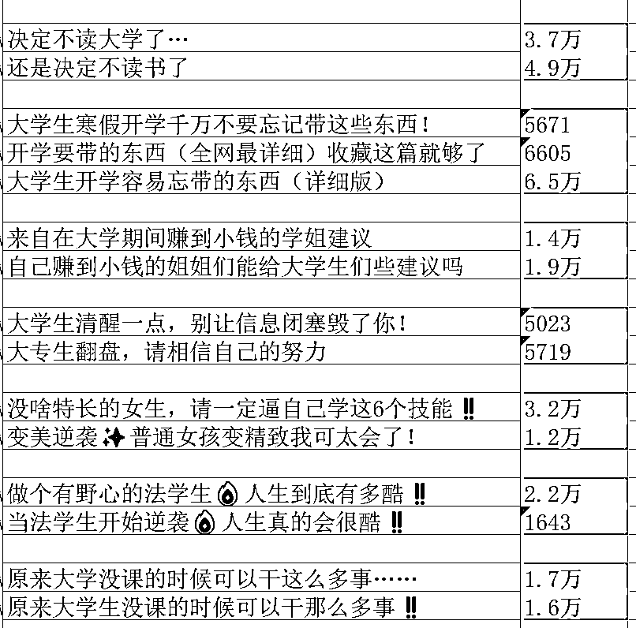  

  

如上图，很多爆款标题，换一种说法，甚至是换一个标点符号，都有可能继续成为下一个爆款。 

所以，对标爆款笔记是普通人做出成绩最好的捷径。 

而我也对这些标题进行了拆解，在这里举两个例子方便大家理解： 

① 大学生寒假开学千万不要忘记带这些东西！ 

主体：大学生 

事件：开学 

强调点：开学所需物资——换成常用说法：开学要准备的东西 

（这个“东西”怎么样？形容词：详细、贴心、必备、容易忘记、不能忘记、必须） 

所以这个标题我们可以改写成： 

大学生开学容易忘记的东西（贴心版）都在这里了 

即将开学的大学生要带到学校的东西（全网最详细版） 

大学生开学要带哪些东西收藏这篇就够了 

② 来自大学期间赚到小钱的学姐建议 

主体：大学生（建议是给大学生、学弟学妹的，而不是标题里的学姐） 

事件：大学期间赚钱 

强调点： 

小钱（大多数大学生只是需要赚点零花钱，这里的“小钱”可以替换为“零花钱”、“奶茶钱”、“经济独立”、“副业”） 

学姐建议（过来人的建议，这里的“建议”还可以替换为“忠告”、“劝告”、“超全方法”、“肺腑之言 ”等等） 

所以这个标题我们可以改写成： 

来自大学期间赚到小钱的学姐忠告（内附超全方法） 

大学空余时间学姐教你如何轻松赚奶茶钱 

建议你没课的时候这样赚零花钱（再也不用向父母伸手要了） 

在这里就不举例子了，大家可以根据自己的需要对一个标题进行拆解和重组。总结如下： 

主体：能够精准的获取流量，主体是大学生，那么点开笔记的 99% 都是大学生，受众精准用户就更容易对笔记做出点赞、评论、收藏的行为，有利于笔记数据提升并进入更大的流量池以及获得平台的推荐。 

在心理学上，有一个“自我参照效应”，意思是人们往往只会关注与自己有关的事情，把握住这一点其实选题大有可为。 

比如学生从横向上看，还有其他职业 老师、医生等，从纵向上看小学生可以分为中学生、大学生、大专生、研究生，从大学生中还可以分为大一、大二不同年级，其中还可以细分到某个专业的学生。 

所以想要获取精准流量，就一定要对自己的受众有清晰的判断。 

事件：事件可以有很多种类型，比如周期型的开学放暑假放寒假，节日、热点、季节，写“周一优秀的女大学生都在干什么”，周一写到周天，总而言之，事情那么多，总有我们可以写的。 

强调点：在事件里抓住一个关键点去写，并用形容词去修饰，这个形容词要能共情用户痛点、痒点、难点，比如图上的。 

那么如何使用后羿采集器呢？ 

文字版：后羿采集器（免费）下载地址：[https://www.houyicaiji.com/](https://www.houyicaiji.com) 

① 将收集的链接复制到采集器网址框中，然后点击智能采集。 

② 采集器会自动识别话题网页端，采集内容生成下列的表格。 

③ 我们点击标题链接列的任一链接（这里标题链接其实是用户主页链接，自动生成有时出现名称错误）。 

④ 点击后会自动跳转到二级主页页面采集，首先我们先点击清空所有，最后一步添加字段，按个添加需要采集用户的简介名称、标签、介绍、地址。 

⑤ 重点：采集导出 excel 表格形式后，对数据进行清晰，无关杂乱信息删掉可以整理到飞书表格，方便自己同步对标分析。 

图片版： 

① 找到对标笔记 

② 点击笔记正文末尾的话题 

  

③ 点击右上角的分享按钮，复制链接 

  

  

④ 将链接复制到后羿采集器进行数据采集并导出 

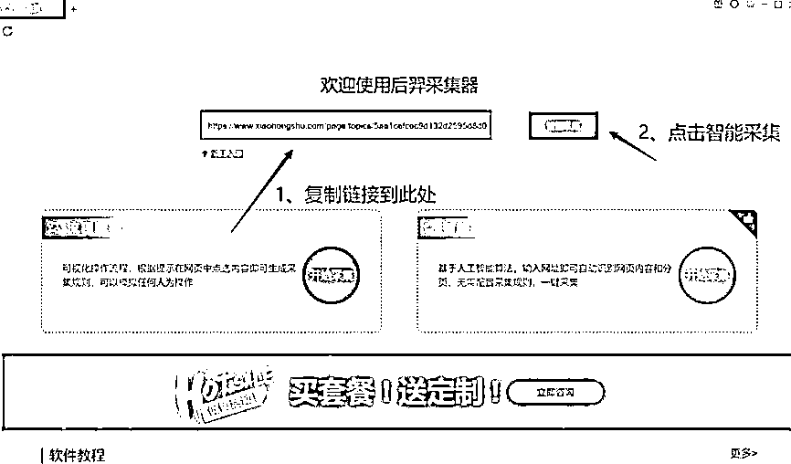  

  

  

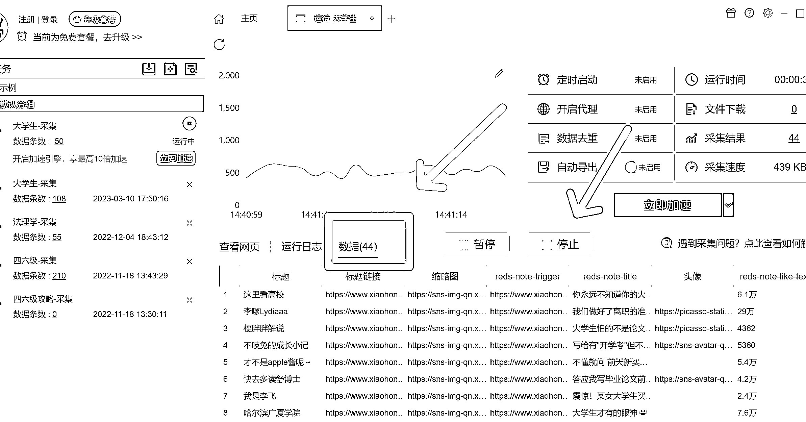  

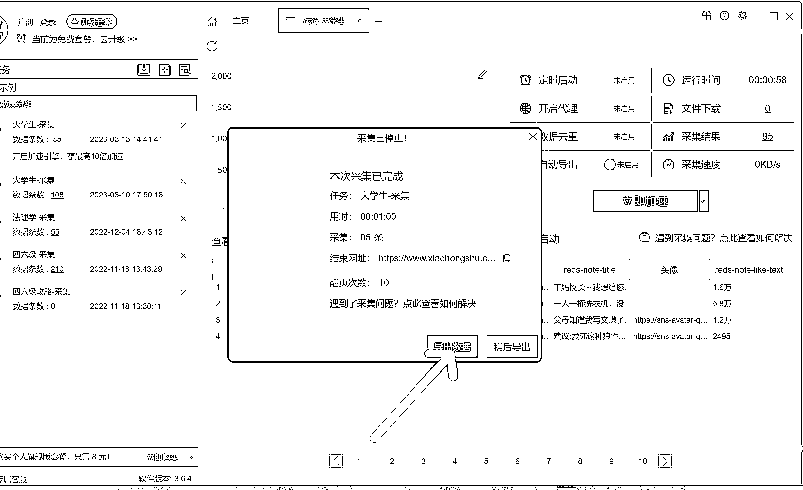  

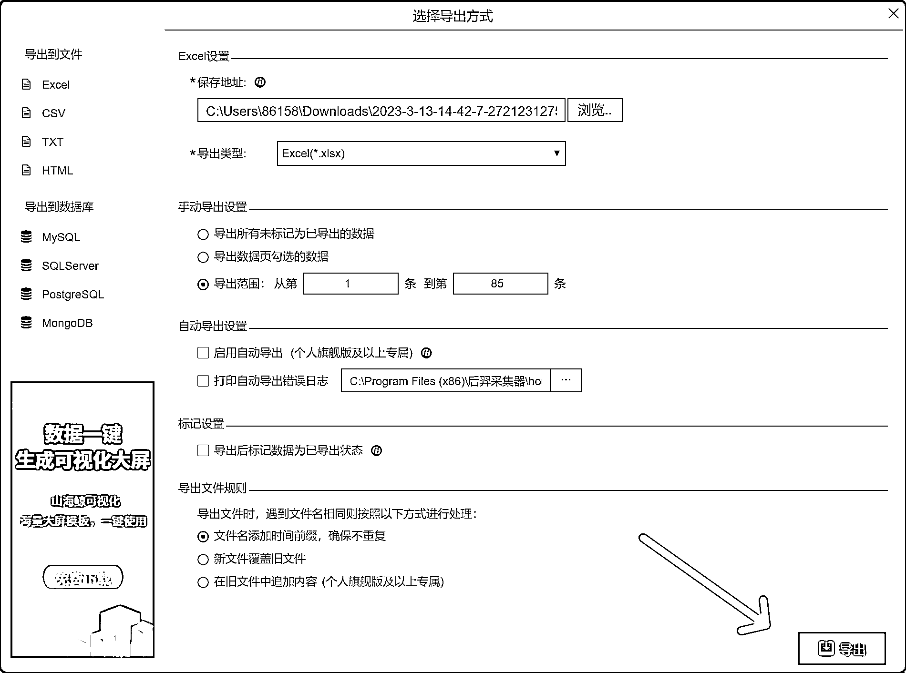  

后羿采集器的最终目的就是找爆款对标然后输出标题，对新手来说非常友好，可以直接快速上手，不用再去分析爆款，找爆款，研究爆款。 

#   

# 三、如何提高效率？ 

这样的方式一开始是可以的，毕竟对于小白来说，培养网感是很有必要的，只有多看、多去感受这些爆款选题，才能慢慢养成对于爆款的敏感性。 

后羿采集器就是在为新手小白打基础，接下来要做的就是提高生产力，我们就可以用灰豚数据、蝉妈妈这样的工具来更加精准的做出爆款，增加爆款更大的概率。在这里我就灰豚数据作为工具来分享。 

# 四、如何使用灰豚数据？ 

灰豚数据更像是进阶版的后羿采集器，从数据中获取关键信息，能让我们的效率提升很多。 

以前我做情感号、护肤号的时候，其实并不知道怎样选题，因为选题并不难，像所熟知的有生命周期选题法、竞品选题法、细分、标签、痛点、热点这些选题法都可以参考，这些是对于每个平台都通用的选题。 

但每个平台都有自己的用户偏好，所以还要考虑到不同平台的调性，这里我们就可以借助灰豚数据来获取。 

先来看一下灰豚数据： 

  

灰豚数据里面的达人分类顺序，是按照小红书的流量和热度来分的，前面的时尚 生活记录 娱乐这些，是小红书主要的领域，内容和达人最多，单从小红书的内容构成来看，前面赛道竞争激烈且门槛高，不适合普通人来做。 

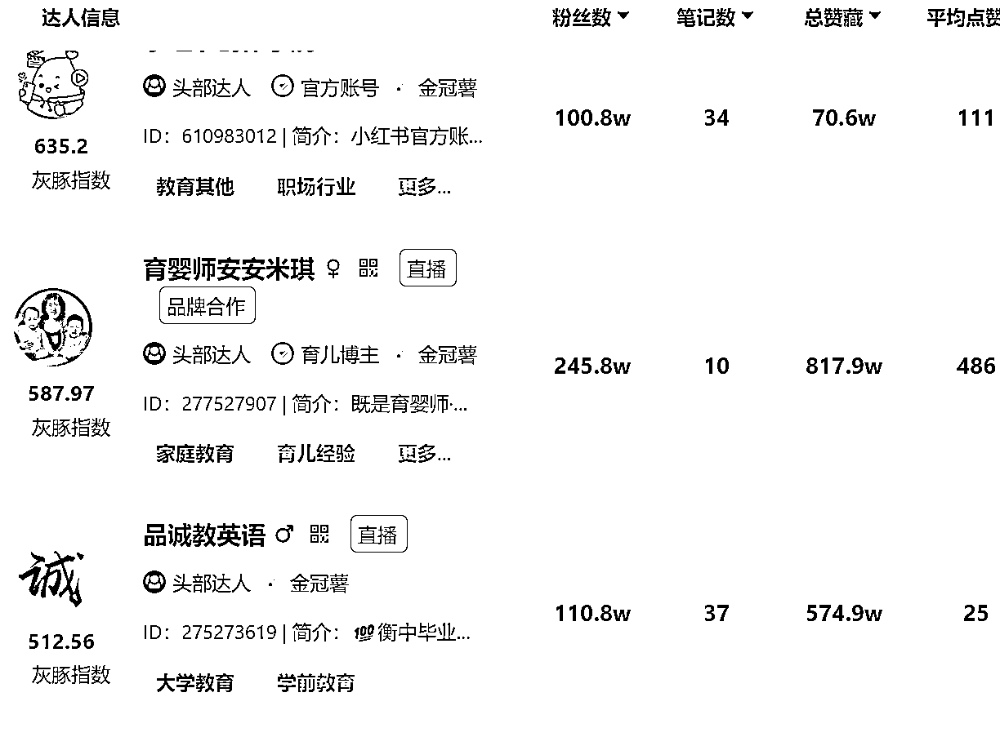  

教育类的头部达人 目前我能看到的粉丝数在 245.8w，但时尚类就在 600w，大 V 效应也会更加明显。 

  <ne-oli><ne-oli-i>1</ne-oli-i><ne-oli-c class="ne-oli-content" id="u341a7b29" data-lake-id="u341a7b29">热词榜的周榜里可以查到最近一周的热词</ne-oli-c></ne-oli> <ne-oli><ne-oli-i>2</ne-oli-i><ne-oli-c class="ne-oli-content" id="u107103a4" data-lake-id="u107103a4">飙升榜是最近一周用户最关注的内容</ne-oli-c></ne-oli> <ne-oli><ne-oli-i>3</ne-oli-i><ne-oli-c class="ne-oli-content" id="ua8e60b0e" data-lake-id="ua8e60b0e">总量榜就是长期关注的热词</ne-oli-c></ne-oli> 

  

热词总榜这里的热词，可以添加到的文案里，也就是小红书里一项项的标签：#大学#学习。 

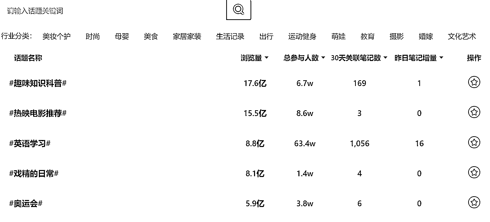  

英语学习的参与人数在这张图里是最多的，但浏览量并没有前两个高，是不是可以说明英语学习的流量更精准 

（如果打算做精准流量，就可以通过这样的数据进行分析，内容创作的方向也会更加明确） 

这时我们点进这个“英语学习”，我们就可以看到数据概览、相应的笔记、每篇笔记涵盖的热词。 

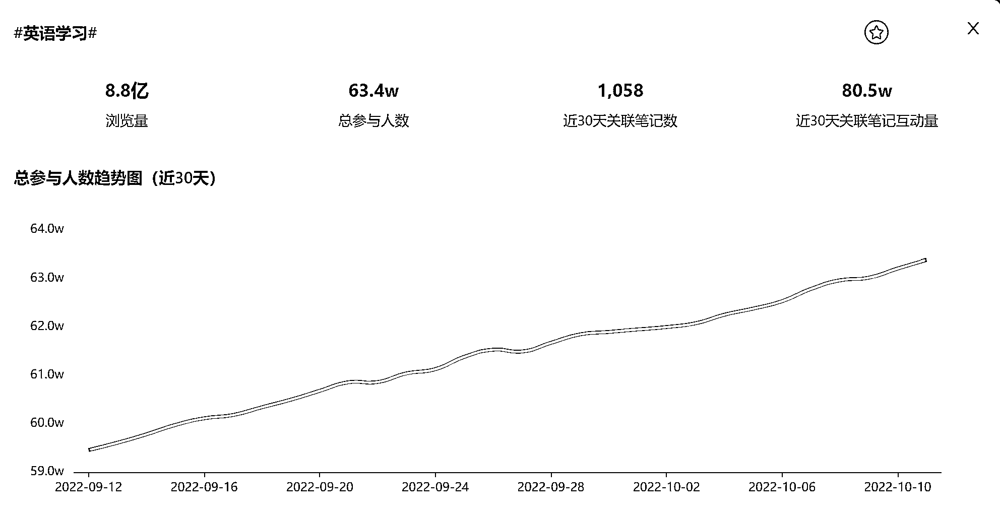  

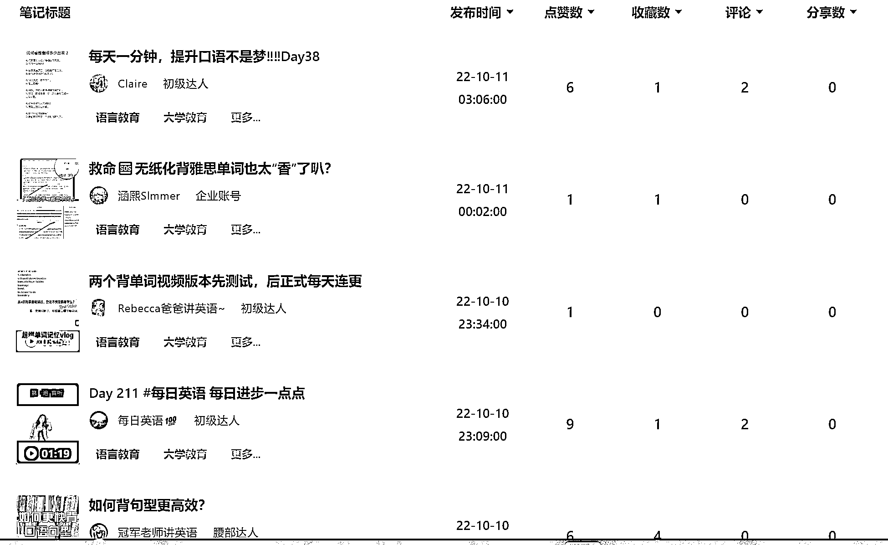  

可以点击笔记标题，阅读相关笔记，在电脑上可能会不太方便，每篇笔记都可以扫描二维码在小红书 app 上查看以及对标。 

  

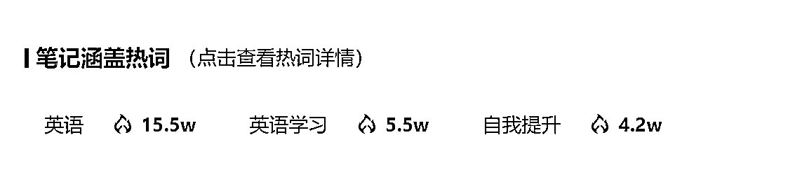  

# 五、我的起号过程复盘 

研究完灰豚数据，接下来就是去尝试了。于是我就在灰豚数据上找了一篇选题： 

找到“热门内容-热词榜-热词总榜”： 

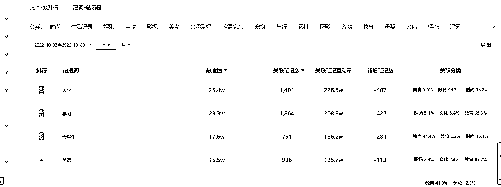  

点击“大学”，查看数据概览 

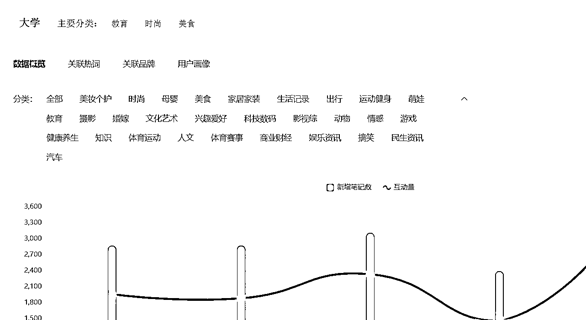  

笔记类型选择“非商业、图文”。 

  

点击某篇笔记标题就可以查看笔记涵盖热词。 

  

笔记覆盖热词也就是标签问题，都已经被完美解决。 

  

但第一篇笔记发布后，数据很不理想，只有个位数的赞。 

由于我当时是中途接手的一个 5k 粉的账号，有一定的粉丝基础，我就进行了反思： 

该账号之前发的内容，高赞集中在 英语四级、大学忠告、建议、残酷真相 这几篇笔记，粉丝大多数由高赞笔记转化而来，他们更关注这些，粉丝画像可能更偏重这方面。 

因此，如果发这方面的内容，粉丝作为首个传播量，会最先点赞、收藏这些，就会有更多的曝光。 

但第一次找的选题以及内容，明显不符合该账号粉丝的阅读习惯。 

可能是还有些因素没有考虑到，需要继续摸索：时间线、事件线、对标线都需要考虑到。按照这个逻辑，我找了一个对标账号，继续进行了测试。 

在第二篇测试当中，把文案部分也进行了优化，把笔记涵盖热词在文案中提上 3 遍，这样做主要是为了获得搜索流量。 

  

第二天笔记发布后，隔了一天已经有 689 赞了，赞比藏 2:1。 

从小眼睛和点赞来看，普通的高赞回答，小眼睛和点赞比例在 10：1，但是超级爆款比例 6-8:1。 

从赞藏来看，一篇笔记能够到 2：1.4 以上，万赞就会很稳定，会有持续不断的推荐。 

对于教育学习领域来说，赞和藏，更像是一个情绪价值和一个实用价值的区分。 

按照小红书的权重来算，评论＞收藏＞赞，因此还要做的一件事就是：一定要在文案和内容中，引导读者评论，同时号主，也要在评论区多评论，多互动。 

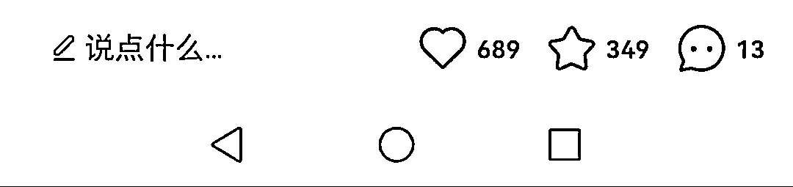  

后来顺利了上了万赞 

  

但是爆了一篇也有可能是巧合，于是就用这个方法继续测试。 

后来好几篇用这样的方法，都成爆款了，可以说只玩过千赞，从选题的角度上看，这样的判断还是正确的。 

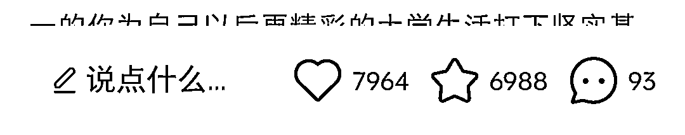  

  

  

  

# 六、反思与进一步优化 

(1) 选题方面： 

用灰豚数据筛选出来近期和总榜小红书的热度话题，然后再话题里找到的 图文笔记 点赞量高且都属于素人账号的爆文 

时间线都是近一个月新发布的笔记，有热度，同时筛选符合账号人设的内容，符合时间线、事件线、对标线的要求。 

即标题和关键词在灰豚数据上查找，近 30 天、近 7 天按照赞数由高到低排序，最好参考低粉爆文笔记，进行对标模仿，关键词在内容、标题、小文案三部分加起来至少提及三次。 

(2)内容方面： 

可以参考爆款——被验证过的好内容。 

有了选题想要提升数据，就得获得源源不断的搜索流量。 

这两篇笔记是之前发布的，搜索流量只有 1%，数据可以说是非常差。 

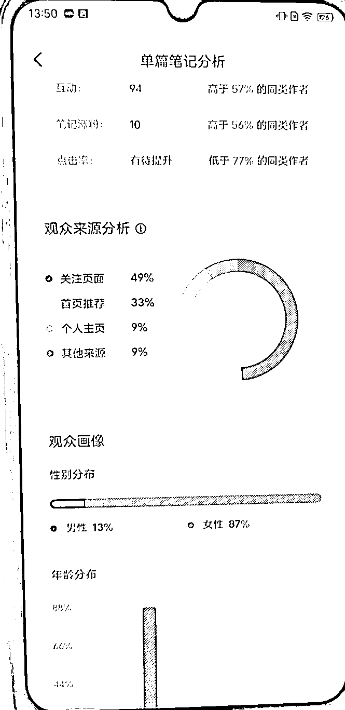  

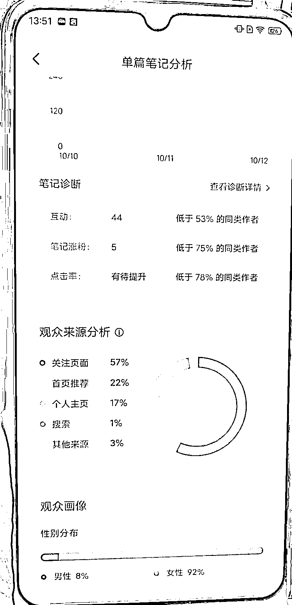  

其中有一篇关于过英语四级的万赞笔记，搜索流量在 61%，并且也被提示了“在笔记标题及正文中，提炼笔记重要信息，有机会提升笔记的曝光量”。 

  

笔记涵盖的热词在标题、文案、图片内容中，提到不少于三次，更能获得搜索流量，同时根据用户端的点赞收藏的行为来推送笔记. 

如果笔记的关键词系统能准确判断，那么推送给的用户也就更精准，触发三连就能返推笔记到更大的流量池。 

后来再遇到数据差的问题，考虑到是标题关键词以及关键词的频率问题，导致没有推荐和搜索流量。 

于是就继续改文案、标题，重新发布，数据一下子就提升上来了。 

毕竟搜索来的才更容易点赞，点赞会加大推送，搜索越多，推送越精准，量起的越快。 

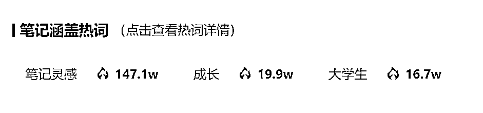  

热词的搜索量高，既是标签也是热词关键词。 

通过这个方法，做到了一个账号 7 天内 60% 的爆文率。 

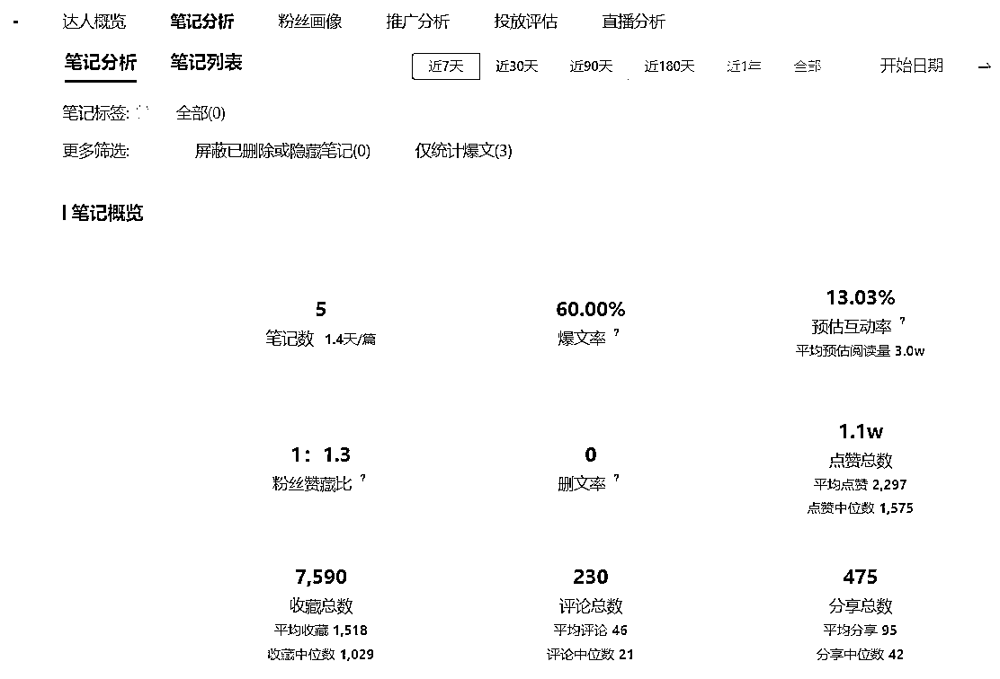  

关于笔记的标签，在后面做小红书资料引流项目时，还有一个小的突破： 

(3) 如何让流量更加稳定？ 

——只要被标签收录，流量就会更加稳定一些。 

标签的作用就是可以让系统识别出笔记的分类，越垂直越好，比如你要发布的是大学高数的资料，标签就可以是#高数#高等数学#大学高数#高数期末复习#高数笔记#高数复习资料等 

当一篇笔记被收录到对应的标签后，就会获得源源不断的搜索流量，所以笔记的标签还是可以好好利用起来的。 

但并不是每篇笔记都会被收录，如何被收录就成了问题。通过我的不断发笔记不断地实践，就产生了一个新的想法： 

原先发笔记带的标签都是看 在相关的情况下，哪个标签关注人数最多就选哪个，因为关注人数多就意味着流量池大，就能够被更多的人所看到的，但没想到可以反着来。 

由此联想到了知乎，在知乎写回答如果是一个新号，就不建议回答关注人数上万的问题，因为关注人数虽然多，但小号权重低，这篇回答爆了的可能性就很小，浏览量也很低，回答就会被沉。 

小红书亦是如此，新号权重低，笔记不容易被大的标签收录。 

但小红书不同的是，新号有流量扶持，以及根据它独特的算法，新号爆的可能性大大增加，即使是素人也有可能出千赞万赞。 

但我们可以把它做的更好：如果选择小标签，就更容易被收录，收录后就会推荐给关注该标签的人以及获取到搜索流量，那么就会把这篇笔记推荐给更大的流量池，流量也就慢慢起来了。 

当然，全选择小标签不如大小标签结合，大标签定垂直领域，小标签更加精准易被收录，再加上好的选题和内容，就能够获得到更多的流量。 

# 七、一些碎碎念 

我在做小红书之前，还做过其他平台的运营，早期是做知乎账号，积累了 3.5w 的粉丝，后来知乎经过上市、改版内容等等，慢慢地过了红利期，我作为创作者也就转移到了其他平台。 

但知乎毕竟是我做自媒体的第一个平台，两年前新手小白的我，对于自媒体的概念是粉丝越多、挣的钱越多。 

所以我就给自己定目标就是成为一个大 V，一周涨多少粉丝、平均一天涨多少，再具体到一天要写几篇回答才能完成涨粉目标，并没有途径知道那么多帮助创作者做内容分析的工具，走了不少的弯路，但也最终做成功了。 

在做公众号之初，我的老师告诉我，无论好坏，所有的经历都是财富。 

在知乎上走的那些弯路，最终也成为我宝贵的运营经验，后来带了很多知乎学员做出了一些成绩，同时还学会了用户运营、社群运营。 

而关于运营的底层逻辑，虽然每个平台都有一些细微的差别，但本质上是不变的——要有用户思维，为用户着想。 

现在每个平台都出了创作者平台，也有了很多数据分析平台，我们就应该去发掘这些工具，更好地为自己的内容创作进行服务。 

全依靠工具是行不通的，没有船时我们也要能够游到河对面去，“不会用人的领导不是好领导” 

领导要学会权利下放，但并不是说没有了员工工作就无法进行。 

chatGPT 也是一样的道理，因此利用工具写爆款笔记，你就把所有的工具都想象成你的员工 

你作为老板，是永远无法被替代的存在。 

评论区： 

花无忌 : 这篇文章看得我有点口渴了 一颗幸运小星星 : 这篇写的真的很好！👍 我最近也在做小红书一个星期爆量，但是正发愁选题如何找以及流量如何稳定下来。你的思路真的非常棒，干货，感谢分享～可以的话，可以加个微信么 我在做内容电商 lydia : 一个星期爆量，纯新号吗？那很厉害了👍 韩北樱 : 对你有帮助就好～ 一颗幸运小星星 : 对的 没有花很大心思😂 以前起号也是 两个星期一篇视频，1 万多粉丝 一颗幸运小星星 : 好嘞 陈真 : 先赞后看，然后回来再赞 碧凝 : 太厉害了这篇