# 《知乎日引粉 3000+的霸屏截流术》

> 原文：[`www.yuque.com/for_lazy/thfiu8/dpypz30hfm7oduf0`](https://www.yuque.com/for_lazy/thfiu8/dpypz30hfm7oduf0)

## (103 赞)《知乎日引粉 3000+的霸屏截流术》 

作者： 摸鱼掌柜 

日期：2023-03-27 

你好，我是摸鱼掌柜。 

”摸鱼思维“ip 账号主理人，《暴力引流 108 招》专栏作者。 

今天给大家分享一个之前我们亲测的 3 天引流万粉玩法，这个项目我还没在公开渠道讲过。效果非常好，这次也是毫无保留的分享给大家，希望能帮助大家做一个启发，之后举一反三，用起来。 

这是之前截图的数据 

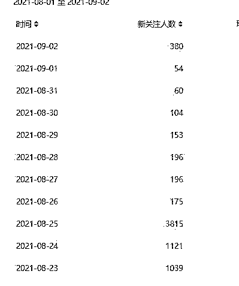  

下面我分为几个板块来讲 

1、操作逻辑 

2、操作步骤 

3、资料收集 

4、引流技巧 

5、变现思路 

6、后续模式 

## 1、操作逻辑 

核心逻辑就是，我们在一个大流量节点，去观察评论区，看用户的述求是什么，然后把这些关键点提取出来，根据这些需求去搜索整理他们感兴趣的内容，然后不断利用长尾关键词去做关键词霸屏，转化流量，最终变现。 

比如王力宏和李靓蕾的事情，一份 421 名单就火了。 

比如过年全网都在培训的红包封面项目 

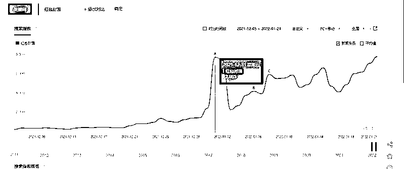  

比如前段时间很火爆的金钱豹头像 

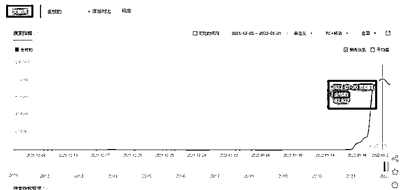  

那这些都意味着这儿段时间，对这块感兴趣的人特别多，大家注意力都在这上面，我们就能想办法吸引到他们。 

那段时间，我们操作的案例是一部电视剧，叫做《扫黑风暴》，估计很多人都知道。 

这部电视剧在那一个月是非常的火爆，但是独家版权的腾讯，是有几个限制，首先 VIP 能提前看三集，VIP 中的 VIP 能提前看 6 级，很多人觉得腾讯这一招太恶心，所以不愿意为他付费，于是在四处寻找片源 

而知乎的特性我们前面讲过了， 

1.百度收录高权重；2.精准流量多 

第一步就是去搜索长尾词 

  

这是我们当时下拉关键词，出现的结果，发现了很多长尾词需求。 

比如关键词是扫黑风暴，长尾词是在线观看、完整版、免费版、全集、百度网盘....等等， 

把这两类结合到一起，就是一个问句。比如， 

扫黑风暴哪里可以看， 

扫黑风暴完整版在哪看， 

所以我们马上就去做了两步： 

1.找到这方面的资源。 

2.在百度高权重平台开始发文章 

而最快也最容易注册的平台呢，就是知乎。 

知乎的特性我们前面讲过了， 

1.百度收录高权重； 

2.精准流量多 

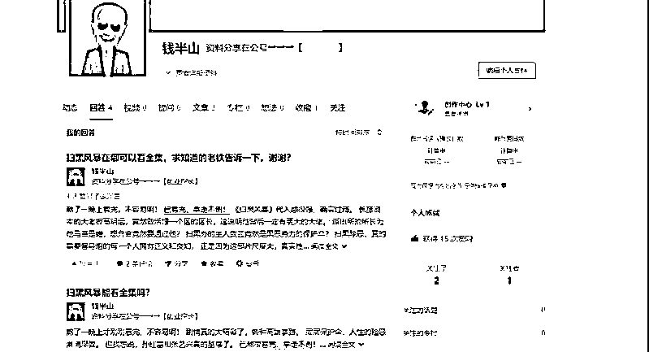  

这是我们当时实操用的账号之一 

大家可以看到，我回答的问题、还有发表的文章，都是围绕着这个长尾词来的 

关于文章 

我们迭代过几个版本 

刚开始上来，就是用比较简单粗暴的 

文字描述+超链接跳转站外的方式 

比如问题是：扫黑风暴在哪里可以看全集。 

我们答： 

刚熬夜看完，拿走不谢，这里就是一个超链接 

  

比如这个回答，在文中植入外站链接 

这个链接点进去可以是微信公众号界面 

  

这是同行的搜索结果 

  

于是我模仿着用石墨文档现做了一份供大家参考 

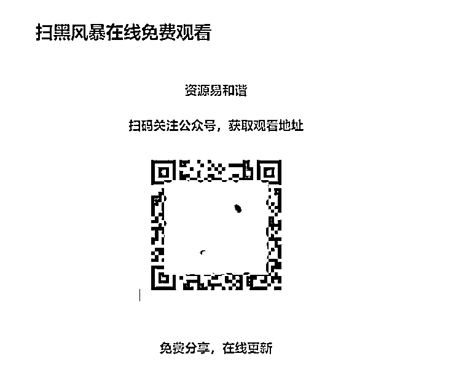  

打开大概就是这个样子 

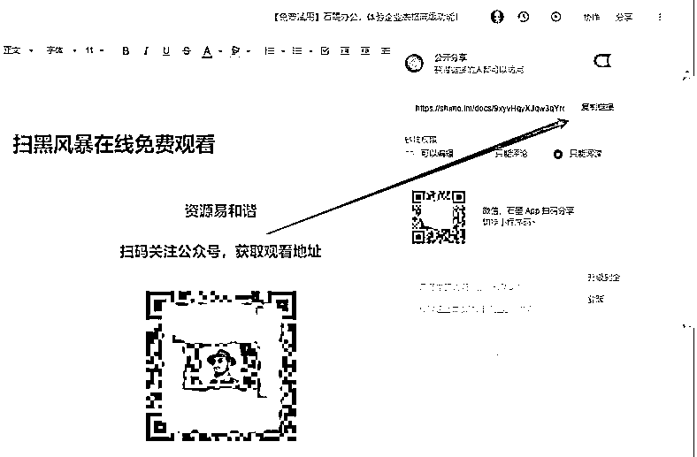  

这里我们保存分享链接，然后植入到文章里即可 

给大家简单演示下 

首先首页点，发表文章 

  

这是我们正常写文章的界面 

  

这个时候我们先选中文字，再点击链接 

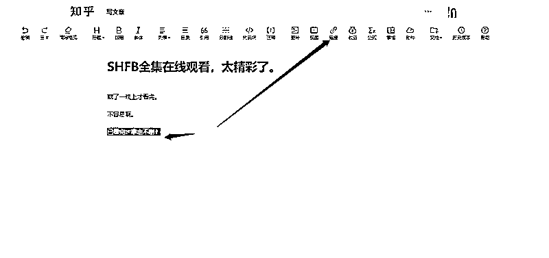  

然后再这里植入我们刚才保存的石墨分享链接 

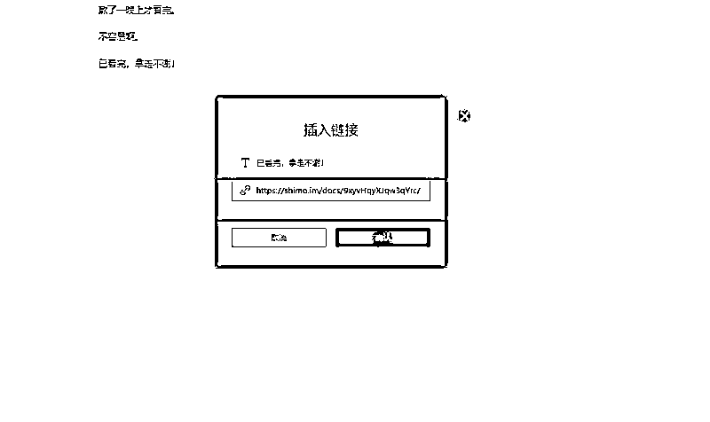  

最后显示的结果，如图。 

一个文字链就做好了， 

用户只要点击文字，就会跳到我们刚才留广告的界面 

  

这样的话，一篇文章就已经发布了 

  

方法比较简单哈，就不多说了 

简单说，就是在一个文档里，提前留好你的联系方式和你提供资源，然后植入到知乎文案里。后来我们很快发现，这种方式扛不住，于是又换了个文案，改做关键词营销。 

比如在开头和文中植入大量的关键词，做搜索入口的霸屏 

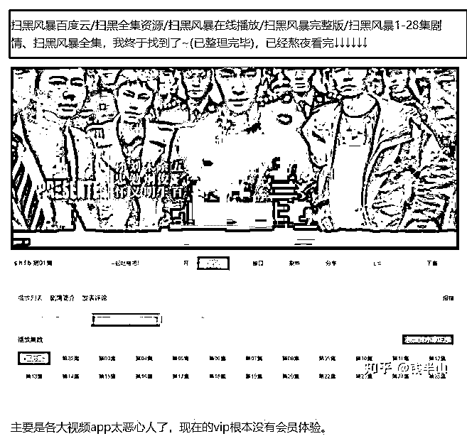  

然后再评论区里做置顶 

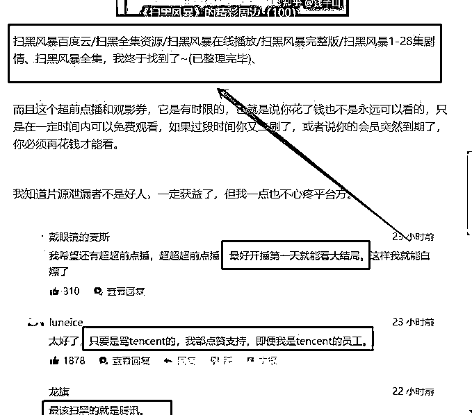  

  

再配合上我们的个人一句话介绍 

  

一环套一套，用户就知道该怎么获取资料了 

效果最好的时候，那几天你在知乎的搜索入口搜扫黑相关的词， 

下面首页全是我们用小号发布的回答，做满了霸屏， 

大家可以看一下图片中的效果 

  

那几天的这个词的热度非常高 

我们可以看到，虽然一个话题只有 70 人的关注，但他的浏览量已经达到了 6 万， 

这是问题发布后几个小时之内的热度，足以说明流量是巨大的 

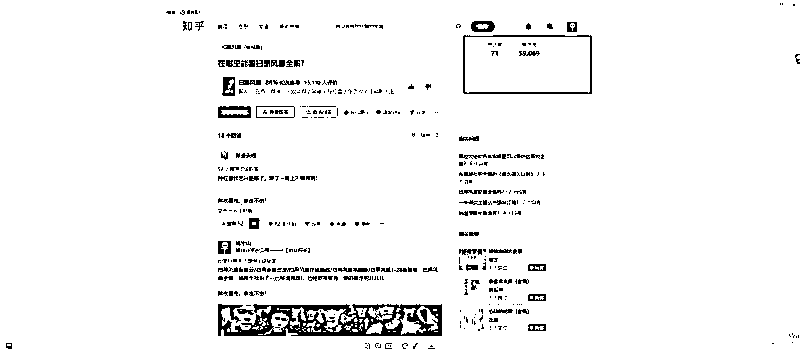  

当用户看到我们的软文，一步步跟着走，我们又是如何承接流量的呢？ 

其实本来呢，这种流量直接引流到微信是最好的， 

但是微信有个弊端，就是每天最多只能通过几百个好友，再多的话就搜不到了。 

所以我们优先考虑把流量导入到公众号，再进行二次的转化 

我们来给大家看下公众号的一个页面情况 

  

这里有 3 个逻辑 

1.用户关注公众号的首关消息 

告诉用户如何获取资源，我们用图片的形式，引导用户回复信息：sh 

在公众号后台选择自动回复 

  

点进去之后就可以设置回复的信息，可以文字、图片、音频、视频 

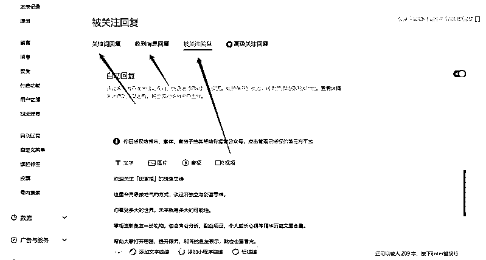  

因为当时扫黑风暴是敏感词，所以我们直接用谐音，或者拼音来代替，避免被和谐违规， 

其次字母或者数字可以加快用户的回复时间， 

效率更高，减少用户因为打字太麻烦而取消要资料。 

按照步骤回复后，会弹出百度网盘的二维码，以及资源失效之后该怎么办？ 

这里我有留一个微信和二维码，至于为什么，我等会讲。 

3.在公众号的菜单栏里，我也设置了一次获取资源的入口， 

总之，目的都只有一个，让用户来了之后知道该怎么办 

好，我们再说百度网盘的事 

像这种资料属于敏感性资源，经常会被百度云和谐，所以为了规避这种情况，我们百度云也是有一些特殊处理方式 

大家可以看一下我当时百度网盘的设置 

  

1.是资源解压的步骤，让 用户下载 pdf、然后改后缀解压即可 

但是 pdf 很大，有 13 个 G，很多人网速慢，根本下不下来，或者是没那个耐心 

所以他就会看 2、3 文件 

这里我写的是，最新在线观看地址 

  

这个就是我的微信号二维码，我随时是可以替换的，而分享的链接不会变 

  

3 是我设置的一个公众号引流信息， 

”资源容易失效，后续更新关注公众号即可。“ 

那么网盘裂变引流，这一步基本就 ok 了 

用户愿意自己慢慢下的，就自己下。 

想要在线的就会来找我。 

其次那个压缩包里也不是全的， 

因为当时市面上还没有出完整版，所以他最终还是会来找我要资料 

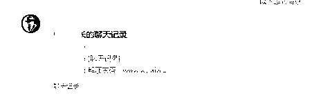  

当用户添加我的微信后，我会给他发送教程 

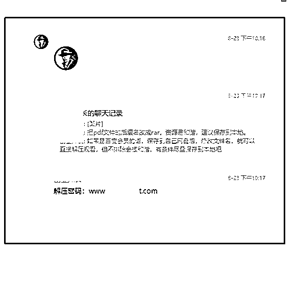  

教程呢，是用的聊天记录的形式 

为什么 

还是为了防止被屏蔽 

这是聊天记录的详细情况，就是资源打开的步骤 

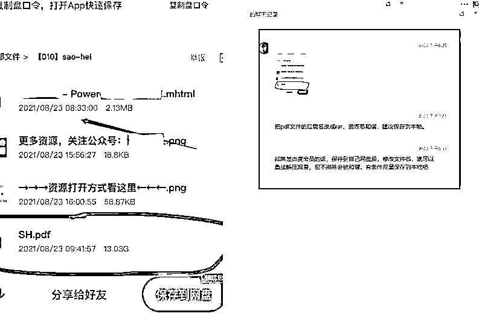  

这是我们整理的市面上其他同行的入口， 

找到的渠道，一共有三个，都整理到一起了 

第一个是在线网站的入口 

  

第二个是备用链接的入口 

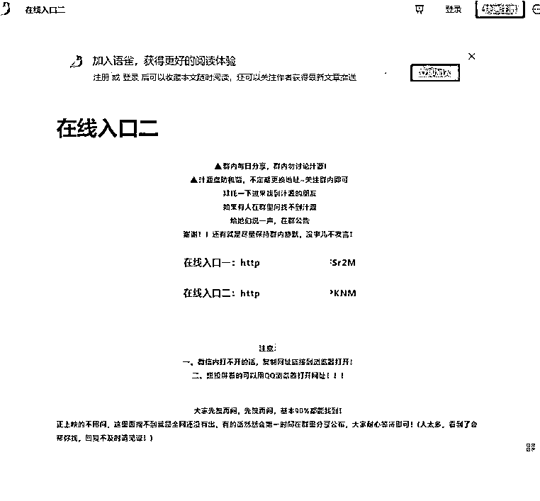  

第三个是百度网盘的入口 

  

这三个渠道呢，其实都是别人发出来的资源，我只是做了一个分类整理归纳，然后又添加了几层保障措施，尽量保证每一个找我要资源的人都能拿到他想要的东西。 

基本上，通过这三个渠道，用户都能看到他想看到的东西。 

以上呢，就是我们整个项目的完整操作步骤，不知道大家能不能看的明白。 

这些其实都是常规操作，只要模式没问题，任何一个人都可以实现。 

最重要的是这次的项目实操，我没有借助”摸鱼思维“和我大号的任何助力。完全是拿一个新号去操盘的而这个新号，我也是在实操当天临时注册的，没有用什么养号之类的，直接上手就去操作。 

希望通过这个故事可以告诉大家，很多东西的门槛没有你想的那么高，不要因为一些小问题被吓到，我们遇到问题了，马上去想解决方案，一次两次三次你就上手了。 

除此之外，还有一个点要说明的是，这里不是教大家去卖影视资源这种事情，这种比较有版权风险，其次收益也不是很稳定，基本都是一波快钱，我当时只是为了测试。 

热门资源做诱饵引流~ 

公众号承接大量流量（也可以直接微信）~ 

关键词谐音替换规避风险~ 

网盘做好广告营销让用户帮你传播裂变~ 

所有环节步步引导。 

确保形成闭环~ 

微信被动添加流量，随时更换账号~ 

建议成交话术，成功交付产品 

这个模式，不知道大家现在看是不是很熟悉， 

这其实和我们做小红书虚拟资源引流是一个框架对不对， 

很多只要有信息差的地方，他都有金钱流动的可能性， 

区别只是在于我们如何挖掘到他，并且把我们的广告展示给这群有需要的用户。 

那我这次的实操也不是一帆风顺的过程中也碰到过很多问题。 

最后再给大家说几个项目操作的关键点： 

1.知乎暴力引流是否会违规？ 

会，不管哪种方式去引流，只要举报了，100%会违规 

  

这是我当时的违规记录， 

我们能做的只能是最大化的去避免 

不要出现公众号、引流等关键词 

通过在评论区和一句话介绍的形式搭配， 

最大化的去保证我们的文章停留时长 

毕竟这么大的流量，停留时长越长，那么对应的流量收益就越多。 

2.违规了怎么办？封号了怎么办？ 

一般平台不会上来就直接封号，通常是阶梯式的，会有一个过程，一次删除，2 次警告，3 次禁言，4 次封号等等这样子，像知乎也是会给 5-10 次机会的，多次违规的会封号 1 天、7 天、永久。 

当封号之后，我们这个号直接就不要了， 

通过手机号换绑的方式，把电话释放出来，重新注册个新号。 

3、账号换绑怎么换呢？ 

给大家分享个技巧， 

在淘宝搜知乎、或者换绑等关键词 

我们可以看到有大量的商品提供服务的 

  

我们挨个去问，选择最便宜的即可 

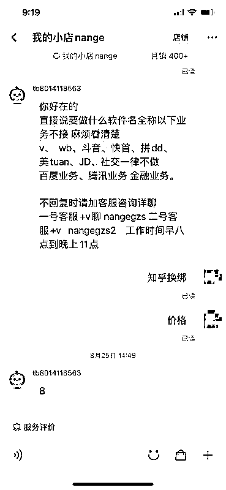  

知乎的换绑非常简单， 

只需要换绑的账号提供一条验证短信即可， 

直接在设置里可以找到 

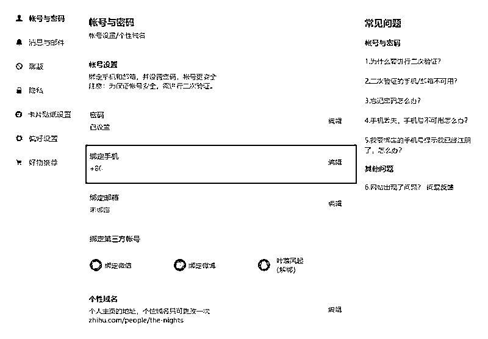  

换绑之后，电话一天后就可以重新注册，最好是用电脑注册， 

因为有个 ip 的问题，换绑之后，就可以继续战斗 

当然，也可以用更直接的方式， 

抱着账号被封的心态去玩，直接从一开始就用他们的手机去注册， 

封了也就封了，无所谓。 

以非常小的代价去换大回报的事情，何乐而不为呢 

4、有没有其他赚钱方法？ 

有，那就是屯流量后期变现。 

像这种泛粉型公众号后续做淘客、外卖、电影票、低价会员充值等等项目都是可以的。 

我们微信做 VIP 充值、电影票、黄牛票、二手回收、潮牌等微商项目也是 ok 的。 

因为泛粉的需求比较多，所以这块项目也好找，只要流量有了，后续都不是什么问题。目前市面上的流量 1 个粉丝价格都是 1-2 元，我们这波引流上万粉，除了已经得到的收益之外，之后也是可以不断营销转化，获得更多收益的。 

5、关于项目的延伸！ 

扫黑风暴只是一个产品，可以替换成任何一个热门刚需的产品，比如近期的教资面试资料，比如二级建造师，比如红包封面，比如金钱豹表情包，比如幼师公开课教案，或者你只做自己领域的，你也可以做你那个类目的霸屏，逻辑都一样的。 

我表达的思路是，逻辑和商业模型，怎么样根据平台的规则去设计路径，用最小的代价去获取最高的收益。 

这里我讲了很多关键点、写作结构、搜索长尾词、流量判断、引流技巧、多账号操作、引流的诱饵、公众号的设置、微信的成交话术、资源的收集、后续的变现。 

这些技巧说起来就是几句话的事，也没有太多的秘密，重点是我们如何把这些已经知道的东西，大家都知道的东西，重组成我们自己可以利用的东西。 

能够理解吧 

比如我现在打开知乎热榜 

随便截个屏，就能找到几个需求话题 

图中标记了，大家可以看一眼 

  

你做什么领域的，就送点什么领域的资料 

引流真的轻轻松松 

比如 

第一个：《108 招搞定女朋友 的小脾气》 

第二个：《被人欺负怎么机智的怼回去》 

第三个：《职场 3 年工资翻 5 倍攻略》 

第四个：《教资面试必过宝典，通过率 98%》 

每天热榜上都有各种问题，也对应了各种需求， 

你要做的就是根据他们的需求去搜集资源，然后想办法让他们知道即可 

我的方法因为这次的资源比较敏感， 

所以用的新号，没有养号，直接操作的，封了也无所谓， 

如果自己长期的话，在细节上多优化注意即可 

总结： 

知乎：粘贴复制一些长尾词 

公众号：设置好引导关键词 

百度云：放二维码文件加密 

微信：通过好友，发送话术 

成交：用户付费，发送产品 

当然了，这些东西对于现阶段大家来说还是需要点时间消化 

但是模式我讲了，大家最好记住， 

以后再有机会或者自己实操的时候要多去思考这方面的东西。 

这个方法就是我们这次实操的一个复盘，希望对大家有所启发。 

说一千道一万，思维只是脑袋会了， 

最重要的结果，还需要手会了才行。 

但手想要会，一定是离不开长期实操总结反馈的。 

以上。 

我是摸鱼掌柜，很高兴认识大家，祝老板们发财。 

评论区： 

热爱 : 厉害厉害 橙丫 : 厉害 空想错视 : 执行力可以 豆豆 : 厉害哇 何为 : 学习了 IT 可乐 : 厉害，学习了，请问这个关键词指数是在哪看的？ 摸鱼掌柜 : 百度指数 海书 : 知乎被封后  手机号码无法再重新注册新号吧