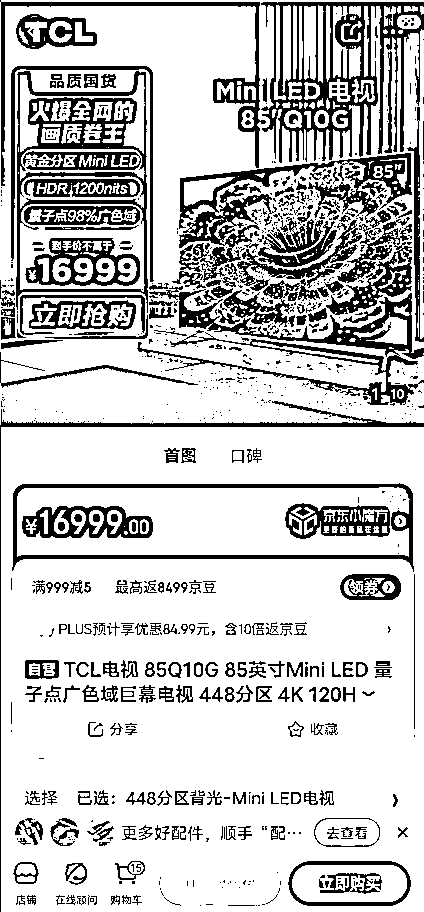

# 《京东家电代下：一个新手也可以变现的项目》

> 原文：[`www.yuque.com/for_lazy/thfiu8/kbgrkxogr73ba2vq`](https://www.yuque.com/for_lazy/thfiu8/kbgrkxogr73ba2vq)

<ne-h2 id="066d653c" data-lake-id="066d653c"><ne-heading-ext><ne-heading-anchor></ne-heading-anchor><ne-heading-fold></ne-heading-fold></ne-heading-ext><ne-heading-content><ne-text id="u50ce0afb">(78 赞)《京东家电代下：一个新手也可以变现的项目》</ne-text></ne-heading-content></ne-h2> <ne-p id="u5f0b0709" data-lake-id="u5f0b0709"><ne-text id="u34f0dea0">作者： 阿辉</ne-text></ne-p> <ne-p id="u7fdce3bb" data-lake-id="u7fdce3bb"><ne-text id="u6da6373b">日期：2023-03-28</ne-text></ne-p> <ne-h2 id="df368884" data-lake-id="df368884"><ne-heading-ext><ne-heading-anchor></ne-heading-anchor><ne-heading-fold></ne-heading-fold></ne-heading-ext><ne-heading-content><ne-text id="uef5923ed">前言</ne-text></ne-heading-content></ne-h2> <ne-p id="ua4165d33" data-lake-id="ua4165d33"><ne-text id="u2e1ad532">各位圈友大家好，我是阿辉，一名大二在读警校生。</ne-text></ne-p> <ne-p id="ue248d886" data-lake-id="ue248d886"><ne-text id="u5057cb9b">去年通过做家电代下这个项目，实现了 300w 的营业额（个人），团队营业额突破 1000w，今年打算继续深耕扩大。</ne-text></ne-p> <ne-p id="ud18a9e3c" data-lake-id="ud18a9e3c"><ne-text id="u23456ef7">前两天朋友和我聊天，发现我在做京东家电代下，聊的挺开心的，他说星球有很多人咨询过这个项目，让我把项目理一下，写一篇文章，给圈友介绍一下这个项目。</ne-text></ne-p> <ne-p id="u77d4a4fb" data-lake-id="u77d4a4fb"><ne-text id="u29085944">以前也没写过，第一次写文章和大家分享，请各位多多指点。</ne-text></ne-p> <ne-h2 id="219c7f09" data-lake-id="219c7f09"><ne-heading-ext><ne-heading-anchor></ne-heading-anchor><ne-heading-fold></ne-heading-fold></ne-heading-ext><ne-heading-content><ne-text id="ue0345ba8">一、我与项目的经历</ne-text></ne-heading-content></ne-h2> <ne-h3 id="2cac734d" data-lake-id="2cac734d"><ne-heading-ext><ne-heading-anchor></ne-heading-anchor><ne-heading-fold></ne-heading-fold></ne-heading-ext><ne-heading-content><ne-text id="uf119606c">1.京东代下</ne-text></ne-heading-content></ne-h3> <ne-p id="u41452695" data-lake-id="u41452695"><ne-text id="ub6d8861f">上高中时，就在朋友圈见有人发京东商品代下单，价格很低，当时不懂是什么原理，就想的以后有时间了研究研究做京东家电代下单。</ne-text></ne-p> <ne-p id="ude80abb6" data-lake-id="ude80abb6"><ne-text id="u59fbb9d5">上了大学的，大一上半学期过完，熟悉了大学生活，也没有刚开始那么忙碌了，看到别的区队的同学在得物搬砖，一个月也能赚个几千块钱，我寻思自己也得干点啥。</ne-text></ne-p> <ne-p id="ue8f812c3" data-lake-id="ue8f812c3"><ne-text id="u799e6256">正好在朋友圈又看到了京东代下单，就问对方收徒吗，结果对方没回我，后来我又去知乎搜了搜，结果还真有人收徒，花了 599 去学这个东西。</ne-text></ne-p> <ne-p id="ubb44f98a" data-lake-id="ubb44f98a"><ne-text id="u04f24f9e">学会后发现是利用新人优惠券下单，差价并不是很大，我就想到了收徒，哈哈，其实刚开始自己也不懂的时候，就是想的先回本。</ne-text></ne-p> <ne-p id="u16f69935" data-lake-id="u16f69935"><ne-text id="u05636570">过年的时候有个朋友提到了闲鱼，我以前都没想到过这个平台，就是这么偶然，我打开闲鱼搜了一下京东代下，真有人发，直接复制了人家的内容，然后陆陆续续竟然有很多人来咨询，接二连三的人来学下单，就这样赚了一点小钱，这也是占了很大的运气成分。</ne-text></ne-p> <ne-h3 id="f6dd3d2b" data-lake-id="f6dd3d2b"><ne-heading-ext><ne-heading-anchor></ne-heading-anchor><ne-heading-fold></ne-heading-fold></ne-heading-ext><ne-heading-content><ne-text id="u7fbacbcb">2.京东家电代下</ne-text></ne-heading-content></ne-h3> <ne-h4 id="0585c6b5" data-lake-id="0585c6b5"><ne-heading-ext><ne-heading-anchor></ne-heading-anchor><ne-heading-fold></ne-heading-fold></ne-heading-ext><ne-heading-content><ne-text id="u97ba91cd">2.1 初尝甜头</ne-text></ne-heading-content></ne-h4> <ne-p id="uf236062b" data-lake-id="uf236062b"><ne-text id="ufe39159a">就这样做京东代下单的时候，有很多人问京东家电代下，刚开始我以为是客户弄错了，随便问的，后来问的人越来越多，我就寻思这里面肯定有点东西。</ne-text></ne-p> <ne-p id="u0cabbf29" data-lake-id="u0cabbf29"><ne-text id="ude4f3e07">心里想的会不会像京东日用品下单一样是用优惠券，然后我就又去找了一个人，花了 599 拜师，然后就又开始发家电，陆陆续续出了很多单，又尝到了一点甜头。</ne-text></ne-p> <ne-h4 id="5ab5ab92" data-lake-id="5ab5ab92"><ne-heading-ext><ne-heading-anchor></ne-heading-anchor><ne-heading-fold></ne-heading-fold></ne-heading-ext><ne-heading-content><ne-text id="ufc117f50">2.2 组建团队</ne-text></ne-heading-content></ne-h4> <ne-p id="u4b369019" data-lake-id="u4b369019"><ne-text id="u5d217321">后来我想啊，这么做下去不行，肯定是做不大的，就想着做个团队出来，更加正规了，因为人更多了，也更好的去谈一些价格。</ne-text></ne-p> <ne-p id="u5de45af1" data-lake-id="u5de45af1"><ne-text id="u0c33c6f7">说干就干，紧接着就开始了招代理，其实代理费并没有赚到多少钱，最重要的是遇到了形形色色的人，遇到了很多有想法的朋友。</ne-text></ne-p> <ne-p id="uda0fe39d" data-lake-id="uda0fe39d"><ne-text id="u5a3647b2">这样做了半年左右，陆陆续续赚到了一点钱，虽然比不上很多月入 10w+的圈友，但是自我感觉还不错，自信心也得到了提升，更加明确了接下来的发展方向与发展模式。</ne-text></ne-p> <ne-h2 id="2e613bee" data-lake-id="2e613bee"><ne-heading-ext><ne-heading-anchor></ne-heading-anchor><ne-heading-fold></ne-heading-fold></ne-heading-ext><ne-heading-content><ne-text id="ub0c88058">二、家电代下是什么？</ne-text></ne-heading-content></ne-h2> <ne-h3 id="c1dc46f8" data-lake-id="c1dc46f8"><ne-heading-ext><ne-heading-anchor></ne-heading-anchor><ne-heading-fold></ne-heading-fold></ne-heading-ext><ne-heading-content><ne-text id="ua95e91e5" ne-bold="true">1.什么是家电代下</ne-text></ne-heading-content></ne-h3> <ne-p id="udc6461e4" data-lake-id="udc6461e4"><ne-text id="u51175102">家电代下就是通俗的字面意义，帮助买家进行家电的代下单，通过一些特殊的渠道，使得买家有所优惠。我们从中获取一定的利润。</ne-text></ne-p> <ne-h3 id="e8b65011" data-lake-id="e8b65011"><ne-heading-ext><ne-heading-anchor></ne-heading-anchor><ne-heading-fold></ne-heading-fold></ne-heading-ext><ne-heading-content><ne-text id="u7afc0e21" ne-bold="true">2.这种优惠是怎么来的？</ne-text></ne-heading-content></ne-h3> <ne-p id="u1ff72d4a" data-lake-id="u1ff72d4a"><ne-text id="ua8f0aac8">相信大家都知道京东家电是有线下实体店的，加盟了京东线下实体店的店主往往会有一个内部账户享受京东家电的进货价，也就是行内人士所说的令牌价。</ne-text></ne-p> <ne-p id="u01366df1" data-lake-id="u01366df1"><ne-text id="uf69c8d9f">不过这个令牌价并不稳定，政策经常会有变动。</ne-text></ne-p> <ne-p id="uc1fbf2d7" data-lake-id="uc1fbf2d7"><ne-text id="u1d007975">就像下图所示的 TCL 这台 85Q10G 电视，京东自营前台官方价格是 16999，而我们下单所需要金额只需要 8999，相当于前台价格的 1/2。</ne-text></ne-p> <ne-p id="uec8ba9b7" data-lake-id="uec8ba9b7"><ne-text id="u5dae92fe">在此基础上我们可以加价进行出售，你可以根据客户的质量进行不同的定价，例如可以卖 9999，我们的利润就有 1000 元。</ne-text></ne-p> <ne-p id="u255d7ecf" data-lake-id="u255d7ecf"><ne-card data-card-name="image" data-card-type="inline" id="oVrhP" data-event-boundary="card">  <ne-p id="u5c0991e0" data-lake-id="u5c0991e0"><ne-text id="u31ba9ddb">下单后我们会提供京东订单号+物流信息，到货后可以开具发票。</ne-text></ne-p> <ne-h3 id="8b312d40" data-lake-id="8b312d40"><ne-heading-ext><ne-heading-anchor></ne-heading-anchor><ne-heading-fold></ne-heading-fold></ne-heading-ext><ne-heading-content><ne-text id="u653d84c5">3.如何获取京东令牌价？</ne-text></ne-heading-content></ne-h3> <ne-p id="u396f0fe1" data-lake-id="u396f0fe1"><ne-text id="ub6b99582">我们会有专门的网站可以查询令牌价格，以便于代理进行产品报价。</ne-text></ne-p> <ne-p id="uf1a4891b" data-lake-id="uf1a4891b"><ne-text id="uf81cc84c">对于没有令牌价格的产品，会有仓库现货，或者工厂直发报价表进行查价。</ne-text></ne-p> <ne-p id="u71d303a1" data-lake-id="u71d303a1"><ne-text id="uf4d8da7d">因为家电这个产品存在区域保护政策，可能不同地区的价格也会有所差异，具体产品需要看地区来定价。</ne-text></ne-p> <ne-h3 id="2a8eaeea" data-lake-id="2a8eaeea"><ne-heading-ext><ne-heading-anchor></ne-heading-anchor><ne-heading-fold></ne-heading-fold></ne-heading-ext><ne-heading-content><ne-text id="u3ee60bcb" ne-bold="true">4.下单的产品有质量保证吗？</ne-text></ne-heading-content></ne-h3> <ne-p id="u04527cc6" data-lake-id="u04527cc6"><ne-text id="ud3c34519">我们所下单的产品均为全新未拆封原包机，京东自营物流配送，品牌方上门安装。</ne-text></ne-p> <ne-p id="ubd748f51" data-lake-id="ubd748f51"><ne-text id="u144a478b">有质量问题 400 官方售后，享受的所有服务和官方均为一致，我们所涉及的品牌包含如下：</ne-text></ne-p> <ne-p id="u8006d297" data-lake-id="u8006d297"><ne-card data-card-name="image" data-card-type="inline" id="e58zx" data-event-boundary="card">  <ne-p id="u5201c92a" data-lake-id="u5201c92a"><ne-text id="u506e17fa">基本覆盖全品类，包含大小各种品牌家电。</ne-text></ne-p> <ne-h3 id="172ed61f" data-lake-id="172ed61f"><ne-heading-ext><ne-heading-anchor></ne-heading-anchor><ne-heading-fold></ne-heading-fold></ne-heading-ext><ne-heading-content><ne-text id="ua8a4eac7" ne-bold="true">5.运作模式</ne-text></ne-heading-content></ne-h3> <ne-p id="ubeade9f3" data-lake-id="ubeade9f3"><ne-text id="u7200752f">目前我实施的是代理模式，也就是主要供给代理，代理去进行出单，我这边会提供相应的一些建议去帮助代理进行出单，给足代理利润。互利共赢，行稳致远。</ne-text></ne-p> <ne-p id="ub326a7d6" data-lake-id="ub326a7d6"><ne-text id="u0136f36b">做家电最重要的不仅是线上销售，如果能发掘线下小区资源，收益是不可估量的。</ne-text></ne-p> <ne-h3 id="7fadcf13" data-lake-id="7fadcf13"><ne-heading-ext><ne-heading-anchor></ne-heading-anchor><ne-heading-fold></ne-heading-fold></ne-heading-ext><ne-heading-content><ne-text id="ua304748e" ne-bold="true">6.下一步发展规划：</ne-text></ne-heading-content></ne-h3> <ne-h4 id="863a8583" data-lake-id="863a8583"><ne-heading-ext><ne-heading-anchor></ne-heading-anchor><ne-heading-fold></ne-heading-fold></ne-heading-ext><ne-heading-content><ne-text id="u2248ee81">第一步</ne-text></ne-heading-content></ne-h4> <ne-p id="ue223ae68" data-lake-id="ue223ae68"><ne-text id="u33e01188">23 年的计划是继续深挖数码家电这个领域，品类覆盖更加广泛，对接更多优势资源，整合手机，电脑，以及家具品类资源，实现家电家具产业一条龙服务对接。</ne-text></ne-p> <ne-p id="u0b7e0b7a" data-lake-id="u0b7e0b7a"><ne-text id="u4597ea87">给予代理更多扶持，团队人员从目前的 110 人增长到 500 人，打造一个线上针对于 C 端客户的家电家具商城，逐步完善当前的一些制度体系，发掘更符合大家发展的玩法。</ne-text></ne-p> <ne-h4 id="9757f2c5" data-lake-id="9757f2c5"><ne-heading-ext><ne-heading-anchor></ne-heading-anchor><ne-heading-fold></ne-heading-fold></ne-heading-ext><ne-heading-content><ne-text id="uf7a74528">第二步</ne-text></ne-heading-content></ne-h4> <ne-p id="u0aa99322" data-lake-id="u0aa99322"><ne-text id="uf1bc265f">对接数码家电领域二手品资源，结合自身进行闲鱼的布局，也是采用团队发展的模式，施行一对一发展模式，即团队对接一个人，开一个群的发展模式，进行该项目的实操。</ne-text></ne-p> <ne-h2 id="06d2e288" data-lake-id="06d2e288"><ne-heading-ext><ne-heading-anchor></ne-heading-anchor><ne-heading-fold></ne-heading-fold></ne-heading-ext><ne-heading-content><ne-text id="u95264eb2">三、总结思考</ne-text></ne-heading-content></ne-h2> <ne-p id="uad1b7684" data-lake-id="uad1b7684"><ne-text id="udae432e7">欢迎对我所言感兴趣的朋友前来一起探讨，有资源的朋友可以一起合作。</ne-text></ne-p> <ne-p id="u0713a2c2" data-lake-id="u0713a2c2"><ne-text id="ud53b19f8">我特别喜欢毛泽东的一句话“读奇书，交奇友，创奇事”。做一些别人没有做过的事情，在我看来就是奇事，读万卷书，行万里路。</ne-text></ne-p> <ne-p id="u2b38c869" data-lake-id="u2b38c869"><ne-text id="ud63be6b2">不管是读书还是旅行，我们都是为了遇见更好的自己。也是为了更好的锻造自己，以便在合适的地方发光。</ne-text></ne-p> <ne-p id="u0a8ca11e" data-lake-id="u0a8ca11e"><ne-text id="u7aef60ac">十年磨一剑，一日露锋芒。</ne-text></ne-p> <ne-p id="u3fb884d7" data-lake-id="u3fb884d7"><ne-text id="u4708a9d7">衷心的希望现在未曾取得成绩的朋友不要灰心，安心磨剑，终有一日必将展露锋芒。</ne-text></ne-p> <ne-p id="u4aaa0e67" data-lake-id="u4aaa0e67"><ne-text id="u1744e1a0">最后，预祝生财圈友，早日成为彼时的你，也祝彼时的你开怀大笑。</ne-text></ne-p> <ne-p id="u88c6c889" data-lake-id="u88c6c889"><ne-text id="u27a55f19">（完）</ne-text></ne-p> <ne-hole id="uda1197d7" data-lake-id="uda1197d7"><ne-card data-card-name="hr" data-card-type="block" id="XUiK4" data-event-boundary="card"><ne-p id="u3cf4c4e1" data-lake-id="u3cf4c4e1"><ne-text id="u8d8c175c">评论区：</ne-text></ne-p> <ne-p id="u11dbfbcd" data-lake-id="u11dbfbcd"><ne-text id="u352e8409">书情小跟班 : 不错，感谢分享</ne-text> <ne-text id="u68deb3eb">鹿鹿姐姐 : 怎么联系呀</ne-text> <ne-text id="u24d973be">魔方 : 怎么联系</ne-text> <ne-text id="ub4602462">阿辉 : MMMXXXAH</ne-text> <ne-text id="u35ff9067">欢迎前来交流[呲牙]</ne-text> <ne-text id="u93c82ebb">魔方 : +你了</ne-text> <ne-text id="uad832dff">李凤 : 怎么联系呀</ne-text> <ne-text id="u173c5cb2">nickki : 是直接找代理下嘛，还是要先成为代理呢</ne-text> <ne-text id="u653ffdc6">何道平 : 其实这一块是抢了京东线下线上的生意，京东会不会改变政策，倾向保护他的线下加盟店，</ne-text></ne-p></ne-card></ne-hole></ne-card></ne-p></ne-card></ne-p>