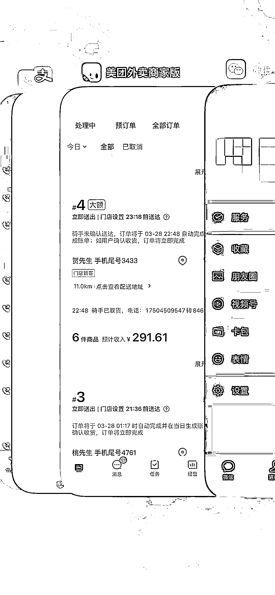

# 《成人用品外卖到底赚不赚钱？做了 2 个月的经验分享》

> 原文：[`www.yuque.com/for_lazy/thfiu8/ig8w1gue3t01ynwp`](https://www.yuque.com/for_lazy/thfiu8/ig8w1gue3t01ynwp)

<ne-h2 id="554216c3" data-lake-id="554216c3"><ne-heading-ext><ne-heading-anchor></ne-heading-anchor><ne-heading-fold></ne-heading-fold></ne-heading-ext><ne-heading-content><ne-text id="u75930122">(63 赞)《成人用品外卖到底赚不赚钱？做了 2 个月的经验分享》</ne-text></ne-heading-content></ne-h2> <ne-p id="u878ab7c9" data-lake-id="u878ab7c9"><ne-text id="uc403f2e1">作者： Ao 阳</ne-text></ne-p> <ne-p id="u26658cce" data-lake-id="u26658cce"><ne-text id="u47913731">日期：2023-03-29</ne-text></ne-p> <ne-p id="u9a0fe3fc" data-lake-id="u9a0fe3fc"><ne-text id="ub71b12b8" ne-bold="true">     大家好，我是阿阳，一个来自哈尔滨创业的 95 后，主业目前从事通信行业，在做手机号卡，已经有 2 年多的时间，今天给大家分享一个目前在做的一个副业项目，年底的时候，朋友聚在一起，了解到了这个成人用品外卖店的项目，感觉是一个不错的蓝海项目，前景还是不错的，并且他那边做的很好，我这边年后开始做，目前把 2 个月的经验以及这个行业到底赚不赚钱分享给大家！</ne-text></ne-p> <ne-hole id="udf4cfc0c" data-lake-id="udf4cfc0c"><ne-card data-card-name="hr" data-card-type="block" id="ADHEq" data-event-boundary="card"><ne-oli><ne-oli-i>1</ne-oli-i><ne-oli-c class="ne-oli-content" id="u3208b135" data-lake-id="u3208b135"><ne-text id="u42a971f5" ne-bold="true">项目形式及前景</ne-text></ne-oli-c></ne-oli> <ne-p id="u791c43e2" data-lake-id="u791c43e2"><ne-card data-card-name="image" data-card-type="inline" id="uqHim" data-event-boundary="card"></ne-card><ne-card data-card-name="image" data-card-type="inline" id="Fa7Rk" data-event-boundary="card"></ne-card><ne-card data-card-name="image" data-card-type="inline" id="YWnOy" data-event-boundary="card"></ne-card><ne-card data-card-name="image" data-card-type="inline" id="v9Qhu" data-event-boundary="card"></ne-card></ne-p> <ne-p id="u1686181f" data-lake-id="u1686181f"><ne-text id="ub797d2d1">上面的数据是我这边本地，以及一些夜生活比较丰富的城市的一些店铺数据，哈尔滨这边做的好的普遍的话都在 1000 多单，大家都应该知道这个行业，是一个非常暴力且冷门的项目，利润高达几十倍，这个利润在 65%-75%左右，平均单价的话在 60-80 左右，1000 单毛利润在 6w-8w 左右，纯利润应该在 3.9w-6w 之间，这个项目还在于能够及时送达，去电商平台拍下发货要 3-5 天，多数人而言应该没有提前准备的这个习惯，也算是这个项目的一个优势，再就是需求量很大，这个数据也在增长，大家可以搜搜自己所在城市的店铺销量，目前这个行业</ne-text><ne-text id="ue4867fad" style="color: rgb(0, 0, 0);">竞争小，外卖隐蔽送达保护隐私确实解决一些后顾之忧，目前线上女性用户占比大，有可能都是觉得很不好意思，外卖平台完全解决了客户的顾虑！完全解决了用户的痛点！</ne-text></ne-p> <ne-p id="u6e76d88f" data-lake-id="u6e76d88f"><ne-card data-card-name="image" data-card-type="inline" id="Fluyg" data-event-boundary="card"></ne-card></ne-p> <ne-p id="u4572c42b" data-lake-id="u4572c42b"><ne-text id="ud24919d4">（ps 不太行凑乎看吧）</ne-text></ne-p> <ne-p id="u1ee5a363" data-lake-id="u1ee5a363"><ne-text id="u177b23c9">目前这个行业竞争小，利润大，投入小，需求大，而且随着社会的发展进步生活水平的提高以及思想上的更开放，未来会越来越多的人选择外卖店铺，这个市场也会越来越大！</ne-text></ne-p> <ne-p id="udbb58780" data-lake-id="udbb58780"><ne-card data-card-name="image" data-card-type="inline" id="gIumI" data-event-boundary="card"></ne-card><ne-card data-card-name="image" data-card-type="inline" id="zIquJ" data-event-boundary="card"></ne-card></ne-p> <ne-p id="ubb6399bb" data-lake-id="ubb6399bb"><ne-card data-card-name="image" data-card-type="inline" id="kdgFu" data-event-boundary="card"></ne-card></ne-p> <ne-p id="u812756e9" data-lake-id="u812756e9"><ne-card data-card-name="image" data-card-type="inline" id="jGFa7" data-event-boundary="card"></ne-card></ne-p> <ne-p id="u7d3ee140" data-lake-id="u7d3ee140"><ne-text id="u9a20e399">（大学城店 周五周六会爆单哈）</ne-text></ne-p> <ne-oli><ne-oli-i>1</ne-oli-i><ne-oli-c class="ne-oli-content" id="ua4d6e846" data-lake-id="ua4d6e846"><ne-text id="u855440a5" ne-bold="true">项目需要的准备</ne-text></ne-oli-c></ne-oli> <ne-p id="u8322d8dc" data-lake-id="u8322d8dc"><ne-text id="ua7d7feae">营业执照  场地在家或者找个车库 10 平米左右就可以，人员 2 人 白天晚上倒一倒 负责接单装货等外卖小哥来取货就可以了  晚上的单子会多一点，凌晨过后也会有订单，一个人有点熬不住，再就是货品品类，可以看其他家店铺作为参考！</ne-text></ne-p> <ne-oli><ne-oli-i>1</ne-oli-i><ne-oli-c class="ne-oli-content" id="ua6facfb6" data-lake-id="ua6facfb6"><ne-text id="u24658799" ne-bold="true">项目的核心</ne-text></ne-oli-c></ne-oli> <ne-p id="ud1e5cec0" data-lake-id="ud1e5cec0"><ne-text id="u588752a0">选址问题：百度地图有热力图，可以看到人群热度，但是你所在的城市，其实你更熟悉，哪些区域街道有：临时性的成人用品需求（比如夜场周边、酒吧一条街周边等，大家可以发散思考）</ne-text></ne-p> <ne-p id="uf46e9097" data-lake-id="uf46e9097"><ne-text id="u8ffcc570">运营问题：不少人觉得没做过外卖平台，没有运营经验，可以去先找个靠谱的外卖代运营公司，自己也要去一点一点学习，最好的老师就是同行，找附近卖的最好的成人外卖店，然后，把销量高的列下来，把好的品记下来，去别的位置开店的话可以比他便宜，（这里并不是建议大家在价格上恶意竞争，也算获得流量的一些小技巧，可以离他家店铺远点哈），再就是一定要跟着做的好的店铺学习，模仿他！慢慢学习，数据也就会越来越好！</ne-text></ne-p> <ne-p id="u3febbb68" data-lake-id="u3febbb68"><ne-text id="u79fa0fc9">如果之前有过外卖运营的经验，上手可能会很快。</ne-text></ne-p> <ne-p id="u1f6e5fb2" data-lake-id="u1f6e5fb2"><ne-text id="ud9995fc2">希望这篇文章能够帮助到大家，对这个行业有一个更深的了解！</ne-text></ne-p> <ne-oli><ne-oli-i>1</ne-oli-i><ne-oli-c class="ne-oli-content" id="u81a04eda" data-lake-id="u81a04eda"><ne-text id="u172c4d49" ne-bold="true">最后</ne-text></ne-oli-c></ne-oli> <ne-p id="uc73f0281" data-lake-id="uc73f0281"><ne-text id="u9b688691">作为一个副业，基本上跑通了，还是不错的，感觉前景还是很好的，比较适合夫妻俩，或者宝妈，一些刚创业的小伙伴们，对于这些群体很友好，投入小，利润高，目前准备开第二家店铺，选址中，（</ne-text><ne-text id="u07dbfd46">目前这边消耗的精力太多了，毕竟还有主业，打算交给家里人来打理了</ne-text><ne-text id="ud5cb0f4c">）数据很多在这里就不跟大家分享太多了，图片太多太乱，这也是目前做了 2 个月的一个心得，如果这篇文章对你有帮助，欢迎交流探讨！</ne-text></ne-p> <ne-hole id="ucfb78e87" data-lake-id="ucfb78e87"><ne-card data-card-name="hr" data-card-type="block" id="nHNET" data-event-boundary="card"><ne-p id="u74b588c2" data-lake-id="u74b588c2"><ne-text id="u41be0382">评论区：</ne-text></ne-p> <ne-p id="u7b3f2c6a" data-lake-id="u7b3f2c6a"><ne-text id="ub4901926">寶 : 选品渠道是什么？</ne-text> <ne-text id="uf89a7b1c">Lic : 我 14 年 15 年的时候在哈商大对面开成人用品店，那时候还靠 58 同城拉流量到微信成交，然后我去送货，以前 58 有单独的成人用品版块，会员 3000 来块钱一年[呲牙]</ne-text> <ne-text id="u6e32eae0">Ao 阳 : 有一部分品牌方那里进，再就是 1688。</ne-text> <ne-text id="ubcbe1f2c">Ao 阳 : 商大那边客流量也还行，我在学院路这边开的店哈</ne-text> <ne-text id="u96e233b6">大宁 : 1000 单是一个月嘛</ne-text> <ne-text id="uac3eb783">Ao 阳 : 是的哈</ne-text> <ne-text id="uee29f489">Ace.妍 : 可以加个微信吗，具体咨询下</ne-text> <ne-text id="u8ec55976">Ao 阳 : AD990517</ne-text></ne-p></ne-card></ne-hole></ne-card></ne-hole>