# 《从水果店倒闭老板到千万级站外服务商我是怎么做到的？》

> 原文：[`www.yuque.com/for_lazy/thfiu8/zeuv57glhw7e1q1g`](https://www.yuque.com/for_lazy/thfiu8/zeuv57glhw7e1q1g)

<ne-h2 id="c986a3d3" data-lake-id="c986a3d3"><ne-heading-ext><ne-heading-anchor></ne-heading-anchor><ne-heading-fold></ne-heading-fold></ne-heading-ext><ne-heading-content><ne-text id="u05fb03a6">(25 赞)《从水果店倒闭老板到千万级站外服务商我是怎么做到的？》</ne-text></ne-heading-content></ne-h2> <ne-p id="u678bc2ef" data-lake-id="u678bc2ef"><ne-text id="u1d6f5596">作者： 海豚出海</ne-text></ne-p> <ne-p id="u809c133b" data-lake-id="u809c133b"><ne-text id="ucc3e0455">日期：2023-03-28</ne-text></ne-p> <ne-p id="u622d70db" data-lake-id="u622d70db"><ne-text id="u04692921">大家好，我是海豚出海的合伙人 Rick, 今天跟大家聊一聊我是怎么从一个把水果店干倒闭的小伙，经历亚马逊的起起落落，转身变成千万级站外服务商，希望对您有所启发！</ne-text></ne-p> <ne-p id="ud58428c9" data-lake-id="ud58428c9"><ne-text id="ua8be7bf9">下面就跟大家分享我做站外推广的经历，以及带大家更加深切地了解站外推广，文章分为六部分：</ne-text></ne-p> <ne-p id="uec12af46" data-lake-id="uec12af46"><ne-text id="u79403755" style="color: rgb(0, 42, 252);">1、源起站外</ne-text></ne-p> <ne-p id="u30f11516" data-lake-id="u30f11516"><ne-text id="ucf560594" style="color: rgb(0, 42, 252);">2、站外推广到底是什么？</ne-text></ne-p> <ne-p id="uf1c5e050" data-lake-id="uf1c5e050"><ne-text id="u1cd139fc" style="color: rgb(0, 42, 252);">3、我们为什么要做站外推广？</ne-text></ne-p> <ne-p id="u6829bd29" data-lake-id="u6829bd29"><ne-text id="ub10f3bdc" style="color: rgb(0, 42, 252);">4、站外推广有哪些渠道？</ne-text></ne-p> <ne-p id="u54a1525d" data-lake-id="u54a1525d"><ne-text id="ua3ad89d4" style="color: rgb(0, 42, 252);">5、站外推广找服务商做还是自己做？</ne-text></ne-p> <ne-p id="ub53177f1" data-lake-id="ub53177f1"><ne-text id="ubd072899" style="color: rgb(0, 42, 252);">6、海豚出海助力真正品牌出海！</ne-text></ne-p> <ne-p id="ue93deedf" data-lake-id="ue93deedf"><ne-text id="u6c1251a0" ne-bold="true">缘起站外</ne-text></ne-p> <ne-p id="ue2d30c57" data-lake-id="ue2d30c57"><ne-text id="u49babce4">很多人问我是怎么走上站外推广这个路的，和大家分享一下：</ne-text></ne-p> <ne-p id="u1c662835" data-lake-id="u1c662835"><ne-text id="u01b0fd6f">2012 年快毕业的时候，我还不确定自己想要做什么工作，于是花了半年时间去背雅思英语，当时也没什么职业规划，只是觉得考了雅思之后，无论是想出国或者找工作都有好处，就坚持下来了。</ne-text></ne-p> <ne-p id="ua8478edf" data-lake-id="ua8478edf"><ne-text id="u98e0833c" style="color: rgb(0, 42, 252);">后来在招聘网站看到一家公司招外贸业务员，那时候口语不好，花了几天时间背诵了一些口语面试范文，也很幸运就这样进入了外贸销售的行业。</ne-text></ne-p> <ne-p id="u65ee536c" data-lake-id="u65ee536c"><ne-text id="uca9e4def">2013 年，某一天一个高中同学找我借钱说开奶茶店，当时很受触动，心想当初在学校成绩啥的都不如我，感觉自己咋就混的没人家好呢？人家一毕业就开始自己创业，而我的职业生涯一眼就看到头了，</ne-text><ne-text id="u7ba2100d" style="color: rgb(0, 42, 252);">我不甘心！于是萌生了创业的想法。</ne-text></ne-p> <ne-p id="ua7d3a84a" data-lake-id="ua7d3a84a"><ne-card data-card-name="image" data-card-type="inline" id="C6VjQ" data-event-boundary="card">  <ne-p id="ua871cc9c" data-lake-id="ua871cc9c"><ne-text id="uaac0b1c6" style="color: rgb(0, 42, 252);">创业? 我的第一次创业就是开一家水果店！</ne-text></ne-p> <ne-p id="uc8fc2775" data-lake-id="uc8fc2775"><ne-text id="u383013e7">有次我去佛山的同学家，路过百果园买了几个水果就花了快 200 块钱，那时候我心里就想：这卖水果也太挣钱了吧！心里就萌生了开水果店的想法，回家后也一直在琢磨这个事情，</ne-text><ne-text id="u03981be4" style="color: rgb(0, 42, 252);">后面脑子一热就这样辞职去开了个水果店，</ne-text></ne-p> <ne-p id="u8b9c1137" data-lake-id="u8b9c1137"><ne-text id="uc07c3633">由于没有经验，不知道实体店选址是最重要，结果生意很差。这也给第一次创业的我“泼了一盆冷水”，记得那时候每天压力山大，我当时东拼西凑花了十几万转让费把店面接过来，同时每个月差不多 2W 房租水电，加上水果损耗大，亏损严重......那时候我就想着我必须得转型店铺才能活下去，</ne-text></ne-p> <ne-p id="uca4cb2da" data-lake-id="uca4cb2da"><ne-text id="u92d17ade">由于我们靠近科技园，后面我就想着往企业下午茶转型，每天早上 6 点起床，7 点开始去地铁口发传单，9 点半开始在科技园扫楼，一家一家地跑，不扫楼的时候就骑着电单车一家一家的配送水果，然后下午 6 点回到店里看店一直到晚上 12 点收摊......</ne-text></ne-p> <ne-p id="ucab7e2db" data-lake-id="ucab7e2db"><ne-text id="ud7f39f67" style="color: rgb(0, 42, 252);">就这样苦苦坚持了一年后，我压力很大的同时也没有挣着什么钱，最终还是把店铺转出去了，我的第一次创业以失败告终！</ne-text></ne-p> <ne-p id="ucb587763" data-lake-id="ucb587763"><ne-card data-card-name="image" data-card-type="inline" id="uCBmZ" data-event-boundary="card"></ne-card></ne-p> <ne-p id="u383c156c" data-lake-id="u383c156c"><ne-text id="u2b9c7ad8">那时候正好原来公司准备开拓海外市场，看我懂技术又会英语，就打电话问我愿意不愿意回去上班，把我调到新成立的外贸部门担任销售经理，于是我又回到了原来的公司上班。</ne-text></ne-p> <ne-p id="u017f479a" data-lake-id="u017f479a"><ne-text id="u618c0f29" style="color: rgb(0, 42, 252);">创业? 我的第二次创业就是做了亚马逊！</ne-text></ne-p> <ne-p id="ua167b932" data-lake-id="ua167b932"><ne-text id="u71c6cd88">2016 年底，我在加州圣迭戈参展时认识一个当地华人，我们在展会上聊的很合拍，他说他一直后悔移民去了美国，那时候如果留着国内，发展完全不一样，留在国内也不至于现在每个月税后拿着四五千美金。后面我回去了我们也一直保持着联系......</ne-text></ne-p> <ne-p id="udf426472" data-lake-id="udf426472"><ne-text id="u07d1639d" style="color: rgb(0, 42, 252);">直到 2017 年的年初我开始接触了解了亚马逊，也和这个华人朋友聊了很多，很多想法一拍即合，于是辞职两个人开始做亚马逊，这也是我的第二次创业！</ne-text></ne-p> <ne-p id="u8dbb7b3e" data-lake-id="u8dbb7b3e"><ne-card data-card-name="image" data-card-type="inline" id="bmCLb" data-event-boundary="card">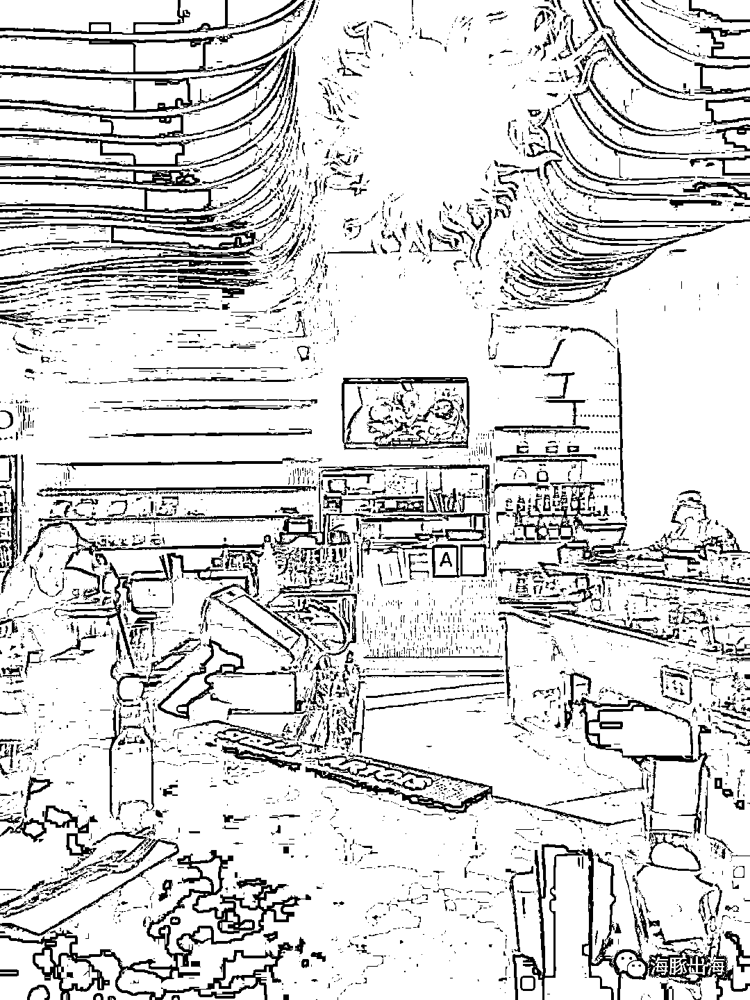</ne-card></ne-p> <ne-p id="u55101cb1" data-lake-id="u55101cb1"><ne-text id="u8134b6e7">当时我想着他在美国熟悉当地的生活习惯，他负责选品，我负责运营。</ne-text></ne-p> <ne-p id="u62b25160" data-lake-id="u62b25160"><ne-text id="ueaa74f35">第一年准备开店，进货，上架了几个 listing，基本上都是在熟悉平台，</ne-text></ne-p> <ne-p id="uddff80b6" data-lake-id="uddff80b6"><ne-text id="ua9dff7e0">到了 2018 年上半年，我们做了一款带 LED 灯的插座盖板，拿货价很便宜，但是可以卖到 29.99 美金，链接刚上架一天就可以有一百来个订单，卖了大概半年就被 Snappower 告了，原来侵权了他们的专利，那时候平台就只给了警告并且删了我们链接。</ne-text></ne-p> <ne-p id="ue8310fe4" data-lake-id="ue8310fe4"><ne-card data-card-name="image" data-card-type="inline" id="aQd1l" data-event-boundary="card"></ne-card></ne-p> <ne-p id="ub8bf8cc9" data-lake-id="ub8bf8cc9"><ne-text id="u615f30eb">2018 下半年的时候，我们做了一款 ACK 的户外折叠刀，很多户外刀都是抄袭国外的一些品牌款式，由于 ACK 是意大利的，在美国没有专利，所以我们那时候卖的非常火，拿货价十几块一把，可以卖二十几美金，体积小，重量又轻，</ne-text></ne-p> <ne-p id="u91f1959b" data-lake-id="u91f1959b"><ne-text id="u3a52ae7e">差不多卖了半年的时候，平台开始扫主图，说是刀尖太尖了，于是链接被删了，但是我们反反复复的上，基本上能卖一段时间再被下掉，后面平台加大了力度，基本上一上上去就被抓到了主图。</ne-text></ne-p> <ne-p id="u0760b074" data-lake-id="u0760b074"><ne-card data-card-name="image" data-card-type="inline" id="ZEAX3" data-event-boundary="card">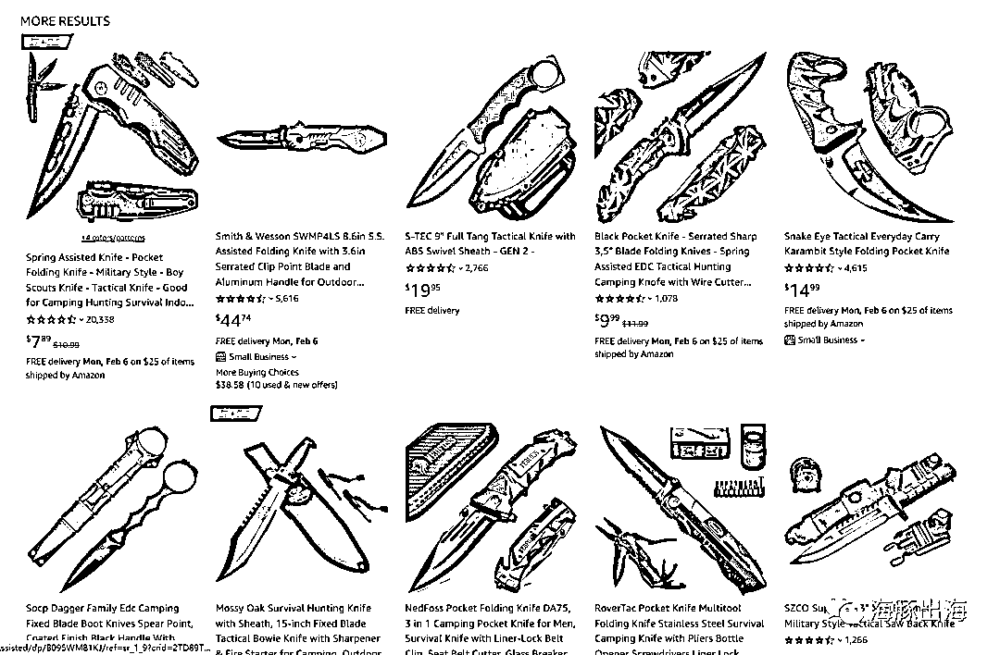</ne-card></ne-p> <ne-p id="u4c9342b0" data-lake-id="u4c9342b0"><ne-text id="u93780776" style="color: rgb(0, 82, 255);">就这样我们靠这几个产品从 2018－2019 年差不多小挣了 200W 多点。</ne-text></ne-p> <ne-p id="ue0039057" data-lake-id="ue0039057"><ne-text id="u8b3b4bf2">2019 年我们就开始跟一些热门的产品，像背背佳利润很好，我们用测评资源一个链接第一个月就怼了 200 多个好评，随着出单量加大，产品质量不好，开始掉评，评论掉到 3.5 个星，两三千个评论，后面实在救不活就放弃了，前前后后这款产品至少亏了四五十 W。</ne-text></ne-p> <ne-p id="u12762dfe" data-lake-id="u12762dfe"><ne-text id="u467e45f5">后面我们陆陆续续上了同样类似的热品，像游戏手柄，卷发棒,热风梳，计数跳绳，到后面的锻炼拉力带等，都是一些当时看着数据表现不错，我认为以我们的资源可以打上去的“热品”，</ne-text></ne-p> <ne-p id="u7f696e57" data-lake-id="u7f696e57"><ne-text id="u93cede19" style="color: rgb(0, 82, 255);">但是事与愿违我们亏了很多，加上后面二刷死店铺没申诉回来，结果把之前挣的全亏进去了。</ne-text></ne-p> <ne-p id="u43e6ee14" data-lake-id="u43e6ee14"><ne-text id="u6e870528" ne-bold="true">亚马逊失败小结：</ne-text></ne-p> <ne-p id="u1f041abe" data-lake-id="u1f041abe"><ne-text id="ub8f2387c">1）</ne-text><ne-text id="ua6ed6d9d" style="color: rgb(255, 0, 0);">没有链接沉淀，缺乏长期主义</ne-text><ne-text id="u539ce9eb">，早期平台红利期的时候，很多政策不够严格，我们还可以玩一下擦边球的打法，随着平台越来越严格，还停留在臆想中没及时转变。</ne-text></ne-p> <ne-p id="ua9948fa1" data-lake-id="ua9948fa1"><ne-text id="uaf2dfaf2">2）</ne-text><ne-text id="u6a9a3051" style="color: rgb(255, 0, 0);">产品为王是经历失败后才深刻感悟</ne-text><ne-text id="ub42811cf">，对平台的认知当时没跟上，选品时看着数据好，难道其他人没看到数据？最后只能拼谁抗得住卷。</ne-text></ne-p> <ne-p id="ucabb8c3c" data-lake-id="ucabb8c3c"><ne-text id="ue0a6d15e">3）</ne-text><ne-text id="u4be4787f" style="color: rgb(255, 0, 0);">从不同品类拿货模式始终没有沉淀出一个垂直类目，或是有供应链优势的产品线</ne-text><ne-text id="u6da1f27e">，如果有</ne-text><ne-text id="ueaf46283" style="color: rgb(0, 0, 0);">产品壁垒</ne-text><ne-text id="u5d77a610">，我们的产品别人想跟进至少需要几个月时间，而不是这种拿货模式，谁都可以拿到。</ne-text></ne-p> <ne-p id="u2b3c4f7e" data-lake-id="u2b3c4f7e"><ne-text id="ud5f6d021">亚马逊失败后，这时候已经没钱维持继续运营了，一个月的仓储费都让我们很头疼，所以扔掉一些，然后线下收库存处理了一些，剩下卷发棒还有热风梳还有些库存在亚马逊，</ne-text></ne-p> <ne-p id="ua21e147c" data-lake-id="ua21e147c"><ne-text id="u1bb8126a">那时候知道站外推广，但是没有深入，于是找了个站外服务商说 500 发 20 个群，试了两次也没出多少单。</ne-text></ne-p> <ne-p id="ud2c114ff" data-lake-id="ud2c114ff"><ne-text id="u7ffad842">出于节约成本我决定自己做，跟我美国合伙人一商量，他说他经常混迹很多 facebook 群和 Deal 站，我们就开始自己联系开发了一些群组，像 Sweet Deals Finder 之前的主群 80 多万粉丝，效果很好，8 美金一个帖子，加上一些其他的群组，我们持续放了 2 个月，把剩下都清完了，回款十几个 W，挽回了一些损失。</ne-text></ne-p> <ne-p id="ud51c369a" data-lake-id="ud51c369a"><ne-card data-card-name="image" data-card-type="inline" id="qwxIW" data-event-boundary="card"></ne-card></ne-p> <ne-p id="ua57f6baa" data-lake-id="ua57f6baa"><ne-text id="ubf4885bc" style="color: rgb(117, 117, 118);">（Sweet 主群挂了，图片为现在的副群）</ne-text></ne-p> <ne-p id="u571df1ae" data-lake-id="u571df1ae"><ne-text id="ubaf825b9" style="color: rgb(0, 82, 255);">后面我们清完货后，对亚马逊还抱有希望，可是又没资金继续从头再来一次，这时候回去上班还是不甘心！</ne-text></ne-p> <ne-p id="ubc39c81e" data-lake-id="ubc39c81e"><ne-text id="u62121eaf" style="color: rgb(0, 82, 255);">创业? 我的</ne-text><ne-text id="ufe10d168" style="color: rgb(0, 42, 252);">第三次创业就是做了站外推广服务商！</ne-text></ne-p> <ne-p id="u8364e5ab" data-lake-id="u8364e5ab"><ne-text id="u14cdd614">偶然一次机会在一个群里看到一个卖家在找测评申诉服务商，因为一刷，我还是很有把握就接下了下来并且顺利帮他救回了店铺而且只收了 1000 块，他参加了好多培训，觉得我靠谱就把我推荐到了各种培训机构的内部群，结果一下子来了好多客户，由于我之前玩骚操作比较多，对各种类型申诉都比较熟悉，生意越做越好。</ne-text></ne-p> <ne-p id="u858b5ec9" data-lake-id="u858b5ec9"><ne-text id="udd171e60" style="color: rgb(33, 33, 34);">做习惯了卖家后转型做服务商就老会站在卖家角度考虑问题，申诉虽然利润不错，但是就是靠信息差，而且是在人家最困难遇到问题的时候挣钱不是自己想做的事情，也不是说清高啥的，平常朋友有需要帮助的我都很仗义，</ne-text><ne-text id="u04cc1ff7" style="color: rgb(0, 42, 252);">平常也总想着能力所能及做点有意义的事情, 就想做个靠谱的服务商。</ne-text></ne-p> <ne-p id="u57106260" data-lake-id="u57106260"><ne-card data-card-name="image" data-card-type="inline" id="wToX0" data-event-boundary="card">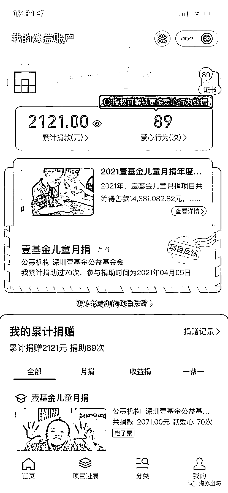</ne-card></ne-p> <ne-p id="ud2938112" data-lake-id="ud2938112"><ne-text id="ua030f615">因为经常有客户问我们做不做站外，加上想到之前做站外清货，尝到了一些甜头，有些产品站外打折后还能有几美金利润。</ne-text><ne-text id="ucfb74780" style="color: rgb(0, 42, 252);">而且我们相信当平台广告费越来越贵以后站外一定是个发展趋势，于是放弃申诉彻底转型做站外推广服务商。</ne-text></ne-p> <ne-p id="ue664a3c7" data-lake-id="ue664a3c7"><ne-text id="ub53236cc">卖家转型过来，不熟悉其他站外服务商操作流程，总觉得我是卖家的话肯定希望能做站外效果付费，就这样差不多坚持了一年，到后面站外做的人越来越多，效果不如从前，基本上没什么利润了，还有些连续推了一个月不付款的，后面开始跟别的服务商一样做套餐付费。</ne-text></ne-p> <ne-p id="u677ba50a" data-lake-id="u677ba50a"><ne-text id="ua45bb51a" style="color: rgb(0, 42, 252);">下面从服务商的角度跟大家聊聊怎么做站外推广,内容虽然有点枯燥，但是绝对是干货。</ne-text></ne-p> <ne-p id="u28734584" data-lake-id="u28734584"><ne-text id="u60befdb5" ne-bold="true">站外推广到底是什么？</ne-text></ne-p> <ne-p id="u595c0626" data-lake-id="u595c0626"><ne-text id="ued93997a">我们要了解亚马逊站外推广，我们首先需要熟悉下亚马逊联盟。</ne-text></ne-p> <ne-p id="u7eadfad8" data-lake-id="u7eadfad8"><ne-text id="u46a1766b" style="color: rgb(0, 42, 252);">亚马逊联盟</ne-text><ne-text id="u98e48cfa">是世界上最大的也是最早的联盟营销计划之一。亚马逊联盟营销计划可以帮助内容创造者，发行者和博主们，通过流量获利。亚马逊上有数百万的产品，联盟伙伴可以通过简单的链接（像我们熟悉的社媒链接）构建工具，将其受众引导至他们推荐的产品，并从符合条件的购买（比如使用了联盟链接）中获利。</ne-text></ne-p> <ne-p id="u701d4b1e" data-lake-id="u701d4b1e"><ne-card data-card-name="image" data-card-type="inline" id="HIKks" data-event-boundary="card">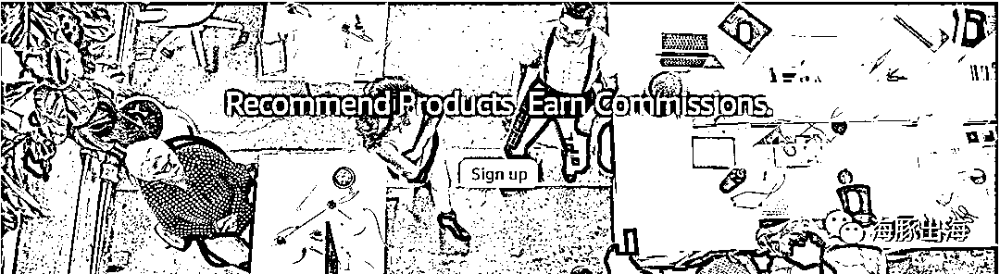</ne-card></ne-p> <ne-p id="u8e8c604d" data-lake-id="u8e8c604d"><ne-text id="uf6880bf0">亚马逊联盟中：亚马逊提供平台，联盟内容创造者-如 Facebook 群组管理员，社媒红人，亚马逊影响者等提供流量，卖家提供产品，这三者构建成了联盟营销生态。所以不要再说站外推广没有用，亚马逊每年都花费大量的推广费在站外寻找流量。</ne-text></ne-p> <ne-p id="u1ee46cc8" data-lake-id="u1ee46cc8"><ne-card data-card-name="image" data-card-type="inline" id="Qnh6Z" data-event-boundary="card"></ne-card></ne-p> <ne-p id="u18358c3e" data-lake-id="u18358c3e"><ne-text id="u359e73b2">在早期，亚马逊需要发展壮大，最主要的是通过联盟客（内容创造者和博主）把流量引导平台，他们给联盟客的奖励力度很大，开始博主主要是通过创建群组搬运亚马逊自营的产品给到她们的粉丝，后面平台推出社交媒体折扣，</ne-text></ne-p> <ne-p id="u1c740502" data-lake-id="u1c740502"><ne-text id="uf79c5127">当我们后台创建折扣时，平台会将折扣分享到亚马逊联盟，很多博主也主动转发卖家自己创建的联盟链接，这期间博主还主要是靠亚马逊返佣获利，但是随着越来越多卖家主动联系博主，他们开始向卖家收费，比如每发一个帖子多少美金。这就变成了我们现在的亚马逊推广的主要方式。</ne-text></ne-p> <ne-p id="u2171dcae" data-lake-id="u2171dcae"><ne-card data-card-name="image" data-card-type="inline" id="J8EJH" data-event-boundary="card">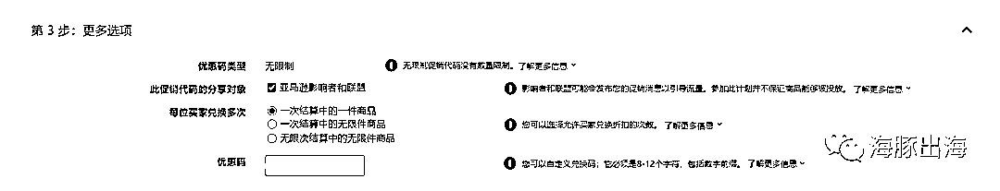</ne-card></ne-p> <ne-p id="u04119f60" data-lake-id="u04119f60"><ne-text id="u45ac4f0a" ne-bold="true">我们为什么要做站外推广？</ne-text></ne-p> <ne-p id="u13bdb33c" data-lake-id="u13bdb33c"><ne-text id="ufd323a4d" ne-bold="true">1\. 辅助亚马逊运营</ne-text></ne-p> <ne-p id="u00f886bb" data-lake-id="u00f886bb"><ne-text id="ue96a65e0">怎么通过站外推广配合亚马逊站内运营？下面我给大家提供几个思路：</ne-text></ne-p> <ne-p id="u2ac972e6" data-lake-id="u2ac972e6"><ne-text id="u12054b91" ne-bold="true">a: 激活链接：</ne-text><ne-text id="u98ab522b">当新品上架广告不出单的情况下，我们是否可以先站外折扣出单激活链接？</ne-text></ne-p> <ne-p id="u60f1e451" data-lake-id="u60f1e451"><ne-text id="uf774a2ea" ne-bold="true">b: 配合站内活动：</ne-text><ne-text id="u8a3edddf">站在运营的角度，秒杀前做站外可以拉伸排名使秒杀效果更好，秒杀后通过站外去延长出单时间，这样能更快的让链接推起来。</ne-text></ne-p> <ne-p id="u8f2ae4c0" data-lake-id="u8f2ae4c0"><ne-text id="uf752ffdf" ne-bold="true">c：出单索评：</ne-text><ne-text id="ufcca3510">站外因折扣大，价格低，相对站内给好评的概率更大。</ne-text></ne-p> <ne-p id="ue2f22aab" data-lake-id="ue2f22aab"><ne-text id="u2358e91b" ne-bold="true">d: 维护老链接排名：</ne-text><ne-text id="u7e33226a">系统对每个排名阶段给的自然流量都是固定的，当我们想上升到上一个排名阶段，我们必须长期维持上一个流量池所需要的单量。</ne-text></ne-p> <ne-p id="uf045594f" data-lake-id="uf045594f"><ne-text id="ue0256b74" ne-bold="true">e: 稀释评论：</ne-text><ne-text id="uc8f1f20e">尽管亚马逊这两年对刷单抓的很严，但是依旧有卖家通过一些其他方法去刷单留评，而站外的大量出单正好可以稀释留评率，降低风险。且因为价格低，还能稀释退货率。</ne-text></ne-p> <ne-p id="u6ec01d35" data-lake-id="u6ec01d35"><ne-text id="ud294f460" ne-bold="true">f: 站外也能挣钱的产品：</ne-text><ne-text id="u7ebe5791">现在依然有一些利润高，站外打了折还能赚钱的产品，那为何不通过站外大量发帖吸引出单，不仅能赚钱还能维持站内的排名，一举两得。</ne-text></ne-p> <ne-p id="u3c779f60" data-lake-id="u3c779f60"><ne-text id="u38606ba4" ne-bold="true">g: 绑定 FBT：</ne-text><ne-text id="u160cf9ff">分析互补的产品做了哪些站外渠道，然后投放同样的渠道就有可能跟互补的 BS 链接绑定在一起。</ne-text></ne-p> <ne-p id="u1cc34934" data-lake-id="u1cc34934"><ne-text id="u76314dbe" ne-bold="true">从平台角度来看，能从站外引流给平台带来客户并成交，平台能挣钱，自然就会给链接加权。</ne-text></ne-p> <ne-p id="u995cf797" data-lake-id="u995cf797"><ne-text id="u57f15304" ne-bold="true">2\. 清库存</ne-text></ne-p> <ne-p id="u3e180e43" data-lake-id="u3e180e43"><ne-text id="uf8c342e8">常规清库存的方法有几个：</ne-text></ne-p> <ne-p id="u6a72f821" data-lake-id="u6a72f821"><ne-text id="u67304994" ne-bold="true">a.平台的活动：</ne-text><ne-text id="u1e8daed3">例如 Outlets,但是很难等着出现，这么多产品一段时间才有那么几个，很难选上，就算等上了出单效果也不一定好，不建议等，仓储费的消耗摆在这。</ne-text></ne-p> <ne-p id="u7df711a3" data-lake-id="u7df711a3"><ne-text id="ud3e261e9" ne-bold="true">b.线下收库存：</ne-text><ne-text id="u62692de9">基本上一折左右清，很容易踩坑，现在越来越挑了，价值不是很高的话基本上很难。</ne-text></ne-p> <ne-p id="u7e9e154b" data-lake-id="u7e9e154b"><ne-text id="u9fca0db7" ne-bold="true">c.站外清库存：</ne-text><ne-text id="u2fd75cdc">有些产品有可能站外放出去还能有利润，比如我们之前做的卷发棒，还有去年比较热的水弹玩具枪。</ne-text></ne-p> <ne-p id="u0fcf759a" data-lake-id="u0fcf759a"><ne-text id="ub70702ee">站外清库存的时候我们一般折扣力度都做的很大，这时候只要注意折扣叠加问题，避免不必要的损失。</ne-text></ne-p> <ne-p id="u40af8974" data-lake-id="u40af8974"><ne-text id="u12765536" ne-bold="true">3\. 打造品牌</ne-text></ne-p> <ne-p id="u45f6d024" data-lake-id="u45f6d024"><ne-text id="u20a99d39">现在亚马逊站内广告太贵了，增长速度太快，利润空间严重压缩，以前亚马逊好做是因为信息差：卖家少，平台需要丰富品类，亚马逊也不是天生自带流量，也是靠联盟从站外把流量引过来然后亏本给到卖家。</ne-text></ne-p> <ne-p id="ua48dbfcc" data-lake-id="ua48dbfcc"><ne-text id="u24c0a461" style="color: rgb(0, 42, 252);">现在亚马逊不好做是因为信息差已经过去了，平台已经不缺同质化产品，当首页那些评论多的产品已经满足了买家的需求，你一个新品如何突破流量池？哪怕你的产品再特别，买家看不见，不了解又如何产生购买？当平台需要靠广告费收割，这时候我们只能自己从站外去引流。</ne-text></ne-p> <ne-p id="u73bbd1c8" data-lake-id="u73bbd1c8"><ne-text id="u0b26fc87">而品牌是最好的流量池，品牌是自带流量的，是赢得人心的结果，当亚马逊做到最后大家都有深刻的品牌意识，站外推广的终局应该是往品牌去走，说白了，目前我们所做的流量推广基本上都是为了辅助亚马逊的，并不是脱离亚马逊，把亚马逊当做一个成交平台而已，自己推广获取品牌流量。像亚马逊上的苹果耳机，耐克等，这些品牌都不是依赖于平台给的流量。</ne-text></ne-p> <ne-p id="u49e46e14" data-lake-id="u49e46e14"><ne-text id="uf4b3173b" style="color: rgb(0, 42, 252);">推广是一条漫长的路，酒香还怕巷子深，当平台没有了流量红利，大浪淘沙留存下来的产品更需要好好推广，我们比以往更需要耐心!</ne-text></ne-p> <ne-p id="u4cc78107" data-lake-id="u4cc78107"><ne-text id="u508fe2d9" ne-bold="true">站外推广有哪些渠道？</ne-text></ne-p> <ne-p id="uda98198a" data-lake-id="uda98198a"><ne-text id="u9f2d2436">其实我们可以把这些内容创造者或博主分为两种，一种是泛流量的，这种更多的偏向于大折扣，出单量，这是目前市面上主要的渠道；另一个是垂直类目的，垂直的受众更精准，粉丝质量也高，但是更多是基于需求和品牌，目前这种更多倾向于品牌曝光，所以往往更多用于打造品牌渠道之一。</ne-text></ne-p> <ne-p id="u12ebddf7" data-lake-id="u12ebddf7"><ne-text id="ufe67d57a">我们可以把上面两种成为</ne-text><ne-text id="u9344db5b" ne-bold="true">流量推广</ne-text><ne-text id="udc7ce2e2">和</ne-text><ne-text id="uc35c850b" ne-bold="true">品牌推广</ne-text></ne-p> <ne-p id="u4d0f681a" data-lake-id="u4d0f681a"><ne-text id="uc02ce290" ne-bold="true">1\. 流量推广</ne-text></ne-p> <ne-p id="u27d3140b" data-lake-id="u27d3140b"><ne-text id="ua920dcb2" ne-bold="true">a.FB 群组:</ne-text><ne-text id="u21d185e9">群组创建之初都是通过这种方式分享给自己认识的亲朋好友，这跟国内的 wei 商有点类似，渐渐的他们会联合一些其他的博主（往往这些博主都是不同品类的）大家一起分工去运营壮大好群组，有的负责专门拉粉丝，其实叫拉人头更好，因为这种模式注定后面就没有粉丝粘性，所以不应该称之为粉丝。有的专门负责发帖，不断丰富产品满足大部分群员的需求，才能通过群员人带人的方式壮大群组。</ne-text></ne-p> <ne-p id="u597ff642" data-lake-id="u597ff642"><ne-text id="u1e7a99d8">群组的特点是</ne-text><ne-text id="uc56c874f" ne-bold="true">方便，快速</ne-text><ne-text id="u0d363147">，通过发布大量的帖子，博取出单概率，但是单价低且分佣的管理员多，所以他们必须通过不同产品，满足群员来激活群组的活跃度，如果单一只是发同样类目的产品，一年也买不了多少次，从亚马逊拿到的佣金完全不够几个管理员分，所以大部分群组都是综合群，满足群员大部分需求，让他们每天都活跃，管理员就更挣钱。这也是为什么垂直类目群组很少的原因。</ne-text></ne-p> <ne-p id="u7dce000a" data-lake-id="u7dce000a"><ne-card data-card-name="image" data-card-type="inline" id="o5Npd" data-event-boundary="card"></ne-card></ne-p> <ne-p id="u9ff93645" data-lake-id="u9ff93645"><ne-text id="u6d7d6713" style="color: rgb(126, 169, 195);">FB 群组是最方便快捷的一个渠道，往往群员的需求是想找到合适便宜的产品，发展到现在，折扣基本上都是 40%OFF 起步了。</ne-text></ne-p> <ne-p id="u33d39459" data-lake-id="u33d39459"><ne-text id="udced17b4" ne-bold="true">b.FB 主页</ne-text></ne-p> <ne-p id="u41b8e4e3" data-lake-id="u41b8e4e3"><ne-card data-card-name="image" data-card-type="inline" id="FemEr" data-event-boundary="card">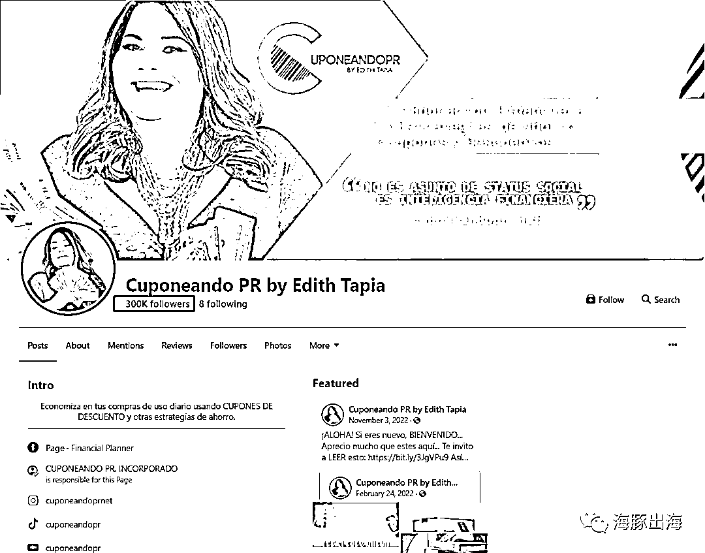</ne-card></ne-p> <ne-p id="uf2dd56c3" data-lake-id="uf2dd56c3"><ne-text id="ubbb8494a">有些 Facebook 主页是专门为群组服务的，但是还有一些只经营自己主页，她们通过收集粉丝建议，发布一些粉丝需要的折扣产品快速涨粉以及增加粘性，这类主页一般发帖量不会很大，粉丝粘性比群组强很多，同等粉丝量的情况下一般效果都比群组好很多，其实这些才是真正的 FB 博主，很多服务商把普通管理员也成为 FB 博主或红人。</ne-text></ne-p> <ne-p id="u75db412d" data-lake-id="u75db412d"><ne-text id="u72a2a292" ne-bold="true">c.Deal 站</ne-text></ne-p> <ne-p id="u3a7d94d8" data-lake-id="u3a7d94d8"><ne-text id="uffebd007">因为 FB 群组可能有被封的风险。有些博主会创建一个网站，专门发布促销折扣，现在很多群组都开始做自己的推广网站，app 等。这种网站的特点是偏向一些类目，比如电子，玩具，母婴等。Deal 站因为受众人群男女比较平均，且有的老牌网站流量大，发帖的价格都比较贵，适合客单价高或者清货需求的卖家。</ne-text></ne-p> <ne-p id="u81338f4f" data-lake-id="u81338f4f"><ne-card data-card-name="image" data-card-type="inline" id="nxqJ8" data-event-boundary="card"></ne-card></ne-p> <ne-p id="udc3f90ad" data-lake-id="udc3f90ad"><ne-text id="u7ccb68c8">常见的一些 Deal 站如 Slickdeals，Dealnews，1sale，Techbargains 收费都在几十到几百美金不等，编辑对链接的要求甚至店铺的要求都比较高。</ne-text></ne-p> <ne-p id="u140a24ab" data-lake-id="u140a24ab"><ne-text id="u18662392" ne-bold="true">2\. 品牌推广</ne-text></ne-p> <ne-p id="ubc1a66ee" data-lake-id="ubc1a66ee"><ne-text id="u0ac2e564">人人都想做品牌，相信大部分做亚马逊的卖家都想往品牌走，累了困了，喝东鹏特饮，果冻就吃喜之郎，耐克的 Just do it，这些耳熟能详的广告语品牌都是花了几个亿广告费才占据消费者心智。</ne-text></ne-p> <ne-p id="u2f9e5c0b" data-lake-id="u2f9e5c0b"><ne-text id="u95549a45">当我们需要品牌出海的时候最容易触达到消费者心且不牺牲品牌调性有哪些渠道？</ne-text></ne-p> <ne-p id="u6e2648b1" data-lake-id="u6e2648b1"><ne-text id="u93f24a0d" ne-bold="true">a.PR 软文：</ne-text></ne-p> <ne-p id="ucb3e1942" data-lake-id="ucb3e1942"><ne-text id="u3c88a785">包括新闻网站，行业网站，主要是发布新闻通稿或者做一些产品评测。</ne-text></ne-p> <ne-p id="uc1741125" data-lake-id="uc1741125"><ne-card data-card-name="image" data-card-type="inline" id="uI2iF" data-event-boundary="card">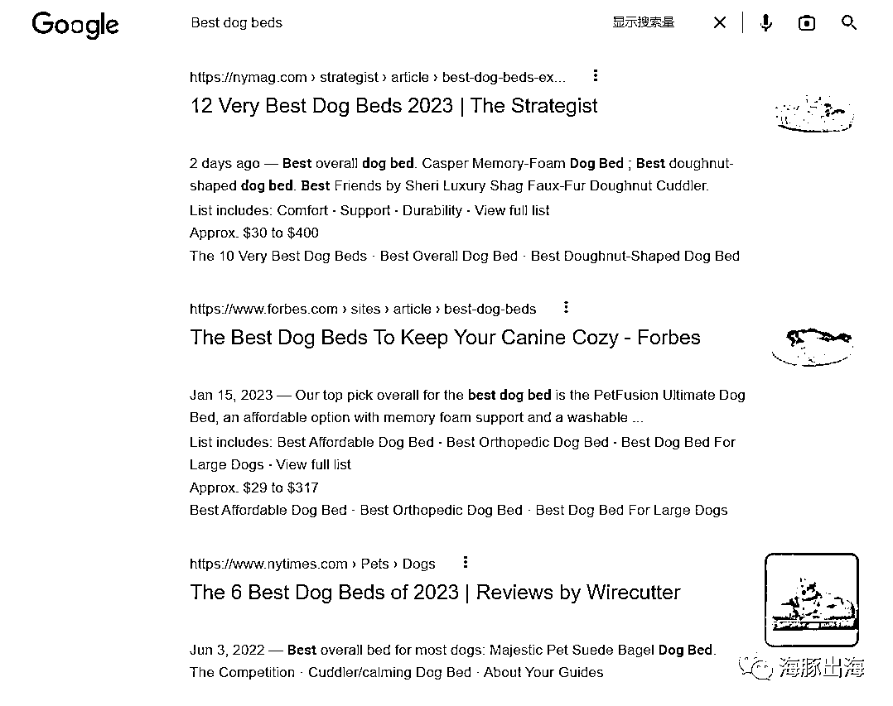</ne-card></ne-p> <ne-p id="u173f5ab9" data-lake-id="u173f5ab9"><ne-text id="u2a3e3cbb" ne-bold="true">b.KOL-网红营销:</ne-text></ne-p> <ne-p id="udc0800b3" data-lake-id="udc0800b3"><ne-text id="u1b2184ea">国外社媒主要是 FB 主页，Youtube, Instagram 这几个平台红人。</ne-text></ne-p> <ne-p id="u23889340" data-lake-id="u23889340"><ne-text id="u59cd5a08">关键词搜索是最常用的手段，大部分用户在 Youtube 上也是通过关键词搜索，找到自己想要的视频。我们在开发的时候尽量模拟真实用户的搜索场景。</ne-text></ne-p> <ne-p id="u970c7681" data-lake-id="u970c7681"><ne-text id="ubfc7cac8">网红的粉丝往往粘性很强，我是一个平常很少购物的人，很喜欢樊登老师，所以经常在他直播间买书。粉丝往往会因为对红人的偏爱产生消费，或者因为红人的种草，当我们对产品有需求的时候第一就会联想到这个品牌。因此这类推广效果往往可以持续非常长的时间，带来长期品牌影响力。</ne-text></ne-p> <ne-p id="u1341d73e" data-lake-id="u1341d73e"><ne-text id="u752a7b2d" ne-bold="true">c.众筹－－－通过单品引爆品牌</ne-text></ne-p> <ne-p id="u39b5f80d" data-lake-id="u39b5f80d"><ne-text id="u17767cc3">我们可以去官方找 KICKSTARTER 或者 INDIGOGO 的工作人员，提交资料给他们审核就行</ne-text></ne-p> <ne-p id="u4032e2c9" data-lake-id="u4032e2c9"><ne-card data-card-name="image" data-card-type="inline" id="zBYKa" data-event-boundary="card">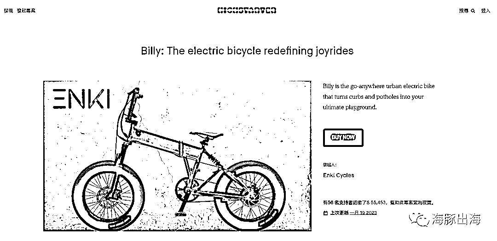</ne-card></ne-p> <ne-p id="u474b2311" data-lake-id="u474b2311"><ne-text id="u6f3836ed">众筹首先得有个好产品，并且是足够创新的产品，我们一般会在产品上线前 2 个月提交资料（ID 设计图，3D 结构图等）给到官方编辑，上线后开始预售，这时候我们需要导流到平台。</ne-text></ne-p> <ne-p id="u49db4392" data-lake-id="u49db4392"><ne-text id="u7ad0c67d">如果幻想官方直接给你流量，那就太天真了。平台是需要你看你导入了多少流量之后才会让你撬动平台流量。前期基本上靠自己导流，那怎么导流呢？</ne-text></ne-p> <ne-oli><ne-oli-i>1</ne-oli-i><ne-oli-c class="ne-oli-content" id="u0bba87ed" data-lake-id="u0bba87ed"><ne-text id="u29e1eed6">我们可以找一下垂直网红，给他们早鸟价格，通过挂链接把粉丝引流到众筹网页。</ne-text></ne-oli-c></ne-oli> <ne-oli><ne-oli-i>2</ne-oli-i><ne-oli-c class="ne-oli-content" id="u12d54bd5" data-lake-id="u12d54bd5"><ne-text id="u9b608cd4">在一些行业杂志或者网站上，写软文引流。</ne-text></ne-oli-c></ne-oli> <ne-oli><ne-oli-i>3</ne-oli-i><ne-oli-c class="ne-oli-content" id="u100df52b" data-lake-id="u100df52b"><ne-text id="u126139d4">参加 kickstarter 官方或者其他社区引流。</ne-text></ne-oli-c></ne-oli> <ne-p id="uf73e3d3f" data-lake-id="uf73e3d3f"><ne-text id="u51c4c1f8">众筹的成败就在前一周导流，如果不理想基本上第二周开始就凉凉了，也不要垂死挣扎了。</ne-text></ne-p> <ne-p id="u5def88f8" data-lake-id="u5def88f8"><ne-text id="u87583335">真正的网红基本上是垂直的，他们很在乎为粉丝带来真正的价值，所以他们往往需要寄产品给他们时间拍摄和使用，发布自己实测心得，而不是简单只发一个帖子，所以他们一般报价都比较高。</ne-text></ne-p> <ne-p id="u9c31c4d0" data-lake-id="u9c31c4d0"><ne-text id="ue8f4f6a3">但是网红的帖子往往代表粉丝所喜爱的网红对该品牌的偏爱，粉丝对品牌印象深刻，是常见的品牌推广使用渠道，但是因其受众精准，配合大一点的折扣力度，像一个几万粉丝的网红爆单也是很有可能的。当然如果一味追求单量就不建议尝试了。</ne-text></ne-p> <ne-p id="u8f4b3671" data-lake-id="u8f4b3671"><ne-text id="u35dcb9fc" ne-bold="true">站外推广找服务商还是自己做？</ne-text></ne-p> <ne-p id="ud672364c" data-lake-id="ud672364c"><ne-text id="u12455e9a">了解完怎么做站外之后，那到底应该找服务商做呢还是自己做？</ne-text></ne-p> <ne-p id="u6efa255c" data-lake-id="u6efa255c"><ne-text id="u3c7231d9">大部分卖家在刚开始接触站外推广的时候可能都会选择找服务商做，服务商的优点是省事，设置好折扣提交给到服务商就可以了。</ne-text></ne-p> <ne-p id="ue721253b" data-lake-id="ue721253b"><ne-text id="u0ff58aef" style="color: rgb(0, 42, 252);">但是服务商由于以下缺点限制了我们推广目的：</ne-text></ne-p> <ne-p id="u9b848d84" data-lake-id="u9b848d84"><ne-text id="u4b2f5459" style="color: rgb(0, 42, 252);">1.反馈打码，数据不透明，压根不知道发了哪些资源。</ne-text></ne-p> <ne-p id="u4fa62255" data-lake-id="u4fa62255"><ne-text id="u0275ac20" style="color: rgb(0, 42, 252);">2.单量集中在某一天，很难配合卖家推广目的。</ne-text></ne-p> <ne-p id="u78ffdbde" data-lake-id="u78ffdbde"><ne-text id="uf1a2ecd7" style="color: rgb(0, 42, 252);">3\. 没办法根据产品分析适合什么渠道。</ne-text></ne-p> <ne-p id="u9b6c1821" data-lake-id="u9b6c1821"><ne-text id="uc93e2fd5">这样就导致一旦效果不如预期，有些卖家就会不停的更换服务商，花钱试哪个服务商效果好，增加了成本。</ne-text></ne-p> <ne-p id="u1accf409" data-lake-id="u1accf409"><ne-text id="ufd6c2342">也有一些经常做站外的卖家，对站外推广比较熟悉，有时为了达到推广预期的效果，会同时找好几个服务商一起放，但是很多服务商的资源重叠，卖家相当于花了几份的钱达到一份的效果。</ne-text></ne-p> <ne-p id="uc4fb7f7d" data-lake-id="uc4fb7f7d"><ne-text id="uc82cdb6f">在这几年的服务商运营中，由于常常会站在客户角度考虑问题，和很多客户成了好朋友，经常有些客户叫我们帮忙分析他找其他服务商放了哪些渠道，结果分析来分析去发现资源重叠严重，还有很多老客户对站外推广也比较熟悉，并从不同的渠道了解到一些优质群组，因为时间和人员的关系，无法联系管理员发帖，于是找到了我们，想要指定群组发帖。</ne-text></ne-p> <ne-p id="uc5c51f2d" data-lake-id="uc5c51f2d"><ne-text id="u6a6c40d0" style="color: rgb(0, 42, 252);">我们慢慢开始和更多关系不错的老客户进行新的合作尝试，把客户想发的群组和我们认为不错的群组列在表格中，供客户根据每天预算挑选上贴，这个方法给一些经常研究站外做站外推广的卖家大大节省了推广费用并提升了效果。而我们也通过这种方式验证了许多群组适合的品类，同时还不必为了一次两次推广不佳而产生巨大的压力，这是一次双赢的合作。</ne-text></ne-p> <ne-p id="uf0e92db1" data-lake-id="uf0e92db1"><ne-card data-card-name="image" data-card-type="inline" id="b2FdL" data-event-boundary="card"></ne-card></ne-p> <ne-p id="u1021a5f1" data-lake-id="u1021a5f1"><ne-text id="uc83e94e9">我们发现其实大部分都想自己做站外，自己找资源去站外引流，想什么时候发就什么时候发，想发哪些资源就发哪些，想发多少发多少，只有自己能把控才能配合好运营打法，但是自己做又遇到以下问题: </ne-text></ne-p> <ne-oli><ne-oli-i>1</ne-oli-i><ne-oli-c class="ne-oli-content" id="u8ecb3a87" data-lake-id="u8ecb3a87"><ne-text id="uf0ddaeac" style="color: rgb(0, 42, 252);">站外需要花费大量时间去找资源，分析资源。</ne-text></ne-oli-c></ne-oli> <ne-oli><ne-oli-i>2</ne-oli-i><ne-oli-c class="ne-oli-content" id="ub7bc8168" data-lake-id="ub7bc8168"><ne-text id="u0f9b6fe6" style="color: rgb(0, 42, 252);">时差，晚上还要加班跟国外管理员对接发帖。</ne-text></ne-oli-c></ne-oli> <ne-oli><ne-oli-i>3</ne-oli-i><ne-oli-c class="ne-oli-content" id="u62b24b91" data-lake-id="u62b24b91"><ne-text id="u58e6e4a6" style="color: rgb(0, 42, 252);">有些群组已经关闭了私信入口，不再和新的卖家合作，联系不上。</ne-text></ne-oli-c></ne-oli> <ne-oli><ne-oli-i>4</ne-oli-i><ne-oli-c class="ne-oli-content" id="u6cbe630e" data-lake-id="u6cbe630e"><ne-text id="udfb8e589" style="color: rgb(0, 42, 252);">单个帖子费用高，产品不多的情况下价格不划算</ne-text></ne-oli-c></ne-oli> <ne-p id="u1d907336" data-lake-id="u1d907336"><ne-text id="uf013683b">如果是大团队，产品线丰富还好，花个一年半载慢慢积累，但是对于小团队，把大量的时间花在站外上真的划算吗？</ne-text></ne-p> <ne-p id="u8f5e9f7e" data-lake-id="u8f5e9f7e"><ne-text id="uc397feea" style="color: rgb(0, 42, 252);">基于这些卖家真正想自己掌握站外的需求，加上前面尝试把资源透明化用表格形式给到客户指定上贴，极大帮助了他们提升站外推广效果，我们想把这个很好的站外合作模式大量推广，帮助更多卖家达到站外推广目的，但是表格太繁琐了，很多客户并不喜欢，并且客服沟通量巨大，于是我们做成了网站的方式。</ne-text></ne-p> <ne-p id="u1a9902a9" data-lake-id="u1a9902a9"><ne-card data-card-name="image" data-card-type="inline" id="Enjd6" data-event-boundary="card">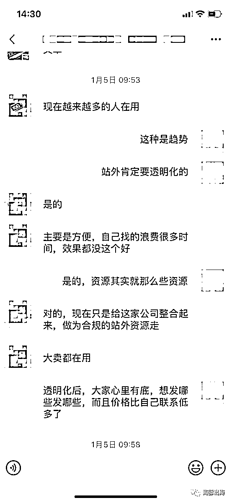</ne-card></ne-p> <ne-p id="u059b4249" data-lake-id="u059b4249"><ne-text id="u4e4c0b67">这个是我做的站外推广网站，大家感兴趣可以看看：</ne-text></ne-p> <ne-p id="u68c89a4d" data-lake-id="u68c89a4d"><ne-text id="u7c9ec900" ne-bold="true">海豚出海</ne-text></ne-p> <ne-p id="u8b151230" data-lake-id="u8b151230">[<ne-text id="u05f81974" ne-bold="true">www.haitunchuhai.com</ne-text>](http://www.haitunchuhai.com)</ne-p> <ne-p id="u0bcf3466" data-lake-id="u0bcf3466"><ne-text id="u5b9a133e">这个网站非常恰到好处的解决了资源，时间，成本问题，真正帮助卖家自己做站外。</ne-text><ne-text id="ud48ec780" style="color: rgb(255, 0, 0);">上面几百个 FB 群组和 Deal 站资源，透明给到大家使用</ne-text><ne-text id="u3e3c4aec">，网站根据每个群组受众，粉丝数，适合渠道等都标记的很清楚，提供了这么多丰富的资源同时极大的帮卖家节省了自己分析群组的时间，可以根据网站上每个群组的发帖要求，找到对应的群组下单发帖，几分钟就可以完成，然后第二天查看下反馈就行，大大节约了积累资源的时间，不需要花时间慢慢积累。</ne-text></ne-p> <ne-p id="u2ac7c4a3" data-lake-id="u2ac7c4a3"><ne-text id="u42160bcd">同时也不需要凌晨和管理员沟通，重点是上面几百个资源完全</ne-text><ne-text id="u5a8d2f87" style="color: rgb(255, 0, 0);">满足基本的发帖需求</ne-text><ne-text id="uf9674c71">，因为合作时间久，产品多，</ne-text><ne-text id="ub13c18c2" style="color: rgb(255, 0, 0);">价格比卖家自己联系管理员发帖还划算</ne-text><ne-text id="ub6287802">。真正做到省心又省钱。可以做很多以前只有自己站外团队才能实现的事情。</ne-text></ne-p> <ne-p id="u0a90cb49" data-lake-id="u0a90cb49"><ne-card data-card-name="image" data-card-type="inline" id="t0gpl" data-event-boundary="card">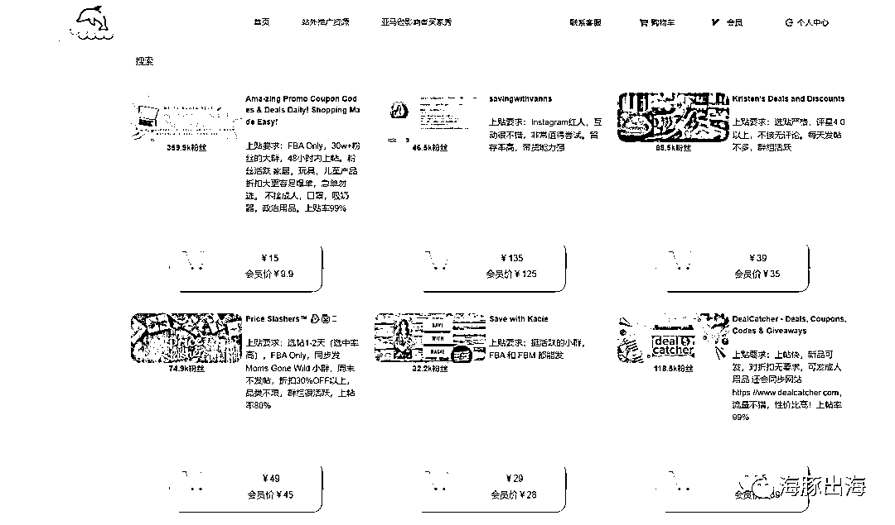</ne-card></ne-p> <ne-p id="u428882f2" data-lake-id="u428882f2"><ne-text id="uba3e12a6" style="color: rgb(255, 0, 0);">1\. 网站大大提升了效率，减少了人工成本，可以把这部分利润让给客户。</ne-text></ne-p> <ne-p id="u4c5e28f4" data-lake-id="u4c5e28f4"><ne-text id="uec367d2b" style="color: rgb(255, 0, 0);">2\. 同时我们跟管理员购买了大量帖子套餐，把上帖价格做到更低，有的 30w 粉丝的群组低至￥9.9，极大的降低了我们做站外的成本.</ne-text></ne-p> <ne-p id="u9fbcb4c9" data-lake-id="u9fbcb4c9"><ne-text id="u33987526" style="color: rgb(255, 0, 0);">3.所有资源透明化，自主选择，控制好多少，什么时候发，真正做到可以控量来配合推广目的。</ne-text></ne-p> <ne-p id="u31dafc1e" data-lake-id="u31dafc1e"><ne-text id="u97ef4916" style="color: rgb(255, 0, 0);">4\. 大大节省了时间成本，根据我们对群组分类标签，选好合适的群组，几分钟搞定，第二天查看反馈就行了。</ne-text></ne-p> <ne-p id="ua2cb970f" data-lake-id="ua2cb970f"><ne-text id="u710e4887" style="color: rgb(255, 0, 0);">海豚出海真正帮助卖家做到省时，省事，省钱。</ne-text></ne-p> <ne-p id="u43e56b46" data-lake-id="u43e56b46"><ne-text id="u7fe8365e" ne-bold="true">海豚出海网站实操案例： </ne-text></ne-p> <ne-p id="u53b978a8" data-lake-id="u53b978a8"><ne-text id="u6af1b9e7" ne-bold="true">案例一：</ne-text></ne-p> <ne-p id="uc63de04c" data-lake-id="uc63de04c"><ne-text id="u8f6bca62">一个群组或者 Ins 发帖就冲上了 BS（站外不可控因素较多，出单除了渠道的因素还有很多其他原因），极大降低站外试错成本，尝试站外的门槛得到极大的降低。</ne-text></ne-p> <ne-p id="uc9095912" data-lake-id="uc9095912"><ne-card data-card-name="image" data-card-type="inline" id="BOJUz" data-event-boundary="card">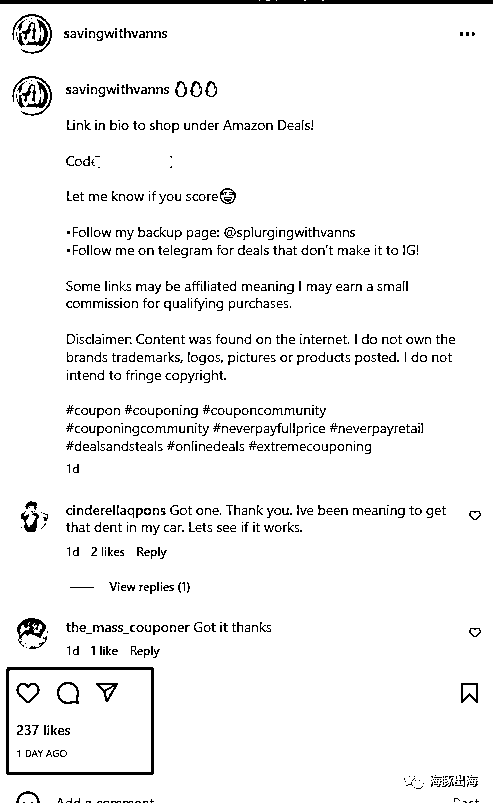</ne-card></ne-p> <ne-p id="ucfbd3a3b" data-lake-id="ucfbd3a3b"><ne-text id="u72cfe3fa" ne-bold="true">案例二：</ne-text><ne-text id="ud485e664" style="color: rgb(0, 42, 252);">尝试新的打法，不开广告只做站外推广</ne-text></ne-p> <ne-p id="uc0c391f9" data-lake-id="uc0c391f9"><ne-text id="ud4e1a3c9">Facebook 群组不可控因素多，同样的群组效果可能时好时坏。为了能达到推广目的，有些大卖每天下四五十个群组，我们粗略统计了一下，全部群组都下单一遍，加起来大概 3000+人民币，$400 左右，帖子大约 3 天左右上完。</ne-text></ne-p> <ne-p id="ue3139f7d" data-lake-id="ue3139f7d"><ne-text id="u610bd73d">可能是一个链接一天的广告费的一半，刨去一些群组挑产品不发帖，基本能达到 70%的上帖率，如果产品做了站外还有利润，这个玩法基本上每天都能带来 100 多单销量，</ne-text><ne-text id="u01a4afc6" style="color: rgb(0, 42, 252);">这样牛逼的站外玩法：1\. 单量稳定。2\. 站外回评率高，一天可以回四五个评论。</ne-text></ne-p>  <ne-p id="ua5e94334" data-lake-id="ua5e94334"><ne-card data-card-name="image" data-card-type="inline" id="L0Zbv" data-event-boundary="card"><ne-p id="u184b3b47" data-lake-id="u184b3b47"><ne-text id="u0fbb71e9" ne-bold="true">案例三：</ne-text><ne-text id="u9cc0cb73" style="color: rgb(0, 42, 252);">推新品</ne-text></ne-p> <ne-p id="uf3ee2399" data-lake-id="uf3ee2399"><ne-text id="u44834016">大家都知道现在亚马逊推新品难，因为品类已经很丰富了，亚马逊开始需要靠广告费收割，广告费太贵才是我们现在做亚马逊亚最大的门槛，但是平台需要保持广告的良性循环还是会扶持一部分新连接，一部分能让平台挣钱的链接。</ne-text></ne-p> <ne-p id="u3b0a4bf4" data-lake-id="u3b0a4bf4"><ne-text id="u89aeeba2" style="color: rgb(0, 42, 252);">产品确定后新品怎么推？</ne-text></ne-p> <ne-p id="u66818865" data-lake-id="u66818865"><ne-text id="u6e840265">从当前平台广告挣钱的逻辑：无非是广告+单量+评论，广告能给亚马逊带来巨大的利润，单量才是让亚马逊挣钱最直接的数据。评论是衡量链接能让亚马逊长期挣钱和买家满意度的标准？</ne-text></ne-p> <ne-p id="ue015f3cb" data-lake-id="ue015f3cb"><ne-text id="u18a37f6a">新品上架开少一点广告，就当交点保护费，新品广告基本上是很烧钱的，为了给我们奔头，亚马逊确实给了质量分这个概念，但是这么链接少了多少广告费才最后也就几个能脱颖而出，再说如果为了质量分，当我有数据之后我们人工干预（人为广告出单），质量分能不高？</ne-text></ne-p> <ne-p id="ub07dd7da" data-lake-id="ub07dd7da"><ne-text id="u5f58d50c" style="color: rgb(0, 42, 252);">重点在于搞单量（稳定持续的单量）和评论。</ne-text></ne-p> <ne-p id="u5c0f8721" data-lake-id="u5c0f8721"><ne-text id="uce20022c" style="color: rgb(0, 42, 252);">站内广告太贵，那站外目前来讲无疑是一个非常好的渠道，有了海豚出海这个网站，跟自己站外团队一样的，我们完全可以实现自己的打法，可以低成本的获取我们想要的单量并且索评，还有最牛逼的控单量。</ne-text></ne-p>  <ne-p id="ufee155c3" data-lake-id="ufee155c3"><ne-card data-card-name="image" data-card-type="inline" id="dXa3d" data-event-boundary="card"><ne-p id="ud20cc822" data-lake-id="ud20cc822"><ne-card data-card-name="image" data-card-type="inline" id="xpGOA" data-event-boundary="card"><ne-p id="u25e5036b" data-lake-id="u25e5036b"><ne-text id="u59353142">站外前</ne-text></ne-p>  <ne-p id="u892e16b6" data-lake-id="u892e16b6"><ne-card data-card-name="image" data-card-type="inline" id="TArHH" data-event-boundary="card"><ne-p id="uc0eba6b3" data-lake-id="uc0eba6b3"><ne-text id="u1722df53">站外后</ne-text></ne-p> <ne-p id="u63002056" data-lake-id="u63002056"><ne-text id="u98981252">这是一个卖家朋友分享的案例，上架一个月的新链接，在站内广告作用开始下降的时候，通过站外推广一天就从 5w 多名上升至 9k 多，每天通过站外辅助稳定链接在 Health 1W 名左右。</ne-text></ne-p> <ne-p id="u15556ca9" data-lake-id="u15556ca9"><ne-text id="u7e07cc90" ne-bold="true">海豚出海助力品牌出海</ne-text></ne-p> <ne-p id="u98f32897" data-lake-id="u98f32897"><ne-text id="ue63c49bf">从上线以来，大家对海豚出海的最深印象是便宜和资源丰富，在这么多优质的资源基础上其实便宜也是一种优势，平台本质是一个工具，构建一个卖家和管理员之间的一个沟通桥梁。</ne-text></ne-p> <ne-p id="u06b61545" data-lake-id="u06b61545"><ne-text id="u68a961c0" style="color: rgb(255, 0, 0);">网站建立的初心就是帮助大家解决资源，时间，成本问题，从卖家的角度，省下来的钱都是利润。</ne-text></ne-p></ne-card></ne-p></ne-card></ne-p></ne-card></ne-p></ne-card></ne-p></ne-card></ne-p>