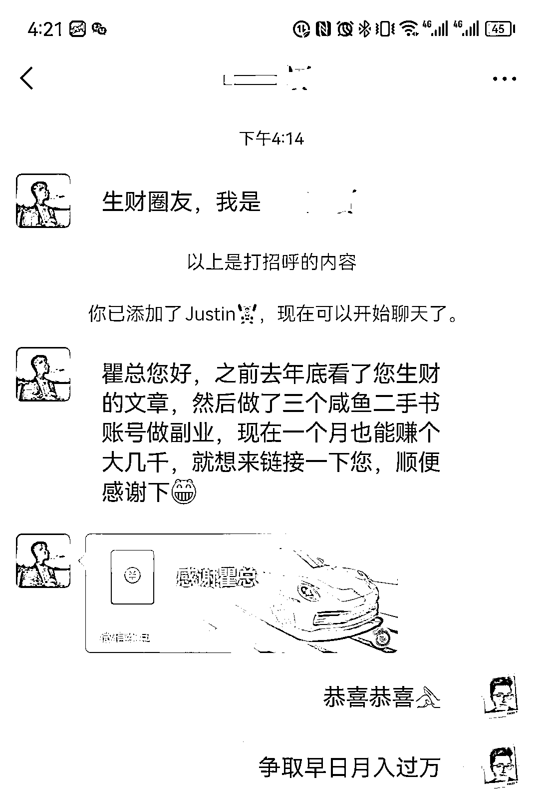
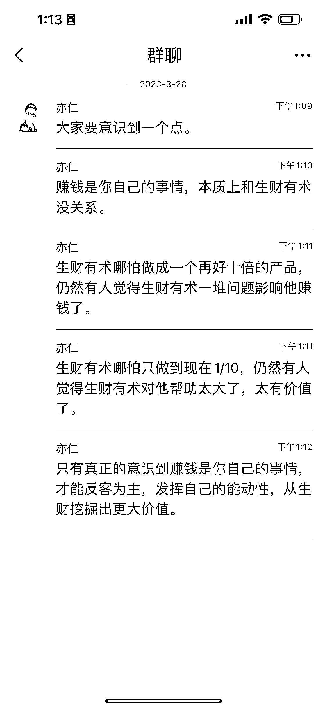

# 《聊聊你做闲鱼二手书项目失败的 100 种可能性》

> 原文：[`www.yuque.com/for_lazy/thfiu8/axfhgl6afwvxr3i0`](https://www.yuque.com/for_lazy/thfiu8/axfhgl6afwvxr3i0)

<ne-h2 id="349d8ebf" data-lake-id="349d8ebf"><ne-heading-ext><ne-heading-anchor></ne-heading-anchor><ne-heading-fold></ne-heading-fold></ne-heading-ext><ne-heading-content><ne-text id="uc27299fa">(121 赞)《聊聊你做闲鱼二手书项目失败的 100 种可能性》</ne-text></ne-heading-content></ne-h2> <ne-p id="ub821931d" data-lake-id="ub821931d"><ne-text id="u93975a9b">作者： 老瞿 Qu</ne-text></ne-p> <ne-p id="u39f6f9dc" data-lake-id="u39f6f9dc"><ne-text id="u3bef60fd">日期：2023-03-28</ne-text></ne-p> <ne-p id="u5d855139" data-lake-id="u5d855139"><ne-text id="u3b6db7fc">今天链接了一个生财的圈友，感觉生财的圈友是真的很猛，</ne-text><ne-text id="u3ec518f1" ne-bold="true">单凭一篇文章，就做到了副业月入大几 K，</ne-text><ne-text id="u73c08deb">感觉执行力如此到位的人，其实做什么项目都能赚到钱。</ne-text></ne-p> <ne-p id="u0acbe2e8" data-lake-id="u0acbe2e8"><ne-card data-card-name="image" data-card-type="inline" id="LECvL" data-event-boundary="card"></ne-card></ne-p> <ne-p id="uee68faac" data-lake-id="uee68faac"><ne-text id="ude7968e1">我赶紧去翻了一下我 12 月份到底发布了什么文章，应该就是这一篇了</ne-text></ne-p> <ne-p id="udc0e51f0" data-lake-id="udc0e51f0">[<ne-text id="u1eaf39f3">https://t.zsxq.com/0ciyE3Ktl</ne-text>](https://t.zsxq.com/0ciyE3Ktl)</ne-p> <ne-p id="uca5505aa" data-lake-id="uca5505aa"><ne-text id="ubc466159" ne-bold="true">你仔细看会发现，其实这篇文章简单到连一个操作流程都没有，只是一个风向标信息罢了，但圈友却做出了成绩。</ne-text></ne-p> <ne-p id="u7aab7d9f" data-lake-id="u7aab7d9f"><ne-text id="ub998432c">（如果大家对二手书有兴趣，可以去看看这个精华帖，3 月份写的更加详细：《深耕行业 2 年后，分享闲鱼二手书无货源、绝版二手书等 5 种项目玩法》</ne-text>[<ne-text id="u3d6a5158">https://t.zsxq.com/0cBUJMAri</ne-text>](https://t.zsxq.com/0cBUJMAri) <ne-text id="ufc9815ab">目前闲鱼已经开放入驻，在</ne-text><ne-text id="u7041ca7c" style="color: rgb(236, 40, 52);">闲鱼 APP-我的-认证招商</ne-text><ne-text id="ufa909d89">，就能看到入口）</ne-text></ne-p> <ne-p id="ucd9ab7b1" data-lake-id="ucd9ab7b1"><ne-text id="ueaeeb613" ne-bold="true">但今天我要给大家泼泼冷水，聊聊你做项目失败的 100 种可能性</ne-text><ne-text id="u3311382f">，因为我对二手书项目比较了解，其实其他项目基本上也差不多，如果你在生财还没有拿到成绩，你找找下面这些失败的原因中，有没有你的身影。</ne-text></ne-p> <ne-p id="u8943a407" data-lake-id="u8943a407"><ne-text id="u5770c816" ne-bold="true">NO.1  低估了一个项目的难度，心理准备不足</ne-text></ne-p> <ne-p id="u72deb6f8" data-lake-id="u72deb6f8"><ne-text id="uadd0d0ce">很多人一听，老瞿做二手书能年入百万了，感觉闲鱼也没有什么难度，于是就赶紧上手，很快就遇到了各种问题，然后十几天就开始焦虑，怎么没有什么订单，然后就放弃了。</ne-text></ne-p> <ne-p id="u538f6888" data-lake-id="u538f6888"><ne-text id="u3b12d3da">给大家说一个我看到的数据，市面上很多大佬，不是割韭菜的，是那种我很认可的生财大佬，很靠谱的大佬的训练营，一个月大几 K 的费用，</ne-text><ne-text id="u9567cdf8" style="color: rgb(236, 40, 52);">一个月下来，出单率不到 50%，月入过万的概率小于 10%。</ne-text></ne-p> <ne-p id="uc6e6c7b8" data-lake-id="uc6e6c7b8"><ne-text id="u50e3b299" style="color: rgb(38, 38, 38);">所以当你心理准备不足，把一个项目想的太简单的时候，坚持了十几天没有达到你预期的时候，你就很容易放弃，跌跌撞撞的骂一句</ne-text><ne-text id="uc6276f56" style="color: rgb(236, 40, 52);">『老瞿又吹牛逼了，根本就没有流量，没有订单』</ne-text></ne-p> <ne-p id="u3d29496f" data-lake-id="u3d29496f"><ne-text id="ud2e53d2b" style="color: rgb(236, 40, 52);">就好像做短视频带货的，哪个不干废过几个号，做闲鱼二手书也一样，谁没干废过几个号，谁没被封过几个号。</ne-text></ne-p> <ne-p id="u9773bf22" data-lake-id="u9773bf22"><ne-text id="u0c2b2bfb" ne-bold="true">NO.2  对平台的规则没有敬畏之心</ne-text></ne-p> <ne-p id="u18466306" data-lake-id="u18466306"><ne-text id="uc23de44c">这是一个信息爆炸的时代，也是一个浮躁的时代，很多人都想走捷径，比如干二手书，找个软件，批量铺货，一天下来几本违禁书，几个重复铺货的处罚后，直接封号 7 天。</ne-text></ne-p> <ne-p id="udadb8008" data-lake-id="udadb8008"><ne-text id="u2535f313">短暂的闲鱼二手书项目到此就结束了，我越发觉得，现在一些成熟的平台都在打击暴力的玩法，我们只有充分遵守平台的规则，他才可能让你赚到钱。</ne-text></ne-p> <ne-p id="ud80c5086" data-lake-id="ud80c5086"><ne-text id="uc75c78d1" ne-bold="true">NO.3 迷恋各种技术手段</ne-text></ne-p> <ne-p id="u42349faf" data-lake-id="u42349faf"><ne-text id="u9686ef78">遇到过很多做闲鱼二手书的人，包括我跟之前在生财分享过一篇精华帖的小嵩聊了聊，他也都是一本本手动上书的，我们工作室也是全部找大学生，精选图片上书的，而同时期开始，那些一开始就各种技术手段的人，都没有拿到太大的结果。</ne-text></ne-p> <ne-p id="ucb2a408b" data-lake-id="ucb2a408b"><ne-text id="uca895420" style="color: rgb(236, 40, 52);">有人会问为什么呢？举个例子，当用户来到闲鱼以后，第一步是搜索自己想要的一本书，会出现下图的界面。</ne-text></ne-p> <ne-p id="u48339356" data-lake-id="u48339356"><ne-card data-card-name="image" data-card-type="inline" id="vp8dk" data-event-boundary="card"></ne-card></ne-p> <ne-p id="ud31cef4a" data-lake-id="ud31cef4a"><ne-text id="u8bd7f85b">先思考下，如果是你，看到这样的界面，你会选择点击进入哪个链接呢?</ne-text></ne-p> <ne-p id="u204c5ff7" data-lake-id="u204c5ff7"><ne-text id="u089ba4ed">大概率大家会直接淘汰 1 和 3，在 2、4 里面选择一个点击进去，因为 1 和 3 一个想要都没有，价格还高，图片也没有亮点，选择 2 的理由，就是实拍图真实，而且还是热门榜，一般人都会有从众心理；选择 4 的理由，就是价格便宜，至少还有几个想要，图片看着也不错。</ne-text></ne-p> <ne-p id="u7b19ab1d" data-lake-id="u7b19ab1d"><ne-text id="u3ac2bf93" style="color: rgb(236, 40, 52);">而系统采集上架的图书：</ne-text></ne-p> <ne-p id="u6e5e16d3" data-lake-id="u6e5e16d3"><ne-text id="u9e7f9f8a" style="color: rgb(236, 40, 52);">1、质量基本上跟手动的存在较大的差距；</ne-text></ne-p> <ne-p id="udbbe1728" data-lake-id="udbbe1728"><ne-text id="u47907a6a" style="color: rgb(236, 40, 52);">2、批量铺货的人，一天上架几百本，也根本没有心情给一些商品稍微做点数据，比如抽几个商品点点想要；</ne-text></ne-p> <ne-p id="uca0732a8" data-lake-id="uca0732a8"><ne-text id="uca6b5f83" style="color: rgb(236, 40, 52);">3、批量铺货的人，更不可能在前期把价格压低，等有了销量和想要的数据后再慢慢涨价。</ne-text></ne-p> <ne-p id="ua63d5a66" data-lake-id="ua63d5a66"><ne-text id="u83004076" ne-bold="true">NO.4  苦苦的寻找货源</ne-text></ne-p> <ne-p id="ub20fe81b" data-lake-id="ub20fe81b"><ne-text id="u0f300af3">很多圈友都会问我一个问题，至少有几十个人问过，如下图所示：</ne-text></ne-p> <ne-p id="uf93b7553" data-lake-id="uf93b7553"><ne-card data-card-name="image" data-card-type="inline" id="nQpTw" data-event-boundary="card"></ne-card></ne-p> <ne-p id="u18c5a07e" data-lake-id="u18c5a07e"><ne-text id="u7d3054fe">更加奇怪的就是还有些人，通过各种途径去找货源，能想的方式他都想了，每天都在找，找的特别认真。</ne-text><ne-text id="u960cf0ff" ne-bold="true">其实一个很重要的点是他不敢面对销售额，通过找货源来麻痹自己，去逃避业绩压力，找到了还挺有成就感，关键呢，还是卖不出去。</ne-text></ne-p> <ne-p id="u4dd46432" data-lake-id="u4dd46432"><ne-text id="u33fe654b">创业 2 年我觉得，</ne-text><ne-text id="udcce240a" style="color: rgb(236, 40, 52);">今天是一个产品过剩的时代，对于小白来说，货源没有任何意义，把仅有的精力花在搞流量上，花在卖产品上，只要你能卖出去，什么产品都会求着你</ne-text><ne-text id="uc153def8">。</ne-text></ne-p> <ne-p id="uc660b977" data-lake-id="uc660b977"><ne-text id="ue4f0a818">就好像你一个小白做什么知识付费体系，你直接帮生财引流会简单很多。</ne-text></ne-p> <ne-p id="u7827bb56" data-lake-id="u7827bb56"><ne-text id="u04bdd573" ne-bold="true">NO.5  迷恋实体行业，总觉得全流程更有感觉，更酷</ne-text></ne-p> <ne-p id="uac36ae75" data-lake-id="uac36ae75"><ne-text id="u1b83ceca">昨天和一个生财圈友，非要和我语音聊了聊，大一的学生，一上来就想做二手书仓库，各种美好的愿景，被我劝退，虽然实业兴邦，但这些等我们有了能力以后吧，前期还是玩点轻。</ne-text></ne-p> <ne-p id="uc81a4ab6" data-lake-id="uc81a4ab6"><ne-text id="u8f733164" style="color: rgb(236, 40, 52);">我 1000 平米的二手仓库，还不如我在小区开个工作室做 30 个闲鱼帐号卖二手书无货源赚的多，很讽刺吧，实体是投入又大，又累，成本又高，利润又低。</ne-text></ne-p> <ne-p id="ufa6841fa" data-lake-id="ufa6841fa"><ne-card data-card-name="image" data-card-type="inline" id="nKxss" data-event-boundary="card"></ne-card></ne-p> <ne-p id="uaac91d49" data-lake-id="uaac91d49"><ne-text id="u2937a236" ne-bold="true">NO.6-NO.100  总是把赚到钱的责任</ne-text><ne-text id="u77431b33" ne-bold="true">无私的</ne-text><ne-text id="u64c37e01" ne-bold="true">放在别人身上</ne-text></ne-p> <ne-p id="u1d90674f" data-lake-id="u1d90674f"><ne-text id="u3b231387">我上架 500 本书一个月能赚多少钱？</ne-text></ne-p> <ne-p id="u76dec1de" data-lake-id="u76dec1de"><ne-text id="ud251f1e4">我做几个帐号才能月入过万？</ne-text></ne-p> <ne-p id="u8204ffd4" data-lake-id="u8204ffd4"><ne-text id="u8dbafdf8">现在是不是做二手书来不及了？（12 月问一次，1 月问 1 次，2 月问 1 次，3 月问 1 次）</ne-text></ne-p> <ne-p id="u600b2b67" data-lake-id="u600b2b67"><ne-text id="u004dd211">如果我跟着你干，确定能赚到钱吗？</ne-text></ne-p> <ne-p id="u5d26f788" data-lake-id="u5d26f788"><ne-text id="u19fc87bf">我想辞职去做二手书，你觉得可行吗？</ne-text></ne-p> <ne-p id="u97f2937c" data-lake-id="u97f2937c"><ne-text id="udfe736ef">我如果一上来就做工作室卖二手书一年赚 30 万可以吗？</ne-text></ne-p> <ne-p id="u3bdc9f56" data-lake-id="u3bdc9f56"><ne-text id="u8e4a21cb">.......(此处省去了几百个问题）</ne-text></ne-p> <ne-p id="u1ae037c3" data-lake-id="u1ae037c3"><ne-text id="u80cdd4f5" ne-bold="true">看看亦仁大佬今天发的这个图片吧，简直不能再支持了。</ne-text></ne-p> <ne-p id="u187d5e47" data-lake-id="u187d5e47"><ne-card data-card-name="image" data-card-type="inline" id="XHNDT" data-event-boundary="card"></ne-card></ne-p> <ne-p id="u7a2afaeb" data-lake-id="u7a2afaeb"><ne-text id="uf20c8fe5" ne-bold="true">赚钱是教不会的，但是可以学会的，</ne-text></ne-p> <ne-p id="u4d344cab" data-lake-id="u4d344cab"><ne-text id="u919e9bb6" ne-bold="true">如果一个项目都是确定性的，那还有谁打工，还有谁去搬砖，</ne-text></ne-p> <ne-p id="u4e996c8d" data-lake-id="u4e996c8d"><ne-text id="uddd5f1b4" ne-bold="true">这个世界上没有人能逼你赚钱。</ne-text></ne-p> <ne-p id="u9cbf9f62" data-lake-id="u9cbf9f62"><ne-text id="uba10ee08" style="color: rgb(236, 40, 52);">以前上学的时候，老师用叫家长威胁你好好学习。</ne-text></ne-p> <ne-p id="u838d750b" data-lake-id="u838d750b"><ne-text id="u36e94a5f" style="color: rgb(236, 40, 52);">上班的时候，老板用扣工资来逼你努力加班。</ne-text></ne-p> <ne-p id="u3c828439" data-lake-id="u3c828439"><ne-text id="u5027c422">请问当你是一个成年人以后，别人用什么可以逼你赚钱？别人又凭什么去逼你赚钱？</ne-text></ne-p> <ne-p id="u893de665" data-lake-id="u893de665"><ne-text id="u5f5434b4">我是老瞿，致力于成为</ne-text><ne-text id="u86087d71" ne-bold="true">生财的二手书一哥</ne-text><ne-text id="u99a452f9">，希望 2023 年能链接更多的生财圈友。</ne-text></ne-p> <ne-p id="ude6051fd" data-lake-id="ude6051fd"><ne-text id="u5b009ab8" ne-bold="true">如果大家感兴趣，下一次给大家分享《怎么将二手书这么小的类目，通过流水线的方式，在小区开个工作室实现年入百万利润》</ne-text></ne-p> <ne-hole id="ud0d929ea" data-lake-id="ud0d929ea"><ne-card data-card-name="hr" data-card-type="block" id="lQBce" data-event-boundary="card"><ne-p id="u9a53fac7" data-lake-id="u9a53fac7"><ne-text id="ue9be118d">评论区：</ne-text></ne-p> <ne-p id="ua96973f6" data-lake-id="ua96973f6"><ne-text id="u78dc5d57">伊晨 : 膜拜大神</ne-text> <ne-text id="u886fb9aa">七月💕 : 期待下次分享</ne-text> <ne-text id="uefdac193">小嵩 : 老大[强][强][强]</ne-text> <ne-text id="u12fe12db">shijinzhan : 期待下次分享</ne-text> <ne-text id="uaa5c8277">流川 : 期待大佬的下次分享</ne-text> <ne-text id="ua7b85108">感遇 : 老瞿出品，必属精品</ne-text> <ne-text id="ue5705496">星辰 : 期待大神更新，字里行间透露着真切[强]</ne-text> <ne-text id="u9c32726d">四叶草 : 一篇文章把事情讲清楚明了，期待下一篇！</ne-text></ne-p></ne-card></ne-hole>