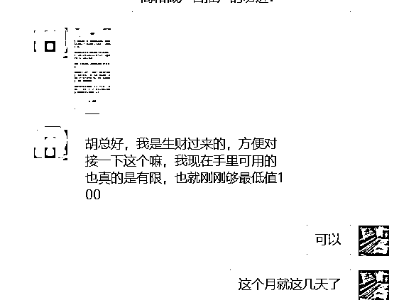
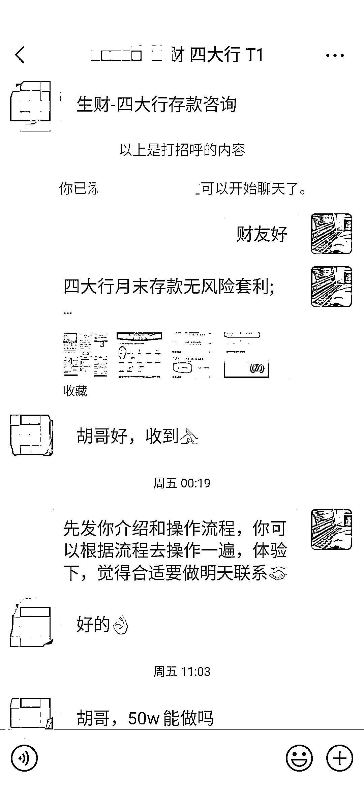
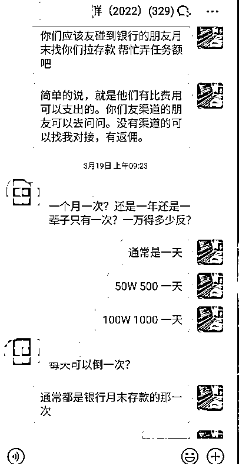
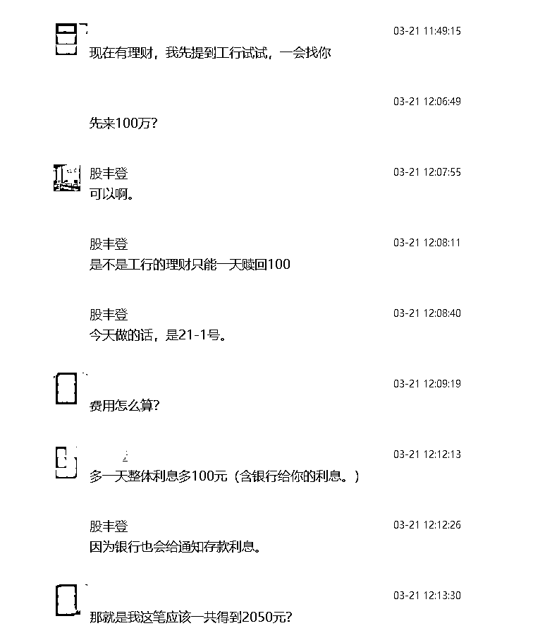
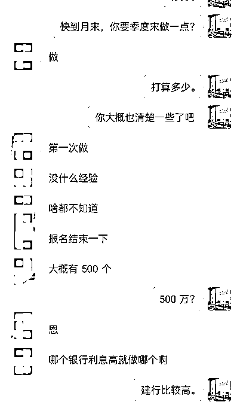
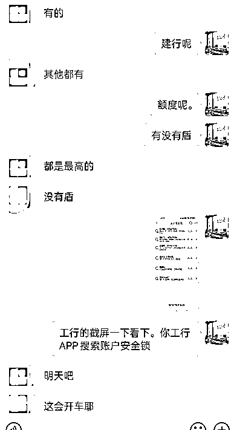
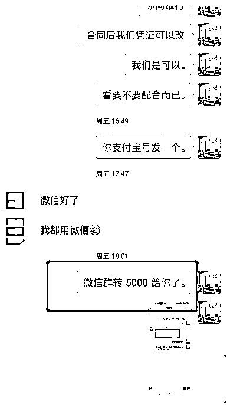
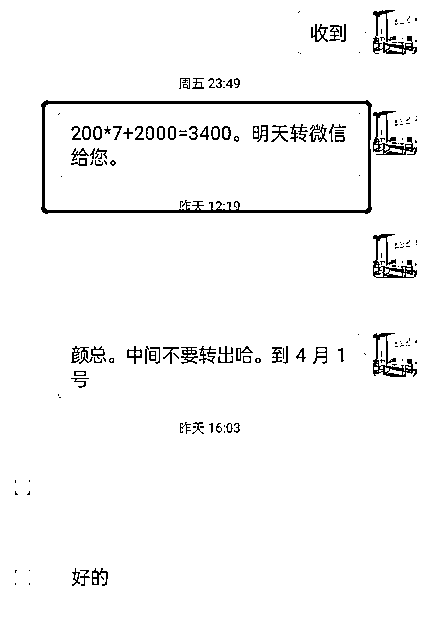
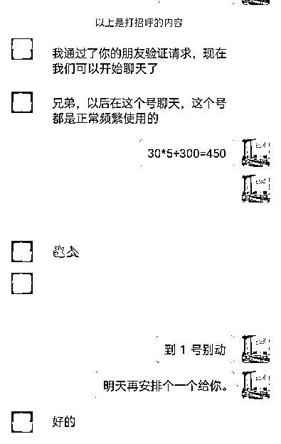
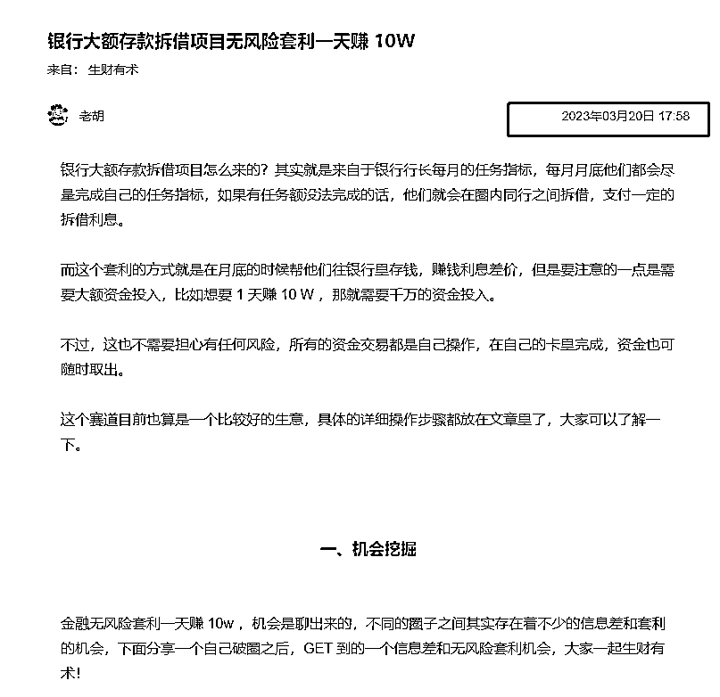

# 《通过四大行无风险套利 7 天赚回一倍生财的门票》

> 原文：[`www.yuque.com/for_lazy/thfiu8/zgkd6o9k7keim7ah`](https://www.yuque.com/for_lazy/thfiu8/zgkd6o9k7keim7ah)

## (74 赞)《通过四大行无风险套利 7 天赚回一倍生财的门票》 

作者： 老胡 

日期：2023-03-29 

大家好，我是老胡，之前发过一篇关于银行大额存款项目无风险套利的文章，发现不少圈友对这些问题还是存在不少争议的： 

小银行的话有可能钱取不出来会根据存款保险实行限额偿付，操作是否安全、利息怎么返还、操作时间周期如何，自己可以做吗？打新债在近两年需要注册能不能做？...... 

  

  

这个银行大额拆借套利我们只做农行、工行等四大行，不涉及到小银行，而且是在自己名下银行卡内互转，不对外转给他人，所以在操作上是安全无风险的。 

操作时间基本是月末的几天时间，根据步骤操作后，资金保留 24 小时，我们就会把返利打到个人账号上，在利息这一块也不用担心，都是正规银行操作，至于打新债在近两年需要注册只有企业版可以操作，我们能做就是因为企业开通了这个渠道。 

如果你有银行渠道愿意配合的可以自己去操作的，但是也有可能那些银行无法长期给你口子，所以需要有资源信息，而且自己做的话千万不要去做小银行的项目， 

今天分享的文章，就是距离我上次发布文章之后，一些圈友在 7 天内通过在这四大行做银行大额拆解套利赚到钱的案例，大家对项目感兴趣的话可以看看原文：（[https://articles.zsxq.com/id_co0lkxpaewcd.html](https://articles.zsxq.com/id_co0lkxpaewcd.html) ） 

物以类分，人与群聚，非常感谢亦仁创造了生财有术这个圈子。 

赚钱的第一步其实就是获取信息差，不同的群体对于信息差还是有差别的： 

# 一、生财的群体 

  

  

  

# 二、其他社群的群体 

 

 

so，面对同样的一个信息，有的人选择打打嘴炮，有的是看到困难，有的是想当然，而我看到我们生财的群友更多的是： 

（1）会加过来去求证这个事情 

（2）会想办法解决当下的困难 

（3）经过自己验证无误之后，他们会立马去参与 

  

 

  

（本人并不是鼓励无脑随便投资，而是说在面对一个信息差的时候，要学会去思考，学会去求证，而不是单单用语言来想当然） 

通过以上的事例可以感受到，生财的财友除了谨慎有余之外，都是非常的敢于求证和探索，难怪能：生财有术！ 

# 三、7 天验证的结果 

## （1）截止到 2023 年 3 月 26 日，有兴趣的财友是 22 个（扣除我们自己的服务人员 3 个） 

  

## （2）22 个财友里面：8 个报名，4 个已经打卡，4 个预订了日期 

总有效率：8/22*100% = 36.36% 

可见财友的执行力还是相当高的，这里就不一一列举。 

 

 

 

## （2）截止目前的收益，最高实现将近 3 倍的生财门票收益 

目前提前分发的收益（有些要到 4 月 1 日结算，所以还没有统计数据） 

 

 

 

少则几百（一天的收益），多则 5000 米拿到手（月末统计后会更多），所以从这个角度讲，已经赚回差不多 3 倍生财的门票钱！ 

3 月 20 日发文，截止到今天为止算上休息日刚好 7 天。 

  

之前发布的文章链接如下： 

[https://articles.zsxq.com/id_co0lkxpaewcd.html](https://articles.zsxq.com/id_co0lkxpaewcd.html) 

事要躬亲，反复验证求索。 

财不嫌多少，胜在安全累积。 

再次感谢亦仁创造了这个社群 

（感叹亦仁团队看的很准，大航海家已经杨帆起航，未来聚合这批航海家，能量相当可观！） 

也非常感谢财友的信任和支持！ 

（本人鼓励找银行系统等专业人士验证求证，确保安全的情况下在投资，并不鼓励拍脑袋的决策。） 

祝：一起，生财有术！ 

结尾写个期许：定个小小的目标，期待能给 100 个甚至更多的财友链接无风险套利的信息交流（经过验证的），最终能形成一个无风险套利的板块，有这方面资源和想法的可以一起探讨。 

如果大家对这篇文章还有什么疑问可以看一下这里的解答：[四大行月末存款无风险套利;](https://shengcaiyoushu01.feishu.cn/docx/FXPZdOCdwodVhix7joJcifnKn0g) 

评论区： 

雨林 : 之前就听朋友说过，他也没说明白。原来就是银行有存款任务，然后用这笔资金过桥充下门面。啥项目都有人做[强] 老胡 : 都有指标考核，生财那么大的社群估计也有，鱼丸曾经半夜 12 点多还给我留言，有那么卷吗[偷笑] 贤雅 : 啊！也给我回复过 老胡 : 半夜回复，挺敬业的👍 贤雅 : 是啊！ 南风 : 没这么多钱 老胡 : 嗯，觉得适合自己的再操作。 hj : 请问现在还能做吗？怎么加你微信？