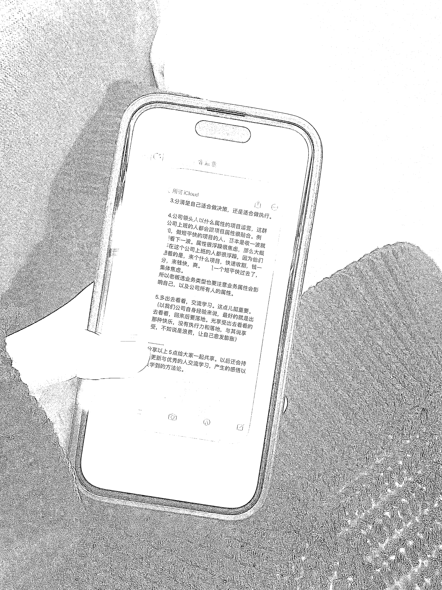
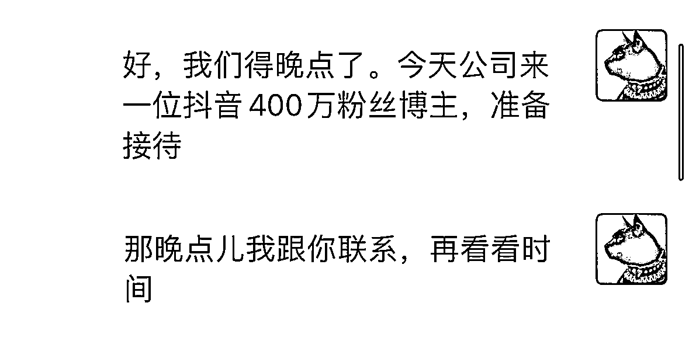

# 《聊一聊抖音、小红书等未来的破局之路……》

> 原文：[`www.yuque.com/for_lazy/thfiu8/wcluebgew2eokyfp`](https://www.yuque.com/for_lazy/thfiu8/wcluebgew2eokyfp)

<ne-h2 id="cafa9371" data-lake-id="cafa9371"><ne-heading-ext><ne-heading-anchor></ne-heading-anchor><ne-heading-fold></ne-heading-fold></ne-heading-ext><ne-heading-content><ne-text id="u592e75f5">(59 赞)《聊一聊抖音、小红书等未来的破局之路……》</ne-text></ne-heading-content></ne-h2> <ne-p id="u3ae165b7" data-lake-id="u3ae165b7"><ne-text id="u4f305f8b">作者： 白杨私人号</ne-text></ne-p> <ne-p id="ub7979113" data-lake-id="ub7979113"><ne-text id="u8a5a9b76">日期：2023-03-20</ne-text></ne-p> <ne-p id="uad4371b2" data-lake-id="uad4371b2"><ne-text id="u0334cc41">前几天饭局见了抖音 400 万粉丝商业 IP 操盘手</ne-text> <ne-text id="uec0ade4d">五个多小时的思维碰撞，聊抖音，聊知乎，聊小红书，聊商业模式，聊未来，聊破局之路……</ne-text></ne-p> <ne-p id="u0819f4cf" data-lake-id="u0819f4cf"><ne-text id="u144c7470">我复盘整理了一些分享给大家。</ne-text></ne-p> <ne-p id="ua1064c97" data-lake-id="ua1064c97"><ne-text id="u23a6bdd4">1.有的人擅长自己做自媒体，做自己的 ip。而有的人更适合搭台子找戏班子。比如今天见面的团队就是擅长当“星探”，去寻找那些适合做 ip 的人，前提是真的有阅历。并且要掌握时机，在此 ip 低谷期伸入。</ne-text></ne-p> <ne-p id="u161c7f88" data-lake-id="u161c7f88"><ne-text id="uf6d30920">2.怎么绑定合作关系，更多的是你是擅长为对方去服务的，给对方提供价值的。当然第一点在对方低谷期入手，已经很大程度建立了信任。加之后期 ip 遇到问题，动用人脉关系网给予解决。其实就是在每个关键节点给很到位的帮助。</ne-text></ne-p> <ne-p id="u2e85ab42" data-lake-id="u2e85ab42"><ne-text id="uefc83201">3.分清楚自己适合做决策，还是适合做执行。</ne-text></ne-p> <ne-p id="u14b8ed1c" data-lake-id="u14b8ed1c"><ne-text id="u1ee317db">4.公司领头人以什么属性的项目运营，这群公司上班的人都会跟项目属性很贴合。例如，做短平快的项目的人，基本是收一波就要看下一波。属性很浮躁很焦虑，那么大概率在这个公司上班的人都很浮躁，因为他们想着的是，来个什么项目，快速收割，钱一分，来钱快，爽。一旦一个短平快过去了，集体焦虑。</ne-text> <ne-text id="u424134eb">所以老板选业务类型也要注意业务属性会影响自己，以及公司所有人的属性。</ne-text></ne-p> <ne-p id="ue6e412aa" data-lake-id="ue6e412aa"><ne-text id="u40ab4f4d">5.多出去看看，交流学习。这点儿挺重要。（以我们公司自身经验来说，最好的就是出去看看，回来后要落地。光享受出去看看的那种快乐，没有执行力和落地，与其说享受，不如说是浪费，让自己愈发膨胀）</ne-text></ne-p> <ne-p id="u0df34045" data-lake-id="u0df34045"><ne-text id="u7d906310">…………</ne-text> <ne-text id="u69eb118a">分享以上 5 点给大家一起共享。以后还会持续更新与优秀的人交流学习，产生的感悟以及学到的方法论。</ne-text></ne-p> <ne-p id="ude3767c0" data-lake-id="ude3767c0"><ne-text id="u3aea8a01">……</ne-text> <ne-text id="ubb91d077">今天收到了花爷的开眼内刊，看见了亦仁老师的第一段话。通过付费找到优质多元的信息渠道，让自己融入进去，那么我已经付费进来了咱们都生财有术，正在学习各位朋友们的干货。接着看见亦仁老师的第二段话，通过各种渠道把自己的思考分享出去。再结合昨天看见亦仁老师说过一些新人入圈后不好意思发言，今天我就选择第一次发言。勇于突破[胜利]融入、迸发。</ne-text><ne-card data-card-name="image" data-card-type="inline" id="p7ZZB" data-event-boundary="card">  <ne-p id="u7aa824eb" data-lake-id="u7aa824eb"><ne-card data-card-name="image" data-card-type="inline" id="NEDsV" data-event-boundary="card">  <ne-p id="u37b9ee39" data-lake-id="u37b9ee39"><ne-card data-card-name="image" data-card-type="inline" id="NyKHv" data-event-boundary="card">  <ne-hole id="u737cdaba" data-lake-id="u737cdaba"><ne-card data-card-name="hr" data-card-type="block" id="fFJeD" data-event-boundary="card"><ne-p id="u77fd4712" data-lake-id="u77fd4712"><ne-text id="ub440c554">评论区：</ne-text></ne-p> <ne-p id="u364f73ab" data-lake-id="u364f73ab"><ne-text id="u98fc4799">芷蓝 : 有启发</ne-text> <ne-text id="ufc9b0ae9">白杨私人号 : [爱心]蓝姐</ne-text> <ne-text id="uae6520e3">孙哲 : [666]</ne-text> <ne-text id="ua56e584a">白杨私人号 : 孙哲老师🫱🏻‍🫲🏼</ne-text> <ne-text id="u03d452f9">Hope : 666 啊</ne-text> <ne-text id="u4aca5373">白杨私人号 : [握手]</ne-text> <ne-text id="u1177ae5a">星月 : 杨总厉害</ne-text> <ne-text id="u18498782">白杨私人号 : 星月哥[握手]</ne-text></ne-p></ne-card></ne-hole></ne-card></ne-p></ne-card></ne-p></ne-card></ne-p>