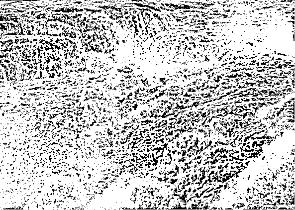
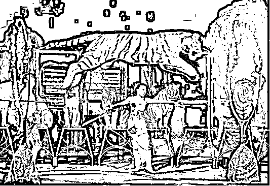

# 《以经济学方式解决家庭教育难题为例，欲望是一切目标的货币》

> 原文：[`www.yuque.com/for_lazy/thfiu8/ck05lhseh5qrvq06`](https://www.yuque.com/for_lazy/thfiu8/ck05lhseh5qrvq06)

<ne-h2 id="38622984" data-lake-id="38622984"><ne-heading-ext><ne-heading-anchor></ne-heading-anchor><ne-heading-fold></ne-heading-fold></ne-heading-ext><ne-heading-content><ne-text id="u3679b79a">(33 赞)《以经济学方式解决家庭教育难题为例，欲望是一切目标的货币》</ne-text></ne-heading-content></ne-h2> <ne-p id="uee58b66c" data-lake-id="uee58b66c"><ne-text id="u066adb21">作者： 南侠 1987</ne-text></ne-p> <ne-p id="u684b2115" data-lake-id="u684b2115"><ne-text id="ud5d20f59">日期：2023-03-21</ne-text></ne-p> <ne-p id="u3962df84" data-lake-id="u3962df84"><ne-text id="u3facec00" style="color: rgb(12, 12, 12);">家庭教育，自古以来就是是超级难题，即便权势遮天的帝王将相、千亿资产的巨富豪门，也都对此很头疼痛苦，因儿女不成器而导致很快就败光家产，甚至满门抄斩、王朝覆灭，古今中外都有无数事例。</ne-text></ne-p> <ne-p id="u0d5de5ea" data-lake-id="u0d5de5ea"><ne-text id="u016e989b" style="color: rgb(12, 12, 12);">就拿现今来说吧，事业很成功但家庭教育失败，轻则事业无法传承、职业世家后继无人，中则下一代难免阶层跌落家道中落，毕生心血建立起来的事业毁于一旦，还有许多父母像李刚、李双江、成龙、张国立那样被坑爹，终生蒙羞抬不起头，甚至像令 ji 画那样因儿女导致整个庞大家族、派系覆灭。</ne-text></ne-p> <ne-p id="u642b409f" data-lake-id="u642b409f"><ne-text id="ufd1c7ae6" style="color: rgb(12, 12, 12);">好的家庭教育，最差也能让小孩成为开朗活泼、习惯优良的优秀青年，一般的也可以成为把事业发扬光大、让家族更上层楼的精英。</ne-text></ne-p> <ne-p id="u9187b30e" data-lake-id="u9187b30e"><ne-text id="uaf41be7c" style="color: rgb(12, 12, 12);">市面上讲家庭教育理念的很多，讲细节做法的却很少，那到底有没有切实有效，操作性很强的具体方法呢？</ne-text></ne-p> <ne-p id="u368f1f10" data-lake-id="u368f1f10"><ne-text id="u1a1ffdc5" style="color: rgb(12, 12, 12);">本篇不讲具体生财之术（之前在生财已经写过很多篇具体生财变现类的独门内容，目录在文末），是原创的经济学外篇的货币、欲望、财富、放大、财富公式、认知域六篇的《欲望》篇。</ne-text></ne-p> <ne-p id="u80977b68" data-lake-id="u80977b68"><ne-text id="u605721e6" style="color: rgb(12, 12, 12);">这里就讲通过“货币”和欲望，来进行有效的家庭教育的具体应用，小到做个日赚几十的微小项目，大到发展成年营收几千亿的企业、甚至有效管理整个国家，其实，都是同样的底层机制发挥出的作用。</ne-text></ne-p> <ne-p id="ucd6df3ac" data-lake-id="ucd6df3ac"><ne-text id="u03cefbc9" style="color: rgb(12, 12, 12);">去年我把本文分享到龙珠俱乐部后，获得了广泛好评，在这里对大家尤其是家有小孩的、做项目的、企业主们，肯定也都会有所启发。</ne-text></ne-p> <ne-p id="ue5632d00" data-lake-id="ue5632d00"><ne-text id="u0b3bf0d2" ne-bold="true">---------正文分割线-------</ne-text><ne-text id="u90b809e8" ne-bold="true">--</ne-text></ne-p> <ne-p id="u228bc861" data-lake-id="u228bc861"><ne-text id="u0194de98">鸟为食亡，人为财死。欲望即是货币。</ne-text></ne-p> <ne-p id="uc89d6856" data-lake-id="uc89d6856"><ne-text id="u1c0d23e0">在这里，“食”是鸟的货币，“财”是人的货币。货币不是因为它是金银铜币，或者因为它是纸钞，才有力量；货币只有绑定了欲望，才有力量。</ne-text></ne-p> <ne-p id="u1b1fa824" data-lake-id="u1b1fa824"><ne-text id="u298279b2" ne-bold="true">——货币的力量，来自于欲望。只要具备了兑现欲望的能力，万物皆可为货币。</ne-text></ne-p> <ne-p id="uc3636251" data-lake-id="uc3636251"><ne-text id="uab96861c">人们愿意为了纸钞努力工作，赴汤蹈火，万死不辞，本质上是为了满足自己的欲望而工作，货币只是中介形式。 </ne-text></ne-p> <ne-p id="ufe20c6b9" data-lake-id="ufe20c6b9"><ne-text id="u57170389">纸钞无疑是一种知名度较高的中介形式，但绝对不是全部，广义上，凡是可以让人付出成本，“努力工作”去获得的中介形式，都是隐形的“货币”。  </ne-text></ne-p> <ne-p id="u753bc9e9" data-lake-id="u753bc9e9"><ne-text id="uf2c15066">市井小民为柴米油盐而蝇营狗苟，有了纸钞就能买来柴米油盐，所以市井小民以纸钞为货币，为纸钞而工作。 </ne-text></ne-p> <ne-p id="u7132af74" data-lake-id="u7132af74"><ne-text id="uab23b0ef">多党竞选执政的选举规则里，有了多数选票就能获得施政资格，所以政客以选票为货币，为选票而工作。 </ne-text></ne-p> <ne-p id="u9ad4fe10" data-lake-id="u9ad4fe10"><ne-text id="u11506dc1">革命志士、思想家科学家，在布满荆棘的道路上探索未知世界，获取了真理便能享誉后世，所以思想家科学家，以真理为货币，为真理而工作。 </ne-text></ne-p> <ne-p id="ucbdefaca" data-lake-id="ucbdefaca"><ne-text id="u356057d6">高考学子百万大军挤独木桥，在分数竞争中名列前茅，就能获得优质生存资源，所以莘莘学子以分数为货币，为分数而工作。 分、分、分，学生的命根。</ne-text></ne-p> <ne-p id="u61db8d03" data-lake-id="u61db8d03"><ne-text id="ud4dcde9c">在各种等级制度里，职员、官员在评比竞争中优胜劣汰，脱颖而出者就能获得更多的权力、更高的地位，所以官员、职员们以职位为货币，为职位而工作。 </ne-text></ne-p> <ne-p id="u8b4c916b" data-lake-id="u8b4c916b"><ne-text id="u6cd2a748">英勇无畏的军人战士，在斗争中克敌制胜、实现正义，就能获得至高荣誉，所以军人以荣誉为货币，为荣誉而工作，一往无前。 </ne-text></ne-p> <ne-p id="u3386bba0" data-lake-id="u3386bba0"><ne-text id="u465e25e6">信仰虔诚的宗教人士，在日复一日的参悟、求证中，以证得智慧大道、万赞归主为圆满，所以宗教徒以信仰为货币，为信仰而工作。 </ne-text></ne-p> <ne-p id="u4a6b066c" data-lake-id="u4a6b066c"><ne-text id="u9b5aac16">偏远地区的农夫、渔翁、牧民，甚至连纸钞都不需要，直接以粮食、柴火为货币，有了它们，便可安然度过一生，所以他们每天为囤积足够的粮食、柴火而工作。</ne-text></ne-p> <ne-p id="u818e79e4" data-lake-id="u818e79e4"><ne-card data-card-name="image" data-card-type="inline" id="ARwyR" data-event-boundary="card">  <ne-p id="u5b9f085d" data-lake-id="u5b9f085d"><ne-text id="u1c6237fe">以上举例几类，拓展一下“货币”的边界，可知“欲望”才是货币的“内在面值”，是更“底层”的货币，欲望在哪里，相关的中介形式就可以化身为货币，具备与纸钞货币等价的魅力。 </ne-text></ne-p> <ne-p id="uf018590d" data-lake-id="uf018590d"><ne-text id="uc90a2167">由于各种“货币形式”在世界中平行存在，而它们都可以无差别地“满足欲望”，甚至一些货币形式，明显比“纸钞”更捷径，直接在行为过程中满足了欲望，干脆连“货币交易”的步骤都省略了，纸钞是有明显局限的。 </ne-text></ne-p> <ne-p id="u42041c64" data-lake-id="u42041c64"><ne-text id="ub8f36800">现在可以到一个具体的经济模型中来讨论家庭教育的问题，在前一章《货币》里，“国家”是葫芦岛经济模型的放大版，现在把“葫芦岛”缩小，在一个缩小版模型里，由我们自己来担任“造币部落”，行使国家职能，看看如何运用“终极货币”来管理这个经济模型，使“人民”遵纪守法、勤劳智慧，为自己的欲望工作，实现经济模型的良性发展。 </ne-text></ne-p> <ne-p id="udaf5b065" data-lake-id="udaf5b065"><ne-text id="u0310fbf5">一个家庭，便是一个“葫芦岛”经济模型的缩小版，按照最广泛的常态，假设这个家庭为一家 4 口，爸爸妈妈，以及两个儿童。在这个缩小版的“国家”里，爸爸妈妈便是政府，两个有淘气的儿童是“人民”。 </ne-text></ne-p> <ne-p id="u180ea712" data-lake-id="u180ea712"><ne-text id="uc73862f3">天下的家长都是“望子成龙”，为此付出各种努力，可惜经常事与愿违，试探了多种管教方法，最终不了了之，无可奈何。 </ne-text></ne-p> <ne-p id="uff263fbc" data-lake-id="uff263fbc"><ne-text id="uc303c3af">为了“国家”（家庭）的繁荣富强，“政府”（家长）的愿望就是“人民”（儿童）遵纪守法、勤劳智慧，往国家希望的方向努力。家长希望小孩博览群书、学业优秀，勤劳自立、有责任心，不要太贪玩，少花时间玩手机、不要沉迷于动画片、网络游戏。 </ne-text></ne-p> <ne-p id="ue0501ec3" data-lake-id="ue0501ec3"><ne-text id="u1cee084e">但现实情况是，希望小孩能“自律”，根本做不到。这种希望敌不过小孩贪玩的天性，没有多大力量。所以传说中优秀的“别人家的孩子”总是极少数，大部分家长在与小孩的长期“斗争”中败下阵来，不了了之。 </ne-text></ne-p> <ne-p id="ua25c04d4" data-lake-id="ua25c04d4"><ne-text id="ufc773cf6">更奇妙的景观是，很多家长甚至把自己贡献出来，作为“反面教材”，苦口婆心地以第一人称现身说法，说自己当年也很贪玩，荒废了学业，所以成年后落入平庸，天天搬砖，少壮不努力，老大徒伤悲，你要引以为戒，努力上进，做一个优秀的人，做国家的栋梁之才，云云。 </ne-text></ne-p> <ne-p id="uc2219d4a" data-lake-id="uc2219d4a"><ne-card data-card-name="image" data-card-type="inline" id="Qmhu5" data-event-boundary="card">  <ne-p id="u0d3ace0b" data-lake-id="u0d3ace0b"><ne-text id="u194a3fc3">千百年来，几乎每个家长都有类似经历，同样的月夜、枯树和蜘蛛，同样一代又一代的父亲与孩子，围炉夜话，重复着古老的故事。 </ne-text></ne-p> <ne-p id="u5c916a84" data-lake-id="u5c916a84"><ne-text id="ufbfcf526">在这个问题上，失败的家长是绝大多数。于是当年的小孩长大后，再次向下一代儿童重复同样的故事版本，也重复同样的结果——无效。 </ne-text></ne-p> <ne-p id="udc82dda5" data-lake-id="udc82dda5"><ne-text id="u2df640e9">解决小孩“自律”的问题，似乎是个谜一样的难题，全凭天意。难道真的无法解决吗？当然可以完美解决了，之所以不能解决，只是因为智慧暂时不够。这篇文章后，智慧升级，应该就够了。 </ne-text></ne-p> <ne-p id="u02820f9e" data-lake-id="u02820f9e"><ne-text id="ue010b4e0">前文中，家长现身说法，“痛心疾首”自己当年不爱学习，贪玩，荒废了学业，所以长大后只有放弃理想，努力搬砖，希望小孩珍惜光阴。 </ne-text></ne-p> <ne-p id="u584cc085" data-lake-id="u584cc085"><ne-text id="ufba26c54">奥秘就在这里面：今天的家长，还是当年的小孩，难道家长现在是因为“喜欢”搬砖，所以搬砖吗？难道现在的家长不想去玩？现在的家长爱学习了吗？答案都是否定的。家长为什么去搬砖？——不过是为了“货币”而已。 </ne-text></ne-p> <ne-p id="u532f0a3c" data-lake-id="u532f0a3c"><ne-text id="ue2179008">在成年人的生活里，出现了“货币”这个中介形式，可以满足家长各种欲望，货币的动力，本质上是欲望的动力，世界上几十亿成年人，为了获得“货币”而工作，被治理得服服帖帖，按照分工，有条不紊风雨无阻地奔波，时间久了就习惯了，习惯就“自律”了。 </ne-text></ne-p> <ne-p id="u14cd8bbe" data-lake-id="u14cd8bbe"><ne-text id="u22e990e5">可以设想一下，如果“搬砖”没有货币，社会各界只给家长一通说教，罗列各种理由，“希望”他们自律，多多搬砖，会是什么景象？——保证家长们一夜之间，倒退得比小孩都“懒”，都“不懂事”，除了尽情地贪玩，啥也不想干。说破嗓门都没用。 </ne-text></ne-p> <ne-p id="uebdd288c" data-lake-id="uebdd288c"><ne-text id="ufab4a7ae">在葫芦岛经济模型的缩小版里面，两位家长承担了“基础”的工作，生产出来的粮食和衣服、房子等必需品，足够“全岛”4 个人使用，2 位儿童正是经济模型中的闲余人口，任何工作都不需要做，就可以满足欲望。</ne-text></ne-p> <ne-p id="u198fea6b" data-lake-id="u198fea6b"><ne-text id="u649c42c4">这个经济“社会”如此“不公平”，长久下去，必定引起“政府”（家长）的不满，至少不利于塑造儿童（人民）的能力，将来在与外界的竞争中会成为弱者。 </ne-text></ne-p> <ne-p id="u2f4ef2b2" data-lake-id="u2f4ef2b2"><ne-text id="u89c692dd">关键问题就是这个经济模型的内部，缺少了“货币”这个核心环节，所以它的运转是极为低效的，驱动基本靠喊，纠错基本靠揍，只要放任，“经济模型”立即瘫痪。 </ne-text></ne-p> <ne-p id="u595b6d32" data-lake-id="u595b6d32"><ne-text id="u2bee20b3">而在成年人的世界里，满足“欲望”的通道上，因为有了“货币”这个中介形式，几乎在所有的方方面面，都发挥出神奇的功效，各行各业、三教九流，管理者、劳动者，暴脾气的比如黑道大哥，讲规矩的比如流水线上的临时工，小资情调比如文艺青年、公知教授，在“货币”面前，全部整齐划一，高效地组织起来，抛弃自己的任何成见，勤劳地工作。 </ne-text></ne-p> <ne-p id="u4540f25b" data-lake-id="u4540f25b"><ne-text id="u12852092">儿童的难以管理，绝非儿童本身的问题，否则每个儿童长大后，为什么自动归位，成了兢兢业业的劳动者？儿童再淘气，能比黑道大哥还桀骜不驯？儿童再矫情，能比小资情调者还矫情？人家为自己的世界观寻找合理性，引用的哲学依据、法理依据、行为依据都是一套一套，体系化的，张口就是西方某流派，东方某文豪的原话，让普通人想驳辩都自惭形秽。 </ne-text></ne-p> <ne-p id="udd628867" data-lake-id="udd628867"><ne-text id="u0ee3ad46">在葫芦岛的缩小版——“家庭”的经济模型中，真正可以解决问题的是引入有效“货币”，完全复制“社会”的运作机制，便足以驱动它的繁荣发展，并维持良性循环。 </ne-text></ne-p> <ne-p id="u7722ff8a" data-lake-id="u7722ff8a"><ne-text id="ud4193c4a">欲望即是货币，如果你以为只有“纸钞”才是货币，那就局限了，不同的人群，生活在不同的平行世界，不同的世界，所通行的货币可以是不一样的，最简单的例子，就是不同的国家，连发行的纸币都不一样，人民币、美元、澳元、法郎、马克、缅币、越南盾、荷兰盾、巴西币等等，汇率也不一样，但该国人民都为它“工作”。 </ne-text></ne-p> <ne-p id="u561e1fca" data-lake-id="u561e1fca"><ne-text id="ueaba0c2e">在特定场景下，只要具备满足“欲望”的功能，则万物皆可为货币。 </ne-text></ne-p> <ne-p id="u5d81796d" data-lake-id="u5d81796d"><ne-text id="u700ce922">作为家庭内部发行的货币，载体不重要，可以是任何东西，废纸、卡片、树叶、丝巾、作业本、小棒、纸币、劵、小红花、贴纸、糖果等物，都可以作为载体，只要具备“记账”和“难以伪造”两个性质就行，重要的是一整套支撑“货币”运行的系统。 </ne-text></ne-p> <ne-p id="u571fcc50" data-lake-id="u571fcc50"><ne-text id="u4ecb4f98">现在选取“卡片”作为货币载体，以“积赞”的方式记账，代表货币面额——对应着满足欲望的能力大小。 </ne-text></ne-p> <ne-p id="uc6e89791" data-lake-id="uc6e89791"><ne-text id="u6173ce20">在这个经济模型中，儿童的欲望是打游戏、玩手机，拥有各种新奇玩具，造币部落希望引导的方向是博览群书、勤劳自立、有责任有担当。 </ne-text></ne-p> <ne-p id="u2bd1b3ef" data-lake-id="u2bd1b3ef"><ne-text id="u1e5a0cdf">这似乎是一组矛盾，本质上，天下家长和小孩之间的矛盾，就是“即时满足”与“延时满足”两者之间的矛盾，家长希望小孩放弃当下的满足，争取未来的地位、能力、事业成就的满足，这个满足是“延时”的，潜在的快乐要很一二十年后才能兑现。</ne-text></ne-p> <ne-p id="u8074f7a2" data-lake-id="u8074f7a2"><ne-card data-card-name="image" data-card-type="inline" id="qVjfH" data-event-boundary="card">  <ne-p id="uf4ed9a11" data-lake-id="uf4ed9a11"><ne-text id="u1c4b51cb">而小孩没有“延时满足”的体验，只会选择当下可以体验到的“即时满足”。</ne-text></ne-p> <ne-p id="u4ec7a77e" data-lake-id="u4ec7a77e"><ne-text id="u761f06fd">天下家长对这个矛盾的解决方案是强行截断小孩的欲望，希望填鸭式灌输大道理，让小孩改变——有效果了吗？ </ne-text></ne-p> <ne-p id="u4a0cec71" data-lake-id="u4a0cec71"><ne-text id="u4aed062e">这是大错特错，下面我们将从最根本的原理来认识世界运转的逻辑，利用天然之力，四两拨千斤，来维持经济模型的自动运转。——一切外加的作用力，都是不可持续的。 </ne-text></ne-p> <ne-p id="u7e756d36" data-lake-id="u7e756d36"><ne-text id="u29381877">比如地球上的能量之源，电力、畜力、机械力、化学能，都是外加的作用力，维持的时间有限，真正永不衰竭的力量之源，是万有引力和太阳能。其它的比如电力、畜力、机械力等等都是万有引力和太阳能源转化而来的。 </ne-text></ne-p> <ne-p id="udee8a6cd" data-lake-id="udee8a6cd"><ne-text id="u9860097b">水因为万有引力而流动，具备了重力势能，借助于这一点，可以把它驯化利用，拦河筑坝，让水无路可走，只有力出一孔，驱动发电机组，把重力势能转换为电能，只要万有引力不消失，地球上可利用的能源就不会消失。</ne-text></ne-p> <ne-p id="u5f740be9" data-lake-id="u5f740be9"><ne-card data-card-name="image" data-card-type="inline" id="XvVjw" data-event-boundary="card">  <ne-p id="u1f256926" data-lake-id="u1f256926"><ne-text id="u7babe831" ne-bold="true">人类行为的能量之源，唯有“欲望”。</ne-text></ne-p> <ne-p id="ufd0d2583" data-lake-id="ufd0d2583"><ne-text id="u81d44679">借助“欲望”的力量，可以设置转换系统，驱动人去做任何事情。为了货币，无论多么无耻、危险、辛苦的工作都有成年人投入万分热情去做，何况是普通的简单工作，当然没有问题。 </ne-text></ne-p> <ne-p id="u2352293b" data-lake-id="u2352293b"><ne-text id="ubff1e3bd">家长希望儿童博览群书、勤劳自立，事实上，无论多么顽劣的儿童都可以做到，只要他有某方面的“欲望”就行，只要这种欲望，在道德和法律允许的范围内，没有安全隐患。 </ne-text></ne-p> <ne-p id="ubcffd766" data-lake-id="ubcffd766"><ne-text id="uc4d360b0">只有“欲望”才能战胜人的惰性，而且这种“力”是内生的，恒久的。 </ne-text></ne-p> <ne-p id="uc3bfdfb3" data-lake-id="uc3bfdfb3"><ne-text id="u82aa0ab6">现在造币部落发行的货币——“卡片”，就是满足儿童欲望的唯一合法途径。卡片上面集赞的数量，就是“货币”的面额，把儿童付出的有意义的“劳动”和“购买力”量化。</ne-text></ne-p> <ne-p id="ubf84eb09" data-lake-id="ubf84eb09"><ne-text id="u5ca40916">要玩手机、打游戏，或者寻求其他快乐，都需要付出若干数量的“赞”才可以，而且“有赞能使鬼推磨”，儿童只要持有数量足够多的“赞”，他提出协定内的要求，“政府”（家长）有义务要尽量像银行一样不打折扣地兑现，不能出尔反尔，否则，“国家信用”崩溃，这个经济模型就无法正常运转。 </ne-text></ne-p> <ne-p id="u5db60029" data-lake-id="u5db60029"><ne-text id="u4e9e0c48">儿童是家庭“葫芦岛”经济模型的闲人，在《货币》那一节，葫芦岛上的闲人，在实际不需任何劳动，就可以获得足够的货币或粮食供应前提下，必须从事看起来“有意义” 的工作，才可以得到“货币”，树叶（或金银铜币）——翻跟斗、讲故事都可以，就是不能啥也不干，不劳而获，否则葫芦岛经济模型崩溃。 </ne-text></ne-p> <ne-p id="uc4e6d67b" data-lake-id="uc4e6d67b"><ne-text id="u358fb1e6">在教育问题上，为什么家长经常崩溃？正是因为通常情况下，家庭中的闲人，儿童，几乎不需要任何“有意义”的劳动，甚至连“货币”都不需要，就可以满足所有欲望，这是一种效率最低、最畸形的经济模型——可以脑补一下，如果把这种经济模型放大到全社会，国家运转一定瘫痪，经济彻底崩溃，全民懒惰、堕落、低能。 </ne-text></ne-p> <ne-p id="u71f8784b" data-lake-id="u71f8784b"><ne-text id="ue8326c27">在成年人的世界里，每一个人满足“欲望”的能力，都是与自己付出的有效劳动挂钩的。给“有效劳动”记账的凭证，就是纸钞。同时也量化了欲望可以满足的程度——有多少钱，办多少事。量入为出。 </ne-text></ne-p> <ne-p id="uf48a8a0a" data-lake-id="uf48a8a0a"><ne-text id="u4cd4af44">为了剔除与主题无关的琐碎细节，设定“造币部落”（家长）希望达到的效果是“博览群书”和“勤劳自立”，如果家长是其它愿望，可以以此类推，原理完全一样。 </ne-text></ne-p> <ne-p id="u32b86629" data-lake-id="u32b86629"><ne-text id="ubf7d3737">儿童设定为小学生，“欲望”是“玩手机”、“打游戏”。如果儿童是其它欲望，就用对应的其它欲望作为“货币”的满足目标。这个欲望要有一定分量，值得儿童为之“奋斗”。 </ne-text></ne-p> <ne-p id="uff827c5b" data-lake-id="uff827c5b"><ne-text id="ua7e6481b">综上所述，家庭“葫芦岛”的经济模型可以设置如下：</ne-text></ne-p> <ne-p id="u31c326e7" data-lake-id="u31c326e7"><ne-text id="u8f33c08f">一：有 10 个赞，周末可以玩手机、打游戏一次。甚至有 N 个赞，可以买游戏机一个。或者其他“劲爆”的欲望，比如跨省旅游。 </ne-text></ne-p> <ne-p id="u1121dc4b" data-lake-id="u1121dc4b"><ne-text id="u379a6e5a">就是玩手机一次，消费 10 个赞。或者满足其它“欲望”，消费 N 个赞，“赞”花光了，或者数量不够，只有在这个“经济模型”里继续努力“工作”积赞。 </ne-text></ne-p> <ne-p id="ucc57fae0" data-lake-id="ucc57fae0"><ne-text id="u8b396517">这第一条，就是“卡片”的购买力，即满足欲望的能力，欲望即是货币，只要具备这种“能力”的东西，货币可以是任何形式。比如某种“指标”、“牌照”可以满足成年人的欲望，那么它就是成年人或公司之间的有效货币。 </ne-text></ne-p> <ne-p id="u5f3bcdd3" data-lake-id="u5f3bcdd3"><ne-text id="ua4b7f4a3">附注：卡片，作为神圣的“货币”，需要付出大量“劳动”获得，所以要具备一定的“仪式感”，最好是比较正式的硬卡片，比如正规的公司、企业的“生产流程卡”，可以网购。不能是太随便的纸张。 </ne-text></ne-p> <ne-p id="u7ad5f009" data-lake-id="u7ad5f009"><ne-card data-card-name="image" data-card-type="inline" id="ReCqB" data-event-boundary="card">  <ne-p id="u0d8a9dc2" data-lake-id="u0d8a9dc2"><ne-text id="u2f8fa599">二：有各种劳动岗位可以赚到“赞”，这些劳动项目，就是借助“欲望”之力，在力所能及的范围内，引导儿童从小事做起，养成良好作风，并及时反馈儿童的付出。第二条，相当于“工资规则”。</ne-text></ne-p> <ne-p id="ube735b16" data-lake-id="ube735b16"><ne-text id="u010452b2">1.完成临时任务    1 个赞</ne-text></ne-p> <ne-p id="u40675db2" data-lake-id="u40675db2"><ne-text id="u9942644b">2.整理家务卫生   1 个赞</ne-text></ne-p> <ne-p id="uadb0d1f7" data-lake-id="uadb0d1f7"><ne-text id="ua4138ebb">3.帮厨洗碗      1 个赞</ne-text></ne-p> <ne-p id="u8a1bbbad" data-lake-id="u8a1bbbad"><ne-text id="u7a5c6375">4.阅读 50 页    1 个赞</ne-text></ne-p> <ne-p id="u86c43c0e" data-lake-id="u86c43c0e"><ne-text id="ub89f2c66">5.写作文一篇    1 个赞</ne-text></ne-p> <ne-p id="u966ffc3f" data-lake-id="u966ffc3f"><ne-text id="u50af2228">6.老师点名表扬   2 个赞</ne-text></ne-p> <ne-p id="u9cdf4168" data-lake-id="u9cdf4168"><ne-text id="ud1576050">7.考试、竞赛成绩优等  5 个赞</ne-text></ne-p> <ne-p id="u96373f60" data-lake-id="u96373f60"><ne-text id="u62c0463a">8.单项第一名   10 个赞</ne-text></ne-p> <ne-p id="u26f35517" data-lake-id="u26f35517"><ne-text id="u70384781">9.一周令行禁止  2 个赞</ne-text></ne-p> <ne-p id="u2e7b58b8" data-lake-id="u2e7b58b8"><ne-text id="u93fdf3f1">10.犯错屡教不改  1 个差</ne-text></ne-p> <ne-p id="ucbbb93df" data-lake-id="ucbbb93df"><ne-text id="u7a3398fa">11.作风拖拖拉拉，警告无效   1 个差</ne-text></ne-p> <ne-p id="u58500261" data-lake-id="u58500261"><ne-text id="ud72a462c">12.在校被点名批评，或者在校表现说谎  2 个差 </ne-text></ne-p> <ne-p id="u74895521" data-lake-id="u74895521"><ne-text id="ufb6c279a">每完成某一项，由家长签名，注明具体事项、日期、积赞数量。这种“货币”是儿童无法伪造的。 </ne-text></ne-p> <ne-p id="udf073601" data-lake-id="udf073601"><ne-text id="uee862ab1">附注：这份设计是一个模板范例，基本包涵了各个方面，第 123 项，是关于劳动的，45678 项，是关于学习的，而且兼顾了家庭学习和在校学习两个方面，根据不同的情况，可以重新设置。总体上要张弛有度，只要“赚够了”可以满足欲望的“货币”，其余时间自由安排，随便漫无目的地玩。 </ne-text></ne-p> <ne-p id="u6931e0e8" data-lake-id="u6931e0e8"><ne-text id="u9e1111bf">其中第 4 项、第 5 项需要补充说明，第 4 项，阅读，按照成年人的劳动报酬分配方式，报酬当然要与劳动难度挂钩，阅读一般的文字纸质书，每 50 页 1 个赞，如果是连环画册，100 页 1 个赞，如果是高年级代数、几何、物理，15 页 1 个赞。以此“政策性倾向”激励儿童内生的兴趣和动力，往理想的方向发展。 </ne-text></ne-p> <ne-p id="u519bc7b6" data-lake-id="u519bc7b6"><ne-text id="ud1f1a219">第 5 项，是针对性补缺，如果语文能力是短板，就写作文，如果英语、数学是短板，就是英语数学相关的。</ne-text></ne-p> <ne-p id="u43b9133b" data-lake-id="u43b9133b"><ne-text id="ube67977e">比较巧妙的，是第 9、第 10 项，一周“令行禁止”，就可以自动获得 2 个赞，如果某个错误“屡教不改”，记 1 个“差”，（即抵消掉 1 个赞），因为有第 9 项，一周只要记 1 个差，原本可以自动获得的 2 个“赞”也没有了，实际上是扣除了 3 个赞。儿童很短时间内，就会算出其中的“厉害关系”，尽量做到令行禁止，争取一个“差”也没有。 </ne-text></ne-p> <ne-p id="u0359baa7" data-lake-id="u0359baa7"><ne-text id="u8101f794">第 11 项，“作风”的养成，是非常重要的能力，比任何所谓的“兴趣班”重要百倍，那些都是“末技”，作风才是一个人的核心能力，军队为什么强大？核心能力就是“作风”。从小培养，从小事开始。 </ne-text></ne-p> <ne-p id="u5ab292e1" data-lake-id="u5ab292e1"><ne-text id="uc402eee8">总体上，锻炼了“劳动能力”和“学习”两方面，但是在实际执行中，由于“利益最大化”的天性，儿童会钻空子，在较短时间后就会发现“性价比”最高的项目。</ne-text></ne-p> <ne-p id="u7e7559a6" data-lake-id="u7e7559a6"><ne-text id="uc9a41dfa">比如，有的儿童一看见书就头大，所以逃避阅读，宁愿体力劳动，只挑选“做家务”一条，天天打扫卫生，集满 10 个赞；有的儿童好逸恶劳，发现看连环画册最容易“积赞”，就天天只看画册，其它的啥也不干，这与经济模型的设计初衷背离，需要用补充条款堵上“漏洞”。</ne-text></ne-p> <ne-p id="u617860fa" data-lake-id="u617860fa"><ne-text id="u490361af">比如规定：由阅读连环画册积赞数量要小于或等于 5，做家务积赞数量要大于或等于 3。像管理国家一样，造币部落希望国民往哪个方向行动，就可以设计“政策性倾向”，比如计划生育时期鼓励独生子女，就可以给独生子女家庭物质奖励，精神奖励，给超生多生家庭罚款。工业 5.0 时期，鼓励新能源汽车，就给予电动车财政补贴，提高燃油车尾气排放标准，关停污染环境的产业，宏观调控不同产业的发展方向。</ne-text><ne-text id="uefdc7471" style="color: rgb(12, 12, 12);">国家制定经济计划，也都会在不同阶段，通过补贴、减税等政策，培育引导一些具体的行业做大做强。</ne-text></ne-p> <ne-p id="u51f9ece4" data-lake-id="u51f9ece4"><ne-text id="uf5063e8a">现在的问题是：有以上二条，就可以保障这个“经济模型”长久高效运转吗？当然不会，因为还缺最后一条——管理。 </ne-text></ne-p> <ne-p id="u87d48966" data-lake-id="u87d48966"><ne-text id="u1a286f42">在国家的经济模型中，虽然有了相关的“法律法规”，如果造币部落管理不力，在激励大众用“劳动”获取“幸福生活”的同时，允许部分公民为非作歹、欺行霸市、收保护费、贪污受贿、偷盗抢劫诈骗等等“不劳而获”的现象大量存在，这个“经济模型”就无法维持，因为人人都可以走“捷径”满足欲望，谁还会选择“劳动”？</ne-text></ne-p> <ne-p id="u7e1ca2ea" data-lake-id="u7e1ca2ea"><ne-text id="ub0d8cb74">所以上百万荷枪实弹的武警、忙忙碌碌的公检法系统是干什么的？就是扫黑除恶、打击犯罪，维持经济秩序正常运转的。让国家公民满足“欲望”、实现“幸福生活”，有且只有在“合法”范围内“劳动”这个唯一的途径。 </ne-text></ne-p> <ne-p id="u3a61bdf1" data-lake-id="u3a61bdf1"><ne-text id="u1e872a6f">如果超市允许“0 元购物”，如果抢劫偷盗不用受到任何惩罚和制止，经济模型中的一切规则都是一纸空文。 </ne-text></ne-p> <ne-p id="u42164798" data-lake-id="u42164798"><ne-text id="ub9240e29">所以有第三条：</ne-text></ne-p> <ne-p id="u7809a806" data-lake-id="u7809a806"><ne-text id="u40454669">在家庭经济模型中，儿童满足“欲望”的唯一途径，只能是在造币部落设计的若干项目之内。</ne-text></ne-p> <ne-p id="ue2904ad9" data-lake-id="ue2904ad9"><ne-text id="u00db5abd">拔掉电视机网络接口，或者切断电源，收起儿童可以触摸到的任何电子产品，手机设置指纹锁。总之，除了用家长发行的“货币”来兑换，切断任何可以“满足欲望”（玩手机、打游戏）的途径。 </ne-text></ne-p> <ne-p id="u9984448a" data-lake-id="u9984448a"><ne-text id="u8c8aed5b">事实上，由于第一条，玩手机一次，消费 10 个赞，是按“次数”算的，只要是“一次”，无论时间长短，都是扣除 10 个赞，聪明的儿童一定会选择在周末一大早就起床，因为这“一次”可以玩最久，直到天黑，平时你把手机放到他面前，他都不想碰，因为“不划算”。 </ne-text></ne-p> <ne-p id="u9a13c5ec" data-lake-id="u9a13c5ec"><ne-text id="u476fb048">当一个经济模型游戏规则已经确立，同时扫除了其它任何“非法”途径，满足“欲望”的唯一“合法”方式，只有“有意义”的劳动，在人性的驱动下，在“欲望”的召唤下，正常人都会从此步入“正轨”，在“经济模型”的设置框架内付出、收获，满足“欲望”。 </ne-text></ne-p> <ne-p id="ueb23dc48" data-lake-id="ueb23dc48"><ne-text id="uc985dd84">时间久了，就形成了习惯。所谓的“优秀品质”、“杰出能力”就逐渐养成，能力一旦拥有，再不会失去。 </ne-text></ne-p> <ne-p id="u65175c04" data-lake-id="u65175c04"><ne-text id="ubf0e77ed">儿童虽然已经具备人类各种天性，但毕竟是不成熟的“理性人”，如果有的儿童平时太过于散漫，一下子难以适用规则，可以循循善诱，降低难度，给他一个逐步适应过程。比如来一个“徙木立信”，先让他完成 1 个简单项目，就奖励 1 个赞，凭这 1 个赞，就可以玩游戏 N 分钟，当然也可以是她喜欢的其它事情，只要有“欲望”的满足就行。欲望在哪里，哪里就是“货币”。 </ne-text></ne-p> <ne-p id="u209152b7" data-lake-id="u209152b7"><ne-text id="ueef01ab9">附注：公司要员工按照设定的规章制度劳动，至少要提供基本的劳动条件，比如机器设备、生产资料。家长希望儿童“博览群书”，至少家里要提供有趣味、有营养的“群书”吧。 </ne-text></ne-p> <ne-p id="uc7d701c5" data-lake-id="uc7d701c5"><ne-text id="u66b3583d">在这个事件里，以一个缩小版的葫芦岛为例，把“货币”的运用作了详细说明，之所以如此不厌其烦地罗列具体，是因为“儿童教育”确实是身边真实世界中一个重要难题，望子成龙，几乎是天下父母的最大心愿，无数家长为此头发都愁白了。</ne-text></ne-p> <ne-p id="ue46f6fd8" data-lake-id="ue46f6fd8"><ne-text id="u30fcdcd5">把这个经济模型举一反三，便可以落地为实际操作，半年到一年见到明显效果，只需维持十年，就会培养出“独立自强”“学业优异”出类拔萃的下一代，而且非常省心，不用任何唠唠叨叨的说教，歇斯底里的吼叫，只需要斯斯文文，像企业的财务一样，在卡片“货币”上签名就行了，父慈子孝，一团和气。 </ne-text></ne-p> <ne-p id="u759327f5" data-lake-id="u759327f5"><ne-text id="ua27f045f">现代经济社会里，没有哪一个“打工人”或个体户、企业是被棍棒、说教驱赶着工作的，只需在一个有效的“经济模型”中，投放进若干可以满足欲望的“货币”，便可令亿万人整齐划一地朝九晚五“劳动”。</ne-text></ne-p> <ne-p id="u8c6b4e98" data-lake-id="u8c6b4e98"><ne-text id="u02b6730d">劳动产生的副产品，就是国家富强繁荣——“合众人之私，成天下之公”。</ne-text></ne-p> <ne-p id="u15317eaf" data-lake-id="u15317eaf"><ne-text id="u1ffac866">所以，家长们妄想用棍棒或说教“培养儿童”，一般都以失败告终，即使在“恐怖政策”的高压下，强行镇住的儿童，心理也是压抑扭曲的，失去了生命“为欲望而绽放”的蓬勃与灵气。被父母强行高压培养进了北大的柳智宇、吴谢宇、张空谷、超级神童宁铂等，都强烈反弹，几年后做出了令人震惊的事情，或沉迷游戏屡被退学或出家当和尚或弑母，成为新闻事件。</ne-text></ne-p> <ne-p id="u85137f10" data-lake-id="u85137f10"><ne-text id="uda274376">人的本性，只有为欲望而工作，才是快乐和持久的。 </ne-text></ne-p> <ne-p id="ueba0b1a5" data-lake-id="ueba0b1a5"><ne-text id="u566a77dc">只要“造币部落”管理得当，在收到正反馈之后，从此儿童会抢着做家务，阅读的计划排着队，也许他并非是真正“喜欢”这些“工作”，像成年人一样，加班“搬砖”，只是为了满足“欲望”，但两者究竟有何差别呢？界限是模糊的。 </ne-text></ne-p> <ne-p id="uf1134de6" data-lake-id="uf1134de6"><ne-text id="u1a99b55c">各种主流经济学，写再多空洞的废话，不如真正解决身边一个实际问题，可以用一个我亲身经历的案例说明本“经济模型”的效果。 </ne-text></ne-p> <ne-p id="u222c646a" data-lake-id="u222c646a"><ne-text id="u24ff93ab">我朋友家的儿童，小学低年级，由于以前的宠爱和教育疏忽，行为非常顽劣，好逸恶劳，只对玩电子游戏像入魔一样上瘾，学业荒废，对家长的任何口头教育毫无反应，目光呆滞，如果家长激动了，提高音量，儿童甚至敢操起家伙直接跟家长干架。 </ne-text></ne-p> <ne-p id="uaee2de92" data-lake-id="uaee2de92"><ne-text id="u1f4d92b8">以上“经济模型”的细则，就是我针对这个儿童设计的，运行一年多以后，现在脱胎换骨，几乎像换了一个人，主动做家务，动作麻利，阅读的课外书籍以及数理化读物一本接一本，上知天文物理下知地理历史，以前周末可以用 10 个赞疯狂地玩游戏一天，后来慢慢对游戏的瘾也下降了，逐渐进入知识的世界，被那个巨大的奇妙海洋所吸引，一周前，这位儿童学习成绩班级第一名，全面发展，妥妥的优等生。家长付出的代价就是“一摞卡片”，云淡风轻。 </ne-text></ne-p> <ne-p id="u502756a9" data-lake-id="u502756a9"><ne-text id="ud7ea211e">另外有一个儿童，比这个更成功，勤劳自立，智商超群，试探了各种方法，最后只有“经济模型”的货币机制最有效。</ne-text></ne-p> <ne-p id="u91557931" data-lake-id="u91557931"><ne-card data-card-name="image" data-card-type="inline" id="df4AJ" data-event-boundary="card">  <ne-p id="u4e6c507c" data-lake-id="u4e6c507c"><ne-card data-card-name="image" data-card-type="inline" id="Rm042" data-event-boundary="card">  <ne-p id="uf5d3d4ac" data-lake-id="uf5d3d4ac"><ne-text id="ub7875094">人性，天然只会被“欲望”所驱动，这是最深层的能量之源，顺应人性，才能事半功倍。 </ne-text></ne-p> <ne-p id="u95246858" data-lake-id="u95246858"><ne-text id="ub8c197d1">谨以本篇，记录这些成功率 100%的震撼案例。 </ne-text></ne-p> <ne-p id="u206e3ed2" data-lake-id="u206e3ed2"><ne-text id="u2d7ae8ad">欲望即是货币，欲望所在，就是货币所在。 </ne-text></ne-p> <ne-p id="u6d2c10e0" data-lake-id="u6d2c10e0"><ne-text id="ua97c22e5">既然是经济学，它的威力当然不可能仅仅局限于“改造”儿童。而改造儿童这种千古难题都可以解决，只是证明了深层的“货币”——欲望，比纸钞有更大的适用范围，能释放出更多潜能。 </ne-text></ne-p> <ne-p id="ubaa5f909" data-lake-id="ubaa5f909"><ne-text id="u92c458df">它几乎可以改造一切有生命和灵性的事物。帮助人掌控一个国家，管理一个社群，维持良好的人际关系，激励企业的员工，训练出纪律严明的军队，设计出令玩家上瘾的电子游戏，创造出具有蓬勃生命力的商业形态。</ne-text></ne-p> <ne-p id="uaeb924dc" data-lake-id="uaeb924dc"><ne-card data-card-name="image" data-card-type="inline" id="LXPti" data-event-boundary="card">  <ne-p id="uec923fd7" data-lake-id="uec923fd7"><ne-text id="u92058f45">甚至可以令马戏团和海底世界的动物们随指挥棒起舞。 </ne-text></ne-p> <ne-p id="ub30e6799" data-lake-id="ub30e6799"><ne-text id="ub0957eb5">马戏团的猴子，欲望是香蕉，那么“香蕉”就是货币，为了获得货币，猴子可以做能力范围内的任何事，钻火圈，走钢丝，倒立，行云流水。 </ne-text></ne-p> <ne-p id="uaeeb02da" data-lake-id="uaeeb02da"><ne-card data-card-name="image" data-card-type="inline" id="PJsy9" data-event-boundary="card">  <ne-p id="u4071e110" data-lake-id="u4071e110"><ne-text id="u816b9635">小鱼是海豚的货币，为了获得货币，海豚可以跳出水面，化身为运动员，赢得阵阵掌声。 </ne-text></ne-p> <ne-p id="u795ffd9e" data-lake-id="u795ffd9e"><ne-text id="u3c20d15c">网络游戏为什么不需要任何说教，就令儿童以及成年人上瘾，沉迷其中？因为游戏里面，经济模型的设置！</ne-text></ne-p> <ne-p id="u058a7a0a" data-lake-id="u058a7a0a"><ne-text id="uba94c7e8">所有成功的游戏，团队重点设置是其中的经济模型，各种虚拟币、经验值、通关、点数、装备、皮肤、宝箱、道具、超能力等等，就是游戏世界的“货币”，玩家在游戏设定框架内“有意义”的劳动，都可以获得相应的“货币”，及时得到积极反馈，有了“货币”，就可以在游戏的情节里满足“欲望”——升级、通关、称霸、成为富豪、建立王国、抱得美人归。 </ne-text></ne-p> <ne-p id="ub66e4f9d" data-lake-id="ub66e4f9d"><ne-text id="uc62cee3e">荣誉奖章是军人的“货币”，战士们为了荣誉而前赴后继，舍生忘死，这种勇于牺牲的奉献精神，完全不是纸钞可以换取的，只有终极货币才可以。 </ne-text></ne-p> <ne-p id="ue094e05b" data-lake-id="ue094e05b"><ne-text id="ue1ca86ea">成年人的社交游戏规则里，欲望是“面子”和“利益”，那么面子和利益就是货币，“流通”起来无往不利。 </ne-text></ne-p> <ne-p id="u575823b9" data-lake-id="u575823b9"><ne-text id="uf8d03618">一个成功的商业生态，最巧妙的地方在于其经济模型中，把用户的原始“欲望”转换成自己的力量能源，让用户们无偿地为自己“工作”，实现平台的“繁荣发展”，坐收渔翁之利。 </ne-text></ne-p> <ne-p id="u32a7dbaa" data-lake-id="u32a7dbaa"><ne-text id="ua02b43d6">前文中已经证明，无法无天的儿童都可以通过“货币”的巧妙设置，把顽劣之力，转换为“工作”之力。受到长期规则驯化的成年人，更容易进入状态。 </ne-text></ne-p> <ne-p id="ua329841c" data-lake-id="ua329841c"><ne-text id="uf45486b9">微信公众号的博主，欲望是“阅读量”、“粉丝量”，腾讯通过巧妙设置，把这两个数据“货币化”，可以在市场上估值、流通，让无数优秀的内容创作者，为了“阅读量”和“粉丝量”，辛勤地创作，绞尽脑汁地推广，完善了微信生态，筑高了腾讯社交软件的护城河。 </ne-text></ne-p> <ne-p id="ufa79661b" data-lake-id="ufa79661b"><ne-text id="u5fe4fc0f">抖音平台的经济模型设置中，以“粉丝量”“播放量”为货币，实现创作者的欲望——被更多人看到、获得精神满足、变现，数以亿计的创作者每天辛勤地为抖音“劳动”，平台坐收渔翁之利。</ne-text></ne-p> <ne-p id="uc73e1a76" data-lake-id="uc73e1a76"><ne-text id="ubc970380">短视频的浏览者，欲望是“获得短暂快感”，短视频平台通过精细的“推送算法”，让这种“欲望”获得满足，与此同时，获得了“播放量”、“粉丝量”等虚拟“货币”，把它发给创作者。 </ne-text></ne-p> <ne-p id="u3b3d2d17" data-lake-id="u3b3d2d17"><ne-text id="u71469bc0">最神奇的是，一通操作之后，欲望之“货币”，可以变现出大量废纸——当今世界流通性最强的货币——纸钞——2022 年，字节跳动营收 5500 亿人民币，比 2021 年增长 56%。 </ne-text></ne-p> <ne-p id="uf074741e" data-lake-id="uf074741e"><ne-text id="u46123bc4">欲望即是货币。这不是文艺范，是人类经济世界被既得利益者拼命掩盖的真相，把“欲望”从这一头塞进去，从另一头输送出来的，是真实的纸钞。 </ne-text></ne-p> <ne-p id="u8cd6b66e" data-lake-id="u8cd6b66e"><ne-text id="u2f644101">只要挟持、捕获了“欲望”，像魔术一样，想变出什么都可以，纸钞当然不在话下。 </ne-text></ne-p> <ne-p id="ue280b0f3" data-lake-id="ue280b0f3"><ne-text id="u9c7bc5ef">互联网电商，理论上可以容纳的网上商铺是无限的，但是流量入口，却是极其有限的，手机屏幕、电脑屏幕就只有那么大，几百万卖家，争抢手机屏幕上那十几个流量入口，商铺的无限，和流量入口的有限，是电商永远无解的死穴。 </ne-text></ne-p> <ne-p id="ub9646cee" data-lake-id="ub9646cee"><ne-text id="ua764db89">因此，电商卖家的“欲望”是浏览量，即“进店人数”、“点击量”，只有排名越靠前，进店人数才越多，排名靠后的，流量为 0，卖家是无意义的存在。 </ne-text></ne-p> <ne-p id="uca104037" data-lake-id="uca104037"><ne-text id="u297b41c1">欲望即是货币，通过拍卖“流量”和“排名”，让无数卖家竞价相残，最后平台卖家大部分营收成了阿里巴巴的利润。2022 年，阿里巴巴营业收入 8530 亿元人民币，比 2020 年增长 19%。 </ne-text></ne-p> <ne-p id="uaddca741" data-lake-id="uaddca741"><ne-text id="u3b49c3d2">以上是头部公司，看起来高大上，经济模型的深层原理，当然是普适的，对任何犄角旮旯同样适用。 </ne-text></ne-p> <ne-p id="uc80e67c7" data-lake-id="uc80e67c7"><ne-text id="ubf0fd513">在下三滥的团伙，“欲望”有一个专有名词——钩子。</ne-text></ne-p> <ne-p id="ud889bc50" data-lake-id="ud889bc50"><ne-text id="ucba64cf3">并把“钩子”设计为团伙经济模型运转的核心，“客户”（诈骗对象）的钩子在哪里，就去哪里下钩，欲望是“美女”，推狗就用美女音像、图文来满足客户的“欲望”；欲望是“颜值”，医美骗子得以大发横财，欲望是“理财”，庞氏骗局、非法集资大行其道，层出不穷。 </ne-text></ne-p> <ne-p id="ucc857bb8" data-lake-id="ucc857bb8"><ne-text id="u16bcd121">在中小型公司，“欲望”也有一个专有名词——痛点。</ne-text></ne-p> <ne-p id="ue9679096" data-lake-id="ue9679096"><ne-text id="ub786bbe4">用户痛点在哪里，货币就在哪里。 欲望就是货币，人们会为了“欲望”而工作，以获得“货币”。货币可以是各种形式，纸钞是其中一种。</ne-text></ne-p> <ne-p id="u2a7df4b1" data-lake-id="u2a7df4b1"><ne-card data-card-name="image" data-card-type="inline" id="Qmc4N" data-event-boundary="card">  <ne-p id="u078205f2" data-lake-id="u078205f2"><ne-text id="u8acdf5c8">与之同时，“欲望”是呼唤货币的“魔法”，通过“欲望”，可以转换出真实的纸钞货币，这是一组有巨大套利空间的“价格差”。 </ne-text></ne-p> <ne-p id="u25fbbe2d" data-lake-id="u25fbbe2d"><ne-text id="uaac74c12">欲望无止境，商机无止境——“欲望”是打开财富大门的钥匙。</ne-text></ne-p> <ne-p id="u09bf0ac3" data-lake-id="u09bf0ac3"><ne-text id="u8857a875" ne-bold="true">---------正文分割线---------</ne-text></ne-p> <ne-p id="u35e2b5f1" data-lake-id="u35e2b5f1"><ne-text id="ud9e334d4" style="background-color: rgb(255, 255, 255); color: rgb(38, 38, 38);">作者在生财的系列文章：</ne-text></ne-p> <ne-p id="uc2000c48" data-lake-id="uc2000c48"><ne-text id="uf2b1a875" style="color: rgb(38, 38, 38);">1、详细拆解我是如何一篇日记 0 投入净赚百万，小白们直接复制后也都净赚 10 万</ne-text></ne-p> <ne-p id="u39a20f0d" data-lake-id="u39a20f0d">[<ne-text id="u85c4f983" ne-underline="true">https://articles.zsxq.com/id_ee6rsplww95d.html</ne-text>](https://articles.zsxq.com/id_ee6rsplww95d.html)</ne-p> <ne-p id="u1148795b" data-lake-id="u1148795b"><ne-text id="u18ee0568" style="background-color: rgb(255, 255, 255); color: rgb(38, 38, 38);">2、我是怎么半年内赚到五千万然后三周内全部亏光的，及几个教训</ne-text></ne-p> <ne-p id="ub9457d35" data-lake-id="ub9457d35">[<ne-text id="u92b204e9" ne-underline="true">https://articles.zsxq.com/id_9vfztr16szpk.html</ne-text>](https://articles.zsxq.com/id_9vfztr16szpk.html)</ne-p> <ne-p id="uf6874dee" data-lake-id="uf6874dee"><ne-text id="u099fd0a0" style="background-color: rgb(255, 255, 255); color: rgb(38, 38, 38);">3、引发轰动且躺赚百万的经典作品，从内容到策划、推广的可复制整体方案</ne-text></ne-p> <ne-p id="u18e16ebd" data-lake-id="u18e16ebd">[<ne-text id="u0c8c2e6a" ne-underline="true">https://articles.zsxq.com/id_9x5hda1ln1oo.html</ne-text>](https://articles.zsxq.com/id_9x5hda1ln1oo.html)</ne-p> <ne-p id="ufc00343e" data-lake-id="ufc00343e"><ne-text id="ua7b7ec1c" style="background-color: rgb(255, 255, 255); color: rgb(38, 38, 38);">4、零成本的一个帖子实现千万利润的实操过程详细讲解，100%确定性的重要性</ne-text>[<ne-text id="u83ee9c17" ne-underline="true">https://articles.zsxq.com/id_whrttrf051kp.html</ne-text>](https://articles.zsxq.com/id_whrttrf051kp.html)</ne-p> <ne-p id="u8bf58763" data-lake-id="u8bf58763"><ne-text id="u0509798a" style="background-color: rgb(255, 255, 255); color: rgb(38, 38, 38);">5、2022 年 1 月，顺手做了个 1100 粉丝的公众号，通过知识付费纯利润 40 万</ne-text></ne-p> <ne-p id="u947a5048" data-lake-id="u947a5048"><ne-text id="u919450af" style="background-color: rgb(255, 255, 255); color: rgb(38, 38, 38);">6、无名草根们凭借一个网贴实现千万以上收益的 33 个不同类型案例的详细分析</ne-text></ne-p> <ne-p id="uf288966b" data-lake-id="uf288966b"><ne-text id="uae623cc0" style="background-color: rgb(255, 255, 255); color: rgb(38, 38, 38);">7、真实内幕！揭秘年赚千万的网络项目培训背后的套路！别再被割韭菜啦！</ne-text></ne-p> <ne-p id="u422203ff" data-lake-id="u422203ff">[<ne-text id="u5ab8d173" ne-underline="true">https://articles.zsxq.com/id_a8iz8wtjaem3.html</ne-text>](https://articles.zsxq.com/id_a8iz8wtjaem3.html)</ne-p> <ne-hole id="ue2c08708" data-lake-id="ue2c08708"><ne-card data-card-name="hr" data-card-type="block" id="Yppiq" data-event-boundary="card"><ne-p id="u05bf2709" data-lake-id="u05bf2709"><ne-text id="u276ed0c0">评论区：</ne-text></ne-p> <ne-p id="u3f0cef68" data-lake-id="u3f0cef68"><ne-text id="ud3231b9f">南鹄 : 感觉可以未来用来实践了</ne-text> <ne-text id="u7a03b6f7">东山老师 : 不知道你自己是否在家里测试过，我买过一大堆类似于“积分卡”的东西在小孩子测试，短时间新鲜感还行，一两个月后，她也累，我也累，而且完全没效！</ne-text></ne-p> <ne-p id="u909e8c0b" data-lake-id="u909e8c0b"><ne-text id="ua6185a03">孩子行为习惯最大的影响者不是货币交易，而是言传身教！</ne-text></ne-p> <ne-p id="u161217a6" data-lake-id="u161217a6"><ne-text id="u5523932a">我希望孩子多看书，少看电视，我自己回去拿起书本就看，孩子就自觉的在旁边拿起书籍看了！而不是我给他交易货币，我看电视，让她去看书！</ne-text></ne-p> <ne-p id="ue72ece03" data-lake-id="ue72ece03"><ne-text id="u314a2462">我希望孩子多做家务，这是本分，不拿货币去做交易！那么我们自己也经常打扫家务（组建扫除日），自己的房间自己打扫，客厅和厨房大家简单分工打扫，孩子更高兴，而不是给她一堆货币，哄她打扫！</ne-text></ne-p> <ne-p id="uf1e4d532" data-lake-id="uf1e4d532"><ne-text id="u49db502b">我希望孩子要孝敬老人，爱爸爸妈妈！那么我们夫妻俩对孩子的外公外婆（她们和我一起住）真的很好，孩子自然就对她的爸爸妈妈（我们）很好！而不是依靠货币</ne-text></ne-p> <ne-p id="u335f873b" data-lake-id="u335f873b"><ne-text id="u4be62ac1">中国人的家庭和外国人的家庭还是有一点不同的</ne-text> <ne-text id="udc20e137">东山老师 : 货币激励用在少儿培训机构作为孩子的行为激励是可以的，但是用在家庭教育上，够呛！</ne-text> <ne-text id="u804d5999">南侠 1987 : 看来您没仔细看，有没有效果，在于这个模型的第三条——管理。身边按这模型的，效果都很好</ne-text> <ne-text id="u88f91b76">狂森 : 很有意思的想法 但难度很高。</ne-text> <ne-text id="u0da94392">个人认为更适合学前教育 低龄段</ne-text></ne-p> <ne-p id="uf78a741f" data-lake-id="uf78a741f"><ne-text id="udb8a59cf">随便说一个 好比国与国之间的人民互相羡慕 那不同家庭之间的教育理念也相差很大 在年龄小没有认知的情况下可以这样 但有朋友了有社交了 这套实践起来可能会难很多 孩子之间也会互相比较；还有就是也需要其他家庭成员的配合 比如在自己家需要积分 但去了爷爷奶奶家就不需要… 家庭教育其实是一家子人的事儿 不能有两极分化</ne-text></ne-p> <ne-p id="u0ce3893e" data-lake-id="u0ce3893e"><ne-text id="u517c1959">学前教育低龄段能把这一套用好我觉得已经足够了 学前教育的引导特别关键</ne-text> <ne-text id="u49f364e8">南侠 1987 : 夫妻先达成一致，是最起码的</ne-text> <ne-text id="uab5169ce">Hope : 哇塞，天涯大佬出来了[呲牙]</ne-text> <ne-text id="u9879ada8">牛顿 273 : 哇塞！膜拜一下大佬！</ne-text></ne-p></ne-card></ne-hole></ne-card></ne-p></ne-card></ne-p></ne-card></ne-p></ne-card></ne-p></ne-card></ne-p></ne-card></ne-p></ne-card></ne-p></ne-card></ne-p></ne-card></ne-p></ne-card></ne-p>