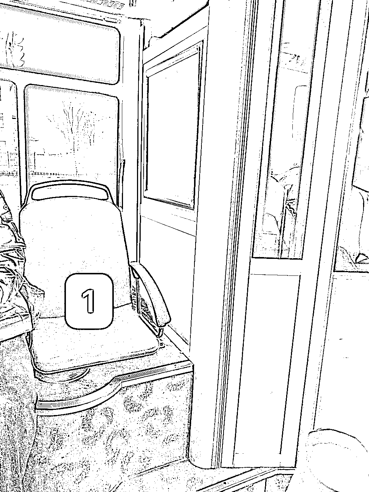
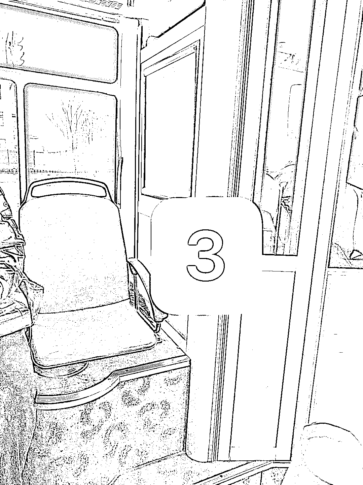
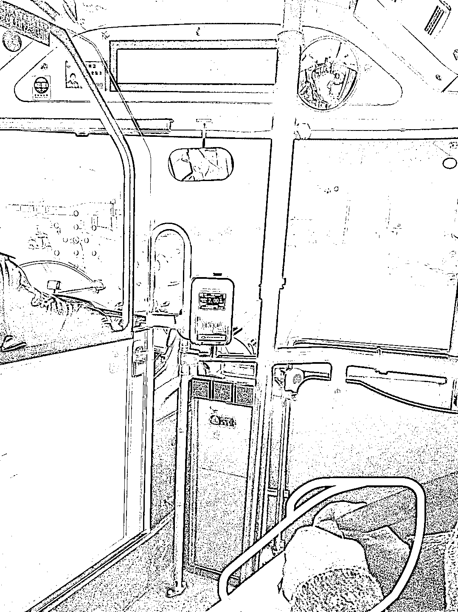
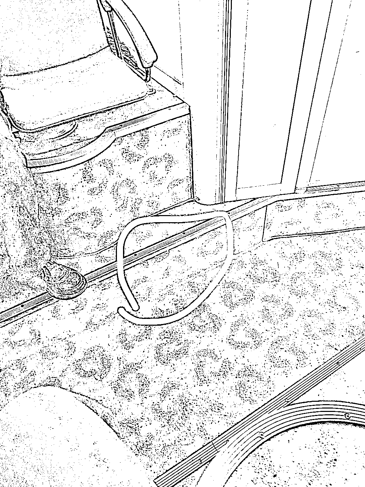

# 《好的服务是会让客户下意识的选择它》

> 原文：[`www.yuque.com/for_lazy/thfiu8/pp2prwqu4m54dogg`](https://www.yuque.com/for_lazy/thfiu8/pp2prwqu4m54dogg)

<ne-h2 id="4d33498f" data-lake-id="4d33498f"><ne-heading-ext><ne-heading-anchor></ne-heading-anchor><ne-heading-fold></ne-heading-fold></ne-heading-ext><ne-heading-content><ne-text id="u04d59716">(51 赞)《好的服务是会让客户下意识的选择它》</ne-text></ne-heading-content></ne-h2> <ne-p id="u0f6688de" data-lake-id="u0f6688de"><ne-text id="ufe889b8d">作者： 奋斗的木鱼</ne-text></ne-p> <ne-p id="u9a589afa" data-lake-id="u9a589afa"><ne-text id="u166992ec">日期：2023-03-22</ne-text></ne-p> <ne-p id="u188ea322" data-lake-id="u188ea322"><ne-text id="u6d377f35">【好的服务是会让客户下意识的选择它】</ne-text> <ne-text id="u4f779a4c">早上公交，遇到一个很有趣的现象。</ne-text></ne-p> <ne-p id="uf28bfe04" data-lake-id="uf28bfe04"><ne-text id="u4acaf2d3">一位老人在缴费后选择座位，本来是选择我对面的前排“1”号位，都已经走过去准备坐上去了，但在公交启动的情况下选择回来我这边的“2”号座位，就这个现象引起了我的思考“为什么在已选择且要准备坐上去的时候，突然改变选择的座位？”</ne-text></ne-p> <ne-p id="u42c45f53" data-lake-id="u42c45f53"><ne-text id="u32e694af">回到现场，我看了几个点，然后从中推导或许能推测这现象发生背后的理由。</ne-text></ne-p> <ne-p id="u7f38eb5a" data-lake-id="u7f38eb5a"><ne-text id="u8cfaeef8">1.老人首次选择的座位【回到“3”号去对比“2”号】有以下不同</ne-text> <ne-text id="ub14c9726">（1）视野不同</ne-text> <ne-text id="u8ee75f40">（2）面向不同</ne-text> <ne-text id="u83c5335b">（3）相邻人员不同</ne-text> <ne-text id="ueb2b5a68">（4）“2”号旁有扶手而“3”号旁没扶手（图 4 是对比图）</ne-text></ne-p> <ne-p id="u6f644a4a" data-lake-id="u6f644a4a"><ne-text id="u6c56dae6">2.老人背着单边包，手拎白色塑料袋（图 5）</ne-text></ne-p> <ne-p id="u5f484519" data-lake-id="u5f484519"><ne-text id="uf1fc3fb3">3.观察到座位都有一个小阶梯，需要迈步上抬才能上到座位上（图 6）</ne-text></ne-p> <ne-p id="u5b986d81" data-lake-id="u5b986d81"><ne-text id="u938df205">结合 1.2.3 点推导，老人可能在选择 1 号转换 2 号的理由有可能是：</ne-text> <ne-text id="ue7669725">老人在公交启动时，需要赶紧坐下，而缴费后映入眼帘且最近的一个位置就是“1”号，走过去准备上坐时发现，在启动的车辆里不好发力，需要借用工具帮助自己迈上那个小阶梯，但是首选的“1”号并没有明显的扶手，由于自己手拎袋子，“1”号座位的座位扶手与自己可借力手同方向，导致借力不好借，一时间没能上座。</ne-text></ne-p> <ne-p id="uadc0cbbd" data-lake-id="uadc0cbbd"><ne-text id="u853e3110">在这期间，行驶的公交让老人被动的选择就近座位，因为我隔壁的“2”号位具备扶手又是最近的距离，因此成为老人下意识的选择。</ne-text></ne-p> <ne-p id="u511284ad" data-lake-id="u511284ad"><ne-text id="u42b6a7f7">一场公交上老人临时的换座，让我看到了非常有趣知识，更让我想起一句话“好的服务是会让客户下意识的选择”。</ne-text><ne-card data-card-name="image" data-card-type="inline" id="E6feE" data-event-boundary="card">  <ne-p id="uc9e239f3" data-lake-id="uc9e239f3"><ne-card data-card-name="image" data-card-type="inline" id="WznI3" data-event-boundary="card">  <ne-p id="ud271e853" data-lake-id="ud271e853"><ne-card data-card-name="image" data-card-type="inline" id="OueRZ" data-event-boundary="card">  <ne-p id="ub315afbc" data-lake-id="ub315afbc"><ne-card data-card-name="image" data-card-type="inline" id="QdvZQ" data-event-boundary="card">  <ne-p id="u055445fe" data-lake-id="u055445fe"><ne-card data-card-name="image" data-card-type="inline" id="z9Bx2" data-event-boundary="card">  <ne-p id="u1774986a" data-lake-id="u1774986a"><ne-card data-card-name="image" data-card-type="inline" id="iOvNT" data-event-boundary="card">  <ne-hole id="ua4b6a4a9" data-lake-id="ua4b6a4a9"><ne-card data-card-name="hr" data-card-type="block" id="ZUj7a" data-event-boundary="card"><ne-p id="u9e568c23" data-lake-id="u9e568c23"><ne-text id="u98cfb55c">评论区：</ne-text></ne-p> <ne-p id="u7e4b26b6" data-lake-id="u7e4b26b6"><ne-text id="ucc6a4257">checker100* : 赞，善于发现，学习 ing</ne-text> <ne-text id="u227fbc00">嘻嘻｜溪溪 : 观察力不错[微笑]</ne-text> <ne-text id="u67e173e3">奋斗的木鱼 : 哈哈哈哈，谢谢夸奖呀</ne-text> <ne-text id="u5679b375">奋斗的木鱼 : 嘿嘿，因为好的观察能带来财富的机会</ne-text> <ne-text id="u5cb64b5c">嘻嘻｜溪溪 : 赞同[微笑]</ne-text> <ne-text id="ua51f2b1b">有期 : 谢谢[憨笑]，原来还可以这样观察</ne-text> <ne-text id="u6f46e73d">奋斗的木鱼 : 嘿嘿，可有趣了</ne-text></ne-p></ne-card></ne-hole></ne-card></ne-p></ne-card></ne-p></ne-card></ne-p></ne-card></ne-p></ne-card></ne-p></ne-card></ne-p>