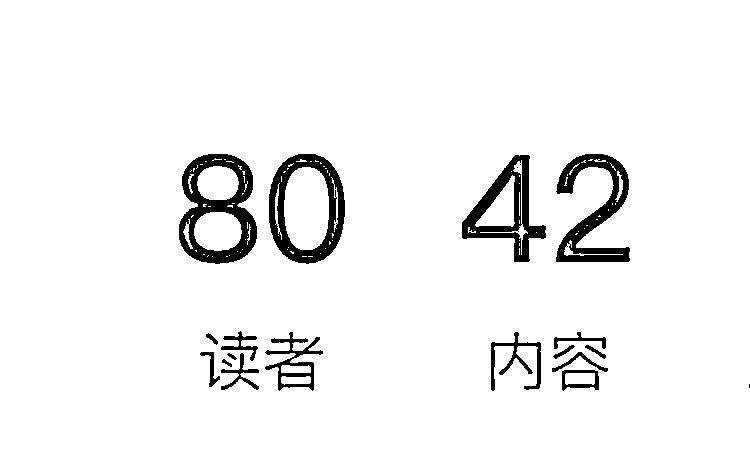

# 《分享一天内利用小报童设计出一款付费产品的经历》

> 原文：[`www.yuque.com/for_lazy/thfiu8/gwgzvbmoc8lxhgfq`](https://www.yuque.com/for_lazy/thfiu8/gwgzvbmoc8lxhgfq)

<ne-h2 id="15b53152" data-lake-id="15b53152"><ne-heading-ext><ne-heading-anchor></ne-heading-anchor><ne-heading-fold></ne-heading-fold></ne-heading-ext><ne-heading-content><ne-text id="u3720fcff">(50 赞)《分享一天内利用小报童设计出一款付费产品的经历》</ne-text></ne-heading-content></ne-h2> <ne-p id="u84e81e4e" data-lake-id="u84e81e4e"><ne-text id="uf225cdf3">作者： 白杨私人号</ne-text></ne-p> <ne-p id="udaabc73c" data-lake-id="udaabc73c"><ne-text id="u896c02ec">日期：2023-03-22</ne-text></ne-p> <ne-p id="ud52d921d" data-lake-id="ud52d921d"><ne-text id="u03604c5a">我是如何一天内，利用小报童设计出一款付费产品的？分享我从发现，到执行，到目前成功出售 80 单的经历。</ne-text></ne-p> <ne-p id="uf3c8ed41" data-lake-id="uf3c8ed41"><ne-text id="u33d4bd7e">（定价 199/年，目前 6 天 80 单卖出了 1.5w 元，属于内测期，未全面推广。预计 4 月正式全面推。后期我会在满几百或上千人之后写复盘再次分享，也希望大家祝愿我能大麦~）</ne-text></ne-p> <ne-p id="ubd223abc" data-lake-id="ubd223abc"><ne-text id="u9100534a">分享我的整个过程：</ne-text> <ne-text id="ue455f962">1️⃣对贴合自己的事，有极度敏感的嗅觉：闻见味儿了，同时要记住你能闻见的别人也会闻见，只是味的浓度每个人闻着不一样</ne-text></ne-p> <ne-p id="ub2d6f6fc" data-lake-id="ub2d6f6fc"><ne-text id="u616fde27">2 月 10 号那天，我加到了一位叫做孙哲 的老师（后来发现也在生财），我翻阅他朋友圈看见有这样的一个我从未见过的东西：小报童。于是我立马付费订阅，我的好奇心动了，首先是孙哲老师的小报童内容定位是我需要的，其次我觉得很新奇，我通过刷他朋友圈立马就订阅，这个动作已经说明了，体验感、链路、所有的所有，已经吸引到我了，我＝大多数其他用户！</ne-text></ne-p> <ne-p id="ue05d6f0b" data-lake-id="ue05d6f0b"><ne-text id="u7a5c6f7b">接着我就去看相关介绍，有申请专栏的地方，基于我自己本身所在公司也是知识付费大板块，内容基础十分富足，当即我便已经知道自己要做什么专栏了。我立刻申请，第二天专栏通过。当晚一夜没睡，把我脑海里已经有的整个产品框架做出，第二天一大早给公司创始人看，当即通过批准，干！</ne-text></ne-p> <ne-p id="u8946db2d" data-lake-id="u8946db2d"><ne-text id="u122f375c">2️⃣产品的定位：最擅长什么，就给擅长的东西做成一个产品。</ne-text></ne-p> <ne-p id="uc815e619" data-lake-id="uc815e619"><ne-text id="u70c27d62">两三天时间我订阅了不下 10 个专栏，去做分析，对比。大部分定位是某个平台的玩法，某个什么什么的玩法。定价基本是买断制，39-99 较多。</ne-text></ne-p> <ne-p id="ufd60e401" data-lake-id="ufd60e401"><ne-text id="u19ea4b9b">而我选择做 199/年的订阅制，围绕我们公司现有的知识模型去做一个合集，已有的知识内容我们很多，而新的内容我们每天都在产出，所以专栏是集合地，是一些不合适出现在社群、朋友圈等地方的内容港湾。我们是不做卖课程这一环的，专栏的出现，直接“上位”顶替。</ne-text></ne-p> <ne-p id="u62423d52" data-lake-id="u62423d52"><ne-text id="u3e688c19">属于一款引流品！低客单！直白点就是，有群体吃不动高客单，这样的群体在我们的私域里就是“我们的下沉市场”。而我们做的整体高度很高，不可能拿着个一两百的品，去发朋友圈像卖护肤品那样做朋友圈宣传，不是不好，而是现阶段这样做就太背道而行了。专栏的形式是静默交易，只用像转发公众号到朋友圈那样去转发专栏进朋友圈，用户就可以成交。好看又高级、链路短、静默交易，很多细节都是我需要的特性。</ne-text></ne-p> <ne-p id="u671bbf3e" data-lake-id="u671bbf3e"><ne-text id="u7f6cc363">专栏最开始是季度，就暂时没有推广。等待 30 天可以开通年度，直到 3.13 号才开通用户可以年付费，开始推给用户们。同时我也开启了分销玩法，包括很多细节，都得益于老师 （也是后来得知老徐也在生财）他给我了巨大的灵感启发方面的帮助，我也给专栏开启了分销，设定的 50％。目前有订阅用户成功分销出去了，可行的，非常可行。</ne-text></ne-p> <ne-p id="ue817751c" data-lake-id="ue817751c"><ne-text id="u52c9ed38">3️⃣看见了，有想法就立马干</ne-text> <ne-text id="u10040204">我不想站着说话不腰疼，可事实就是，执行力快，动作快，快人一步就是快人一路。那不拿别人比，足够快也是让自己提升的更快。</ne-text></ne-p> <ne-p id="u89c65641" data-lake-id="u89c65641"><ne-text id="u5dca3130">虽然我从小就是执行力强的人，不服就干。长大后遇到很多变故，我变得极度敏感，也会纠结害怕退缩。例如我见很多大佬分享的，自媒体人的一些不好的小毛病。比如因为一个社群的名字而纠结来纠结去，再或者是不好意思卖产品，什么七大姑八大姨的看见怎么办。还有什么会不会失败，会有人买吗？……这些问题我也遇到过，后来自己开窍了，因为我发现我每次能赚到钱，都是说干就干，没有过多的纠结。为什么自己好好的优势不发挥，在那里发挥弱点呢。于是这个事，直接解决。</ne-text></ne-p> <ne-p id="uedf10d62" data-lake-id="uedf10d62"><ne-text id="u64ed64d8">人，一定要不断的解决各种大大小小的问题，其实解决的问题足够多，经验就会足够丰富，那么你的能力就是在这里增长的，同时你的自信也是这里迸发的，就是一整套闭环。为什么你发现你一旦勇敢迈出去，解决了一些困难，你对这件事就从不自信变成非常有把握，就是这个原因。勇敢点，记住，快人一步，就是快人一路。</ne-text></ne-p> <ne-p id="u43c7bce4" data-lake-id="u43c7bce4"><ne-text id="u55ed240e">4️⃣机遇，巧合：通过遇见的一系列做自媒体的人，给了我巨大的灵感</ne-text> <ne-text id="ubcd6ed38">二月真的很有意思，例如我加的孙哲老师，后面遇到老徐老师，发现生财有术，遇到的芷蓝姐 星月哥 梁靠谱 我发现有的老师朋友圈都有小报童，有的老师的朋友圈让我得知他们是知识星球，且是同星球的人。我就有种直觉，我肯定会因此发生些什么，感觉就是瞌睡送枕头。我想出一个什么什么产品，接着遇到孙哲老徐两位老师，孙哲老师那里，我得知了可以做专栏。老徐老师那里我得知了专栏还可以怎么怎么玩。感谢遇见🙏</ne-text><ne-card data-card-name="image" data-card-type="inline" id="DSWzl" data-event-boundary="card">  <ne-hole id="ubc073809" data-lake-id="ubc073809"><ne-card data-card-name="hr" data-card-type="block" id="E6daR" data-event-boundary="card"><ne-p id="ucaa0181e" data-lake-id="ucaa0181e"><ne-text id="uc7fb0a00">评论区：</ne-text></ne-p> <ne-p id="u95b4a520" data-lake-id="u95b4a520"><ne-text id="u75396ca9">白杨私人号 : 付费生财，也基于了我添加的老师们都在生财。已经潜移默化的影响我“需要进一个”</ne-text> <ne-text id="u82ddfedf">张达达 : 小报童的创始人也在生财</ne-text> <ne-text id="ua22f5b4b">白杨私人号 : 啊[发呆]</ne-text> <ne-text id="u617c2cb8">伯乐先生 : 小报童是啥？</ne-text> <ne-text id="uf08829e9">海波  活动策划师 : 学到了把客户需求满足当下需求的东西能够进行深挖</ne-text> <ne-text id="u83c5c06e">海波  活动策划师 : 因为小报童的内容介绍的太少了这个项目</ne-text> <ne-text id="u7a9c5383">书情小跟班 : 少楠</ne-text> <ne-text id="u031ced1b">Vivian : 提个问题，已经有星球，是不是也需要小报童呢？有点担心，会增加工作量，并且让用户多一个路径。</ne-text></ne-p></ne-card></ne-hole></ne-card></ne-p>