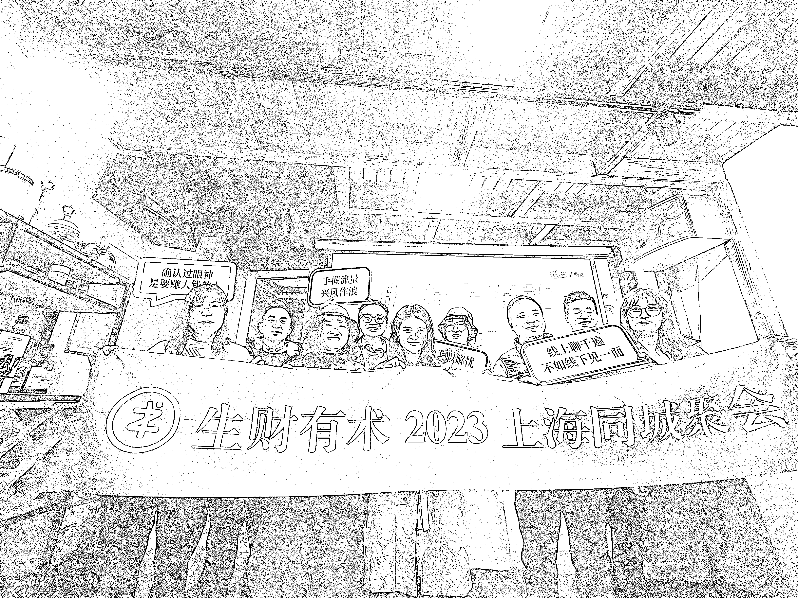

# 《生财上海同城活动复盘分享》

> 原文：[`www.yuque.com/for_lazy/thfiu8/cgwwlsiya6d44g1s`](https://www.yuque.com/for_lazy/thfiu8/cgwwlsiya6d44g1s)

## (48 赞)《生财上海同城活动复盘分享》 

作者： 柯 小 南 

日期：2023-03-22 

生财上海同城活动复盘分享 

从三个方向进行复盘：活动前、活动中和活动后。 

一、活动前 1、确定场地（活动场地和含包厢的饭店）； 2、确定人员及人数； 3、确定时间； 4、交通出行的方式，地铁或者驾车； 5、目的地导航和路线； 6、活动前的准备提醒； 7、其他注意事项； 

针对上门的一些问题，我详细列了一个 pdf 文档并在群里发了一个公告。 

公告信息如下： 

欢迎⼤家参加⽣财上海同城⻅⾯会 我是本次的召集⼈柯⼩南，是程序员届的⼀股清流。⽬前在互联⽹⾏业摸爬滚打，平时也整点⾃媒体，希望和⼤家交个朋友～ <ne-uli><ne-uli-i>●</ne-uli-i><ne-uli-c class="ne-uli-content" id="u9f58d11d" data-lake-id="u9f58d11d">地点：交通⼤学附近</ne-uli-c></ne-uli> <ne-uli><ne-uli-i>●</ne-uli-i><ne-uli-c class="ne-uli-content" id="uaa6f118a" data-lake-id="uaa6f118a">时间：2023-3-18 14:00</ne-uli-c></ne-uli> <ne-uli><ne-uli-i>●</ne-uli-i><ne-uli-c class="ne-uli-content" id="u4c9c8ba2" data-lake-id="u4c9c8ba2">附近休闲娱乐：港汇⼴场、美罗城、太平洋百货等等</ne-uli-c></ne-uli> <ne-uli><ne-uli-i>●</ne-uli-i><ne-uli-c class="ne-uli-content" id="u7c0a52ba" data-lake-id="u7c0a52ba">交通 地铁：10/11 交通⼤学地铁站 1 号⼝700⽶左右，地铁 1/9/11 号线徐家汇地铁站 15 号⼝400⽶左右。 驾⻋：附近⼩区 10 元左右（需要提前联系登记数量）</ne-uli-c></ne-uli> 

注意地铁末班⻋ 1 号线 ⾟庄 （末班⻋：23:16），1 号线 富锦路 （末班⻋：22:50） 9 号线 松江南站 （末班⻋：23:19），9 号线 曹路 （末班⻋：23:26） 11 号线 安亭 （末班⻋：23:05），11 号线 花桥 （末班⻋：22:40），11 号线 嘉定北 （末班⻋：23:10） 10 号线 航中路 （末班⻋：23:18），10 号线 虹桥⽕⻋站 （末班⻋：22:23），10 号线 基隆路 （末班⻋： 22:50） 下面是下地铁路线图。 

然后活动前，我希望大家都可以准备一些自己分享的东西（防止冷场）。 

具体内容如下： 为了更好地交流和展示自己的优势，希望大家能够积极参与下午的沟通活动（需要每一个小伙伴的参与）。这次活动将围绕两个主题展开：资源分享和赚钱思路。除此之外，我们也可以添加一些其他的内容。 1、资源分享 2、赚钱思路和想法 3、人生感悟和心情分享 4、未来规划和展望 5、技能分享和学习计划 6、行业动态和趋势 7、生活经验和技巧分享 

二、活动中 整个过程中，安排了一个记录员，把一些重点信息记录下来。 

确定活动时间安排 1、13:45-14:00 签到环节 2、14:00-14:30 自我介绍 3、14:30-14:45 特殊节目 4、14:45-18:00 思维碰撞 5、18:00-20:00 饭局交流 6、20:00-20:10 特殊节目 7、20:10～∞ 自由活动 

在这个阶段最重要的是把控活动的时间。 1、个人自我介绍尽量在 2-3 分钟之内； 2、尽量确定饭局人数，然后好再次和饭店确认； 3、自由发言阶段，尽快把控时间（举例：10 人三小时，那么一个人大概在 20 分钟左右，如果超过半小时，需要适当提醒一下） 4、饭局尽量让每一个人都点菜，防止有人不爱吃别人点的菜； 5、拍合影的时候，尽量喊口号，整齐有气势且不会冷场，尽量带自拍杆或者能够辅助拍摄的设备（比如苹果手表）； 6、注意地铁末班车时间，防止晚上回去不方便； 7、尽量准备 PPT，流程更近合理； 

三、活动后主要是回顾和复盘 1、整理会议记录内容； 2、向每一个人询问活动感受和反馈； 3、最后感谢大家的参与； 

四、不足之处和提升 1、可以准备破冰游戏或者活动，可以尽快热场； 2、可以多进行拍照； 3、主方向一定要把控； 4、提前了解大家的行业和工作经历，防止冷场和无效链接； 

线上聊千变，不如线下见一面~ 期待下一次链接。 

评论区： 

易道书緣 : 我也在上海，下次加入 柯 小 南 : 安排安排[呲牙][呲牙][呲牙] 海波  活动策划师 : 没有在长春的吗？ 柯 小 南 : 有吉林市的。长春你可以安排一波啊 Tyler : 也带我一个！ 蛋蛋。 : 有没有广州的呢？ 武哥 : 在内蒙通辽的有吗😄 tk 海外公会招商 : 互动内容如果再加点自己面前项目中遇到的困境或是问题的提出，大家结合自己资源帮忙分析对策和对接，但是不知道大家都能不能倾囊相授