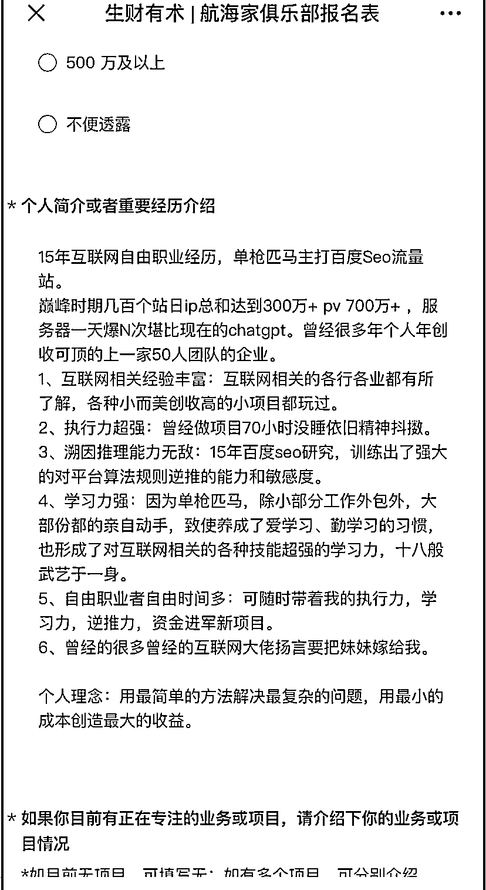
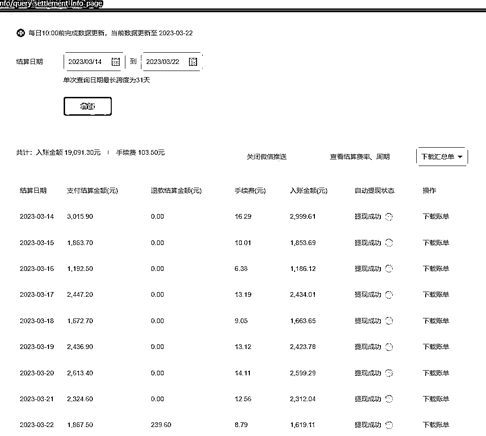
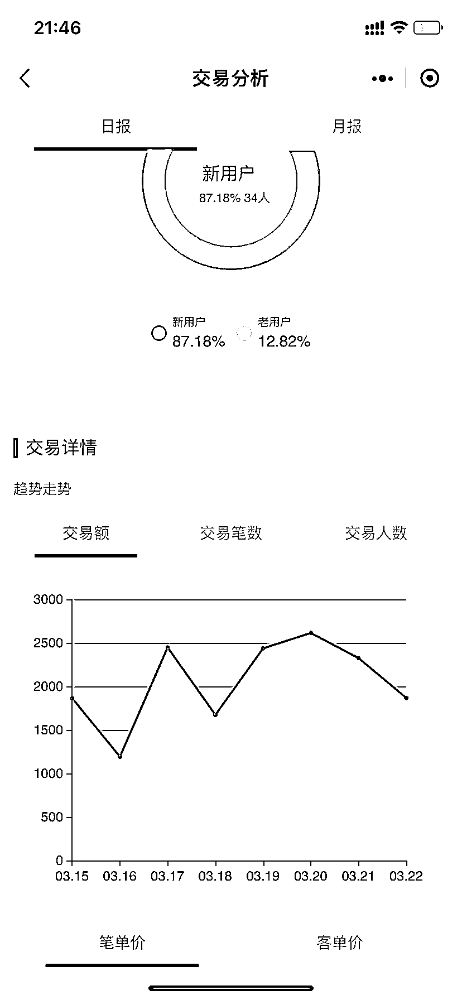

# 《单枪匹马做躺着赚钱项目掘金的随笔》

> 原文：[`www.yuque.com/for_lazy/thfiu8/pdf4gg602zw9t4y7`](https://www.yuque.com/for_lazy/thfiu8/pdf4gg602zw9t4y7)

<ne-h2 id="680fa3ab" data-lake-id="680fa3ab"><ne-heading-ext><ne-heading-anchor></ne-heading-anchor><ne-heading-fold></ne-heading-fold></ne-heading-ext><ne-heading-content><ne-text id="ua47efdca">(166 赞)《单枪匹马做躺着赚钱项目掘金的随笔》</ne-text></ne-heading-content></ne-h2> <ne-p id="u0b7f6cc7" data-lake-id="u0b7f6cc7"><ne-text id="u99b30ed8">作者： 斩天</ne-text></ne-p> <ne-p id="u1561c68f" data-lake-id="u1561c68f"><ne-text id="u9bf3aabf">日期：2023-03-24</ne-text></ne-p> <ne-p id="u8263d8e0" data-lake-id="u8263d8e0"><ne-text id="u91376952">昨天看了第六期精华合集才发现本渣在星球的处女作，一篇无心插柳的水文发布了一个月后竟不可思议被加精了，难以置信，可能是亦老板手抖的缘故让我受宠若惊，故今天补上这篇望能弥补上篇精华的自我感觉受之有愧。</ne-text></ne-p> <ne-p id="ua85c05de" data-lake-id="ua85c05de"><ne-text id="u37ce3105">因已不在江湖好几年，暂没有太多前沿东西拿得出手，所以只能提炼回忆中的一些往事来娓娓道来，若能给圈友从另一个角度带来一点生财思考或灵感启示即足以。</ne-text></ne-p> <ne-p id="u0f99a819" data-lake-id="u0f99a819"><ne-text id="u7dc823d0">本文依旧延续水文风格，讲人话不加故弄高深能让文章看起来高大上的高级装 B 词汇。</ne-text></ne-p> <ne-p id="u1467729d" data-lake-id="u1467729d"><ne-text id="ucc3c0e07">按惯例先自我介绍。</ne-text></ne-p> <ne-p id="ua3acbac2" data-lake-id="ua3acbac2"><ne-card data-card-name="image" data-card-type="inline" id="eQxBO" data-event-boundary="card"></ne-card></ne-p> <ne-p id="u608b2994" data-lake-id="u608b2994"><ne-text id="u205dec5f" ne-bold="true">目录</ne-text></ne-p> <ne-p id="u39dd94b7" data-lake-id="u39dd94b7"><ne-text id="u9e1aecb8" ne-bold="true">一、背景介绍</ne-text></ne-p> <ne-p id="uee60eef5" data-lake-id="uee60eef5"><ne-text id="u5606dfd0" ne-bold="true">二、躺赚项目列举</ne-text></ne-p> <ne-p id="u726912bb" data-lake-id="u726912bb"><ne-text id="ue0bb3397" ne-bold="true">三、个人落地思路篇(仅供参考)</ne-text></ne-p> <ne-p id="u4d710dc8" data-lake-id="u4d710dc8"><ne-text id="ufbefd0f3" ne-bold="true">四、躺赚项目的本质与思考</ne-text></ne-p> <ne-p id="u10f1e274" data-lake-id="u10f1e274"><ne-text id="u697ba1ed" ne-bold="true">五、寻找优质躺赚项目的方法论</ne-text></ne-p> <ne-p id="ud040a445" data-lake-id="ud040a445"><ne-text id="ubf849750" ne-bold="true">最后：</ne-text></ne-p> <ne-h2 id="933c7004" data-lake-id="933c7004"><ne-heading-ext><ne-heading-anchor></ne-heading-anchor><ne-heading-fold></ne-heading-fold></ne-heading-ext><ne-heading-content><ne-text id="u191a6b80" ne-bold="true">一、背景介绍</ne-text></ne-heading-content></ne-h2> <ne-h5 id="116b7de5" data-lake-id="116b7de5"><ne-heading-ext><ne-heading-anchor></ne-heading-anchor><ne-heading-fold></ne-heading-fold></ne-heading-ext><ne-heading-content><ne-text id="udf3e8d81" style="background-color: rgb(255, 255, 255); color: rgb(47, 48, 52);">眼见他起高楼,眼见他宴宾客,眼见他楼塌了</ne-text></ne-heading-content></ne-h5> <ne-p id="u0701814d" data-lake-id="u0701814d"><ne-text id="ub78724f7">15 年期间见证了 pc 时代的崛起，享受了 pc 时代的红利，最后见证了 pc 的没落。</ne-text></ne-p> <ne-p id="u3cdf1737" data-lake-id="u3cdf1737"><ne-text id="u4e9135db">做过大大小小的正规项目应该超过了 50 几个，见过的 hui 色项目起码上百个，收集的各种骚炒作野路子不胜枚举。</ne-text></ne-p> <ne-p id="u2c74b38f" data-lake-id="u2c74b38f"><ne-text id="ua381b4e2">时间听起来很长，但我们那一批个人站长做了 10 多年的真的一抓一大把。很多都是在无意中踩中了 pc 时代红利马太崛起深耕后无暇破圈最终没落的。</ne-text></ne-p> <ne-p id="uad4cf386" data-lake-id="uad4cf386"><ne-text id="uda538a89">值得反思的是如果那些年果能试着去接纳一些新鲜事物能把网站流量引导到一个池子里面沉淀，比如公众号，指不定现在个个都是千万级别粉丝的公众号主了。</ne-text></ne-p> <ne-p id="u3104859d" data-lake-id="u3104859d"><ne-text id="ub263aa95">事物都有双面性，对于个体而言，过于深耕但没走出去有时候会有让自己陷入一些弊端，比如没有闲暇去接纳研究新事物，这点需要我们认真反省……</ne-text></ne-p> <ne-p id="u24793c1a" data-lake-id="u24793c1a"><ne-text id="u0b946972">记得在行业唱衰后的那一年内，发生了 3 件触动我的事情。</ne-text></ne-p> <ne-h3 id="2cb824a9" data-lake-id="2cb824a9"><ne-heading-ext><ne-heading-anchor></ne-heading-anchor><ne-heading-fold></ne-heading-fold></ne-heading-ext><ne-heading-content><ne-text id="ue76b3dd7" ne-bold="true">1、绝技现世</ne-text></ne-heading-content></ne-h3> <ne-p id="u2a315e90" data-lake-id="u2a315e90"><ne-text id="ubc2b0ba8">市场上阿猫阿狗的培训机构不知道从哪里偷学来了一招又一招的降龙十八掌并广泛传播。</ne-text></ne-p> <ne-p id="ub1f1ea1b" data-lake-id="ub1f1ea1b"><ne-text id="u5ae1aaca">干货俯拾即是，</ne-text><ne-text id="ua7700dfd" ne-bold="true">绝技现世往往是在行业即将没落或已经没落的时刻。（这个观点我不接受任何反驳）</ne-text></ne-p> <ne-p id="u26b887e8" data-lake-id="u26b887e8"><ne-text id="uc4aca29b">行业红利期 辉煌时刻</ne-text></ne-p> <ne-p id="uf29a1109" data-lake-id="uf29a1109"><ne-text id="uea621a63">高手拽在手中的绝活打死都不会分享出来的。</ne-text></ne-p> <ne-p id="u89943adb" data-lake-id="u89943adb"><ne-text id="u7ffbb64a">在辉煌期不是血脉关系或铁到不一般大佬顶多带你入入门后让你自己修行，然后有问则答，压箱底的绝活哪怕是收了你的钱也会不舍得给予。</ne-text></ne-p> <ne-p id="u79b0d7d2" data-lake-id="u79b0d7d2"><ne-text id="u13037bd9">其次，大量绝技现世其实对所有人都不见得是好事情。</ne-text></ne-p> <ne-p id="uf2468aac" data-lake-id="uf2468aac"><ne-text id="u83a78b05">老江湖肯定是不愿意看到的，因为竞争优势会递减。</ne-text></ne-p> <ne-p id="u2d2ef99f" data-lake-id="u2d2ef99f"><ne-text id="u8a8a2c0e">初出江湖的可能当时很兴奋，但岂不知入了一个即将没落的江湖。</ne-text></ne-p> <ne-p id="u356d5779" data-lake-id="u356d5779"><ne-text id="u38ee675f">另外人人都能得到的绝世神功只能让神功变得平庸。</ne-text></ne-p> <ne-p id="u69c5fd82" data-lake-id="u69c5fd82"><ne-text id="u06bddc88">在一个行业深根久了就会发现，对于很多老江湖来说时间一到很多</ne-text><ne-text id="u0f8c5c01" ne-bold="true">绝技就会像宿命一样会殊途同归不约而至</ne-text><ne-text id="ua0f51765">，有时候还会产生错觉，认为对方是不是盗了自己的电脑里面的资料，因为“这个绝妙的方法明明是我想出来的呀，别人怎么会知道”</ne-text></ne-p> <ne-h3 id="8631a7e4" data-lake-id="8631a7e4"><ne-heading-ext><ne-heading-anchor></ne-heading-anchor><ne-heading-fold></ne-heading-fold></ne-heading-ext><ne-heading-content><ne-text id="u9bbe6fe2" ne-bold="true">2、开山级别大佬开始不惜羽毛</ne-text></ne-heading-content></ne-h3> <ne-p id="u078816be" data-lake-id="u078816be"><ne-text id="uf612fe77">此处不方便展开提</ne-text></ne-p> <ne-h3 id="68a8d182" data-lake-id="68a8d182"><ne-heading-ext><ne-heading-anchor></ne-heading-anchor><ne-heading-fold></ne-heading-fold></ne-heading-ext><ne-heading-content><ne-text id="u2850dfae" ne-bold="true">3、一些大佬交流群慢慢变成了股票交流群</ne-text></ne-heading-content></ne-h3> <ne-p id="u610b7068" data-lake-id="u610b7068"><ne-text id="u2cd1a228">一个有共性的原因可能是</ne-text></ne-p> <ne-p id="u414668a6" data-lake-id="u414668a6"><ne-text id="u6e0f01cd">那些年大家都赚了钱累积了不少资本 但是由于各方面因素 没能及时转型 破圈 钱又没地方去。</ne-text></ne-p> <ne-p id="u9277ed2c" data-lake-id="u9277ed2c"><ne-text id="uda18b2f4">绝技的现市，力证行业已经没落。</ne-text></ne-p> <ne-p id="u445deec9" data-lake-id="u445deec9"><ne-text id="u1d89989b">加上十多年长时间高强度工作，从未有过的心力憔悴感扑面而来，十多年都没感觉累过，可能是年龄大起来了，突然一下激情全无，只有一种想法“我想睡觉”。</ne-text></ne-p> <ne-p id="ua1f8fd29" data-lake-id="ua1f8fd29"><ne-text id="uc8d09a31">所以我选择休养生息即躺平。</ne-text></ne-p> <ne-p id="ua686dd6f" data-lake-id="ua686dd6f"><ne-text id="uc589fc46">以前可以 72 小时不睡觉，现在不睡足 10 个小时浑身不自在。</ne-text></ne-p> <ne-h2 id="11f98a3e" data-lake-id="11f98a3e"><ne-heading-ext><ne-heading-anchor></ne-heading-anchor><ne-heading-fold></ne-heading-fold></ne-heading-ext><ne-heading-content><ne-text id="ud74e52d8" ne-bold="true">二、躺赚项目举列</ne-text></ne-heading-content></ne-h2> <ne-p id="u6988d79d" data-lake-id="u6988d79d"><ne-text id="uee429751">选择休养生息后发现私人项目库里面还躺着上百个潜力项目未启动或还未启动就已经逝势的。</ne-text></ne-p> <ne-p id="u47387338" data-lake-id="u47387338"><ne-text id="u97b9bea4">那颗还没完全沉静的心依然有着一丝不安，躺平之前还是不能坐吃空山。所以从项目库里面挑选了一些轻松能躺平又能勉强维持的小美项目。</ne-text></ne-p> <ne-p id="u33547a24" data-lake-id="u33547a24"><ne-card data-card-name="image" data-card-type="inline" id="HmHsr" data-event-boundary="card"></ne-card></ne-p> <ne-p id="u53cdeb7c" data-lake-id="u53cdeb7c"><ne-text id="u14b97893" ne-bold="true">好项目几句话就能讲清楚不需要长篇大论。</ne-text></ne-p> <ne-h3 id="00338ae0" data-lake-id="00338ae0"><ne-heading-ext><ne-heading-anchor></ne-heading-anchor><ne-heading-fold></ne-heading-fold></ne-heading-ext><ne-heading-content><ne-text id="u903c112a" ne-bold="true">1、简历一键自动生成+简历在线编辑：</ne-text></ne-heading-content></ne-h3> <ne-p id="u965c0234" data-lake-id="u965c0234"><ne-text id="uc3b5e11b">具体百度下就明白，他们做的比我好，那时候还没几个人竞价</ne-text></ne-p> <ne-p id="ucbecd430" data-lake-id="ucbecd430"><ne-text id="u33037a96">现在已经是一大片了。</ne-text></ne-p> <ne-h3 id="7c26fb3f" data-lake-id="7c26fb3f"><ne-heading-ext><ne-heading-anchor></ne-heading-anchor><ne-heading-fold></ne-heading-fold></ne-heading-ext><ne-heading-content><ne-text id="u93248c44" ne-bold="true">2、自动起名算命等：</ne-text></ne-heading-content></ne-h3> <ne-p id="u82ce7939" data-lake-id="u82ce7939"><ne-text id="u591c7d62">非常流弊的程序就几十块钱，只是现在的竞争已经是过去的 20 倍不止了</ne-text></ne-p> <ne-h3 id="d4b5aa3c" data-lake-id="d4b5aa3c"><ne-heading-ext><ne-heading-anchor></ne-heading-anchor><ne-heading-fold></ne-heading-fold></ne-heading-ext><ne-heading-content><ne-text id="uabdbbc6e" ne-bold="true">3、祭祀网 网上纪念馆 祭念馆  网上陵墓：</ne-text></ne-heading-content></ne-h3> <ne-p id="u43ecb06f" data-lake-id="u43ecb06f"><ne-text id="u881fb136">清明时节雨纷纷，是这项目的爆发期，尤其是口罩这几年。想了解的自行百度，像打赏主播一样给挂念的亲人或者名人创建网上祭念馆 上香柱 X 元/ 送花/歌曲/祭品等等  转发 裂变。。看着有点瘆人。。。每当有明星 或者有名人挂的时候又是一波被转发和收益的高峰期…有很多骚玩法……并且现在这个也有人竞价了。。</ne-text></ne-p> <ne-h3 id="d0ce6261" data-lake-id="d0ce6261"><ne-heading-ext><ne-heading-anchor></ne-heading-anchor><ne-heading-fold></ne-heading-fold></ne-heading-ext><ne-heading-content><ne-text id="u2fc73d81" ne-bold="true">4、题库网：</ne-text></ne-heading-content></ne-h3> <ne-p id="u7ee863ab" data-lake-id="u7ee863ab"><ne-text id="ucc14f7a6">一听到这个就有人觉得掉牙了，因为寡头早就出现了， 但是 哪些大头基本上聚焦的是 k12，我做的是例如考证的、自考的和一些职业教育类的。用户看题目后点击答案 弹出付费二维码…..</ne-text></ne-p> <ne-h3 id="80562a21" data-lake-id="80562a21"><ne-heading-ext><ne-heading-anchor></ne-heading-anchor><ne-heading-fold></ne-heading-fold></ne-heading-ext><ne-heading-content><ne-text id="u47d84e8c" ne-bold="true">5、冷门资料下载站骚操作：</ne-text></ne-heading-content></ne-h3> <ne-p id="ud8469ed3" data-lake-id="ud8469ed3"><ne-text id="u4c843444">一个百 M 的软件或资料 变成几 G 让用户下载 用户辛辛苦苦下载 沉没成本后 解压的时候惊喜的发现需要密码。旁边有个付款二维码 扫一扫</ne-text></ne-p> <ne-p id="u225c817a" data-lake-id="u225c817a"><ne-text id="u580472d3">自动获取密码……</ne-text></ne-p> <ne-h3 id="944ece6b" data-lake-id="944ece6b"><ne-heading-ext><ne-heading-anchor></ne-heading-anchor><ne-heading-fold></ne-heading-fold></ne-heading-ext><ne-heading-content><ne-text id="u9bcb6f75" ne-bold="true">6、美女性感图片站：</ne-text></ne-heading-content></ne-h3> <ne-p id="ufc2ed857" data-lake-id="ufc2ed857"><ne-text id="u487279f2">绝世美女性感处被 1 个付款二维码挡住，扫一扫看全图………</ne-text></ne-p> <ne-h3 id="29a475df" data-lake-id="29a475df"><ne-heading-ext><ne-heading-anchor></ne-heading-anchor><ne-heading-fold></ne-heading-fold></ne-heading-ext><ne-heading-content><ne-text id="uc109b8f2" ne-bold="true">7、微信群二维码站：</ne-text></ne-heading-content></ne-h3> <ne-p id="u731f1029" data-lake-id="u731f1029"><ne-text id="uf9c9678b">那时候微商大量需要各种群二维码…….</ne-text></ne-p> <ne-p id="ucafbb3a1" data-lake-id="ucafbb3a1"><ne-text id="ua2bdc5a6" ne-bold="true">一句话讲明白上面的项目：百度下竞价推广的那些比我做的好。你一看就明白。</ne-text></ne-p> <ne-p id="u0663b755" data-lake-id="u0663b755"><ne-text id="ua2e90dcc">上面的项目我最终经过多方面考虑只做了简历和题库，因为其他的感觉已经不是我的良知和法律界线能承受的了的了。</ne-text></ne-p> <ne-p id="u1988c7fe" data-lake-id="u1988c7fe"><ne-text id="u0591af9a">另外还有 4 个王牌主打且非常正规合法的项目 是很多人这辈子都没听说过或者说听到即划走过没印象了。</ne-text></ne-p> <ne-p id="uf8bb36dc" data-lake-id="uf8bb36dc"><ne-text id="u4a18aba7">但是我惊讶发现有 2 个在生财有术里竟然被提到过。遗憾虽然被提到但是没被得到因有的关注，没被掀起波澜。原因可能是：有些干实事的人，性情木纳不擅结交人脉，文字朴实不善言辞渲染，不注重系统化输出。</ne-text></ne-p> <ne-p id="u94810df4" data-lake-id="u94810df4"><ne-text id="u25fe00fd" ne-bold="true">所以说 我们不能总盯着精华帖看，非精华帖有时也可以逛逛里面或许暗藏宝藏。</ne-text></ne-p> <ne-h2 id="153a02a0" data-lake-id="153a02a0"><ne-heading-ext><ne-heading-anchor></ne-heading-anchor><ne-heading-fold></ne-heading-fold></ne-heading-ext><ne-heading-content><ne-text id="ud0a8a6a0" ne-bold="true">三、个人落地思路篇(仅供参考)</ne-text></ne-heading-content></ne-h2> <ne-p id="u9dbea829" data-lake-id="u9dbea829"><ne-text id="uf2ab800a" ne-bold="true">与其说是躺赚项目，不如说是把某个项目做成了躺赚模式！</ne-text></ne-p> <ne-h3 id="dc895ada" data-lake-id="dc895ada"><ne-heading-ext><ne-heading-anchor></ne-heading-anchor><ne-heading-fold></ne-heading-fold></ne-heading-ext><ne-heading-content><ne-text id="u062288cd" ne-bold="true">1、总纲</ne-text></ne-heading-content></ne-h3> <ne-p id="ud04d534d" data-lake-id="ud04d534d"><ne-text id="u41353b6a">虽然是一个个体，但是对于每一个项目我都把他当做一家公司。</ne-text></ne-p> <ne-p id="ub0909740" data-lake-id="ub0909740"><ne-text id="u9803ddfa">技术入股：花多少力气</ne-text></ne-p> <ne-p id="u2b841dc2" data-lake-id="u2b841dc2"><ne-text id="u3e971641">资金入股：花多少钱</ne-text></ne-p> <ne-p id="u47dc1b36" data-lake-id="u47dc1b36"><ne-text id="ud5b2084e">力气 金钱 回报率 超出正向或负向阈值 要么迭代加码要么果断放弃。</ne-text></ne-p> <ne-p id="ub4998ecc" data-lake-id="ub4998ecc"><ne-text id="uda76c60e">其实有时候网站做到一定规模的后期是没有马太效应的</ne-text></ne-p> <ne-p id="ue684e023" data-lake-id="ue684e023"><ne-text id="ub656a9e9">反而会受到官方以及各方势力的人工干预，除非你是实打实正儿八经一步步做起来的。</ne-text></ne-p> <ne-p id="u08a0d671" data-lake-id="u08a0d671"><ne-text id="u71d4a143">要把一杯水烧到 100 度和只烧到 30 度需投入精力和时间是不成正比的</ne-text></ne-p> <ne-p id="ub3482a9b" data-lake-id="ub3482a9b"><ne-text id="ud1156621">若目标是 30 度</ne-text></ne-p> <ne-p id="u5c6d2a84" data-lake-id="u5c6d2a84"><ne-text id="udeaac192">可能就需要花 3 分力气   轻轻松松完成目标</ne-text></ne-p> <ne-p id="uceab94f6" data-lake-id="uceab94f6"><ne-text id="u3d58661b">若目标是 100 度</ne-text></ne-p> <ne-p id="u9b2d3f2d" data-lake-id="u9b2d3f2d"><ne-text id="u81c27c65">可能就需要 100 分力气 还不一定达得到</ne-text></ne-p> <ne-p id="u57465739" data-lake-id="u57465739"><ne-text id="u0a951247">30 杯 30 度的水产生的收益 不见得会低于 100 度的水</ne-text></ne-p> <ne-p id="u9321552c" data-lake-id="u9321552c"><ne-text id="u2d42b854">并且成功几率大 失败风险小</ne-text></ne-p> <ne-p id="u03f7e520" data-lake-id="u03f7e520"><ne-text id="ud1758756">所以这次我转变了思路：</ne-text></ne-p> <ne-p id="ufc530fe9" data-lake-id="ufc530fe9"><ne-text id="u17e1a4b1" ne-bold="true">这次项目，都不弄大，主要是要能轻松在市场上占有一丁点的分额就够了，以量变的方式引发质变。</ne-text></ne-p> <ne-p id="u1b33144e" data-lake-id="u1b33144e"><ne-text id="u2cd23efb">既然是躺赚项目，那么后期必须是极小的力气和资金，回报率必然也不可能特别大。那么只有一个办法，量化。其实对于我们来说做网站的边际成本非常低。</ne-text></ne-p> <ne-p id="u932a694f" data-lake-id="u932a694f"><ne-text id="ua0422167">以前挑项目总是：高优势+高兴趣+高收益</ne-text></ne-p> <ne-p id="u0b153645" data-lake-id="u0b153645"><ne-text id="ua66e998f">这次已经无所谓兴趣了。痛苦也只是那么一段准备启动的过程。</ne-text></ne-p> <ne-p id="u0131d741" data-lake-id="u0131d741"><ne-text id="u80ae0d43">就这样，每个项目 50 个网站开搞，花了近 2 个月一口气做了或改版了几百个网站再用一些特殊方法每个站多多少少获取了一些流量。就这样躺着了后面很少去管理，就经常看下微信商户处理投诉。</ne-text></ne-p> <ne-h3 id="8be3d1d6" data-lake-id="8be3d1d6"><ne-heading-ext><ne-heading-anchor></ne-heading-anchor><ne-heading-fold></ne-heading-fold></ne-heading-ext><ne-heading-content><ne-text id="u0af01d0b" ne-bold="true">2、成交流程设计</ne-text></ne-heading-content></ne-h3> <ne-p id="u6625ac53" data-lake-id="u6625ac53"><ne-text id="ue2d4c39e">那时候参考了大多数网站成交流程是：流量—售前、注册—成交—售后(—裂变)等</ne-text></ne-p> <ne-p id="ufe37851a" data-lake-id="ufe37851a"><ne-text id="u9989ebc9">我总感觉一注册就让用户觉得会有种要收费的感觉。</ne-text></ne-p> <ne-p id="ud49108b8" data-lake-id="ud49108b8"><ne-text id="u0fdb56e0">目标既然是躺赚 是轻松 是对累字的厌恶，那么流程就一定要简化</ne-text></ne-p> <ne-p id="u711cebcb" data-lake-id="u711cebcb"><ne-text id="uead9a62e">极简到：流量-成交</ne-text> <ne-text id="u810e44e2" ne-bold="true">即付即用即走</ne-text> <ne-text id="u23993b63">无售前和售后</ne-text></ne-p> <ne-p id="ud52e8b50" data-lake-id="ud52e8b50"><ne-text id="ue4daa2d5">以简历项目为例：无需注册即可在线编辑，等用户编辑完要导出或者下载的时候，弹出收款二维码，如果用户不扫码那么就等于辛辛苦苦在线编辑的简历付诸东流。</ne-text></ne-p> <ne-p id="u7e33169e" data-lake-id="u7e33169e"><ne-text id="ua2282879">没有售前 售后服务 有投诉一律集中退款 其实投诉退款率也不高。</ne-text></ne-p> <ne-h3 id="ac6702ac" data-lake-id="ac6702ac"><ne-heading-ext><ne-heading-anchor></ne-heading-anchor><ne-heading-fold></ne-heading-fold></ne-heading-ext><ne-heading-content><ne-text id="u9f299175" ne-bold="true">3、信任问题</ne-text></ne-heading-content></ne-h3> <ne-p id="u05d03fde" data-lake-id="u05d03fde"><ne-text id="u63d5430b">用户粘性，信任度问题，都躺赚了是没客服是没时间去优化的。</ne-text></ne-p> <ne-p id="u0201902f" data-lake-id="u0201902f"><ne-text id="ube55ec40">有时候有些项目解决信任问题的不是背书 不是用户体验 最直接的办法就是低价。</ne-text></ne-p> <ne-p id="u4dfae82c" data-lake-id="u4dfae82c"><ne-text id="ua802b72d">用客单价低解决信任度问题也是我想到的躺赚项目的唯一选择， 但凡价格高点就会牵扯各种售后问题了。</ne-text></ne-p> <ne-p id="u1969d1e4" data-lake-id="u1969d1e4"><ne-text id="ude5c077b">这类项目边际成本本身就低。所以我把价格定为低到客户都不会在乎会不会被骗。</ne-text></ne-p> <ne-p id="u37a81bcc" data-lake-id="u37a81bcc"><ne-text id="ubcdfcbad">永远比对手便宜。不要和我说打价格战是在扰乱市场次序。他们不敢便宜是因为他们有投流，我是免费流量。</ne-text></ne-p> <ne-h2 id="7bbc9100" data-lake-id="7bbc9100"><ne-heading-ext><ne-heading-anchor></ne-heading-anchor><ne-heading-fold></ne-heading-fold></ne-heading-ext><ne-heading-content><ne-text id="u5137822c" ne-bold="true">四、躺赚项目的本质与思考</ne-text></ne-heading-content></ne-h2> <ne-h3 id="304b6eab" data-lake-id="304b6eab"><ne-heading-ext><ne-heading-anchor></ne-heading-anchor><ne-heading-fold></ne-heading-fold></ne-heading-ext><ne-heading-content><ne-text id="u5f510738" ne-bold="true">1、躺赚项目收益高吗</ne-text></ne-heading-content></ne-h3> <ne-p id="ub83dc602" data-lake-id="ub83dc602"><ne-text id="u488fa394">想啥呢？都不爱劳作了，还想着赚大钱？还有天理吗？</ne-text></ne-p> <ne-p id="ube3bec2e" data-lake-id="ube3bec2e"><ne-text id="u8e25b03a">1 个躺赚的项目大多是盈利低的。高盈利的必然事情多无法躺下去。</ne-text></ne-p> <ne-p id="uc1aa8c63" data-lake-id="uc1aa8c63"><ne-text id="u668bc4bd">那么要想高盈利且躺赚必须是</ne-text><ne-text id="ud7cb23f1" ne-bold="true">多项目合集</ne-text><ne-text id="u6a82b31d">。任何单一的躺平项目都很难高收益。</ne-text></ne-p> <ne-p id="ue01506e4" data-lake-id="ue01506e4"><ne-text id="u441c7b31">花百来万买套房出租好的躺赚也得 10-20 年回本。更何况投入本就不大的互联网项目呢。</ne-text></ne-p> <ne-h3 id="79c34010" data-lake-id="79c34010"><ne-heading-ext><ne-heading-anchor></ne-heading-anchor><ne-heading-fold></ne-heading-fold></ne-heading-ext><ne-heading-content><ne-text id="ub2d93a95" ne-bold="true">2、躺赚项目有时效性</ne-text></ne-heading-content></ne-h3> <ne-p id="ua7165f98" data-lake-id="ua7165f98"><ne-text id="u326905d9">世界上没有永动机</ne-text></ne-p> <ne-p id="u59fadc8b" data-lake-id="u59fadc8b"><ne-text id="u9ca319c4">后期花气力不多</ne-text></ne-p> <ne-p id="u05c60671" data-lake-id="u05c60671"><ne-text id="u1c63bbca">慢慢效益会随着能量的递减而逐步消失</ne-text></ne-p> <ne-p id="u751f4cfc" data-lake-id="u751f4cfc"><ne-text id="uc9beada4">总体流量会慢慢下滑</ne-text></ne-p> <ne-p id="uaa6023e2" data-lake-id="uaa6023e2"><ne-text id="ud25a198d">玩法也会慢慢过时</ne-text></ne-p> <ne-p id="ub6054eea" data-lake-id="ub6054eea"><ne-text id="u9cd30b46">对手会慢慢递增</ne-text></ne-p> <ne-p id="uf8507973" data-lake-id="uf8507973"><ne-text id="udc0941c8">各种状况问题也会日积月累</ne-text></ne-p> <ne-h3 id="7a7e8cfd" data-lake-id="7a7e8cfd"><ne-heading-ext><ne-heading-anchor></ne-heading-anchor><ne-heading-fold></ne-heading-fold></ne-heading-ext><ne-heading-content><ne-text id="ua6e1b443" ne-bold="true">3、躺也是需要维护的</ne-text></ne-heading-content></ne-h3> <ne-p id="u08b6c03b" data-lake-id="u08b6c03b"><ne-text id="u304d1c6a">躺赚项目也需要周期性维护。</ne-text></ne-p> <ne-p id="uef6b55d0" data-lake-id="uef6b55d0"><ne-text id="u966cabf1">好比房子出租了几年了也总要修修补补下。</ne-text></ne-p> <ne-h3 id="eff92cc9" data-lake-id="eff92cc9"><ne-heading-ext><ne-heading-anchor></ne-heading-anchor><ne-heading-fold></ne-heading-fold></ne-heading-ext><ne-heading-content><ne-text id="uf3cb4611" ne-bold="true">4、躺赚项目只是基于资源和技能积累后变现的一种方式</ne-text></ne-heading-content></ne-h3> <ne-p id="ub6c5e6a6" data-lake-id="ub6c5e6a6"><ne-text id="ud822f96a">比如买房收租金躺赚。需要先奋斗积累资金。</ne-text></ne-p> <ne-p id="u3e858a0e" data-lake-id="u3e858a0e"><ne-text id="u4bb8a317">只不过我们做的互联网项目投入的更多的是多年累积的技术和资源。</ne-text></ne-p> <ne-h2 id="0ead9651" data-lake-id="0ead9651"><ne-heading-ext><ne-heading-anchor></ne-heading-anchor><ne-heading-fold></ne-heading-fold></ne-heading-ext><ne-heading-content><ne-text id="u20fb49e6" ne-bold="true">五、寻找优质躺赚项目的方法论</ne-text></ne-heading-content></ne-h2> <ne-p id="u17256457" data-lake-id="u17256457"><ne-text id="u75826dce">躺赚项目强相关于工具、充值、自助、自动化类项目。沿着这个思路下去+运气加持</ne-text></ne-p> <ne-p id="u19c8a5a5" data-lake-id="u19c8a5a5"><ne-text id="u218499ff">其实有些项目</ne-text></ne-p> <ne-p id="u0bddb816" data-lake-id="u0bddb816"><ne-text id="u7fe2c1cf">无论是多高的人都不一定能百眼看出里面的门道，因为只有亲身做过后才知晓里面的阻碍和潜力值。</ne-text></ne-p> <ne-p id="u5e49de0d" data-lake-id="u5e49de0d"><ne-text id="ucf6d6631">前期的评估只是停留在有限理论阶段的初步预断</ne-text></ne-p> <ne-p id="u69d0bdea" data-lake-id="u69d0bdea"><ne-text id="ub0f179b4">靠方法论在互联网蛮难找到冷门躺赚项目。</ne-text></ne-p> <ne-p id="u41baf337" data-lake-id="u41baf337"><ne-text id="uf5cf3681">数据分析能力再强也分析不出不在数据内的项目，榜单或者数据上能看到的都是红海。</ne-text></ne-p> <ne-p id="u84998010" data-lake-id="u84998010"><ne-text id="uaede543f">真正的冷门躺赚项目都没有资格进入榜单数据里。</ne-text></ne-p> <ne-p id="u2a83bfa2" data-lake-id="u2a83bfa2"><ne-text id="u07f0b4c9">甚至有时候你看到了好项目也极有可能不起眼的划走了。</ne-text></ne-p> <ne-p id="uc376fe2b" data-lake-id="uc376fe2b"><ne-text id="u7c5be869">我们可以用它的共性特征思路去提高遇到它的偶然性概率，以及可以圈内沟通互通有无。</ne-text></ne-p> <ne-p id="u71414f79" data-lake-id="u71414f79"><ne-text id="uaea98bd9" ne-italic="true">插播一条相关信息。</ne-text></ne-p> <ne-p id="u1f484547" data-lake-id="u1f484547"><ne-text id="u81bab845" ne-italic="true">（</ne-text></ne-p> <ne-p id="ua59ae52c" data-lake-id="ua59ae52c"><ne-text id="u4f145ae2">以前一个转型做外贸的好兄弟， 第 1 年没赚到钱 但是第 2 年莫名其妙就赚了近 70 个 w。</ne-text></ne-p> <ne-p id="u92197314" data-lake-id="u92197314"><ne-text id="uecb74efc">因为选品和平台。</ne-text></ne-p> <ne-p id="u3dad8079" data-lake-id="u3dad8079"><ne-text id="ufbfe269c" ne-bold="true">选品：</ne-text></ne-p> <ne-p id="ud68d9610" data-lake-id="ud68d9610"><ne-text id="ue28ca369">他的蓝海品压根就不是选出来的。</ne-text></ne-p> <ne-p id="u378eb4ed" data-lake-id="u378eb4ed"><ne-text id="u1520443a">因为那东西压根就不在五行中，超出三界外，无论你是看榜</ne-text></ne-p> <ne-p id="uf4e2097d" data-lake-id="uf4e2097d"><ne-text id="uabed40e4">看数据等等各种选品方法都好，都不可能选的出。</ne-text></ne-p> <ne-p id="u15eecbe1" data-lake-id="u15eecbe1"><ne-text id="uc4d7ab23">那么他是怎么找到的?他老婆的闺蜜在某家外贸公司上班偷偷透露给他的。。。。。那么他老婆闺蜜公司的老板是怎么选出来这个品的？</ne-text></ne-p> <ne-p id="u6b9dc540" data-lake-id="u6b9dc540"><ne-text id="u61bd32c7" ne-bold="true">平台：</ne-text></ne-p> <ne-p id="u89577986" data-lake-id="u89577986"><ne-text id="u7d0d0475">这个平台我试着网上搜索相关信息都很少，我估计大多数外贸专员都不一定知道它的存在。</ne-text></ne-p> <ne-p id="ub665dcf9" data-lake-id="ub665dcf9"><ne-text id="u9dc241c7">这可能就是你们常提的信息差吧。</ne-text></ne-p> <ne-p id="u03db6d5a" data-lake-id="u03db6d5a"><ne-text id="uf5f63ccb" ne-bold="true">思考,不要总盯着热门平台。有时候小平台 冷门平台更容易做到头部，获益的可能性可能更大。</ne-text></ne-p> <ne-p id="u4a4b2963" data-lake-id="u4a4b2963"><ne-text id="u990dcc8e" ne-italic="true">）</ne-text></ne-p> <ne-p id="u440faff8" data-lake-id="u440faff8"><ne-card data-card-name="image" data-card-type="inline" id="ntO0c" data-event-boundary="card"></ne-card></ne-p> <ne-p id="ua8652a04" data-lake-id="ua8652a04"><ne-text id="u39cc8cdc" ne-italic="true">(此文缺图 账单来凑)</ne-text></ne-p> <ne-p id="udbce03bd" data-lake-id="udbce03bd"><ne-text id="u1c6cb634">虽然。不复当年。但也算过了几年轻松日子。</ne-text></ne-p> <ne-h2 id="e33863a2" data-lake-id="e33863a2"><ne-heading-ext><ne-heading-anchor></ne-heading-anchor><ne-heading-fold></ne-heading-fold></ne-heading-ext><ne-heading-content><ne-text id="ubf00f558" ne-bold="true">最后</ne-text><ne-text id="u4331f85c" style="background-color: rgb(255, 255, 255); color: rgb(30, 78, 121);">：</ne-text></ne-heading-content></ne-h2> <ne-p id="uaea119eb" data-lake-id="uaea119eb"><ne-text id="u011f926f" ne-bold="true">与其说是躺赚项目，不如说是把某个项目做成了躺赚模式！</ne-text></ne-p> <ne-p id="u74b4b272" data-lake-id="u74b4b272"><ne-text id="u441ed9f3" ne-bold="true">因为任何看似的躺赚项目都有人做成了精致非躺赚项目！</ne-text></ne-p> <ne-p id="u94fd0f22" data-lake-id="u94fd0f22"><ne-text id="u2a971a05">练好一门技术</ne-text></ne-p> <ne-p id="ue7d17aba" data-lake-id="ue7d17aba"><ne-text id="u030ca994">修炼出自己的绝技</ne-text></ne-p> <ne-p id="u06f4c48f" data-lake-id="u06f4c48f"><ne-text id="ucf85ff70">建立起自己的兵器库</ne-text></ne-p> <ne-p id="u7ed85db7" data-lake-id="u7ed85db7"><ne-text id="ue2387c5b">打造自己的项目库</ne-text></ne-p> <ne-p id="u04bf8dfc" data-lake-id="u04bf8dfc"><ne-text id="ucfe3acc0">缩小信息差</ne-text></ne-p> <ne-p id="u9c71af86" data-lake-id="u9c71af86"><ne-text id="u13c77648">…….</ne-text></ne-p> <ne-p id="u2d139235" data-lake-id="u2d139235"><ne-text id="u67baf325">这些都很重要</ne-text></ne-p> <ne-p id="u1dbc13cb" data-lake-id="u1dbc13cb"><ne-text id="ucc88dfba" ne-underline="true">马上要开启破天行动 新的方向，新的征程。</ne-text></ne-p> <ne-p id="u1723318d" data-lake-id="u1723318d"><ne-text id="ucd7aeb4f" ne-underline="true">欢迎同频共振！</ne-text></ne-p> <ne-p id="uc7d3005b" data-lake-id="uc7d3005b"><ne-text id="u35282ab1" ne-bold="true" ne-italic="true">注：本文很多观点可能只针对我个人情况只适合我个人，请理性判断与参考。</ne-text></ne-p> <ne-p id="u0018e6e8" data-lake-id="u0018e6e8"><ne-text id="u22dc6fba" ne-bold="true" ne-italic="true">——————————————</ne-text></ne-p> <ne-p id="u53d12a30" data-lake-id="u53d12a30"><ne-text id="uafb5bb5b" ne-bold="true" ne-italic="true">新增：</ne-text></ne-p> <ne-p id="uaec63063" data-lake-id="uaec63063"><ne-text id="u71a6bb71">该贴发后，没想到一大批圈友私或通过评论区的 V 加我后</ne-text></ne-p> <ne-p id="u51692b46" data-lake-id="u51692b46"><ne-text id="u9c2f3d5f">问 我有没有相关培训或社群想付费进去学习</ne-text></ne-p> <ne-p id="u923d0ca6" data-lake-id="u923d0ca6"><ne-text id="u993827da">统一答：没有。</ne-text></ne-p> <ne-p id="ucc9b0fbc" data-lake-id="ucc9b0fbc"><ne-text id="udc0f129b" ne-bold="true">作为一个深耕的个体不可能会有时间身兼多职</ne-text></ne-p> <ne-p id="u7eaa9d9b" data-lake-id="u7eaa9d9b"><ne-text id="uc9ac83c7">生财里面这么多好帖已经够大家认真研习与发散性举一反三实现几何级增长</ne-text></ne-p> <ne-p id="u12abb219" data-lake-id="u12abb219"><ne-text id="u520c7b04">出了这个门,外面的世界太复杂,不要冲动性的被一些感知价值所迷惑</ne-text></ne-p> <ne-p id="ucb5b6e20" data-lake-id="ucb5b6e20"><ne-text id="u9c649b95">还有 N 个发红包问我有没有 hui 产暴利项目推荐的</ne-text></ne-p> <ne-p id="u91e35970" data-lake-id="u91e35970"><ne-text id="uf8b78741">统一答：别加我。别影响了我中华好男孩的一身正气！</ne-text></ne-p> <ne-p id="u47433abb" data-lake-id="u47433abb"><ne-text id="u3e77a78e">经验告诉我 和非正道者链接 会影响自身气运！正道才是王道！</ne-text></ne-p> <ne-p id="uc757765e" data-lake-id="uc757765e"><ne-text id="u84b36c05">大家有好的 idea 项目 可以彼此分享交流 但是拒绝 hui 产项目交流！</ne-text></ne-p> <ne-p id="u784b7c96" data-lake-id="u784b7c96"><ne-text id="u995dfdfa">如果你也是个体 我们也可以彼此分享个体效率成长方面的经验！（交流 V: weixinhaoma868 暗号 zt）</ne-text></ne-p> <ne-hole id="u8aec6d47" data-lake-id="u8aec6d47"><ne-card data-card-name="hr" data-card-type="block" id="Ws0lh" data-event-boundary="card"><ne-p id="u2bb6d04b" data-lake-id="u2bb6d04b"><ne-text id="u6fc7d6e1">评论区：</ne-text></ne-p> <ne-p id="u8760a0f9" data-lake-id="u8760a0f9"><ne-text id="uff3fe473">执着的启明星 : 大佬，想请教一下，最近我有一些各种职业资格考试的一些学生资源，也想着做题库，刷题的项目，后来跟法务聊了一下，他说现在题库资源都有版权问题，不知道咱们这边是怎么解决题库资源的？如果获取授权的呢？</ne-text> <ne-text id="u0ebb6e79">好好学习 : 生财难得深度好文</ne-text> <ne-text id="ub339b17a">斩天 : 有些试卷有有些没有版权</ne-text> <ne-text id="u04f522b7">我是把试卷里面的题目 全部拆分出来为一个个题目了  这样就好很多了 尤其是一些非特殊化的题目就不存在版权问题了 比如 1+1 等于几</ne-text> <ne-text id="uf6b6aad6">我们以前的做类似规避方法基本是，把责任推给 UGC 标注为 XX 用户上传  就好比百度文库</ne-text> <ne-text id="u7550a735">试卷版权本身就有争议性 风险不大</ne-text> <ne-text id="u11d3249d">另外我们以前面对一些与版权相关的项目的时候</ne-text> <ne-text id="ub15d0458">域名要么不备案 要么个人备案 不能用企业备案</ne-text> <ne-text id="u162fe61e">这样对方都没办法起诉你。域名商 服务器商 包括腾讯 不会因为别人一个律师函就出卖你的个人信息。</ne-text> <ne-text id="uc558a1aa">另外 题库我是没遇到说要我删题目的</ne-text> <ne-text id="u4331c8fc">违法不犯罪就不用太担心。。尤其是做的不大的时候更不用担心，开车违章还违法呢 你只要考虑成本问题就可以了  你觉得你能做多大?多少人会告你？以前有个朋友的公司明目张胆侵权 都不怕 就是他计算好了违法成本。。。。。</ne-text> <ne-text id="u85647fec">热爱 : 太厉害了[抓狂][抓狂]</ne-text> <ne-text id="u692fa801">柠檬🍋 : 底层逻辑应该是 SEO+矩阵吧,SEO 应该是多年经验积累,比较重要,希望大佬分享一下 seo 经验[呲牙]</ne-text> <ne-text id="u19c78a27">砂纹 : 同意所有观点，感谢分享，今年看到的第一篇有价值好文[咖啡][咖啡]</ne-text> <ne-text id="uc8bcde08">苏生 : 感谢分享，超级个体（可以是一个人、一个小团队）+躺赚模式，是我想象中最让人热血沸腾的赚钱模式，感谢大佬梳理分享</ne-text> <ne-text id="u43e3135f">斩天 : 你的总结能力比我强</ne-text></ne-p></ne-card></ne-hole>