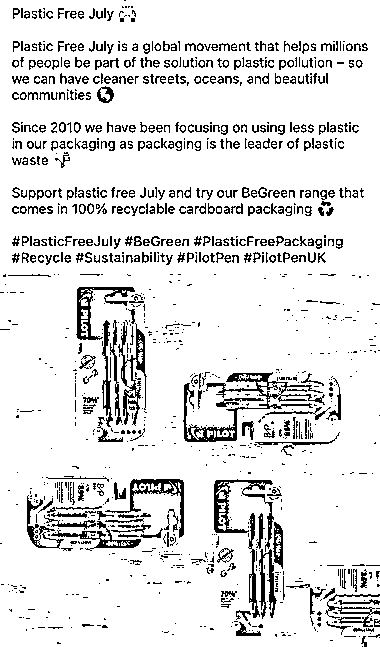
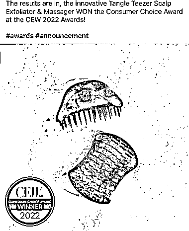
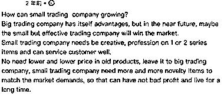

# 《如何在领英开发客户？》

> 原文：[`www.yuque.com/for_lazy/thfiu8/guorid1ks8qf9lgr`](https://www.yuque.com/for_lazy/thfiu8/guorid1ks8qf9lgr)

## (38 赞)《如何在领英开发客户？》 

作者： 队长 

日期：2023-03-20 

如何在领英开发客户？(领英用户大部分都是老板和职场人，用户价值比较高) 

大家好，我是队长，目前经营两家小公司，一家传统外贸，一家亚马逊，是一个带着自媒体基因的外贸人,目前在领英接到的订单每年大致在三百来万美金，包括返单和新开发的客户下单，不要觉得三百万美金很多，这是销售额而已，给中间商和零售商供货，这个业绩也就一般，不过对于我们小公司来说还不错 

最初接触领英的时候，我只是把它当成寻找客户买手和对应邮箱的工具，只要知道公司名，就可以在领英上毫不费力的知道这个客户的人事架构，也就是外贸人最喜欢的买手信息，知道了买手的名字，再结合已知的域名信息和其他人的邮箱格式，可以轻松推断出买手的邮箱，那么就可以套用传统外贸那一套开发这个客户了，这应该也是目前大部分外贸人使用领英的方法 

但是这个简单的模式下，我需要不停的解决三个问题：吸引客户买手+当一段时间备胎+产生信任下单，效率很低，光是当备胎当那段时间，就很难熬，需要你不停的报价寄样品，但实际上很可能你只是客户老供应商的参照物，努力再多，老供应商不出问题，你还是没机会。 有没有什么办法，让客户自己找我？ 自己送上门，可比挨家挨户推销好太多了！ 

如果客户自己送上门，那么路径就从吸引，反复交流产生信任，到询价下单，直接跳到了询价下单环节，省掉很多前期工作，至少，不用天天自己忙前忙后的报价打样，然后眼巴巴看着隔壁老王入洞房了 

怎么让客户自己来找我？ 天天发产品，肯定行不通，但这也是很多外贸人天天在做的事，不停的拿自己的产品刷屏，好一点的配一两句鸡汤，这这种操作在客户看来，你就是想赚我的钱，还污染我的朋友圈，联想一下没有套路的微商动作，是不是让你第一次刷到的时候就把他删了？ 还有一部分天天发日常，也是无效工作，客户并不关心你的日常，除非你的日常对他产生了价值 

所以想让客户产生信任感，两个办法：真实+专业 想让客户被吸引，两个办法：干货+迷人的产品 从这四个方面入手，去打造自己的领英，很大程度上你会超过百分之 80 的外贸人 因为这里就会带着自媒体的营销基因，大部分外贸人，根本不懂营销，哪怕你的营销能力，100 分里仅仅只能拿 10 分，在外贸市场上你已经可以干掉大部分竞争对手 

为了更好运营，我设计了一个架构，用四个账号来操作: <ne-oli><ne-oli-i>1</ne-oli-i> <ne-oli-c class="ne-oli-content" id="ufe903b3d" data-lake-id="ufe903b3d">是设计师的号，主要发一些我们给客户做的设计包装，或者是转发一些别的设计师做的比较好的设计原创,突出我们对产品包装微创新的重视，这也是很多客户喜欢的，产品是老产品，但是换个包装设计，就是新产品，这里用客户的文案和图片举个例子，比如说这个客户用环保的概念来设计了笔的包装，就特别符合客户的胃口</ne-oli-c></ne-oli> <ne-oli><ne-oli-i>2</ne-oli-i> <ne-oli-c class="ne-oli-content" id="uf93d141e" data-lake-id="uf93d141e">是验货员的号，主要发一些工厂验货日常，突出我们对货物品质的要求</ne-oli-c></ne-oli> <ne-oli><ne-oli-i>3</ne-oli-i> <ne-oli-c class="ne-oli-content" id="u4226b60a" data-lake-id="u4226b60a">是业务的号，主要发一些新产品，这里画个重点，如果已经有一个重点开发客户，不妨针对性的找一些这个客户可能会感兴趣的产品来发布，先吸引他过来，之后再找机会开发，依旧用客户的推文来举个例子，这是一个获得消费者选择奖的产品</ne-oli-c></ne-oli> <ne-oli><ne-oli-i>4</ne-oli-i> <ne-oli-c class="ne-oli-content" id="uf5ffac1b" data-lake-id="uf5ffac1b">是我自己的号，主要发一些外贸认知和商业思维的小短文+转发设计师，验货员，业务的精华贴，很多客户是更愿意和有话语权的人来谈，所以引流成交主要就是在我这个号上，转发我们自己公司的精华贴，也是一个重要步骤，可以无形中宣传一波。</ne-oli-c></ne-oli> <ne-oli><ne-oli-i>5</ne-oli-i> <ne-oli-c class="ne-oli-content" id="ue0b7d441" data-lake-id="ue0b7d441">初期要先丰富这几个账号，最好是更新到每个账号有 10 到 20 条动态，看起来稍微有点内容，再去添加客户，成功率高很多，并且写的内容也比较容易被目标客户看到，才会产生共鸣并且有联系的冲动</ne-oli-c></ne-oli> 

我举个例子：我有次写了一篇短文，翻译下来就是小贸易公司如何发展？重点一定不是拼价格，而是有能满足市场的新产品，源源不断，才能获得不错的利润 虽然但是，我想说一部分是我的观点文章吸引了他，另外 90%全是运气，但就是这篇文章，帮我撕开了一个口子，让我成了供应商之一 

如何破冰联系客户？ 另一个套路是我借鉴国内自媒体的方式，去我想开发客户的动态下认真评论，产生互动，留下印象，然后再给他发私信介绍，切入这个客户 为什么不能直接发私信，简单直接点呢？外国人不都喜欢直接吗？道理是没错，但外国人不喜欢你直接就想变更他的供应商体系，教他做事，对于有稳定供应链的客户，最好的办法是先做 Plan B，再找机会切入，只要他知道你是做什么的，并且一直在身边以朋友的心态维护，那么他的 Plan A 一出问题，立刻会想到你，这就够了 

不过坚持评论给我带来了一个意外之喜：有个 A 客户的朋友 B，看我天天在和 A 互动，于是就跑来想找我合作，所以多互动，不仅可以体现你的真实，很可能会带来新的生意 强大功能解析 这就牵扯出来领英一个非常强大的隐藏功能，一度二度好友推荐，对于普通人来说可能没用，但是对于生意人，这就是一个无敌的工具 我和 A 客户互相关注，领英会主动推荐出 A 客户的人脉给我，也就是 A 的同行 B，顺理成章，A 的同行那里也会显示我是 A 的朋友，那么我去添加 B，并且谈生意，是不是事半功倍？跨越了陌生供应商的这一步，而是以 A 的朋友出现在同行 B 的视线里，接下来的操作不用我多说，大家都熟悉了 别的行业能不能在领英获客？ 

到这里，其实可以扩展到另一个话题：我们能不能不内卷？去卷卷歪国人？不止外贸，其他比如：设计师，中文外教，整理收纳等等其他行业，依葫芦画瓢，也是可以在领英上分一杯羹的 因为这个软件的特性，其实除了外贸行业，其他人很少会了解并且使用，更不要说从领英上赚钱了，拿设计行业举例子，我们就会喜欢在领英上找专业的设计师，同样一个设计，淘宝 100 搞定，我找了领英设计师，200 美金，只是因为我觉得本土设计师，设计的东西更符合本土的审美 但是，难道国外的客户不想找我们的设计师吗？肯定不是，国外人工一直比国内贵，如果效果差不多，能省的钱为什么不省？以前是很难知道哪些客户有需求，但是领英就给我们架起一座桥梁，可以很轻松的对接到客户，并且还有客户的同行，赚美金肯定是更香，为什么不试试呢 

更何况，现在有 Chat GPT 这个神器，完全可以用来写领英文案，一天高效生产几十篇都不在话下 

 

 

 

评论区： 

Grace : 赞 赛恩吃鱼 : 讲得不错，同样的思维感觉适用于猎头和企业招聘[呲牙]