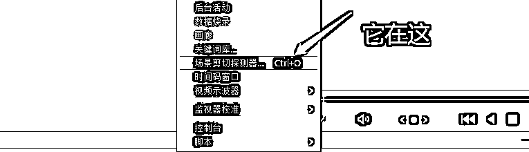
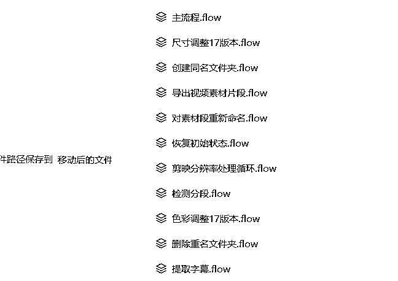

# 《航海复盘：利用剪映+达芬奇+影刀 RPA 提高混剪效率》

> 原文：[`www.yuque.com/for_lazy/thfiu8/lc4onp71o9vlltfl`](https://www.yuque.com/for_lazy/thfiu8/lc4onp71o9vlltfl)

<ne-h2 id="45ae61cd" data-lake-id="45ae61cd"><ne-heading-ext><ne-heading-anchor></ne-heading-anchor><ne-heading-fold></ne-heading-fold></ne-heading-ext><ne-heading-content><ne-text id="uf6703232">(77 赞)《航海复盘：利用剪映+达芬奇+影刀 RPA 提高混剪效率》</ne-text></ne-heading-content></ne-h2> <ne-p id="u87303eaa" data-lake-id="u87303eaa"><ne-text id="u082299f6">作者： 德新</ne-text></ne-p> <ne-p id="ua7e2b6e4" data-lake-id="ua7e2b6e4"><ne-text id="u480abd3e">日期：2023-03-24</ne-text></ne-p> <ne-p id="u86fa6698" data-lake-id="u86fa6698"><ne-text id="u8499b019">大家好，我是德新，是视频号短视频带货航海的船员，每天日志写的目标都是结束时能够有 1000 块的佣金，今天航海结束了，到目前为止，几个号加在一起也才勉强过半。今天这篇复盘，是作为小白的一个探索，既是我的个人复盘，同时也希望能够给需要的朋友提供到一点思路就够了。</ne-text></ne-p> <ne-h2 id="1a77a6a6" data-lake-id="1a77a6a6"><ne-heading-ext><ne-heading-anchor></ne-heading-anchor><ne-heading-fold></ne-heading-fold></ne-heading-ext><ne-heading-content><ne-text id="u44c74fce">一、艰难的剪辑</ne-text></ne-heading-content></ne-h2> <ne-p id="uc9123c0d" data-lake-id="uc9123c0d"><ne-text id="udd5b837f">航海第 2 天，我没有做剪辑，通过考古加去筛品，基本不考虑品怎么样，只要还比较新鲜，直接 BY 到视频号，但不敢多账号弄，我只敢一个号先测试。没想到视频播放的也还不错，有的也能跑出近万的播放量，紧接着就被限制了，问我有没有医疗相关，传上来给我解开，自此第一号：卒。</ne-text></ne-p> <ne-p id="u803cbe87" data-lake-id="u803cbe87"><ne-text id="u436f00b4">航海第 4 天，第一个号没什么留恋的了，第二个号开始。我觉得 BY 还可以呀，只要不涉及医疗就行了，继续。第二天就爆了一万以上的视频，卖了两单，别提多兴奋了，再继续发布视频的时候，突然没播放了，再一看，说我账号内容质量低，让我发 10 个原创来证实我的能力，自此第二个号：虽未死，但已无能力再战。</ne-text></ne-p> <ne-p id="u224ef503" data-lake-id="u224ef503"><ne-text id="ucf35db87">航海第 7 天，终于对 BY 产生了怀疑，那怎么办？实拍？暂时不现实。那就只剩二剪和混剪这条路了，说来想笑，我当时还不知道这两个名词有什么区别，还特意去找 GPT 问了问有啥区别。接下来就开始了混剪之路，当时为了达到每天能够剪辑出 10 条视频，从早上 9 点剪辑到晚上十一二点，也没有达到 10 条，不过好在基本上每一条都过了 BY，其中有一条，我发出去半个小时都没有一个播放，我想，完了，这个号又废了吗。结果是我多虑了，只是这个视频废了而已，终于在第三天让我爆了个视频，爆了 10 万的播放，卖了 20 多单，佣金 200 多。这个时候我觉得混剪的方式是对的，只是效率未免太低了，每天搞一个账号都要累的不行，连救那个半死不活的号的精力都没有。</ne-text></ne-p> <ne-h2 id="d3696f7b" data-lake-id="d3696f7b"><ne-heading-ext><ne-heading-anchor></ne-heading-anchor><ne-heading-fold></ne-heading-fold></ne-heading-ext><ne-heading-content><ne-text id="ueef562ca">二、如何利用剪映+达芬奇+RPA 进行提效</ne-text></ne-heading-content></ne-h2> <ne-p id="u5e6c23de" data-lake-id="u5e6c23de"><ne-text id="u9667f3f1">简单交代下这个几个工具于我的熟悉度。</ne-text></ne-p> <ne-p id="u8dfd7565" data-lake-id="u8dfd7565"><ne-text id="uac35de85">剪映：下载在电脑里比较久的软件了，但基本不用，主要是不会用。</ne-text></ne-p> <ne-p id="uddda60b1" data-lake-id="uddda60b1"><ne-text id="u09a83422">达芬奇：从来没敢下载过这个软件，只是听说是大神调色用的。</ne-text></ne-p> <ne-p id="u9d6c138a" data-lake-id="u9d6c138a"><ne-text id="u8e8973e0">影刀 RPA：去年花了一整个星期自学的，当时是为了群发、群加方便，后来也做过几个简单的流程，但没带来什么生产力。</ne-text></ne-p> <ne-p id="u72da08d9" data-lake-id="u72da08d9"><ne-text id="u5e6937c3">航海第 10 天，偶然我看到日志中有个圈友说，他利用达芬奇的场景剪切探测器对场景进行了自动分割。我是做好物的，这个好像很不错呀，好物的场景基本都是各种切换，哪怕驴唇不对马嘴，这个视频也不违和呀。赶紧找来下载，抓紧应用，结果尴尬的是，场景剪切探测器这个功能我找了一天都没找到。查资料？我查了，GPT 也问了，但好像这个功能特别特别简单一样，他们都不屑于说出来一样，就好像在说，这个东西傻子才会不知道。</ne-text></ne-p> <ne-p id="u4b230f28" data-lake-id="u4b230f28"><ne-card data-card-name="image" data-card-type="inline" id="YlH97" data-event-boundary="card">  <ne-p id="uba714a0e" data-lake-id="uba714a0e"><ne-text id="u583b9406">航海第 12 天，就这样两个软件来回倒腾了 2 天，终于受不了这种效率了，决定彻底改变下，哪怕视频不发了。把 RPA 利用到剪辑上这个想法愈发强烈，在动手之前要先把流程想清楚，那么到底需要怎样的流程呢？</ne-text></ne-p> <ne-p id="uf9df3386" data-lake-id="uf9df3386"><ne-text id="u7f3c4fc3">在确定流程之前，我要明白，需要实现哪些操作。</ne-text></ne-p> <ne-p id="uccbd42cd" data-lake-id="uccbd42cd"><ne-text id="u76d1e98d">1、需要对视频场景进行分割</ne-text></ne-p> <ne-p id="ud59ce6f0" data-lake-id="ud59ce6f0"><ne-text id="u1179aa27">2、需要对分割后的场景进行镜像、缩放、位置变换、滤镜等处理</ne-text></ne-p> <ne-p id="u2a88804c" data-lake-id="u2a88804c"><ne-text id="udf64b1f4">3、需要提取原视频的文案进行调整</ne-text></ne-p> <ne-p id="u1dc01b1f" data-lake-id="u1dc01b1f"><ne-text id="ub730cff0">4、需要提取原视频的标题进行调整</ne-text></ne-p> <ne-p id="u9425f01c" data-lake-id="u9425f01c"><ne-text id="uce661d4d">前两个是在达芬奇就可以实现的，第三个在剪映可以实现，第四个直接提取下载的原视频标题或者用哼哼猫导出标题也可以。</ne-text></ne-p> <ne-p id="u1864920d" data-lake-id="u1864920d"><ne-text id="u023becaa">就像齐杰大佬说过的，要备好料才能做好菜。以上的操作只是为了备料，还有主要的炒菜的一步。我是如何炒菜的呢？</ne-text></ne-p> <ne-p id="u6d1a02ad" data-lake-id="u6d1a02ad"><ne-text id="uc4ddd91b">第一步、打开备料文件(字幕夹),找到合适的旁白文案，这里可以进行两步，也可以忽略这一步，直接用原声旁白。如果要做这一步，可以将文案拿出来让文字转语音工具去转换下即可，如果再增加一步，就是拿去给 GPT 让它给改写一份旁白文案，然后再用文字转语音工具转换。想要多个号发，就多换几个声音，多换几个文案就行了。注：我用的微软的，下载的 1.5.2 的破解版，原来微软官方的那个前两天取消了，要不然加个插件用的还是挺香的。</ne-text></ne-p> <ne-p id="u895f71db" data-lake-id="u895f71db"><ne-text id="u7a36d500">第二步、打开标题文件，这里同样如此，可以直接用原标题发，需要注意的是标题里一些非视频号平台的一些@要记得去掉。也可以增加一步，去 GPT，把原标题丢给它，让它按要求改写。也是一样，需要多个号发就准备多条标题。</ne-text></ne-p> <ne-p id="u23f73e13" data-lake-id="u23f73e13"><ne-text id="ufe119321">第三步、打开剪映，导入刚才的旁白，导入切割好的片段文件夹，将以上两个文件夹以及提前准备好的文字预设直接拖入时间线，对着旁白大概调整下片段，能够有一两处对上旁白就行了，如果没旁白更简单了，都不用怎么调，就可以导出备用了。为了增加去重效果，我一般会对视频再上下裁剪一刀，然后再给个模糊背景，这样既能去重，又能去原字幕。注：一般原视频字幕在下方，用达芬奇的时候，要把视频往下移动多一点，在剪映里上下来一刀就既看不到上面的黑边，也看不到下面的字幕了。</ne-text></ne-p> <ne-p id="uf919a808" data-lake-id="uf919a808"><ne-text id="u797e5ead">航海第 13 天，那么如何进行备料呢？我也把步骤讲下，方便想实操的伙伴可以少走弯路。</ne-text></ne-p> <ne-p id="u955d17be" data-lake-id="u955d17be"><ne-text id="u38c0cf52">一、首先就是文件夹的创建，在桌面或者指定盘创建 5 个文件夹，分别是原始素材夹，已处理原素材夹，账号目录夹(每个账号的登陆浏览器在里面)，账号发布夹(每个账号要发布的视频在里面)，剪辑夹(里面又有素材片段夹，字幕夹，原素材夹)。</ne-text></ne-p> <ne-p id="u8693a88e" data-lake-id="u8693a88e"><ne-text id="u55bccc8a">原始素材夹，我目前是手动获取素材，去抖快等平台去找素材，每个品找 8 个素材即可，用下载软件下载到原始素材夹，运行流程将文件名字同步到字幕夹和素材片段夹待用。</ne-text></ne-p> <ne-p id="uaf5a7abb" data-lake-id="uaf5a7abb"><ne-card data-card-name="image" data-card-type="inline" id="lW2cs" data-event-boundary="card">  <ne-p id="ue5f2cc77" data-lake-id="ue5f2cc77"><ne-text id="u2303415c">二、达芬奇的场景剪切探测器，不知道是我电脑配置的原因还是什么原因，进行批量处理不同分辨率的视频时会崩溃，所以就要对下载的视频进行二次处理，在这一步可以同步处理将视频旁白提取出来，另外，也可以对标题进行重新命名，文件名中有空格会导致达芬奇不识别。这一步就是利用 RPA 在剪映里处理了，处理后的视频仍然在原始素材文件夹里，只不过里面的分辨率以及名字已经改变了，同时字幕夹里也出现了相应视频的旁白字幕。</ne-text></ne-p> <ne-p id="u524da366" data-lake-id="u524da366"><ne-text id="ud7710e2c">三、这一步算是主要去重的，因为达芬奇里有些板块的元素不能识别，只能用鼠标按照位置自动点击，所以我在剪辑夹里放了一个中转原始素材夹，也就是刚才提到的原素材夹。流程开始，会将原始素材夹的第一个文件夹移动到原素材夹，处理后再讲这个文件夹转移到已处理原始素材夹，也就是此文件夹在非运行流程期间是空夹。在这一步我们要先在达芬奇的第一个面板，也就是媒体面板，进行场景剪切操作，将剪切过的片段添加到媒体池，，直到所有的视频都处理完。进入剪辑面板，进行缩放、位置、旋转角度、翻转处理。再进入调色面板，在校色轮处，调一个不错的参数(可以咨询 GPT)，然后每一个片段同步这个参数即可。最后进入导出面板，渲染导出即可完成。</ne-text></ne-p> <ne-p id="u46ed8a74" data-lake-id="u46ed8a74"><ne-card data-card-name="image" data-card-type="inline" id="cgDNS" data-event-boundary="card">  <ne-p id="uaafe9640" data-lake-id="uaafe9640"><ne-text id="u85892f6b">四、正常导出的素材片段是按照视频顺序排序的，这样不利于我们剪辑，毕竟我们的目的是打乱，可以用流程对素材片段进行随机抽取重命名，达到打乱效果。</ne-text></ne-p> <ne-p id="u3dfd69e5" data-lake-id="u3dfd69e5"><ne-text id="u5c6be859">至此，备料也结束了。</ne-text></ne-p> <ne-p id="ue789039f" data-lake-id="ue789039f"><ne-text id="u15923e72">航海第 19 天，运行了几天之后，我发现还是麻烦，因为我需要对每个流程都要手动开启，又用了一天的时间将他们做成了一个流程，这样终于省事了。</ne-text></ne-p> <ne-p id="u5bd190f2" data-lake-id="u5bd190f2"><ne-text id="u32fbf008">航海第 20 天，一个流程完成后最重要的是稳定，由于一直没有做容错处理，也没想着做容错，毕竟自己用。但一旦出现报错，还需要手动去将文件调回达到固定位置，再删除一些已经命名的文件，这无形又麻烦了，终于忍受不了，又花了半个晚上做容错，直接在流程开始来一个恢复初始状态的流程，自此算是可以稳定产出了。</ne-text></ne-p> <ne-p id="ufb6160d5" data-lake-id="ufb6160d5"><ne-card data-card-name="image" data-card-type="inline" id="k7Fs4" data-event-boundary="card">  <ne-p id="u0da648ff" data-lake-id="u0da648ff"><ne-text id="u578526b8">这个图就是 RPA 的内部流程了。</ne-text></ne-p> <ne-p id="uae80d7ed" data-lake-id="uae80d7ed"><ne-text id="ue0df0362">航海第 21 天，刚发了几条视频，开始码字写复盘，偶尔看下视频动态，发现今天发的视频，4000 播放出了 4 单，算是最高的一次转化比了，额，不过还不打算直播，写完复盘去研究研究这个视频怎么回事。</ne-text></ne-p> <ne-h2 id="9e85543c" data-lake-id="9e85543c"><ne-heading-ext><ne-heading-anchor></ne-heading-anchor><ne-heading-fold></ne-heading-fold></ne-heading-ext><ne-heading-content><ne-text id="ud1ae1eef">三、写在最后</ne-text></ne-heading-content></ne-h2> <ne-p id="uffe29fdb" data-lake-id="uffe29fdb"><ne-text id="ud21ff3ff">以上，就是我的复盘了，很少写文章，动笔之初，都不知道从哪里写起，只能想到哪里写哪里了，文笔粗糙，望见谅，希望能够帮助在生财路上的你。</ne-text></ne-p> <ne-hole id="u9d9ec1f9" data-lake-id="u9d9ec1f9"><ne-card data-card-name="hr" data-card-type="block" id="zV9Y5" data-event-boundary="card"><ne-p id="uc239672f" data-lake-id="uc239672f"><ne-text id="u97d77351">评论区：</ne-text></ne-p> <ne-p id="ucb799691" data-lake-id="ucb799691"><ne-text id="u9ff80716">知进退 : [强]</ne-text> <ne-text id="u22cf0880">影子 : 同样的问题想问下达芬奇的场景剪切探测器这个功能在哪里呢，你也只是贴了个截图，都看不出从哪里打开的这个菜单😂</ne-text> <ne-text id="u41b7eecf">德新 : 在媒体面板的工作区里面[呲牙]</ne-text> <ne-text id="u99ce5fb4">建斌| 澳澌贝艺术 : 加个微信</ne-text> <ne-text id="u9eb6c6c9">德新 : sundexin3</ne-text></ne-p></ne-card></ne-hole></ne-card></ne-p></ne-card></ne-p></ne-card></ne-p></ne-card></ne-p>