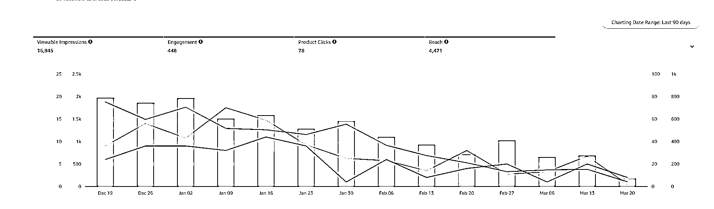

# 《用 RPA 自动在亚马逊店铺发布 POST》

> 原文：[`www.yuque.com/for_lazy/thfiu8/gdb9gmrotxggeg3i`](https://www.yuque.com/for_lazy/thfiu8/gdb9gmrotxggeg3i)

## (34 赞)《用 RPA 自动在亚马逊店铺发布 POST》 

作者： 良辰美 

日期：2023-03-22 

第六期快结束了，这个月的高质量帖子好多，因为再不发文章就到下一期了。[捂脸] 

这里给大家分享用 RPA 自动在亚马逊店铺发布 POST，是去年写的付费文章，只在少部分人群里传播。 

如果前年 POST 刚出来时抓住这波红利肯定赚大发了，现在只是平均发一万个帖子有几百个点击，下面是发了几千个帖子的数据，虽然很少但好在免费啊！ 

POST 有个缺点是无法准确衡量出单数，但是如果产品转化率稳定，那当然是点击曝光数越多越好。 

文章比较专业且复杂，但是对于成熟的亚马逊卖家而言，确实挺有用的，不过多介绍啦，可以结合教程自行研究。 

有需要辅助帮忙创建流程的可以私信或者评论。 

店铺批量自动发 POST | AMZ 与 RPA [https://i0ejcw7gsm.feishu.cn/docx/doxcnXIOtkZmPJLb1izKrreOuMg](https://i0ejcw7gsm.feishu.cn/docx/doxcnXIOtkZmPJLb1izKrreOuMg)  

  

  

评论区： 

暂无评论