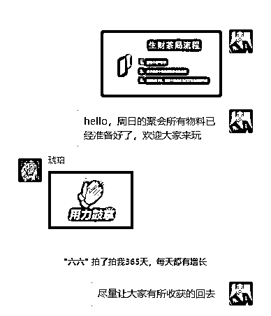
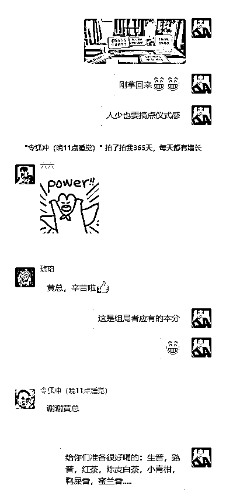
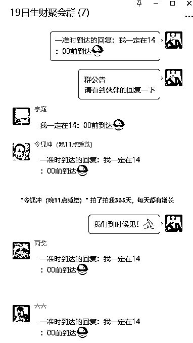
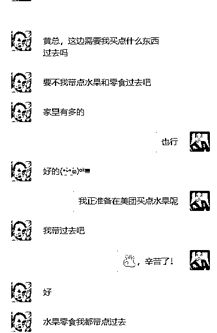
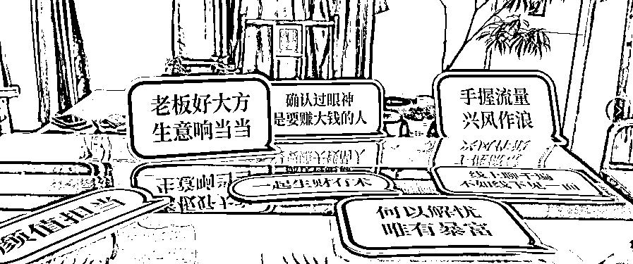
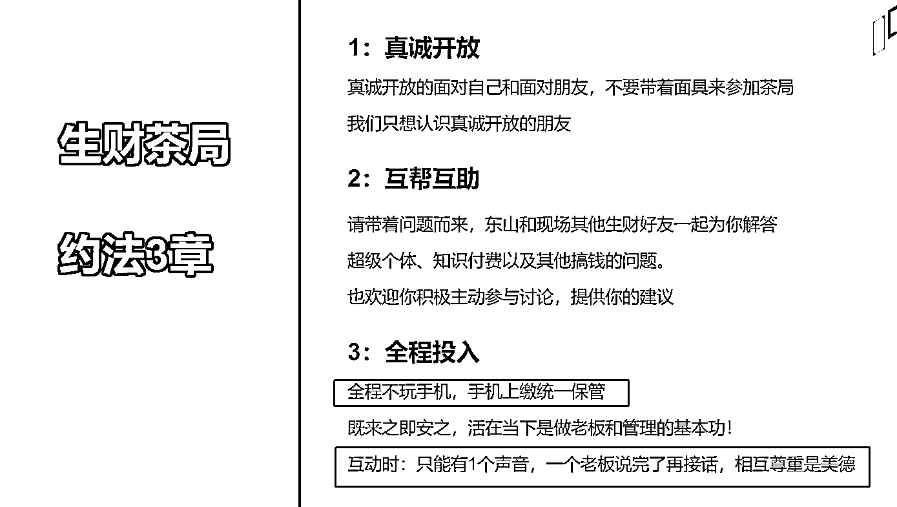
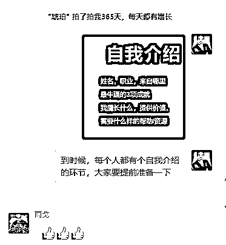
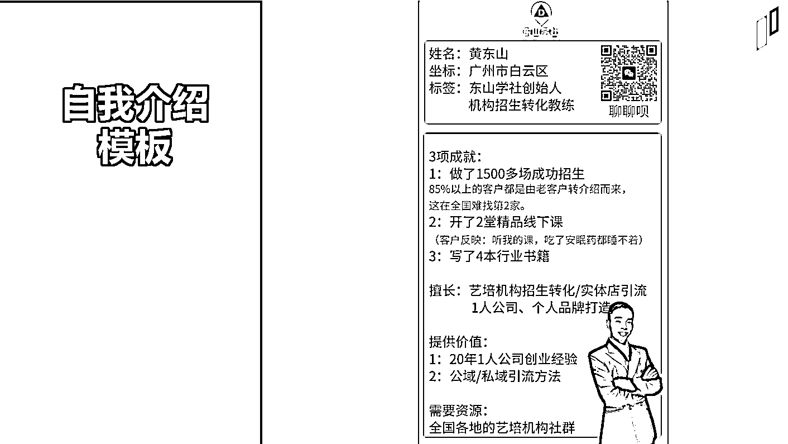
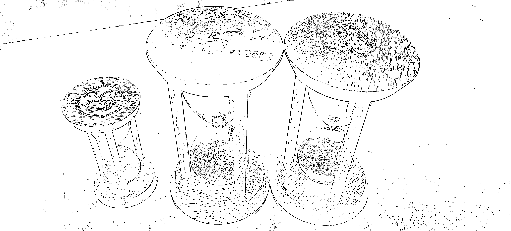
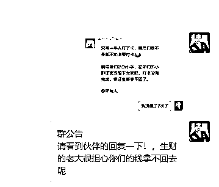

# 《如何成功举办小型的同城聚会？一个精细的 SOP 流程就可以》

> 原文：[`www.yuque.com/for_lazy/thfiu8/bpy3nwg8qgdpupo6`](https://www.yuque.com/for_lazy/thfiu8/bpy3nwg8qgdpupo6)

<ne-h2 id="e36d6fea" data-lake-id="e36d6fea"><ne-heading-ext><ne-heading-anchor></ne-heading-anchor><ne-heading-fold></ne-heading-fold></ne-heading-ext><ne-heading-content><ne-text id="uea6dbcc8">(149 赞)《如何成功举办小型的同城聚会？一个精细的 SOP 流程就可以》</ne-text></ne-heading-content></ne-h2> <ne-p id="u60ace557" data-lake-id="u60ace557"><ne-text id="ue5d40eb2">作者： 东山老师</ne-text></ne-p> <ne-p id="u22f999df" data-lake-id="u22f999df"><ne-text id="u5e2aef08">日期：2023-03-21</ne-text></ne-p> <ne-p id="ucf1463cc" data-lake-id="ucf1463cc"><ne-text id="u5d7cf0a4">今年解除了口罩的问题，人员开始流动，经济开始好转，各种各样的同城小聚会，小会议在各个城市开展起来了！</ne-text></ne-p> <ne-p id="u2fed6c34" data-lake-id="u2fed6c34"><ne-text id="ua805a9f9">你在组局同城聚会和小型会议时，有没有以下 5 个烦死人的问题？</ne-text></ne-p> <ne-p id="u2aaa7c11" data-lake-id="u2aaa7c11"><ne-text id="uc6d658ca" ne-bold="true">1：人来不齐？</ne-text></ne-p> <ne-p id="u2cc110c4" data-lake-id="u2cc110c4"><ne-text id="u25d72126">报名的时候，他们非常踊跃，到了聚会当天，有人微信发一个：不好意思.....，然后心安理得的放你飞机，你欲哭无泪！</ne-text></ne-p> <ne-p id="u6e9ad7a5" data-lake-id="u6e9ad7a5"><ne-text id="u48045fbc" ne-bold="true">2：人会迟到？</ne-text></ne-p> <ne-p id="u032663b6" data-lake-id="u032663b6"><ne-text id="u4b3255c0">说好聚会下午 2 点钟开始，结果才稀稀拉拉的来了几个人，好尴尬！到了 2 点半，才有人跑进来说：不好意思........</ne-text></ne-p> <ne-p id="u3dda71cc" data-lake-id="u3dda71cc"><ne-text id="ueccc93c2">然后心安理得的坐下来，这时依然还不齐人！</ne-text></ne-p> <ne-p id="u72f9c2fd" data-lake-id="u72f9c2fd"><ne-text id="ud5167d87" ne-bold="true">3：人不专注？</ne-text></ne-p> <ne-p id="uab8643f0" data-lake-id="uab8643f0"><ne-text id="u639a228a">在聚会分享的过程中，本来就是 8 个人，10 个人的讲一个话题，结果不知不觉的就分成 2-3 个帮派，三三两两的聚在一块讲自己感兴趣的话题，还有一两个人在心无旁骛的玩手机！你看着这个场景直摇头！</ne-text></ne-p> <ne-p id="ue367def8" data-lake-id="ue367def8"><ne-text id="u40176c51" ne-bold="true">4：人不满意？</ne-text></ne-p> <ne-p id="u00300381" data-lake-id="u00300381"><ne-text id="u99bd4cf0">活动结束了，让他们评价一下或者写个总结，本以为他们会对自己辛苦的付出说声感谢，结果他们的留言是：不满意，没学到东西，下次都不来了.....</ne-text></ne-p> <ne-p id="ue8383d77" data-lake-id="ue8383d77"><ne-text id="ub7b92c76" ne-bold="true">5:自己没有完成预期？</ne-text></ne-p> <ne-p id="u14ca51d8" data-lake-id="u14ca51d8"><ne-text id="ud0ef0a41">自己作为一个组局者，本想通过一场聚会实现某些目的，要么销售自己的思想，要么销售自己的产品/课程，赚点小钱！结果辛苦了大半天，一个目标都没有完成，非常的丧气，说：老子以后都不办了！谁爱搞谁搞去！</ne-text></ne-p> <ne-p id="ua37851c0" data-lake-id="ua37851c0"><ne-text id="u0241eec0">如果你有以上的 1-2 个，甚至好几个问题，估计就是在组局的过程中，有某些小细节没有做好，导致结果不如意！</ne-text></ne-p> <ne-p id="u7404810f" data-lake-id="u7404810f"><ne-text id="u2a4329a3">我这些年来，组局了非常多的茶局，饭局，私董会，分享会等等，慢慢总结出一套比较有效的组局流程。3 月份以来，我参加了 3 次广州线下同城聚会，我自己也组局了 2 场线下的东山茶局，我对于组织线下聚会的流程有一套自己的心得和经验！</ne-text></ne-p> <ne-p id="ue411d39a" data-lake-id="ue411d39a"><ne-text id="u4c7a6d33">下面，我结合我自己的经验，把一场成功的“聚会组局”分为 5 个部分给你剖析一下，你按照下面这 5 步骤去把一些细节做好，你也能随时做好一场大家都满意的线下组局。</ne-text></ne-p> <ne-p id="ud89a7daf" data-lake-id="ud89a7daf"><ne-text id="ud665539f" ne-bold="true">第一部分：精准邀约</ne-text></ne-p> <ne-p id="uabacae1b" data-lake-id="uabacae1b"><ne-text id="u7df47a5f">一场成功的线下组局始于成功的邀约，邀约的核心在于：精准人群和确保全员参加！</ne-text></ne-p> <ne-p id="u2bb86233" data-lake-id="u2bb86233"><ne-text id="ua0710d5e" ne-bold="true">1：如何确保精准人群？</ne-text></ne-p> <ne-p id="u3d9898fc" data-lake-id="u3d9898fc"><ne-text id="u286bba31">你一定要筛选人群，不是所有人都能来参加你的局的，一定是要有明确的意向才行！如何过滤精准的人群呢？</ne-text></ne-p> <ne-p id="uab7d6c40" data-lake-id="uab7d6c40"><ne-text id="u18904802">窍门在于：聚会的主题！</ne-text></ne-p> <ne-p id="ueb2a3ea0" data-lake-id="ueb2a3ea0"><ne-text id="u4f6de1fa" ne-bold="true">主题其实就是活动的钩子，不同的主题吸引不同的人</ne-text><ne-text id="u5ade14b3">，因此，我做的每一场活动都是有明确的主题的，例如我自己的：东山增长茶局，每一场的主题都不同！</ne-text></ne-p> <ne-p id="u919839cd" data-lake-id="u919839cd"><ne-text id="uf04b014b">我这次生财同城聚会的组局也是有明确的主题：</ne-text><ne-text id="ub8b8dd47" ne-bold="true">超级个体与知识付费！</ne-text><ne-text id="ud5e4ae1f">这个主题跟生财的大部分人群是匹配的！</ne-text></ne-p> <ne-p id="u69b2e4cb" data-lake-id="u69b2e4cb"><ne-text id="u48be3d58">然而，我参加的大部分活动都是有明确的主题的，或者主题过于宽泛，我比较头疼的是那种没有主题，人群不限的活动，一般都很难成功！</ne-text></ne-p> <ne-p id="u9e066085" data-lake-id="u9e066085"><ne-text id="u8a247ed0" ne-bold="true">此外，筛选精准人群的第二个办法就是：提前付费！</ne-text></ne-p> <ne-p id="u6e9f6e7c" data-lake-id="u6e9f6e7c"><ne-text id="u689731a8">人对于免费的东西总是不珍惜的，如果付费的话，会好很多！</ne-text></ne-p> <ne-p id="u0b715e23" data-lake-id="u0b715e23"><ne-text id="u49ff0bbc">我一直提倡线下分享会，同城聚会等要收费，哪怕只收 99 元也好！且这个费用是不能退的，也不是 AA 的钱，就是组局者的费用！辛辛苦苦忙活一整天，又提供茶水提供水果什么的，总不能一点收入都没有！</ne-text></ne-p> <ne-p id="u0e80bae7" data-lake-id="u0e80bae7"><ne-text id="u22268eeb">在收费的情况还愿意付费参加的，就是更有意向的参与者了！准时参加的概率会大大的增加！</ne-text></ne-p> <ne-p id="u68135aec" data-lake-id="u68135aec"><ne-text id="u46f150e9" ne-bold="true">2：如何确保聚会的人不放鸽子，都到来</ne-text></ne-p> <ne-p id="u735dfe9d" data-lake-id="u735dfe9d"><ne-text id="uabf58f5b">组局者最烦的就是，到点了，发个信息说：有事，不来了，抱歉！.....</ne-text></ne-p> <ne-p id="uf0220293" data-lake-id="uf0220293"><ne-text id="u02ef38b0">如何避免这种情况发生呢？几个办法可以尝试。</ne-text></ne-p> <ne-p id="ub71a093d" data-lake-id="ub71a093d"><ne-text id="ub900f5b2" ne-bold="true">1）提前收鸽子费</ne-text></ne-p> <ne-p id="uad51af8e" data-lake-id="uad51af8e"><ne-text id="uce4c8b4a">生财这次的组局，就是先预付 99 元鸽子费，通过活动打卡拿回费用的方式也是不错的。</ne-text></ne-p> <ne-p id="u09ec7241" data-lake-id="u09ec7241"><ne-text id="ua0ceefcf" ne-bold="true">2）提前收 AA 的定位费</ne-text></ne-p> <ne-p id="u33bcd3a6" data-lake-id="u33bcd3a6"><ne-text id="ua031618d">其次，我们作为组局者也可以提前定位置，通过提前收取定位费的做法来进一步确定人员的到来！</ne-text></ne-p> <ne-p id="uaf7380be" data-lake-id="uaf7380be"><ne-text id="uc304aa89">例如你可以说：</ne-text><ne-text id="ub868660a" ne-bold="true">我们本次的活动定在 XX 路的 XX 茶室的 XX 房间，这个房间价格是 1000 元/半天！我们 AA 的话是 150 元，加上茶水等，我们先每人收 200 元，到时候多退少补！我先去把房间定好，以利于聚会的开展！</ne-text></ne-p> <ne-p id="u1a4d6641" data-lake-id="u1a4d6641"><ne-text id="ue5f47856">通过这样的方式，你就提前把钱收上来了，每人又交了 200 元的定位费，增加了她的成本，那么她放鸽子的成本就大大的增加了，来的概率就会增加！</ne-text></ne-p> <ne-p id="ua15dfda4" data-lake-id="ua15dfda4"><ne-text id="ub25a748d" ne-bold="true">3）做好多次的预热与接龙告知</ne-text></ne-p> <ne-p id="ua189fc45" data-lake-id="ua189fc45"><ne-text id="u5ad56bac">一般人员报名成功后，要提前 3-5 天建一个专门的聚会小群，建完群后，我们要一而再再而三的在群里进行各种预热和互动。</ne-text></ne-p> <ne-p id="u13f9cd4f" data-lake-id="u13f9cd4f"><ne-text id="u9a155a0b">我是会让她们提前把各自的自我介绍发上来，而且让他们填一个自己想解决的问题，这样大家在没有见面的时候就相互有了简单的认识，我也可以根据他们的问题进行提前的准备。</ne-text></ne-p> <ne-p id="u3533a1dd" data-lake-id="u3533a1dd"><ne-card data-card-name="image" data-card-type="inline" id="xdMFi" data-event-boundary="card">  <ne-p id="u09aba9a7" data-lake-id="u09aba9a7"><ne-text id="u15cbae03">我们可以对主题进行预热，对组局的过程进行告知，制造期待！例如我就会放 1-2 张 PPT，证明我自己是很重视这个活动的，给大家准备了非常干的分享。</ne-text></ne-p> <ne-p id="uaeb1c4a4" data-lake-id="uaeb1c4a4"><ne-card data-card-name="image" data-card-type="inline" id="O6jV8" data-event-boundary="card">  <ne-p id="u047d325f" data-lake-id="u047d325f"><ne-card data-card-name="image" data-card-type="inline" id="E6ire" data-event-boundary="card">  <ne-p id="u82cd5ed5" data-lake-id="u82cd5ed5"><ne-text id="ue10b51bc">其次，我们要不断地进行接龙，潜意识的让他们接龙，例如：我承诺 XX 日 XX 点准时到！</ne-text></ne-p> <ne-p id="u167150b7" data-lake-id="u167150b7"><ne-card data-card-name="image" data-card-type="inline" id="HkaRr" data-event-boundary="card">  <ne-p id="u39ee34d9" data-lake-id="u39ee34d9"><ne-text id="ud86ce0b3">而且到了活动开始的倒数第二天，还要再强调一次，活动的当天还要再强调 1-2 次！在这一点上，不要怕麻烦！组局那么麻烦的事情都做了，这点事都是小事情了！</ne-text></ne-p> <ne-p id="uee057bd5" data-lake-id="uee057bd5"><ne-text id="uf303eece" ne-bold="true">4）组局官要和所有参会的人都私聊一遍</ne-text></ne-p> <ne-p id="ube6e0247" data-lake-id="ube6e0247"><ne-text id="u981c866b">我无论什么样的活动，我是组局者时，我都会亲自和参会的人微信私聊一下，简单的看看他们的微信朋友圈，让她们发发他们的介绍，简单互动几句，大家彼此有个了解！</ne-text></ne-p> <ne-p id="uc4d6f978" data-lake-id="uc4d6f978"><ne-text id="ua267542c">我发现，凡是私聊过的，参会的积极性会大大的参加！我参加过很多别人的局，我发现直到我到了会场的那一刻，都没有人主动跟我聊过的，所以，有人放你飞机，太正常了！</ne-text></ne-p> <ne-p id="u8d7307b2" data-lake-id="u8d7307b2"><ne-text id="u4d87734d" ne-bold="true">我们这一次生财的局，都提前了 30 分钟就到了我办公室了，这个可是出乎我意料的！而且令狐冲同学还带了果盘和零食过来！</ne-text></ne-p> <ne-p id="u13964c4b" data-lake-id="u13964c4b"><ne-card data-card-name="image" data-card-type="inline" id="OWxbH" data-event-boundary="card">  <ne-p id="ua7d559e7" data-lake-id="ua7d559e7"><ne-text id="u081aa651" ne-bold="true">3：如何更好的给予位置指引？</ne-text></ne-p> <ne-p id="uba79baaa" data-lake-id="uba79baaa"><ne-text id="ucbdc9f61">我参加过很多别人的局，都是在群里发个地图就完了！有几次，我到了地图哪里，找来找去找半天都找不到聚会的地点，结果还迟到了！（所以真的不能怨迟到的人，或许是你的指引太差劲了）。</ne-text></ne-p> <ne-p id="u978ac1fa" data-lake-id="u978ac1fa"><ne-text id="u3009c112">如何避免呢？</ne-text></ne-p> <ne-p id="u4dea34d7" data-lake-id="u4dea34d7"><ne-text id="u6a42b493" ne-bold="true">1）群里发地图后，私信还要发一次</ne-text></ne-p> <ne-p id="ua9ab721d" data-lake-id="ua9ab721d"><ne-text id="u39644ef2">私信发的时候，要问对方是怎么过来？</ne-text></ne-p> <ne-p id="u6da55a03" data-lake-id="u6da55a03"><ne-text id="u3db4e7a5">开车的话，输入什么导航的名字？停车在哪里？这些都要说清楚的！</ne-text></ne-p> <ne-p id="ub625021c" data-lake-id="ub625021c"><ne-text id="ub4387367">坐地铁公交的话，也要说坐几号线，从那个出口出来，然后是打的过来呢？还是走路 XX 分钟可以来？</ne-text></ne-p> <ne-p id="ue6e1a99a" data-lake-id="ue6e1a99a"><ne-text id="u1c4a93bc">甚至走路的话，我还会在地图上做一个路线图，教他们怎么走过来！</ne-text></ne-p> <ne-p id="u16570e97" data-lake-id="u16570e97"><ne-text id="u20b888ad" ne-bold="true">2）到了你那一栋楼后，如何找到聚会地点</ne-text></ne-p> <ne-p id="u5a907214" data-lake-id="u5a907214"><ne-text id="u8bec0008">一些简单明显的地方，例如我的办公室，直接说坐电梯，然后左转走到底就是了！</ne-text></ne-p> <ne-p id="u2559de98" data-lake-id="u2559de98"><ne-card data-card-name="image" data-card-type="inline" id="tAYe2" data-event-boundary="card">  <ne-p id="u29af987e" data-lake-id="u29af987e"><ne-text id="uec7d9061">如果是门口很多的，我一般还会拍一些照片，用箭头标的标志物，说明从哪里进。甚至我拍一个简单的视频进行指引。</ne-text></ne-p> <ne-p id="ue467bebc" data-lake-id="ue467bebc"><ne-text id="u6f4f4264">有时候，一些收费比较贵的私董会，我还在电梯的 1 楼，派个人，或者放一张海报，用箭头来指引.....</ne-text></ne-p> <ne-p id="ub97695e0" data-lake-id="ub97695e0"><ne-text id="u137286d4">你在每一个细节上做的越细致，别人越能感受到你的重视，那么参与者就会越重视，就能准时参加！</ne-text></ne-p> <ne-p id="u23eb12ab" data-lake-id="u23eb12ab"><ne-text id="u3df2c2ed" ne-bold="true">第二部分：场地如何布置？</ne-text></ne-p> <ne-p id="ud6a1389b" data-lake-id="ud6a1389b"><ne-text id="u5de9f0ba">1：场地的布置，取决于你的目的和参加的人员。</ne-text></ne-p> <ne-p id="ud7df9429" data-lake-id="ud7df9429"><ne-text id="u7b80897e">一般的各种茶局，饭局，我建议都是 10 人上下最后，如果是以成交为导向的分享会，那么也不要超过 30 人（30 以上，转化率偏低）</ne-text></ne-p> <ne-p id="u4db5deca" data-lake-id="u4db5deca"><ne-text id="ua05ad804">如果是交流，交朋友等性质的，可以选择户外的场地，有氛围感很多，甚至是帐篷，郊游，BBQ 等。但这种活动大多数都是很难完成目的！</ne-text></ne-p> <ne-p id="ub118073e" data-lake-id="ub118073e"><ne-text id="ub32738d2">如果是深度分享或者带有成交的环节，一定是要室内的封闭场地（小会议室，茶室等）而且尽量关门关窗，才能让所有的人都有沉浸式的交流！</ne-text></ne-p> <ne-p id="u535bc185" data-lake-id="u535bc185"><ne-text id="u93c0a417">如果是饭局，就一定要是包厢，否则不要做，浪费时间浪费钱！</ne-text></ne-p> <ne-p id="ue5a24f8f" data-lake-id="ue5a24f8f"><ne-text id="u1ce6ad4e">2：场地的布置</ne-text></ne-p> <ne-p id="u78bd75c4" data-lake-id="u78bd75c4"><ne-text id="u99c42976">先讲室内的场地布置，一般就 5 大件：</ne-text></ne-p> <ne-p id="u3eebdff7" data-lake-id="u3eebdff7"><ne-text id="u1b4b7498">1：横幅</ne-text></ne-p> <ne-p id="uce1fce7b" data-lake-id="uce1fce7b"><ne-text id="u5bd5aa88">横幅可以有 2-3 个，但是一定要有一个宽横幅，用来拍照用的！这种横幅就要有 logo 和一个口号等等！我自己的茶局是做了的！</ne-text></ne-p> <ne-p id="u7d3faf4f" data-lake-id="u7d3faf4f"><ne-text id="ufda9cd91">2：拍照举牌</ne-text></ne-p> <ne-p id="ua114c0af" data-lake-id="ua114c0af"><ne-text id="ucbc6e739">这个可以做很多，人手 1-2 个都没事！我自己有自己的一套素材，不过生财的就用了生财的素材，提前找广告店打印就好了！</ne-text></ne-p> <ne-p id="u3135f5e9" data-lake-id="u3135f5e9"><ne-card data-card-name="image" data-card-type="inline" id="eh9w7" data-event-boundary="card">  <ne-p id="uac0e5dbb" data-lake-id="uac0e5dbb"><ne-text id="ub2996fe5" ne-bold="true">3：鲜花绿植</ne-text></ne-p> <ne-p id="u0e45ff02" data-lake-id="u0e45ff02"><ne-text id="u0ec7fcc0">我每次组局，都会买一些百合和鲜花，或者做一些绿植在场地里，例如我这次的同城组局，我就买了几瓶“马醉木”，整个场地就跟森林一样，特别适合做开放交流的差距。</ne-text></ne-p> <ne-p id="ub456bf12" data-lake-id="ub456bf12"><ne-text id="u890bfe85" ne-bold="true">4：瓜果茶饮</ne-text></ne-p> <ne-p id="u4d20e5af" data-lake-id="u4d20e5af"><ne-text id="u425c6fad">要放一些时令的瓜果，茶局的话就是泡茶就好了，或者煮茶！如果是分享会的话，那么就放矿泉水就可以了。</ne-text></ne-p> <ne-p id="u2ebba4c0" data-lake-id="u2ebba4c0"><ne-text id="u08012696">做茶局的时候，要有一些饼干和茶点，因为喝茶喝多了，肚子容易饿，有几个烘焙饼干，能让大家不饿着肚子互动。</ne-text></ne-p> <ne-p id="u6ad356c3" data-lake-id="u6ad356c3"><ne-text id="uff0ea61b" ne-bold="true">5：纸和笔</ne-text></ne-p> <ne-p id="u24ac2d1c" data-lake-id="u24ac2d1c"><ne-text id="ud13ce643">这个是给人去记笔记用的！这一次我就把每个参会者的简单介绍打印出来，旁边空了一大块，让她们去记录，这样可以方便他们拿回去写总结用！</ne-text></ne-p> <ne-p id="uaf79331a" data-lake-id="uaf79331a"><ne-text id="ub18448c1">其他的要布置的选择：</ne-text></ne-p> <ne-p id="u597af0cf" data-lake-id="u597af0cf"><ne-text id="u8c98a001" ne-bold="true">1：香薰机</ne-text></ne-p> <ne-p id="u6cd9aabc" data-lake-id="u6cd9aabc"><ne-text id="u1a6e3179">这个我特别喜欢，每次活动开始之前，我都会开大香薰机，把味道搞的香香的，开始后，会调低香薰机，让整个环节有一点淡淡的香味，很舒服！</ne-text></ne-p> <ne-p id="uc3d51019" data-lake-id="uc3d51019"><ne-text id="u2b711c7b" ne-bold="true">2：檀香</ne-text></ne-p> <ne-p id="u459bed0c" data-lake-id="u459bed0c"><ne-text id="udf207fed">有时候，我也会点一两支檀香，让氛围感更好一些！</ne-text></ne-p> <ne-p id="u171b0952" data-lake-id="u171b0952"><ne-text id="ub4ff0047">这样场景的布置，几乎都是色香味俱全了，调动了参与者的视觉，声音，味觉，嗅觉等，整体而言，会有助于成交，也有助于让参加的人有更多的沉浸式互动！</ne-text></ne-p> <ne-p id="u4ad8ff4e" data-lake-id="u4ad8ff4e"><ne-text id="uf653a68b" ne-bold="true">第三部分：过程控制</ne-text></ne-p> <ne-p id="ue801a81b" data-lake-id="ue801a81b"><ne-text id="u00d3ab07">作为组局者，对过程的控制一定要非常的清晰，一般的茶局，饭局，分享会，私董会等都是半天的时间，大多数都是 4-5 个小时。</ne-text></ne-p> <ne-p id="u4ac22032" data-lake-id="u4ac22032"><ne-text id="ufaef3ee6">那么，我们每个时间点做什么事，一定要控制好时间！如果没有精细化的现场控制和过程控制，那么这个聚会很容易让参会的人没有收获。</ne-text></ne-p> <ne-p id="ueea9699e" data-lake-id="ueea9699e"><ne-text id="u01dac970">1：开始阶段的约法三章</ne-text></ne-p> <ne-p id="u5aba5ee3" data-lake-id="u5aba5ee3"><ne-text id="u84802930">我几乎所有的聚会，都会约法三章，这其中有 2 个点是非常关键的：</ne-text></ne-p> <ne-p id="u7dd36aeb" data-lake-id="u7dd36aeb"><ne-card data-card-name="image" data-card-type="inline" id="TeZHn" data-event-boundary="card">  <ne-p id="u17906761" data-lake-id="u17906761"><ne-text id="u160f767d" ne-bold="true">1）全程不玩手机，手机上缴统一保管（非常重要的）</ne-text></ne-p> <ne-p id="uc25393ab" data-lake-id="uc25393ab"><ne-text id="u5ee12b8e">我参加过太多的聚会了，现在的人只要手机在手，就很难专注起来，总是下意识的会摸摸手机，看看手机，看着看着就进去了！然后其他人也会模。</ne-text></ne-p> <ne-p id="u0c8a33a7" data-lake-id="u0c8a33a7"><ne-text id="ub9490aca">这样这个局，90%都会失败！</ne-text></ne-p> <ne-p id="u9e33003c" data-lake-id="u9e33003c"><ne-text id="u6e5209e7">所以，我每一场活动开始之前，我都会讲这个客观的因素，然后让大家投票说要不要把手机收起来，我还会把“既来之即安之，活在当下是做老板和管理的基本功！”扣在他们头上，加上我总是第一个把手机放出去（放在一个专门的纸箱，盘子等）！他们就会有 1-2 个人跟风，其他人就都会把手机放出去了。</ne-text></ne-p> <ne-p id="ue5fde24c" data-lake-id="ue5fde24c"><ne-text id="u528ed50f">而且我也会特别的说明，我中间会有 1-2 次统一休息的时间，大家可以去处理手机的问题，这样大家也就放心了！</ne-text></ne-p> <ne-p id="u6007a3ca" data-lake-id="u6007a3ca"><ne-text id="uf746b096">很多组局者都是从 2 点一直到 6 点都不休息的，然后任由人员进进出出上厕所，接电话，所以氛围也容易破坏掉。</ne-text></ne-p> <ne-p id="u3703536e" data-lake-id="u3703536e"><ne-text id="u9ee340fc">我的做法就是每个 1-2 个小时，当一个流程环节结束后，就休息 10 分钟，改上厕所的上厕所，改接电话的接电话，改抽烟的抽抽烟！大家也可以相互轻松的交流一下上一个话题，做个简单的总结等等。</ne-text></ne-p> <ne-p id="u74651855" data-lake-id="u74651855"><ne-text id="u44e902cf" ne-bold="true">2）一再强调，在互动时只能有 1 个声音，一个老板说完了再接话</ne-text></ne-p> <ne-p id="ua4c86b1d" data-lake-id="ua4c86b1d"><ne-text id="u2c2c0242">这也是做好一场聚会的核心，为什么很多线下聚会开着开着就分了帮派了？核心就是这一点没有做好！</ne-text></ne-p> <ne-p id="uc7438a46" data-lake-id="uc7438a46"><ne-text id="u87df8e9f">每一次聚会，总有一些人特别喜欢说，特别能说的，最爱插花打岔，所以在整个下午，在一个时间里，只能有一个声音，如果有人插话：我就会把手指放到嘴唇上“嘘”一下，他们就懂了！</ne-text></ne-p> <ne-p id="udeac1e32" data-lake-id="udeac1e32"><ne-text id="u8a6b48c0" ne-bold="true">2：巧妙破冰</ne-text></ne-p> <ne-p id="uaa08c037" data-lake-id="uaa08c037"><ne-text id="u94be6354">真正的组局是从破冰开始的，每一场聚会，都是一群陌生人从陌生到熟悉到感动的过程。</ne-text></ne-p> <ne-p id="u3d41798f" data-lake-id="u3d41798f"><ne-text id="u69974651">一次，良好的破冰真的太重要了！</ne-text></ne-p> <ne-p id="ub52ef7ec" data-lake-id="ub52ef7ec"><ne-text id="u2fb6fbfd" ne-bold="true">1）人员识别</ne-text></ne-p> <ne-p id="ue9313542" data-lake-id="ue9313542"><ne-text id="uff044798">我一般是贴胸牌的模式，就是把名字写在不干胶上，然后贴在胸前即可！这样一下子就能记住名字！</ne-text></ne-p> <ne-p id="ue73990d5" data-lake-id="ue73990d5"><ne-text id="u46e7feca">而且我匹配了对应的自我介绍表格，把名字和表格的介绍一对应，马上就能对这个人有初步的印象。</ne-text><ne-text id="u2f119ece" ne-bold="true">（想要这种表格的，加我，我发模板给你）</ne-text></ne-p> <ne-p id="uda228e61" data-lake-id="uda228e61"><ne-text id="u97fd4d8d">很多人喜欢用“座牌”，就是把名字打印成一个立体的桌牌，放在每个人的面前。用来这个东西占地方，大部分就是一张桌子 10 个人，桌面上已经放了茶水饮料，水果，纸笔、绿植等，已经够多了东西了！</ne-text></ne-p> <ne-p id="u6068315c" data-lake-id="u6068315c"><ne-text id="u9e1a1ab9">很多人都会把这个桌牌挪开，然后你就不知道谁是谁了？</ne-text></ne-p> <ne-p id="u7724e5bf" data-lake-id="u7724e5bf"><ne-text id="u4b94afc6">2）自我介绍</ne-text></ne-p> <ne-p id="u0d0d1a7b" data-lake-id="u0d0d1a7b"><ne-text id="ucbf8d957">我参加过很多自我介绍的环节，往往一轮下来，我很少能记住几个人的！这个根源有 2 个点没做好：</ne-text></ne-p> <ne-p id="u1203cfcf" data-lake-id="u1203cfcf"><ne-text id="ud71ef1a2" ne-bold="true">第 1 点：瞎自我介绍</ne-text></ne-p> <ne-p id="u7b01c872" data-lake-id="u7b01c872"><ne-text id="u06ec6150">这种就是走 2 个极端：</ne-text></ne-p> <ne-p id="u6bf89195" data-lake-id="u6bf89195"><ne-text id="u5f35ed20">一些不爱说话的：战战兢兢的站起来，简单的说了 2 句话：我是谁，来自哪里就坐下来，其他人一脸懵逼的。</ne-text></ne-p> <ne-p id="u9335c5a6" data-lake-id="u9335c5a6"><ne-text id="u3419c185">一些人超爱说话，但又瞎说的：站起来后给你讲故事，一讲就进去了，从小时候讲到读书，再讲到工作....半个小时过去了她还在说，很多人不自觉的就拿起来手机......我参过一次聚会活动，10 个人介绍完毕后，3 个小时过去了！</ne-text></ne-p> <ne-p id="uc8e2e4ba" data-lake-id="uc8e2e4ba"><ne-text id="udbbf6dcb">所以我自己做了 4 个优化：</ne-text></ne-p> <ne-p id="u3555013c" data-lake-id="u3555013c"><ne-text id="u83799ca9" ne-bold="true">1）提前在微信群里让他们做好自我介绍的准备</ne-text></ne-p> <ne-p id="u3d2cd972" data-lake-id="u3d2cd972"><ne-text id="ubddf7151">提前把自我介绍的框架发给他们，让她们提前写好或者酝酿一下，免得到时候不知道怎么说。</ne-text></ne-p> <ne-p id="ud560aaa5" data-lake-id="ud560aaa5"><ne-card data-card-name="image" data-card-type="inline" id="Bq0u7" data-event-boundary="card">  <ne-p id="ubca3b38f" data-lake-id="ubca3b38f"><ne-text id="u55267016" ne-bold="true">2）自我介绍的时候，给模板</ne-text></ne-p> <ne-p id="u6d8bb3f3" data-lake-id="u6d8bb3f3"><ne-text id="ub191763f">我一般自我介绍的时候，我都会先起个头，然后按照框架讲一遍，他们听完后，就知道自己的怎么去做了？</ne-text></ne-p> <ne-p id="uc803ebda" data-lake-id="uc803ebda"><ne-text id="u4f4e5bb2">同时我会在 PPT 上也放一个自我介绍模板，他们对着目前现场酝酿的话，都能把自我介绍讲的很清楚。</ne-text></ne-p> <ne-p id="u52c9ec43" data-lake-id="u52c9ec43"><ne-card data-card-name="image" data-card-type="inline" id="iXQGk" data-event-boundary="card">  <ne-p id="u2fb20400" data-lake-id="u2fb20400"><ne-text id="u9b0fceef" ne-bold="true">3）现场用沙漏去控制好自我介绍的时间</ne-text></ne-p> <ne-p id="u6b08e5bc" data-lake-id="u6b08e5bc"><ne-text id="ufba6433f">我买了几个沙漏，有 5 分钟的，15 分钟的，30 分钟的等。</ne-text></ne-p> <ne-p id="u88a14312" data-lake-id="u88a14312"><ne-card data-card-name="image" data-card-type="inline" id="GZPXe" data-event-boundary="card"></ne-card></ne-p> <ne-p id="u30b68004" data-lake-id="u30b68004"><ne-text id="u9a0b087f">其中 5 分钟的就是用来控制自我介绍的时间的，15 分钟是用来阐述问题的。30 分钟是用来集体做作业的（这个适用于分享会）。</ne-text></ne-p> <ne-p id="u4192fcb9" data-lake-id="u4192fcb9"><ne-text id="u66266b26">每个人介绍的时候，我们就把一个沙漏放在她面前，等沙漏漏完了，就算没介绍完，她也要停下来，然后转移给下一个人进行自我介绍！</ne-text></ne-p> <ne-p id="u46935999" data-lake-id="u46935999"><ne-text id="u6d9d4b52">有了这个沙漏，我们就能大大的限制了一帮人讲废话，讲故事！我发现大部分人都能在沙漏漏完前根据模板把自我介绍讲完！</ne-text></ne-p> <ne-p id="u87527e87" data-lake-id="u87527e87"><ne-text id="u5d9bd951" ne-bold="true">4）自我介绍完了后，再配上一个刮刮乐，临时分享一个观点</ne-text></ne-p> <ne-p id="u94fdbfe2" data-lake-id="u94fdbfe2"><ne-text id="ud80ceb6b">以前我们做完了自我介绍就进行下一步了，发现总是缺点什么，后来我补上了这个环节后，整体氛围就好很多了。</ne-text></ne-p> <ne-p id="u3f1e0c2f" data-lake-id="u3f1e0c2f"><ne-text id="u0a85c611">我会在聚会开始前，人均写一个问题在卡片上，然后贴上！在自我介绍开始前，我会说自我介绍的规则和流程，就会拿出这个“好运卡刮刮卡”，他们都会很感兴趣，这里面究竟是啥？</ne-text></ne-p> <ne-p id="u5c6b0c70" data-lake-id="u5c6b0c70"><ne-card data-card-name="image" data-card-type="inline" id="E4dDA" data-event-boundary="card"></ne-card></ne-p> <ne-p id="u4fbba827" data-lake-id="u4fbba827"><ne-text id="u8fce2a60">有时候我会调侃说：这里面有奖品.....</ne-text></ne-p> <ne-p id="u3141ce9b" data-lake-id="u3141ce9b"><ne-text id="u5e23060b">其实我写都是一些针对性很强的问题，要他们刮开后对这个问题发表看法，有些话题是比较走心的，有些是有比较冲突的（容易引起辩论的）等！</ne-text></ne-p> <ne-p id="u76319dcb" data-lake-id="u76319dcb"><ne-card data-card-name="image" data-card-type="inline" id="tZgwH" data-event-boundary="card">  <ne-p id="ud72ec418" data-lake-id="ud72ec418"><ne-text id="uc1e4c459">其他问题，其实可以从奇葩说，或者百度上搜索找到很多的。我以前也准备了 50 多个问题，需要的可以找我要！</ne-text></ne-p> <ne-p id="u8e74032b" data-lake-id="u8e74032b"><ne-text id="u58c94c23">这样，这个人回答了刮刮卡的问题后，我们会对这个人有了更深的认识，回答完后，我们还会简单的讨论一下，马上增强了对这个人的认识！这是最快速增强陌生人的感情的办法！</ne-text></ne-p> <ne-p id="u8a88c914" data-lake-id="u8a88c914"><ne-text id="u49206f37" ne-bold="true">第四部分：流程设计</ne-text></ne-p> <ne-p id="uf4111e2a" data-lake-id="uf4111e2a"><ne-text id="u57083d00">我参加过很多聚会，我最怕没有明确流程和主题的，真的很浪费时间！这种就是为了组局而组局的，我参加过一次之后就再也不想参加了。</ne-text></ne-p> <ne-p id="ueabee282" data-lake-id="ueabee282"><ne-text id="u6988e176">要想一个下午的聚会活动开展的顺畅，让每一个参会的人都有收获，要提前设计好流程。</ne-text></ne-p> <ne-p id="u7b45d68e" data-lake-id="u7b45d68e"><ne-text id="uadf9a4d4">一个下午 4-5 个小时的时间，流程只要 3-4 个步骤就够了，不要太多！我们的每次都是 3 个步骤：</ne-text></ne-p> <ne-p id="u112c6718" data-lake-id="u112c6718"><ne-text id="ub555c90f">1：自我介绍+破冰</ne-text></ne-p> <ne-p id="u32c83e26" data-lake-id="u32c83e26"><ne-text id="u248c4675">2：主题分享</ne-text></ne-p> <ne-p id="u73553622" data-lake-id="u73553622"><ne-text id="u1bbbd634">3：私董会模式（集众人的力量解决每个人的 1 个难题）还剩下时间的话，再随意的聊聊各自行业的赚钱窍门和一些坑等好玩的事情。</ne-text></ne-p> <ne-p id="u8a27ec9b" data-lake-id="u8a27ec9b"><ne-text id="u03ed7de1">而且这几个步骤，一定要用 PPT 的模式展开，投屏到电视机上或者用投影仪，这样大家的焦点就始终在 PPT 上，整体下来就不会乱！</ne-text></ne-p> <ne-p id="udf7a8400" data-lake-id="udf7a8400"><ne-text id="u5a1fc077">而且人人都有记笔记的喜好（虽然没什么用），有了 PPT，他们就能多抄好多笔记，对于他们的获得感也有很大帮助！</ne-text></ne-p> <ne-p id="u7fbce85c" data-lake-id="u7fbce85c"><ne-text id="uea4fbe60">所以，我每次都会提前写好 PPT，像这次生财同城聚会的 PPT，如果你们用得上的话，也可以加我微信，我发给你参考一下！</ne-text></ne-p> <ne-p id="ub630dd56" data-lake-id="ub630dd56"><ne-text id="u186576d8">一定要提前准备好翻页笔，而且用教学杆去展示，他们的注意力就会被完全的吸引住！（人的注意力很容易集中在你指点的内容上的）</ne-text></ne-p> <ne-p id="uad880c3c" data-lake-id="uad880c3c"><ne-card data-card-name="image" data-card-type="inline" id="cMdlg" data-event-boundary="card">  <ne-p id="uf4e2e1d8" data-lake-id="uf4e2e1d8"><ne-text id="u7912435c">甚至，在做一些深度的个案时，我们还要用到白板+白板笔现场进行板书和讲解，这样更加能深入的去做一些拆案，这在私董会的时候常常用得上！</ne-text></ne-p> <ne-p id="uc37ea1d0" data-lake-id="uc37ea1d0"><ne-text id="u83b638ac">关于主题的分享，这里也有一个窍门，如果你是在自己的会员群里组织的话，可以提前做调研，让大家投票选择一个比较好的主题。</ne-text></ne-p> <ne-p id="u8ad0acf5" data-lake-id="u8ad0acf5"><ne-text id="u47832fc4">我往往都是给 3 个主题，让她们选择其中的 1 个做单选题！得票最高的，就做本次选题！</ne-text></ne-p> <ne-p id="u625248b3" data-lake-id="u625248b3"><ne-text id="uecb38ba7">确定了主题后再进行招募，这时，往往参加了投票的人参加的意愿度就比较强，招募也就很好招了！</ne-text></ne-p> <ne-p id="u32bbec20" data-lake-id="u32bbec20"><ne-text id="uaa0d9970">我见过一些局，只要 10 个人，搞了十几天都招募不起来，除了私域的粘性和人数外，可能这个选题上也有问题。一定要选大家都愿意参加的主题，这样大家参与的积极性才会高。</ne-text></ne-p> <ne-p id="u6d6e1cc6" data-lake-id="u6d6e1cc6"><ne-text id="ud09be777">例如我报 3 个选题，其中选 B 的有 30 人，我只要 10 个人参加，还限额呢？这样可能半个小时就能完成报名了。</ne-text></ne-p> <ne-p id="u9e10ef6a" data-lake-id="u9e10ef6a"><ne-text id="u78ffb484">这里有一个窍门的就是：中间一定要安排 10-15 分钟的休息，我们一般都是在主题分享后，就安排休息！</ne-text></ne-p> <ne-p id="u509953a0" data-lake-id="u509953a0"><ne-text id="u2bac0af9" ne-bold="true">到下一阶段开始前，就开始先拍照。（要把拍照的时间提前）</ne-text></ne-p> <ne-p id="u6cc70761" data-lake-id="u6cc70761"><ne-text id="u96553ba4">因为这个时候人都还是齐全的，拍照比较容易，而且经过了自我介绍和主题分享的环节，大家也有比较大的获得感，拍照笑容也好看好多！</ne-text></ne-p> <ne-p id="u290476d8" data-lake-id="u290476d8"><ne-text id="u0b00f069">我参加过一些局，往往都是安排到最后结束了才拍照，这时候会遇到有些人提前退场了，或者光线不太好，拍照效果差很多。</ne-text></ne-p> <ne-p id="u609bfcba" data-lake-id="u609bfcba"><ne-text id="ued28c0ce">拍照完毕后，重新坐下来，做个简单的互动后，就开始了最重要的私董会模型。</ne-text></ne-p> <ne-p id="udec1c476" data-lake-id="udec1c476"><ne-text id="ud2432190">我上过教练技术，做过总教练，我大体上按照小组会的模式进行开会，每次都能给他们很大的收获！</ne-text></ne-p> <ne-p id="u01c6bb2e" data-lake-id="u01c6bb2e"><ne-text id="ue4087561">我们是怎么做的呢？</ne-text></ne-p> <ne-p id="u2ff8ec8d" data-lake-id="u2ff8ec8d"><ne-text id="uc973a55a" ne-bold="true">1）阐述问题</ne-text></ne-p> <ne-p id="ucec3c062" data-lake-id="ucec3c062"><ne-text id="u1a4c0eb4">由 1 个人站起来，阐述她目前困扰她比较大的一个难题。这个难题的背景是什么样的？她是怎么解决的？卡住她的难点是什么？</ne-text></ne-p> <ne-p id="u16d6fa18" data-lake-id="u16d6fa18"><ne-text id="ue6462fd3" ne-bold="true">2）其他人轮流给方案</ne-text></ne-p> <ne-p id="u2bc5d3c7" data-lake-id="u2bc5d3c7"><ne-text id="u0947b92e">她说完后，其他人就站在自己的角度，给这个人提供解决方案，每个人都要说自己的看法！这样有 10 个人，她就能收获 10 个角度的解决方案！</ne-text></ne-p> <ne-p id="u79ec1630" data-lake-id="u79ec1630"><ne-text id="ua1aa4f4e" ne-bold="true">3）最后我给他们进行复盘总结</ne-text></ne-p> <ne-p id="ue0352297" data-lake-id="ue0352297"><ne-text id="u5fcf68d6">我会站在一个教练的立场，用“指南针，镜子和催化剂”采用教练 4 步骤给他们系统的一个总结和解决问题的思路，往往能给他们很大的启发！</ne-text></ne-p> <ne-p id="u6423bef7" data-lake-id="u6423bef7"><ne-card data-card-name="image" data-card-type="inline" id="hkeLy" data-event-boundary="card"></ne-card></ne-p> <ne-p id="ub3e533ca" data-lake-id="ub3e533ca"><ne-card data-card-name="image" data-card-type="inline" id="Dptxs" data-event-boundary="card"></ne-card></ne-p> <ne-p id="udfd294c4" data-lake-id="udfd294c4"><ne-card data-card-name="image" data-card-type="inline" id="ZRxKW" data-event-boundary="card"></ne-card></ne-p> <ne-p id="u224c8ea5" data-lake-id="u224c8ea5"><ne-card data-card-name="image" data-card-type="inline" id="guEox" data-event-boundary="card"></ne-card></ne-p> <ne-p id="uc1aacac9" data-lake-id="uc1aacac9"><ne-text id="u2dfad9c6">这个流程挺费时间和费脑的，所以我就用上了 15 分钟的沙漏，每个人的时间是 15 分钟，依据情况，最多再多给 5 分钟的补充！（多加 5 分钟的沙漏）</ne-text></ne-p> <ne-p id="u36189b3f" data-lake-id="u36189b3f"><ne-text id="ucfc10f98">这个环节是能给每一个参与者最大收获的，相当于一个小个案咨询，甚至我过往的组局中，有人因此而达成了商业合作，这是非常好的一件事情。</ne-text></ne-p> <ne-p id="ub3672e8e" data-lake-id="ub3672e8e"><ne-text id="u757c3adf">如果是私董会的模式，每个人回去以后，还要用电脑把自己的建议写成文档，提交给问题者！这样每个参会的人都能拿到 10 份不同角度的建议，对于她解决这个难题就有了很大的补充。</ne-text></ne-p> <ne-p id="u906c4b6c" data-lake-id="u906c4b6c"><ne-text id="u67c06034">甚至有些人能从这次的互动中，找到了合作伙伴，一起合作或者共创一份事业都是有的。</ne-text></ne-p> <ne-p id="ud50f33ed" data-lake-id="ud50f33ed"><ne-text id="u07afa9d6" ne-bold="true">第五部分：善后</ne-text></ne-p> <ne-p id="ua3953ce6" data-lake-id="ua3953ce6"><ne-text id="u51754cba">一般搞完私董会这个对话模型后，我们的会议就结束了，我参加过的一些局就是：结束了，大家拜拜就完了！</ne-text></ne-p> <ne-p id="u3a6f2963" data-lake-id="u3a6f2963"><ne-text id="u601b3265">这其实还没有完，我的做法就是当场发照片，引导他们发朋友圈，写感想和心得！</ne-text></ne-p> <ne-p id="u6316d3a6" data-lake-id="u6316d3a6"><ne-text id="u26707100">想生财这样的组局，也要现场提醒大家回去要马上写复盘，拿回 99 元的鸽子费！这是一个组局者应该要做的事情。</ne-text></ne-p> <ne-p id="u409e8529" data-lake-id="u409e8529"><ne-card data-card-name="image" data-card-type="inline" id="zsWpM" data-event-boundary="card">  <ne-p id="u0842b9fa" data-lake-id="u0842b9fa"><ne-card data-card-name="image" data-card-type="inline" id="arQTp" data-event-boundary="card">  <ne-p id="uadc5d19b" data-lake-id="uadc5d19b"><ne-text id="u8a1cfb2f">同时是我们自己组局的话，我一般会预告下一场的时间，让他们感兴趣的邀请朋友来参加，同时会在真正的结束前进行转化的工作。</ne-text></ne-p> <ne-p id="u9f2ea4f1" data-lake-id="u9f2ea4f1"><ne-text id="u1c56138a">转化的产品一般有 2 种：</ne-text></ne-p> <ne-p id="ue2d3c5d6" data-lake-id="ue2d3c5d6"><ne-text id="u9f4e2d29">1）转化 3 位数的，一般就是让他们交的 99 元参会费直接做抵扣，例如 199 元的社群，直接补交 100 元就可以了。</ne-text></ne-p> <ne-p id="u6aef7bb7" data-lake-id="u6aef7bb7"><ne-text id="u3e254f3f">2）转化 4 位数的，一般就是把交的 99 元当做膨胀金，例如要转化一个 4980 元的线下课，那么这 99 元当做 980 元用，补交 4000 元就可以了，只有这一次机会。</ne-text></ne-p> <ne-p id="uab96dfae" data-lake-id="uab96dfae"><ne-text id="u23c96108">一般来说，现场他们解决了问题，有了巨大的收获，无论是三位数的还是四位数的，转化率都还不错的。</ne-text></ne-p> <ne-p id="uaaedfd97" data-lake-id="uaaedfd97"><ne-text id="u556d2f85">生财的局，因为我没有产品卖给他们，就没做转化，我自己的茶局是有现场转化的环节的。</ne-text></ne-p> <ne-p id="uf9d81078" data-lake-id="uf9d81078"><ne-text id="u843f1c60">线下局 3 天后，我们也会在群里进行一些简单的互动，针对一些人的问题临时再简单的给予一些新的点子和方法的支持，然后就解散了这个群，欢迎他们报名下一个局，或者补交钱进入 3 位数的社群。</ne-text></ne-p> <ne-p id="u3f082e09" data-lake-id="u3f082e09"><ne-text id="u2bd81e02">以上 5 部分就是一个完整的线下聚会的流程，你可以看到一切都是在于细节，你做的越细，那么你成功的可能性就会越好！</ne-text></ne-p> <ne-p id="u7b1c9d2f" data-lake-id="u7b1c9d2f"><ne-text id="ua5d9db18">还有什么不懂的，可以加我微信，广州附近的有机会参加一次我的茶局体验一下就知道了！</ne-text></ne-p> <ne-hole id="u566801e9" data-lake-id="u566801e9"><ne-card data-card-name="hr" data-card-type="block" id="nGfBC" data-event-boundary="card"><ne-p id="ueee24d0c" data-lake-id="ueee24d0c"><ne-text id="u7cc925da">评论区：</ne-text></ne-p> <ne-p id="u5685a7bc" data-lake-id="u5685a7bc"><ne-text id="ue368c69f">薯总 : 给大哥点赞</ne-text> <ne-text id="u9735a5cf">程先生的太太 : 专业，佩服，</ne-text> <ne-text id="u1993acc8">南鹄 : 会玩啊！学到了</ne-text> <ne-text id="u12563858">叶华 : 果然越优秀的人越注重细节，也很会照顾到每一个人[强]。组局者对局势把握越稳给人的感觉也越好</ne-text> <ne-text id="u0e1b5f9c">东山老师 : 对于会务来说，细节决定成败[撇嘴]</ne-text> <ne-text id="uee9bef63">七小 : 东山哥🐮 学到了</ne-text> <ne-text id="uedbfaca7">高建中-扬州-婚礼庆* : 专业、细致</ne-text> <ne-text id="u487ed2af">果冻 : 这个 sop 非常巧妙 学会了~</ne-text></ne-p></ne-card></ne-hole></ne-card></ne-p></ne-card></ne-p></ne-card></ne-p></ne-card></ne-p></ne-card></ne-p></ne-card></ne-p></ne-card></ne-p></ne-card></ne-p></ne-card></ne-p></ne-card></ne-p></ne-card></ne-p></ne-card></ne-p></ne-card></ne-p></ne-card></ne-p>