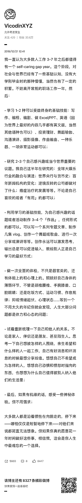

# 《过去的一年虽然没 gap，却也是实打实的 self-caring year》

> 原文：[`www.yuque.com/for_lazy/thfiu8/dmpgwov3lzp18gm2`](https://www.yuque.com/for_lazy/thfiu8/dmpgwov3lzp18gm2)

<ne-h2 id="7b9253bd" data-lake-id="7b9253bd"><ne-heading-ext><ne-heading-anchor></ne-heading-anchor><ne-heading-fold></ne-heading-fold></ne-heading-ext><ne-heading-content><ne-text id="udaf9acfe">(69 赞)《过去的一年虽然没 gap，却也是实打实的 self-caring year》</ne-text></ne-heading-content></ne-h2> <ne-p id="u903bd91d" data-lake-id="u903bd91d"><ne-text id="uf51cc45a">作者： 杨昌</ne-text></ne-p> <ne-p id="u9780481b" data-lake-id="u9780481b"><ne-text id="u410f2baf">日期：2023-03-20</ne-text></ne-p> <ne-p id="ua5d9e264" data-lake-id="ua5d9e264"><ne-text id="u79cdd61e">刷到张潇雨老师 2019 年的这条微博，总结得这么好，很受震撼，同时也非常有共鸣。</ne-text></ne-p> <ne-p id="u89638e3e" data-lake-id="u89638e3e"><ne-text id="u7d52c714">对我而言，过去的一年，虽然没 gap，却也是实打实的 self-caring year：</ne-text></ne-p> <ne-p id="u89a7c5b7" data-lake-id="u89a7c5b7"><ne-text id="u5eb3501c">1、学一种可以终身受益的基础技能</ne-text></ne-p> <ne-p id="ud67df56c" data-lake-id="ud67df56c"><ne-text id="u6fa9d5b5">「好好说人话，用心讲故事」</ne-text></ne-p> <ne-p id="u065a789a" data-lake-id="u065a789a"><ne-text id="u5f1ac5fe">面向人的写作技能，现在基本上能当我吃饭的手艺了</ne-text></ne-p> <ne-p id="u681126fb" data-lake-id="u681126fb"><ne-text id="uca77921a">2、研究 2-3 个自己感兴趣或当今世界重要的议题。</ne-text></ne-p> <ne-p id="ucda0dac7" data-lake-id="ucda0dac7"><ne-text id="uc9c15ad2">①内向者发展：慢慢攻克了很多困扰我多年的内向问题，通过分享还帮到了些有同样困扰的朋友；</ne-text></ne-p> <ne-p id="ud397112a" data-lake-id="ud397112a"><ne-text id="ud5ebd8ca">②人工智能：随着 ChatGPT 和 AI 绘画的横空出世，很多生产力和生产关系都将发生重大变化。不算研究得深，但总归没掉队。</ne-text></ne-p> <ne-p id="u3a42d97b" data-lake-id="u3a42d97b"><ne-text id="u72e72a20">3、利用学习的基础技能，为自己感兴趣的话题或者活动制作 3-4 个「作品」</ne-text></ne-p> <ne-p id="u41dd51d2" data-lake-id="u41dd51d2"><ne-text id="ue071239b">①有篇“”的精华帖，已经有了 300 多赞了，算一个</ne-text></ne-p> <ne-p id="u997e6296" data-lake-id="u997e6296"><ne-text id="u80464a63">②内向者发展，已经陆续写了十多篇反馈不错的文章，争取上半年都整理进小报童吧</ne-text></ne-p> <ne-p id="ud897ed60" data-lake-id="ud897ed60"><ne-text id="ud940fd8b">③人工智能方面不算有作品，不过好消息是给基于 GTP4 的土家语翻译器做一丢丢小贡献</ne-text></ne-p> <ne-p id="u8e9c5f09" data-lake-id="u8e9c5f09"><ne-text id="u6addb098">4、做一次全面的体检，不只是器官类的，还有体能上的和心理上的。</ne-text></ne-p> <ne-p id="uafa5d24d" data-lake-id="uafa5d24d"><ne-text id="u83b548c5">主要做的是心理上的，有做过直面最大创伤的疗愈，也有坚持挺长一段时间的心理咨询。</ne-text></ne-p> <ne-p id="ue32c4abb" data-lake-id="ue32c4abb"><ne-text id="udfaaaf24">在这个过程中，重走了“童年路”。把自己的童年中印象深刻的事情，重新梳理一遍，重新叙事一遍。</ne-text></ne-p> <ne-p id="u4471756f" data-lake-id="u4471756f"><ne-text id="ua5e2f7f6">一方面，把某些卡在某个童年的创伤/逆境里的防御模式解开，帮自己从那种情绪里解救出来，进而拓宽自己的认知模式。</ne-text></ne-p> <ne-p id="u6369c7c0" data-lake-id="u6369c7c0"><ne-text id="uc86369da">另外一方面，也把之前误以为没有用、赚不到钱就忽略了天赋和优势，慢慢捡了起来。</ne-text></ne-p> <ne-p id="u0547cd41" data-lake-id="u0547cd41"><ne-text id="u7914b8f3">5、试着重新梳理一下自己和他人的关系</ne-text></ne-p> <ne-p id="uaabcd527" data-lake-id="uaabcd527"><ne-text id="u7c8db5fb">这一年里，开始学会了跳出各种血缘关系、乡谊关系、学校关系、同事关系、社群关系等，如实客观地在“现实人生与人格发展”层面进行观察和评价朋友圈的、身边的人，去掉关系的滤镜，平视去看他们个体本身。</ne-text></ne-p> <ne-p id="u7cf3ed15" data-lake-id="u7cf3ed15"><ne-text id="ud93ae255">有不寒而栗的真相，也有意料之外的惊喜。现在基本上非常明确了，什么样的人是双向奔赴的，什么样的人是要树立边界的，还有哪些有毒关系是要立马一刀两断的。</ne-text></ne-p> <ne-p id="u34cfc998" data-lake-id="u34cfc998"><ne-text id="ufc4aeef0">——————</ne-text></ne-p> <ne-p id="uc147e146" data-lake-id="uc147e146"><ne-text id="ua82edc64">从今天开始往前数的这一年，大概率会是我以及我们小家庭都终身难忘的一年。</ne-text>[<ne-text id="u1b0a1712">https://t.zsxq.com/0cDvwka4I</ne-text>](https://t.zsxq.com/0cDvwka4I)<ne-card data-card-name="image" data-card-type="inline" id="h7TOR" data-event-boundary="card">  <ne-hole id="uc2abfb3f" data-lake-id="uc2abfb3f"><ne-card data-card-name="hr" data-card-type="block" id="tz2RU" data-event-boundary="card"><ne-p id="ue456d852" data-lake-id="ue456d852"><ne-text id="u797bb28c">评论区：</ne-text></ne-p> <ne-p id="ua9cde64b" data-lake-id="ua9cde64b"><ne-text id="u3e8d977d">施公子 : 第 5 点很棒</ne-text> <ne-text id="u1c3b232b">杨昌 : 嗯呢 这个对我今年的帮助也非常大</ne-text> <ne-text id="uda9fb45f">Vera 芊迪 : 真好，明年也要做一个这样的总结。自己给今年的定位是调整，思考一些重要的问题，提升关键能力，突破过去的局限，精力投入的改变一定会导向结果的变化。</ne-text> <ne-text id="u6f792a50">杨昌 : 一起加油！</ne-text> <ne-text id="u0a38de2c">塞西 : 对直面最大创伤这样的疗愈很感兴趣！可以推荐给我吗？</ne-text> <ne-text id="u96a586bd">杨昌 : 好的，作为前 90 名来访者之一，非常感谢这个写作暴露干预试验。</ne-text></ne-p> <ne-p id="u76648042" data-lake-id="u76648042"><ne-text id="u44e92cdb">最大的收获之一，是从创伤中找到了满满的力量感。</ne-text></ne-p> <ne-p id="uf8679b51" data-lake-id="uf8679b51"><ne-text id="u60658096">以前想到创伤的时候，会把它想象成可怕的庞然大物。参加完免费心理咨询试验过后，终于走进瞅了瞅它，哦，原来也没那么可怕嘛。</ne-text></ne-p> <ne-p id="u93e68496" data-lake-id="u93e68496"><ne-text id="ub77015b7">再后来，比起关心创伤，我更关注那个从创伤中走出来的自己。天啦，那样的情况，我居然也可以应对，我太了不起了。正是有了这段经历打底子，才有了今年整个人“脱胎换骨”的蜕变吧。</ne-text></ne-p> <ne-p id="u8d49bad4" data-lake-id="u8d49bad4"><ne-text id="u5c64d2d6">亲测有效，也推荐给可能需要的朋友，口罩三年，大家或多或少遇到过些心理上的冲击。</ne-text></ne-p> <ne-p id="u662414f2" data-lake-id="u662414f2"><ne-text id="ubd5df7a3">冲着北大 IPP 临床心理实验室的牌子，这个项目还是值得信任的。</ne-text></ne-p> <ne-p id="u1c4160dc" data-lake-id="u1c4160dc"><ne-text id="uddcaf345">而且又不要钱，囊中羞涩或者不愿在心理健康上投入太多的朋友，都可以试一试。</ne-text></ne-p> <ne-p id="u3f9caca5" data-lake-id="u3f9caca5">[<ne-text id="u5cf888fe">https://www.xiaoyuzhoufm.com/episode/6406a530c5d7e6e06065c869?s=eyJ1IjogIjVlN2YzZDM0MWJmYmJjM2RhZDgzMTIzYSJ9</ne-text>](https://www.xiaoyuzhoufm.com/episode/6406a530c5d7e6e06065c869?s=eyJ1IjogIjVlN2YzZDM0MWJmYmJjM2RhZDgzMTIzYSJ9)</ne-p></ne-card></ne-hole></ne-card></ne-p>