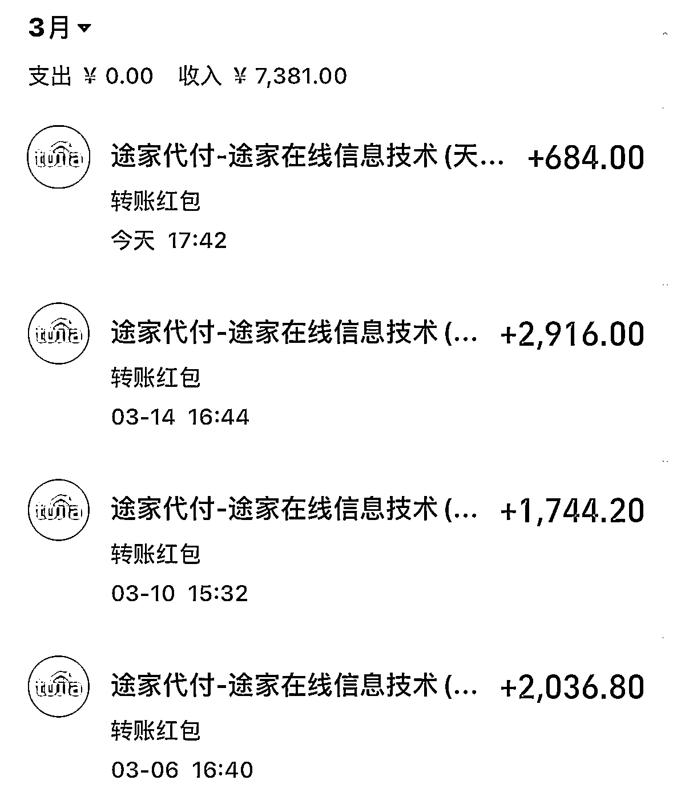
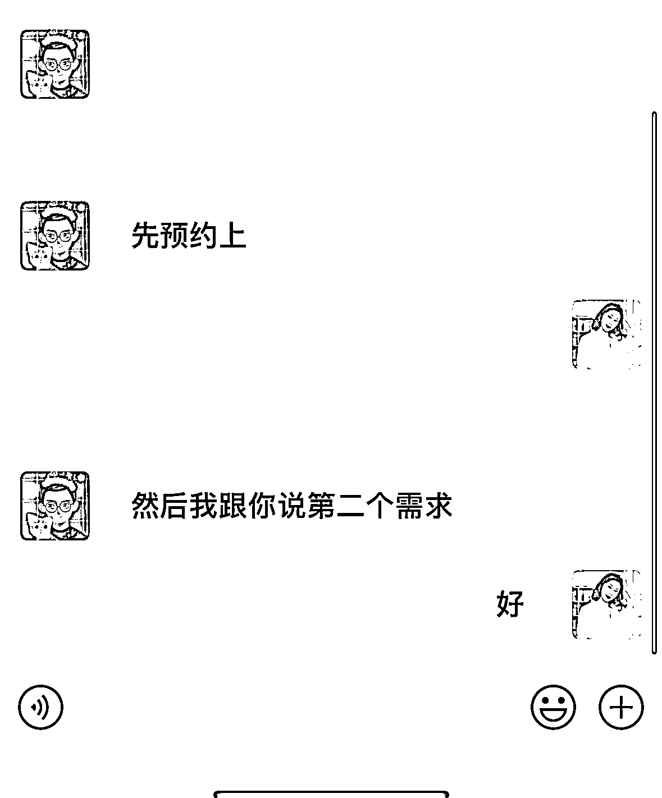
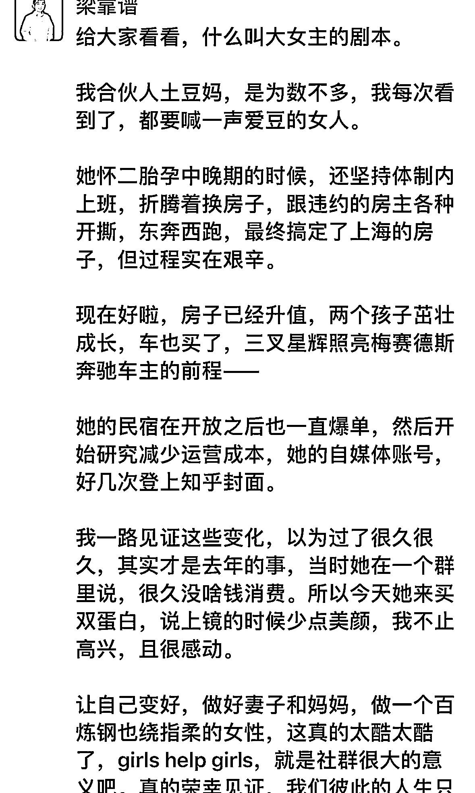

# 《体制内从 0-1 突破舒适圈，副业年赚 20W+ 的心得》

> 原文：[`www.yuque.com/for_lazy/thfiu8/ssbitmky75ignudd`](https://www.yuque.com/for_lazy/thfiu8/ssbitmky75ignudd)

<ne-h2 id="3343a28a" data-lake-id="3343a28a"><ne-heading-ext><ne-heading-anchor></ne-heading-anchor><ne-heading-fold></ne-heading-fold></ne-heading-ext><ne-heading-content><ne-text id="uecd64c22">(130 赞)《体制内从 0-1 突破舒适圈，副业年赚 20W+ 的心得》</ne-text></ne-heading-content></ne-h2> <ne-p id="uc6b43cfb" data-lake-id="uc6b43cfb"><ne-text id="ucf22fde6">作者： 爱折腾的土豆妈</ne-text></ne-p> <ne-p id="u5f17738c" data-lake-id="u5f17738c"><ne-text id="u47f6a8d5">日期：2023-03-22</ne-text></ne-p> <ne-p id="ubb125437" data-lake-id="ubb125437"><ne-text id="ue29a9bef">时不时会看到一些朋友在搞副业、赚钱的时候，总有很大的焦虑、犹豫，比如朋友圈不敢发，怕领导同事发现；微商不敢做，卖货不合适；视频不敢拍，露脸不太好……</ne-text></ne-p> <ne-p id="ud6b1a2c1" data-lake-id="ud6b1a2c1"><ne-text id="u6a944360">体制内、公务员、一些特殊工作岗位，总有这些那些的顾虑，这些包袱越背越沉，甩不开严重阻碍了前进的步伐。如果你也有这种困惑，不妨看看这篇，土豆妈用自己的实战经验分享，帮你开拓一下思路。</ne-text></ne-p> <ne-h2 id="6b0aa0c4" data-lake-id="6b0aa0c4"><ne-heading-ext><ne-heading-anchor></ne-heading-anchor><ne-heading-fold></ne-heading-fold></ne-heading-ext><ne-heading-content><ne-text id="u3cc3c86c" ne-bold="true">【个人介绍】</ne-text></ne-heading-content></ne-h2> <ne-p id="u958291d8" data-lake-id="u958291d8"><ne-text id="ueb45b74d">我是爱折腾的土豆妈，一个爱折腾房子的专业幼教，上海公办幼儿园体制内的幼教，工作 14 年，中层岗位分管招生等工作。5 年内买卖房子 6 次，装修改造 3 套。</ne-text></ne-p> <ne-p id="u11155731" data-lake-id="u11155731">[<ne-text id="u99bc77bc">职场宝妈 5 年 6 次房屋买卖赚百万的血泪经验</ne-text>](https://articles.zsxq.com/id_jr402gow56k8.html) <ne-text id="u2b4b7e18">万字长文复盘，有兴趣的可以看看</ne-text></ne-p> <ne-p id="u78b4095f" data-lake-id="u78b4095f"><ne-text id="u88869c0a">https://t.zsxq.com/0cE7ISGkM</ne-text></ne-p> <ne-h2 id="40a4d955" data-lake-id="40a4d955"><ne-heading-ext><ne-heading-anchor></ne-heading-anchor><ne-heading-fold></ne-heading-fold></ne-heading-ext><ne-heading-content><ne-text id="ueaa32e80" ne-bold="true">【副业介绍】</ne-text></ne-heading-content></ne-h2> <ne-p id="ue729808e" data-lake-id="ue729808e"><ne-text id="u4e34d086" ne-bold="true">1、进口母婴海淘</ne-text></ne-p> <ne-p id="ufae54cb9" data-lake-id="ufae54cb9"><ne-text id="uf8ced76c">2012 年孕期的时候开始尝试的项目，纯粹是从自己想囤货，朋友圈找人一起拼单，口碑相传，自己从国外网站海淘采购、国内销售，边买边卖赚了第一桶金，养娃的一切开支都是靠海淘赚来的，具体赚了多少也没细细算过账。由于一些原因，大概在 18 年左右就慢慢停了所有业务，现在想想当时解散了一个超高复购率的 300+精准客户微信群是多么愚蠢的事情。</ne-text></ne-p> <ne-p id="u3089889d" data-lake-id="u3089889d"><ne-text id="ub2a0783c" ne-bold="true">2、民宿个人房东</ne-text></ne-p> <ne-p id="ub3ae8848" data-lake-id="ub3ae8848"><ne-text id="ud69b6916">斜杠的民宿房东，手上最多的时候也就 4 套房在运营，目前 2 套在运营中，个人小房东。盘活了一下自己家的郊区房和 40 平学区房，房租收入实现翻倍。</ne-text></ne-p> <ne-p id="u0c70df13" data-lake-id="u0c70df13"><ne-text id="u7022f035">过去的三年非常艰难，民宿圈里也淘汰了相当多，尤其是过去一年日子确实不好过，好在都熬过来了，从 2022 年 12 月慢慢恢复。2023 年 3 月最近的 20 天单一个平台的房租收入已经 7000+。</ne-text></ne-p> <ne-p id="u72eaa862" data-lake-id="u72eaa862"><ne-card data-card-name="image" data-card-type="inline" id="fSoJk" data-event-boundary="card">  <ne-p id="ubb73e72d" data-lake-id="ubb73e72d"><ne-text id="u6cd0aac7" ne-bold="true">3、家居社群创始人</ne-text></ne-p> <ne-p id="u0de4cd58" data-lake-id="u0de4cd58"><ne-text id="u32b3547b">2021 年 6 月开工装修自住二手房，同步开通了装修围观群，2023 年 2 月把群从免费群升级成付费社群，有了第一笔社群付费收入。一周拉新了 30+，目前社群成员 120+，199 限时优惠中。</ne-text></ne-p> <ne-p id="uc320c6ee" data-lake-id="uc320c6ee"><ne-text id="u35ff0d20" ne-bold="true">4、一对一咨询</ne-text></ne-p> <ne-p id="u844f5c1c" data-lake-id="u844f5c1c"><ne-text id="u2b8bedbb">2022 年年底开始尝试私人咨询服务，主要是房产购买、学区规划、装修建议等方面，从一开始不收费，到红包随意，再到 199/h，最近涨价到单次 999/3h。把自己的时间和精力越卖越贵。</ne-text></ne-p> <ne-p id="ud472259a" data-lake-id="ud472259a"><ne-text id="u72de87c0">就在前几天接到了 紫菜 大神圈友关于房产、装修方面的咨询，体制内怕啥，跨领域的知识付费真的可以！</ne-text></ne-p> <ne-p id="ub27fdeef" data-lake-id="ub27fdeef"><ne-card data-card-name="image" data-card-type="inline" id="xfYxn" data-event-boundary="card">  <ne-h2 id="febc787e" data-lake-id="febc787e"><ne-heading-ext><ne-heading-anchor></ne-heading-anchor><ne-heading-fold></ne-heading-fold></ne-heading-ext><ne-heading-content><ne-text id="u73b5fce7" ne-bold="true">【破圈逻辑】</ne-text></ne-heading-content></ne-h2> <ne-p id="u34ec4a2c" data-lake-id="u34ec4a2c"><ne-text id="u3189932f">从表面看，副业赚钱的领域基本跟主业是分离的，但好像又有些关联性。聊聊破圈自洽赚钱的底层逻辑。</ne-text></ne-p> <ne-p id="uea02ea84" data-lake-id="uea02ea84"><ne-text id="u88aa0c0b" ne-bold="true">1、接纳本职工作限制</ne-text></ne-p> <ne-p id="u20d2d0ce" data-lake-id="u20d2d0ce"><ne-text id="udaa358ed">首先一点，不要尝试在底线摩擦，比如在事业单位有明文规定，不要做直播带货、跟学校相关的产业相关的资金交易，那么这些避开就好了。</ne-text></ne-p> <ne-p id="u515220b8" data-lake-id="u515220b8"><ne-text id="ub6d27017" ne-bold="true">2、给自己定底线标准</ne-text></ne-p> <ne-p id="u3e653b62" data-lake-id="u3e653b62"><ne-text id="ue6c1f7ab">我给自己定的标准就是不做工作范围内同事、家长的生意，尤其是家长，哪怕是孩子都已经毕业了，家长资源不利用。虽然手上每一年经手上百家庭的详细资料，但我并不想利用。</ne-text></ne-p> <ne-p id="ud7b4dab5" data-lake-id="ud7b4dab5"><ne-text id="ua90e9e94">包括我自己工作范围内的学区咨询，购房建议等相关的内容，全部不收费，免费解答。这是我给自己定的底线。</ne-text></ne-p> <ne-p id="u103af2c0" data-lake-id="u103af2c0"><ne-text id="u97f83324" ne-bold="true">3、挖掘自身兴趣爱好</ne-text></ne-p> <ne-p id="u5bea6538" data-lake-id="u5bea6538"><ne-text id="ua264d74f">想破圈，兴趣爱好是个很好的出发点，其实我曾经还尝试过利用手工制作变现，折纸手工都能制作成礼盒出售。现在则是依靠对家的热爱，装修家居的喜好，输出自己的内容来进行变现。生活类的领域，是每个普通人都离不开的，体制内想要破圈，完全可以从生活入手，比如警察可以分享每日健身，老师可以分享每日育娃妙招，医生可以分享营养减脂餐，把下班后的生活分享出来，没那么多包袱了，每个人都有下班后的 8 小时。</ne-text></ne-p> <ne-p id="ucab4b8c2" data-lake-id="ucab4b8c2"><ne-text id="u3645ae78">我自己靠什么来赚钱，就是下班后倒腾自己家房子，我赚点房租跟我做什么工作有关系吗？领导会来干涉吗？那就大大方方折腾就对了！</ne-text></ne-p> <ne-p id="uddbf29d5" data-lake-id="uddbf29d5"><ne-text id="ub3423129" ne-bold="true">4、技术不够行动来凑</ne-text></ne-p> <ne-p id="uf940fd38" data-lake-id="uf940fd38"><ne-text id="u39d904cf">想要形成副业赚钱，光靠为爱发电还不够，还需要一些基础技能，直播不能干，可以拍视频；视频不能露脸，可以做图文；图文不方便，起个笔名只写文，鲁迅、巴金、冰心取名随便取，不要再喊我不行！关键还是那句话，你得行动起来，先把 0-1 跑通。</ne-text></ne-p> <ne-p id="u64437b77" data-lake-id="u64437b77"><ne-text id="uc6ec00c3">比如星球里各种训练营、陪跑营，紧跟步伐试一试，说不定就跑通了呢，先赚到一块钱！</ne-text></ne-p> <ne-p id="u09dffeb7" data-lake-id="u09dffeb7"><ne-text id="u3f20b36c">从 2020 年入生财有术，再到 22 年加入玩赚星球，尝试过 TIKTOK，知乎好物、小红书等等，虽然变现不多，但都算跑通了，积累的网感、图文编辑能力、视频剪辑能力、写作能力都是提升自己的核心竞争力的，每一秒、每一天的努力都不会白费。</ne-text></ne-p> <ne-p id="u4165ae7a" data-lake-id="u4165ae7a"><ne-text id="u930497d1" ne-bold="true">5、做好孤独心理准备</ne-text></ne-p> <ne-p id="u951f280c" data-lake-id="u951f280c"><ne-text id="uccae4026">尝试突破舒适圈，有个逃不开的困扰，体制内的一成不变的思想会腐化一个人的心智，桎梏你行动的脚步。曾经我一度怀疑自己的人生观、世界观、价值观怎么如此格格不入。</ne-text></ne-p> <ne-p id="ud29102f6" data-lake-id="ud29102f6"><ne-text id="u85c24af6">在体制内的单位里，不需要多努力，每天固定时间上班下班。基本一眼可以望到退休。耳边同事聊天的内容，无非就是家长里短、油盐酱醋，老公、婆婆、孩子，衣服包包化妆品……经常有人问我又买房了？又装修了？花 20W 租房住？你太折腾了吧。</ne-text></ne-p> <ne-p id="ue08ab367" data-lake-id="ue08ab367"><ne-text id="u8a6f688e">在工作中，同事在聊的话题我不想参与，比如某同事明明名下很多拆迁房，一套也不想卖，把全家老小困在一套可怜巴巴的小户型里，还要吐槽公婆这不好那不好，我想帮她一把，但人家不愿意折腾……而我感兴趣的话题，房屋买卖置换，装修提升租售比，社群运营，chaGPT、社群运营、知识付费，她们一个名词都听不懂，就不开口就好了。</ne-text></ne-p> <ne-p id="u9f1c6216" data-lake-id="u9f1c6216"><ne-text id="ud2893b49">现在的我工作中就只聊工作，不再内耗，甚至尽量减少午餐、午休时间与同事接触唠嗑的时间，避开人群找个角落看看社群消息，学点自己想看的课程，写点自己的副业心得，一个人挺好的。</ne-text></ne-p> <ne-h2 id="7c46af98" data-lake-id="7c46af98"><ne-heading-ext><ne-heading-anchor></ne-heading-anchor><ne-heading-fold></ne-heading-fold></ne-heading-ext><ne-heading-content><ne-text id="uc46f5b09" style="background-color: rgb(255, 255, 255); color: rgb(47, 48, 52);">【破圈技巧】</ne-text></ne-heading-content></ne-h2> <ne-p id="u27180047" data-lake-id="u27180047"><ne-text id="ud283fab1" ne-bold="true">1、坚持做别人坚持不了的事，一定会引发关注</ne-text></ne-p> <ne-p id="ubc37b55d" data-lake-id="ubc37b55d"><ne-text id="u4192044e">不管是哪一种形式的，坚持是破圈赚钱的核心，坚持写作、坚持发朋友圈、坚持健身，坚持输出图文笔记，坚持拍 vlog 等等，没方向的时候就选一个简单的行动，就坚持做就对了。</ne-text></ne-p> <ne-p id="u9001b53a" data-lake-id="u9001b53a"><ne-text id="uaa055cd6">比如土豆妈是如何破圈让@梁靠谱 关注到我？让靠谱大神多次在群里、直播中，甚至还写了一条朋友圈单独来介绍我？其实我就做了一件小事，写每日复盘，少则 20 字，多则 2000 字，坚持了 600 多天，二胎生娃当天也没断更。靠谱就是一路围观我这 600 多天，如何买卖房子、装修房子、顺便生了个二胎。</ne-text></ne-p> <ne-h4 id="8956f786" data-lake-id="8956f786"><ne-heading-ext><ne-heading-anchor></ne-heading-anchor><ne-heading-fold></ne-heading-fold></ne-heading-ext><ne-heading-content><ne-card data-card-name="image" data-card-type="inline" id="ocE3T" data-event-boundary="card">  <ne-h4 id="4fe8b9dd" data-lake-id="4fe8b9dd"><ne-heading-ext><ne-heading-anchor></ne-heading-anchor><ne-heading-fold></ne-heading-fold></ne-heading-ext><ne-heading-content></ne-heading-content></ne-h4><ne-h4 id="ad22314d" data-lake-id="ad22314d"><ne-heading-ext><ne-heading-anchor></ne-heading-anchor><ne-heading-fold></ne-heading-fold></ne-heading-ext><ne-heading-content><ne-text id="u9c816490" ne-bold="true">2、乐于分享，流量在哪里，影响力在哪里，财富就在哪里</ne-text></ne-heading-content></ne-h4> <ne-p id="ucc141cbb" data-lake-id="ucc141cbb"><ne-text id="u6058a841">想要扩大收入，或者说扩大影响力，把自己的点滴收获分享出来，告诉别人。多输出才有收获。</ne-text></ne-p> <ne-p id="ua25c7d2c" data-lake-id="ua25c7d2c"><ne-text id="uef1dc173">比如我写的一篇五年买卖 6 次学区房赚百万的经验，帮我引流了好几个付费的私人咨询。紫菜大神也来加好友做房产买卖、装修相关的个人咨询。</ne-text></ne-p> <ne-p id="uf1c211b9" data-lake-id="uf1c211b9"><ne-text id="u31a9d925">前几天，我发现亦仁老大家里也在装修，毛遂自荐了自己，分享了一下我的社群思路，也是获得了亦仁的肯定。最近一个月社群运营就特别有干劲，方向对了，跑得更顺畅了！</ne-text></ne-p> <ne-p id="uf8769980" data-lake-id="uf8769980"><ne-card data-card-name="image" data-card-type="inline" id="RDovh" data-event-boundary="card">  <ne-h4 id="9039450f" data-lake-id="9039450f"><ne-heading-ext><ne-heading-anchor></ne-heading-anchor><ne-heading-fold></ne-heading-fold></ne-heading-ext> <ne-heading-content></ne-heading-content></ne-h4> <ne-h4 id="67f6a948" data-lake-id="67f6a948"><ne-heading-ext><ne-heading-anchor></ne-heading-anchor><ne-heading-fold></ne-heading-fold></ne-heading-ext><ne-heading-content><ne-text id="u6fa76a30" ne-bold="true">3、别把自己当回事，大大方方搞钱</ne-text></ne-heading-content></ne-h4> <ne-p id="ufd95ed10" data-lake-id="ufd95ed10"><ne-text id="u14e73651">体制内的朋友，大部分都有这些那些的思想包袱，今天这篇复盘也是想鼓励更多的体制内的朋友，别对自己太在意了，赚钱这件事不羞耻，大大方方干就对了。</ne-text></ne-p> <ne-p id="ue26bf067" data-lake-id="ue26bf067"><ne-text id="u2c7c29b6">朋友圈不敢发？把所有人一个个拉出来做备注标签，只分两类，【看广告】和【不看广告】，就跟物品断舍离的时候一样，但凡犹豫的都暂时归纳到【不看广告】，这样分类清楚之后，你还有什么不敢发朋友圈的呢？</ne-text></ne-p> <ne-h3 id="9039450f-1" data-lake-id="9039450f-1"><ne-heading-ext><ne-heading-anchor></ne-heading-anchor><ne-heading-fold></ne-heading-fold></ne-heading-ext> <ne-heading-content></ne-heading-content></ne-h3> <ne-h4 id="897943f3" data-lake-id="897943f3"><ne-heading-ext><ne-heading-anchor></ne-heading-anchor><ne-heading-fold></ne-heading-fold></ne-heading-ext><ne-heading-content><ne-text id="u787aac00" ne-bold="true">4、边学边做，边做边改</ne-text></ne-heading-content></ne-h4> <ne-p id="u3bf38c96" data-lake-id="u3bf38c96"><ne-text id="uec8320ad">体制内的朋友经常说，我啥也不会啊，我也不知道能干什么？进了生财你还怕没项目吗？每月都都各类大大小小的航海活动，先挑自己感兴趣的，跟着学起来。慢慢就有赚钱的感觉了。</ne-text></ne-p> <ne-p id="uf37290d8" data-lake-id="uf37290d8"><ne-text id="u84f185ae">芷蓝一再提醒我，自媒体赚钱终究是要有自己的 IP 定位和后端变现的产品，而最基础的产品是什么？付费社群就是一个很不错的基础入门产品。</ne-text></ne-p> <ne-p id="u11fc41fc" data-lake-id="u11fc41fc"><ne-text id="u54e3800e">于是在今年一月底过年期间，马不停蹄得把搞了一年半的免费社群，转换成了付费社群，一开始定价 99/年的时候我是怀疑的，不确定的，一步步地优化、完善后，甚至觉得这么有内容、有价值的社群值得有更高的定价。</ne-text></ne-p> <ne-p id="u36bb44d9" data-lake-id="u36bb44d9"><ne-text id="u0acc2e3e">这种从 0-1 的尝试，失败了无非也就是浪费了点自己刷手机、刷剧、买买买的时间，损失成本接近于零，大胆去尝试就对了！</ne-text></ne-p> <ne-hole id="u32b7e6b3" data-lake-id="u32b7e6b3"><ne-card data-card-name="hr" data-card-type="block" id="JgpgF" data-event-boundary="card"><ne-p id="u029e0e7f" data-lake-id="u029e0e7f"><ne-text id="u5107fb1d">无论你是体制内还是体制外，在职还是裸辞，先放下自己过多的包袱和顾虑，行动一下吧。</ne-text></ne-p> <ne-p id="u04c269ef" data-lake-id="u04c269ef"><ne-text id="u0b07e55f">以上，今天你折腾了吗？</ne-text></ne-p> <ne-hole id="u28ba89ff" data-lake-id="u28ba89ff"><ne-card data-card-name="hr" data-card-type="block" id="WYpOb" data-event-boundary="card"><ne-p id="uef1b6f75" data-lake-id="uef1b6f75"><ne-text id="ue8a90e6f">评论区：</ne-text></ne-p> <ne-p id="uaa627eaf" data-lake-id="uaa627eaf"><ne-text id="u078b0003">问逍 : 折腾——这个词是加入生财的精髓。</ne-text> <ne-text id="u77473b1d">我老是去想结果，有时候就折腾不起来</ne-text> <ne-text id="u5863cdc9">还有刚开始做一个项目觉得费劲，半路就歇菜了。</ne-text> <ne-text id="u78498d94">以至于一直没啥结果[流泪]</ne-text> <ne-text id="u86ed779b">大西 CC : 土豆妈厉害</ne-text> <ne-text id="u831c9d38">xing : 先动手再完善</ne-text> <ne-text id="ub5e516c8">爱折腾的土豆妈 : 先不论结果行动起来，</ne-text> <ne-text id="u57425000">潇晨 : 谢谢你，被鼓励了，同为体制内，被周围环境内耗到快抑郁，又是在异地，现在就开始不断付费链接各种大佬学习破圈，小红书已经做到 3 天引流 1000 左右，准备副业成功时脱离这个圈子，去过更好人生</ne-text> <ne-text id="u65db5043">爱折腾的土豆妈 : 有时候不一定是脱离体制内，而是给自己更多一个选项，让 8 小时后的生活更丰富多彩，让工作就单纯的工作，而不是生存必须。</ne-text> <ne-text id="ufa9cf684">爱折腾的土豆妈 : 这是一个很好的开始，坚持下去一定有所收获</ne-text> <ne-text id="ud4e57433">尺子白 : 厉害的女性。[强]</ne-text></ne-p></ne-card></ne-hole></ne-card></ne-hole></ne-card></ne-p></ne-card></ne-heading-content></ne-h4></ne-card></ne-p></ne-card></ne-p>