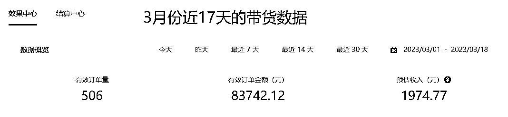

# 《通过 ChatGPT+RPA，帮我在知乎上自动卖货》

> 原文：[`www.yuque.com/for_lazy/thfiu8/vhu2e5rtlxn3wpfl`](https://www.yuque.com/for_lazy/thfiu8/vhu2e5rtlxn3wpfl)

<ne-h2 id="535da8a0" data-lake-id="535da8a0"><ne-heading-ext><ne-heading-anchor></ne-heading-anchor><ne-heading-fold></ne-heading-fold></ne-heading-ext><ne-heading-content><ne-text id="u3329b90d">(96 赞)《通过 ChatGPT+RPA，帮我在知乎上自动卖货》</ne-text></ne-heading-content></ne-h2> <ne-p id="ufc385753" data-lake-id="ufc385753"><ne-text id="uf24f5eb6">作者： 大胡子</ne-text></ne-p> <ne-p id="ueb46da87" data-lake-id="ueb46da87"><ne-text id="u56bb8be0">日期：2023-03-20</ne-text></ne-p> <ne-p id="u269f1b6b" data-lake-id="u269f1b6b"><ne-text id="u756bb3ac">《通过 ChatGPT+RPA，帮我在知乎上自动卖货》</ne-text> <ne-text id="u727c0857">我的做法是：挑选出自己觉得适合 chatgpt 回答的问题，存到草稿箱，然后 rpa 机器人自己挨个去回答即可，当然 rpa 机器人不会真正的提交，还是需要人工再次确认，加以润色才能发表。这差不多就完成了一个通过 chatgpt 自动卖货的最小闭环。</ne-text> <ne-text id="ue1d9b5f9">大家好，我是大胡子，目前在成都，正业是一名程序员。</ne-text> <ne-text id="u91eb800c">自从进了生财副业就有挺多，唯一坚持时间长的就是知乎的好物推荐，大概是 2020 年进入生财，然后就陆陆续续尝试在做知乎好物推荐。</ne-text></ne-p> <ne-p id="u02566b3e" data-lake-id="u02566b3e"><ne-text id="uf23b0bbc">其实知乎好物的瓶颈就是创作，大力出奇迹，每一篇文章或回答接触用户就是一次曝光机会。</ne-text> <ne-text id="u07add53e">正好 chatgpt 横空出世，于是就想到用它来自动化创作，但仅作为辅助创作，它不会带来暴富，但可以满足副业的需求，下面是 3 月份收益</ne-text> <ne-text id="ub5ffaddc">文章链接见：</ne-text> <ne-text id="u33f412e2">知乎好物  </ne-text>[<ne-text id="u1e73e945">https://aqoyanyhfa.feishu.cn/docx/GhbsdeUAeo0lWdxwqcecdwx0nuh</ne-text>](https://aqoyanyhfa.feishu.cn/docx/GhbsdeUAeo0lWdxwqcecdwx0nuh)<ne-card data-card-name="image" data-card-type="inline" id="XXaYE" data-event-boundary="card">  <ne-p id="ubd4eb235" data-lake-id="ubd4eb235"><ne-card data-card-name="image" data-card-type="inline" id="oizoc" data-event-boundary="card">  <ne-hole id="udf15f5e5" data-lake-id="udf15f5e5"><ne-card data-card-name="hr" data-card-type="block" id="XOvYQ" data-event-boundary="card"><ne-p id="u1498f0cb" data-lake-id="u1498f0cb"><ne-text id="u348307ea">评论区：</ne-text></ne-p> <ne-p id="ucdb3b994" data-lake-id="ucdb3b994"><ne-text id="u73b46f7e">大仙 : 请教一下 RPA 使用的是哪家的，哪种 RPA 新手上手比较简单</ne-text> <ne-text id="u6a152e24">Lin : 阿里</ne-text> <ne-text id="ue3161606">Longer : 影刀</ne-text> <ne-text id="ubb68c997">大胡子 : 我自己用的 automa，针对网页的</ne-text> <ne-text id="u4aa3529e">大仙 : [呲牙]谢谢您的回复</ne-text> <ne-text id="ua30a3675">子不语 : 这个路子好</ne-text> <ne-text id="uf23378c0">乐活派 : Automa 怎么加载呀，为什么我一直下载不到浏览器中</ne-text> <ne-text id="u1fa40643">大胡子 : 最可能就是你的网络不是科学的</ne-text></ne-p></ne-card></ne-hole></ne-card></ne-p></ne-card></ne-p>