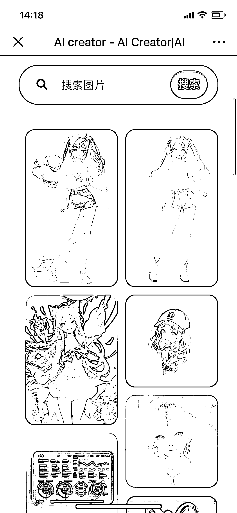
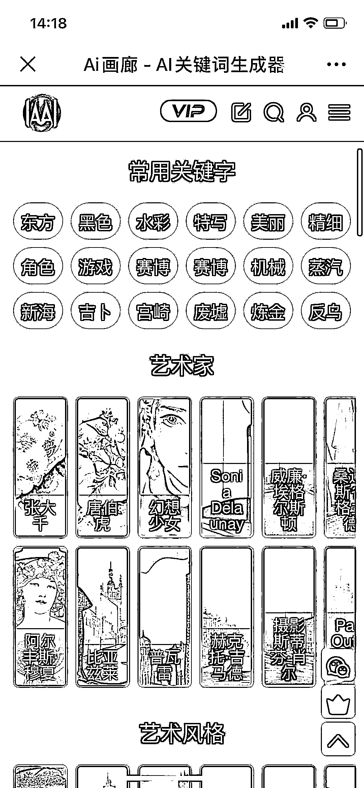
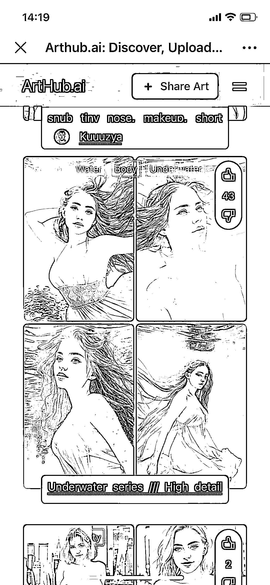
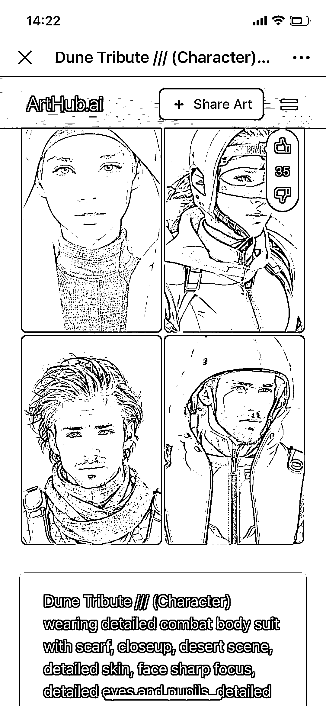

# 《部分 Ai 绘画的应用站，可以深度探索》

> 原文：[`www.yuque.com/for_lazy/thfiu8/knpet848c7370wur`](https://www.yuque.com/for_lazy/thfiu8/knpet848c7370wur)

<ne-h2 id="802c0522" data-lake-id="802c0522"><ne-heading-ext><ne-heading-anchor></ne-heading-anchor><ne-heading-fold></ne-heading-fold></ne-heading-ext><ne-heading-content><ne-text id="ua3ba101d">(49 赞)《部分 Ai 绘画的应用站，可以深度探索》</ne-text></ne-heading-content></ne-h2> <ne-p id="u791d1ce8" data-lake-id="u791d1ce8"><ne-text id="u9d35b174">作者： 教書将</ne-text></ne-p> <ne-p id="ucf8cdecc" data-lake-id="ucf8cdecc"><ne-text id="u4b75fcde">日期：2023-03-22</ne-text></ne-p> <ne-p id="u2d38585b" data-lake-id="u2d38585b"><ne-text id="ue50dede3">收集了部分 Ai 绘画的应用站，感兴趣的朋友可以深度探索。</ne-text></ne-p> <ne-p id="u2dad2fd1" data-lake-id="u2dad2fd1"><ne-text id="u6111177f">1、OpenArt.ai</ne-text> <ne-text id="u5adfcf14">这是一个能检索到多家 AI 绘画生成器 AI 画作和作品关键词的网站，同样支持关键词搜索，可以为创作者提供创作灵感。</ne-text> <ne-text id="u9babd498">根据网站介绍，平台提供搜索 DALL·E2、Midjourney、Stable Diffusion 生成的 1000 万+ AI 艺术和提示词。</ne-text></ne-p> <ne-p id="u668a274d" data-lake-id="u668a274d"><ne-text id="u75d8858a">2、arthub.ai</ne-text> <ne-text id="ub6998200">这个站点提供了大量的艺术家和设计师生成的 AI 艺术画作和关键词。与 lexica.art 一样，支持输入关键词搜索。</ne-text> <ne-text id="uc352d026">网站还对不同图片类型进行分类，方便查看。</ne-text> <ne-text id="u9366e1d0">我们可以复制或参考一些好的画作描述，然后去生成。</ne-text></ne-p> <ne-p id="u77e30efe" data-lake-id="u77e30efe"><ne-text id="u1056a2f2">3、promptomania.com</ne-text> <ne-text id="u2493ddba">这是一款编写智能 AI 绘画关键词（Prompts ）的在线生成工具，提供多种智能 AI 绘画工具(Midjourney、Stable Diffusion、DreamStudio 等)的关键词(Prompts )文本描述模板。</ne-text> <ne-text id="u4a4c6021">最终工具可以自动生成所选 AI 工具规范的 AI 绘画关键词，提供色彩、风格、插画师、图片比例等描述词，帮你描述出想要的画面。</ne-text></ne-p> <ne-p id="u3f0c4099" data-lake-id="u3f0c4099"><ne-text id="u124b316d">4、lexica.art</ne-text> <ne-text id="u590e6f69">该网站拥有数百万 Stable Diffusion 案例的文字描述和图片，可以为大家提供足够的创作灵感。</ne-text> <ne-text id="u38b88479">使用上也很简单，只要在搜索框输入简单的关键词或上传图片，就能为你提供大量风格不同的照片。点击照片就能看到完整的 AI 关键词，点击复制按钮就能直接提取。</ne-text></ne-p> <ne-p id="u578fabaf" data-lake-id="u578fabaf"><ne-text id="u47499550">5、MidJourney prompt Helper</ne-text></ne-p> <ne-p id="u50181f91" data-lake-id="u50181f91"><ne-text id="u89a1ded1">可以辅助你写词的 AI 智能生成工具，主要针对 midjourney 工具。</ne-text></ne-p> <ne-p id="uac225435" data-lake-id="uac225435"><ne-text id="ube55ee24">6、KREA.ai</ne-text> <ne-text id="ua3ec1bf7">这个站点收藏了数百万张 Stable Diffusion 生成的实例，同样支持关键词检索功能。另外，该网站还提供收藏点赞分组功能，方面用户后期自己查看喜欢的作品，目前已经开源。</ne-text></ne-p> <ne-p id="ub60d1197" data-lake-id="ub60d1197"><ne-text id="u2e4761a8">7、AI 画廊</ne-text> <ne-text id="u60424c3b">aigallery.top/tool</ne-text> <ne-text id="u74fdf59a">适合中文用户，这个网站不仅有大量 AI 绘画作品关键词可以参考，还提供了针对不同平台 Midjourney、Novel 、Stable 关键词生成器。</ne-text></ne-p> <ne-p id="u509c09f4" data-lake-id="u509c09f4"><ne-text id="u9b4360fa">8、weirdwonderfulai.art</ne-text> <ne-text id="u6bb5be83">网址:</ne-text> <ne-text id="ue31a9d8e">使用 Disco Diffusion 将艺术家研究的集合放在一个地方，以帮助大家了解使用不同艺术家姓名会得到什么样的风格。</ne-text></ne-p> <ne-p id="uc7409827" data-lake-id="uc7409827"><ne-text id="u21d93155">9、</ne-text> <ne-text id="ucf6ce7a6">适合中文，女性头像比较多。</ne-text></ne-p> <ne-p id="u4413878c" data-lake-id="u4413878c"><ne-text id="ud4264ee5">10、词图</ne-text></ne-p> <ne-p id="ueb8c2bee" data-lake-id="ueb8c2bee"><ne-text id="udd4ee7ad">适合中文关键词，功能很棒。</ne-text>[<ne-text id="u4605b71e">https://prompt.noonshot.com/midjourney</ne-text>](https://prompt.noonshot.com/midjourney)[<ne-text id="u41ad629a">https://weirdwonderfulai.art/resources/disco-diffusion-70-plus-artist-studies/</ne-text>](https://weirdwonderfulai.art/resources/disco-diffusion-70-plus-artist-studies/)[<ne-text id="udd74753d">https://ai-creator.net/arts</ne-text>](https://ai-creator.net/arts)[<ne-text id="u61546eab">https://www.prompttool.com/NovelAI</ne-text>](https://www.prompttool.com/NovelAI)<ne-card data-card-name="image" data-card-type="inline" id="gWu1W" data-event-boundary="card"></ne-card></ne-p> <ne-p id="u4df3814f" data-lake-id="u4df3814f"><ne-card data-card-name="image" data-card-type="inline" id="h7Wtl" data-event-boundary="card"></ne-card></ne-p> <ne-p id="u08f15591" data-lake-id="u08f15591"><ne-card data-card-name="image" data-card-type="inline" id="vBYaM" data-event-boundary="card"></ne-card></ne-p> <ne-p id="uae8337a8" data-lake-id="uae8337a8"><ne-card data-card-name="image" data-card-type="inline" id="wh0Z5" data-event-boundary="card"></ne-card></ne-p> <ne-p id="ue51144ce" data-lake-id="ue51144ce"><ne-card data-card-name="image" data-card-type="inline" id="EZ6nt" data-event-boundary="card"></ne-card></ne-p> <ne-hole id="ua3430740" data-lake-id="ua3430740"><ne-card data-card-name="hr" data-card-type="block" id="tCjLr" data-event-boundary="card"><ne-p id="u3cafd991" data-lake-id="u3cafd991"><ne-text id="ub07edc64">评论区：</ne-text></ne-p> <ne-p id="u06dd1478" data-lake-id="u06dd1478"><ne-text id="u7f01e4c5">书情小跟班 : 谢谢分享</ne-text> <ne-text id="ue7d25ae3">肉の嘟 : 太感谢</ne-text></ne-p></ne-card></ne-hole>