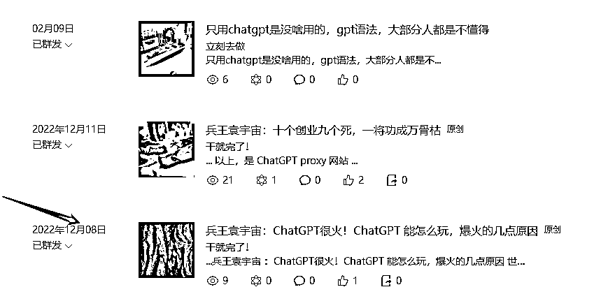
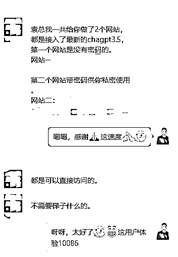
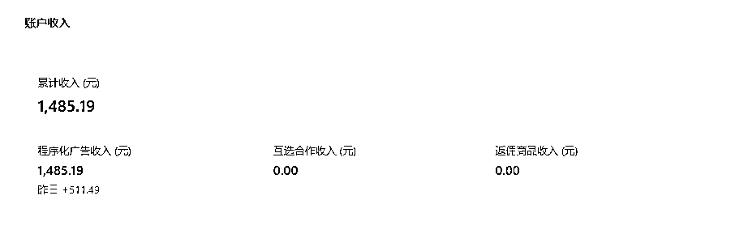
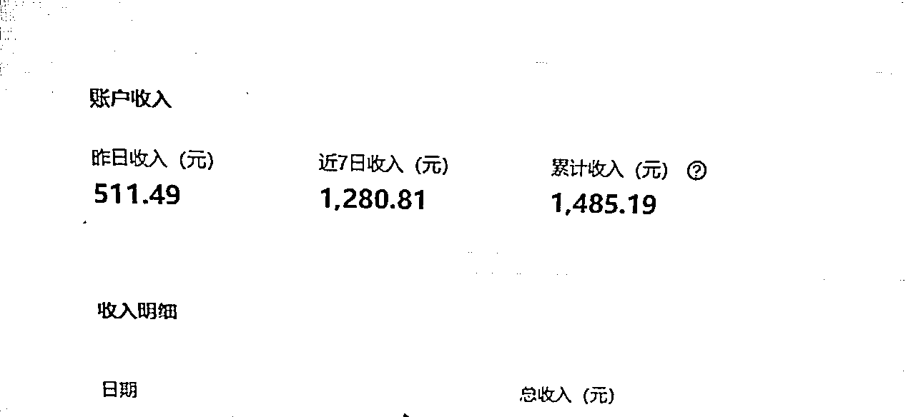

# 《ChatGPT 问世 100 天，一篇 10W+爆文 10 分钟搞定》

> 原文：[`www.yuque.com/for_lazy/thfiu8/ocgrq7c818vtrg4k`](https://www.yuque.com/for_lazy/thfiu8/ocgrq7c818vtrg4k)

<ne-h2 id="9471ab88" data-lake-id="9471ab88"><ne-heading-ext><ne-heading-anchor></ne-heading-anchor><ne-heading-fold></ne-heading-fold></ne-heading-ext><ne-heading-content><ne-text id="u7a228036">(98 赞)《ChatGPT 问世 100 天，一篇 10W+爆文 10 分钟搞定》</ne-text></ne-heading-content></ne-h2> <ne-p id="uf2100059" data-lake-id="uf2100059"><ne-text id="u14f3f8b5">作者： 袁永兵</ne-text></ne-p> <ne-p id="ub16a9d83" data-lake-id="ub16a9d83"><ne-text id="ud5532fa2">日期：2023-03-22</ne-text></ne-p> <ne-p id="u7dac792c" data-lake-id="u7dac792c"><ne-text id="ud41a3988">Hi，我是袁永兵，3 万小时电商创业者，山西省商务厅电子商务实操专家。第一次在生财写分享帖，实属惭愧；再看看别人的龙珠，追赶一篇吧，万事开头难，先从分享开始。</ne-text></ne-p> <ne-p id="u7ea46f63" data-lake-id="u7ea46f63"><ne-text id="u598269a6">但是今天我想分享的不是电商领域， 而是想聊聊我是如何把最近大热的 ChatGPT 应用在公众号文章上的。</ne-text></ne-p> <ne-p id="uc507bf32" data-lake-id="uc507bf32"><ne-text id="u721b0a48">我认为它们两个是有结合的空间的，所以这次很明确的只参加了 AI 绘画&ChatGPT 和公众号爆文两个航海。很幸运，多次尝试之后，我通过 ChatGPT 的协助写出了一篇 10W+的公众号文章。现在这个号跑通了，我接下来准备继续放大收益。</ne-text></ne-p> <ne-p id="u478306c3" data-lake-id="u478306c3"><ne-text id="uad0b621e">趁此机会，我也想回顾一下自己的公众号运营之路，和大家分享一下这篇 10W+背后的故事……</ne-text></ne-p> <ne-h3 id="c4f2b35b" data-lake-id="c4f2b35b"><ne-heading-ext><ne-heading-anchor></ne-heading-anchor><ne-heading-fold></ne-heading-fold></ne-heading-ext><ne-heading-content><ne-text id="ucbbd3d7c">一、为什么想做公众号？</ne-text></ne-heading-content></ne-h3> <ne-p id="u3ba7665a" data-lake-id="u3ba7665a"><ne-text id="ua5550a92">从我和生财圈友的聊天截图说起：</ne-text></ne-p> <ne-p id="u9365e622" data-lake-id="u9365e622"><ne-card data-card-name="image" data-card-type="inline" id="lgy1G" data-event-boundary="card"></ne-card></ne-p> <ne-p id="u8b56a7e9" data-lake-id="u8b56a7e9"><ne-text id="u57b3043b">“我是之前看不起这些仨瓜俩枣，但真能落了口袋里。”</ne-text></ne-p> <ne-p id="u83bf1894" data-lake-id="u83bf1894"><ne-text id="ud89f92aa">对，这就是我在五年前的真实想法。</ne-text></ne-p> <ne-p id="ubc703ed1" data-lake-id="ubc703ed1"><ne-text id="u62ef0917">简单总结来说，也正是 2021 年上半年结束搞抖音、直播，败完 300 万，还负债 300 万后，彻底重新审视自己，所有的变化都来源于这次经历，因为残酷的现实不允许再去玩情怀。没有那些经历，也就谈不上开搞公众号。</ne-text></ne-p> <ne-p id="u8c70ac3b" data-lake-id="u8c70ac3b"><ne-text id="u3d306d95">“如果我是对的，早就不是现在这样了。”</ne-text></ne-p> <ne-p id="u4a2ee819" data-lake-id="u4a2ee819"><ne-text id="u99d809eb">这句话，很管用，不管是我好的时候，还是不好的时候，都会用这句话和自己交流。这一轮的变革，首先是自己的变化。</ne-text></ne-p> <ne-p id="uc54e6b24" data-lake-id="uc54e6b24"><ne-text id="ua1836c81">于是，2021 年后半年，通过朋友、自己寻找，加大了付费社群的入圈，市面上主流的付费社群大部分都加入了，每年累计超过十万元。这个投入的回报是显而易见的，除了极大地弥补了自己在认知差、信息差上面的差距，对于对齐认知差、信息差，再也不是那种“一说都会，一做都错”的“假知道”层面了。</ne-text></ne-p> <ne-p id="u59aecd39" data-lake-id="u59aecd39"><ne-text id="u7b2b82a2">以及凡是没有经过自己手亲自跑通的项目，再也不敢放手去让所谓的“雇佣军”去做主了，真是怕了，市场上能雇到的，真的别寄希望什么，能出来打工就已经说明一切了。</ne-text></ne-p> <ne-p id="uea531606" data-lake-id="uea531606"><ne-text id="u86de822a">认知差、信息差，这两点的“伪认知”“伪信息”，之前是盲目自大的，当然教训也是深刻的，人教人，学不会，事教人，一次会。</ne-text></ne-p> <ne-p id="uf1e6ebe3" data-lake-id="uf1e6ebe3"><ne-text id="ue7bead65">经历不可跨越，经历的都是财富哈，自勉。</ne-text></ne-p> <ne-p id="u407774cd" data-lake-id="u407774cd"><ne-text id="u210a5c9c">当然了，对于执行，这是这么多年来，仅剩的闪光点。</ne-text></ne-p> <ne-p id="u847ce376" data-lake-id="u847ce376"><ne-text id="u9d08f32c">所以，正面回复“为什么想做公众号？”</ne-text></ne-p> <ne-p id="u2379d316" data-lake-id="u2379d316"><ne-text id="u27727109">对于我等 P 民，大钱都是从小钱开始的，小钱也赚不了，大钱更无从谈起。</ne-text></ne-p> <ne-h3 id="5d848a30" data-lake-id="5d848a30"><ne-heading-ext><ne-heading-anchor></ne-heading-anchor><ne-heading-fold></ne-heading-fold></ne-heading-ext><ne-heading-content><ne-text id="u6b8d7ca9">二、十年公众号拿起又放下，我终于看到了属于自己的发展路径</ne-text></ne-heading-content></ne-h3> <ne-p id="u8aa579b5" data-lake-id="u8aa579b5"><ne-text id="u0994afda">我做公众号，有三个阶段：</ne-text></ne-p> <ne-oli><ne-oli-i>1</ne-oli-i><ne-oli-c class="ne-oli-content" id="u73f1330c" data-lake-id="u73f1330c"><ne-text id="u4d6e8027">第一个阶段是十年前</ne-text></ne-oli-c></ne-oli> <ne-p id="u8b3251d8" data-lake-id="u8b3251d8"><ne-text id="u5cc7cca2">2013 年，我跟着大哥和兄弟们注册过十几个公众号，让其中的一个员工去兄弟那里学习了一个星期，</ne-text><ne-text id="u61ca6f0f" ne-bold="true">那时候发文章发了两年，粉丝最多的一个号，都不到一万，当时连流量主都开通不了。</ne-text></ne-p> <ne-p id="u99f4cde1" data-lake-id="u99f4cde1"><ne-text id="u21a98930" ne-bold="true">当然了，当时我们的电商生意很好，根本看不上这点钱。</ne-text></ne-p> <ne-p id="u181e10b7" data-lake-id="u181e10b7"><ne-text id="ub183d0fe">但也就是这个看不起，后面的公众号也就放下了，彻底地掉队了，而我们大哥、兄弟们干的公众号矩阵在 2016 年开始全面进入丰收季，基本上人人都是千万级别，甚至有一位过亿的营收，单单就是公众号哈，赚得盆满钵满，与之对应的是我们在 2018 年电商遇到滑铁卢，断崖式下跌，两者一比，天上地下。</ne-text></ne-p> <ne-p id="u47272ff9" data-lake-id="u47272ff9"><ne-text id="u74a73c08" ne-bold="true">这一次，是身边人的爆发，太刺激了。</ne-text></ne-p> <ne-p id="uc1682dd6" data-lake-id="uc1682dd6"><ne-text id="u94ae948a">这里插一小段，2018 年，我还注册过一批头条号，捋了一波收益，就是纯搬运，我自己身份证注册的账号被永久封禁。也是这次航海期间，我终于找到办法把身份证救出来了，又能使用了。</ne-text></ne-p> <ne-oli><ne-oli-i>1</ne-oli-i><ne-oli-c class="ne-oli-content" id="u1c0322ab" data-lake-id="u1c0322ab"><ne-text id="uc3a2cea0">第二个阶段是 2021 年</ne-text></ne-oli-c></ne-oli> <ne-p id="u1eaa28bb" data-lake-id="u1eaa28bb"><ne-text id="ua5bda36d">抖音短视频和直播败完以后，我们注册了百十来个公众号，</ne-text><ne-text id="ubfaf0683" ne-bold="true">这是第一次批量注册，零星地跑出来几个账号，有粉丝 7 万多的、3 万多的、1 万多的，流量主收益几百、几千不等，多数都是搬运内容。</ne-text><ne-text id="ue6322cea">我看没有太大的起色，之后又不管了。</ne-text></ne-p> <ne-p id="u23eda671" data-lake-id="u23eda671"><ne-text id="ucef30c76">直到 2021 年最后一天，我看到引流卖虚拟资料的项目，紧急切换引流，当天净赚 5K。然后在 2022 年的上半年和下半年，被封在家的那些日子里又打起了公众号的主意，重新开始经营。</ne-text></ne-p> <ne-p id="u43d29c56" data-lake-id="u43d29c56"><ne-text id="ufda5671f">这期间，之前跑得最好的一个号，</ne-text><ne-text id="ue574ab4e" ne-bold="true">一个月收益 16W，其中有单日过万的记录。</ne-text><ne-text id="u981a4bc3">要不是被封，哈哈……这就是第三阶段。</ne-text></ne-p> <ne-p id="ucd69bcc0" data-lake-id="ucd69bcc0"><ne-text id="udba729dc">经历这么三个阶段下来，给我最大的教训，就是上一篇幅中提到的“凡是没有经过自己手亲自跑通的项目，……”也就是必须躬身入局。</ne-text></ne-p> <ne-p id="ufe10e6a8" data-lake-id="ufe10e6a8"><ne-text id="u804c67b0">第二个教训就是在入局晚的当下，账号没有粉丝积淀，纯搬运肯定不行。即使单纯靠堆人，遇上 00 后整顿职场的这批人，也是天天一地鸡毛，以及行业门槛低、新人培养周期长、老人熟练后走人单干导致培养了竞对等等问题，让我发现维持现状总之不是一个长久之计。</ne-text></ne-p> <ne-p id="ufda7527c" data-lake-id="ufda7527c"><ne-text id="u420a67cd">至于其中的困难，就是上文提到的认知差和信息差，我通过付费来解决。</ne-text></ne-p> <ne-p id="u0cda46c6" data-lake-id="u0cda46c6"><ne-text id="uffcf9dbc">花钱能解决的事，这是最简单的事。</ne-text></ne-p> <ne-p id="ua70ef44b" data-lake-id="ua70ef44b"><ne-text id="u1ade4472">看看生财，数千篇精华帖，随便拿出来一个就是很好的项目，把同一个项目的精华帖，全部看完，自己再理解地整理一下，就是一篇很好的项目攻略。</ne-text></ne-p> <ne-p id="u21f0b7d7" data-lake-id="u21f0b7d7"><ne-text id="uce7e2296">攻略都有了，就是自己的执行力了。即使自己笨一点，时间不够一点，别人三天，咱三十天、三个月、三年，你看我，十年后再入公众号，依然可以。</ne-text></ne-p> <ne-p id="u3aeab083" data-lake-id="u3aeab083"><ne-text id="u42c47896" ne-bold="true">这是我今年公司化入局公众号的一年，但今年我有了更好的工具，不管是效率还是文章数据效果，都有了很明显的提升。</ne-text></ne-p> <ne-p id="udb5cfd0e" data-lake-id="udb5cfd0e"><ne-text id="u091e6f08">下面就是我拿一个新号测试用 ChatGPT 写文以来，到目前为止的数据情况。</ne-text></ne-p> <ne-p id="u380514b8" data-lake-id="u380514b8"><ne-card data-card-name="image" data-card-type="inline" id="tOl4Z" data-event-boundary="card"></ne-card></ne-p> <ne-p id="ub6d1e879" data-lake-id="ub6d1e879"><ne-card data-card-name="image" data-card-type="inline" id="Dlz26" data-event-boundary="card"></ne-card></ne-p> <ne-p id="u11d3175e" data-lake-id="u11d3175e"><ne-text id="u7b956d2a" style="color: rgb(143, 149, 158);">（截止 19 日的数据情况）</ne-text></ne-p> <ne-h3 id="e50c9345" data-lake-id="e50c9345"><ne-heading-ext><ne-heading-anchor></ne-heading-anchor><ne-heading-fold></ne-heading-fold></ne-heading-ext><ne-heading-content><ne-text id="u0f17f746">三、工欲善其事必先利其器</ne-text></ne-heading-content></ne-h3> <ne-p id="u07d4ebfb" data-lake-id="u07d4ebfb"><ne-text id="ub53851b0">这个工具就是 ChatGPT 的问世，我最早关注到 ChatGPT 是在 2022 年 12 月初，在 12 月 8 日，就发布了一篇公众号文章。</ne-text></ne-p> <ne-p id="u4c8a023a" data-lake-id="u4c8a023a"><ne-card data-card-name="image" data-card-type="inline" id="M7iRT" data-event-boundary="card"></ne-card></ne-p> <ne-p id="ubdc59501" data-lake-id="ubdc59501"><ne-text id="u67ec6e94" style="color: rgb(143, 149, 158);">（12 月关注到 ChatGPT 后写的文章）</ne-text></ne-p> <ne-p id="u08561fe4" data-lake-id="u08561fe4"><ne-text id="ub019a681">我预感到了新时代的来临。这个工具，完全能够解决我上一篇中提到的两个问题——原创度低、效率不高，这不就是内容行业的大杀器嘛！</ne-text></ne-p> <ne-p id="ufcba451b" data-lake-id="ufcba451b"><ne-text id="u0d612831">有了这样的认知，我就开始鼓捣，平生第一次翻墙、注册 ChatGPT。</ne-text></ne-p> <ne-oli><ne-oli-i>1</ne-oli-i><ne-oli-c class="ne-oli-content" id="uf82bfa75" data-lake-id="uf82bfa75"><ne-text id="udb590dc9">自己注册了 1 个，废掉；</ne-text></ne-oli-c></ne-oli> <ne-oli><ne-oli-i>2</ne-oli-i><ne-oli-c class="ne-oli-content" id="u9c039893" data-lake-id="u9c039893"><ne-text id="u937b6fdd">某宝买了 1 个，出来的结果断断续续，不好用；</ne-text></ne-oli-c></ne-oli> <ne-oli><ne-oli-i>3</ne-oli-i><ne-oli-c class="ne-oli-content" id="uf1f25827" data-lake-id="uf1f25827"><ne-text id="u3fd9bc8a">让国外的朋友注册 2 个，一个是只管注册，我们来翻墙使用，效果不佳；</ne-text></ne-oli-c></ne-oli> <ne-oli><ne-oli-i>4</ne-oli-i><ne-oli-c class="ne-oli-content" id="u2dff048f" data-lake-id="u2dff048f"><ne-text id="u251c50f4">还有一个让她来输出，输出是稳定了，但她自己只是机械地输出，可以说没有灵魂，再加上时区不同，交流起来非常不方便。</ne-text></ne-oli-c></ne-oli> <ne-p id="u13535173" data-lake-id="u13535173"><ne-text id="u974442cd">尽管磕磕绊绊，但 ChatGPT 生成的顺滑答案，艳羡我等，于是整个春节期间，我都泡在这样的群里和网上，墙内墙外来回翻越，真爽，以期得到更直接、更稳定的原创文章解决方案。</ne-text></ne-p> <ne-p id="u00ef7bd6" data-lake-id="u00ef7bd6"><ne-text id="u4a6aa4c4">直到 3 月 1 日，官方公布 Openai 开放接口，感觉这下稳了。</ne-text></ne-p> <ne-p id="u3b839b12" data-lake-id="u3b839b12"><ne-text id="ud8d0a666">这时，在社群里看到一位朋友发的链接，不用翻墙，就能使用，它就是我要找的解决方案。</ne-text></ne-p> <ne-p id="ue685bbe0" data-lake-id="ue685bbe0"><ne-text id="u59d25b19">之后通过社群朋友联系到开发朋友，也就有了属于我自己的 ChatGPT 链接。</ne-text></ne-p> <ne-p id="uc3c2429d" data-lake-id="uc3c2429d"><ne-card data-card-name="image" data-card-type="inline" id="K7UWQ" data-event-boundary="card"></ne-card></ne-p> <ne-p id="u70cb60dc" data-lake-id="u70cb60dc"><ne-text id="u8a839710" ne-bold="true">当天拿到，开始制作文章，三天后 3 月 8 日的文章就爆了，说是巧合也好，说是运气也罢，就是这么玄学。</ne-text></ne-p> <ne-p id="u46f2a686" data-lake-id="u46f2a686"><ne-text id="u0422e733">经此一番，解决了放大项目这条路上的工具问题。这期间，正好赶上生财的航海，报了 AI 绘画&ChatGPT 以及公众号爆文写作，每天看实战手册去学习，去实践。</ne-text></ne-p> <ne-p id="ua0cab185" data-lake-id="ua0cab185"><ne-text id="u5f9ab8fc">我感觉参加航海最大的好处就是，各种玩法、技巧、攻略，总能第一时间在生财找到，在航海看到，尤其是刀姐的调教 ChatGPT，更好的学会了和 ChatGPT 互动，受益匪浅。</ne-text></ne-p> <ne-p id="ue43d34e7" data-lake-id="ue43d34e7"><ne-text id="u6d2d0fef">总之，现在有了不懂的问题，去看生财就是了，它和 ChatGPT 一样，我有问题，它就有答案，这也是我在加入生财快到一年时，才越发会用它了。</ne-text></ne-p> <ne-p id="ue75f848b" data-lake-id="ue75f848b"><ne-text id="u07a6ccd9">说回公众号，现在这个号的文章篇篇都是 ChatGPT 写的，目前有 5 篇文章的阅读量到达 10w+了，也有了一定的变现。</ne-text></ne-p> <ne-p id="ufcc9e1d5" data-lake-id="ufcc9e1d5"><ne-text id="u07eaff94">于是就有了本轮航海的一点点小成绩，以感悟的形式发生在打卡日志中。被眼尖的管理和圈友看到，好几个圈友加我，其中有圈友让我给转发文章，我都表达了歉意。因为之前有过不加掩饰，没规避风险地分享经历，却受到了应有的惩罚，自己的业务受到了一定的影响，所以还请各位圈友谅解，再次表达歉意。</ne-text></ne-p> <ne-h3 id="e973860f" data-lake-id="e973860f"><ne-heading-ext><ne-heading-anchor></ne-heading-anchor><ne-heading-fold></ne-heading-fold></ne-heading-ext><ne-heading-content><ne-text id="u7bae2470">四、关于这篇 10W+文章出炉的复盘</ne-text></ne-heading-content></ne-h3> <ne-p id="u5287b1b2" data-lake-id="u5287b1b2"><ne-text id="ub1f1d0f5">因为有之前的积淀，关于这篇十万加的文章，复盘如下。我们主做情感领域，情绪价值更加凸显，所以搭了一个人工+智能爆文框架，总共 3 步：</ne-text></ne-p> <ne-p id="uc299c0c4" data-lake-id="uc299c0c4"><ne-text id="u32adead1" ne-bold="true">1、选题+标题，占 50%，做内容就是做选题，所谓选择大于努力</ne-text></ne-p> <ne-p id="u22985407" data-lake-id="u22985407"><ne-text id="uc9b24298" ne-bold="true">2、正文</ne-text></ne-p> <ne-p id="u0e09df8f" data-lake-id="u0e09df8f"><ne-text id="u4ae613b0" ne-bold="true">3、情绪价值</ne-text></ne-p> <ne-p id="u6d69c670" data-lake-id="u6d69c670"><ne-text id="u508e5008">这就是我这边的人工+智能（ChatGPT）爆文框架，人工来做 1 和 3；ChatGPT 写 2。</ne-text></ne-p> <ne-p id="uda28a012" data-lake-id="uda28a012"><ne-text id="u33bcc560">这样的一篇文章，很快就能出来，我自己测试的时间，最多 10 分钟就可以全部搞定。</ne-text></ne-p> <ne-p id="u41ecfc70" data-lake-id="u41ecfc70"><ne-text id="u964c1efd">其中，选题、标题用时 1 分钟左右，各种爆文库、榜单，都可以看到这些火爆的选题，起标题用时 1 分钟左右，经过 ChatGPT 1 分钟左右输出，也就是说 3 分钟一篇机器文章就能出来，这时候原创度大概在 60%左右。</ne-text></ne-p> <ne-p id="u4ce93aa0" data-lake-id="u4ce93aa0"><ne-text id="uc4a2b3b0">再用 5 分钟，也就是经过第 3 步的优化，加引文、段与段之间的起承转合、文章结尾的升华等方面的情绪价值，总共用时不超过 10 分钟，就能得到一篇千字原创文章，妥妥地就出来了，且这时候再测原创度，已经高达 70%以上，主流平台都能轻松过关。</ne-text></ne-p> <ne-p id="u65264fd6" data-lake-id="u65264fd6"><ne-text id="udf2fe7d0" ne-bold="true">为什么加了第 3 点情绪价值？</ne-text></ne-p> <ne-p id="u2b795cfd" data-lake-id="u2b795cfd"><ne-text id="u0f48ef86">大家都知道，ChatGPT 出来的文章都有相当程度的范式，不是【 1，2，3】，就是【首先，其次，然后】，很机械化，也很程序化。但公众号爆文内容是需要充满情绪的。</ne-text></ne-p> <ne-p id="uda7709c5" data-lake-id="uda7709c5"><ne-text id="u8cc34b65">这个我们要表示理解，毕竟是程序员开发出来的，它帮我们整理的回答更加条顺，甚至逻辑自洽。因为它最大的价值就是输入即输出，问就是答案，而不像传统的搜索引擎，结果页呈现了无数的广告，我们在广告中寻找答案。这样的用户体验，真是天下苦搜索引擎良久，它浪费了我们宝贵的时间，想想都觉得不革他们的命，天理难容啊。</ne-text></ne-p> <ne-p id="uf84931d2" data-lake-id="uf84931d2"><ne-text id="u891575f9">而 ChatGPT 出来的都是标准答案，我自己评估 ChatGPT 的智商，远胜国内 211 的本科生，但它就是冷冰冰，而这样的文章，之前也测试的发过，数据很一般，就是缺少了人情味，缺少了情绪价值，这个就是加第 3 点的根本原因所在。不过现在的 GTP4，也有了更多的人情味，相当于又帮我们多走了一步。</ne-text></ne-p> <ne-p id="u74ed9c17" data-lake-id="u74ed9c17"><ne-text id="uc729c7d7">这就是人工 + 智能爆文框架的全部内容。</ne-text></ne-p> <ne-p id="ucd47c9c6" data-lake-id="ucd47c9c6"><ne-text id="uad303b13">之后，发出去，交给系统，交给用户。</ne-text></ne-p> <ne-p id="uaab3a8f4" data-lake-id="uaab3a8f4"><ne-text id="u9289f09c">现在好的一点是，2021 年以来，公众号也加入了系统推荐，这也是近几年公众号与时俱进、长盛不衰的原因。</ne-text></ne-p> <ne-p id="u71c70aa2" data-lake-id="u71c70aa2"><ne-text id="ue04967af">在这样的平台下做内容，非常的友好，如果没有系统推荐，在公众号诞生 10 年后再次入局公众号，且没有深厚内容功底，基本没有任何可能拿到好的结果，这一点，要深刻明白，这是平台给予的红利。</ne-text></ne-p> <ne-p id="u74166655" data-lake-id="u74166655"><ne-text id="u62c708ae">而 2022 年上半年之前，发布视频在视频号给公众号导流，也让部分人抢到了红利，我也有些号是在这个时间内成长起来的。</ne-text></ne-p> <ne-h3 id="799d00c2" data-lake-id="799d00c2"><ne-heading-ext><ne-heading-anchor></ne-heading-anchor><ne-heading-fold></ne-heading-fold></ne-heading-ext><ne-heading-content><ne-text id="u069bfba1">五、最后来和想做自媒体的朋友们，聊聊我的心里话</ne-text></ne-heading-content></ne-h3> <ne-p id="u01c70e7a" data-lake-id="u01c70e7a"><ne-text id="u48837d05">台上一分钟，台下十年功。一点不假。</ne-text></ne-p> <ne-p id="ue2fee773" data-lake-id="ue2fee773"><ne-text id="u8df4c957">很多人上来就想的是自己一写，发出去就是 10W+，恨不得篇篇都是 10W+，兄弟姐妹们，醒醒！</ne-text></ne-p> <ne-p id="udf4d9018" data-lake-id="udf4d9018"><ne-text id="u3f0f95cb">这是做自媒体最要命的心态，更是绝大部分人三天打鱼两天晒网，坚持不下来的崩溃现状，这样的心态，仍然需要再次锤炼，因为大家都必须深刻了解的一点现实是，公众号爆文写作，这个事情，其实是一个长期累积的事情，就先从持续做这件事一百天开始，一年开始，能不能有这样的恒心，才是这个事情是否取得结果的前提。</ne-text></ne-p> <ne-p id="u191f6ead" data-lake-id="u191f6ead"><ne-text id="uf5a78103" ne-bold="true">你看到的是 10W+，看不到的是已有账号日更 370 多天了，看不到的是前后十年三次起号铩羽而归的不甘心，以及账号违规多次、被封多个……这些无法与人述说的坑，所有这些规则都是路走多了蹚出来的。</ne-text></ne-p> <ne-p id="u9047e233" data-lake-id="u9047e233"><ne-text id="u98b7f2df">回顾我 2022 年的航海，一次航海报 3 个左右的项目，就是犯了“贪多嚼不烂”这个错误；再看看我之前的陋习，爱看各种报告，这样的报告社群满天飞，非常热爱看、转、收藏，浪费了大量时间，因为那些报告都是坐在办公室的实习生写出来的，都是水货，再说，老看这些所谓高大上的报告，没有一点干货，会让人飘飘然，这就是本文我自己反复提及的“一说都会，一做都错”，这个毛病的根源就是报告看多了。</ne-text></ne-p> <ne-p id="u5243d11d" data-lake-id="u5243d11d"><ne-text id="ud0ed30a4">所以，2023 年开始，我不再看高大上的报告，只着眼于细微的文章写作，就拿练习起标题来说，</ne-text><ne-text id="u81381370" ne-bold="true">曾经连抄了一个月的标题</ne-text><ne-text id="u9f155f24">，每天到公司第一件事情就是打开爆文榜，抄一页 A4 纸的三段式标题，之后再总结它们的共性，类似于这些熟能生巧的办法，信手拈来的好词，融入 seo 的关键词布局，在生财的精华帖中可谓是浩瀚的存在。</ne-text></ne-p> <ne-p id="ude21025b" data-lake-id="ude21025b"><ne-text id="u582ef366">当然了，这里最难的是思维的调整，太难了，这就仍然属于认知的范畴，你的认识到并做调整，因为认知太难调整了，以至于我在 40 岁的当下，我仍然在调整，因为不调整，结果很难看，想一想这句“如果我是对的，早就不是现在这样了。”</ne-text></ne-p> <ne-p id="u9032a992" data-lake-id="u9032a992"><ne-text id="u9482bd10">话说回来，虽然有了 10W+的文章，但总感觉，这样编出来的故事，容易让人举报，即使不被举报，限流、违规、封号出现的概率太大太大了。</ne-text></ne-p> <ne-p id="u3129c66b" data-lake-id="u3129c66b"><ne-text id="u59522b9d">如果是几年前的我，肯定就不干这事了；现在的我，号封就封了，只要产出大于投入，就能接着干。</ne-text></ne-p> <ne-p id="u2a551902" data-lake-id="u2a551902"><ne-text id="ufae3800f">这不，最新消息，网信办再次开展网络清朗行动，打击的就是这样的失真内容。</ne-text></ne-p> <ne-p id="u8f9449c7" data-lake-id="u8f9449c7"><ne-text id="u700867c2">当然了，接着再优化内容就是了，尽量避免封号，做得稳一些，学会保护自己，不在朋友圈、交流中，透露账号名称等，这都是不得已的好办法。</ne-text></ne-p> <ne-p id="ud75d1256" data-lake-id="ud75d1256"><ne-text id="u95708861">你看，随着我的行为的改变，也能倒推出认知上的提高，都是相互作用的。</ne-text></ne-p> <ne-p id="u7a40694e" data-lake-id="u7a40694e"><ne-text id="u84f5eb78">下图是其中一个 10W+文章的收入截图：</ne-text></ne-p> <ne-p id="u8171a13c" data-lake-id="u8171a13c"><ne-card data-card-name="image" data-card-type="inline" id="THsKe" data-event-boundary="card"></ne-card></ne-p> <ne-p id="u1e5daa93" data-lake-id="u1e5daa93"><ne-text id="ub778d323">这是我发在打卡日记中的收入照片：</ne-text></ne-p> <ne-p id="u691a1da6" data-lake-id="u691a1da6"><ne-card data-card-name="image" data-card-type="inline" id="vd7dd" data-event-boundary="card"></ne-card></ne-p> <ne-p id="ue2dd5cf8" data-lake-id="ue2dd5cf8"><ne-text id="u993a5ef5">现在公众号再次跑通，我的公司这边本周也准备开始陆续上人了。公司化、矩阵化操作放大，等我好消息。</ne-text></ne-p> <ne-p id="ua8eb5a03" data-lake-id="ua8eb5a03"><ne-text id="u4d891ca9">还有圈友比较关心的问题：关于公众号在平台诞生十年后是否能再入局，我在 2022 年的个人公众号中有一篇文章专门回答，我的答案是：能干！能一直干！</ne-text></ne-p> <ne-p id="uebc46cc7" data-lake-id="uebc46cc7"><ne-text id="uf42a0165">背后的底层逻辑是，写作在供应端是个技能，人人可练，而阅读爽文在消费端是个根本的精神需求，人人需要，只要有人，就有这个需求，这个市场就在。即使没有 A 平台，还有 B 平台，市场永远存在，还有就是文字已经存在了数千年，还会依然存在。</ne-text></ne-p> <ne-p id="ud23f32e9" data-lake-id="ud23f32e9"><ne-text id="u92db7c3c">因为，好多次的公众号尝试，图文的收益比视频的收益多一个数量级，这是条实践干货。</ne-text></ne-p> <ne-p id="u7d301e7f" data-lake-id="u7d301e7f"><ne-text id="u8d27a552" ne-bold="true">所以，不管现在有没有写作这个技能，都应该去写，去打磨这个生存技能，它真能赚钱。</ne-text></ne-p> <ne-p id="u3a1a7923" data-lake-id="u3a1a7923"><ne-text id="ud487639d">公众号爆文也好，网络爆文也罢，只管打磨你的技能就好了，变现的事情，多看看生财，精华帖一大把。</ne-text></ne-p> <ne-hole id="u12ec72d6" data-lake-id="u12ec72d6"><ne-card data-card-name="hr" data-card-type="block" id="v5eJi" data-event-boundary="card"><ne-p id="ud4f0d664" data-lake-id="ud4f0d664"><ne-text id="u3266dd6a">评论区：</ne-text></ne-p> <ne-p id="u885a84c2" data-lake-id="u885a84c2"><ne-text id="u284565d8">肉松 : 太厉害了，ChatGPT 提效的作用真明显</ne-text> <ne-text id="u4d3420b5">希卿 : 直接速成[强]</ne-text> <ne-text id="u0694cb3f">紫色的彩虹 : 接口开发自己的链接这个难吗，费用怎么算</ne-text> <ne-text id="ud08ba445">袁永兵 : 用了会上瘾</ne-text> <ne-text id="u89cfaf92">袁永兵 : 是的，在用工越来越难的当下，这个工具是划时代的存在</ne-text> <ne-text id="ucc1f4897">袁永兵 : 会者不难，我不懂技术，找朋友解决，每个月半个人工的费用，包维护，很合适</ne-text> <ne-text id="u6b53aefe">希卿 : 谁用谁知道，加油哦。开创新篇章[强]</ne-text> <ne-text id="u41aef61d">书情小跟班 : 看来公众号将迎来一波爆发啊</ne-text></ne-p></ne-card></ne-hole>