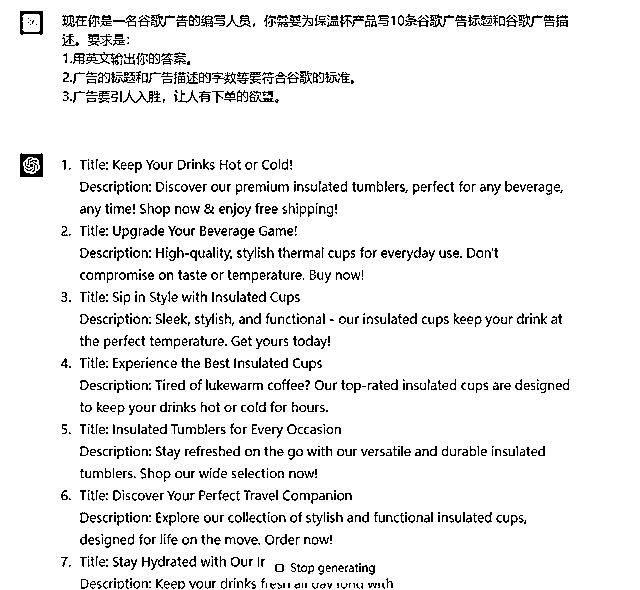
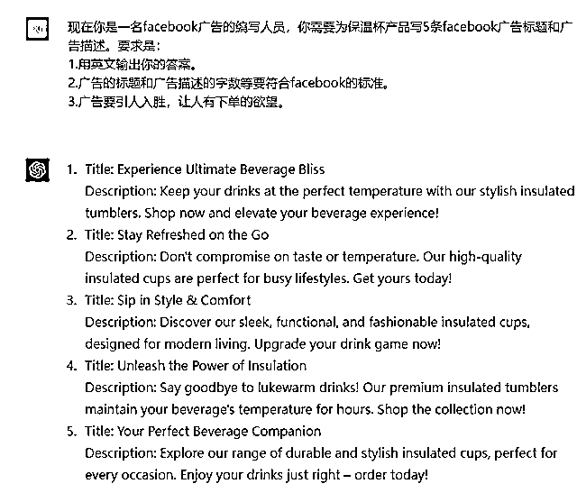
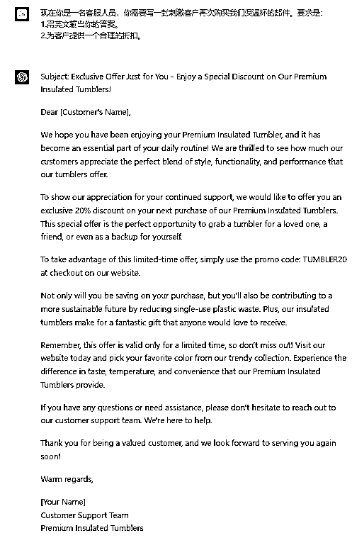
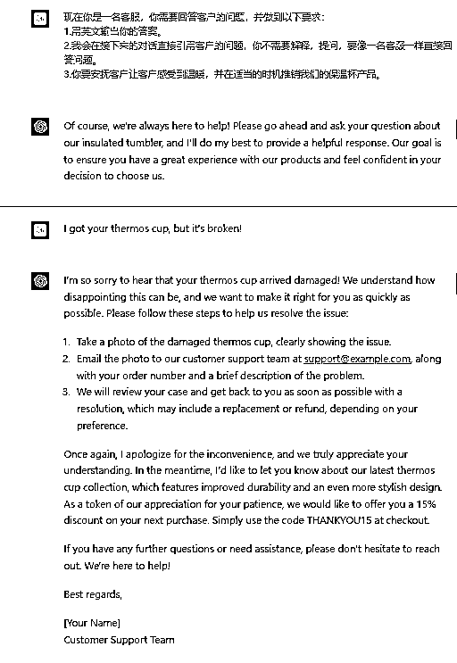
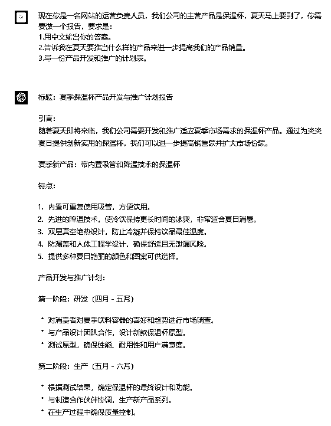

# 《跨境电商领域的 ChatGPT 应用指南 v1.0 》

> 原文：[`www.yuque.com/for_lazy/thfiu8/fxitvvex94xpryr4`](https://www.yuque.com/for_lazy/thfiu8/fxitvvex94xpryr4)

<ne-h2 id="62440577" data-lake-id="62440577"><ne-heading-ext><ne-heading-anchor></ne-heading-anchor><ne-heading-fold></ne-heading-fold></ne-heading-ext><ne-heading-content><ne-text id="u214fb38e">(58 赞)《跨境电商领域的 ChatGPT 应用指南 v1.0 》</ne-text></ne-heading-content></ne-h2> <ne-p id="u0204fa5e" data-lake-id="u0204fa5e"><ne-text id="u70d3c3d9">作者： 希声。</ne-text></ne-p> <ne-p id="uef2ba89b" data-lake-id="uef2ba89b"><ne-text id="u022dbea8">日期：2023-03-23</ne-text></ne-p> <ne-p id="u53c471f0" data-lake-id="u53c471f0"><ne-text id="uf3c32a0c">这是一篇随性写的文章，因为还没做系统的整理，想到哪写到哪，作为第一个版本先发布，如果大家喜欢，后续会继续更新。</ne-text></ne-p> <ne-h1 id="845a946e" data-lake-id="845a946e"><ne-heading-ext><ne-heading-anchor></ne-heading-anchor><ne-heading-fold></ne-heading-fold></ne-heading-ext><ne-heading-content><ne-text id="u0cec58f8" ne-bold="true">1.写谷歌广告词。</ne-text></ne-heading-content></ne-h1> <ne-p id="u58eb9d14" data-lake-id="u58eb9d14"><ne-text id="u8dafa203">提示词：</ne-text></ne-p> <ne-p id="u72a46529" data-lake-id="u72a46529"><ne-text id="u6e29524f">现在你是一名谷歌广告的编写人员，你需要为 xxx 产品写 10 条谷歌广告标题和谷歌广告描述。要求是：</ne-text></ne-p> <ne-p id="u0628d7d5" data-lake-id="u0628d7d5"><ne-text id="u487fa36a">1.用英文输出你的答案。</ne-text></ne-p> <ne-p id="ubd154c8e" data-lake-id="ubd154c8e"><ne-text id="u4bd678f8">2.广告的标题和广告描述的字数等要符合谷歌的标准。</ne-text></ne-p> <ne-p id="ua1a9305b" data-lake-id="ua1a9305b"><ne-text id="u0a75ac6d">3.广告要引人入胜，让人有下单的欲望。</ne-text></ne-p> <ne-p id="uc90ba02f" data-lake-id="uc90ba02f"><ne-card data-card-name="image" data-card-type="inline" id="zGf8h" data-event-boundary="card"></ne-card></ne-p> <ne-h1 id="7683e860" data-lake-id="7683e860"><ne-heading-ext><ne-heading-anchor></ne-heading-anchor><ne-heading-fold></ne-heading-fold></ne-heading-ext><ne-heading-content><ne-text id="ueb7af482" ne-bold="true">2.写 facebook 广告词</ne-text></ne-heading-content></ne-h1> <ne-p id="ub5a8b647" data-lake-id="ub5a8b647"><ne-text id="u7a3096db">提示词：</ne-text></ne-p> <ne-p id="udb8990c8" data-lake-id="udb8990c8"><ne-text id="u07f9d98b">现在你是一名 facebook 广告的编写人员，你需要为 xxx 产品写 10 条 facebook 广告标题和广告描述。要求是：</ne-text></ne-p> <ne-p id="u6b4d128d" data-lake-id="u6b4d128d"><ne-text id="ue65df568">1.用英文输出你的答案。</ne-text></ne-p> <ne-p id="uf933f07e" data-lake-id="uf933f07e"><ne-text id="u9f311492">2.广告的标题和广告描述的字数等要符合 facebook 的标准。</ne-text></ne-p> <ne-p id="u597288bf" data-lake-id="u597288bf"><ne-text id="ud7b15dae">3.广告要引人入胜，让人有下单的欲望。</ne-text></ne-p> <ne-p id="uba9f1bef" data-lake-id="uba9f1bef"><ne-card data-card-name="image" data-card-type="inline" id="Zrbgy" data-event-boundary="card"></ne-card></ne-p> <ne-h1 id="c83df36d" data-lake-id="c83df36d"><ne-heading-ext><ne-heading-anchor></ne-heading-anchor><ne-heading-fold></ne-heading-fold></ne-heading-ext><ne-heading-content><ne-text id="ua277f124" ne-bold="true">3.写贴文</ne-text></ne-heading-content></ne-h1> <ne-p id="u85ff11a6" data-lake-id="u85ff11a6"><ne-text id="u0198fd00" style="color: rgb(51, 51, 51);">提示词：</ne-text></ne-p> <ne-p id="udf9aa924" data-lake-id="udf9aa924"><ne-text id="u675c7605">现在你是一名社媒运营人员，你需要为 xxx 产品写 5 条在 Instagram 上推广的帖子。要求是：</ne-text></ne-p> <ne-p id="u0b8dd400" data-lake-id="u0b8dd400"><ne-text id="uf4c9bfc9">1.用英文输出你的答案。</ne-text></ne-p> <ne-p id="ufd63472e" data-lake-id="ufd63472e"><ne-text id="u787efd7f">2.贴文最后要带上该产品的的相关关键词，用#关键词# 这种格式输出。。</ne-text></ne-p> <ne-p id="u5808fc74" data-lake-id="u5808fc74"><ne-text id="u133cd869">3.贴文内容要丰富，适当带有 emoji 图案。</ne-text></ne-p> <ne-p id="u36366d8e" data-lake-id="u36366d8e"><ne-card data-card-name="image" data-card-type="inline" id="yUbma" data-event-boundary="card"></ne-card></ne-p> <ne-h1 id="643cf5d0" data-lake-id="643cf5d0"><ne-heading-ext><ne-heading-anchor></ne-heading-anchor><ne-heading-fold></ne-heading-fold></ne-heading-ext><ne-heading-content><ne-text id="ua0389e6a" ne-bold="true">4.回答 Quora 问题</ne-text></ne-heading-content></ne-h1> <ne-p id="u28c0027e" data-lake-id="u28c0027e"><ne-text id="u24154675" style="color: rgb(51, 51, 51);">提示词：</ne-text></ne-p> <ne-p id="u0a4872b7" data-lake-id="u0a4872b7"><ne-text id="u0e37567d">现在你是一名文字工作者，你需要为“xxxx”这个问题编写答案。要求是：</ne-text></ne-p> <ne-p id="u2826ae36" data-lake-id="u2826ae36"><ne-text id="u4e12fea6">1.用英文输出你的答案。</ne-text></ne-p> <ne-p id="ua395d305" data-lake-id="ua395d305"><ne-text id="ud7194a2f">2.字数在 800 字以上。</ne-text></ne-p> <ne-p id="u3223c217" data-lake-id="u3223c217"><ne-text id="ubd75eae6">3.文章结构清晰，要有大小标题。</ne-text></ne-p> <ne-p id="udd4847f7" data-lake-id="udd4847f7"><ne-card data-card-name="image" data-card-type="inline" id="myWWw" data-event-boundary="card"></ne-card></ne-p> <ne-h1 id="f98c7a42" data-lake-id="f98c7a42"><ne-heading-ext><ne-heading-anchor></ne-heading-anchor><ne-heading-fold></ne-heading-fold></ne-heading-ext><ne-heading-content><ne-text id="ud62481bd" ne-bold="true">5.写文章框架</ne-text></ne-heading-content></ne-h1> <ne-p id="u8cabc778" data-lake-id="u8cabc778"><ne-text id="udb9a0691">现在你是一名文字工作者，你需要以“xxxx”这个为主题写出一篇文章的大纲。要求是：</ne-text></ne-p> <ne-p id="ud5e3c7cf" data-lake-id="ud5e3c7cf"><ne-text id="u60c32ad2">1.用英文输出你的答案。</ne-text></ne-p> <ne-p id="u766ff31f" data-lake-id="u766ff31f"><ne-text id="u119d01c8">2.要有方法论，有数据，有发展过程。</ne-text></ne-p> <ne-p id="u0113ae03" data-lake-id="u0113ae03"><ne-card data-card-name="image" data-card-type="inline" id="mpfRH" data-event-boundary="card"></ne-card></ne-p> <ne-h1 id="05397c7f" data-lake-id="05397c7f"><ne-heading-ext><ne-heading-anchor></ne-heading-anchor><ne-heading-fold></ne-heading-fold></ne-heading-ext><ne-heading-content><ne-text id="u496b3d8d" ne-bold="true">6.写亚马逊的产品描述</ne-text></ne-heading-content></ne-h1> <ne-p id="u5d303dc2" data-lake-id="u5d303dc2"><ne-text id="u8970174a">现在你是一名亚马逊的电商运营，你需要为“xxxx”这个产品写出一篇适用于亚马逊平台的产品描述。要求是：</ne-text></ne-p> <ne-p id="ua7280cea" data-lake-id="ua7280cea"><ne-text id="ub39cbf19">1.用英文输出你的答案。</ne-text></ne-p> <ne-p id="u71fbe4af" data-lake-id="u71fbe4af"><ne-text id="udf5996b2">2.想出 5 个独一无二的卖点，要在产品描述中提现出来。</ne-text></ne-p> <ne-p id="u12e3d836" data-lake-id="u12e3d836"><ne-card data-card-name="image" data-card-type="inline" id="LsJW7" data-event-boundary="card"></ne-card></ne-p> <ne-h1 id="6e3936ac" data-lake-id="6e3936ac"><ne-heading-ext><ne-heading-anchor></ne-heading-anchor><ne-heading-fold></ne-heading-fold></ne-heading-ext><ne-heading-content><ne-text id="u81028f7f" ne-bold="true">7.回复邮件</ne-text></ne-heading-content></ne-h1> <ne-p id="u903b84b8" data-lake-id="u903b84b8"><ne-text id="u6bde945d">现在你是一名客服人员，你需要写一封刺激客户再次购买我们 xx 产品的邮件。要求是：</ne-text></ne-p> <ne-p id="u13820890" data-lake-id="u13820890"><ne-text id="ub35f7ca2">1.用英文输出你的答案。</ne-text></ne-p> <ne-p id="u7121d76b" data-lake-id="u7121d76b"><ne-text id="u38246252">2.为客户提供一个合理的折扣。</ne-text></ne-p> <ne-p id="u7f488308" data-lake-id="u7f488308"><ne-card data-card-name="image" data-card-type="inline" id="lySnA" data-event-boundary="card"></ne-card></ne-p> <ne-h1 id="c09d256a" data-lake-id="c09d256a"><ne-heading-ext><ne-heading-anchor></ne-heading-anchor><ne-heading-fold></ne-heading-fold></ne-heading-ext><ne-heading-content><ne-text id="u256cc0ab" ne-bold="true">8.客服的常用回复知识库</ne-text></ne-heading-content></ne-h1> <ne-p id="ua048c63b" data-lake-id="ua048c63b"><ne-text id="u8e98a007">现在你是一名客服，你需要回答客户的问题，并做到以下要求：</ne-text></ne-p> <ne-p id="u669f2c0a" data-lake-id="u669f2c0a"><ne-text id="u98f880dd">1.用英文输出你的答案。</ne-text></ne-p> <ne-p id="ue03c8b4d" data-lake-id="ue03c8b4d"><ne-text id="u168508ac">2.我会在接下来的对话直接引用客户的问题，你不需要解释，提问，要像一名客服一样直接回答问题。</ne-text></ne-p> <ne-p id="udc8137ac" data-lake-id="udc8137ac"><ne-text id="ue82de693">3.你要安抚客户让客户感受到温暖，并在适当的时机推销我们的 xx 产品。</ne-text></ne-p> <ne-p id="uc89f4584" data-lake-id="uc89f4584"><ne-card data-card-name="image" data-card-type="inline" id="JcqQa" data-event-boundary="card"></ne-card></ne-p> <ne-p id="ube5851d9" data-lake-id="ube5851d9"><ne-card data-card-name="image" data-card-type="inline" id="bGgJb" data-event-boundary="card"></ne-card></ne-p> <ne-h1 id="02e6c394" data-lake-id="02e6c394"><ne-heading-ext><ne-heading-anchor></ne-heading-anchor><ne-heading-fold></ne-heading-fold></ne-heading-ext><ne-heading-content><ne-text id="u7879a841" ne-bold="true">9.选品建议、产品规划</ne-text></ne-heading-content></ne-h1> <ne-p id="u5c2af4da" data-lake-id="u5c2af4da"><ne-text id="ua3188eb1">现在你是一名网站的运营负责人员，我们公司的主营产品是 xxx，夏天马上要到了，你需要做一个报告，要求是：</ne-text></ne-p> <ne-p id="ubcae629d" data-lake-id="ubcae629d"><ne-text id="u07d30d5c">1.用中文输出你的答案。</ne-text></ne-p> <ne-p id="udd7b3ff1" data-lake-id="udd7b3ff1"><ne-text id="ucdfd5891">2.告诉我在夏天要推出什么样的产品来进一步提高我们的产品销量。</ne-text></ne-p> <ne-p id="u0aa59cf3" data-lake-id="u0aa59cf3"><ne-text id="u8af72e41">3.写一份产品开发和推广的计划表。</ne-text></ne-p> <ne-p id="u51f701f0" data-lake-id="u51f701f0"><ne-card data-card-name="image" data-card-type="inline" id="OhExK" data-event-boundary="card"></ne-card></ne-p> <ne-p id="ud78644cd" data-lake-id="ud78644cd"><ne-card data-card-name="image" data-card-type="inline" id="EIQkV" data-event-boundary="card"></ne-card></ne-p> <ne-p id="u0630b6f3" data-lake-id="u0630b6f3"><ne-text id="u688eb8e8">暂时先写这些了。</ne-text></ne-p> <ne-p id="u545c0e99" data-lake-id="u545c0e99"><ne-text id="u217c3305">不知道对你有没有启发和帮助？</ne-text></ne-p> <ne-hole id="ue497685e" data-lake-id="ue497685e"><ne-card data-card-name="hr" data-card-type="block" id="lz3SY" data-event-boundary="card"><ne-p id="ube162062" data-lake-id="ube162062"><ne-text id="u12dc29c4">评论区：</ne-text></ne-p> <ne-p id="u83a0cb36" data-lake-id="u83a0cb36"><ne-text id="ud8ea37d9">Cora : [呲牙]我也是用它来帮忙写谷歌广告语</ne-text> <ne-text id="u61f05aa6">秋刀鱼哥 : 有用</ne-text> <ne-text id="uaef71dd9">希声。 : 666[呲牙]</ne-text> <ne-text id="u20a2e797">希声。 : [太阳]</ne-text> <ne-text id="ubaa18d17">shijinzhan : 强啊</ne-text> <ne-text id="u4b4b8cac">Adam : 居然还会选品，6</ne-text> <ne-text id="ucb666446">永哥 : 很棒！</ne-text> <ne-text id="u37ebe2c5">Adam : [强]</ne-text></ne-p></ne-card></ne-hole>