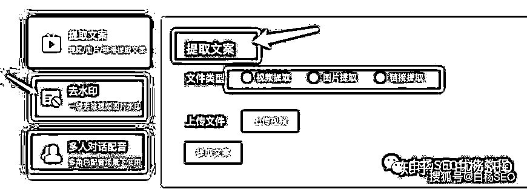
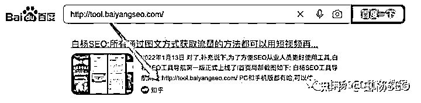
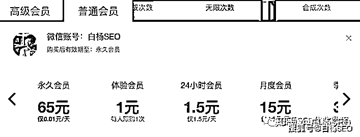
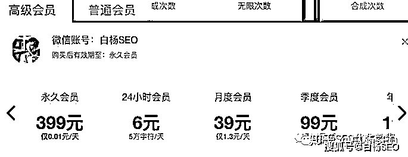
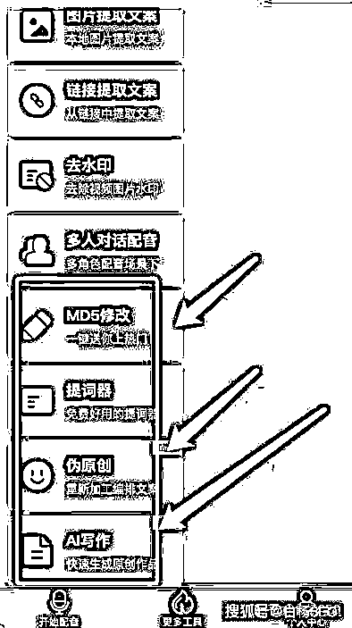
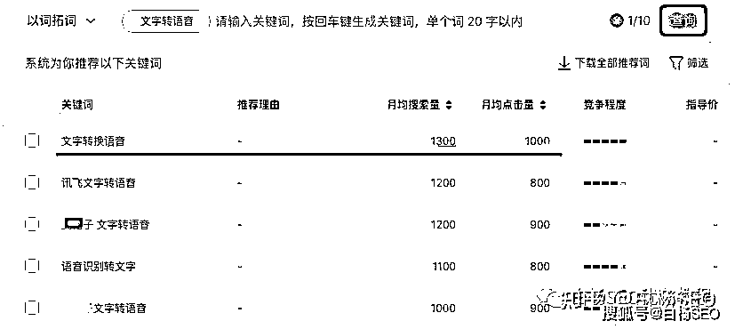

# 《简单拆解文字转语音这类 AI 配音工具产品怎么推广和变现的？ 》

> 原文：[`www.yuque.com/for_lazy/thfiu8/akzpku895qqowzp6`](https://www.yuque.com/for_lazy/thfiu8/akzpku895qqowzp6)

<ne-h2 id="5a0282d8" data-lake-id="5a0282d8"><ne-heading-ext><ne-heading-anchor></ne-heading-anchor><ne-heading-fold></ne-heading-fold></ne-heading-ext><ne-heading-content><ne-text id="ua780ba6f">(24 赞)《简单拆解文字转语音这类 AI 配音工具产品怎么推广和变现的？ 》</ne-text></ne-heading-content></ne-h2> <ne-p id="u97c970a2" data-lake-id="u97c970a2"><ne-text id="udc374682">作者： 白杨 SEO</ne-text></ne-p> <ne-p id="u58ad4f50" data-lake-id="u58ad4f50"><ne-text id="ubdce95bd">日期：2023-03-23</ne-text></ne-p> <ne-p id="u90f6fadc" data-lake-id="u90f6fadc"><ne-card data-card-name="image" data-card-type="inline" id="IeMMF" data-event-boundary="card">  <ne-p id="u377b4516" data-lake-id="u377b4516"><ne-text id="u822dfeb8">本文大纲：</ne-text></ne-p> <ne-p id="u18299241" data-lake-id="u18299241"><ne-text id="ufcf1262a">1、文字转语音的 AI 配音项目是什么？</ne-text></ne-p> <ne-p id="u76e096df" data-lake-id="u76e096df"><ne-text id="u87407134">2、AI 配音为什么是刚需？产品形式有哪些？</ne-text></ne-p> <ne-p id="uff7ae89f" data-lake-id="uff7ae89f"><ne-text id="u3a94ee93">3、AI 配音项目一般如何推广？</ne-text></ne-p> <ne-p id="u10435921" data-lake-id="u10435921"><ne-text id="u8e864d94">4、AI 配音项目一般变现方式有哪些？</ne-text></ne-p> <ne-p id="u2035e9c7" data-lake-id="u2035e9c7"><ne-text id="u55e4eb62" ne-bold="true">文字转语音的 AI 配音项目是什么？</ne-text></ne-p> <ne-p id="u8771f92e" data-lake-id="u8771f92e"><ne-text id="ufeda2157">文字转语音的 AI 配音项目是什么呢？简单理解就是一个可以输入文字转变成语音的工具（如下图），而这个工具当有人需要时，就产生了商业价值，也就可以理解成是一个项目了。</ne-text></ne-p> <ne-p id="udfc5ffec" data-lake-id="udfc5ffec"><ne-card data-card-name="image" data-card-type="inline" id="D5J0O" data-event-boundary="card">  <ne-p id="u16afcf3a" data-lake-id="u16afcf3a"><ne-text id="ubc51660f">AI 配音为什么是刚需？它的产品形式有哪些？</ne-text></ne-p> <ne-p id="u9b4baef0" data-lake-id="u9b4baef0"><ne-text id="u8aad01cc">AI 配音为什么是刚需？在白杨 SEO 看来主要有三个原因：</ne-text></ne-p> <ne-p id="ua6a01f75" data-lake-id="ua6a01f75"><ne-text id="ubd0da332">1、因为 AI 配音其实是属于 2C（个人消费）业务，人口基数大，市场就大；</ne-text></ne-p> <ne-p id="u70a4e7c0" data-lake-id="u70a4e7c0"><ne-text id="u47dd2f83">2、AI 配音类的工具解决了很多人认为自己声音不好听的缺点，但又想以配音来发祝福或者做推广；</ne-text></ne-p> <ne-p id="u1730ea66" data-lake-id="u1730ea66"><ne-text id="u428fe0fd">3、AI 配音本身不只有 AI 配音功能，还包含其它一起功能，所以他可能是为了视频提取文字或者去图片或视频水印会使用，举例某 AI 配音搭配。如图：</ne-text></ne-p> <ne-p id="u773f0499" data-lake-id="u773f0499"><ne-card data-card-name="image" data-card-type="inline" id="CIu64" data-event-boundary="card">  <ne-p id="u96cd81ac" data-lake-id="u96cd81ac"><ne-text id="u261b4d09">你可能会说，AI 配音或者图片视频提取文案之类不是免费的吗？是有一些免费的工具，但免费没有付费体验好。或者免费都是有数量限制，参考如图：</ne-text></ne-p> <ne-p id="uead238d1" data-lake-id="uead238d1"><ne-card data-card-name="image" data-card-type="inline" id="PZ7cR" data-event-boundary="card">  <ne-p id="u65c638cb" data-lake-id="u65c638cb"><ne-text id="ue510f008" ne-bold="true">AI 配音类产品形式有哪些？</ne-text></ne-p> <ne-p id="u5bc70b94" data-lake-id="u5bc70b94"><ne-text id="u1815a773">AI 配配音类产品形式，最主要就是小程序 和 网站网页。小程序呢，主要是微信小程序（当然也有人去做百度小程序、支付宝小程序 QQ 小程序和抖音小程序等工具产品）。</ne-text></ne-p> <ne-p id="ufbda5e53" data-lake-id="ufbda5e53"><ne-text id="u13ef9b93">为什么用小程序、尤其微信小程序最多呢？因为用户在微信上是最多的，也最方便用的。现在人在电脑面前，除了上班，其余时间都在手机上，在手机上，除了抖音就是微信为主。</ne-text></ne-p> <ne-p id="u5c1eb36b" data-lake-id="u5c1eb36b"><ne-text id="ubb9b37ca" ne-bold="true">AI 配音项目一般如何推广？</ne-text></ne-p> <ne-p id="u9f5631f0" data-lake-id="u9f5631f0"><ne-text id="ue89d8e2e">上面我们说完了 AI 配音项目的工具一般形式就是小程序或网站，那么如何推广小程序或者网站呢？</ne-text></ne-p> <ne-p id="uf935a61f" data-lake-id="uf935a61f"><ne-text id="u15838ab6">先说大家知道白杨 SEO 做了 13 年还在做的百度 SEO 的网站 SEO 推广方式。</ne-text></ne-p> <ne-p id="u9f7b20ab" data-lake-id="u9f7b20ab"><ne-text id="ucde05bab">如果是网站的话，现在推广比较难了，尤其工具类网站。因为工具类的网站本身内容不够多，所以想要靠内容提高权重从而提升排名获取流量很难，但还是有一些方法。</ne-text></ne-p> <ne-p id="u02705169" data-lake-id="u02705169"><ne-text id="u71046cde">1、工具网站先要基础 SEO 完成，让网站被百度收录。比如我这个学员的没有收录，我的另一个 SEO 工具导航收录，如图：</ne-text></ne-p> <ne-p id="u6f8256ac" data-lake-id="u6f8256ac"><ne-card data-card-name="image" data-card-type="inline" id="luYzO" data-event-boundary="card">  <ne-p id="ud8675dba" data-lake-id="ud8675dba"><ne-card data-card-name="image" data-card-type="inline" id="fg214" data-event-boundary="card">  <ne-p id="u718a5089" data-lake-id="u718a5089"><ne-text id="uee0d05ce">2、给工具网站更丰富内容规划，其实是可以布局更多的内容的，比如工具相关使用文档与技巧，都能有大量内容，实在不行，还可以借用 CHATGPT 来生成内容呢。</ne-text></ne-p> <ne-p id="u01499e7d" data-lake-id="u01499e7d"><ne-text id="u3d04d76d">3、给工具网站进行外链建设，主要就是换一些友情链接以及做一些外推。</ne-text></ne-p> <ne-p id="u883a1803" data-lake-id="u883a1803"><ne-card data-card-name="image" data-card-type="inline" id="SzT50" data-event-boundary="card">  <ne-p id="u97b8fa3f" data-lake-id="u97b8fa3f"><ne-text id="u78904b60" ne-bold="true">微信小程序怎么推广呢？</ne-text></ne-p> <ne-p id="u41ca2957" data-lake-id="u41ca2957"><ne-text id="u1602b086">微信小程序推广，我在之前这篇《白杨 SEO：一文告诉你 16 条微信小程序推广渠道大全，实操举例【干货】》里写了 16 种方法，没看过可以再去搜索看看，这里再简单说下 3 个方式：</ne-text></ne-p> <ne-p id="uafb07344" data-lake-id="uafb07344"><ne-text id="u0a7d52e8">1、小程序名字矩阵。大家知道，现在微信小程序里的内容很难在搜一搜里收录，早期除外。所以现在你要去获取微信搜一搜的流量，主要就是账号排名，唯一能做的就是做多个小程序，用名字来获取流量。</ne-text></ne-p> <ne-p id="u424d78c4" data-lake-id="u424d78c4"><ne-text id="u6540906e">多个，你以为注册 10 个算多吗？昨天跟一个朋友聊，他们小程序有几百上千个，日活近 100 万。你呢，至少要准备三五十个，积少成多，懂得都懂，小程序可以导小程序流量。</ne-text></ne-p> <ne-p id="u68d898f2" data-lake-id="u68d898f2"><ne-text id="u8a2690d1">2、公众号推广。这个同学，技术出身的，学会了选关键词注册公众号，以及布局长尾关键词在文章里获取搜一搜的精准搜索流量，如图：</ne-text></ne-p> <ne-p id="u5edabd06" data-lake-id="u5edabd06"><ne-card data-card-name="image" data-card-type="inline" id="Ageog" data-event-boundary="card">  <ne-p id="u5c276a12" data-lake-id="u5c276a12"><ne-text id="u07b3b615">很多人其实忽略了搜一搜的里精准搜索流量，只要你能找到好的词，或者蓝海词，用账号名字方式也能获取搜索流量。再比如，也可以发公众号文章获取搜索流量的方式来推广小程序。</ne-text></ne-p> <ne-p id="uc2eded95" data-lake-id="uc2eded95"><ne-text id="u9a6d1b4e" style="color: rgb(204, 0, 0);">其实除了公众号推广外，还可以用视频号推广小程序。方法就是把小程序放在公众号文章里，视频号挂公众号链接即可。</ne-text></ne-p> <ne-p id="u3f67db7f" data-lake-id="u3f67db7f"><ne-text id="uf281c9b4">3、小程序本身裂变。其实这种工具本身一般都会设计邀请返现，这样让用户邀请用户的方式，这是所有工具都在用的方法（套路），很正常的，你要推是不是也可以用呢？</ne-text></ne-p> <ne-p id="u198ac43e" data-lake-id="u198ac43e"><ne-card data-card-name="image" data-card-type="inline" id="Is2Vg" data-event-boundary="card">  <ne-p id="u610f949d" data-lake-id="u610f949d"><ne-text id="u0b6abd91" ne-bold="true">AI 配音项目一般变现方式有哪些？</ne-text></ne-p> <ne-p id="u37b7fdc0" data-lake-id="u37b7fdc0"><ne-text id="u191bb611">AI 配音工具项目本身变现方式最主要就是售卖会员模式，无非就是会员分普通用户和高级用户。如下图：</ne-text></ne-p> <ne-p id="u73128bdf" data-lake-id="u73128bdf"><ne-card data-card-name="image" data-card-type="inline" id="nY29r" data-event-boundary="card">  <ne-p id="u660f078d" data-lake-id="u660f078d"><ne-card data-card-name="image" data-card-type="inline" id="jfJwR" data-event-boundary="card">  <ne-p id="u02315498" data-lake-id="u02315498"><ne-text id="u46b2ce8a">当然，在微信小程序上，只要这个小程序用户多了，其实还可以有其它项目，因为这个同学是技术出身，有团队做这个，所以他们产品蛮多的，还有 AI 写作，AI 伪原创等等，如图：</ne-text></ne-p> <ne-p id="u3df4b418" data-lake-id="u3df4b418"><ne-card data-card-name="image" data-card-type="inline" id="IEeea" data-event-boundary="card">  <ne-p id="u938c44d1" data-lake-id="u938c44d1"><ne-text id="ue8e4fcbe">你可能会说：白杨 SEO，这个工具好像没什么难的，我也可以做？</ne-text></ne-p> <ne-p id="u487ad2ee" data-lake-id="u487ad2ee"><ne-text id="u964d6480">是啊，如果说技术，这真不是高精尖，不然现在也不会有这么多竞争了。难点是你懂不懂推广呢？或者你能不能找到 0-1 种子用户呢？你找不找得到你这个产品在搜一搜的蓝海词呢？</ne-text></ne-p> <ne-p id="u5cc9b5a2" data-lake-id="u5cc9b5a2"><ne-card data-card-name="image" data-card-type="inline" id="ARWim" data-event-boundary="card">  <ne-p id="uea780317" data-lake-id="uea780317"><ne-card data-card-name="image" data-card-type="inline" id="FJZhj" data-event-boundary="card"><ne-text id="u03127646" style="color: rgb(145, 145, 145);">这个截图来自腾讯广告官方后台搜一搜数据</ne-text>  <ne-p id="u5fc4316a" data-lake-id="u5fc4316a"><ne-text id="ucdcd826e" style="color: rgb(145, 145, 145);">关于腾讯广告搜一搜这个文章我之前在生财分享过一篇，不过目前必要开户才能用搜一搜功能，我的是我一个学员账号借我用的，他们都是在之前注册的，个人可以免费用，所以拿到搜一搜官方数据很重要。</ne-text></ne-p> <ne-p id="uebf8ac62" data-lake-id="uebf8ac62"><ne-text id="u723d3c4a">作者简介：</ne-text></ne-p> <ne-p id="u2ee01666" data-lake-id="u2ee01666"><ne-text id="ud11b7980">白杨 SEO，专注 SEO 十年，SEO 流量实战派，对全网精准搜索流量有深入研究。</ne-text></ne-p> <ne-hole id="u3c61e3ff" data-lake-id="u3c61e3ff"><ne-card data-card-name="hr" data-card-type="block" id="Ol14c" data-event-boundary="card"><ne-p id="u5b32a70b" data-lake-id="u5b32a70b"><ne-text id="u67f78870">评论区：</ne-text></ne-p> <ne-p id="u4c837567" data-lake-id="u4c837567"><ne-text id="u7f576cd2">施霖终生学习者-链接 : 我有几个终身软件，APP，小程序都有，确实丝滑，还能快速配音，文字转语音，双向切换</ne-text> <ne-text id="u77ab423c">白杨 SEO : 嗯</ne-text> <ne-text id="u32db34a1">执着的启明星 : 对于个人来说，注册好几十公众号，太难，现在一个手机号只能管理知道公众号</ne-text> <ne-text id="uc5b973f4">皇冠一刻钟 : 这类小程序 有没有开放接口之类的 分佣返现 或者卖系统的</ne-text> <ne-text id="u2c9b7152">白杨 SEO : 分佣返现有，至于系统不太清楚，应该也有吧</ne-text></ne-p></ne-card></ne-hole></ne-card></ne-p></ne-card></ne-p></ne-card></ne-p></ne-card></ne-p></ne-card></ne-p></ne-card></ne-p></ne-card></ne-p></ne-card></ne-p></ne-card></ne-p></ne-card></ne-p></ne-card></ne-p></ne-card></ne-p></ne-card></ne-p></ne-card></ne-p>