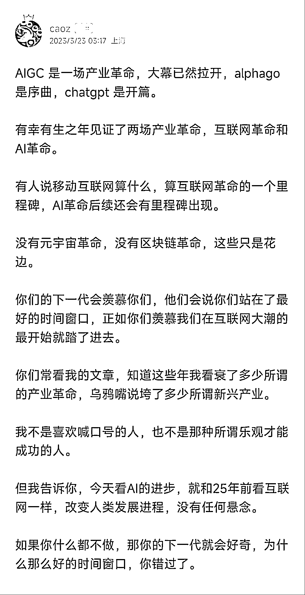

# 《给心急 AIGC 但却感觉无法搭车的同学们的一点思路》

> 原文：[`www.yuque.com/for_lazy/thfiu8/zr4vvnzg0q4xlrq9`](https://www.yuque.com/for_lazy/thfiu8/zr4vvnzg0q4xlrq9)

<ne-h2 id="e1a33ee8" data-lake-id="e1a33ee8"><ne-heading-ext><ne-heading-anchor></ne-heading-anchor><ne-heading-fold></ne-heading-fold></ne-heading-ext><ne-heading-content><ne-text id="u963a573d">(135 赞)《给心急 AIGC 但却感觉无法搭车的同学们的一点思路》</ne-text></ne-heading-content></ne-h2> <ne-p id="u135e8b9c" data-lake-id="u135e8b9c"><ne-text id="u4c423552">作者： 枫叶</ne-text></ne-p> <ne-p id="u138b636e" data-lake-id="u138b636e"><ne-text id="ud3aef438">日期：2023-03-24</ne-text></ne-p> <ne-p id="u41ba20cc" data-lake-id="u41ba20cc"><ne-text id="u4b6fe3c4">给心急 AIGC，但却感觉无法搭车的同学们的一点思路。</ne-text></ne-p> <ne-p id="ua3859787" data-lake-id="ua3859787"><ne-text id="uff0d9650">我们一直觉得这波 AI 是一个浪潮，但是什么级别，不敢轻易定义。曹大的这篇文章直接给出结论了：比肩互联网！</ne-text></ne-p> <ne-p id="u538c77a5" data-lake-id="u538c77a5"><ne-text id="u424059c6">面对 AIGC 这一波浪潮，很多人都有点焦虑：面对宝山，却无处下啃！</ne-text></ne-p> <ne-p id="u0458bbfd" data-lake-id="u0458bbfd"><ne-text id="u298e1a2c">几乎每一次浪潮，都会引起类似的情况：一方面为无数钱途兴奋；另一方面却为自己无法搭上车而感到深深地焦虑。</ne-text></ne-p> <ne-p id="u1fad5b3b" data-lake-id="u1fad5b3b"><ne-text id="ud69538c7">我的建议是：结合你的实际工作需求，把这个 AI 工具先用起来！</ne-text></ne-p> <ne-p id="u391cce1d" data-lake-id="u391cce1d"><ne-text id="u57ceb231">比如我有一个朋友，他是老师，我问他：你现在最希望 AI 能帮你做什么？他说 AI 能帮做课件（每次为这个东西耗费无数时间还做不好，都形成拖延症了，严重影响情绪）。那这个需求就是"AI 辅助生成课件"。那我就建议他：那你先用 AI 帮你做课件。</ne-text></ne-p> <ne-p id="ue3958dfd" data-lake-id="ue3958dfd"><ne-text id="u34df742e">你自己学会怎么做，等你能顺利使用 AI 做课件的时候，"AI 辅助生成课件"这个能力至少有三个变现的途径：</ne-text></ne-p> <ne-p id="ufb0f1e71" data-lake-id="ufb0f1e71"><ne-text id="uf19e2eb1">1、你开发一个工具，“AI 辅助生成课件”的工具，网站或者小程序都行（不建议 app）。他问：大家都会用 chatgpt 了，会有人用吗？我就问他：你不学你会用吗？现在还无数人连注册 chatgpt 都还搞不定。</ne-text></ne-p> <ne-p id="u16c6940c" data-lake-id="u16c6940c"><ne-text id="u08a3124b">2、如果你觉得无法做出一个工具，那么你就自己帮别人做课件啊，既然没技术，那就做体力劳动者。以前没有 AI 辅助，也许你一天顶多能做一个课件，现在有了 AI 一天能做 20 个！这事简单，其实也不简单：怎么跟你客户确定需求（多次迭代打磨出最优最简洁的需求模板）；GPT 提示词 prompt 是大有学问的，好的 prompt 和差的 prompt 的成果天壤之别，这个 prompt 就是你的壁垒，护城河！这个 prompt 是熟能生巧的东西！</ne-text></ne-p> <ne-p id="u9c6a2522" data-lake-id="u9c6a2522"><ne-text id="u00d801be">3、你把你学习用 AI 做课件的整个过程，做成一个保姆级的教程（就是那种很多截图，每一步都详详细细的），然后你卖教程！</ne-text></ne-p> <ne-p id="ua6783c29" data-lake-id="ua6783c29"><ne-text id="u09edae0e">这三种方式其实都不太难，对吧，关键在于怎么卖？怎么卖，就是另外一个范畴的事情。这和有没有 AI 没关系，需要通过线上赚钱都必须懂这个。那就是找流量。</ne-text></ne-p> <ne-p id="u9230f83d" data-lake-id="u9230f83d"><ne-text id="u685d73cd">找流量有两种方式：</ne-text> <ne-text id="uad9680d9">1、付费买流量。任何一个流量平台都有付费渠道：百度有竞价、淘宝有直通车、腾讯有广点通、字节有巨量广告……</ne-text> <ne-text id="ucfc5a0c6">2、为各个流量平台做内容，免费引流：抖音、小红书、百家号、头条号、知乎……</ne-text></ne-p> <ne-p id="u21479ab7" data-lake-id="u21479ab7"><ne-text id="u755879e8">比如以上“AI 辅助生成课件”，你可以把你怎么用 AI 做课件的过程拍成短视频，写成小红书，上知乎，投百家号，付费或免费引流，这些内容都留下钩子（比如省略步骤，让人“一看就会一学就废”的那种，人家有需求但看不懂自然来找你），把客户引入私域——成交！</ne-text></ne-p> <ne-p id="ue7a0bb38" data-lake-id="ue7a0bb38"><ne-text id="u939343ad">经过这么一折腾，当你真的做成生意的时候，突然发现天地一片宽，真的是无物不可卖啊，AI 嘛也就是一个工具而已……</ne-text></ne-p> <ne-p id="u67dd4495" data-lake-id="u67dd4495"><ne-text id="u901e9faa">不要和 AI 拼怎么做，我们（人）的优势在于：做什么。理解了这一点，AI 再厉害也只能是你的工具。</ne-text><ne-card data-card-name="image" data-card-type="inline" id="NgUfC" data-event-boundary="card">  <ne-hole id="u81a93239" data-lake-id="u81a93239"><ne-card data-card-name="hr" data-card-type="block" id="MVpEe" data-event-boundary="card"><ne-p id="ube6568eb" data-lake-id="ube6568eb"><ne-text id="ued54d2aa">评论区：</ne-text></ne-p> <ne-p id="ubfbc68f7" data-lake-id="ubfbc68f7"><ne-text id="u53dc94ce">止风 : 分析的太好了[强]</ne-text> <ne-text id="u9c97fef5">离经叛道 : 非常棒的一篇文章</ne-text> <ne-text id="u390b3235">蛋蛋。 : 越早进局，越早获利</ne-text> <ne-text id="u915ee48b">唐杰(Jason) : 学习中</ne-text> <ne-text id="u7038dcdb">阿满 : 感谢分享出来</ne-text></ne-p></ne-card></ne-hole></ne-card></ne-p>