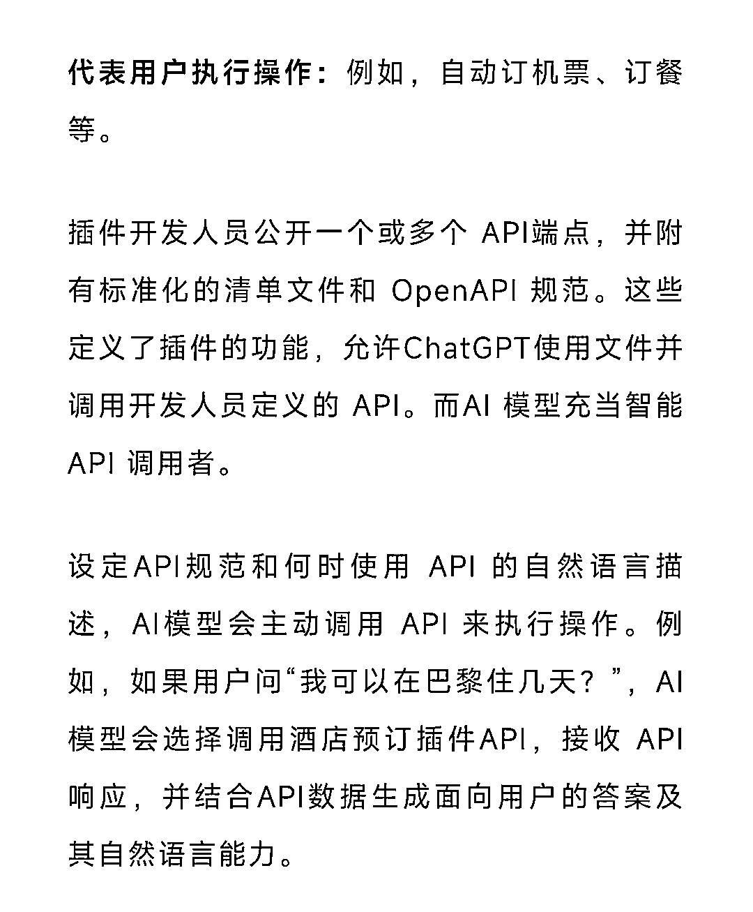

# 《ChatGPT 或将出现大量 SEO 机会》

> 原文：[`www.yuque.com/for_lazy/thfiu8/zdaoxhr7tuynzi12`](https://www.yuque.com/for_lazy/thfiu8/zdaoxhr7tuynzi12)

<ne-h2 id="44159eee" data-lake-id="44159eee"><ne-heading-ext><ne-heading-anchor></ne-heading-anchor><ne-heading-fold></ne-heading-fold></ne-heading-ext><ne-heading-content><ne-text id="u8853f3af">(47 赞)《ChatGPT 或将出现大量 SEO 机会》</ne-text></ne-heading-content></ne-h2> <ne-p id="ufd445a01" data-lake-id="ufd445a01"><ne-text id="ucd999fe0">作者： 创业者-云飞</ne-text></ne-p> <ne-p id="u006acefb" data-lake-id="u006acefb"><ne-text id="u6362ef62">日期：2023-03-24</ne-text></ne-p> <ne-p id="ua2f954c9" data-lake-id="ua2f954c9"><ne-text id="u29fcf827">【新洞察】ChatGPT 或将出现大量 SEO 机会</ne-text></ne-p> <ne-p id="uc705869b" data-lake-id="uc705869b"><ne-text id="uf94d4dfb">大家好，我是云飞。今早起床看到朋友圈大量关于 ChatGPT 开放插件的帖子（见下图）。认真读了一下，其中的一条信息引起了我的关注。</ne-text></ne-p> <ne-p id="u5c458d25" data-lake-id="u5c458d25"><ne-text id="u2700e247">目前，国内/国际 做个性化推荐非常不错的平台中，抖音/TikTok 算其中一家，它通过“兴趣推荐”和“用户搜索”来实现了很强的个性化推荐。</ne-text></ne-p> <ne-p id="u0a148a8f" data-lake-id="u0a148a8f"><ne-text id="u78561441">不过，ChatGPT 开放插件后，我认为将会出现更多的“类 SEO”机会，ChatGPT 和用户的交互行为目前主要就是？搜索！搜索！搜索！！！</ne-text></ne-p> <ne-p id="u1b5d9e84" data-lake-id="u1b5d9e84"><ne-text id="u06f90a7a">搜索意味着精准，精准意味着高转化，顺着互联网流量的逻辑，大家就知道后续了。相比而言，我认为它是升级版的抖音/TikTok，具有更强的个性化推荐能力。对此，我做了详细的阐述</ne-text>[<ne-text id="ubad9c5d2">https://c8xa9g10gh.feishu.cn/docx/IkKOdu4oloVj41xpQ60c333qnoh</ne-text>](https://c8xa9g10gh.feishu.cn/docx/IkKOdu4oloVj41xpQ60c333qnoh)<ne-card data-card-name="image" data-card-type="inline" id="l4cXx" data-event-boundary="card">  <ne-hole id="ueebe9e5e" data-lake-id="ueebe9e5e"><ne-card data-card-name="hr" data-card-type="block" id="YTYE1" data-event-boundary="card"><ne-p id="u07376211" data-lake-id="u07376211"><ne-text id="u7519f890">评论区：</ne-text></ne-p> <ne-p id="u803bec71" data-lake-id="u803bec71"><ne-text id="ua08a558e">D. : 经过训练，它现在已经成为我的个人助理。请教下具体怎么训练的？怎么成为你的助理的？</ne-text> <ne-text id="u7d0dd35a">张老师 : 依赖的结果就是对平台产生信任，而信任是商业的开始。[强][强]</ne-text> <ne-text id="u864d3a92">Yuti : 哥，我看了一下，NLP 之前以 RNN 为主要结构，GPT 是基于 transforer，不知道您推荐的这本书有没有过时呀。</ne-text> <ne-text id="u37744dba">创业者-云飞 : 你重点可以从第七章看</ne-text> <ne-text id="u83a19a02">创业者-云飞 : 就是把我工作中常需要跟文字打交道的一些工作梳理出来，然后逐个梳理出流程，转化成 prompt 格式，逐个就训练啊。</ne-text> <ne-text id="udb963984">我都是在本地部署的，如果没有编程基础的话，你可以在网页对话框里边调教。</ne-text> <ne-text id="udbebcc11">D. : 本地部署？gpt-3 模型本地部署？</ne-text> <ne-text id="u7c9b4822">创业者-云飞 : 3.5 啊</ne-text></ne-p></ne-card></ne-hole></ne-card></ne-p>