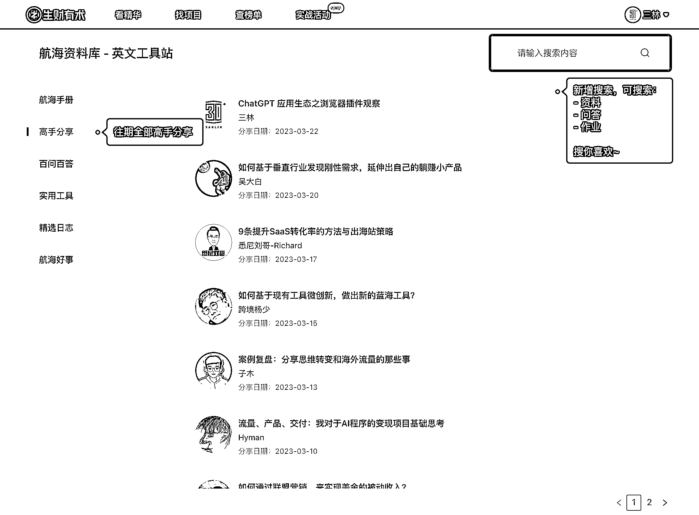
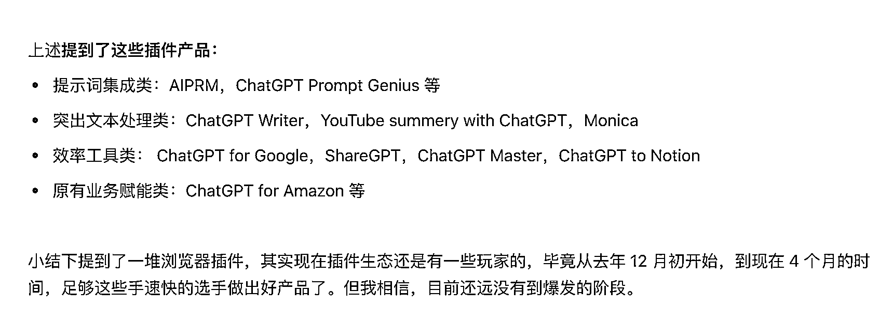

# 《ChatGPT 应用生态之浏览器插件观察》

> 原文：[`www.yuque.com/for_lazy/thfiu8/st2r1xgdml7y7v3h`](https://www.yuque.com/for_lazy/thfiu8/st2r1xgdml7y7v3h)

<ne-h2 id="3858dcba" data-lake-id="3858dcba"><ne-heading-ext><ne-heading-anchor></ne-heading-anchor><ne-heading-fold></ne-heading-fold></ne-heading-ext><ne-heading-content><ne-text id="u833cce81">(56 赞)《ChatGPT 应用生态之浏览器插件观察》</ne-text></ne-heading-content></ne-h2> <ne-p id="u3cc30610" data-lake-id="u3cc30610"><ne-text id="u21164eba">作者： 三林</ne-text></ne-p> <ne-p id="u431fa23b" data-lake-id="u431fa23b"><ne-text id="u9a37abe4">日期：2023-03-24</ne-text></ne-p> <ne-p id="u72bb912b" data-lake-id="u72bb912b"><ne-text id="u768b09d1">【ChatGPT 应用生态之浏览器插件观察】</ne-text></ne-p> <ne-p id="uf5440b6f" data-lake-id="uf5440b6f"><ne-text id="u08ae947f">大家好，我是三林，目前在生财有术团队担任产品经理，负责航海产品等。于本周三晚在『英文工具站』航海的群内分享。我来分享一些围绕 ChatGPT 而做的第三方浏览器插件产品，他们是如何做的产品定位和一些体验思考。</ne-text></ne-p> <ne-p id="u40fd0bb5" data-lake-id="u40fd0bb5"><ne-text id="ubaad240c">为什么说浏览器插件是一个合适的产品形态？ 因为 ChatGPT 官方是一个网页版，浏览器插件是对网页的 Enhance，在用户熟悉的场景下做的体验升级，贴合用户习惯，乐于使用。这弥补了原生产品的不足，相当于站在巨人肩膀上做事。</ne-text></ne-p> <ne-p id="uae46bf4c" data-lake-id="uae46bf4c"><ne-text id="ufb485547">本文提到了十来款浏览器插件，包括两大类：提示语模板类，和效率工具类（附图）</ne-text> <ne-text id="uf8a8845c">……</ne-text></ne-p> <ne-p id="ucd57dccc" data-lake-id="ucd57dccc"><ne-text id="u760175ad">总结，我从这些产品里我学到的认知：</ne-text></ne-p> <ne-p id="u85344c2d" data-lake-id="u85344c2d"><ne-text id="ua19e1689">1、从面向 Google 编程，到面向 ChatGPT 编程；相信开发者圈友们感受很深。</ne-text></ne-p> <ne-p id="u4a954752" data-lake-id="u4a954752"><ne-text id="udf21122c">2、ChatGPT 是魔法百宝箱，密码就是 Prompts，这是流量密码，也是财富密码。</ne-text></ne-p> <ne-p id="u405c7767" data-lake-id="u405c7767"><ne-text id="u59f27cb9">3、浏览器插件只是一种产品形态，开放了 API ，可能性就太多了。一句 Prompt 等于一个 Mini tool，一套 Prompts 等于一个 Mini SAAS；</ne-text></ne-p> <ne-p id="ufd22208e" data-lake-id="ufd22208e"><ne-text id="ucfc8f3ab">4、思考符合自己业务需求的场景，大胆用 ChatGPT 为自己和业务赋能；</ne-text></ne-p> <ne-p id="uefd3f6a6" data-lake-id="uefd3f6a6"><ne-text id="u19813839">5、最后也是最重要：鉴于原生体验、内容安全，建议创业者们出海，这也是我们做英文工具站的意义。</ne-text></ne-p> <ne-p id="u347d9391" data-lake-id="u347d9391"><ne-text id="u92a924f3">————</ne-text> <ne-text id="ua705b96b">注：这里的「插件」不是今天凌晨 ChatGPT 开放的插件能力 Plugins ，而是指以 Chrome 为主的浏览器插件。 新的插件 Plugins 波澜壮阔，我后续再写下一篇。</ne-text></ne-p> <ne-p id="u4a1a981d" data-lake-id="u4a1a981d"><ne-text id="uf456701e">阅读原文</ne-text></ne-p> <ne-p id="u7959d991" data-lake-id="u7959d991"><ne-text id="ud699139d">索引工具-高手分享</ne-text></ne-p> <ne-p id="ufc62f51f" data-lake-id="ufc62f51f"><ne-text id="ucadbedd6">飞书</ne-text> [<ne-text id="u2a9e7f1d">https://search01.shengcaiyoushu.com/docx/A27Md68WVox13FxPZFeczOVgnKc</ne-text>](https://search01.shengcaiyoushu.com/docx/A27Md68WVox13FxPZFeczOVgnKc)[<ne-text id="uc8ffca24">https://shengcaiyoushu01.feishu.cn/docx/A27Md68WVox13FxPZFeczOVgnKc</ne-text>](https://shengcaiyoushu01.feishu.cn/docx/A27Md68WVox13FxPZFeczOVgnKc)<ne-card data-card-name="image" data-card-type="inline" id="p2thx" data-event-boundary="card">  <ne-p id="u1aecd1fb" data-lake-id="u1aecd1fb"><ne-card data-card-name="image" data-card-type="inline" id="TEJ50" data-event-boundary="card">  <ne-hole id="ub51ae7ec" data-lake-id="ub51ae7ec"><ne-card data-card-name="hr" data-card-type="block" id="ppEHz" data-event-boundary="card"><ne-p id="uf3fdad4d" data-lake-id="uf3fdad4d"><ne-text id="u4d7c6f46">评论区：</ne-text></ne-p> <ne-p id="ua40da07c" data-lake-id="ua40da07c"><ne-text id="ue5608622">暂无评论</ne-text></ne-p></ne-card></ne-hole></ne-card></ne-p></ne-card></ne-p>