# 《视频号蓝海英文育儿书单带货一年累计粉丝 120W+，月人 2W+，我是怎么做到的？》

> 原文：[`www.yuque.com/for_lazy/thfiu8/ubqh6ibtqcevd1fv`](https://www.yuque.com/for_lazy/thfiu8/ubqh6ibtqcevd1fv)

<ne-h2 id="9ec34498" data-lake-id="9ec34498"><ne-heading-ext><ne-heading-anchor></ne-heading-anchor><ne-heading-fold></ne-heading-fold></ne-heading-ext><ne-heading-content><ne-text id="u090b2b46">(329 赞)《视频号蓝海英文育儿书单带货一年累计粉丝 120W+，月人 2W+，我是怎么做到的？》</ne-text></ne-heading-content></ne-h2> <ne-p id="ud2f2b18d" data-lake-id="ud2f2b18d"><ne-text id="u244258f6">作者： 秋海</ne-text></ne-p> <ne-p id="u23be842d" data-lake-id="u23be842d"><ne-text id="uf51cea47">日期：2023-03-24</ne-text></ne-p> <ne-p id="u2f68873b" data-lake-id="u2f68873b"><ne-text id="u011b6976">育儿号剪辑不知道大家有没有刷到过，做的多了就卷得一塌糊涂，育儿号混剪+英文就成了蓝海赛道，会点英文基础就可以加入</ne-text></ne-p> <ne-p id="u8174956b" data-lake-id="u8174956b"><ne-text id="u8ec2dd65">育儿号混剪+英文的形式具体说来就是将一些育儿专家视频英文化，把人物换成外国人，语言换成英文，然后模仿同行混剪视频获得流量，再利用流量视频带货。</ne-text></ne-p> <ne-p id="u0031ac90" data-lake-id="u0031ac90"><ne-card data-card-name="image" data-card-type="inline" id="wMEY5" data-event-boundary="card">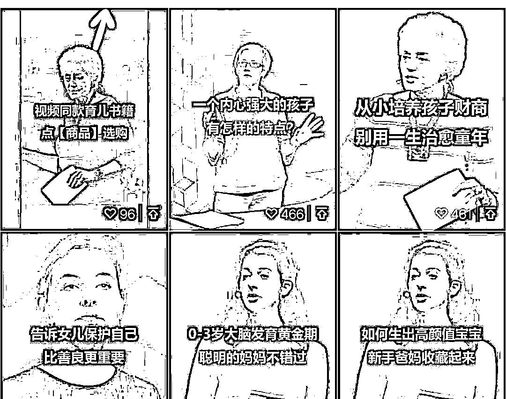  <ne-p id="ud30158d9" data-lake-id="ud30158d9"><ne-text id="ua24c4c26">为什么会把这个赛道称之为蓝海？英文育儿号目前在市场上和受众都比较广，单从形式上就更能吸引受众的兴趣，做视频混剪时原创多会高很多，流量来得快，侵权风险也会更小。</ne-text></ne-p> <ne-p id="u4da79ac0" data-lake-id="u4da79ac0"><ne-text id="u943b09ec">而且我做这个账号的模式也很简单，就是跟爆款，先模仿同行发爆款视频涨粉,流量起来之后再利用流量视频带货，具体如何操作，都在我接下来的文章里呈现了。</ne-text></ne-p> <ne-p id="u914a354a" data-lake-id="u914a354a"><ne-text id="u5654e9dd">大家好，我是秋海，目前在做视频号英文育儿书单带货。</ne-text></ne-p> <ne-p id="u13fabaa4" data-lake-id="u13fabaa4"><ne-text id="u7d6a0c07">去年四月份刷抖音，刷到一个用外国毕业生演讲片段卖育儿书的短视频，突然想到可以做英文育儿书单带货。当时，我正在做中老年女装视频带货，方式是跟爆款，模仿爆款视频，流量起来之后，开直播卖货。</ne-text></ne-p> <ne-p id="ud28d157f" data-lake-id="ud28d157f"><ne-text id="u660315e5">但这个方式在中老年女装上没有做起来，我就想把它迁移到英文育儿书单上面。因为去年视频号是个大风口，所以我就把主要精力放在视频号上。</ne-text></ne-p> <ne-p id="u65249e41" data-lake-id="u65249e41"><ne-text id="u944d58a7">这个模式做了将近一年，起了两个账号，累计粉丝突破 120w，每个月利润 1-2w 的</ne-text></ne-p> <ne-p id="u573742d4" data-lake-id="u573742d4"><ne-text id="u9aa49ff2">以下数据为成交金额，图书的佣金在 40%-60% 之间。</ne-text></ne-p> <ne-p id="ue636a45a" data-lake-id="ue636a45a"><ne-card data-card-name="image" data-card-type="inline" id="Ioohm" data-event-boundary="card">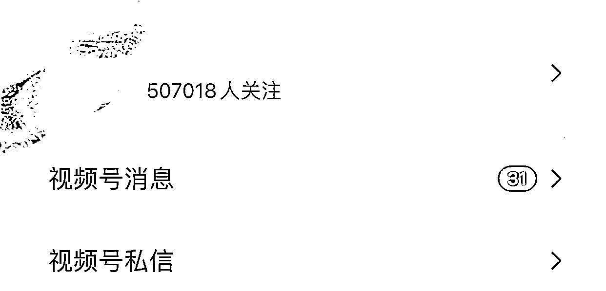  <ne-p id="ub6261c61" data-lake-id="ub6261c61"><ne-card data-card-name="image" data-card-type="inline" id="Fi3Ew" data-event-boundary="card">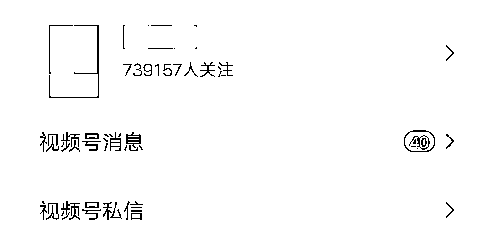  <ne-p id="u8069430b" data-lake-id="u8069430b"><ne-card data-card-name="image" data-card-type="inline" id="zLn9e" data-event-boundary="card">  <ne-p id="uf628fc36" data-lake-id="uf628fc36"><ne-card data-card-name="image" data-card-type="inline" id="kxpY8" data-event-boundary="card">  <ne-p id="uabcd79f5" data-lake-id="uabcd79f5"><ne-card data-card-name="image" data-card-type="inline" id="arnwI" data-event-boundary="card">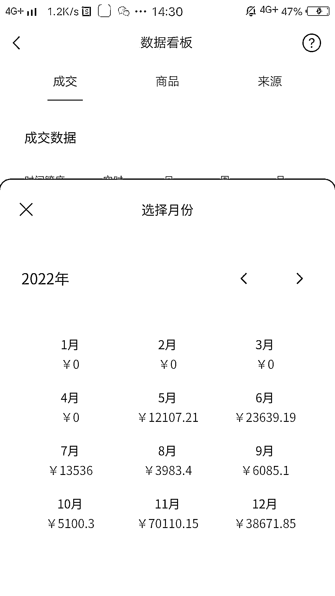  <ne-p id="u25be657b" data-lake-id="u25be657b"><ne-card data-card-name="image" data-card-type="inline" id="LgGw6" data-event-boundary="card">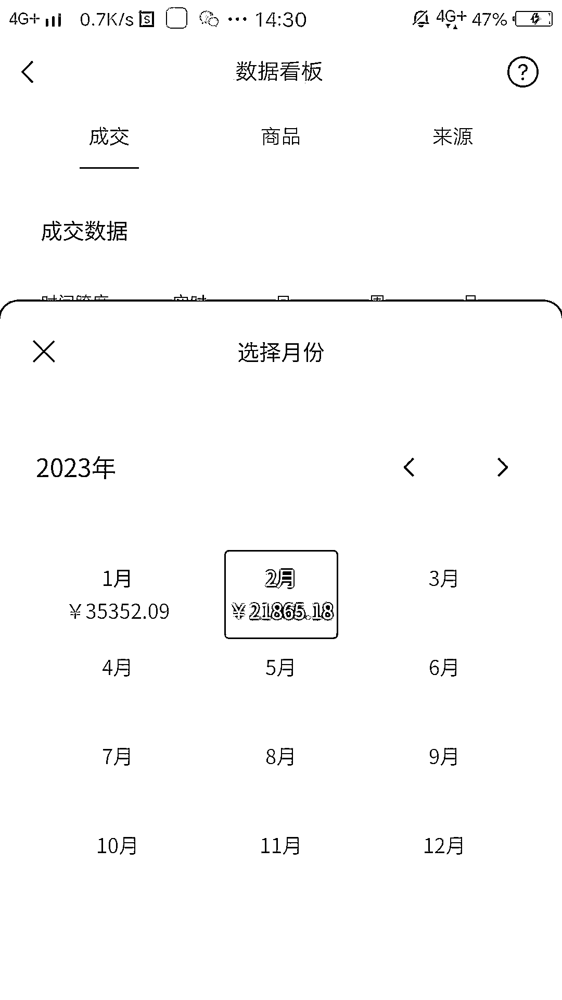  <ne-p id="ud0126bc8" data-lake-id="ud0126bc8"><ne-text id="u501eb915">由于这种方式与搬运混剪不同，素材不是从其他短视频平台获取的，相当于伪原创。</ne-text></ne-p> <ne-p id="u64eb66ea" data-lake-id="u64eb66ea"><ne-text id="u038691b8">因此账号不容易违规，存活周期长，适合作为一个长期项目来做。</ne-text></ne-p> <ne-h1 id="e769da44" data-lake-id="e769da44"><ne-heading-ext><ne-heading-anchor></ne-heading-anchor><ne-heading-fold></ne-heading-fold></ne-heading-ext><ne-heading-content><ne-text id="uf3a32e8d">一、什么是英文育儿书单号</ne-text></ne-heading-content></ne-h1> <ne-p id="u396aea88" data-lake-id="u396aea88"><ne-text id="ubd7cc815">简单来说，就是中文育儿书单号的英文化。</ne-text></ne-p> <ne-p id="u50ece9cd" data-lake-id="u50ece9cd"><ne-text id="ue0b0c1ff">如果你是一个孩子的家长，刷过育儿短视频，相信你一定看过李玫瑾老师的视频。将像李玫瑾老师这样的育儿专家视频英文化，把人物换成外国人，语音换成英文，就变成了英文育儿书单号。</ne-text></ne-p> <ne-p id="u9328598b" data-lake-id="u9328598b"><ne-text id="u5604e183">这类账号的运营方式，是先发流量视频涨粉。等到流量视频爆了之后，粉丝达到开通带货权限要求，再利用爆款视频的流量带动带货视频的流量进行带货。</ne-text></ne-p> <ne-p id="u01c5d3ba" data-lake-id="u01c5d3ba"><ne-text id="u9663da25">以下是视频号案例：</ne-text></ne-p> <ne-p id="ub2eb934c" data-lake-id="ub2eb934c"><ne-card data-card-name="image" data-card-type="inline" id="cBQWt" data-event-boundary="card">  <ne-h1 id="b82d65af" data-lake-id="b82d65af"><ne-heading-ext><ne-heading-anchor></ne-heading-anchor><ne-heading-fold></ne-heading-fold></ne-heading-ext><ne-heading-content><ne-text id="u1428ae32">二、为什么选择英文育儿书单号</ne-text></ne-heading-content></ne-h1> <ne-p id="u92766b0a" data-lake-id="u92766b0a"><ne-text id="uf5b174bf">首先，这是一个蓝海项目。我准备做的时候，无论是抖音还是视频号，做到人都不多。</ne-text></ne-p> <ne-p id="uc34c56bc" data-lake-id="uc34c56bc"><ne-text id="uba4cf44e">做中老年女装的时候，习惯性每天都刷一段时间的抖音，发现这种模式之后，特意去找对标账号，只找到不超过十个。以抖音的体量，这绝对算得上蓝海了。</ne-text></ne-p> <ne-p id="u80ba7575" data-lake-id="u80ba7575"><ne-text id="u01f0fdd3">其次，相较于搬运混剪而言，这个项目需要一定的门槛。要懂一些英语，要会剪辑，最重要的是要会找素材。如果找到的素材别人没有用过，剪出来的视频，就算原创。</ne-text></ne-p> <ne-p id="ude57c8d3" data-lake-id="ude57c8d3"><ne-text id="ue320cc92">最后，父母一般都舍得给孩子买书。我自己也有一个小男孩，每年都会花不少钱在买绘本和童书上，而且了解到身边不少宝爸宝妈也都愿意在童书上做投入。</ne-text></ne-p> <ne-p id="u17e39e7f" data-lake-id="u17e39e7f"><ne-text id="u8249cf4f">还有就是利用「外来的和尚好念经」这个心理，不少人都会觉得外国的育儿理念比较先进，因此更容易引起受众的兴趣。使用外国人的形象，侵权风险也会小很多。</ne-text></ne-p> <ne-p id="uba79e044" data-lake-id="uba79e044"><ne-text id="u84db036a">另外，选择视频号平台，是因为当时在视频号上起号最快，第一天发视频就爆了。</ne-text></ne-p> <ne-p id="u094051de" data-lake-id="u094051de"><ne-text id="ue0ff4f96">所以把主要精力放在视频号上，但不是说其他平台不管，也会同时把做好的视频同步到抖音快手。</ne-text></ne-p> <ne-p id="u721b842d" data-lake-id="u721b842d"><ne-text id="u5692604c">目前两个账号抖音累计粉丝 10w，快手 8w，跟视频号不在同一个量级。</ne-text></ne-p> <ne-h1 id="cd93a302" data-lake-id="cd93a302"><ne-heading-ext><ne-heading-anchor></ne-heading-anchor><ne-heading-fold></ne-heading-fold></ne-heading-ext><ne-heading-content><ne-text id="ua5f06a65">三、怎么做育儿书单号带货</ne-text></ne-heading-content></ne-h1> <ne-p id="u08aa1ba6" data-lake-id="u08aa1ba6"><ne-text id="ueea4e2f5">主要有以下几个步骤：找育儿爆款文案、翻译成英文、AI 配音、找素材、合成视频，接下来一个一个说。</ne-text></ne-p> <ne-h2 id="e6c5d3e2" data-lake-id="e6c5d3e2"><ne-heading-ext><ne-heading-anchor></ne-heading-anchor><ne-heading-fold></ne-heading-fold></ne-heading-ext><ne-heading-content><ne-text id="u161ecaa0">（1）找育儿爆款文案</ne-text></ne-heading-content></ne-h2> <ne-p id="u4e261053" data-lake-id="u4e261053"><ne-text id="u742a4bb4">抖音是目前视频内容最丰富的平台，因此选择在抖音上找爆款文案。爆款文案的标准就是点赞量高，图文和视频都可以，只要文案是育儿相关的就行。</ne-text></ne-p> <ne-p id="u259f591b" data-lake-id="u259f591b"><ne-text id="u3ed677ea">找文案：在抖音首页搜索框输入「育儿」，点击筛选条件，选择「点赞最多」，「一天内」或「一周内」都可以。要是刚开始做，也可以选择「半年内」或者「不限」。</ne-text></ne-p> <ne-p id="ued2fb2f4" data-lake-id="ued2fb2f4"><ne-card data-card-name="image" data-card-type="inline" id="Hm6gd" data-event-boundary="card">  <ne-p id="ue58b5908" data-lake-id="ue58b5908"><ne-card data-card-name="image" data-card-type="inline" id="kgctc" data-event-boundary="card">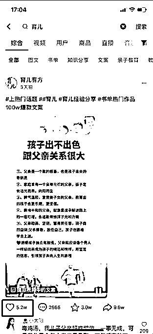  <ne-p id="u37db0235" data-lake-id="u37db0235"><ne-card data-card-name="image" data-card-type="inline" id="HeLJG" data-event-boundary="card">  <ne-p id="u77688e47" data-lake-id="u77688e47"><ne-text id="udf465566">电脑端的操作步骤也一样：</ne-text></ne-p> <ne-p id="u7330a63c" data-lake-id="u7330a63c"><ne-card data-card-name="image" data-card-type="inline" id="qA8yA" data-event-boundary="card">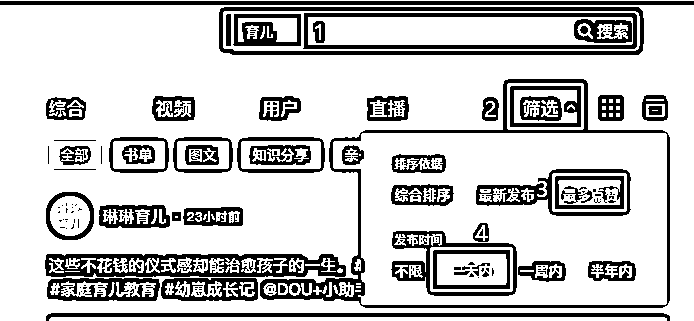  <ne-p id="uf311d2c3" data-lake-id="uf311d2c3"><ne-text id="ua596c7b0">文案提取：如果是图文，要自己打出来，或者用 OCR 网站识别。如果是视频，就先下载下来，用飞书妙记转换成文字。</ne-text></ne-p> <ne-p id="u54360cb4" data-lake-id="u54360cb4"><ne-text id="uca4713c6">抖音视频下载工具，可以网上找一个，我用的是 IDM。</ne-text></ne-p> <ne-p id="u333f312c" data-lake-id="u333f312c"><ne-text id="u68b7f64d">找爆款文案的另外一种方式，就是找到做的好的同行，直接把文案拿过来用，他们的文案一般也是爆款视频提取的，可以直接用。</ne-text></ne-p> <ne-p id="u8d17a2e6" data-lake-id="u8d17a2e6"><ne-text id="ua8df3c1c">用视频标题搜索，都能找到对应的中文视频。找到视频后，也下载下来，用飞书妙记提取文案。</ne-text></ne-p> <ne-h2 id="b97e496e" data-lake-id="b97e496e"><ne-heading-ext><ne-heading-anchor></ne-heading-anchor><ne-heading-fold></ne-heading-fold></ne-heading-ext><ne-heading-content><ne-text id="u0ae359c2">（2）文案翻译</ne-text></ne-heading-content></ne-h2> <ne-p id="u7f4af587" data-lake-id="u7f4af587"><ne-text id="udddfdd8a">借助在线翻译网站，百度翻译，有道翻译都可以。</ne-text></ne-p> <ne-p id="u7ab96c4a" data-lake-id="u7ab96c4a"><ne-text id="u66839343">我习惯使用 DeepL，免费使用，而且翻译相对准确。有余力就检查下英文，不然就直接使用翻译原文。</ne-text></ne-p> <ne-p id="ubb2b2e7e" data-lake-id="ubb2b2e7e"><ne-card data-card-name="image" data-card-type="inline" id="nrtzv" data-event-boundary="card">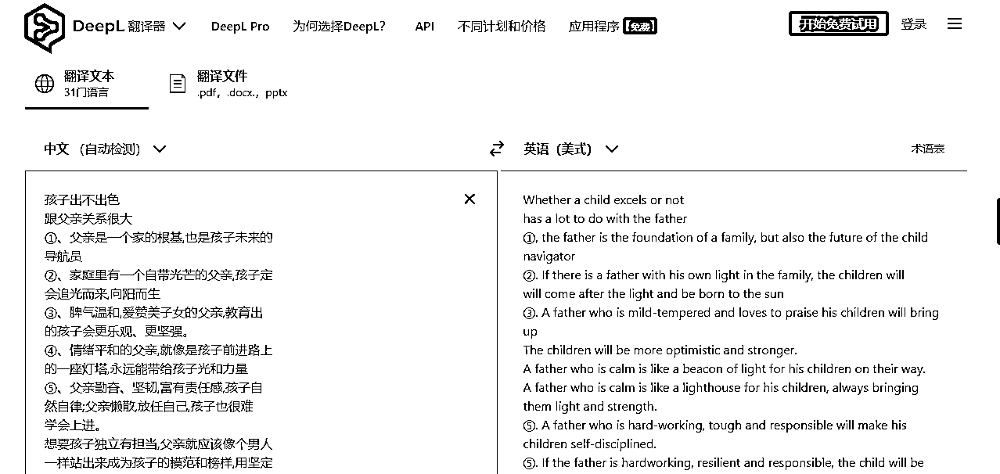  <ne-h2 id="f7adbf36" data-lake-id="f7adbf36"><ne-heading-ext><ne-heading-anchor></ne-heading-anchor><ne-heading-fold></ne-heading-fold></ne-heading-ext><ne-heading-content><ne-text id="u4605f2c4">（3）AI 配音</ne-text></ne-heading-content></ne-h2> <ne-p id="u1c9df822" data-lake-id="u1c9df822"><ne-text id="u36299390">使用配音工具，像配音神器、魔音工坊。</ne-text></ne-p> <ne-p id="uae9d9a92" data-lake-id="uae9d9a92"><ne-text id="u323774ab">我用的是 tts-vue，一款配音软件，集成了微软 Azure 语音助手，各国的英文语音都有，也支持包括中文在内的其他国家语音。</ne-text></ne-p> <ne-p id="u07bebeff" data-lake-id="u07bebeff"><ne-text id="ud4b330e8">配置好右边的选项，开始转换就能生成音频，点击底部的绿色按钮可以下载音频。</ne-text></ne-p> <ne-p id="u941c5ce1" data-lake-id="u941c5ce1"><ne-card data-card-name="image" data-card-type="inline" id="uHS4S" data-event-boundary="card">  <ne-h2 id="bcaf227e" data-lake-id="bcaf227e"><ne-heading-ext><ne-heading-anchor></ne-heading-anchor><ne-heading-fold></ne-heading-fold></ne-heading-ext><ne-heading-content><ne-text id="u4580a1a5">（4）找素材</ne-text></ne-heading-content></ne-h2> <ne-p id="uc63afe69" data-lake-id="uc63afe69"><ne-text id="u733548ec">素材分为主素材和辅助素材，找的素材最重要的是别人没用过的。</ne-text></ne-p> <ne-p id="u40b903f1" data-lake-id="u40b903f1"><ne-text id="u7189302f">主要素材是外国人口播素材，辅助素材是连接两段口播素材的过渡素材。</ne-text></ne-p> <ne-p id="u7ec1b20a" data-lake-id="u7ec1b20a"><ne-text id="ud0713715">既然是找外国人的素材，就要去外国人的网站去找，油管就是最好的选择。上油管需要科学上网，这也是一个小小的门槛。</ne-text></ne-p> <ne-p id="ue5569d57" data-lake-id="ue5569d57"><ne-text id="u288d107f">主要素材要找演讲视频，TED 是个不错的选择。但是为了规避侵权风险，可以在 TED 找到一个演讲视频，用演讲者的姓名在油管里搜，基本上都能搜出其他演讲视频。</ne-text></ne-p> <ne-p id="ube0aebe2" data-lake-id="ube0aebe2"><ne-text id="ufb3272db">如果没搜出什么视频，换一个演讲者再搜。</ne-text></ne-p> <ne-p id="ud48ca96d" data-lake-id="ud48ca96d"><ne-card data-card-name="image" data-card-type="inline" id="OO0JB" data-event-boundary="card">  <ne-p id="u8a30068e" data-lake-id="u8a30068e"><ne-card data-card-name="image" data-card-type="inline" id="Kjgk4" data-event-boundary="card">  <ne-p id="ue4c1cd03" data-lake-id="ue4c1cd03"><ne-text id="ucb7ef394">辅助素材也是在油管上搜，找育儿相关的视频，一般使用 kids、child、family 等关键词。这里有个技巧，在关键词后面加上 stock footage，就能搜到一些无版权高清的素材。</ne-text></ne-p> <ne-p id="u8cdcafdc" data-lake-id="u8cdcafdc"><ne-text id="u5d639990">素材下载同样用的是 IDM。</ne-text></ne-p> <ne-p id="ufd5a0d09" data-lake-id="ufd5a0d09"><ne-card data-card-name="image" data-card-type="inline" id="Y5sno" data-event-boundary="card">  <ne-h2 id="bf7e2447" data-lake-id="bf7e2447"><ne-heading-ext><ne-heading-anchor></ne-heading-anchor><ne-heading-fold></ne-heading-fold></ne-heading-ext><ne-heading-content></ne-heading-content></ne-h2><ne-h2 id="e46fb626" data-lake-id="e46fb626"><ne-heading-ext><ne-heading-anchor></ne-heading-anchor><ne-heading-fold></ne-heading-fold></ne-heading-ext><ne-heading-content><ne-text id="u938ea49f">(5)剪辑</ne-text></ne-heading-content></ne-h2> <ne-p id="u2b4e0ba3" data-lake-id="u2b4e0ba3"><ne-text id="u36688b0b">剪辑用剪映就可以了，具体细节如图，在音乐轨下面还要再加一个背景音乐轨道。</ne-text></ne-p> <ne-p id="u83fafe12" data-lake-id="u83fafe12"><ne-text id="u7e6f863b">刚开始做，剪辑会比较耗时，因为素材积累不够。等素材积累的多了，半个小时左右就能剪一条视频。</ne-text></ne-p> <ne-p id="ua9a7acfd" data-lake-id="ua9a7acfd"><ne-text id="u91606ab9">注意事项：视频轨的素材要静音。</ne-text></ne-p> <ne-p id="u5eb89267" data-lake-id="u5eb89267"><ne-text id="ua0f3a18a">主素材的人物的口型要和音频对上。音频有声音的时候，素材里人物也要在讲话，尽量避免出现有声音但是人物没有讲话的情况。</ne-text></ne-p> <ne-p id="ubdf7c194" data-lake-id="ubdf7c194"><ne-text id="u6a73f642">口型对不上的时候，就用辅助素材，辅助素材的作用，就是用来解决声画不统一的问题。</ne-text></ne-p> <ne-p id="uc5267934" data-lake-id="uc5267934"><ne-text id="u1bde33e3">英文字幕可以直接选中音频，自动生成。中文字幕，需要自己输入。</ne-text></ne-p> <ne-p id="u2139452e" data-lake-id="u2139452e"><ne-card data-card-name="image" data-card-type="inline" id="zMFuN" data-event-boundary="card">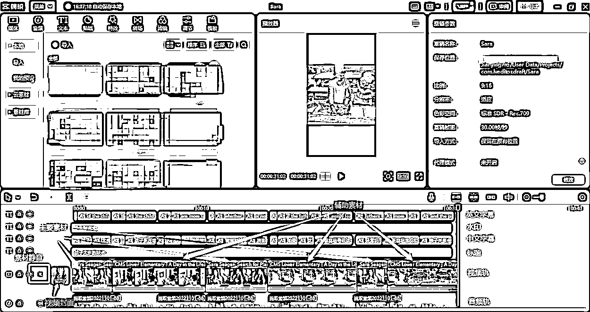  <ne-h2 id="a10dda0e" data-lake-id="a10dda0e"><ne-heading-ext><ne-heading-anchor></ne-heading-anchor><ne-heading-fold></ne-heading-fold></ne-heading-ext><ne-heading-content><ne-text id="udf389736">(6)带货视频的剪辑</ne-text></ne-heading-content></ne-h2> <ne-p id="ue0cfe255" data-lake-id="ue0cfe255"><ne-text id="u350adc96">带货视频的剪辑和上面的流量视频差不多，唯一不一样的地方是要插入自己拍的商品视频片段。</ne-text></ne-p> <ne-p id="u52a4a0f4" data-lake-id="u52a4a0f4"><ne-text id="u45dc98ca">找对标账号的带货视频拆解一下，别人怎么剪，我们也怎么剪。或者找中文育儿书单号的视频，依样画葫芦，用同样的手法剪辑。</ne-text></ne-p> <ne-p id="uf0e9a4ec" data-lake-id="uf0e9a4ec"><ne-text id="u48ebe092">要注意的是，商品视频尽量自己买样品回来拍。使用别人的片段，视频有可能会被判定非原创。至于带什么商品，同样学对标账号，他们带什么，我们也带什么。</ne-text></ne-p> <ne-p id="ua9520dc8" data-lake-id="ua9520dc8"><ne-text id="u62e8f273">还有一种方式是通过第三方数据平台，找到销量好的商品，自己买回来拍。</ne-text></ne-p> <ne-p id="ud7d86b94" data-lake-id="ud7d86b94"><ne-text id="u52994c17">以考古加为例，除了能找到热销商品，还能找到对标带货视频。</ne-text></ne-p> <ne-p id="ubb18af87" data-lake-id="ubb18af87"><ne-text id="uf83d8c9f">选择图书音像，找到适合的商品，点进商品详情页，选择关联视频，就能找到对标视频了。</ne-text></ne-p> <ne-p id="u935eed53" data-lake-id="u935eed53"><ne-card data-card-name="image" data-card-type="inline" id="Jcmyb" data-event-boundary="card">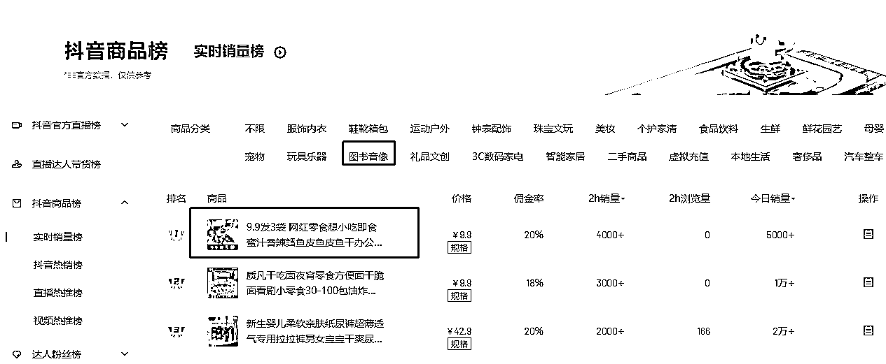  <ne-p id="uef5193a7" data-lake-id="uef5193a7"><ne-card data-card-name="image" data-card-type="inline" id="Ohmh1" data-event-boundary="card">  <ne-h1 id="d6078a44" data-lake-id="d6078a44"><ne-heading-ext><ne-heading-anchor></ne-heading-anchor><ne-heading-fold></ne-heading-fold></ne-heading-ext><ne-heading-content><ne-text id="ub2eef0be">四、如何变现</ne-text></ne-heading-content></ne-h1> <ne-p id="u9c27ae3c" data-lake-id="u9c27ae3c"><ne-text id="ud671bd20">变现分为两种情况，一种是已经开通购物车，一种是没有开通购物车。</ne-text></ne-p> <ne-p id="uc23c6974" data-lake-id="uc23c6974"><ne-text id="u99429e0a">开通购物车比较简单，直接发布带货视频。对于一些出单效果好的商品，相关的文案和视频可以反复发。</ne-text></ne-p> <ne-p id="uf017ae5c" data-lake-id="uf017ae5c"><ne-text id="u1fea997f">视频要保留底稿，只要把素材进行剪裁、镜像、更换部分素材等操作，就能生成新的视频发布。</ne-text></ne-p> <ne-p id="u59819cc6" data-lake-id="u59819cc6"><ne-text id="u9b8c348d">没有开通购物车，在流量视频爆了的情况下，不想浪费流量，可以直播或者引导到橱窗下单。</ne-text></ne-p> <ne-p id="ue6cf0df4" data-lake-id="ue6cf0df4"><ne-text id="u29802502">引导橱窗下单可以通过主页介绍、置顶引导视频，还有通过评论区引导。</ne-text></ne-p> <ne-p id="ud6509849" data-lake-id="ud6509849"><ne-card data-card-name="image" data-card-type="inline" id="QZ7QK" data-event-boundary="card">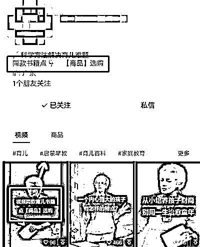  <ne-p id="u5a65ffdf" data-lake-id="u5a65ffdf"><ne-card data-card-name="image" data-card-type="inline" id="cOAN4" data-event-boundary="card">  <ne-h1 id="2b92b93b" data-lake-id="2b92b93b"><ne-heading-ext><ne-heading-anchor></ne-heading-anchor><ne-heading-fold></ne-heading-fold></ne-heading-ext><ne-heading-content><ne-text id="u1b9a0e41">五、项目中可能会遇到的问题</ne-text></ne-heading-content></ne-h1> <ne-p id="u8e7f0d8b" data-lake-id="u8e7f0d8b"><ne-text id="u5518021e">做项目过程中可能会遇到起号慢或者流量不稳定的问题，这些都是正常现象。</ne-text></ne-p> <ne-p id="ucc0d95b3" data-lake-id="ucc0d95b3"><ne-text id="u277e63ec">我自己做了四个号就起了两个，爆的两个号一个第一天就爆了，另一个做了快一个月才起来，其他两个号就完全起不来。为了增加起号的概率，刚开始可以多做几个号。</ne-text></ne-p> <ne-p id="u4209f98e" data-lake-id="u4209f98e"><ne-text id="u44bd8997">如果只做一个号，账号起得慢会影响心态，难以坚持下去。起号过程也有运气的成分在里面，要解决这个问题，要不就是增加账号，用数量博概率。</ne-text></ne-p> <ne-p id="uf03d160e" data-lake-id="uf03d160e"><ne-text id="u15ef9cc0">要不就是降低期待，将时间拉长，只要路是通的，终归能抵达目的地。</ne-text></ne-p> <ne-p id="u2cc4b17e" data-lake-id="u2cc4b17e"><ne-text id="u0e4b6f5f">视频爆了之后一天有几十万，甚至几百万的流量。但是爆款视频的流量有衰减期，有的一周半个月流量就没了，大爆的视频可以持续一两个月。</ne-text></ne-p> <ne-p id="u79bf77e6" data-lake-id="u79bf77e6"><ne-text id="u3f8f05f2">等到流量恢复正常时，账号的流量只剩几万，落差很大。因为出单数量是跟流量成正比的，流量越大，出单越多。</ne-text></ne-p> <ne-p id="ufeda9190" data-lake-id="ufeda9190"><ne-text id="uc34725ce">因此心情也会跟过山车一样，在喜悦之颠落与失落之谷之间反复。</ne-text></ne-p> <ne-p id="u57c6211b" data-lake-id="u57c6211b"><ne-text id="u4e320759">流量爆的时候，感觉自己像打了鸡血，可以不眠不休。第一次视频爆的时候，带货权限还没开，连续直播了两天，每天都只睡两三个小时。</ne-text></ne-p> <ne-p id="ufacf7ebb" data-lake-id="ufacf7ebb"><ne-text id="u17b0d93b">当时几乎每分钟都在出单，体会了一把日入过万。</ne-text></ne-p> <ne-p id="ue196128d" data-lake-id="ue196128d"><ne-text id="ua1b95ebe">有了这个体验，后面流量恢复正常时，就感觉提不起劲剪视频。</ne-text></ne-p> <ne-p id="u487486e2" data-lake-id="u487486e2"><ne-text id="u8b552f22">现在做久了心态就比较平和，视频爆了就多剪几条带货视频，把流量充分利用起来。不爆的时候，也保证每天的视频发布。</ne-text></ne-p> <ne-p id="u4fca78f3" data-lake-id="u4fca78f3"><ne-text id="u1bfc4b90">总而言之，还是要保持平常心，和做其他项目的道理一样。</ne-text></ne-p> <ne-h1 id="60fb45a3" data-lake-id="60fb45a3"><ne-heading-ext><ne-heading-anchor></ne-heading-anchor><ne-heading-fold></ne-heading-fold></ne-heading-ext><ne-heading-content><ne-text id="u412e510c">六、总结</ne-text></ne-heading-content></ne-h1> <ne-p id="uc6b1e6af" data-lake-id="uc6b1e6af"><ne-text id="u65ebfbe2">目前这个项目在视频号平台依然还有机会，依然算是个蓝海项目，抖音上的竞争相对激烈一些，起号难度也大。</ne-text></ne-p> <ne-p id="u8b2630d2" data-lake-id="u8b2630d2"><ne-text id="u788f3e4a">这个项目的优势是比较稳定，适合细水长流。</ne-text></ne-p> <ne-p id="u68e65819" data-lake-id="u68e65819"><ne-text id="uf0a354ef">前期需要投入比较多的时间，多发一些流量视频起号。等出现一个 10w+ 点赞的爆款视频，账号就起来了。</ne-text></ne-p> <ne-p id="u4715a62a" data-lake-id="u4715a62a"><ne-text id="u30d30c4f">接下来每天只要投入一两个小时，保持发布一个流量视频，一个带货视频，基本上能达到月入过万。</ne-text></ne-p> <ne-hole id="u11e039be" data-lake-id="u11e039be"><ne-card data-card-name="hr" data-card-type="block" id="wD5sU" data-event-boundary="card"><ne-p id="ua12e13ec" data-lake-id="ua12e13ec"><ne-text id="u6c775c6e">评论区：</ne-text></ne-p> <ne-p id="u639a0bfd" data-lake-id="u639a0bfd"><ne-text id="u18a29f71">肖江波 : 太细了[强]</ne-text> <ne-text id="u54cedfc6">离心之巅 : 请问会涉及到真人验证吗？</ne-text> <ne-text id="uaa14ef96">Luke 王子 : 感谢分享</ne-text> <ne-text id="u487ad06f">青青实操育儿 : 我也是做育儿的，说的太好了</ne-text> <ne-text id="uf0f3f936">秋海 : 目前没遇到过</ne-text> <ne-text id="uccbf4adc">刺客 : 有投流么</ne-text> <ne-text id="u0f5687cb">秋海 : 没有，纯自然流</ne-text> <ne-text id="u9ce09c29">庞小亮-点动科技 : 这做法可以借鉴到其他类目，育儿号，创业号，课程号，变了一下，就像是海龟镀金一样[强]</ne-text></ne-p></ne-card></ne-hole></ne-card></ne-p></ne-card></ne-p></ne-card></ne-p></ne-card></ne-p></ne-card></ne-p></ne-card></ne-p></ne-card></ne-p></ne-card></ne-p></ne-card></ne-p></ne-card></ne-p></ne-card></ne-p></ne-card></ne-p></ne-card></ne-p></ne-card></ne-p></ne-card></ne-p></ne-card></ne-p></ne-card></ne-p></ne-card></ne-p></ne-card></ne-p></ne-card></ne-p></ne-card></ne-p></ne-card></ne-p>