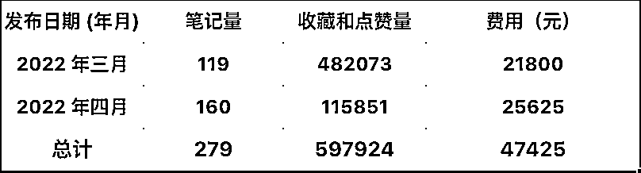
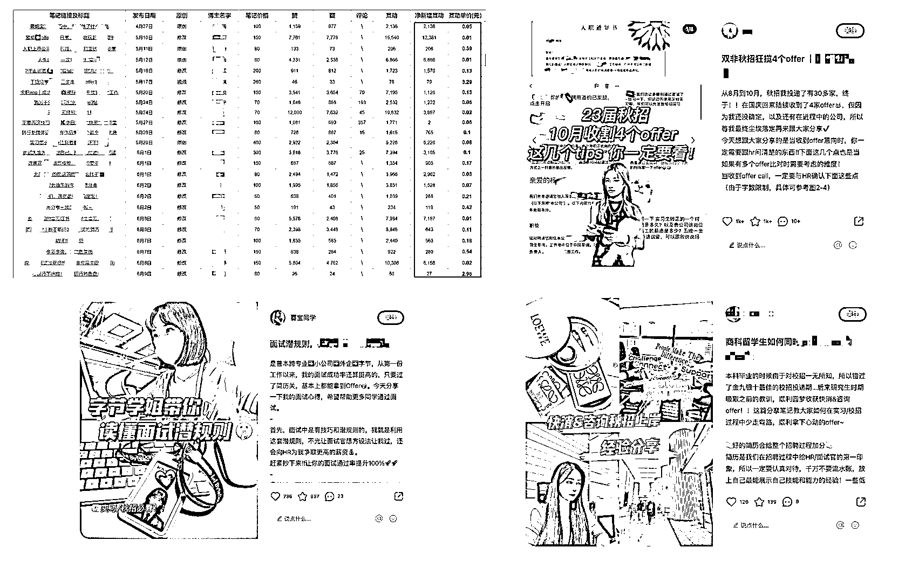

# 《深耕小红书内容营销以 20w 撬动 30w 流量增长，我是如何做的？》

> 原文：[`www.yuque.com/for_lazy/thfiu8/trkgo0oyqp85nrav`](https://www.yuque.com/for_lazy/thfiu8/trkgo0oyqp85nrav)

## (51 赞)《深耕小红书内容营销以 20w 撬动 30w 流量增长，我是如何做的？》 

作者： 祥哥 

日期：2023-03-23 

大家好，我是祥哥，目前在做品牌内容营销。之前在字节做整合营销，后来独立在创业公司做增长负责人，搭建了小红书、抖音、知乎的内容获客体系。这是此前关于如何用知乎获客的精华帖：[知乎引流 20w+的实战复盘：批量铺、写爆文、投知+的三种玩法分享](https://articles.zsxq.com/id_tworgr1mpxa5.html) 

直入正题，这篇文章主要讲讲小红书的内容获客：我是如何在公司做品牌活动亏损 500w 的情况下，通过内容营销获客，在小红书用 20W 元获客 30W 人，帮助公司摸索出了一条正确的增长之路。我也因此晋升、工资翻倍、获得 7 位数期权、8 个月年终奖，这段经历既是公司发展的转折，也是我个人收入起飞的开始，希望能对大家有一些启发。 

老样子，先看下我上一家公司（产品是的一个招聘 APP）当时的内容营销数据：2 月投放 279 个小红书博主，花费 4.7w 元，互动量 59w，获客 7.2w，平均获客成本 0.65 元/人。 

1.  投放的笔记数据情况 

2.  3 月 4 月两个投放小红书 279 个博主，一共花了大概 4.7w 元，投放的笔记带来的收藏和点赞 59w，预计阅读量 500w，相当于只花了 10 块钱，在小红书被阅读了 1000 次，阅读成本是小红书官方的笔记加热工具薯条的 1/15。 

3.  

4.    

1.  部分投放案例 

      千赞定义为爆款的话，爆款率达到 20%以上，一个点赞或收藏的成本在 0.05 元左右。 

 

1.  营销带来的获客量 

      2 个月注册用户约 40w，其中小红书渠道而来的占比 18%，也就是小红书投放花了 4.7w，带来的新用户（下载并注册）7.2w，平均单个用户的获客成本 0.65 元。我们其他渠道成本最低的时候是 20 元一个，小红书渠道的成本是原来的 1/60。 

  

部分内容涉及到原公司机密数据，所以数据也做了一定程度的放大或缩小处理。 

在投放 1000+博主，小红书的获客 30w，并利用我的总结的方法论和操盘经验，帮助了数 10 家公司在小红书获客后。我越来越笃定：小红书内容营销是绝大部分品牌，低成本获客的最好的方式。 

如果你也想通过小红书，实现业务的高流量、高获客、高转化，无论你是博主、职场人还是公司老板，建议你一定要认真看完。 

因为文章图片和案例较多，为了更好的阅读，还请移步飞书：[点击打开飞书链接](https://ffssdmg6oi.feishu.cn/docx/HZ2RdrAmXoYDl5xT3l2c8wD8nPg) 

全文 7000 字，耗时一个月，这是全文大纲： 

1\. 公司 500w 做品牌打水漂，给我的带来的思考 

2\. 为什么选择小红书内容营销？ 

3\. 在小红书做什么的内容才能爆？ 

4\. 从小红书的推荐算法来看，我们如何更好的拿到小红书的流量？ 

5\. 如何提高营销/种草/转化的效果？ 

6\. 小红书内容营销的具体执行策略 

7\. 内容营销效果如何统计？ 

评论区： 

洺 : 打破了原有认知，好内容+付费推广才是增长最大的动力 Shirley♡ : 写得很赞！感谢 敏 : 虽然没看之前大约看了标题又关于小红书的内容就收藏了。但收藏后，我原本打算之后再看，但想想还是现在看吧。看了后，这很用心，很实在，很详细，讲得很清楚。 以上表示，我学到了。值得去看！ 祥哥 : [呲牙]小红书的效果真是没得说，而且规模化能力特别强，利用的好妥妥的优质渠道 祥哥 : [抱拳]感谢认可 万丈 : 所以爆款故事都是编的[捂脸] 祥哥 : 哈哈哈哈 真龙天子出生的时候都跟天煞孤星一样，伴随着天生异象的[呲牙] 

不过现在博主都是小 ip，人设不能乱写的，大多数还是真实经历，只不过会用更冲突性文字去写自己的故事。 Zach : 说的很好