# 《在小红书上，如何挖掘出 1000 个适合普通人的赚钱项目》

> 原文：[`www.yuque.com/for_lazy/thfiu8/gtifms9qpd2whyoe`](https://www.yuque.com/for_lazy/thfiu8/gtifms9qpd2whyoe)

<ne-h2 id="71338d47" data-lake-id="71338d47"><ne-heading-ext><ne-heading-anchor></ne-heading-anchor><ne-heading-fold></ne-heading-fold></ne-heading-ext><ne-heading-content><ne-text id="uc00068d7">(387 赞)《在小红书上，如何挖掘出 1000 个适合普通人的赚钱项目》</ne-text></ne-heading-content></ne-h2> <ne-p id="u27b62c17" data-lake-id="u27b62c17"><ne-text id="ub887971e">作者： 梨云</ne-text></ne-p> <ne-p id="ub053ef36" data-lake-id="ub053ef36"><ne-text id="u76b7a863">日期：2023-03-24</ne-text></ne-p> <ne-p id="u2ef6c1b4" data-lake-id="u2ef6c1b4"><ne-text id="u236c4eec">生财圈友们好，我是梨云，一个内容创业的自媒体人。</ne-text></ne-p> <ne-p id="u21d9e386" data-lake-id="u21d9e386"><ne-text id="ud1e16f8d">小红书，这个平台的发展趋势正昂扬向上，巨大的红利吸引了无数人下场。</ne-text></ne-p> <ne-p id="u7155bcb5" data-lake-id="u7155bcb5"><ne-text id="ud7be5494">但，不得不承认，我们对小红书赚钱项目的认知，知之甚少，仿佛赚钱的，就那几个项目，就那几条赛道。</ne-text></ne-p> <ne-p id="u37f93b0c" data-lake-id="u37f93b0c"><ne-text id="u99e0a4d1">说到做小红书变现项目，你会想到什么？接广变现？虚拟资料？引流私域结合个人 IP 产品服务变现？……</ne-text></ne-p> <ne-p id="u4918d734" data-lake-id="u4918d734"><ne-text id="u3d55ea6a">说到选择小红书热门赛道，你会想到什么？考研赛道？学习赛道？成长赛道？减肥赛道？……</ne-text></ne-p> <ne-p id="u01b86453" data-lake-id="u01b86453"><ne-text id="uc6e99bf3">还有吗？还能想出更多吗？开始有难度了，想不出来，好在有生财风向标！</ne-text></ne-p> <ne-p id="u976ef7bf" data-lake-id="u976ef7bf"><ne-text id="u3ceabe46">但，你不能总是等别人发风向标，你得自己去挖更多的风向标，万里挑一。</ne-text></ne-p> <ne-p id="u0acebecc" data-lake-id="u0acebecc"><ne-text id="ua8258674">这时候，就需要我们有挖掘能力，怎么挖？</ne-text></ne-p> <ne-h3 id="43d8af1c" data-lake-id="43d8af1c"><ne-heading-ext><ne-heading-anchor></ne-heading-anchor><ne-heading-fold></ne-heading-fold></ne-heading-ext><ne-heading-content><ne-text id="u8c014532" style="color: rgb(222, 120, 2);">从评论区留言构建需求词库</ne-text></ne-heading-content></ne-h3> <ne-p id="u7b494ba7" data-lake-id="u7b494ba7"><ne-text id="u3ecd44a4">此前，我做教育赛道的原创爆款选题，大部分都是从评论区里挖掘的，因为评论区里的关键词，是用户留下的需求。</ne-text></ne-p> <ne-p id="ub8ea3c27" data-lake-id="ub8ea3c27"><ne-card data-card-name="image" data-card-type="inline" id="JTLqo" data-event-boundary="card">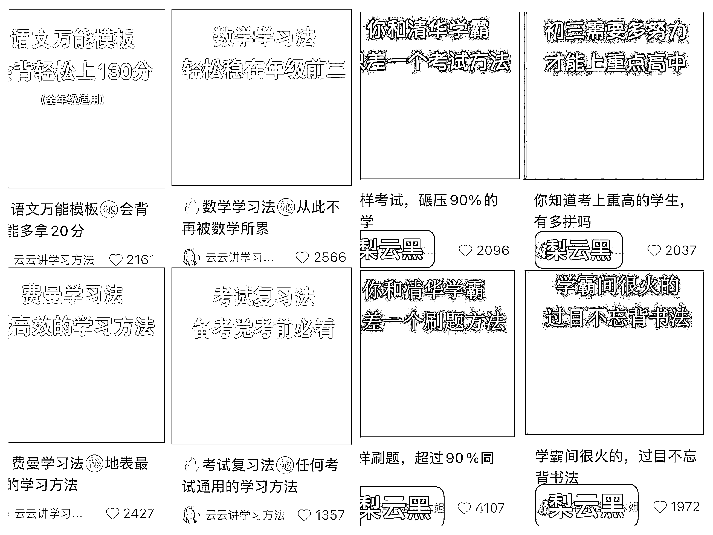</ne-card></ne-p> <ne-p id="u029bac4d" data-lake-id="u029bac4d"><ne-text id="uf1da08bc">同样的，小红书依靠内容营销，刺激用户需求，同样会反映到评论区中。</ne-text></ne-p> <ne-p id="u8ba1f734" data-lake-id="u8ba1f734"><ne-text id="uc577a9f3" style="color: rgb(222, 120, 2);">【求图】【跟团】【怎么领】这些评论区里直白的需求表达，对应的不就是商机满满的笔记。</ne-text></ne-p> <ne-p id="uf17dbd91" data-lake-id="uf17dbd91"><ne-text id="ua631d8a5" style="color: rgb(222, 120, 2);">如果能找到这些笔记，找到对应产品，摸清变现模式，评估收益，就能挖到一些正在低调赚钱的项目。</ne-text></ne-p> <ne-p id="ub3c62fab" data-lake-id="ub3c62fab"><ne-text id="ubd47bb9e">我把上面三个需求词，放到千瓜数据的按笔记评论搜索，顺藤摸瓜找到了笔记、对应的产品或服务。</ne-text></ne-p> <ne-p id="u8472b86d" data-lake-id="u8472b86d"><ne-text id="uea00bf5d">ps：千瓜这玩意儿其实价格挺贵的，大几千，当然你也可以咸鱼上有卖会员 25 天一天。</ne-text></ne-p> <ne-p id="ubf4a2d56" data-lake-id="ubf4a2d56"><ne-card data-card-name="image" data-card-type="inline" id="stHvB" data-event-boundary="card">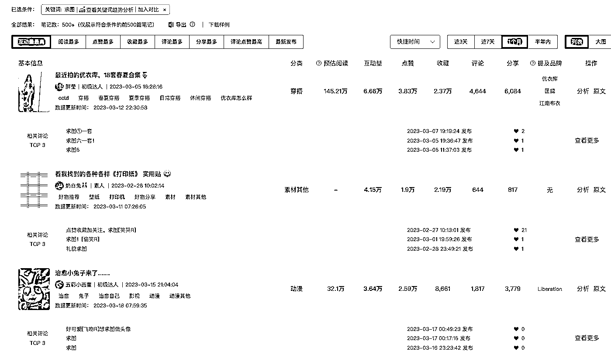  <ne-p id="u1ca44ba9" data-lake-id="u1ca44ba9"><ne-text id="ub5951478">通过标题、笔记原文和主页，一个个看，筛选了不少有意思的变现项目，你会看到，引流不止送资料的方式，更不止在学习考试赛道。</ne-text></ne-p> <ne-p id="u30086a0b" data-lake-id="u30086a0b"><ne-card data-card-name="image" data-card-type="inline" id="k4fzg" data-event-boundary="card">  <ne-p id="u0614d516" data-lake-id="u0614d516"><ne-text id="u6d894138">光是 3 个评论区的需求词，就已经能发现这么多东西了，如果我们有一个，能涵盖全部小红书赚钱项目类型的需求词库呢？</ne-text></ne-p> <ne-p id="uba2eefcf" data-lake-id="uba2eefcf"><ne-text id="u30fc2edf">小红书赚钱项目，无非两大类：产品类（包括实体和虚拟）和服务类（包括线上和线下）。</ne-text></ne-p> <ne-p id="u3c91be7f" data-lake-id="u3c91be7f"><ne-card data-card-name="image" data-card-type="inline" id="ZkTQa" data-event-boundary="card"><ne-card data-card-name="image" data-card-type="inline" id="hRWet" data-event-boundary="card">  <ne-p id="u4c13eef5" data-lake-id="u4c13eef5"><ne-text id="uccd694f1">图一：通过“求链接”，可以找到属实体产品服装营销笔记</ne-text></ne-p> <ne-p id="u13841473" data-lake-id="u13841473"><ne-text id="ud8f6957f">图二：通过“怎么学”，可以找到属虚拟产品的线上插花课营销笔记</ne-text></ne-p> <ne-p id="u5ae99f78" data-lake-id="u5ae99f78"><ne-text id="uedaf7061">图三：通过“怎么收费”，可以找到在线上服务的数学辅导营销笔记</ne-text></ne-p> <ne-p id="u46009a3e" data-lake-id="u46009a3e"><ne-text id="u6dd6b9c4">图四：通过“怎么加入”，可以找到线下服务的线下饭局营销笔记</ne-text></ne-p> <ne-p id="u8fdc0dd4" data-lake-id="u8fdc0dd4"><ne-text id="u1b37b45b" style="color: rgb(222, 120, 2);">评论区的需求词特点，正好涵盖了全部赚钱项目类型，为我们挖掘大量项目，在客观上提供了实现的可能。</ne-text></ne-p> <ne-p id="ud17c32e1" data-lake-id="ud17c32e1"><ne-text id="ue653d170">那么，我们怎么拿到更多的评论区需求词呢？</ne-text></ne-p> <ne-p id="u12a196ca" data-lake-id="u12a196ca"><ne-text id="ubcdd568d">一条条笔记去翻，收集，这可不是人干的事情啊！</ne-text></ne-p> <ne-p id="u3afb9bb7" data-lake-id="u3afb9bb7"><ne-text id="uf90d2003">如果已经有百来篇笔记的汇总，然后通过链接收集评论区需求词，效率就会高很多，但，这初始的汇总，到哪找去。</ne-text></ne-p> <ne-p id="u22b68eef" data-lake-id="u22b68eef"><ne-text id="ub4e52397">就在苦恼的时候，风向标航海群突然升入微信聊天列表，咦？你说，生财的运营如此极致，会不会对风向标进行梳理，做成一个资料库呢？</ne-text></ne-p> <ne-p id="ub5ccfec2" data-lake-id="ub5ccfec2"><ne-text id="u483048cc">我点进去找了找，卧槽，还真有！生财团队汇总并且分类了 2000 多条中标的风向标，其中小红书有 200 多条，真的太牛逼了！</ne-text></ne-p> <ne-p id="udfc026d2" data-lake-id="udfc026d2">[<ne-text id="ue0f29a1c">风向标中标合集｜生财有术第六期</ne-text>](https://shengcaiyoushu01.feishu.cn/sheets/shtcnIgUGs4qTJuiaThxMPS41ny?_=1679040727)</ne-p> <ne-p id="ud45c3cf8" data-lake-id="ud45c3cf8"><ne-card data-card-name="image" data-card-type="inline" id="c2MKR" data-event-boundary="card">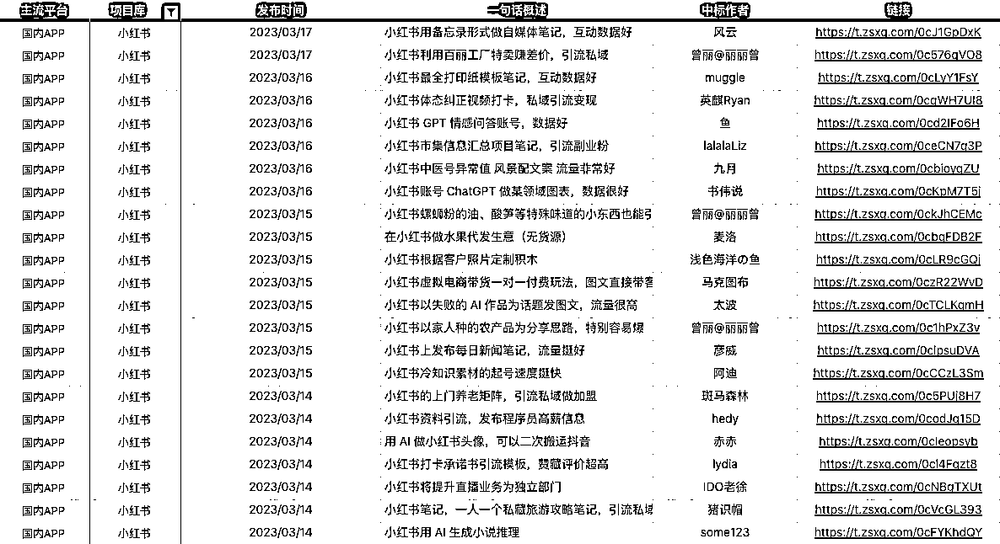  <ne-p id="u83981515" data-lake-id="u83981515"><ne-text id="u7523dc98">这里的每一条，都是一个赚钱项目，并且也比较容易追到评论区，取得需求词。</ne-text></ne-p> <ne-p id="ued576e0a" data-lake-id="ued576e0a"><ne-card data-card-name="image" data-card-type="inline" id="lmCuh" data-event-boundary="card">  <ne-p id="u99f6c0e9" data-lake-id="u99f6c0e9"><ne-card data-card-name="image" data-card-type="inline" id="X6SwO" data-event-boundary="card">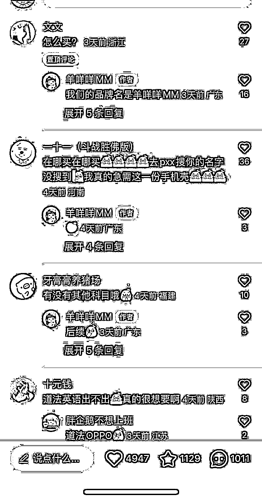  <ne-p id="u9323fca1" data-lake-id="u9323fca1"><ne-text id="u9f5c763d">因为没法实现这个懒人想法：自动根据每条风向标给出的笔记文本，在小红书找到对应笔记，并爬取评论区提炼关键词。</ne-text></ne-p> <ne-p id="ufc182318" data-lake-id="ufc182318"><ne-text id="u220972be">于是，我一条条手动收集……真是天道酬勤，谁用谁知道。</ne-text></ne-p> <ne-p id="u63c31c08" data-lake-id="u63c31c08"><ne-card data-card-name="image" data-card-type="inline" id="hMyLF" data-event-boundary="card">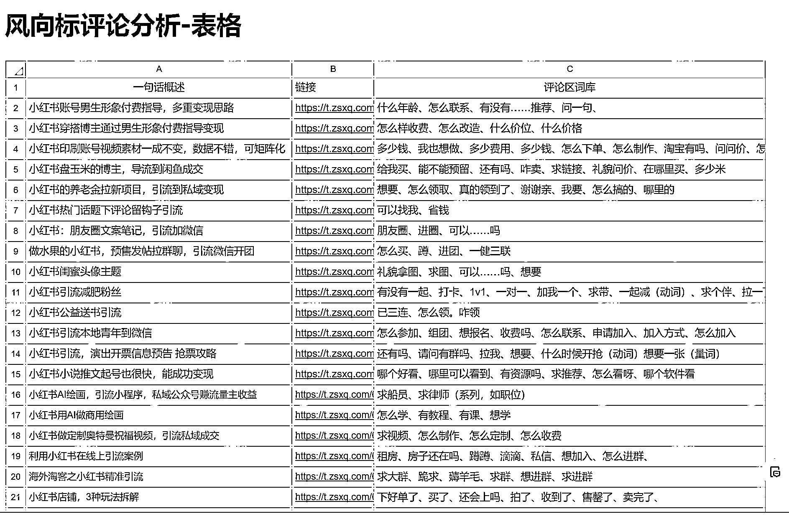  <ne-p id="ufdc33606" data-lake-id="ufdc33606"><ne-text id="udc03610a">但，因为这些评论的关键词都太乱了，于是，手动分类。</ne-text></ne-p> <ne-p id="u364a3eee" data-lake-id="u364a3eee"><ne-text id="u1a4c2496">一顿操作猛如虎，构建起了评论区需求词库。</ne-text></ne-p> <ne-p id="u33ed4eba" data-lake-id="u33ed4eba"><ne-card data-card-name="image" data-card-type="inline" id="PFjtE" data-event-boundary="card">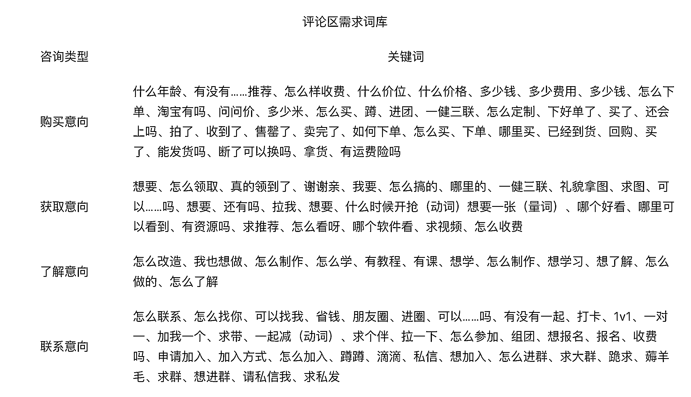  <ne-h3 id="6a9dca4e" data-lake-id="6a9dca4e"><ne-heading-ext><ne-heading-anchor></ne-heading-anchor><ne-heading-fold></ne-heading-fold></ne-heading-ext><ne-heading-content><ne-text id="u0aec6161" style="color: rgb(222, 120, 2);">追溯笔记挖掘大量赚钱项目</ne-text></ne-heading-content></ne-h3> <ne-p id="u2610b1cb" data-lake-id="u2610b1cb"><ne-text id="u67d9f7f8">需求词库有了，接下来就是借助它们，批量收集商机笔记，挖掘赚钱项目。</ne-text></ne-p> <ne-p id="u5dcbbbc3" data-lake-id="u5dcbbbc3"><ne-text id="u071e84a1">我挑了【求资料】这个词，通过千瓜评论检索，获取批量商机笔记的相关信息。</ne-text></ne-p> <ne-p id="u0a897df2" data-lake-id="u0a897df2"><ne-text id="u1f8d4c1e">因为小红书粉丝质量相当优质，大家都喜欢在上面引流，新手都能做的，就是资料引流啦~</ne-text></ne-p> <ne-p id="u62dc4b16" data-lake-id="u62dc4b16"><ne-text id="u7364d4b2">但是，如果你只知道学科、教资、幼师这三个引流项目，其实你是没得选的，竞争也会更加激烈。</ne-text></ne-p> <ne-p id="u145180af" data-lake-id="u145180af"><ne-text id="ucb8472d0">所以我们的目的，是挖掘更多细分赛道资料的变现方式，找到适合自己的，以期避开白热化竞争的赛道。</ne-text></ne-p> <ne-p id="u97fdf901" data-lake-id="u97fdf901"><ne-text id="u9eb3ed8e">为了实现这个目标，分两步走，对标题的批量分析，和笔记的精细挖掘。</ne-text></ne-p> <ne-p id="ud6cb4786" data-lake-id="ud6cb4786"><ne-card data-card-name="image" data-card-type="inline" id="uNdws" data-event-boundary="card">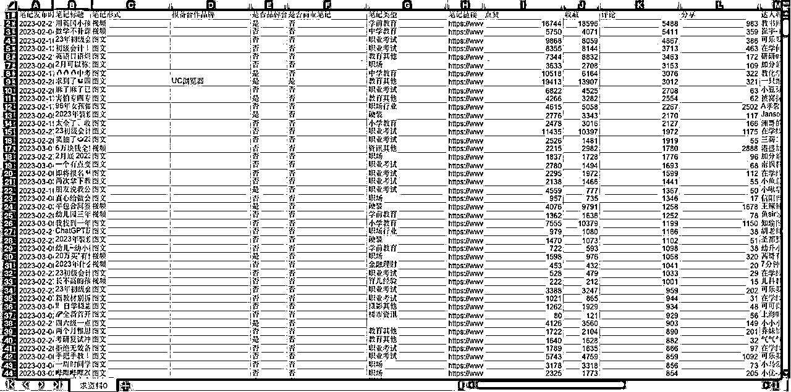  <ne-h4 id="8ca74694" data-lake-id="8ca74694"><ne-heading-ext><ne-heading-anchor></ne-heading-anchor><ne-heading-fold></ne-heading-fold></ne-heading-ext><ne-heading-content><ne-text id="u16347dbf" style="color: rgb(222, 120, 2);">标题的批量分析</ne-text></ne-heading-content></ne-h4> <ne-p id="u4b8c67b7" data-lake-id="u4b8c67b7"><ne-text id="u446f4f9f">我们把导出来的 1000 条数据，进行不同维度的筛选，用最快的速度，从宏观了解情况。</ne-text></ne-p> <ne-p id="ud24024ee" data-lake-id="ud24024ee"><ne-text id="u1aaaea3f">首先，要进行数据清洗，对达人进行去重，避免因为重复，让比例增多，影响最终的结论。</ne-text></ne-p> <ne-p id="u59393b90" data-lake-id="u59393b90"><ne-text id="ue65258fd">然后，以达人 ID 为标准，为什么不是昵称呢？因为小红书的昵称，是可以同名的。</ne-text></ne-p> <ne-p id="u4c339154" data-lake-id="u4c339154"><ne-text id="ubda231cc">得到最终去重数据 636 条之后，就可以开始分析啦~</ne-text></ne-p> <ne-p id="uef52bdcb" data-lake-id="uef52bdcb"><ne-text id="u186733d1" ne-bold="true">笔记形式</ne-text><ne-text id="u4ca62784">：图文 495，视频 141，引流笔记依然以图文为主，制作成本低，用视频形式做差异化，会是一个机会。</ne-text></ne-p> <ne-p id="u1a8751f9" data-lake-id="u1a8751f9"><ne-card data-card-name="image" data-card-type="inline" id="si1tm" data-event-boundary="card">  <ne-p id="u72032a79" data-lake-id="u72032a79"><ne-text id="u9b4042cb" ne-bold="true">账号属性</ne-text><ne-text id="u7e4ba98c">：首先，明确目的，我想知道企业号和个人号的占比，来得知目前大家都在用什么类型的号引流。</ne-text></ne-p> <ne-p id="u17e60450" data-lake-id="u17e60450"><ne-card data-card-name="image" data-card-type="inline" id="Q4Tm5" data-event-boundary="card">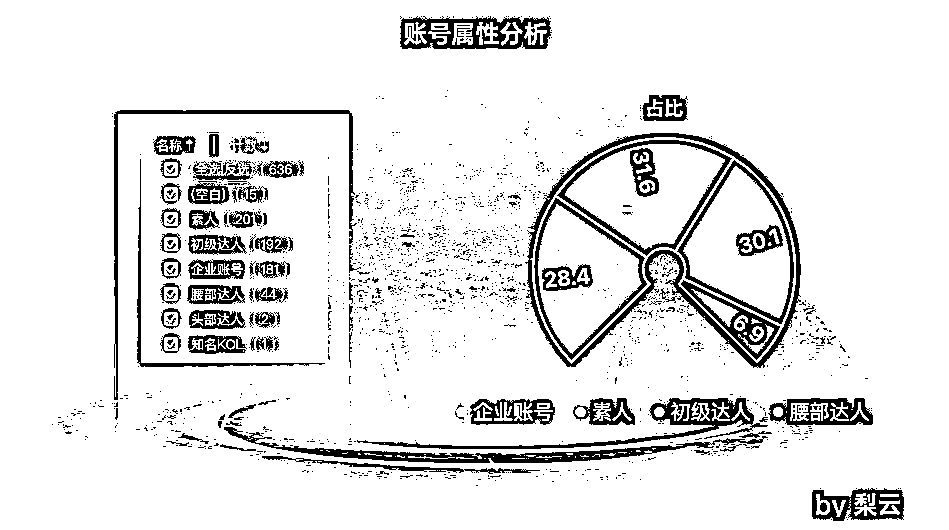  <ne-p id="u9f10ddf7" data-lake-id="u9f10ddf7"><ne-text id="u3552d815">ok，我们发现，企业号和达人号分别是 181 和 440，没想到企业号都快是达人号的一半了，可见，在引流这一块，用企业号的越来越多了。</ne-text></ne-p> <ne-p id="uce54d6a9" data-lake-id="uce54d6a9"><ne-text id="u10d01b7c">原因很简单，小红书加强引流管理，同时企业号引流私域，被“抓”的概率是大大降低的。</ne-text></ne-p> <ne-p id="u12f4eccf" data-lake-id="u12f4eccf"><ne-text id="u76789885">再看【素人】【初级达人】【腰部达人】【头部达人】的数量，201、192、44、2，都是小号引流占多数，毕竟粉丝还没累计，就限流要注销了。</ne-text></ne-p> <ne-p id="u032f9a40" data-lake-id="u032f9a40"><ne-text id="u1daee8bd">ps：达人等级按照粉丝量划分，【素人|5k 以下】【初级达人|5k-5w】【腰部达人|5w-50w】【头部达人|大于 50w】</ne-text></ne-p> <ne-p id="u4f1dde83" data-lake-id="u4f1dde83"><ne-text id="u39e54525">但是，你有没有好奇，大几万粉的腰部博主，也玩引流，不要命了吗？这就涉及到精细挖掘，我们后面展开说。</ne-text></ne-p> <ne-p id="uc45f34ad" data-lake-id="uc45f34ad"><ne-text id="u91e4e021" ne-bold="true">笔记类型</ne-text><ne-text id="ua5b1816f">：在我的认知中，学科号是非常卷的，没想到，并非如此。</ne-text></ne-p> <ne-p id="u9be0056d" data-lake-id="u9be0056d"><ne-card data-card-name="image" data-card-type="inline" id="SwyqJ" data-event-boundary="card">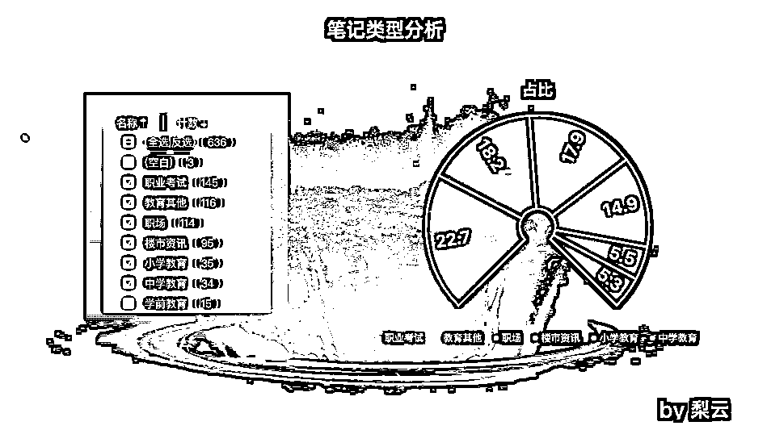  <ne-p id="u1a1a2471" data-lake-id="u1a1a2471"><ne-text id="u61ebd6d5">这教育其他是啥玩意？我用表格筛选该笔记类型的标题，丢到词云分析，高频词为雅思、口语、留学、计算机，了解，是大学赛道，而且英语类占大头。</ne-text></ne-p> <ne-p id="ucb28670a" data-lake-id="ucb28670a"><ne-text id="u372bf92b">如法炮制职业考试，看具体是啥，原来是考事业编和行政编，铁饭碗赛道，具体了这个标签的概念。</ne-text></ne-p> <ne-p id="u9247ef9c" data-lake-id="u9247ef9c"><ne-card data-card-name="image" data-card-type="inline" id="GASTP" data-event-boundary="card">  <ne-p id="u4444034b" data-lake-id="u4444034b"><ne-text id="ueb8e699d">在上面，我们完成了【笔记形式】【账号属性】【笔记类型】的基础分析，大概知道了怎么切入资料赛道，并且哪些方向需求量比较大。</ne-text></ne-p> <ne-p id="u36a422ed" data-lake-id="u36a422ed"><ne-text id="u16c94e74">那么，接下来，就要利用标题分析，挖掘细分赛道上的赚钱项目了，用到的方法，叫品类拓展。</ne-text></ne-p> <ne-p id="uf02c5006" data-lake-id="uf02c5006"><ne-text id="u237b13d6" style="color: rgb(222, 120, 2);">品类拓展法</ne-text></ne-p> <ne-p id="u290f843f" data-lake-id="u290f843f"><ne-text id="u7fb71cff">品类拓展，又分为直接拓展和间接拓展。</ne-text></ne-p> <ne-p id="u878dd2aa" data-lake-id="u878dd2aa"><ne-text id="uf56b9b7f" ne-bold="true">①直接拓展</ne-text></ne-p> <ne-p id="u665669f8" data-lake-id="u665669f8"><ne-text id="ube20f252">这里，用到 chatGTP，思路是通过标题，分析它可能的产品，检索相关笔记，模仿内容引流，使用产品成交，完成赚钱闭环。</ne-text></ne-p> <ne-p id="u26edc278" data-lake-id="u26edc278"><ne-text id="u53f8452e">通过投喂标题，让他先提炼出营销产品，然后再根据营销产品，拓展出相关品类，以品类，倒推细分赛道。</ne-text></ne-p> <ne-p id="u7fc1039f" data-lake-id="u7fc1039f"><ne-text id="u24c9e036">我们取【化学试剂】【录音笔】，到小红书检索，以此来挖掘更多细分品类。</ne-text></ne-p> <ne-p id="ub0df26d2" data-lake-id="ub0df26d2"><ne-card data-card-name="image" data-card-type="inline" id="IzG9S" data-event-boundary="card">  <ne-p id="u027b7029" data-lake-id="u027b7029"><ne-card data-card-name="image" data-card-type="inline" id="DztQc" data-event-boundary="card"></ne-card></ne-p> <ne-p id="u2c739160" data-lake-id="u2c739160"><ne-text id="uce807d74">但这也存在一个问题，像遇到《麻了麻了已经无从下手了家人们》这标题我是真没辙了，是个神仙都拓展不出来，它是讲教资的。</ne-text></ne-p> <ne-p id="u24b07787" data-lake-id="u24b07787"><ne-text id="ua064c7a5">这时候，我注意到了笔记标签，它直接就显示了产品。</ne-text></ne-p> <ne-p id="u4e752e65" data-lake-id="u4e752e65"><ne-card data-card-name="image" data-card-type="inline" id="FMqHF" data-event-boundary="card">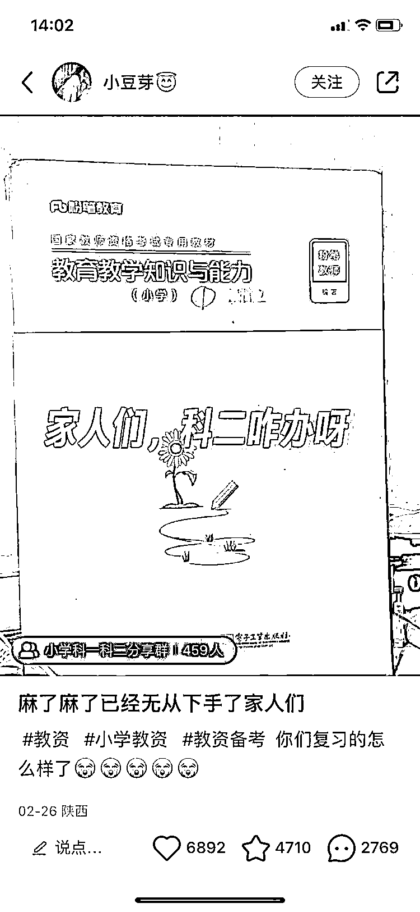  <ne-p id="u4e9b53d8" data-lake-id="u4e9b53d8"><ne-text id="u35f04d4d">这样就好解决了，通过投喂标签给 chatgtp 辅助提炼产品，也不失为一个解决方案。</ne-text></ne-p> <ne-p id="ua7f5efa5" data-lake-id="ua7f5efa5"><ne-text id="ud6188aa4">批量爬取标签，我用的是航海手册里的八爪鱼，它还有好多批量工具，不用起来真的浪费了：</ne-text>[<ne-text id="uad0ac7b3">小红书航海|实战工具包</ne-text>](https://search01.shengcaiyoushu.com/docx/WTeQd9k0Eoc3W5xTiXkcEvKhn9f)</ne-p> <ne-p id="u166c3425" data-lake-id="u166c3425"><ne-card data-card-name="image" data-card-type="inline" id="RSiBA" data-event-boundary="card">  <ne-p id="u3eb554eb" data-lake-id="u3eb554eb"><ne-text id="u2826cd02" ne-bold="true">②间接拓展</ne-text></ne-p> <ne-p id="u85baa00c" data-lake-id="u85baa00c"><ne-text id="u600b9af0">当我们发现职业考试这条赛道时，就要想到这是对各种职业考证的汇总，而教资、考公等，都只是其中之一，肯定有些职业考试类型，我们不知道，爬取也不一定能爬的，但人家就在做，就在赚钱。</ne-text></ne-p> <ne-p id="uccdc5935" data-lake-id="uccdc5935"><ne-text id="u6eef9b9c">所以，我们如何找到更多这种横向的类型呢？</ne-text></ne-p> <ne-p id="u66cdebd9" data-lake-id="u66cdebd9"><ne-text id="u8d85eb56">你说，会不会有人想要考证，但是不知道有哪些证可以考？</ne-text></ne-p> <ne-p id="uc7807c39" data-lake-id="uc7807c39"><ne-text id="u09393ef7">然后，自己一个个找，特别累，就在这个时候，有人发现这个需求，存在巨大的检索流量，于是，他做了一个网页，把全部可以考的证，都放在上面。</ne-text></ne-p> <ne-p id="ue8f66515" data-lake-id="ue8f66515"><ne-text id="ua98429f2">我一搜，还真有！就是这个</ne-text>[<ne-text id="ud2316280">考试 _ 桔梗上网导航</ne-text>](http://www.jiegeng.com/exam)</ne-p> <ne-p id="uab389ddf" data-lake-id="uab389ddf"><ne-card data-card-name="image" data-card-type="inline" id="YEmiQ" data-event-boundary="card">  <ne-p id="u67983f7b" data-lake-id="u67983f7b"><ne-text id="ud67fa92f">它已经分好类了，我们只需要把关键词一个个往小红书检索，完成小众资料引流的挖掘。</ne-text></ne-p> <ne-p id="u1767fa4f" data-lake-id="u1767fa4f"><ne-text id="u9a5bfba6">我们随便取【MPA 考试】【公共英语】【司法考试】，在小红书上检索，这些细分赛道做资料引流，做的风生水起。</ne-text></ne-p> <ne-p id="ufaea0838" data-lake-id="ufaea0838"><ne-card data-card-name="image" data-card-type="inline" id="u6KMO" data-event-boundary="card">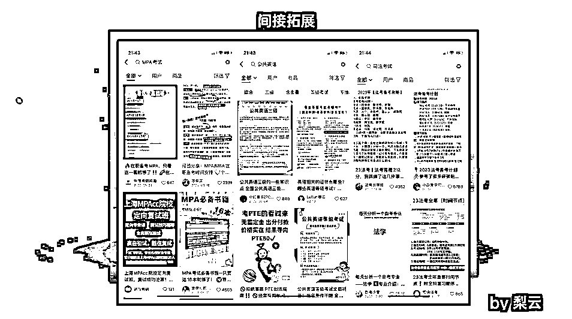  <ne-p id="ub85268bb" data-lake-id="ub85268bb"><ne-text id="ub5f26611">而这些关键词，我们在 1000 条数据里面，都没有找出来！</ne-text></ne-p> <ne-p id="u71cdcd43" data-lake-id="u71cdcd43"><ne-card data-card-name="image" data-card-type="inline" id="En6Ol" data-event-boundary="card">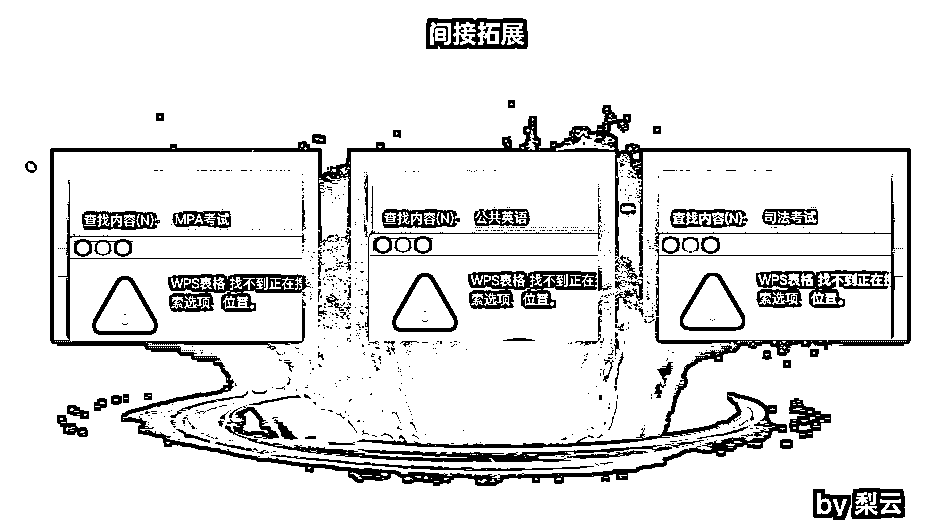  <ne-p id="ua8e6b7d0" data-lake-id="ua8e6b7d0"><ne-text id="u6bb1fa9c">这样，我们就收集到了不少商机笔记的需求产品，和相关需求产品。</ne-text></ne-p> <ne-p id="u7c97c545" data-lake-id="u7c97c545"><ne-text id="uf3c25633" style="color: rgb(222, 120, 2);">批量分析，快而缺乏细节，毛大大曾经说过，要全面看问题，所以我们宏观微观一起抓，再补一刀。</ne-text></ne-p> <ne-h4 id="81a0cfa0" data-lake-id="81a0cfa0"><ne-heading-ext><ne-heading-anchor></ne-heading-anchor><ne-heading-fold></ne-heading-fold></ne-heading-ext><ne-heading-content><ne-text id="u7dcd5a3d" style="color: rgb(222, 120, 2);">笔记的精细挖掘</ne-text></ne-heading-content></ne-h4> <ne-p id="u00cbb83c" data-lake-id="u00cbb83c"><ne-text id="uc545b113">怎么精细挖掘，我利用的是异常值。</ne-text></ne-p> <ne-p id="ua370d5d9" data-lake-id="ua370d5d9"><ne-text id="u5d31129f" style="color: rgb(222, 120, 2);">异常值挖掘法</ne-text></ne-p> <ne-p id="udc97e36d" data-lake-id="udc97e36d"><ne-text id="u43d8a556">在分析【标签属性】的时候，不知道你发现没有，竟然有大几万、十万的账号，在玩资料引流。</ne-text></ne-p> <ne-p id="uddfc6899" data-lake-id="uddfc6899"><ne-text id="u151e6e08">要知道，这可是废号的操作，真舍得？难道你不想知道，他具体是怎么玩的吗？</ne-text></ne-p> <ne-p id="u238d0da4" data-lake-id="u238d0da4"><ne-text id="u23028cd0">于是，我进入了这个 12w 粉的账号主页，她真是变态，更了 400 条，我更变态，账号翻到底。</ne-text></ne-p> <ne-p id="ucd9cdd89" data-lake-id="ucd9cdd89"><ne-card data-card-name="image" data-card-type="inline" id="IsY5w" data-event-boundary="card">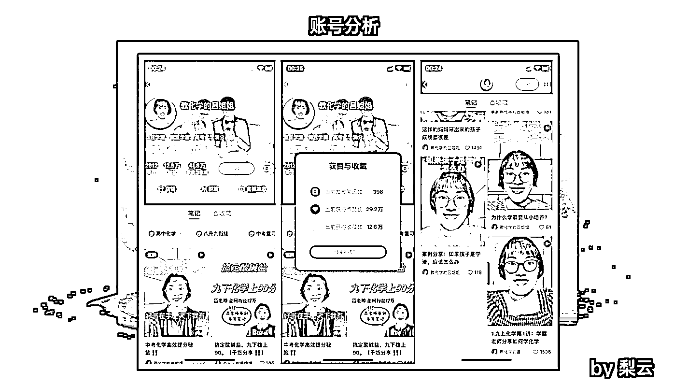</ne-card></ne-p> <ne-p id="ub211c0c5" data-lake-id="ub211c0c5"><ne-text id="u3abe3dba">定位是初中化学，主打中考化学，这个细分很有意思，因为九年级，快中考了，毕业生的学习需求更加强烈。</ne-text></ne-p> <ne-p id="u78b39582" data-lake-id="u78b39582"><ne-text id="ufbb36747">临近高考的 100 天，她估计能比平时赚的更多。</ne-text></ne-p> <ne-p id="udd78d1e0" data-lake-id="udd78d1e0"><ne-text id="u17ab8032">她的账号内容，实现了个人 IP 和资料号的结合，在以前，我们觉得不可能，因为没有看到有人成功，而现在，她被我找出来了！</ne-text></ne-p> <ne-p id="u57996473" data-lake-id="u57996473"><ne-text id="u7f58ad0d">真人出镜讲化学，搭配资料笔记，混着发，降低纯资料号的风险，又借助真人提升信任，用有质量的内容为账号增加权重，还为后面转化到私域成交化学课作铺垫。</ne-text></ne-p> <ne-p id="u18feb5af" data-lake-id="u18feb5af"><ne-text id="u1cce0a43">一石二鸟，骚操作不就这么通过异常值，挖掘出来了。</ne-text></ne-p> <ne-p id="ue91c9a36" data-lake-id="ue91c9a36"><ne-text id="u693b6882">也给了我们启发，做 IP，可以混搭少量资料笔记，实现引流，做资料号，可以发干货内容，提升权重。</ne-text></ne-p> <ne-p id="u21840f96" data-lake-id="u21840f96"><ne-text id="ud4814fb8">接着，我又进入了另一个 14w 粉的博主主页，143 篇笔记是吧，行，翻到底。</ne-text></ne-p> <ne-p id="ud557be26" data-lake-id="ud557be26"><ne-card data-card-name="image" data-card-type="inline" id="lB1SG" data-event-boundary="card">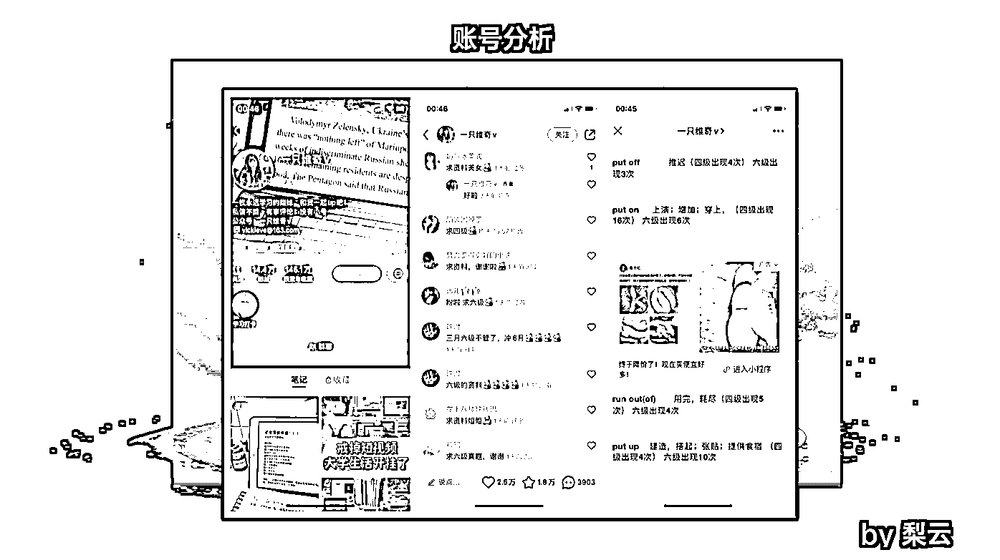</ne-card></ne-p> <ne-p id="uf38880a7" data-lake-id="uf38880a7"><ne-text id="ub7ca6936">这家伙更骚，你一看她主页简介，感觉不公平了吧，为什么人家能把公众号光明正大挂上去，原因有两个，第一，她是从 21 年就开始更新小红书的，第二，她有 10w 粉丝量级，粉丝越多，权重越大，小红书管的越松。</ne-text></ne-p> <ne-p id="u5076086b" data-lake-id="u5076086b"><ne-text id="ub8a7bce4">她做的是大学英语赛道，变现方式有三种：接广告、引流公众号拉升推文曝光赚广告费、网盘 APP 拉新返佣。</ne-text></ne-p> <ne-p id="u1f43ee48" data-lake-id="u1f43ee48"><ne-text id="u35cab33b">不得不说，这一石三鸟，比上面的博主会玩。</ne-text></ne-p> <ne-p id="u949f4dbb" data-lake-id="u949f4dbb"><ne-text id="ueaf0bbf9">玩法组合拳，开眼了，也先别羡慕，她们都有一个共同点，21 年就入局小红书，坚持到现在，你呢？</ne-text></ne-p> <ne-p id="u351ebc16" data-lake-id="u351ebc16"><ne-text id="ud15a47c5" style="color: rgb(222, 120, 2);">当然，一个虚拟产品类，不足以满足选择的需求，索性把两大类四小项都一起挖了，整理成了这个产品项目词库。</ne-text></ne-p> <ne-p id="u4952a3e6" data-lake-id="u4952a3e6"><ne-text id="ue4afad2e">词库链接：</ne-text>[<ne-text id="u6d8f947b">https://lvcj32c4z9.feishu.cn/docx/GivVdS3L5otoTMxtObVcHIsJnIh</ne-text>](https://lvcj32c4z9.feishu.cn/docx/GivVdS3L5otoTMxtObVcHIsJnIh)</ne-p> <ne-p id="ufe69cb41" data-lake-id="ufe69cb41"><ne-card data-card-name="image" data-card-type="inline" id="Gwtv5" data-event-boundary="card">  <ne-h3 id="a9e95869" data-lake-id="a9e95869"><ne-heading-ext><ne-heading-anchor></ne-heading-anchor><ne-heading-fold></ne-heading-fold></ne-heading-ext><ne-heading-content><ne-text id="u550f8875" style="color: rgb(222, 120, 2);">如何用产品词库进行挖掘</ne-text></ne-heading-content></ne-h3> <ne-p id="uc376818e" data-lake-id="uc376818e"><ne-text id="uac2b9cf0">上面讲的，都是挖掘的方法，即鱼竿。</ne-text></ne-p> <ne-p id="u0af3a44b" data-lake-id="u0af3a44b"><ne-text id="u4163ffac">如果你没有那么多时间，跑整个流程，那么，可以直接用已经包含千百个关键词的产品词库。</ne-text></ne-p> <ne-p id="ue2209e75" data-lake-id="ue2209e75"><ne-text id="uf78ad875">这就是一条好鱼了，但，这鱼怎么吃？</ne-text></ne-p> <ne-p id="u39f9577c" data-lake-id="u39f9577c"><ne-text id="u76794905">我们取产品词库里的花植艺、壁纸、公益赠书、交友活动，用【产品服务】【变现模式】【赚钱思路】【收益评估】的思路来分析。</ne-text></ne-p> <ne-h4 id="574acda7" data-lake-id="574acda7"><ne-heading-ext><ne-heading-anchor></ne-heading-anchor><ne-heading-fold></ne-heading-fold></ne-heading-ext><ne-heading-content><ne-text id="udd33b90b" style="color: rgb(222, 120, 2);">①实体产品项目</ne-text></ne-heading-content></ne-h4> <ne-p id="u833757be" data-lake-id="u833757be"><ne-text id="u3e7ab2da">直接检索花植艺，我们挖到了这个账号。</ne-text></ne-p> <ne-p id="ue7bbc5c8" data-lake-id="ue7bbc5c8"><ne-text id="u4e83259b" style="color: rgb(222, 120, 2);">产品服务</ne-text><ne-text id="ub8f5475c">：门挂材料包。</ne-text></ne-p> <ne-p id="u3d2bbf76" data-lake-id="u3d2bbf76"><ne-text id="u89f44116" style="color: rgb(222, 120, 2);">变现模式</ne-text><ne-text id="u54dbabfd">：主打的就是 DIY，以备婚、乔迁为场景进行种草，通过发笔记，引流到小红书店铺下单。</ne-text></ne-p> <ne-p id="ubfbff613" data-lake-id="ubfbff613"><ne-text id="ubf144989" style="color: rgb(222, 120, 2);">赚钱思路：</ne-text><ne-text id="u6a52d883">做个中间商赚差价。</ne-text></ne-p> <ne-p id="uc659821b" data-lake-id="uc659821b"><ne-text id="ua91853e5" style="color: rgb(222, 120, 2);">收益评估</ne-text><ne-text id="u3251eb03">：这个单品就卖了 3w 多。</ne-text></ne-p> <ne-p id="u40545933" data-lake-id="u40545933"><ne-card data-card-name="image" data-card-type="inline" id="RxIUp" data-event-boundary="card"></ne-card></ne-p> <ne-p id="ud82e53df" data-lake-id="ud82e53df"><ne-text id="u5e6e1df6">连这个都有市场，那我拓展一下，与之相关的花艺，会不会更有市场？毕竟小红书女性可是追求高质量生活的，怎么能不会插画呢。</ne-text></ne-p> <ne-p id="ueb986ae4" data-lake-id="ueb986ae4"><ne-text id="uaf9db7e8">直接关键词检索花艺，发现这个赛道的高客单价，非常哇塞，不过，这属于线上服务项目了。</ne-text></ne-p> <ne-p id="u1bd0f1bb" data-lake-id="u1bd0f1bb"><ne-text id="uac49d62c" style="color: rgb(222, 120, 2);">赚钱思路：</ne-text><ne-text id="u24bbbc47">和机构谈流量合作，引流 1 个加微信的单价+成交分佣。</ne-text></ne-p> <ne-p id="u8c0e677c" data-lake-id="u8c0e677c"><ne-card data-card-name="image" data-card-type="inline" id="daL9I" data-event-boundary="card"></ne-card></ne-p> <ne-h4 id="f1450b75" data-lake-id="f1450b75"><ne-heading-ext><ne-heading-anchor></ne-heading-anchor><ne-heading-fold></ne-heading-fold></ne-heading-ext><ne-heading-content><ne-text id="u7101e96b" style="color: rgb(222, 120, 2);">②虚拟产品项目</ne-text></ne-heading-content></ne-h4> <ne-p id="u98b9cb16" data-lake-id="u98b9cb16"><ne-text id="u5a5408b3">检索壁纸，我们挖到了这个账号。</ne-text></ne-p> <ne-p id="u034e691e" data-lake-id="u034e691e"><ne-text id="uc5c80782">这壁纸，是用来引流的吧，当我准备问对方微信号，去他私域看卖什么的时候，我发现，这玩意儿居然在店铺卖壁纸！哪个怨种会买？</ne-text></ne-p> <ne-p id="ue615c672" data-lake-id="ue615c672"><ne-text id="ud83c1324">一看销量，啪啪打脸，好家伙，发张图片，都能赚 400 块了，无本万利。</ne-text></ne-p> <ne-p id="ubfa4e47c" data-lake-id="ubfa4e47c"><ne-card data-card-name="image" data-card-type="inline" id="a5uHm" data-event-boundary="card">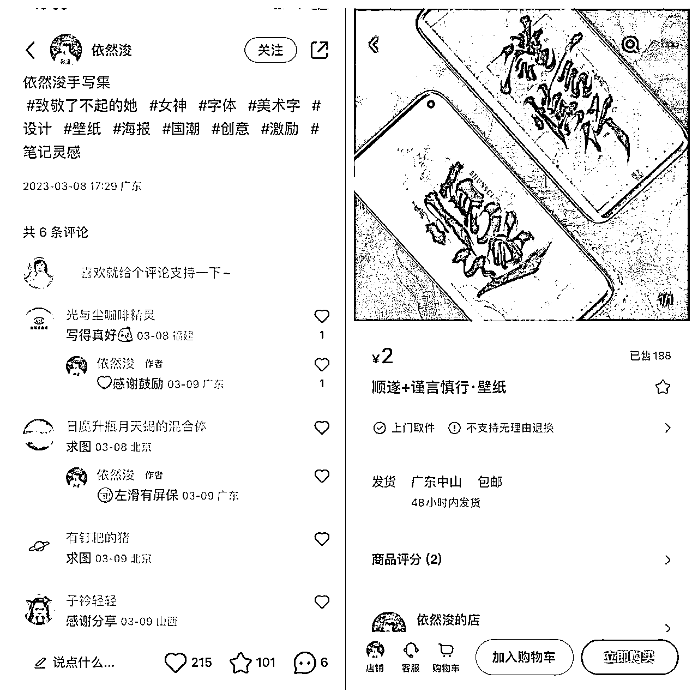</ne-card></ne-p> <ne-p id="ud321abf5" data-lake-id="ud321abf5"><ne-text id="u99529f47">我想，这么烂都能卖那么多，那做得好的岂不是……于是，一番检索之后，发现了比壁纸更完善的商业模式。</ne-text></ne-p> <ne-p id="u297f8327" data-lake-id="u297f8327"><ne-card data-card-name="image" data-card-type="inline" id="L10zy" data-event-boundary="card">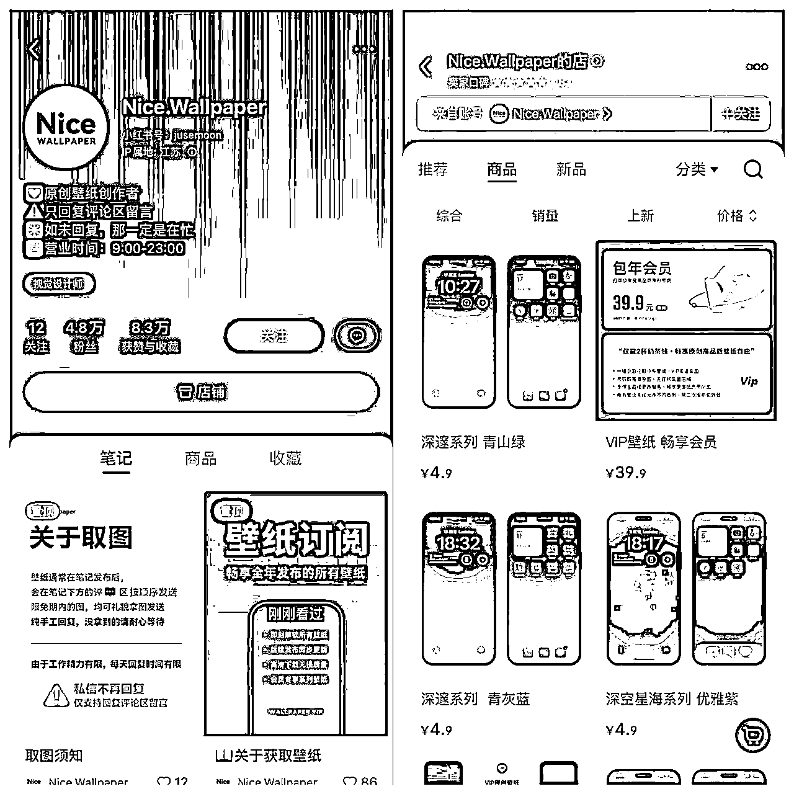</ne-card></ne-p> <ne-p id="u2ae99b3e" data-lake-id="u2ae99b3e"><ne-text id="u26b7e648">从卖壁纸，到卖壁纸 app 会员，说实话，这交互实在是一言难尽。</ne-text></ne-p> <ne-p id="u4409c627" data-lake-id="u4409c627"><ne-card data-card-name="image" data-card-type="inline" id="u0MTP" data-event-boundary="card"></ne-card></ne-p> <ne-p id="u9dc31c36" data-lake-id="u9dc31c36"><ne-text id="ua46c1b1a" style="color: rgb(222, 120, 2);">产品服务</ne-text><ne-text id="uf9429b0b">：壁纸、壁纸 app 会员。</ne-text></ne-p> <ne-p id="u7f5bb616" data-lake-id="u7f5bb616"><ne-text id="uae5dbb26" style="color: rgb(222, 120, 2);">变现模式</ne-text><ne-text id="uf4ad4f92">：开的矩阵号，在小红书送壁纸，以获取速度慢，不想等为理由，引流到店铺激发购买行为，产品为单个壁纸，或者会员。</ne-text></ne-p> <ne-p id="ue8a283bf" data-lake-id="ue8a283bf"><ne-text id="ua147f8ff">用 app 承接会员流量，同时开设广告位，赚流量的钱。</ne-text></ne-p> <ne-p id="u313bbe16" data-lake-id="u313bbe16"><ne-text id="u3b666856" style="color: rgb(222, 120, 2);">赚钱思路：</ne-text><ne-text id="u1c55a96f">自己用 AI 批量生成爆款壁纸，单张卖，或者 app 会员拉新返佣，或者自己搭建 app，卖会员和接广告。</ne-text></ne-p> <ne-p id="u645657ee" data-lake-id="u645657ee"><ne-text id="uac995c6c" style="color: rgb(222, 120, 2);">收益评估</ne-text><ne-text id="u987303d0">：就这一个号，光会员就卖了 16000，其他壁纸零零散散 2000 左右。</ne-text></ne-p> <ne-h4 id="100024df" data-lake-id="100024df"><ne-heading-ext><ne-heading-anchor></ne-heading-anchor><ne-heading-fold></ne-heading-fold></ne-heading-ext><ne-heading-content><ne-text id="ue9614b5c" style="color: rgb(222, 120, 2);">③线上服务项目</ne-text></ne-heading-content></ne-h4> <ne-p id="ud2202d1b" data-lake-id="ud2202d1b"><ne-text id="uebfa6aee">检索公益赠书，我们挖到了这个账号。</ne-text></ne-p> <ne-p id="ub87f899c" data-lake-id="ub87f899c"><ne-text id="u10c04126">免费送纸质书，别被两位数点赞迷惑了，评论竟然过百！</ne-text></ne-p> <ne-p id="uc179db40" data-lake-id="uc179db40"><ne-text id="u3f833b86">这送书，怎么盈利呢？于是，我跟了进去。</ne-text></ne-p> <ne-p id="u909269c0" data-lake-id="u909269c0"><ne-card data-card-name="image" data-card-type="inline" id="WAn2O" data-event-boundary="card">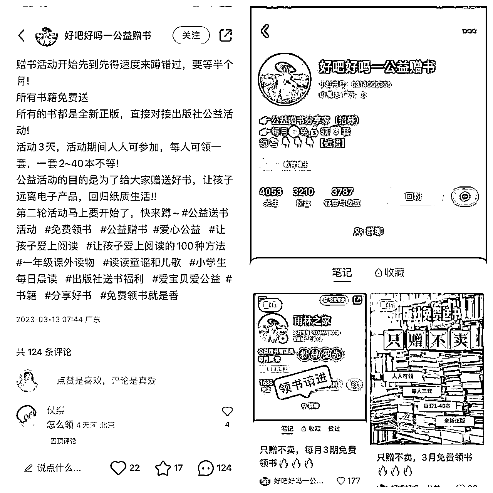</ne-card></ne-p> <ne-p id="u0d01c828" data-lake-id="u0d01c828"><ne-text id="u188052bb">现在引流，通过群里发海报+二维码，还是行得通。</ne-text></ne-p> <ne-p id="ua82001f2" data-lake-id="ua82001f2"><ne-card data-card-name="image" data-card-type="inline" id="GVr40" data-event-boundary="card"></ne-card></ne-p> <ne-p id="u57a3b314" data-lake-id="u57a3b314"><ne-text id="u331ea812">当我看到这个小程序，以为是拉新返佣，看到 15 的邮费，又认为官方靠邮费差价可以赚一波，结果，在公众号找到官网，想法完美绕开正确答案。</ne-text></ne-p> <ne-p id="udf37c75d" data-lake-id="udf37c75d"><ne-card data-card-name="image" data-card-type="inline" id="uCY8i" data-event-boundary="card"></ne-card></ne-p> <ne-p id="uaf49e059" data-lake-id="uaf49e059"><ne-text id="u27edd2a6" style="color: rgb(222, 120, 2);">产品服务</ne-text><ne-text id="uaf743407">：纸质书。</ne-text></ne-p> <ne-p id="u7cad7336" data-lake-id="u7cad7336"><ne-text id="u12a1000d" style="color: rgb(222, 120, 2);">变现模式</ne-text><ne-text id="uc4357ebd">：公益赠送平台发起，借推广形成小副业，团长通过在小红书发笔记，引流到微信，完成赠送，获得阶梯奖励佣金。</ne-text></ne-p> <ne-p id="u2e0eb886" data-lake-id="u2e0eb886"><ne-text id="u1b72d411" style="color: rgb(222, 120, 2);">赚钱思路：</ne-text><ne-text id="u5f09e209">加入送书分佣的队伍、通过送纸质书引流微信、直接卖纸质版资料、和线上打印店合作。</ne-text></ne-p> <ne-p id="uac37a3f0" data-lake-id="uac37a3f0"><ne-text id="uf4a988fc" style="color: rgb(222, 120, 2);">收益评估</ne-text><ne-text id="ucfc7f008">：如上图表格所示，送超一千套，可获千元佣金。</ne-text></ne-p> <ne-h4 id="51f83efd" data-lake-id="51f83efd"><ne-heading-ext><ne-heading-anchor></ne-heading-anchor><ne-heading-fold></ne-heading-fold></ne-heading-ext><ne-heading-content><ne-text id="ud41ef331" style="color: rgb(222, 120, 2);">④线下服务项目</ne-text></ne-heading-content></ne-h4> <ne-p id="ub2ee0c3a" data-lake-id="ub2ee0c3a"><ne-text id="uc2280a63">检索交友活动，我们挖到了这个账号。</ne-text></ne-p> <ne-p id="u21943a82" data-lake-id="u21943a82"><ne-card data-card-name="image" data-card-type="inline" id="knt7p" data-event-boundary="card">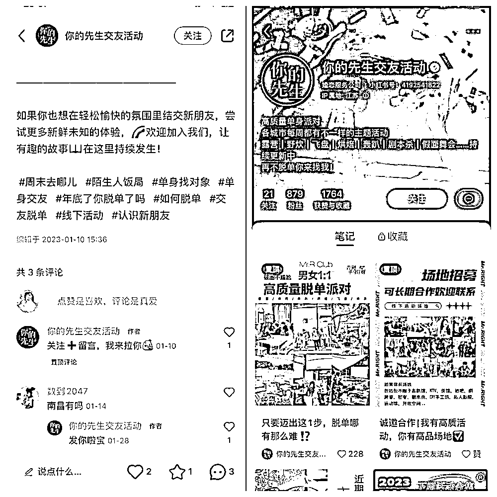</ne-card></ne-p> <ne-p id="uda3e63d9" data-lake-id="uda3e63d9"><ne-text id="u24a7119b">咱就是说，引流动作非常嚣张，忘了他是蓝标企业号，打扰了。</ne-text></ne-p> <ne-p id="u1fa0cd30" data-lake-id="u1fa0cd30"><ne-card data-card-name="image" data-card-type="inline" id="kCrDQ" data-event-boundary="card"></ne-card></ne-p> <ne-p id="u339a2e1e" data-lake-id="u339a2e1e"><ne-text id="uce9dc8d3">那么，这个线下服务项目，具体是怎样的呢？</ne-text></ne-p> <ne-p id="u6eb3769f" data-lake-id="u6eb3769f"><ne-text id="ucf291dd7" style="color: rgb(222, 120, 2);">产品服务</ne-text><ne-text id="u2935d2cf">：线下同城聚会活动。</ne-text></ne-p> <ne-p id="u028fbc71" data-lake-id="u028fbc71"><ne-text id="udc1f1094" style="color: rgb(222, 120, 2);">变现模式</ne-text><ne-text id="uc5d94bf3">：小红书发布笔记，获取曝光，引流到微信，主要以收费活动为主。</ne-text></ne-p> <ne-p id="u75001eef" data-lake-id="u75001eef"><ne-text id="u40116cd2" style="color: rgb(222, 120, 2);">赚钱思路：</ne-text><ne-text id="u0d277afc">成为活动组织者，一边线上流量获客收费，一边线下谈合作压价格，两头获利。</ne-text></ne-p> <ne-p id="u0c41b977" data-lake-id="u0c41b977"><ne-text id="ubbef14c3" style="color: rgb(222, 120, 2);">收益评估</ne-text><ne-text id="u9456dee3">：单人收费 100，假设有 50 人参加，就是 5000，减去活动成本和其他成本，最少还能赚一两千，和活动场地长期合作，或者自己线下本来就有这个业务，那就更得劲了。</ne-text></ne-p> <ne-p id="u812658c4" data-lake-id="u812658c4"><ne-text id="u276c7a1f">从鱼竿到肥鱼，总结起来就是：用评论区的关键词，找到大量笔记，通过笔记倒推相关产品，形成产品词库，取关键词在小红书上，找到正在赚钱的项目。</ne-text></ne-p> <ne-p id="uf21ea0ba" data-lake-id="uf21ea0ba"><ne-card data-card-name="image" data-card-type="inline" id="TNTNW" data-event-boundary="card"></ne-card></ne-p> <ne-p id="ufa2ca3e8" data-lake-id="ufa2ca3e8"><ne-text id="u28473bd9">在小红书上，下场第一步，是明确做什么赚钱，而正是这一步，卡住了绝大多数人，就在这时，我们祭出定位大法，但，它依然不能很好解决这个问题。</ne-text></ne-p> <ne-p id="uc4b548ee" data-lake-id="uc4b548ee"><ne-text id="ua9d4a7a7">于是，我看到，在小红书航海中，有人迷茫定位，不知道自己要选什么，有人做了定位，不知道具体要干什么，当然，更多人，是看到别人说什么小红书项目赚钱，就一窝蜂加入。</ne-text></ne-p> <ne-p id="ud830f5c6" data-lake-id="ud830f5c6"><ne-text id="u3adcc2f9">研读小红书风向标时，信息差这个词一直萦绕耳边，我突然意识到，当别人把赚钱项目分享出来的时候，你已经错过第一波红利了，更重要的是，当别人告诉你什么赚钱你就去做的时候，你的选择权其实已经被没收了。</ne-text></ne-p> <ne-p id="u0ef11b91" data-lake-id="u0ef11b91"><ne-text id="uee225701">在风向标航海中，看到了生财团队用心整理的 2000 多条风向标，突然，断裂的构想被打通，我真的借此挖掘到了大量不为人知的赚钱项目。</ne-text></ne-p> <ne-p id="ubda8aeb0" data-lake-id="ubda8aeb0"><ne-text id="u38d47c26">我真心希望，大家都拥有挖掘项目的能力，在千百条选择中，遇见最适合自己的项目，实践生财。</ne-text></ne-p> <ne-p id="u6ea7ea24" data-lake-id="u6ea7ea24"><ne-text id="u35415afd">所以，这一次，我把方法和项目都分享出来，把渔和鱼都给出来，让选择权都回到你们手上。</ne-text></ne-p> <ne-p id="u0fd7448b" data-lake-id="u0fd7448b"><ne-text id="u36caca26">今天的小红书分享就到这里，内容很干，希望能给到大家一些启发和帮助，坚持下去，你一定会有所收获。有帮助的话，记得点个赞哦~也欢迎交流+v：lyy520061</ne-text></ne-p> <ne-p id="u1e430f65" data-lake-id="u1e430f65"><ne-text id="u566d62b5">更多小红书干货，可以关注公众号：梨云读书</ne-text></ne-p> <ne-p id="ucfbabf1d" data-lake-id="ucfbabf1d"><ne-text id="ufd2b9e5f" ne-bold="true">往期精华文章推荐：</ne-text></ne-p> <ne-p id="u3fb1d916" data-lake-id="u3fb1d916"><ne-text id="u54adffad">《小红书 60 天用原创拿下 20 多篇 10w+，如何流程化创作爆款内容？》</ne-text></ne-p> <ne-p id="u9c92dac1" data-lake-id="u9c92dac1">[<ne-text id="uc44a0e2b">https://t.zsxq.com/09ev8Jjgj</ne-text>](https://t.zsxq.com/09ev8Jjgj)</ne-p> <ne-p id="uddd60b25" data-lake-id="uddd60b25"><ne-text id="ua8f17098">《小红书三个月涨粉 17w，变现 10w+，我做对什么？》</ne-text></ne-p> <ne-p id="u04555cc1" data-lake-id="u04555cc1">[<ne-text id="uc286aebc" ne-underline="true">https://t.zsxq.com/07Fqr3jQ7</ne-text>](https://t.zsxq.com/07Fqr3jQ7)</ne-p> <ne-p id="u4540fb1c" data-lake-id="u4540fb1c"><ne-text id="ucf0b868e">《小红书全是梨云绿，缺乏差异化，我慌了！用 1 周跑出新模式，0 粉也能频出千赞爆款》</ne-text></ne-p> <ne-p id="u45baa9ef" data-lake-id="u45baa9ef">[<ne-text id="uc8f7465a" ne-underline="true">https://t.zsxq.com/07ufE6IM7</ne-text>](https://t.zsxq.com/07ufE6IM7)</ne-p> <ne-p id="u379d5c4e" data-lake-id="u379d5c4e"><ne-text id="u8d9b67e9">《定位一换涨粉过万，如何利用数据分析在小红书精准定位》</ne-text></ne-p> <ne-p id="u44739328" data-lake-id="u44739328">[<ne-text id="u058d694c" ne-underline="true">https://t.zsxq.com/07Ts3wF1s</ne-text>](https://t.zsxq.com/07Ts3wF1s)</ne-p> <ne-hole id="u51d7ebef" data-lake-id="u51d7ebef"><ne-card data-card-name="hr" data-card-type="block" id="uo5X3" data-event-boundary="card"><ne-p id="ude26b9ba" data-lake-id="ude26b9ba"><ne-text id="u790d3c17">评论区：</ne-text></ne-p> <ne-p id="uf5b75af0" data-lake-id="uf5b75af0"><ne-text id="u8178d79d">大卫 : 强[强][强][强]</ne-text> <ne-text id="u69358e8c">陈大红 : 人才[发呆]</ne-text> <ne-text id="uab1dff36">Vera 芊迪 : 太强了，多读几遍[抱拳]</ne-text> <ne-text id="u6498a156">陈歪 : 高  实在是高</ne-text> <ne-text id="u4781ed42">常常 : 酒店里写的帖子，质量这么高么？[机智]</ne-text> <ne-text id="u61183ede">一风 : 太厉害啦！</ne-text> <ne-text id="u17ef445c">青青实操育儿 : 太棒了</ne-text> <ne-text id="u2127e9db">蝈蝈、 : “她真是变态，更了 400 条，我更变态，账号翻到底”，忍不住笑出声，点赞！</ne-text></ne-p></ne-card></ne-hole></ne-card></ne-p></ne-card></ne-p></ne-card></ne-p></ne-card></ne-p></ne-card></ne-p></ne-card></ne-p></ne-card></ne-p></ne-card></ne-p></ne-card></ne-p></ne-card></ne-p></ne-card></ne-p></ne-card></ne-p></ne-card></ne-p></ne-card></ne-p></ne-card></ne-p></ne-card></ne-p></ne-card></ne-p></ne-card></ne-card></ne-p></ne-card></ne-p></ne-card></ne-p>