# 《新手小白做同城水果团购，单日最高交易额破 9000+》

> 原文：[`www.yuque.com/for_lazy/thfiu8/komp7g3c11n2rf0p`](https://www.yuque.com/for_lazy/thfiu8/komp7g3c11n2rf0p)

## (84 赞)《新手小白做同城水果团购，单日最高交易额破 9000+》 

作者： 新发地水果小李哥 

日期：2023-03-21 

飞书阅读链接：[https://rd78y95zlu.feishu.cn/docx/RhH5dDOsfozdCbxpmmychDM6nad](https://rd78y95zlu.feishu.cn/docx/RhH5dDOsfozdCbxpmmychDM6nad) 

我是小李哥，山西人在北京。干了快10 年产品经理，大专毕业从创业公司一步步跳槽到大厂。 

曾一年打击超百万盗版内容，现替生财、优联荟、盗坤、痴海、猫不斩等大佬打击盗版。 

我哥在批发市场开档口，我自己做了多年线上，加上喜欢吃水果，今年决定开始做水果同城团购。 

这次分享一个刚接触快团团的新人，如何做到单日交易额破9000+ 

其实事情不难，找到正确的模式、方法，普通人也可以。比如我朋友媳妇宝妈一枚，按下面模式通过小红书引流，一周时间建立起一个微信群。 

### 一、实操 40+天成绩 

1）单日最高交易额破 9000+ 

  

2）40 天从 0 到 1 建立起 3 个水果团购群 

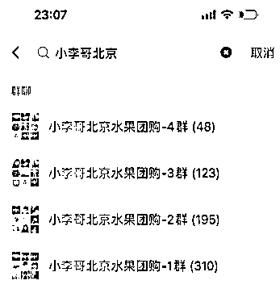  

3）最快一天建立一个 200 人群，当天出了 5 单 

  

4）手把手教朋友建立一个 300 人群 

  

5）收获 N 多好评 

（好评太多了，在最近 10 天里挑一些展示。以上评价绝对真实，不少生财圈友在里边） 

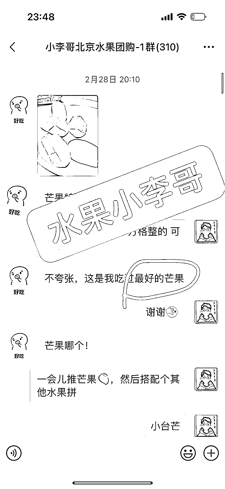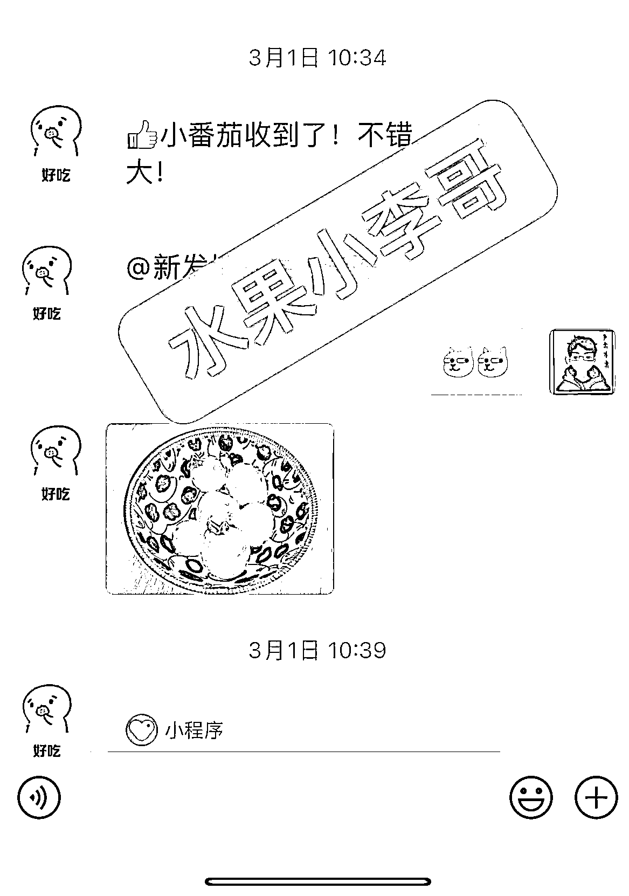  

6）有幸给本期小航海做了一次分享，并作为快团团水果的供应链 

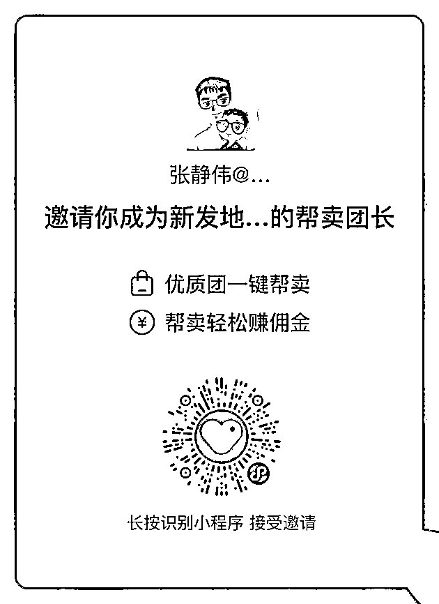  

### 二、为什么做水果团购 

（一）毛利更高 

水果店的毛利高能达到30%-50%左右，而我们从一级批发市场直发，省去中间商环节。并且没有水果店的成本，毛利更高！ 

（二）刚需、高频、复购强 

1）水果刚需，每个人都要吃。 

2）水果品类多，不断有新的应季水果上线，用户选择多购买频次自然高。 

3）水果消耗快，只要好吃用户复购非常强。现在非水果旺季，用户月复购率仍在38%。（实际复购率更高，因为这个数据没有考虑近一周新拓客户下单，他们水果未吃完，短时间内不会复购情况） 

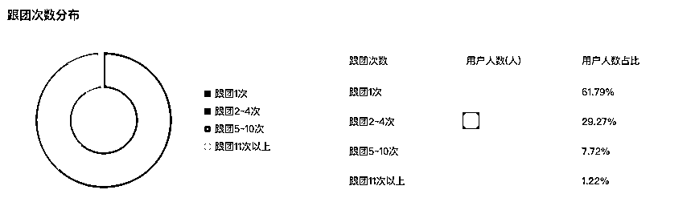  

（三）因为有积累、有复利 

积累的群、好友会随着时间越来越多，收入也将稳定提升。拓展并维系好一个客户后面会带来源源不断的收入。 

（四）供应链有优势 

我哥在全国最大的农产品一级批发市场，高碑店新发地（首衡）开水果档口，在供应链方面有足够的优势。 

### 三、为什么做“同城水果团购” <ne-oli><ne-oli-i>1</ne-oli-i><ne-oli-c class="ne-oli-content" id="uee4c7a43" data-lake-id="uee4c7a43">同城水果团购是通过在公域平台发布内容（特别是小红书），引流到微信内售卖。</ne-oli-c></ne-oli> <ne-oli><ne-oli-i>2</ne-oli-i><ne-oli-c class="ne-oli-content" id="u611c948a" data-lake-id="u611c948a">相比微商团购起步更容易，微信好友数少也可以做。</ne-oli-c></ne-oli> <ne-oli><ne-oli-i>3</ne-oli-i><ne-oli-c class="ne-oli-content" id="u40624a49" data-lake-id="u40624a49">相比小区团购没有区域的限制，这种想象空间更高，做的范围也更广。</ne-oli-c></ne-oli> 

（一）启动简单 

微商式团购： <ne-oli><ne-oli-i>1</ne-oli-i><ne-oli-c class="ne-oli-content" id="ue39ce966" data-lake-id="ue39ce966">启动难。前期需要一定数量的好友，好友数少很难赚到钱。用户从看到、实际下单有非常大的转化漏斗。</ne-oli-c></ne-oli> <ne-oli><ne-oli-i>2</ne-oli-i><ne-oli-c class="ne-oli-content" id="u4f784c61" data-lake-id="u4f784c61">熟人购买，好友关系上加了一层利益，影响原先的朋友关系。</ne-oli-c></ne-oli> 

同城水果团购： <ne-oli><ne-oli-i>1</ne-oli-i><ne-oli-c class="ne-oli-content" id="u78001bd1" data-lake-id="u78001bd1">对好友数没有要求，更多的是从“小红书”公域平台引流好友。</ne-oli-c></ne-oli> <ne-oli><ne-oli-i>2</ne-oli-i><ne-oli-c class="ne-oli-content" id="u7da8d74b" data-lake-id="u7da8d74b">吸引陌生人购买，通过打造 IP 方式、晒单等等获取他们信任。</ne-oli-c></ne-oli> 

（二）投入成本低 <ne-oli><ne-oli-i>1</ne-oli-i><ne-oli-c class="ne-oli-content" id="u82981447" data-lake-id="u82981447">固定成本：前期无需租场地、装修店面等，只需要手机、WIFI 就可以。</ne-oli-c></ne-oli> <ne-oli><ne-oli-i>2</ne-oli-i><ne-oli-c class="ne-oli-content" id="u794e65de" data-lake-id="u794e65de">时间成本：前期新手每天 5-6 小时，碎片化时间即可。</ne-oli-c></ne-oli> <ne-oli><ne-oli-i>3</ne-oli-i><ne-oli-c class="ne-oli-content" id="u0a9e0fb5" data-lake-id="u0a9e0fb5">做了之后发现，宝妈做更有优势，不论是拍照引流、微信群运营等等，比男同胞有太多优势。</ne-oli-c></ne-oli> 

（三）微信私域是大趋势 <ne-oli><ne-oli-i>1</ne-oli-i><ne-oli-c class="ne-oli-content" id="ub351a024" data-lake-id="ub351a024">微信有非常多触达用户方式，在微信里做水果团购，复购真的非常好。</ne-oli-c></ne-oli> <ne-oli><ne-oli-i>2</ne-oli-i><ne-oli-c class="ne-oli-content" id="uccce7b6d" data-lake-id="uccce7b6d">用户养成习惯后，很多是静默下单，因为有信任不需要你再次去销售。</ne-oli-c></ne-oli> <ne-oli><ne-oli-i>3</ne-oli-i><ne-oli-c class="ne-oli-content" id="u1d3d60da" data-lake-id="u1d3d60da">随着时间越长积累的好友、群越多，利润也将不断提升。</ne-oli-c></ne-oli> 

### 四、如何实操 

吸引用户后通过运营手段卖品质好易复购的产品。这件事情有三个关键点：流量、产品、转化。 

（一）关于流量 

1\. 为什么先从小红书开始做流量，小红书目前属于非常大的红利期： <ne-oli><ne-oli-i>1</ne-oli-i><ne-oli-c class="ne-oli-content" id="u79b6b792" data-lake-id="u79b6b792">越来越多人用小红书：小红书从 1 亿月活到将近 3 亿月活，只用了不到两年时间。用户增长非常快，但写内容的人还没那么多，平台会给新手很多流量扶持。</ne-oli-c></ne-oli> <ne-oli><ne-oli-i>1</ne-oli-i><ne-oli-c class="ne-oli-content" id="uc81a155c" data-lake-id="uc81a155c">天然的种草平台：用户看到相关内容更容易去消费。而且有能力去消费，50%来自一二线城市。</ne-oli-c></ne-oli> 

案例：这篇内容讲的是水果市场情况，没有任何难度。评论区引爆，都是问怎么购买、进群之类的。一个 300 人微信群一周建立起来。 

  <ne-oli><ne-oli-i>1</ne-oli-i><ne-oli-c class="ne-oli-content" id="ubab2ab00" data-lake-id="ubab2ab00">小白快速上手：图文形式的创造，创作门槛低，对文字没有字数要求，重要是好看的图</ne-oli-c></ne-oli> <ne-oli><ne-oli-i>2</ne-oli-i><ne-oli-c class="ne-oli-content" id="u51ca1fed" data-lake-id="u51ca1fed">平台对中小创作者友好，就算0 粉丝也有机会做爆款。</ne-oli-c></ne-oli> 

下面是我 0 粉账号做到了 1.5 万赞。还在持续涨粉中。 

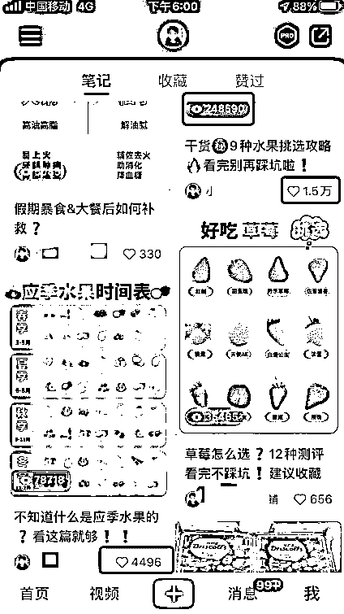  

2\. 小红书上卖水果的优势 <ne-oli><ne-oli-i>1</ne-oli-i><ne-oli-c class="ne-oli-content" id="ub0b6d706" data-lake-id="ub0b6d706">女性人群。吸引的是年轻女性，与买水果的人群非常契合，大部分有意向消费</ne-oli-c></ne-oli> <ne-oli><ne-oli-i>2</ne-oli-i><ne-oli-c class="ne-oli-content" id="udfe7bcf7" data-lake-id="udfe7bcf7">高消费群体。只要商品好能持续满足她们需求便会持续复购，有能力消费</ne-oli-c></ne-oli> <ne-oli><ne-oli-i>3</ne-oli-i><ne-oli-c class="ne-oli-content" id="u28c8eb7e" data-lake-id="u28c8eb7e">颜值即正义。水果能摆拍出非常好看的照片，吸引小红书用户，引起冲动消费</ne-oli-c></ne-oli> 

3\. 实操小红书关键点：选题和引流 

3.1 如何选题？ 

通过爬虫快速筛选出最新、有效的模版/选题，然后去模仿超越。用这种方式我爆了非常多的内容，拿两个案例说明下： 

模版一：应季水果 

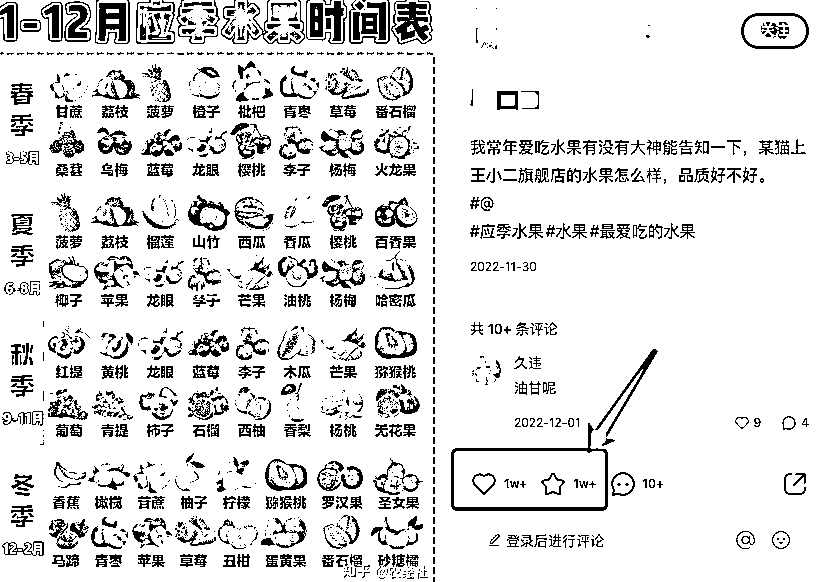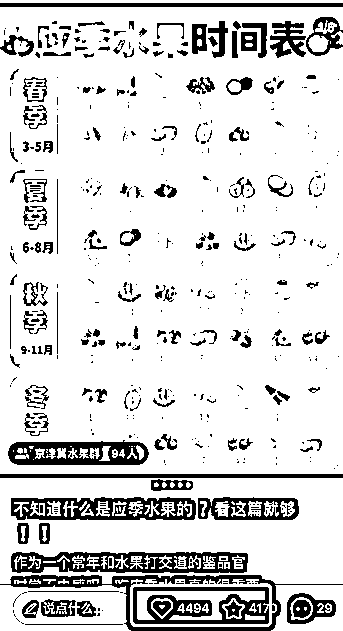  

模版二：挑水果小技巧 

  

3.2 有选题/模版后，具体怎么做？ 

1）找到业务相关话题词，如水果、团购等 

2）用后裔采集器爬前 500 条数据（不想自己爬的小伙伴私我，我给你现成的数据） 

3）从一条条数据里找到共性，选题、模版共性。重点看低粉高赞、低粉高评论的内容 

4）按照模板 1:1 发（把对方图片放到软件上，图层放到最底下。然后在上面开始创作，模仿位置、字号、文案、颜色、图片等等） 

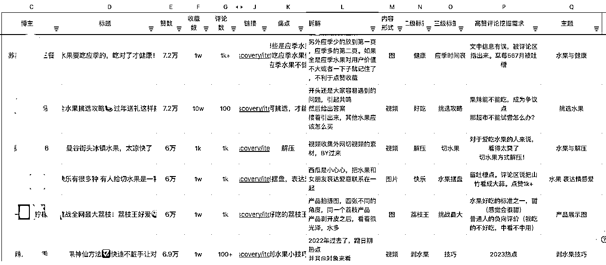  

 这些爬虫数据可以免费分享 

3.3 如何引流私域？ 

1）建小红书群->>笔记下边挂群->>群里拿小号定时发微信 

2）个人主页@小号->>小号主页简介引导“看第一个笔记”->>第一个笔记中留联系方式 

3） 对于在评论的流量->>私信对方->>让对方先发自己的联系方式（注意不要一个话术重复使用） 

4\. 其他引流方式 

线下广告、同群引流、快递店合作等等，以后有机会再讲。 

（二）关于产品 

我对产品宁缺毋滥，宁可不卖，也不会卖出质量差的水果。当有好货时立马上狂推，货不好时坚决不卖。 

1）关于选品方面 

选品很关键，但更重要的选好品要找到好货！！ <ne-oli><ne-oli-i>1</ne-oli-i><ne-oli-c class="ne-oli-content" id="ud67af13c" data-lake-id="ud67af13c">好的水果需要抢</ne-oli-c></ne-oli> 

我们每天 6 点多到市场，发现好吃的水果，我们会先买下来。然后发起团购卖出去，如果起的晚一点货很容易没有。 <ne-oli><ne-oli-i>1</ne-oli-i><ne-oli-c class="ne-oli-content" id="u30bb8b04" data-lake-id="u30bb8b04">低价引流水果</ne-oli-c></ne-oli> 

引流款水果，我们自己打包来压缩成本，这样价格更有优势。（比如贝贝南瓜去定制包装、自己打包） <ne-oli><ne-oli-i>1</ne-oli-i><ne-oli-c class="ne-oli-content" id="u450967df" data-lake-id="u450967df">上架时机</ne-oli-c></ne-oli> 

有的应季水果不是到季节就上，而是应季水果好吃了再上。比如现在是沃柑季节，不一定要立马上品，要等市场有好货时再上。什么时候有好货，就需要每天去转市场来定。 <ne-oli><ne-oli-i>1</ne-oli-i><ne-oli-c class="ne-oli-content" id="uedf86f8e" data-lake-id="uedf86f8e">价格实时变动</ne-oli-c></ne-oli> 

价格变动是一级市场传导到二级市场、三级市场，再到水果店。我们每天会跑一级市场询问价格，根据市场情况随时调整售卖价格。极端情况出现进价比售价高，也有用户薅羊毛的情况（这 40 天碰到过 2、3 次） 

2）关于水果的套路 

我哥自己开档口，对卖水果套路非常了解，可以避免踩很多坑。 

比如阿克苏苹果行业潜规则，两层礼盒第一层放好果（又大又好吃），第二层次果（品相口感一般）。但在市场上也有上下一致的，价格差距也不大，就看你能不能找到。 

类似的这种坑只能靠时间经验去积累沉淀，而我哥的这种经验我可以直接用。 

3）关于品质售后 <ne-oli><ne-oli-i>1</ne-oli-i><ne-oli-c class="ne-oli-content" id="ua27911c9" data-lake-id="ua27911c9">挑好水果</ne-oli-c></ne-oli> 

在挑水果方面有很多年的积累，知道什么水果怎么挑、新鲜度如何 

已筛选出多家靠谱供应商，但水果一批货与一批货口感略微有差异，所以每次发团前都会试吃，品质满意再发货，不满意不发货 <ne-oli><ne-oli-i>1</ne-oli-i><ne-oli-c class="ne-oli-content" id="udf45a623" data-lake-id="udf45a623">水果新鲜</ne-oli-c></ne-oli> 

用户昨天下单，今天采集最新鲜的货，当天发出。 

京东快递在京津冀隔日送达。杭州南昌今天发货，后天可送到。 <ne-oli><ne-oli-i>1</ne-oli-i><ne-oli-c class="ne-oli-content" id="u24a9c886" data-lake-id="u24a9c886">售后有保障</ne-oli-c></ne-oli> 

水果非常容易售后，拆分原因解决： 

采货质量把控。对我来说好解决。我们自己在一级市场现采，把控品质从源头杜绝坏果。也杜绝对存放时间久、质量不好的果，防止在快递途中腐烂。 

快递途中破损。我们在包装上摸索出一套规律。什么水果多包几层、什么水果垫纸片、什么水果放冰袋。 

其他原因破损。发快团团红包。尽可能降低占用的时间成本，还能吸引客户再次下单。 

我无法保证以后不会踩坑，但是踩坑有售后，且踩坑次数一定不多。 

4）关于价格方面 

我们价格平均比水果店至少低 20%左右。因为从一级市场拿货，省去中间商赚差价。另外成本低，线上流量获取和维护，没有店面、员工等成本； 

案例： 

粑粑柑（我们 7.6 元/斤，水果店 12 元/斤，连锁超市 9.68 元/斤） 

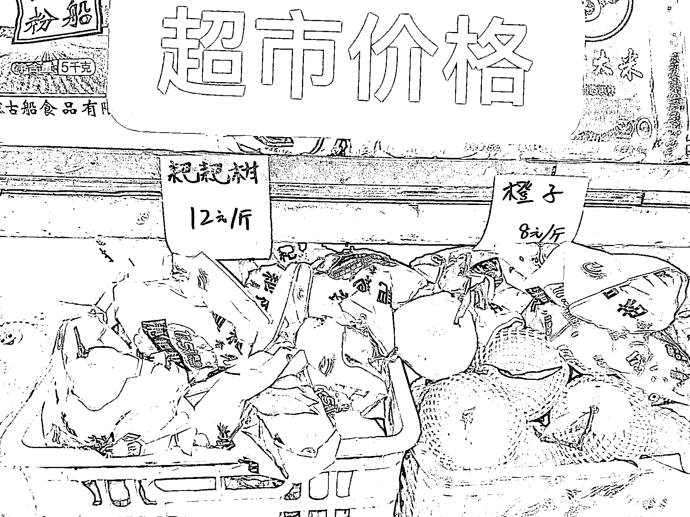  

小台芒（我们价格 9.7 元/斤，超市 11.68 元/斤。每次发的小台芒都现采货，需要提前找商家预定，保证新鲜） 

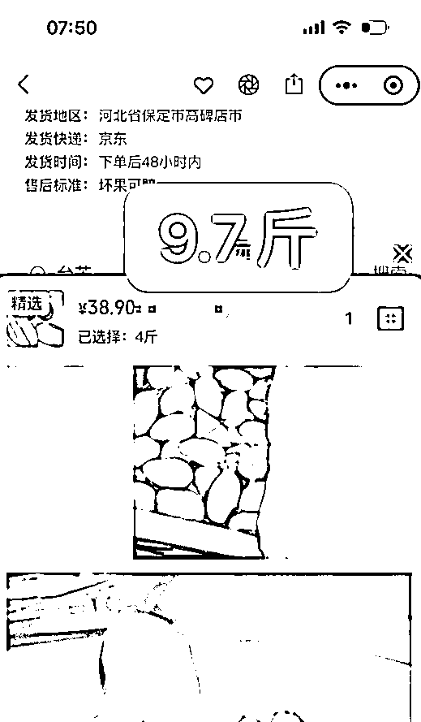  

伦晚（我们 6.65 元/斤，超市 9.98 元/斤） 

  

（三）社群转化 

我性格内向，不善于活跃气氛、引发话题。但我现在的社群氛围还不错。我认为两点：真诚（无套路）、靠产品（水果）打动人心。这两个是道，其他都是技巧。 <ne-oli><ne-oli-i>1</ne-oli-i><ne-oli-c class="ne-oli-content" id="ua572336e" data-lake-id="ua572336e">真诚</ne-oli-c></ne-oli> 

真诚的目的是什么？为了获取信任。如何快速获取信任？「移木建信」 

通过一个小的承诺，并快速实现承诺，让大家觉得你是言而有信之人。 

成员达到 xx 人发 xxx 红包，建立新群时我习惯用这种方式，真诚、没有套路，简单粗暴、大家都喜欢。 

小提示：千万不能在宣传时以红包为目的吸引进群，比如这群里有红包大家来领之类的话。另外还要把拉人抢红包的人都踢出去。 

类似体现真诚的技巧还有很多。 <ne-oli><ne-oli-i>1</ne-oli-i><ne-oli-c class="ne-oli-content" id="ue52231c4" data-lake-id="ue52231c4">产品质量好，用户自发通过口碑拉人</ne-oli-c></ne-oli> 

 <ne-oli><ne-oli-i>1</ne-oli-i><ne-oli-c class="ne-oli-content" id="ud82b8512" data-lake-id="ud82b8512">其他小技巧</ne-oli-c></ne-oli> 

1）购买后引导将下单小程序分享群里 

2）收货后引导晒图 

3）加好友后，发一段互动的话（增加联系）、之前群聊晒单记录、下单链接、送一张优惠券 

4）通过活动来做转化：猜价格活动，猜对可获得商品。且其他人能以这个价格购买。突出商品的优惠力度 <ne-oli><ne-oli-i>1</ne-oli-i><ne-oli-c class="ne-oli-content" id="u4f478dba" data-lake-id="u4f478dba">未来</ne-oli-c></ne-oli> 

现在群运营马上SOP 流程化了，每个群发布同样的话术即可。以后每次上品我会编辑好文案、实拍水果图发布到群内。大家按照格式转发即可。 

### 五、结尾 <ne-oli><ne-oli-i>1</ne-oli-i><ne-oli-c class="ne-oli-content" id="ub26a5475" data-lake-id="ub26a5475">我为什么做 B 端？</ne-oli-c></ne-oli> 

供应链量大后价格才能更有优势，前期主要靠刷脸拿低价（不可持久）。但 C 端起量是个漫长的过程。起量快速的办法是找 B 端团长，所以后面我会专心做好供应链。 <ne-oli><ne-oli-i>1</ne-oli-i><ne-oli-c class="ne-oli-content" id="u2309bff9" data-lake-id="u2309bff9">为什么要先做 C 端再做 B 端？</ne-oli-c></ne-oli> 

做 C 端目的是为了知道团长是怎么干的，才能更好服务他们。同时以后会保留 1-3 个 C 端群，方便拿到用户第一时间对水果的反馈 <ne-oli><ne-oli-i>1</ne-oli-i><ne-oli-c class="ne-oli-content" id="ub70104ac" data-lake-id="ub70104ac">如何合作共赢？</ne-oli-c></ne-oli> 

我把控供应链，做好文案、卖点、素材，而你只需要负责引流、积累自己的私域、维护自己的客户。 

感谢生财。加入生财后，我收获太多了！如果不是生财，我人生可能是另外一个方向。 

加入 TikTok 训练营，第一次有了十几万粉丝的帐号，而且不止一个账号 

通过亦仁，Clubhouse 一天引流百人好友 

通过生财精华帖找龙珠圈友请教，实操线下拉新，从中获得一个小反馈，被曹大加精。水果团购技能点又能用上【[https://articles.zsxq.com/id_c783tpjgr725.html](https://articles.zsxq.com/id_c783tpjgr725.html)】 

加入淘宝蓝海，日常躺赚几百 

加入小红书航海，一个月变现上万 

通过风向标，ChatGPT 一周变现小 1 万【[https://articles.zsxq.com/id_f0qr7mv3bt2z.html](https://articles.zsxq.com/id_f0qr7mv3bt2z.html)】 

通过生财，给我介绍的维权客户 

收获太多太多了！！ 

最后一句话结尾：用心做好每一件事情。 

评论区： 

念十一｜战略 : 这个四五线小城市是不是需求不太行 人间开心果、 : 里面水果是不是略显贵了些。 Annia Shaw* : 请问怎么拿到你手上那个爬虫数据  [微笑]谢谢 徐来 : 方便加 v 吗？想接一下资源 新发地水果小李哥 : 私 新发地水果小李哥 : 私我发你 新发地水果小李哥 : 没一二线好做 重生 Break : IT 人转行做水果单日破 9000  给你点赞。。。