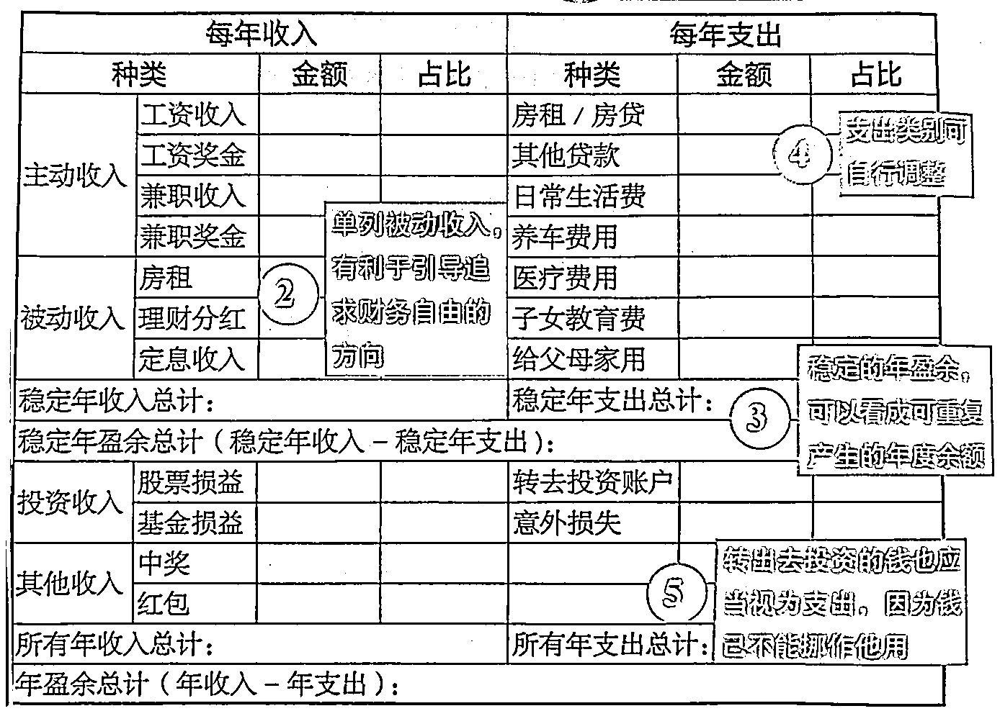

# 《适合毕业 3 年内职场人的小白理财操作指南》

> 原文：[`www.yuque.com/for_lazy/thfiu8/xcy353kztprctgo6`](https://www.yuque.com/for_lazy/thfiu8/xcy353kztprctgo6)

<ne-h2 id="d68e678f" data-lake-id="d68e678f"><ne-heading-ext><ne-heading-anchor></ne-heading-anchor><ne-heading-fold></ne-heading-fold></ne-heading-ext><ne-heading-content><ne-text id="u7284fe33">(68 赞)《适合毕业 3 年内职场人的小白理财操作指南》</ne-text></ne-heading-content></ne-h2> <ne-p id="u07ab3da1" data-lake-id="u07ab3da1"><ne-text id="u4d69a020">作者： 矿山</ne-text></ne-p> <ne-p id="ue4120827" data-lake-id="ue4120827"><ne-text id="u44bd20b4">日期：2023-03-21</ne-text></ne-p> <ne-p id="u9f7a80e1" data-lake-id="u9f7a80e1"><ne-text id="u3a9fec54">第一次在星球分享，诚意之作。从去年 6 月开始，我开启了持续 9 个月不间断的每日记账&理财，感觉到对生活的掌控感显著增强。</ne-text><ne-text id="ue244fb9f" ne-bold="true">写下这篇操作指南，希望帮你增强对生活的掌控感。</ne-text></ne-p> <ne-p id="u9a24318c" data-lake-id="u9a24318c"><ne-text id="u941203b5">全文链接：https://www.wolai.com/nC6APzh5jnBKqaqXcYe9cd</ne-text></ne-p> <ne-p id="u9ba9a9e1" data-lake-id="u9ba9a9e1"><ne-text id="u6ee7c800">本文适合哪些人：</ne-text></ne-p> <ne-p id="u0c7bb26a" data-lake-id="u0c7bb26a"><ne-text id="uaef6b349">- 0-3 岁职场新人，缺少基础的理财框架</ne-text></ne-p> <ne-p id="u608b1bab" data-lake-id="u608b1bab"><ne-text id="u88524746">- 对个人财务状况感到焦虑，但又无从下手</ne-text></ne-p> <ne-p id="u583b3242" data-lake-id="u583b3242"><ne-text id="ub5d0c73d">本文不会涉及：具体的理财投资建议，包括基金、股票等。</ne-text></ne-p> <ne-p id="ucb0c8c85" data-lake-id="ucb0c8c85"><ne-text id="u62ac0e77">本文结构如下：</ne-text></ne-p> <ne-p id="uda5d38ab" data-lake-id="uda5d38ab"><ne-text id="u13ed3ebd">- 心态篇：</ne-text></ne-p> <ne-p id="u4fcd4d17" data-lake-id="u4fcd4d17"><ne-text id="uae2214f6">   - 为什么要理财？</ne-text></ne-p> <ne-p id="u38f63fec" data-lake-id="u38f63fec"><ne-text id="ua6c22d7f">   - 为什么屡屡记账失败？</ne-text></ne-p> <ne-p id="u94fb162d" data-lake-id="u94fb162d"><ne-text id="u04125448">- 操作篇：</ne-text></ne-p> <ne-p id="u7dc82b72" data-lake-id="u7dc82b72"><ne-text id="u48cb90d3">   - 第一步：像经营企业一样经营自己，构建个人收支资产负债模型</ne-text></ne-p> <ne-p id="uc30bd167" data-lake-id="uc30bd167"><ne-text id="u84ff0c99">   - 第二步：设定目标，输出 todo list，坚定执行</ne-text></ne-p> <ne-p id="u7ed21cc0" data-lake-id="u7ed21cc0"><ne-text id="udcd3a3ba">- 加餐篇：</ne-text></ne-p> <ne-p id="u218f540a" data-lake-id="u218f540a"><ne-text id="ubd0979b5">   - 想要提升理财认知，书单&公众号&播客推荐</ne-text></ne-p> <ne-p id="uc0c00438" data-lake-id="uc0c00438"><ne-text id="ub929fbd8">   - 重要的领域知识，建议你主动学习</ne-text></ne-p> <ne-h1 id="04a179e1" data-lake-id="04a179e1"><ne-heading-ext><ne-heading-anchor></ne-heading-anchor><ne-heading-fold></ne-heading-fold></ne-heading-ext><ne-heading-content><ne-text id="u52bffe7f">一、心态篇：为什么要理财？为什么屡屡记账失败？</ne-text></ne-heading-content></ne-h1> <ne-p id="u9979b5b8" data-lake-id="u9979b5b8"><ne-text id="u2260b877">「你不理财，财不理你」，日常关于理财的重要性已经被说烂了，但是很多人依然不够重视。</ne-text></ne-p> <ne-p id="u59e3c239" data-lake-id="u59e3c239"><ne-text id="u71c0ea4d">①二八法则，投入大量时间在关键事情上</ne-text></ne-p> <ne-p id="uc28e9996" data-lake-id="uc28e9996"><ne-text id="u99c0c3aa">分享一段知行小酒馆播客 E76 的一段话：</ne-text></ne-p> <ne-p id="u41e9ed25" data-lake-id="u41e9ed25"><ne-text id="ucaaf163d">"房地产的资产占比一个中国家庭超过 60%-70%的，但是大多数人在买房上投入的精力却十分有限，他们愿意在点奶茶时花 10 分钟看用户评价选哪款好喝，却不愿意每天花 10 分钟关注楼盘信息。"</ne-text></ne-p> <ne-p id="ubb73b318" data-lake-id="ubb73b318"><ne-text id="u247b4f63">二八法则告诉我们，20%的事情重要性超过 80%。我们来算个数：一个打工人年工作日 250 天，日均打工 8 小时，除去睡眠 8 小时，占可支配时间的 50%。**因此，打工占我们一年可支配精力的 34.7%**(250/360*50%)。作为一个没有梦想的打工人，我们认为打工就是为了赚钱花。</ne-text></ne-p> <ne-p id="ua224701e" data-lake-id="ua224701e"><ne-text id="u80d868ae">**所以，我们一年起码投入了 34.7%时间在赚钱上，最终的产出就是金钱。因此金钱的管理，就是那 20%重要的事情。**我们愿意花 10 分钟挑奶茶，那么更应该愿意每天投入 10 分钟在理财上，而这仅占一天时间的 0.7%.</ne-text></ne-p> <ne-p id="u5c147678" data-lake-id="u5c147678"><ne-text id="u45886697">②"焦虑的反义词，是具体"</ne-text></ne-p> <ne-p id="u7935ec61" data-lake-id="u7935ec61"><ne-text id="uc7179e40">「焦虑」可能是近两年大家都无法逃避的状态，大多关于工作和发展。我们焦虑的到底是什么？是失业？没有升职的机会？焦虑的反义词，是具体。很多时候我们焦虑，恰恰是因为我们问题不聚焦，答案不清晰。</ne-text></ne-p> <ne-p id="u1b7f1a17" data-lake-id="u1b7f1a17"><ne-text id="u0eedefbf">我把职场焦虑定性为：如果我被裁了，能活多久？量化一下，就是：我现有的流动资金，在失去工作收入的情况下，可以撑几个月？</ne-text></ne-p> <ne-p id="u604cb8b0" data-lake-id="u604cb8b0"><ne-text id="ufaf8d411">为了让答案变清晰，我们需要做的，就是构建个人收支资产负债模型（第二部分展开）。行动起来，化不确定的焦虑为确定的资金流问题，盘清楚，逐渐增强属于你的生活掌控感。</ne-text></ne-p> <ne-p id="ud40470c7" data-lake-id="ud40470c7"><ne-text id="uffa40230">③为什么屡屡记账失败？</ne-text></ne-p> <ne-p id="u9995c3c2" data-lake-id="u9995c3c2"><ne-text id="ub4e9a8ba">记账是我整个操作指南的基石，大多数人都尝试过记账，但是失败了。根据动力-阻力模型，我们放弃坚持，是因为动力<阻力。需要增强动力，减少阻力。关于增强动力部分，上面两个小节做了补充，重点讲讲如何减少阻力。</ne-text></ne-p> <ne-p id="ud444b9a1" data-lake-id="ud444b9a1"><ne-text id="uf43314d6">阻力一：记账麻烦</ne-text></ne-p> <ne-p id="u0662b54e" data-lake-id="u0662b54e"><ne-text id="u2b4e77a9">解决方案：</ne-text></ne-p> <ne-p id="u2c75d337" data-lake-id="u2c75d337"><ne-text id="u827fab99">- 统一支出账户（我把所有支出都放在支付宝，避免现金&微信等渠道支出），定期查看支付宝账单即可</ne-text></ne-p> <ne-p id="u8c36e926" data-lake-id="u8c36e926"><ne-text id="u12c46932">- 固定节点操作：可以每天晚上 10 点，也可以每周日晚，固话成习惯</ne-text></ne-p> <ne-p id="uce97c5a8" data-lake-id="uce97c5a8"><ne-text id="u25674724">- 挑选趁手工具：我用的是鲨鱼记账 app，所有数据必须汇总在这里</ne-text></ne-p> <ne-p id="u9db96907" data-lake-id="u9db96907"><ne-text id="u53570bb0">阻力二：自我批判</ne-text></ne-p> <ne-p id="ub8d68fe5" data-lake-id="ub8d68fe5"><ne-text id="u3ee45813">这个阻力是很多人忽视的，当人隐隐觉得自己财务状况堪忧时，反而拒绝去认清现状，逃避现实，因为不想承认自己的短板。希望你不要自我批评和责怪，主动承担责任的勇气，已经超过了大部分人。</ne-text></ne-p> <ne-h1 id="69fab478" data-lake-id="69fab478"><ne-heading-ext><ne-heading-anchor></ne-heading-anchor><ne-heading-fold></ne-heading-fold></ne-heading-ext><ne-heading-content><ne-text id="uc239b89f">二、操作篇</ne-text></ne-heading-content></ne-h1> <ne-p id="u9c3d4273" data-lake-id="u9c3d4273"><ne-text id="u37cb49c0">第一步：像经营企业一样经营自己，构建个人收支资产负债模型</ne-text></ne-p> <ne-p id="u7c1ac066" data-lake-id="u7c1ac066"><ne-text id="u4c376cb0">在前司字节跳动工作时，飞书的 slogan 让我印象深刻：Develop a company as a product，像打造产品一样经营公司。我想说的是：像经营企业一样经营自己。背后的一个共性，是构建起收支&资产负债模型，这是第一步，也是最重要的一步，教你认清事实。</ne-text></ne-p> <ne-p id="u2ed780fb" data-lake-id="u2ed780fb"><ne-text id="u079b3ff9">首先：构建我们的资产负债表，直接上图</ne-text></ne-p> <ne-p id="u91e70e3a" data-lake-id="u91e70e3a"><ne-card data-card-name="image" data-card-type="inline" id="Sp5kL" data-event-boundary="card"></ne-card></ne-p> <ne-p id="u12294c68" data-lake-id="u12294c68"><ne-text id="u9e75c354">第一大列是资产，第二大列是负债，计算出资产总计和负债总计后相减，就是净资产。细项这里不赘述了，任何一个名词不懂的，小红书搜一下。</ne-text></ne-p> <ne-p id="u918f83de" data-lake-id="u918f83de"><ne-text id="u6087bde8">**重要提醒：现在立刻马上，打开 excel，掏出手机，追溯各资金账户情况，把每一个数字填入进去。**</ne-text></ne-p> <ne-p id="u80816f3a" data-lake-id="u80816f3a"><ne-text id="u516715c3">接着：构建我们的现金流量表，直接上图</ne-text></ne-p> <ne-p id="uea42347c" data-lake-id="uea42347c"><ne-card data-card-name="image" data-card-type="inline" id="dCNhb" data-event-boundary="card">  <ne-p id="u4a3a2f97" data-lake-id="u4a3a2f97"><ne-text id="u5d1f2fd4">同理，计算出年收入和年支出后，相减就是年盈余。</ne-text></ne-p> <ne-p id="u1366776d" data-lake-id="u1366776d"><ne-text id="uf3c003c6">统计收入应该没难度，重点是统计年支出时，大家很难有全的数据，这里给个建议：</ne-text></ne-p> <ne-p id="uad7cc520" data-lake-id="uad7cc520"><ne-text id="uaf92ecda">支出可以分为年度大额支出和月度常规支出。年度大额支出，包括养车、父母家用、旅游、医疗，一定要翻账本搞清楚；月度常规支出如果不清楚，从现在开始记账，连续一个月，数据就有了。</ne-text></ne-p> <ne-p id="u34408e2d" data-lake-id="u34408e2d"><ne-text id="ud7752315">如果这一步遇到困难不要放弃，不用追求 100%的精确，完成比完美更重要。</ne-text></ne-p> <ne-p id="ud79a70df" data-lake-id="ud79a70df"><ne-text id="u96b56e06">完成了这一步，你已经秒杀大多数理财小白了，你清楚自己现在到底几斤几两。我们回到开始关于焦虑的讨论：被裁后，我能活多久？拿流动资产/月支出，就是你的底线。</ne-text></ne-p> <ne-p id="u0e179936" data-lake-id="u0e179936"><ne-text id="u25fd225f">然后，构建个人收支资产负债模型，内容来自所长林超的《开窍》，这个牛逼了！</ne-text></ne-p> <ne-p id="ue8afaeca" data-lake-id="ue8afaeca"><ne-text id="u0ebd8ad9">我们需要知道，自己现在的情况，究竟是好是坏，下一步怎么调整？这本书将人分为四类：无产无债者、无产有债者、有产有债者、高产低债者。</ne-text></ne-p> <ne-p id="uf2bddd79" data-lake-id="uf2bddd79"><ne-text id="u706bd9ea">- 无产无债者：典型的月光族，也是职场小白的高频情况，每月的收入基本上全都流向支出，没有资产积累，也没有什么负债。</ne-text></ne-p> <ne-p id="ua8230c49" data-lake-id="ua8230c49"><ne-text id="u04a3025b">- 无产有债者：最糟糕的 case，每月收入除了用于支出外，还额外产生了负债。这部分人有旺盛的物欲，喜欢消费超出能力范围之外的奢侈品，可能还要借钱度日。</ne-text></ne-p> <ne-p id="uc113e0bb" data-lake-id="uc113e0bb"><ne-text id="u4cd0acb1">- 有产有债者：收入以工资为主，一部分转化为资产，一部分转化为负债，3 年以上的职场人比较常见。他们有额外可支配的收入用于投资基金等，也会贷款买房、买车，产生沉重的负债。</ne-text></ne-p> <ne-p id="u2713f6b7" data-lake-id="u2713f6b7"><ne-text id="ue424bfb2">- 高产低债者：收入主要用于购买资产，这部分资产反过来会产生收入。他们较少购买不良资产产生高额负债（如没有投资价值的房子）。</ne-text></ne-p> <ne-p id="u131eeefa" data-lake-id="u131eeefa"><ne-text id="ubd00116f" ne-bold="true">无论你属于哪一类，我们的共同目标是，成为高产低债者，这就是我们第二步的目标。</ne-text></ne-p> <ne-p id="u845bf555" data-lake-id="u845bf555"><ne-text id="u6b533cf5">## 第二步：明确目标和 todo，坚定执行和复盘</ne-text></ne-p> <ne-p id="u6cf1bb24" data-lake-id="u6cf1bb24"><ne-text id="ufa3dfb30">能看到这里，你又秒杀了大部分人，因为很少有人能耐心的看到这里。第一步我们知道了，我们的目标是成为高产低债者，具体怎么做呢？</ne-text></ne-p> <ne-p id="u58a0f87f" data-lake-id="u58a0f87f"><ne-text id="u06eefc11">直接给出操作框架：</ne-text></ne-p> <ne-p id="u8c6d372c" data-lake-id="u8c6d372c"><ne-text id="u250fce5e">- 提高收入：努力工作升职加薪，积极拓展副业收入，适当投资</ne-text></ne-p> <ne-p id="uf07849dd" data-lake-id="uf07849dd"><ne-text id="uec484d6e">- 控制支出：明确月支出预算，每日、每周、每月记账，控制不要超支，重要！</ne-text></ne-p> <ne-p id="u2a8e94fc" data-lake-id="u2a8e94fc"><ne-text id="u50ff8ce8">①提高收入</ne-text></ne-p> <ne-p id="uc9c01010" data-lake-id="uc9c01010"><ne-text id="ua28ff99c">工作升职加薪、拓展副业，不在本次内容范围。**重点讲讲适当投资**，怎么入门，给出两种框架。</ne-text></ne-p> <ne-p id="u89661f24" data-lake-id="u89661f24"><ne-text id="u959a9a8a">一，四笔钱框架。按照个人资产总体占比比例</ne-text></ne-p> <ne-p id="ub4378fa2" data-lake-id="ub4378fa2"><ne-text id="uab92f177">- 保本的钱（40%，投资国债、年金等，用于养老&教育）</ne-text></ne-p> <ne-p id="u1d65ef19" data-lake-id="u1d65ef19"><ne-text id="u7fb01d07">- 投资的钱（30%，投资股票、基金等风险产品）</ne-text></ne-p> <ne-p id="u51f1a932" data-lake-id="u51f1a932"><ne-text id="u858ea50f">- 保险的钱（20%，购买保险，应对意外状况）</ne-text></ne-p> <ne-p id="u87500da7" data-lake-id="u87500da7"><ne-text id="u1c808dd0">- 要花的钱（10%，现金或余额宝等，覆盖 3-6 个月生活费）</ne-text></ne-p> <ne-p id="u83fefa26" data-lake-id="u83fefa26"><ne-text id="u29b5035b">二、100-年龄分配法</ne-text></ne-p> <ne-p id="ub4e9b7cf" data-lake-id="ub4e9b7cf"><ne-text id="u861ae9dd">原理来自公众号《银行螺丝钉》，假设你目前 25 岁：</ne-text></ne-p> <ne-p id="u6b33ee2a" data-lake-id="u6b33ee2a"><ne-text id="ua54c91d4">- 用 100-25=75%的比例投资相对高波动、追求高收益的种类，如指数基金，长期持有 3-5 年</ne-text></ne-p> <ne-p id="ube42ba42" data-lake-id="ube42ba42"><ne-text id="u3d0a5063">- 用 25%的比例投资相对低波动的种类，如债券基金，建议持有 1 年以上</ne-text></ne-p> <ne-p id="ue4661edb" data-lake-id="ue4661edb"><ne-text id="ud41a5041">确定好框架后，去挑选具体的投资品种，选择投资时间，操作投资。因为本人投资年限不久，暂时不给出更细节的操作，可以小红书或公众号搜索关键字，了解更具体方式。我个人投的是投顾类产品，相当于把钱交给机构，他帮你买好一揽子不错的基金组合。</ne-text></ne-p> <ne-p id="u86b685b4" data-lake-id="u86b685b4"><ne-text id="u4b81a8d2">②控制支出</ne-text></ne-p> <ne-p id="ud31793c6" data-lake-id="ud31793c6"><ne-text id="u30881a5f">控制支出分三个环节：</ne-text></ne-p> <ne-p id="u5b2b0aa8" data-lake-id="u5b2b0aa8"><ne-text id="u19792fb7">- 开支分类，理清开支现状</ne-text></ne-p> <ne-p id="u535a15e0" data-lake-id="u535a15e0"><ne-text id="u9d30275c">- 设定储蓄率目标，分类制定预算额度</ne-text></ne-p> <ne-p id="u7fdd59dc" data-lake-id="u7fdd59dc"><ne-text id="uaa22fc8e">- 严控开支、持续记账和复盘</ne-text></ne-p> <ne-p id="udca87ee7" data-lake-id="udca87ee7"><ne-text id="u4e697dc2">首先，将开支分为月度开支（每个月肯定会产生的开支）和年度开支（不定时产生的大额开支），并把个人实际数据理清</ne-text></ne-p> <ne-p id="u9870ae3a" data-lake-id="u9870ae3a"><ne-text id="u90f3c96d">- 月度开支分类建议：餐饮、房租&房贷、社交娱乐、日用、交通、服饰美容</ne-text></ne-p> <ne-p id="u2600395d" data-lake-id="u2600395d"><ne-text id="udde1d31a">- 年度开支分类建议：旅游、父母家用、医疗、其他</ne-text></ne-p> <ne-p id="u21a12318" data-lake-id="u21a12318"><ne-text id="u0dcadb90">接着，设定月储蓄率目标。储蓄率的平均目标是 35%（不考虑房贷），把它作为最低标准。后续逐步调高到 50%。</ne-text></ne-p> <ne-p id="u83d6f093" data-lake-id="u83d6f093"><ne-text id="ue4ebe7be">月度可支配收入*（1-储蓄率），就是你每个月开支的上限。针对月度开支的弹性部分（非固定数额），比如餐饮、社交娱乐、服饰美容，设定严格的支出限额，像房租这种很难短期调整。</ne-text></ne-p> <ne-p id="u53711436" data-lake-id="u53711436"><ne-text id="uacdf12c1">最后，每个月复盘当月的支出情况，实际储蓄率是否达到预期，如果超过了，是哪一部分支出的问题，下个月是否可以避免，还是必须调低储蓄率的目标。</ne-text></ne-p> <ne-p id="ud3b0d072" data-lake-id="ud3b0d072"><ne-text id="u2404cbad" ne-bold="true">小结：牢记 35%储蓄率的目标，坚定执行。做不到这个，注定难以奠定好的基础。</ne-text></ne-p> <ne-p id="ua3816cb0" data-lake-id="ua3816cb0"><ne-text id="u7b8f35f4">③每个月 review 两张表</ne-text></ne-p> <ne-p id="u0e38d742" data-lake-id="u0e38d742"><ne-text id="u44f911a7">在每个月更新现金流量表的基础上，同步更新资产负债表，你会更直观地看到，每个月扎扎实实控制的开支，如何最终体现在净资产的增长上。将每月净资产、收入、支出三个指标汇总到折线图中，会看到时间的力量。</ne-text></ne-p> <ne-p id="u368885a2" data-lake-id="u368885a2"><ne-text id="ua1640e56">小结：</ne-text></ne-p> <ne-p id="u6df05334" data-lake-id="u6df05334"><ne-text id="u77417f1e">首先，理清出个人的收支资产模型，认清现状</ne-text></ne-p> <ne-p id="ufec45467" data-lake-id="ufec45467"><ne-text id="u040bb503">接着，尝试提高收入、降低支出，严格遵守储蓄率目标</ne-text></ne-p> <ne-p id="uc278ec61" data-lake-id="uc278ec61"><ne-text id="u1dfc0946">**最后，每个月更新个人的两张表：资产负债/现金流量表，你会看着增长曲线随着日积月累，给你带来更多生活的底气。**</ne-text></ne-p> <ne-h1 id="36de5cfc" data-lake-id="36de5cfc"><ne-heading-ext><ne-heading-anchor></ne-heading-anchor><ne-heading-fold></ne-heading-fold></ne-heading-ext><ne-heading-content><ne-text id="u9723ce95">三、加餐篇：如何提升财商</ne-text></ne-heading-content></ne-h1> <ne-p id="ue9cd08c5" data-lake-id="ue9cd08c5"><ne-text id="u8d25f93d">3.1 想要提升理财认知，书单&公众号&播客推荐</ne-text></ne-p> <ne-p id="u742b0710" data-lake-id="u742b0710"><ne-text id="u9074e39b">- 书单：《要钱还是要生活》、《穷爸爸富爸爸》、《指数基金投资指南》</ne-text></ne-p> <ne-p id="ucb0869aa" data-lake-id="ucb0869aa"><ne-text id="u9acfa3c4">- 公众号：银行螺丝钉（含投资操作 SOP）、也谈钱</ne-text></ne-p> <ne-p id="u3b3ecdc8" data-lake-id="u3b3ecdc8"><ne-text id="u6113c852">- 播客：知行小酒馆、保持通话</ne-text></ne-p> <ne-p id="u79002dca" data-lake-id="u79002dca"><ne-text id="u7f4688f7">- 少数派：一个内容社区，里面关于如何记账&理财有很多高手在分享</ne-text></ne-p> <ne-p id="u3b72c79d" data-lake-id="u3b72c79d"><ne-text id="u115fb1fa">3.2 重要的领域知识，建议你主动学习</ne-text></ne-p> <ne-p id="u2e3641d2" data-lake-id="u2e3641d2"><ne-text id="uc45e4e52">- 四金体系：了解每个月工资中交的税，到底去了哪？哪些是税，哪些是后续会返回给我们的保障？</ne-text></ne-p> <ne-p id="ua7594b15" data-lake-id="ua7594b15"><ne-text id="u9edd61d6">- 公积金：了解公积金的使用方法，起码得知道，公积金是可以取出来的一笔大额的钱。</ne-text></ne-p> <ne-p id="u8ab2349f" data-lake-id="u8ab2349f"><ne-text id="u97902616">- 相关政策：如杭州 E 类人才、租房补贴、年度个税申报到底是个啥，如何申报可以赚更多钱</ne-text></ne-p> <ne-p id="u9a65f4e9" data-lake-id="u9a65f4e9"><ne-text id="u799b32dc">- 信用卡体系：了解怎么薅信用卡福利、合理使用降低年费等</ne-text></ne-p> <ne-p id="u851e7c52" data-lake-id="u851e7c52"><ne-text id="u8ad0483e">都看到这里了，点个赞吧</ne-text></ne-p> <ne-hole id="ucedf95a4" data-lake-id="ucedf95a4"><ne-card data-card-name="hr" data-card-type="block" id="aWnIB" data-event-boundary="card"><ne-p id="u96146a8a" data-lake-id="u96146a8a"><ne-text id="u92824184">评论区：</ne-text></ne-p> <ne-p id="u99afb922" data-lake-id="u99afb922"><ne-text id="u30b94fd2">王小义 : 很赞 我现在就在薅信用卡福利，🤭</ne-text> <ne-text id="u8072ff6d">矿山 : 感谢认可[呲牙]</ne-text> <ne-text id="u876d159b">有容乃大 : 怎么撸</ne-text> <ne-text id="u251d84aa">南鹄 : 厉害。向你学习！目前也在每月记账，使用的松鼠记账。也是看了富爸爸之后开始了行动。同时还参加了心灵财富公益组织每周举办的 富爸爸现金流游戏。收益颇多。作为一个程序员，连初会教材都已经开啃了。😂😂</ne-text> <ne-text id="u79f44277">茶白。 : 我也一直用鲨鱼记账，截止到今天 1138 天，看过《穷爸爸富爸爸》、《指数基金投资指南》，刚记账那会儿关注的银行螺丝钉，目前还没实现财务自由，不过明显增强对生活的掌控感，也确实减少了购物欲。</ne-text> <ne-text id="u38845d90">A℡zoe : 用鲨鱼记账两个月养成了记录的习惯，手机扫码支付花钱没有概念，有了每笔记录后可以更好的优化支出</ne-text> <ne-text id="u34fd8108">西琪💫 : 谢谢分享～</ne-text> <ne-text id="u8b2f2aa9">写得非常全面了，大赞给你！</ne-text> <ne-text id="u6e20c3f7">矿山 : 信用卡这块我也不专业，可以星球内搜一搜</ne-text></ne-p></ne-card></ne-hole></ne-card></ne-p>