# 《从 0 开始做家庭教育赛道，累计私域好友 2000+，课程营收纯利润 25W+》

> 原文：[`www.yuque.com/for_lazy/thfiu8/hz382crsb4az7gsv`](https://www.yuque.com/for_lazy/thfiu8/hz382crsb4az7gsv)

<ne-h2 id="5f3b5786" data-lake-id="5f3b5786"><ne-heading-ext><ne-heading-anchor></ne-heading-anchor><ne-heading-fold></ne-heading-fold></ne-heading-ext><ne-heading-content><ne-text id="u459fc319">(115 赞)《从 0 开始做家庭教育赛道，累计私域好友 2000+，课程营收纯利润 25W+》</ne-text></ne-heading-content></ne-h2> <ne-p id="u56079159" data-lake-id="u56079159"><ne-text id="u73ef887e">作者： 杨晶晶</ne-text></ne-p> <ne-p id="u5b4d5bac" data-lake-id="u5b4d5bac"><ne-text id="uba8c4b76">日期：2023-03-24</ne-text></ne-p> <ne-p id="u6d432723" data-lake-id="u6d432723"><ne-text id="u5a0f9a21">不知道大家有没有发现，现在越来越多的家长特别重视家庭教育，解决</ne-text><ne-text id="u5b69812c" style="color: rgb(31, 35, 41);">孩子的成长、教育等问题成为家长们的首要，但因为很多家长对成长教育并不熟悉，他们更倾向于找专家寻求帮助。</ne-text></ne-p> <ne-p id="uca5a508c" data-lake-id="uca5a508c"><ne-text id="ue274afa2">这就是做家庭教育赛道的机遇，我们可以搭建一个能够满足家长个性化、多样化的服务产品，以高客单的知识付费形式进行私域引流，帮助他们解决在教育孩子过程中遇到各种问题，比如养成孩子的好习惯、亲子关系的缓和、选择好学校等等。</ne-text></ne-p> <ne-p id="ue11ee8cb" data-lake-id="ue11ee8cb"><ne-text id="u7cb56a94">一旦家长们认为你的产品是有价值的，就可以实现变现，接下来，我将和大家分享我是怎么从 0 开始做家庭教育赛道的。</ne-text></ne-p> <ne-p id="u6eb6bca1" data-lake-id="u6eb6bca1"><ne-text id="ua58e2c5a" style="color: rgb(31, 35, 41);">大家好，我是杨晶晶，一位家庭教育赛道的初级创业者，2022 年 418 加入生财。</ne-text></ne-p> <ne-p id="u7ae75646" data-lake-id="u7ae75646"><ne-text id="u6d06fdf9" style="color: rgb(31, 35, 41);">之前一直在观望知识付费，一直没入手，从 2021 年 10 月开启了家庭教育赛道的创业，目前共计营收 25 万，基本上是纯利润，这篇文章主要从以下五个方面来开展：</ne-text></ne-p> <ne-p id="u9520e53e" data-lake-id="u9520e53e"><ne-text id="ub963964c" ne-bold="true">1.我选择家庭教育赛道的过程</ne-text></ne-p> <ne-p id="u3096da90" data-lake-id="u3096da90"><ne-text id="u0c93768d" ne-bold="true">2.产品和服务的设计思路</ne-text></ne-p> <ne-p id="u2836c5a3" data-lake-id="u2836c5a3"><ne-text id="u15da7dd3" ne-bold="true">3.流量来源</ne-text></ne-p> <ne-p id="u88ed9120" data-lake-id="u88ed9120"><ne-text id="ufbe8c77f" ne-bold="true">4.转化变现</ne-text></ne-p> <ne-p id="u8f18864c" data-lake-id="u8f18864c"><ne-text id="u88806459" ne-bold="true">5.我们指导学员发展副业的思路</ne-text></ne-p> <ne-p id="ue450fce5" data-lake-id="ue450fce5"><ne-card data-card-name="image" data-card-type="inline" id="G6GTd" data-event-boundary="card">  <ne-h1 id="4e667809" data-lake-id="4e667809"><ne-heading-ext><ne-heading-anchor></ne-heading-anchor><ne-heading-fold></ne-heading-fold></ne-heading-ext><ne-heading-content><ne-text id="ud716dbce" ne-bold="true">一、我选择家庭教育赛道的过程</ne-text></ne-heading-content></ne-h1> <ne-h2 id="3fde889d" data-lake-id="3fde889d"><ne-heading-ext><ne-heading-anchor></ne-heading-anchor><ne-heading-fold></ne-heading-fold></ne-heading-ext><ne-heading-content><ne-text id="u8237dd8b" ne-bold="true">（1）出发点：热爱</ne-text></ne-heading-content></ne-h2> <ne-p id="u52270436" data-lake-id="u52270436"><ne-text id="ua588b565" style="color: rgb(31, 35, 41);">我选择家庭教育的出发点很简单，就是热爱。其实我没孩子的时候，也是不少师妹的“知心姐姐”。</ne-text></ne-p> <ne-p id="u51a8cce8" data-lake-id="u51a8cce8"><ne-text id="ub54de28b" style="color: rgb(31, 35, 41);">从有孩子开始，就有许多热情去研究怎么养孩子，从一开始研究怎么安排疫苗，孩子生病了怎么护理，到辅食怎么添加，怎么搭配营养，再开始研究绘本，陪孩子读书，分享亲子阅读的经验。</ne-text></ne-p> <ne-p id="ud01e2f6c" data-lake-id="ud01e2f6c"><ne-text id="ue38df574" style="color: rgb(31, 35, 41);">再后来开始学习更广泛的家庭教育课程，跟越来越多的爸爸妈妈沟通、分享、答疑解惑，那些你不知不觉就投入了时间精力金钱的事儿，就是热爱。</ne-text></ne-p> <ne-p id="u8e374952" data-lake-id="u8e374952"><ne-text id="u9f1a3c93" style="color: rgb(31, 35, 41);">就像生财日历去年 1 月 9 日的话题：如何找到自己的使命和热情？</ne-text></ne-p> <ne-p id="ud935ccb2" data-lake-id="ud935ccb2"><ne-text id="u4e810116" style="color: rgb(31, 35, 41);">判断是否真心喜欢的两个角度：</ne-text></ne-p> <ne-p id="uc2d75408" data-lake-id="uc2d75408"><ne-text id="u6f8f66fa" style="color: rgb(31, 35, 41);">1）从你的爱好里筛选，找到你最感兴趣、坚持最久的事情。</ne-text></ne-p> <ne-p id="uc636a3d4" data-lake-id="uc636a3d4"><ne-text id="u4563f4fc" style="color: rgb(31, 35, 41);">2）想想有没有你贴钱也要去做的事情。</ne-text></ne-p> <ne-p id="u840d25f5" data-lake-id="u840d25f5"><ne-card data-card-name="image" data-card-type="inline" id="PRyBE" data-event-boundary="card">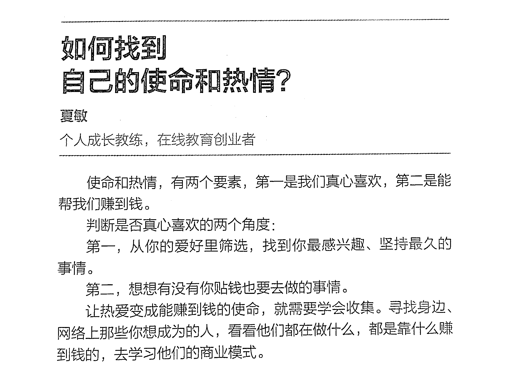</ne-card></ne-p> <ne-p id="u9bfc27a2" data-lake-id="u9bfc27a2"><ne-text id="u43573a5e" style="color: rgb(31, 35, 41);">（图片来源于 2022 年《生财日历》）</ne-text></ne-p> <ne-p id="u14bd3b54" data-lake-id="u14bd3b54"><ne-text id="ue3d31016" style="color: rgb(31, 35, 41);">后来，关注知识付费，看到了三圈交集定位法，既然热爱这么明显，那接下来就是衡量自己的优势和市场需求了。（图）</ne-text></ne-p> <ne-p id="u7ea246a2" data-lake-id="u7ea246a2"><ne-card data-card-name="image" data-card-type="inline" id="hWdXS" data-event-boundary="card">  <ne-h2 id="4fe8b9dd" data-lake-id="4fe8b9dd"><ne-heading-ext><ne-heading-anchor></ne-heading-anchor><ne-heading-fold></ne-heading-fold></ne-heading-ext><ne-heading-content></ne-heading-content></ne-h2><ne-h2 id="1d7d0bca" data-lake-id="1d7d0bca"><ne-heading-ext><ne-heading-anchor></ne-heading-anchor><ne-heading-fold></ne-heading-fold></ne-heading-ext><ne-heading-content><ne-text id="u36c9b1bd" ne-bold="true">（2）优势</ne-text></ne-heading-content></ne-h2> <ne-p id="ucd793a88" data-lake-id="ucd793a88"><ne-text id="u885121a5" style="color: rgb(31, 35, 41);">能支持我干家庭教育的优势到底有什么？一开始，我是这么梳理自己的优势的：</ne-text></ne-p> <ne-p id="uee5edbd6" data-lake-id="uee5edbd6"><ne-text id="u69f0c84e" style="color: rgb(31, 35, 41);">985 本硕毕业，教育背景好</ne-text></ne-p> <ne-p id="ua1a6a470" data-lake-id="ua1a6a470"><ne-text id="ub725597d" style="color: rgb(31, 35, 41);">擅长学习，喜欢的事情能深入研究</ne-text></ne-p> <ne-p id="ua4d609d8" data-lake-id="ua4d609d8"><ne-text id="ud9604e6a" style="color: rgb(31, 35, 41);">做事细心，人靠谱</ne-text></ne-p> <ne-p id="u15ccd163" data-lake-id="u15ccd163"><ne-text id="uf37f89c1" style="color: rgb(31, 35, 41);">但是，这些太空洞了。跟我能不能干家庭教育，看起来关系不大。这些所谓优势，干啥都行，也可能干啥都不咋行。</ne-text></ne-p> <ne-p id="u40a24b7e" data-lake-id="u40a24b7e"><ne-text id="uadbe4cd8" style="color: rgb(31, 35, 41);">那后来我又做了什么呢？我做了盖洛普优势测试，书写了近 20 年的成就事件，写了一段时间的优势观察日记。（图）在这个过程中，也回想了很多具体的事件。于是我发现，我的优势大概是：</ne-text></ne-p> <ne-p id="u5b1136f1" data-lake-id="u5b1136f1"><ne-text id="u42047b46" style="color: rgb(31, 35, 41);">① 名校背景做家庭教育，让人觉得信任度较高</ne-text></ne-p> <ne-p id="uc4c59345" data-lake-id="uc4c59345"><ne-text id="uc103812e" style="color: rgb(31, 35, 41);">② 我更爱分享和讨论家庭教育话题，生活里每天发生那么多事儿，我就关注家庭教育话题多，愿意为此写点啥或者说点啥，并且希望更多人看到听到，当然，在这个过程中，收到了很多反馈，这让我知道，有一些人原因听我关于家庭教育的分享，有问题愿意来找我帮助他们。</ne-text></ne-p> <ne-p id="u93a4ab6e" data-lake-id="u93a4ab6e"><ne-text id="ub25e6661" style="color: rgb(31, 35, 41);">③ 在帮助家长教育好孩子，缓解自身养育焦虑，解决实际问题这件事儿上，收获的正反馈，让我特别有成就感、满足感、价值感。</ne-text></ne-p> <ne-p id="u6d85d79b" data-lake-id="u6d85d79b"><ne-text id="u2e52b693" style="color: rgb(31, 35, 41);">比如，有家长反馈，孩子从每天睡前要看动画片，变成了每天睡前主动拿绘本让妈妈读，比如，有朋友因为跟老公教育理念不合经常怄气，到放下焦虑跳出了抱怨，比如，天天因为孩子写作业墨迹忍不住上火发脾气，到找到了解决问题的办法然后母慈子孝……</ne-text></ne-p> <ne-p id="u8561d049" data-lake-id="u8561d049"><ne-text id="u11a73f5c" style="color: rgb(31, 35, 41);">这些反馈都让我特别开心和满足。这些正反馈，一方面说明我有能力为别人解决这方面问题，另一方面，也说明我的满足点在这里，我可以专注持续的做下去。</ne-text></ne-p> <ne-p id="u370a620b" data-lake-id="u370a620b"><ne-text id="ue0d376bf" style="color: rgb(31, 35, 41);">④ 也因为擅长学习，关联能力比较强，细心，对喜欢的事情能深入研究，这些优势，使得我在分享和讨论家庭教育问题的时候，能够做到学以致用，而不是空谈理论。</ne-text></ne-p> <ne-p id="ua39a91a7" data-lake-id="ua39a91a7"><ne-text id="ubfdeda21" style="color: rgb(31, 35, 41);">这一点，非常适合家庭教育这门实操专业。比如：有学员觉得他教育理念很好，但是孩子理解不了，那通过一些具体的事件，我可以分析出来，不是孩子理解不了，是他没有用对方法，并且给他举例，对的方法怎么操作。</ne-text></ne-p> <ne-p id="udcf8fa73" data-lake-id="udcf8fa73"><ne-text id="uc6e27e3a" style="color: rgb(31, 35, 41);">从我的经验里，我发现所谓的优势需要放在具体场景里去具体化，这样的优势可以拿来判断自己是不是具有从事这一行的优势。</ne-text></ne-p> <ne-p id="u23bbde4b" data-lake-id="u23bbde4b"><ne-text id="uedcbb8ae" style="color: rgb(31, 35, 41);">所以，后来我是这么梳理自己的优势的：</ne-text></ne-p> <ne-p id="udbc98262" data-lake-id="udbc98262"><ne-text id="ubbd805d3" style="color: rgb(31, 35, 41);">① 教育背景好，这个标签要用，容易收获信任</ne-text></ne-p> <ne-p id="u3a4705ee" data-lake-id="u3a4705ee"><ne-text id="u3a47bf16" style="color: rgb(31, 35, 41);">② 擅长学习，细心，喜欢的事情能深入研究，可以帮助他人学以致用收到实效</ne-text></ne-p> <ne-p id="u79df733b" data-lake-id="u79df733b"><ne-text id="u7c3989e6" style="color: rgb(31, 35, 41);">③ 经过多年混迹妈妈群、自建妈妈群的经历，我发现我有解决家庭教育问题的能力</ne-text></ne-p> <ne-p id="u370c713e" data-lake-id="u370c713e"><ne-text id="u78f93953" style="color: rgb(31, 35, 41);">④ 帮别人解决家庭教育问题我所获得的满足感大于其他事情上获得的满足感</ne-text></ne-p> <ne-p id="ud951fc2f" data-lake-id="ud951fc2f"><ne-text id="u1053e655" style="color: rgb(31, 35, 41);">生财日历 2 月 22 日的主题就是《怎样发现自己的优势》（作者：醒醒），其中说到了四个发现优势的思路，是非常实用的四条建议。</ne-text></ne-p> <ne-p id="u65d5113a" data-lake-id="u65d5113a"><ne-card data-card-name="image" data-card-type="inline" id="cYVsx" data-event-boundary="card">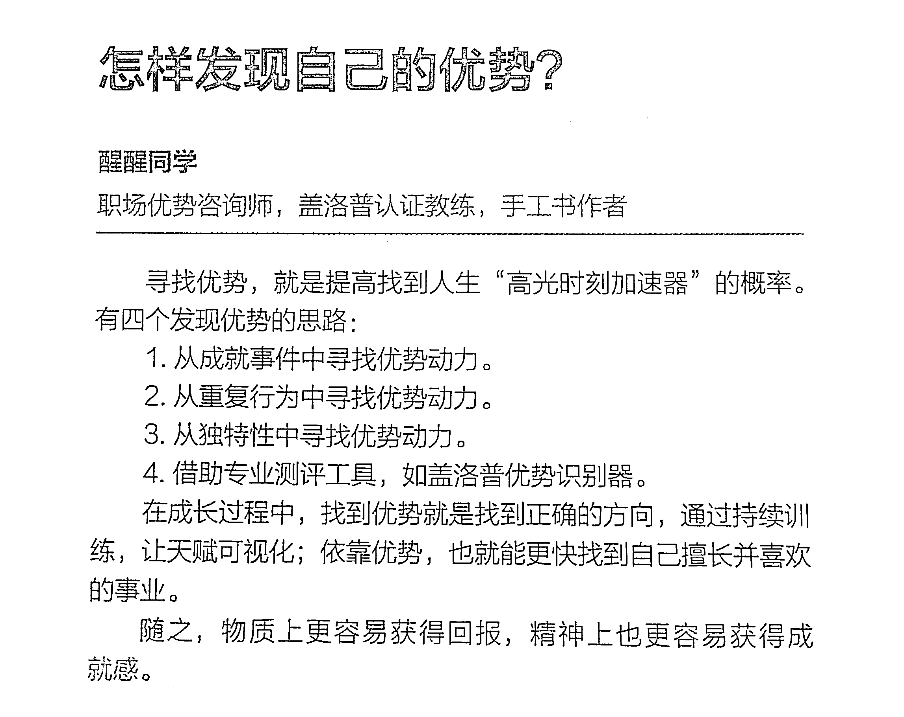</ne-card></ne-p> <ne-p id="ub921d933" data-lake-id="ub921d933"><ne-text id="u45b44793" style="color: rgb(31, 35, 41);">（图片来源于 2022 年《生财日历》）</ne-text></ne-p> <ne-h2 id="f6d01cd8" data-lake-id="f6d01cd8"><ne-heading-ext><ne-heading-anchor></ne-heading-anchor><ne-heading-fold></ne-heading-fold></ne-heading-ext><ne-heading-content><ne-text id="u98fa54ff" ne-bold="true">（3）市场需求</ne-text></ne-heading-content></ne-h2> <ne-p id="u79944a8a" data-lake-id="u79944a8a"><ne-text id="ud3407c68" style="color: rgb(31, 35, 41);">从我这几年线上线下的学习过程中，在感性上是看好家庭教育的，可是，做事业，感觉很重要也不能全凭感觉。于是，我当时做了一些行业调研工作，分享给大家，希望能给对家庭教育赛道感兴趣的朋友提供一些借鉴。</ne-text></ne-p> <ne-p id="uc31b52ec" data-lake-id="uc31b52ec"><ne-text id="u4ee65b28" style="color: rgb(31, 35, 41);">有一个公众号叫做“发现报告”，是一个研报平台，集成各行业研究报告和数据，是我主要使用的研究工具。</ne-text></ne-p> <ne-p id="u263d29d0" data-lake-id="u263d29d0"><ne-card data-card-name="image" data-card-type="inline" id="Y4wRf" data-event-boundary="card">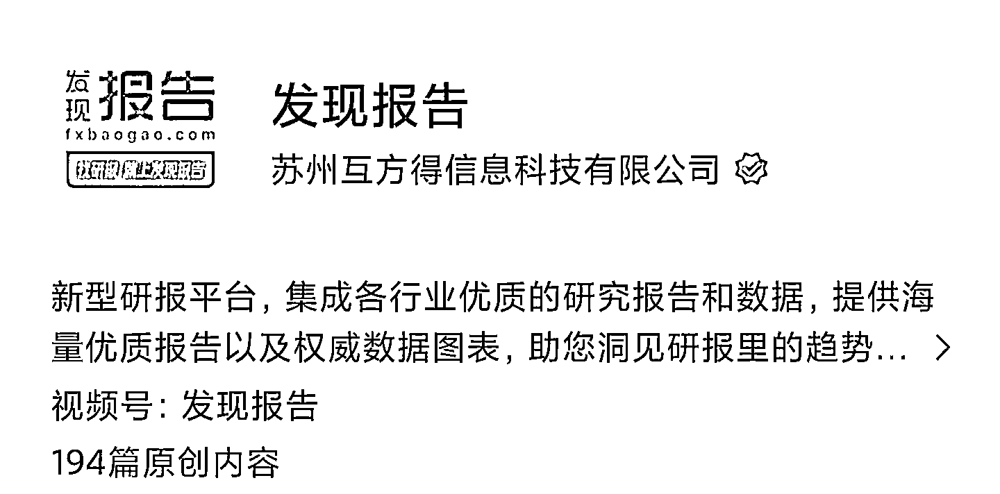</ne-card></ne-p> <ne-p id="u0c6448eb" data-lake-id="u0c6448eb"><ne-text id="ud9707c37" style="color: rgb(31, 35, 41);">2022 年，国家素质及家庭教育类政策持续完善，推进家校社协同育人，从“双减”政策出台，到 2022 年 1 月《家庭教育促进法》颁布，</ne-text></ne-p> <ne-p id="u4eba0f4e" data-lake-id="u4eba0f4e"><ne-text id="u4d8928cd" style="color: rgb(31, 35, 41);">2022 年 4 月《关于指导推进家庭教育的 5 年规划》，为教育行业带来一些改变，以前的教育重点是培养成绩优异的优秀学子，现在则逐渐转而重视培养合格家长，帮助家长更好的了解孩子，最终实现素质教育目标。</ne-text></ne-p> <ne-p id="u9e60fbdb" data-lake-id="u9e60fbdb"><ne-card data-card-name="image" data-card-type="inline" id="iINml" data-event-boundary="card">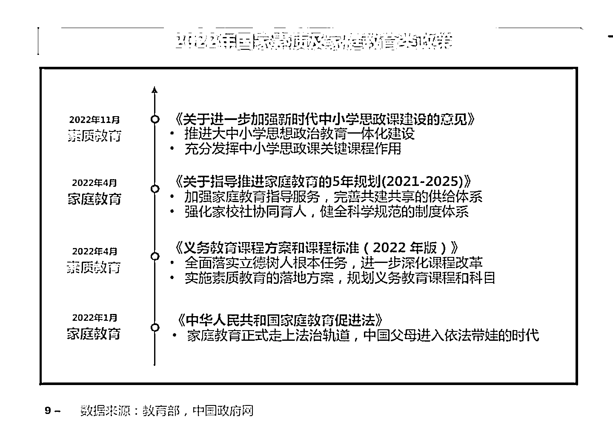</ne-card></ne-p> <ne-p id="u00c72f90" data-lake-id="u00c72f90"><ne-text id="u4a0d5bbe" style="color: rgb(31, 35, 41);">（图片来源于公众号《发现报告》）</ne-text></ne-p> <ne-p id="ubdd83fa5" data-lake-id="ubdd83fa5"><ne-text id="u43842182" style="color: rgb(31, 35, 41);">报告中有数据显示，2021 年下半年以来，38% 的家长增加了亲子陪伴时间，家长平均每天的亲子陪伴时间在 1-2 个小时。</ne-text></ne-p> <ne-p id="ud156769c" data-lake-id="ud156769c"><ne-card data-card-name="image" data-card-type="inline" id="Bo5y2" data-event-boundary="card">  <ne-p id="u21647c44" data-lake-id="u21647c44"><ne-text id="u0f6ec9ee" style="color: rgb(31, 35, 41);">（图片来源于公众号《发现报告》）</ne-text></ne-p> <ne-p id="u3407d40d" data-lake-id="u3407d40d"><ne-text id="u07929fc3" style="color: rgb(31, 35, 41);">生活发生了变化，需求就从中产生了。这 38% 的家长在每天的 1-2 小时的亲子陪伴中的生活中，会遇到各种各样的问题。</ne-text></ne-p> <ne-p id="u17a196ca" data-lake-id="u17a196ca"><ne-text id="u1db2771e" style="color: rgb(31, 35, 41);">而亲子关系因为不可分割的强链接性，这些问题很难回避，当过去可以把孩子投送给各种校外培训机构的时候，问题被回避了，那么随着这种生活方式和场景的变化，亲子陪伴的时间重回生活之后，亲子问题变得不可回避。</ne-text></ne-p> <ne-p id="u27cd4e77" data-lake-id="u27cd4e77"><ne-text id="u5da59def" style="color: rgb(31, 35, 41);">沟通问题本身是表象，沟通问题下面是实现教育目标的问题，家长希望孩子心理素质好、抗挫力强、有正确的价值观、表达力强、社交能力强、时间管理能力强。</ne-text></ne-p> <ne-p id="u69f401f0" data-lake-id="u69f401f0"><ne-text id="u5a8cebe6" style="color: rgb(31, 35, 41);">以前亲子陪伴时间少，问题不凸显，现在亲子陪伴时间增长了，家长常常会面对实现这些教育目标的挑战。</ne-text></ne-p> <ne-p id="ud53fad5e" data-lake-id="ud53fad5e"><ne-text id="u79f20df8" style="color: rgb(31, 35, 41);">那么，对于家长来说，了解孩子成长规律、掌握亲子沟通的方法的需求就也随之增强了。</ne-text></ne-p> <ne-p id="u4ad81401" data-lake-id="u4ad81401"><ne-text id="udcb39b96" style="color: rgb(31, 35, 41);">从巨量算数上看，“家庭教育”的搜索指数确实增长明显</ne-text></ne-p> <ne-p id="ud25cab52" data-lake-id="ud25cab52"><ne-card data-card-name="image" data-card-type="inline" id="poFFy" data-event-boundary="card"></ne-card></ne-p> <ne-p id="u5b31d47e" data-lake-id="u5b31d47e"><ne-card data-card-name="image" data-card-type="inline" id="ZewLQ" data-event-boundary="card">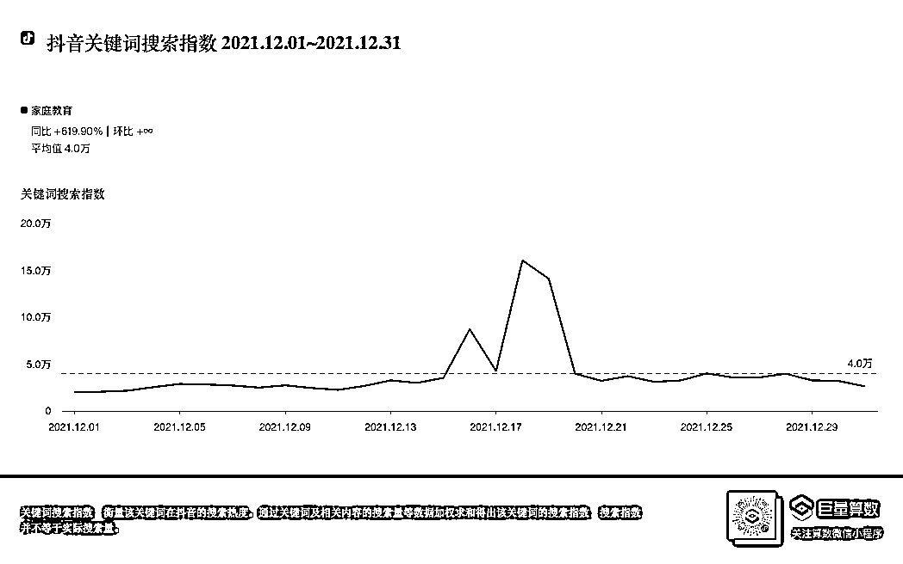</ne-card></ne-p> <ne-p id="ufa468a21" data-lake-id="ufa468a21"><ne-text id="u849de7fe" style="color: rgb(31, 35, 41);">2021 年 1 月，5051</ne-text></ne-p> <ne-p id="uc499c467" data-lake-id="uc499c467"><ne-text id="u449d13c2" style="color: rgb(31, 35, 41);">2021 年 7 月，8351</ne-text></ne-p> <ne-p id="ued2f5b16" data-lake-id="ued2f5b16"><ne-text id="u1a6f66bf" style="color: rgb(31, 35, 41);">2021 年 8 月，1.1 万</ne-text></ne-p> <ne-p id="ua305ef04" data-lake-id="ua305ef04"><ne-text id="u29671e23" style="color: rgb(31, 35, 41);">2021 年 10 月，2.8 万</ne-text></ne-p> <ne-p id="u0d93bcdb" data-lake-id="u0d93bcdb"><ne-text id="u57a9729c" style="color: rgb(31, 35, 41);">2021 年 12 月，4 万</ne-text></ne-p> <ne-p id="uc0bbdb83" data-lake-id="uc0bbdb83"><ne-text id="uc9392850" style="color: rgb(31, 35, 41);">2022 年 6 月，16.8 万</ne-text></ne-p> <ne-p id="u08c848a4" data-lake-id="u08c848a4"><ne-text id="u4090de5a" style="color: rgb(31, 35, 41);">2022 年 12 月，18.7 万</ne-text></ne-p> <ne-p id="u88aad28e" data-lake-id="u88aad28e"><ne-text id="ue0db649c" style="color: rgb(31, 35, 41);">我是从 21 年 10 月开始做准备的，那个时候就是闻到了一点热度，通过数据，也可以看到家庭教育的热度是一直在攀升的，两年时间，关键词指数翻了 37 倍。</ne-text></ne-p> <ne-p id="u3f17bbd0" data-lake-id="u3f17bbd0"><ne-text id="u10f245fb" style="color: rgb(31, 35, 41);">说实话，21 年 10 月，准备开始干的时候，对能赚多少钱，我心里并没有底，也没有特别成熟的产品可供模仿，我基本上就是在热情、大的政策环境和市场关注度的基础上，准备开始尝试。</ne-text></ne-p> <ne-h1 id="e2f151a6" data-lake-id="e2f151a6"><ne-heading-ext><ne-heading-anchor></ne-heading-anchor><ne-heading-fold></ne-heading-fold></ne-heading-ext><ne-heading-content><ne-text id="uef3d3aa7" ne-bold="true">二、产品和服务</ne-text></ne-heading-content></ne-h1> <ne-p id="u33534525" data-lake-id="u33534525"><ne-text id="u409714fc" style="color: rgb(31, 35, 41);">接下来，就是具体做什么产品的问题了，我以什么形式去把这份能力卖出去，换取经济回报呢？家长在什么情况下会掏钱来找我呢？</ne-text></ne-p> <ne-p id="u82231de0" data-lake-id="u82231de0"><ne-text id="u0a1f223f" style="color: rgb(31, 35, 41);">首先，有数据显示，针对亲子陪伴与沟通存在的问题，多数家长采取的学习方式中，排名前五的分别是：</ne-text></ne-p> <ne-p id="ub51cff64" data-lake-id="ub51cff64"><ne-text id="ue13d34b0" style="color: rgb(31, 35, 41);">看家庭教育公众号</ne-text></ne-p> <ne-p id="ue034f9ae" data-lake-id="ue034f9ae"><ne-text id="ud2a72b3e" style="color: rgb(31, 35, 41);">网络搜索</ne-text></ne-p> <ne-p id="u7f85bd04" data-lake-id="u7f85bd04"><ne-text id="ucfe73e73" style="color: rgb(31, 35, 41);">看家庭教育书</ne-text></ne-p> <ne-p id="ub1f4b0bf" data-lake-id="ub1f4b0bf"><ne-text id="u99695ee3" style="color: rgb(31, 35, 41);">向同辈取经</ne-text></ne-p> <ne-p id="ufbaeafd5" data-lake-id="ufbaeafd5"><ne-text id="u4d96d9dc" ne-bold="true">咨询教育专家</ne-text></ne-p> <ne-p id="u40e8424f" data-lake-id="u40e8424f"><ne-card data-card-name="image" data-card-type="inline" id="k5LBH" data-event-boundary="card"></ne-card></ne-p> <ne-p id="u635e9308" data-lake-id="u635e9308"><ne-text id="u1aced5b6" style="color: rgb(31, 35, 41);">（图片来源于公众号《发现报告》）</ne-text></ne-p> <ne-p id="ud7e78988" data-lake-id="ud7e78988"><ne-text id="u622f9a3f" style="color: rgb(31, 35, 41);">其次，根据多年混迹妈妈群的经验，以及跟家庭教育学员的沟通经验，我总结了以下几个要点：</ne-text></ne-p> <ne-p id="u98a70673" data-lake-id="u98a70673"><ne-text id="udb18e951" style="color: rgb(31, 35, 41);">① 第一类家长，喜欢自助解决问题，途径包括问百度、问社群、问闺蜜、问小红书、看公众号，日常鸡毛蒜皮的小事儿，不愿意付费咨询，觉得没必要，平时自己也基本没有学习习惯，付费意识不强。</ne-text></ne-p> <ne-p id="u80fa8616" data-lake-id="u80fa8616"><ne-text id="u5b18030b" style="color: rgb(31, 35, 41);">② 第二类家长，有一定学习意识，喜欢上课，三位数和小四位数的课程，比较好接受，他们觉得上课学得多学得全，学完了就能解决各种问题了，再带个证书什么的，更受欢迎。</ne-text></ne-p> <ne-p id="u3964e5ca" data-lake-id="u3964e5ca"><ne-text id="uedaf639a" style="color: rgb(31, 35, 41);">因为教育的结果在未来才显现，如果当下的痛苦不明显的时候，对未来的结果不敏感，他们的付费意识有限，认为学得多而全更有吸引力</ne-text></ne-p> <ne-p id="u6453ac92" data-lake-id="u6453ac92"><ne-text id="u2ca1f853" style="color: rgb(31, 35, 41);">③ 第三类家长，高认知，愿意通过自我提升去为孩子的未来做好铺垫，对当下的养育问题比较敏感，或者已经存在较严重的养育问题，比如孩子厌学、亲子关系紧张经常吵闹冲突、自己的情绪状态不好烦躁疲惫等。</ne-text></ne-p> <ne-p id="udf9f7e4b" data-lake-id="udf9f7e4b"><ne-text id="ubc67851a" style="color: rgb(31, 35, 41);">他们想系统深度学习，也需要陪伴指导以提升直面问题的能力，但是缺少系统、全面、便捷、高效的途径。</ne-text></ne-p> <ne-p id="ud376cb7e" data-lake-id="ud376cb7e"><ne-text id="u67d64656" style="color: rgb(31, 35, 41);">综上，我们的产品设计思路是，主要针对第三类家长，兼容第二类家长，为他们提供“可供请教的教育专家和能够提供高质量交流的同辈圈子”。</ne-text></ne-p> <ne-p id="ufc07cdec" data-lake-id="ufc07cdec"><ne-text id="u4c357548" style="color: rgb(31, 35, 41);">于是，我们的主打产品就应运而生了，即：提供一套系统、全面、精简的课程，同时，做长期的陪伴指导帮助他们解决问题的服务，如果家长希望拿证，我们也可以授证。</ne-text></ne-p> <ne-h2 id="e8480bb9" data-lake-id="e8480bb9"><ne-heading-ext><ne-heading-anchor></ne-heading-anchor><ne-heading-fold></ne-heading-fold></ne-heading-ext><ne-heading-content><ne-text id="u8a63367d" ne-bold="true">（1）产品形式</ne-text></ne-heading-content></ne-h2> <ne-p id="ucd132a80" data-lake-id="ucd132a80"><ne-text id="u6402ca12" style="color: rgb(31, 35, 41);">① 录播课：5 门家庭教育系统课 +1 门心理学基础课（积极养育课、沟通课、青春期家长课、父母自我疗愈课、教育规划课、心理学通识课）。</ne-text></ne-p> <ne-p id="u77183967" data-lake-id="u77183967"><ne-text id="u19f89b9c" style="color: rgb(31, 35, 41);">② 社群服务：每周固定时间直播答疑、每周固定时间收集养育反思并进行一对一回复，不定期导师一对一通话指导，可以高频率随时解决问题，持续跟踪问题的解决过程，及时纠偏。</ne-text></ne-p> <ne-p id="u896d6641" data-lake-id="u896d6641"><ne-text id="ue411714d" style="color: rgb(31, 35, 41);">③ 授证服务：如果学员想要心理咨询师、高级教育指导师证书，我们可以对接授证。</ne-text></ne-p> <ne-p id="ucf911d7c" data-lake-id="ucf911d7c"><ne-text id="u804a6cc7" style="color: rgb(31, 35, 41);">其实授证不是我们的重点服务，我们的学员都不是为拿证来的，是看中学习的系统化和陪伴指导服务来的，是有了学员以后，他们会问证书相关的问题，我们才对接了这项内容，目的是帮学员省钱省事。</ne-text></ne-p> <ne-p id="u82b986b7" data-lake-id="u82b986b7"><ne-text id="ubd8d93fc" style="color: rgb(31, 35, 41);">同时，我们也发现大家对“证书”有一种认可情结，本来以为是想做副业的学员想增加背书，后来发现不打算做副业的也觉得有个证挺好，总之，大家需要我们又能满足，那就服务到。</ne-text></ne-p> <ne-p id="u81a72b29" data-lake-id="u81a72b29"><ne-text id="u15a44773" style="color: rgb(31, 35, 41);">因为，“在高客单价市场上，做差异化很重要的一点在于：提供完整的服务”</ne-text></ne-p> <ne-p id="u605c6cd7" data-lake-id="u605c6cd7"><ne-card data-card-name="image" data-card-type="inline" id="GwfGl" data-event-boundary="card">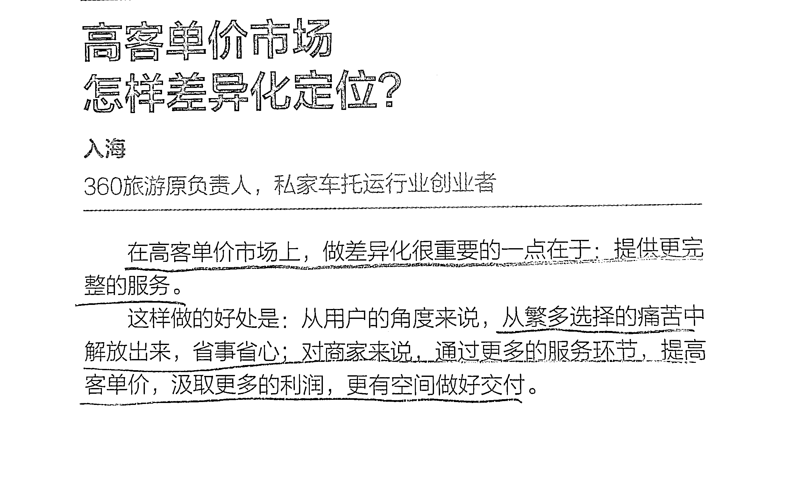</ne-card></ne-p> <ne-p id="ue0da07dd" data-lake-id="ue0da07dd"><ne-text id="u9d1f3c80" style="color: rgb(31, 35, 41);">（图片来源于 2022 年《生财日历》）</ne-text></ne-p> <ne-h2 id="825cb0ba" data-lake-id="825cb0ba"><ne-heading-ext><ne-heading-anchor></ne-heading-anchor><ne-heading-fold></ne-heading-fold></ne-heading-ext><ne-heading-content><ne-text id="u33631a44" ne-bold="true">（2）产品差异化</ne-text></ne-heading-content></ne-h2> <ne-p id="u5b2b328c" data-lake-id="u5b2b328c"><ne-text id="uc7ccfd4e" ne-bold="true">1）别人没有的我们有</ne-text></ne-p> <ne-p id="ue228a485" data-lake-id="ue228a485"><ne-text id="u7b57b6a9" style="color: rgb(31, 35, 41);">家庭教育在实践中会遇到很多个性化很强的问题，因为每个孩子不一样，每个父母不一样，而每个孩子在这个家庭系统中所受的影响不是单方面的，不同孩子身上类似的行为问题，解决方法可能不一样，切入点不一样，每个家庭都有很强的个性化。</ne-text></ne-p> <ne-p id="u8e960383" data-lake-id="u8e960383"><ne-text id="ua669dcc9" style="color: rgb(31, 35, 41);">比如：同样是写作业拖拉的问题，有的孩子我们在评估之后会发现，他确实是没有安排自己的作业，安排自己的时间的能力，他需要家长帮助他培养任务意识、时间观念。</ne-text></ne-p> <ne-p id="u01b672b9" data-lake-id="u01b672b9"><ne-text id="u112dfbc6" style="color: rgb(31, 35, 41);">有的孩子确实有能力而不去做，他因为亲子关系紧张，与父母陷入了一种对抗关系中，他为了“对抗”而故意不去做。那解决方法就不一样。</ne-text></ne-p> <ne-p id="u254f91cc" data-lake-id="u254f91cc"><ne-text id="u7582272f" style="color: rgb(31, 35, 41);">那我们的产品特点就是通过三个板块的服务，去把问题剖析准确，然后陪伴大家在实践中纠偏、调整，带着大家去解决问题。</ne-text></ne-p> <ne-p id="ube558b1e" data-lake-id="ube558b1e"><ne-text id="u0d5034e0" style="color: rgb(31, 35, 41);">一是学员每周可以提交在实际中遇到的问题，导师一对一给予语音回复，分析问题，给出针对性的解决方法。</ne-text></ne-p> <ne-p id="u63c70bf2" data-lake-id="u63c70bf2"><ne-text id="uc9bde1c1" style="color: rgb(31, 35, 41);">二是我们每周提供直播答疑，在互动中分析个性化的问题成因并给出有针对性的解决方案。</ne-text></ne-p> <ne-p id="uf64f1d28" data-lake-id="uf64f1d28"><ne-text id="u1bef3769" style="color: rgb(31, 35, 41);">三是我们根据大家的学习和实践情况，会跟大家约一对一的通话，为大家解决一些比较私密的家庭和个人成长方面的问题。</ne-text></ne-p> <ne-p id="uc858a549" data-lake-id="uc858a549"><ne-text id="udc0519fa" style="color: rgb(31, 35, 41);">通过这三个板块的配合，真正做到了让学员从“知道”到“做到”，需要及时解决的问题及时解决不积压，需要花一段时间解决的提供陪伴指导，让家长可以不焦虑不放弃不走偏，直到问题得到改善。</ne-text></ne-p> <ne-p id="u436c1da9" data-lake-id="u436c1da9"><ne-card data-card-name="image" data-card-type="inline" id="NBFzu" data-event-boundary="card"></ne-card></ne-p> <ne-p id="u8ffaa134" data-lake-id="u8ffaa134"><ne-card data-card-name="image" data-card-type="inline" id="MpAbr" data-event-boundary="card"></ne-card></ne-p> <ne-p id="u98f39ac4" data-lake-id="u98f39ac4"><ne-text id="u37d69f0d" style="color: rgb(31, 35, 41);">服务到这个程度的产品，目前在市场上我们还没有见到，但是需求存在，所以这部分内容做的是别人没有的。</ne-text></ne-p> <ne-p id="ud18e4e26" data-lake-id="ud18e4e26"><ne-text id="u69275c33" ne-bold="true">2）别人有的我们划算</ne-text></ne-p> <ne-p id="uee667532" data-lake-id="uee667532"><ne-text id="u5515da01" style="color: rgb(31, 35, 41);">我们也是对标了市场上做家庭教育的机构和 IP，然后发现，基本上大部分都是做一个点，那对于想学习家庭教育的人来说，面临的实际就是，这个老师讲情绪、那个老师讲沟通、再有个老师讲学习力……</ne-text></ne-p> <ne-p id="ub0ebc234" data-lake-id="ub0ebc234"><ne-text id="ub59f4eda" style="color: rgb(31, 35, 41);">而家长们学起来就是散点式的，因为学习资源不系统，那学习之后在实操方面，解决实际问题的效果就比较差，而且成本会更高。</ne-text></ne-p> <ne-p id="u96197321" data-lake-id="u96197321"><ne-text id="u41867700" style="color: rgb(31, 35, 41);">我们的课程内容系统、全面、又精简，一站式学完，虽然看起来价高，但是相当于打包买了一整套课程，而且加上陪伴指导，其实非常划算。</ne-text></ne-p> <ne-p id="ud3e4835b" data-lake-id="ud3e4835b"><ne-text id="u2ddabe13" style="color: rgb(31, 35, 41);">其实想做好家庭教育，让孩子好好学习，具备积极乐观等优秀品质，底层逻辑很简单，就是了解孩子、了解家长自己、了解家庭成员之间的关系如何相互影响、做好教育规划。以此为主干，我们是这样设计课程的：</ne-text></ne-p> <ne-p id="u664b2f44" data-lake-id="u664b2f44"><ne-text id="ub00c1ff6" style="color: rgb(31, 35, 41);">① 积极养育课，讲一套家庭教育的底层逻辑，是家庭教育基础课，所有的家长都可以学且需要学，学完，可以了解孩子的心理发展规律，以及可以使用哪些方法去搞孩子。</ne-text></ne-p> <ne-p id="u560c92fa" data-lake-id="u560c92fa"><ne-text id="u7c069094" style="color: rgb(31, 35, 41);">② 智慧父母课，主要是帮助家长完成自我成长、自我疗愈，学完，可以更了解自己，也就会看明白自己这个“原件”是如何影响“复印件”的，并且对这份“原件”存在的问题进行疗愈，从而提升“复印件”的质量。</ne-text></ne-p> <ne-p id="ud62229a2" data-lake-id="ud62229a2"><ne-text id="u8cab6f38" style="color: rgb(31, 35, 41);">③ 高情商沟通课，主要以亲子家庭沟通为主线，讲沟通方法，因为我们对孩子的教育，要通过沟通的过程去操作，在了解了孩子了解了自己的基础上，掌握沟通方法，就可以掌控亲子沟通的方法，去实现我们的养育目标。</ne-text></ne-p> <ne-p id="u74825cde" data-lake-id="u74825cde"><ne-text id="u89aca735" style="color: rgb(31, 35, 41);">④ 青春期父母必修课，因为青春期孩子给父母带来的挑战非常大，所以在积极养育课的基础上，特别开一门课，让大家对青春期的孩子有更多针对性的了解，提升家长应对青春期挑战的能力。</ne-text></ne-p> <ne-p id="u455e4831" data-lake-id="u455e4831"><ne-text id="u7c328857" style="color: rgb(31, 35, 41);">同时，如果家长自己的青春期发展不完善，有遗留问题的，也可以通过这门课得到疗愈。</ne-text></ne-p> <ne-p id="uc8e7fcce" data-lake-id="uc8e7fcce"><ne-text id="udd889d03" style="color: rgb(31, 35, 41);">⑤ 教育规划课，在“双减”之后，教育孩子的责任有一部分回归了家庭，对应的，家长不能再把孩子全权委托给学校，急需提升教育规划能力，所以，这也是家长当前关注的热点。</ne-text></ne-p> <ne-p id="u6ed43704" data-lake-id="u6ed43704"><ne-text id="u7ed7d6ec" style="color: rgb(31, 35, 41);">⑥ 心理学通识课，因为家庭教育各种理论和方法的基础还是心理学，有些家长希望自己能再加强一些心理学基础，这样在使用很多方法的时候心里就更有底。</ne-text></ne-p> <ne-p id="ua3c5f5af" data-lake-id="ua3c5f5af"><ne-text id="ua5b41a1c" style="color: rgb(31, 35, 41);">以上任何一个方向的课程，都在 1000+ 到 5000+ 不等，我们全部打包，再加上陪伴指导服务，价格是 12800，对学员来说是相当划算的。</ne-text></ne-p> <ne-p id="u5d2b3006" data-lake-id="u5d2b3006"><ne-card data-card-name="image" data-card-type="inline" id="HlQL0" data-event-boundary="card">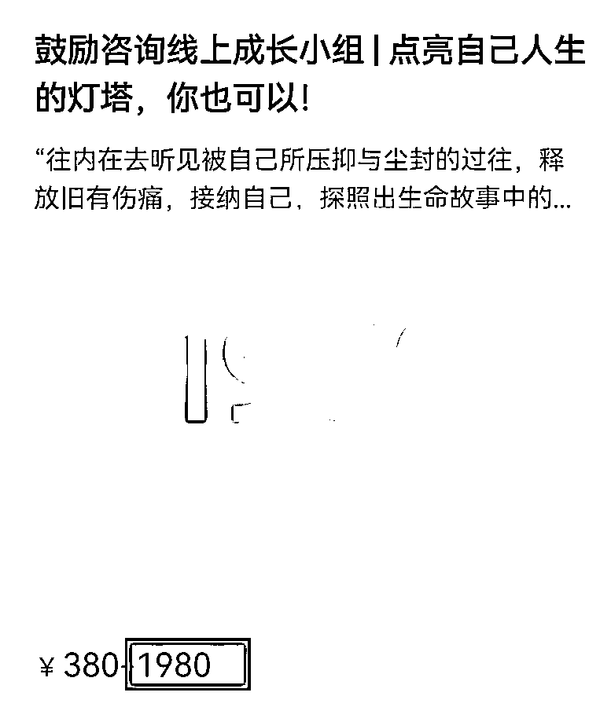</ne-card></ne-p> <ne-p id="ub8cb9ef7" data-lake-id="ub8cb9ef7"><ne-card data-card-name="image" data-card-type="inline" id="PfMjw" data-event-boundary="card">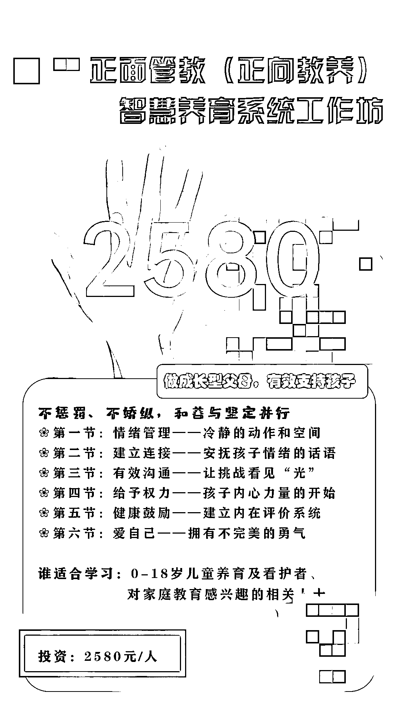</ne-card></ne-p> <ne-p id="u2385b1bf" data-lake-id="u2385b1bf"><ne-card data-card-name="image" data-card-type="inline" id="jv4Ms" data-event-boundary="card"></ne-card></ne-p> <ne-p id="u4573a8dc" data-lake-id="u4573a8dc"><ne-card data-card-name="image" data-card-type="inline" id="DjgH7" data-event-boundary="card">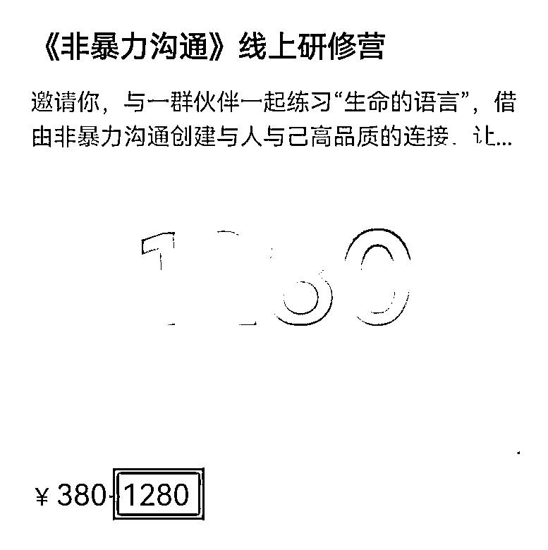</ne-card></ne-p> <ne-p id="u8ef956cd" data-lake-id="u8ef956cd"><ne-text id="uf979762b" style="color: rgb(31, 35, 41);">那么，还有很多家长说，我没有时间学这么多课，我只想快点解决问题，那也没有关系，课就在那，有时间就学，没时间就慢慢学，只要根据自己的节奏提出问题听答疑，也可以解决问题，在有余力的情况下，再选择适合自己的课去听，效果更好。</ne-text></ne-p> <ne-p id="ud786b7bd" data-lake-id="ud786b7bd"><ne-text id="u7e5cd876" style="color: rgb(31, 35, 41);">而且我们的课程不限期，一年听不完，两年三年也听完了，不存在三个月没学完过期了的问题，孩子长大也有个过程，也不是一夜之间就长大了。</ne-text></ne-p> <ne-p id="ub1013b15" data-lake-id="ub1013b15"><ne-text id="uede2401c" style="color: rgb(31, 35, 41);">我们有学员说过，之前自己也是学了不少课，但还是觉得解决不了问题，跟我们学习两个月，顶过去一年的学习效果，而且把之前零散的学习全都串起来了。</ne-text></ne-p> <ne-p id="uf59249de" data-lake-id="uf59249de"><ne-card data-card-name="image" data-card-type="inline" id="AjxYt" data-event-boundary="card">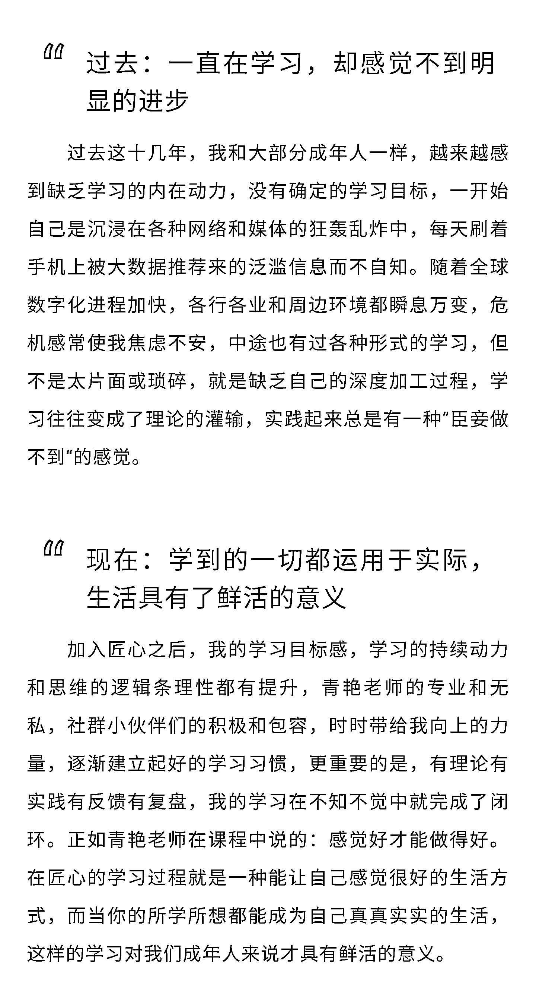</ne-card></ne-p> <ne-p id="ua1e31226" data-lake-id="ua1e31226"><ne-text id="u508d1819" style="color: rgb(31, 35, 41);">也有学员孩子非常小，两三岁，暂时没有多大挑战，但是也买了我们的服务，他们说我慢慢学，不着急，学了就能避坑，避了坑就是赚到了。</ne-text></ne-p> <ne-p id="u23b26439" data-lake-id="u23b26439"><ne-text id="u4af588cd" style="color: rgb(31, 35, 41);">所以说，别人有的我们更划算。</ne-text></ne-p> <ne-p id="uaed3ea0b" data-lake-id="uaed3ea0b"><ne-text id="u806131ac" ne-bold="true">3）高客单价应运而生</ne-text></ne-p> <ne-p id="ube7966e5" data-lake-id="ube7966e5"><ne-text id="u8f24abd1" style="color: rgb(31, 35, 41);">利润产品一定是高客单价的产品，这一点在很多前辈的文章里也都看过，我们也是按照这个路线来的。当我们决定主要针对前面提到的第三类客户的时候，产品价值也就配得上高客单价了。</ne-text></ne-p> <ne-p id="u7cc269ce" data-lake-id="u7cc269ce"><ne-text id="u013e2917" style="color: rgb(31, 35, 41);">实际操作起来感受确实也很好，这个价格就已经筛掉了很大一批无效客户了，能来问的基本上是花得起这个钱的，只要产品和需求相符，成交率是很高的，有的当时没来，日后也都来了，所以没太多无效营销，而且学员从性格到个人素质真的都很好。</ne-text></ne-p> <ne-h1 id="50a1aef7" data-lake-id="50a1aef7"><ne-heading-ext><ne-heading-anchor></ne-heading-anchor><ne-heading-fold></ne-heading-fold></ne-heading-ext><ne-heading-content><ne-text id="ufb076a54" ne-bold="true">三、流量从哪里来</ne-text></ne-heading-content></ne-h1> <ne-h2 id="6e80ae7d" data-lake-id="6e80ae7d"><ne-heading-ext><ne-heading-anchor></ne-heading-anchor><ne-heading-fold></ne-heading-fold></ne-heading-ext><ne-heading-content><ne-text id="u4978de35" ne-bold="true">（1）私域 2000+ 人实现 25 万营收的原因</ne-text></ne-heading-content></ne-h2> <ne-p id="ucdb3ec5e" data-lake-id="ucdb3ec5e"><ne-text id="u280fccc3" style="color: rgb(31, 35, 41);">我们实现目前营收的私域基础大概 2000+ 人，虽然人数不多，但是人群基础较好。</ne-text></ne-p> <ne-p id="u364f7d01" data-lake-id="u364f7d01"><ne-text id="u1dbe9ba1" style="color: rgb(31, 35, 41);">第一，以前做过几期线下课、线下沙龙，这部分人信任基础比较好；</ne-text></ne-p> <ne-p id="u09f1c28d" data-lake-id="u09f1c28d"><ne-text id="ueabf8332" style="color: rgb(31, 35, 41);">第二，我有孩子之后，建过自己的几个妈妈群，断断续续的分享过一些养育方面的学习和实践经验，期间时不时有妈妈介绍其他妈妈跟我链接；</ne-text></ne-p> <ne-p id="u3174dd09" data-lake-id="u3174dd09"><ne-text id="ufbc9a7a1" style="color: rgb(31, 35, 41);">第三，我断断续续一直在朋友圈分享我在家庭教育这条路上的学习、感悟、思考，圈儿有部分人是看着我成长起来的。</ne-text></ne-p> <ne-p id="u0ddf1e88" data-lake-id="u0ddf1e88"><ne-text id="u00efc9ff" style="color: rgb(31, 35, 41);">我觉得这三个方面都建立了很不错的信任基础，所以，可以成交高客单价。</ne-text></ne-p> <ne-h2 id="3050bcca" data-lake-id="3050bcca"><ne-heading-ext><ne-heading-anchor></ne-heading-anchor><ne-heading-fold></ne-heading-fold></ne-heading-ext><ne-heading-content><ne-text id="ua92de0c5" ne-bold="true">（2）高价付费社群引流质量较高</ne-text></ne-heading-content></ne-h2> <ne-p id="u13fbdf19" data-lake-id="u13fbdf19"><ne-text id="ue2a0bf95" style="color: rgb(31, 35, 41);">后面也开始了一些引流动作，主要是高价付费社群和视频号，比如我考过教育规划师，有助教岗位招募，我就去做助教，教育规划师是一个 5000+ 的付费社群，引流质量是比较好的，这些人能花 5000+ 去学习规划师，那付费意识首先是到位的。</ne-text></ne-p> <ne-h1 id="1e8bef89" data-lake-id="1e8bef89"><ne-heading-ext><ne-heading-anchor></ne-heading-anchor><ne-heading-fold></ne-heading-fold></ne-heading-ext><ne-heading-content><ne-text id="ud549ade3" ne-bold="true">四、如何转化实现变现</ne-text></ne-heading-content></ne-h1> <ne-h2 id="c7f679e2" data-lake-id="c7f679e2"><ne-heading-ext><ne-heading-anchor></ne-heading-anchor><ne-heading-fold></ne-heading-fold></ne-heading-ext><ne-heading-content><ne-text id="ua7eb9661" ne-bold="true">（1）免费送一次养育问题 1V1 咨询</ne-text></ne-heading-content></ne-h2> <ne-p id="uff174176" data-lake-id="uff174176"><ne-text id="u5b61d8f1" style="color: rgb(31, 35, 41);">实际上，一次咨询是解决不了问题的，所以这个免费咨询的实质，其实就是梳理问题，帮他做归因，强化痛点，同时植入“你需要学习和指导”，进而，告诉他我们有产品适合你。沟通主线如下：</ne-text></ne-p> <ne-p id="u2aab6dd9" data-lake-id="u2aab6dd9"><ne-text id="u1a7bb138" style="color: rgb(31, 35, 41);">① 了解对方遇到什么问题</ne-text></ne-p> <ne-p id="u8cf8cc40" data-lake-id="u8cf8cc40"><ne-text id="u6d863175" style="color: rgb(31, 35, 41);">② 问题持续了多长时间了</ne-text></ne-p> <ne-p id="u2df85b29" data-lake-id="u2df85b29"><ne-text id="u3b68d6b3" style="color: rgb(31, 35, 41);">③ 引导对方回忆一件事，唤起客户痛点的关键事件</ne-text></ne-p> <ne-p id="u4c354f18" data-lake-id="u4c354f18"><ne-text id="u62d55083" style="color: rgb(31, 35, 41);">④ 询问对方自己做过哪些努力，分析问题依然存在的原因，让对方看到自己的能力缺陷，暴露需求</ne-text></ne-p> <ne-p id="u38f582e9" data-lake-id="u38f582e9"><ne-text id="ue07ffe40" style="color: rgb(31, 35, 41);">（这时候可以植入成功案例，我们的学员也遇到过类似的问题，描述问题事件，通过我们的学习指导，现在的达到了怎样的理想状态）</ne-text></ne-p> <ne-p id="u95d3e09d" data-lake-id="u95d3e09d"><ne-text id="u94cce9ba" style="color: rgb(31, 35, 41);">⑤ 如果不改变，会是什么结果，必须聊到不改变带来的危害，这样就放大了当下的痛点，对于教育产品来说，这一步也不算是制造焦虑，因为教育的结果就是在未来，这是客观事实，所以这一步的沟通是必须的</ne-text></ne-p> <ne-p id="u1166ef0f" data-lake-id="u1166ef0f"><ne-text id="u79b474f0" style="color: rgb(31, 35, 41);">⑥ 是要保持现状还是要想办法改变，推动对方自我说服。</ne-text></ne-p> <ne-h2 id="20b620ea" data-lake-id="20b620ea"><ne-heading-ext><ne-heading-anchor></ne-heading-anchor><ne-heading-fold></ne-heading-fold></ne-heading-ext><ne-heading-content><ne-text id="ue6e9547d" ne-bold="true">（2）免费送一次亲子关系测评</ne-text></ne-heading-content></ne-h2> <ne-p id="u86d01720" data-lake-id="u86d01720"><ne-text id="ua01fb64e" style="color: rgb(31, 35, 41);">用“第三方”的结果，让客户看到自己的问题，比我说他有问题，更有说服力，我们有一个学员就是解读做完，告诉我“你说的全对，感觉看到了我的潜意识”，于是顺利成交 12800 。</ne-text></ne-p> <ne-p id="u70bff536" data-lake-id="u70bff536"><ne-card data-card-name="image" data-card-type="inline" id="IV5zI" data-event-boundary="card">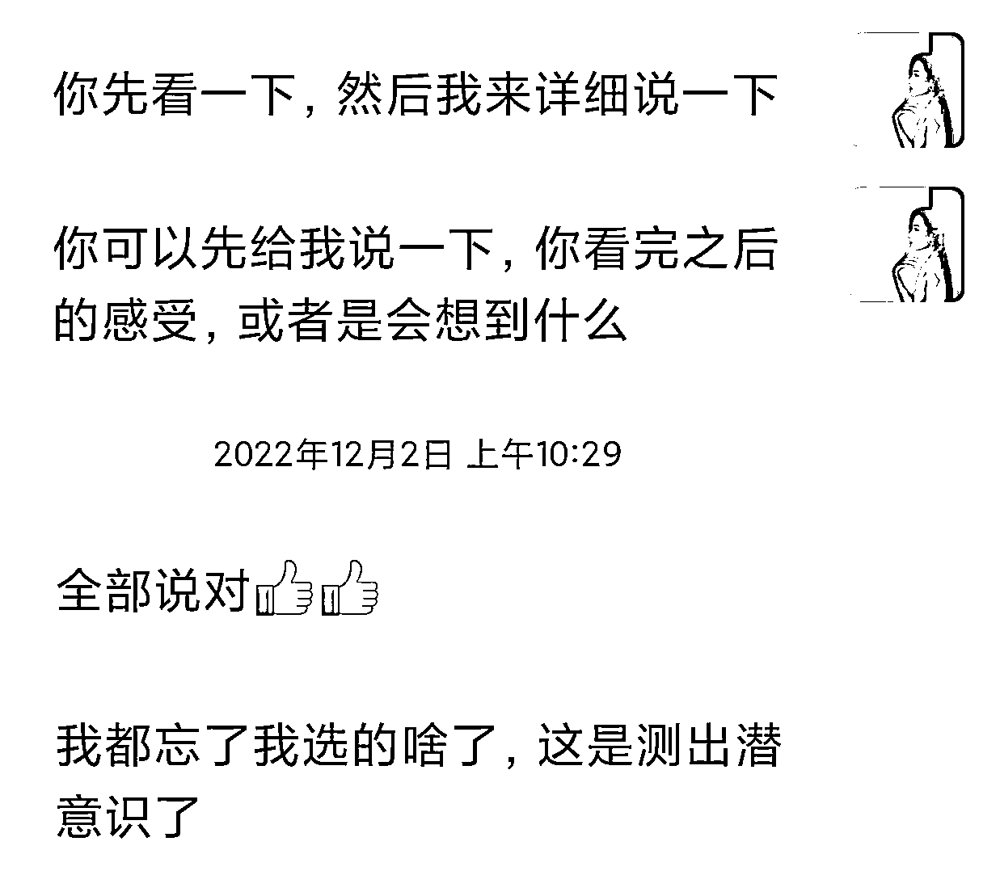</ne-card></ne-p> <ne-h2 id="abde6673" data-lake-id="abde6673"><ne-heading-ext><ne-heading-anchor></ne-heading-anchor><ne-heading-fold></ne-heading-fold></ne-heading-ext><ne-heading-content><ne-text id="ucf36c572" ne-bold="true">（3）免费公开课</ne-text></ne-heading-content></ne-h2> <ne-p id="u18503f1f" data-lake-id="u18503f1f"><ne-text id="u7533fde6" style="color: rgb(31, 35, 41);">在朋友圈发案例展示类内容的时候，我一般会在评论区留钩子：“如果你也想学习如何培养高情商孩子，私信 666 ，免费送您一份高情商养育公开课。</ne-text></ne-p> <ne-p id="u6405a3b1" data-lake-id="u6405a3b1"><ne-text id="uf5ddb0bc" style="color: rgb(31, 35, 41);">”有人留言就会把课程链接发给他，或者做 3-5 天的快闪群，到时邀请他。</ne-text></ne-p> <ne-p id="u711418ba" data-lake-id="u711418ba"><ne-card data-card-name="image" data-card-type="inline" id="PcqBi" data-event-boundary="card">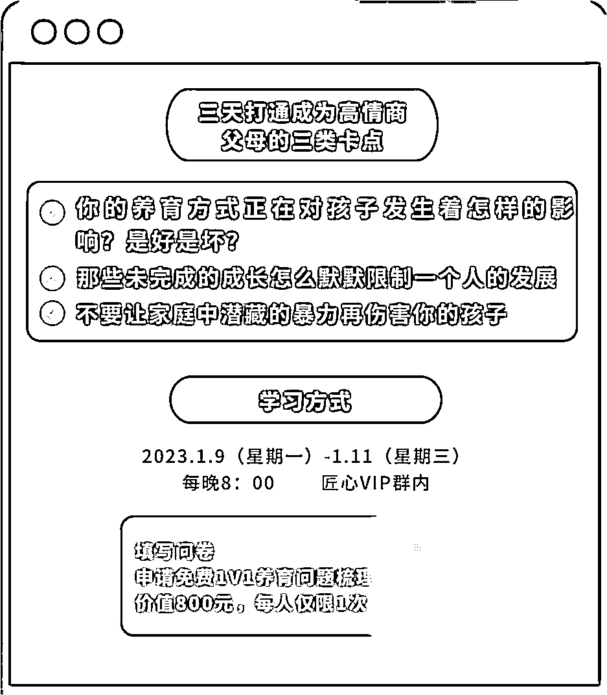</ne-card></ne-p> <ne-p id="uf402d7b8" data-lake-id="uf402d7b8"><ne-card data-card-name="image" data-card-type="inline" id="WM7Go" data-event-boundary="card">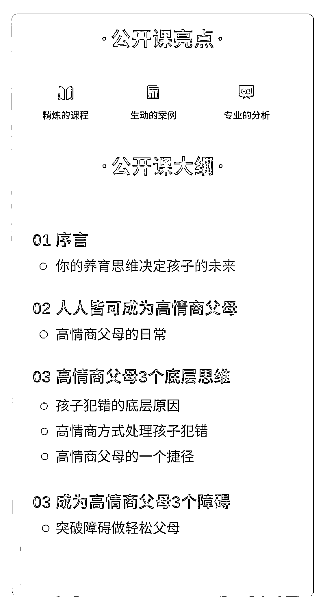</ne-card></ne-p> <ne-p id="u213e84ac" data-lake-id="u213e84ac"><ne-text id="u5601492f" style="color: rgb(31, 35, 41);">课程内容重点告诉他三点：</ne-text></ne-p> <ne-p id="u040797e5" data-lake-id="u040797e5"><ne-text id="uc84238c5" style="color: rgb(31, 35, 41);">第一部分，展示典型养育场景，基本上大家听了都会去对标，然后告诉他为人父母的理想状态什么样，激发对理想状态的期待；</ne-text></ne-p> <ne-p id="u8b0ef334" data-lake-id="u8b0ef334"><ne-text id="u54119fa0" style="color: rgb(31, 35, 41);">第二部分，讲成为高情商父母的几个思维局限，理论联系案例，引导大家对标自身，发现自己正式存在这些局限；</ne-text></ne-p> <ne-p id="u627c356e" data-lake-id="u627c356e"><ne-text id="u00f88bc9" style="color: rgb(31, 35, 41);">第三部分，秀肌肉，讲我们品牌故事以及学员成功案例，会请现有学员分享自己的收获。</ne-text></ne-p> <ne-p id="u218c4b31" data-lake-id="u218c4b31"><ne-text id="ue75f0910" style="color: rgb(31, 35, 41);">总之，有理论、有案例、有干货，但是公开课不是用来解决问题，实际上也解决不了，是用一对多的方式，让大家对于问题看得更清晰，也看到有方法可以解决。</ne-text></ne-p> <ne-p id="u4e961005" data-lake-id="u4e961005"><ne-text id="ue8e7af73" style="color: rgb(31, 35, 41);">她听完课我们会送一个亲子关系测评，用测评结果，结合他的作业内容，让痛点、需求、自己的卡点都更加清晰起来。从而激发购买欲，至少引起对我们的关注。</ne-text></ne-p> <ne-h2 id="dabaf132" data-lake-id="dabaf132"><ne-heading-ext><ne-heading-anchor></ne-heading-anchor><ne-heading-fold></ne-heading-fold></ne-heading-ext><ne-heading-content><ne-text id="ub05eeb49" ne-bold="true">（4）朋友圈文案</ne-text></ne-heading-content></ne-h2> <ne-p id="u3b25cde5" data-lake-id="u3b25cde5"><ne-text id="u262e8790" style="color: rgb(31, 35, 41);">我自己总结了三条打造朋友圈的心法，分享给大家：晒案例引发共鸣、持续性建立信任、立体化链接感情。</ne-text></ne-p> <ne-p id="u37827eeb" data-lake-id="u37827eeb"><ne-text id="u4b5fddbf" ne-bold="true">1） 晒案例引发共鸣</ne-text></ne-p> <ne-p id="ua324a969" data-lake-id="ua324a969"><ne-text id="u73555704" style="color: rgb(31, 35, 41);">晒成交这个不用多说了，大家都会，有一定的刺激他人购买的作用，我个人经验中，案例是特别好的素材，每一个案例都是活生生的，真实的痛点总是能引发共鸣。</ne-text></ne-p> <ne-p id="uaf5b5ebf" data-lake-id="uaf5b5ebf"><ne-text id="uad7c567f" style="color: rgb(31, 35, 41);">有一次，我看好一个潜在客户，于是那几天我就针对她的情况发案例，因为我知道她那几天心里在挠，结果有一条就刚好切中了她的痛点，就果断报名了。</ne-text></ne-p> <ne-p id="u5e3a4eff" data-lake-id="u5e3a4eff"><ne-text id="udd18ae45" ne-bold="true">2） 持续性建立信任感</ne-text></ne-p> <ne-p id="u464518c5" data-lake-id="u464518c5"><ne-text id="u818e1ce1" style="color: rgb(31, 35, 41);">相对于线下的交往来说，线上的交往相对不容易建立信任度，那朋友圈的持续输出，就是建立信任最好的方式。</ne-text></ne-p> <ne-p id="uaf9c458a" data-lake-id="uaf9c458a"><ne-text id="ud3c73802" style="color: rgb(31, 35, 41);">我自己有了孩子以后，就开始在家庭教育这个领域学习、探索、思考，从一开始作为一个分享者，逐步成长为一个专业形象，整个这个过程，带给人很强的信任感。</ne-text></ne-p> <ne-p id="u2fbf6978" data-lake-id="u2fbf6978"><ne-text id="u1ea7e54f" style="color: rgb(31, 35, 41);">所以在第一批招募的时候，就有小伙伴迅速报名了，而且是很主动的，最快的可能就 20 分钟通了个电话就成交了。他们当时就说，我看到你这些年一直在家庭教育领域持续精进，我就看好你这个人。</ne-text></ne-p> <ne-p id="uab4d8f00" data-lake-id="uab4d8f00"><ne-text id="u90aa241d" style="color: rgb(31, 35, 41);">还有人说，同样是妈妈，我看到你这些年一直在学习、在实践、在思考、在迭代，我就想活成你的样子，所以我要加入，以后就跟着你学。</ne-text></ne-p> <ne-p id="u98b5303d" data-lake-id="u98b5303d"><ne-text id="u11e0a3ff" style="color: rgb(31, 35, 41);">也有人他们在我朋友圈没有待那么多年，可能也就关注了几个月，他们基本上都会说，你发的每一条朋友圈我都看过，我收获非常大，所以，想继续深入的跟你学习成长。</ne-text></ne-p> <ne-p id="u35935aa7" data-lake-id="u35935aa7"><ne-text id="u69a02bda" ne-bold="true">3）立体化链接感情</ne-text></ne-p> <ne-p id="u7aae7f1a" data-lake-id="u7aae7f1a"><ne-text id="uac5135f9" style="color: rgb(31, 35, 41);">知识 IP，绝不仅仅是知识和技巧本身。如果只是知识和技巧本身，那我们直接卖书、卖 pp t 就行了。</ne-text></ne-p> <ne-p id="u510bc909" data-lake-id="u510bc909"><ne-text id="uc7f28c5e" style="color: rgb(31, 35, 41);">我们知识 IP 的本质，是帮助客户去消化知识、消化之后还能把技巧用在自己身上，从而去使自己真的得到改变，得到进步。我们是要帮助客户从“知道”到“做到”，这是知识 IP 的本质。</ne-text></ne-p> <ne-p id="u5ddabc5c" data-lake-id="u5ddabc5c"><ne-text id="u0d577785" style="color: rgb(31, 35, 41);">那这个本质，就要求我们提供超出知识本身、技巧本身的价值，去让客户有一个好的体验感。所以，为了帮助客户能通过你这个知识 IP 获得更好的体验感，从而更好的帮助他进步成长，我们知识 IP 就需要提供附加价值。</ne-text></ne-p> <ne-p id="u5a84d68c" data-lake-id="u5a84d68c"><ne-text id="u788e8ea9" style="color: rgb(31, 35, 41);">我自己的情况是，大家喜欢看我说说学习方法、时间管理、思维方式、生活方式等内容，我就会写这方面的。</ne-text></ne-p> <ne-p id="u67e1b329" data-lake-id="u67e1b329"><ne-text id="u01636d69" style="color: rgb(31, 35, 41);">这些附加价值，会让我的客户感受到，我确实是一个成长者角色，因此，他们跟着我学习家庭教育，是靠谱的，是丰富的，是走心的，拉近了距离，增强了信任。</ne-text></ne-p> <ne-p id="u659a49d6" data-lake-id="u659a49d6"><ne-text id="u3fe4556a" ne-bold="true">4） 朋友圈输出的专栏思维</ne-text></ne-p> <ne-p id="u55708b98" data-lake-id="u55708b98"><ne-text id="ubedb92d2" style="color: rgb(31, 35, 41);">这里还有我自己的一个经验，分享给大家，我觉得我朋友圈人数不多，能成交高客单价，跟我的朋友圈输出有关。自己的朋友圈内容，都有哪些，自己心里要清晰，比如我自己的朋友圈，主要由以下几个专栏构成：</ne-text></ne-p> <ne-oli><ne-oli-i>1</ne-oli-i><ne-oli-c class="ne-oli-content" id="u53bbd637" data-lake-id="u53bbd637"><ne-text id="u6eccb931" style="color: rgb(31, 35, 41);">根据一些金句，或者热点事件，聊一聊自己的看法和经验，传达一些教育观念</ne-text></ne-oli-c></ne-oli> <ne-oli><ne-oli-i>1</ne-oli-i><ne-oli-c class="ne-oli-content" id="u425e2d41" data-lake-id="u425e2d41"><ne-text id="u76b8f099" style="color: rgb(31, 35, 41);">专业和产品，也就是产品广告部分，包括课程能解决的痛点、学员的反馈、成交的截图等等</ne-text></ne-oli-c></ne-oli> <ne-p id="u38af6f1a" data-lake-id="u38af6f1a"><ne-text id="u7a3bacee" style="color: rgb(31, 35, 41);">那么，这部分内容有时候不充分，尤其是高客单价，有时初期，不会总有成交，这时候我就发专业相关的，可以是展示学习成长的，上了什么课，读了什么书，跟朋友探讨了什么问题等，都可以。</ne-text></ne-p> <ne-oli><ne-oli-i>1</ne-oli-i><ne-oli-c class="ne-oli-content" id="u80c9567b" data-lake-id="u80c9567b"><ne-text id="ue7a6cc4f" style="color: rgb(31, 35, 41);">生活圈，可以展示积极向上的生活状态，可以展示带娃日常，让别人觉得你是一个真实的人，有情感上的链接，并且你是一个符合你客户心中理想状态的人，可以增强客户粘性。</ne-text></ne-oli-c></ne-oli> <ne-oli><ne-oli-i>1</ne-oli-i><ne-oli-c class="ne-oli-content" id="uf042b78d" data-lake-id="uf042b78d"><ne-text id="ud04f4385" style="color: rgb(31, 35, 41);">附加价值，结合自身优势以及客户需求塑造人设，提供价值，才有感染力和影响力，比如我，大家喜欢看我说说学习方法、思维方式、生活方式、时间管理等内容</ne-text></ne-oli-c></ne-oli> <ne-p id="ue17ac1d3" data-lake-id="ue17ac1d3"><ne-card data-card-name="image" data-card-type="inline" id="u30mi" data-event-boundary="card">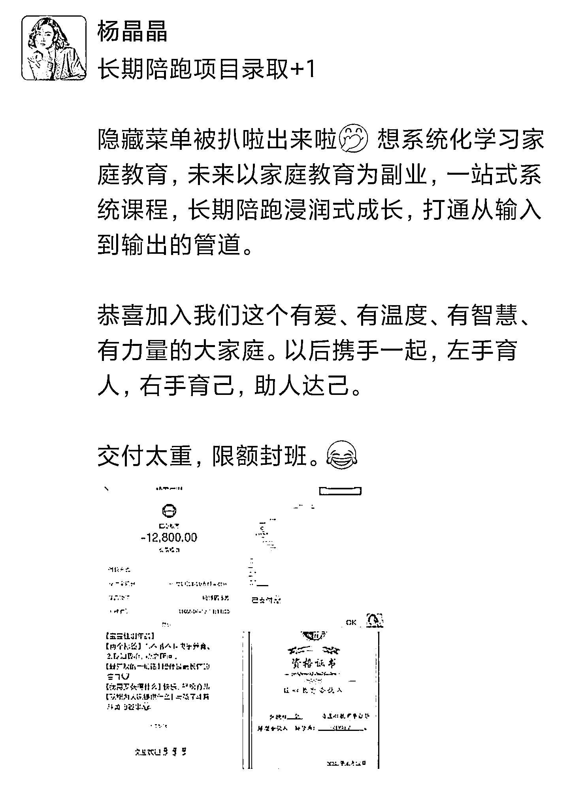</ne-card></ne-p> <ne-p id="u26d55880" data-lake-id="u26d55880"><ne-card data-card-name="image" data-card-type="inline" id="bxQ8g" data-event-boundary="card">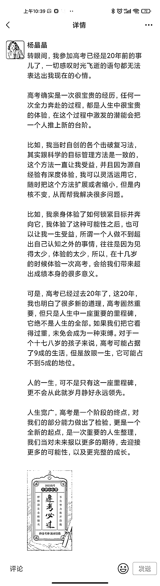</ne-card></ne-p> <ne-p id="ue1b7f371" data-lake-id="ue1b7f371"><ne-card data-card-name="image" data-card-type="inline" id="o6i1F" data-event-boundary="card">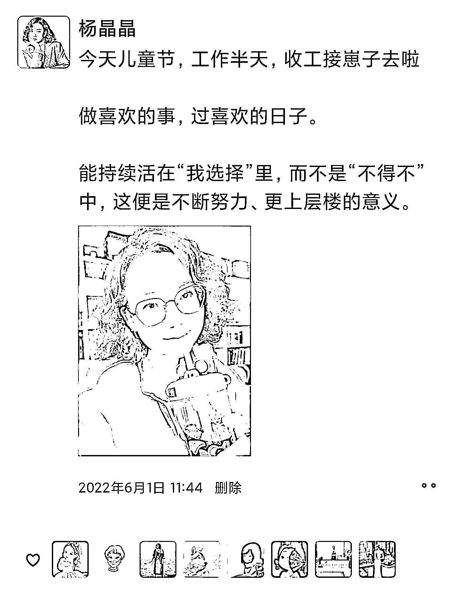</ne-card></ne-p> <ne-p id="ued3d8d80" data-lake-id="ued3d8d80"><ne-card data-card-name="image" data-card-type="inline" id="cKKdf" data-event-boundary="card">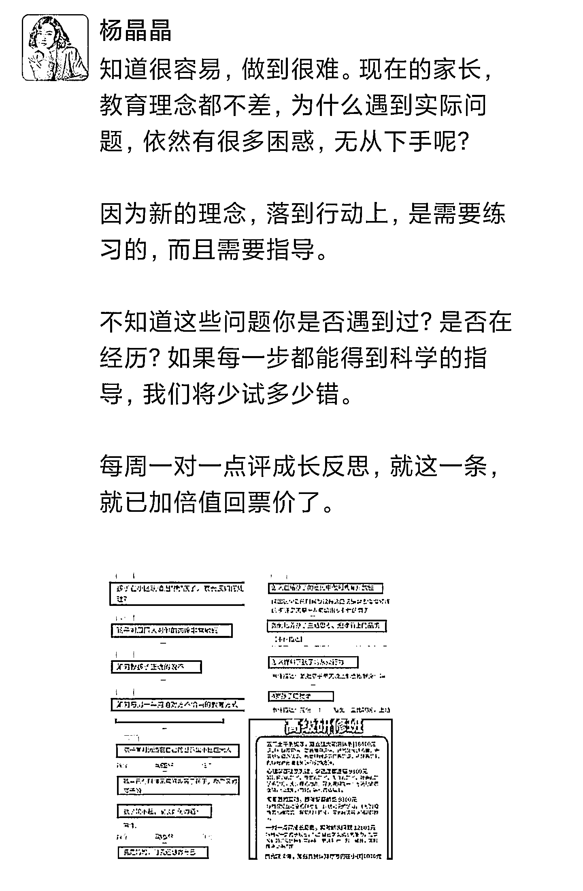</ne-card></ne-p> <ne-p id="u7ace05eb" data-lake-id="u7ace05eb"><ne-card data-card-name="image" data-card-type="inline" id="xyxlr" data-event-boundary="card"></ne-card></ne-p> <ne-p id="ucd08c8a9" data-lake-id="ucd08c8a9"><ne-card data-card-name="image" data-card-type="inline" id="Lm09N" data-event-boundary="card"></ne-card></ne-p> <ne-p id="u22eeac65" data-lake-id="u22eeac65"><ne-text id="u06ff0dfa" style="color: rgb(31, 35, 41);">尽量每天都有这些内容，是最好的。</ne-text></ne-p> <ne-p id="u3ce90907" data-lake-id="u3ce90907"><ne-text id="u1d0a9849" style="color: rgb(31, 35, 41);">但有时候太忙了，没办法每天都发这么多，也可以选择着发，但是自己心中要有这样的专栏意识。我自己的经验是，不怕偶尔停下里，但是记得一定要重新开始，长期来看，你是持续的。</ne-text></ne-p> <ne-h1 id="c8e35d2c" data-lake-id="c8e35d2c"><ne-heading-ext><ne-heading-anchor></ne-heading-anchor><ne-heading-fold></ne-heading-fold></ne-heading-ext><ne-heading-content><ne-text id="ud388a568" ne-bold="true">五、我们指导学员发展副业的思路</ne-text></ne-heading-content></ne-h1> <ne-p id="u5adc487b" data-lake-id="u5adc487b"><ne-text id="ueb83a2cb" style="color: rgb(31, 35, 41);">有人问，家庭教育赛道的门槛到底高不高？总觉得现在各种“妈妈” IP ,“家庭教育” IP 挺多的，到底赚不赚钱。</ne-text></ne-p> <ne-p id="u8e2af19e" data-lake-id="u8e2af19e"><ne-text id="u84e351d5" style="color: rgb(31, 35, 41);">我做到目前的观察是：进入门槛不高，但是做高客单价产品门槛比较高。</ne-text></ne-p> <ne-h2 id="a8508c3d" data-lake-id="a8508c3d"><ne-heading-ext><ne-heading-anchor></ne-heading-anchor><ne-heading-fold></ne-heading-fold></ne-heading-ext><ne-heading-content><ne-text id="u247dde6b" ne-bold="true">（1）进入门槛不高</ne-text></ne-heading-content></ne-h2> <ne-p id="u71479e67" data-lake-id="u71479e67"><ne-text id="u0836df19" style="color: rgb(31, 35, 41);">因为目前学习家庭教育的，有大量的宝妈群体，稍微有点学习能力的，读几本书吧，把内容整理整理，结合自己养孩子的经验，做个几百块的低价课，或者社群，门槛不高。而且宝妈多少都混过各种妈妈群，初始流量是有一些的。</ne-text></ne-p> <ne-h2 id="6cf08819" data-lake-id="6cf08819"><ne-heading-ext><ne-heading-anchor></ne-heading-anchor><ne-heading-fold></ne-heading-fold></ne-heading-ext><ne-heading-content><ne-text id="u0c22608e" ne-bold="true">（2）做高客单价产品门槛比较高</ne-text></ne-heading-content></ne-h2> <ne-p id="u9150a7f7" data-lake-id="u9150a7f7"><ne-text id="ue5c09eb3" style="color: rgb(31, 35, 41);">因为，这需要家庭教育 IP 有持续迭代产品的能力，以及不断解决各种实际问题的能力，即维持稳定的产品供应链的能力。</ne-text></ne-p> <ne-p id="u527fe05d" data-lake-id="u527fe05d"><ne-text id="u25b0bc8f" style="color: rgb(31, 35, 41);">家长能花万元以上来付费，那是真的有问题需要解决的。除了少数家长是在没有出现严重的问题的时候愿意付出这个投资，大量的家长都是救命式学习。</ne-text></ne-p> <ne-p id="u1061fff9" data-lake-id="u1061fff9"><ne-text id="u1ff7ee99" style="color: rgb(31, 35, 41);">在孩子和自己都没有出现什么大问题的时候，就愿意付这么多钱来学习的家长不多，家庭教育大家都看好，但是市场还需要继续培养，认知到行为的改变，还需要一个时期继续去提升，</ne-text></ne-p> <ne-p id="u72dad1f6" data-lake-id="u72dad1f6"><ne-text id="u0b928d90" style="color: rgb(31, 35, 41);">目前来看，大部分家长可能就花个小几百块听听课的比较多，与其说是学习不如说是自我安慰。</ne-text></ne-p> <ne-p id="ua7f0bd81" data-lake-id="ua7f0bd81"><ne-text id="u54935d94" style="color: rgb(31, 35, 41);">为什么会这样呢？因为教育这件事，结果在未来。</ne-text></ne-p> <ne-p id="ubd724e03" data-lake-id="ubd724e03"><ne-text id="u1d2f6ecd" style="color: rgb(31, 35, 41);">孩子心理成长和底层能力成长方面的很多问题不会一天形成，所以，不到问题很严重的时候，痛点不够痛，那家长就没有动力去付高价。</ne-text></ne-p> <ne-p id="u5e2bfda9" data-lake-id="u5e2bfda9"><ne-text id="u5fe6b90c" style="color: rgb(31, 35, 41);">同样，问题解决起来，也不是一天两天就可以，尤其是问题已经很严重的，它的即时反馈不是那么明显。</ne-text></ne-p> <ne-p id="u674f86f3" data-lake-id="u674f86f3"><ne-text id="ueae5d895" style="color: rgb(31, 35, 41);">所以，付高价学习的家长有两类，一类是认知水平高的，愿意为未来付费的，一类是问题已经很严重了足够痛的。</ne-text></ne-p> <ne-p id="udfc8e89d" data-lake-id="udfc8e89d"><ne-text id="u272e0ed4" style="color: rgb(31, 35, 41);">不管是哪一类家长，都需要你的产品真的有质量，同时，需要能真的解决问题。</ne-text></ne-p> <ne-p id="u3ed21967" data-lake-id="u3ed21967"><ne-text id="uaa59092e" style="color: rgb(31, 35, 41);">因为每个家庭都是个性化的，每个孩子都不一样，而每个家长又都深受自身成长的影响，所以，很多问题解决起来不容易，不是随便读几本书，上几门课，带带自家孩子就能解决的。这是一个挺高的门槛。</ne-text></ne-p> <ne-p id="u4f545ed1" data-lake-id="u4f545ed1"><ne-text id="u38b888e3" style="color: rgb(31, 35, 41);">比如：我们的学员里，有的是孩子在学校问题很严重了，她是很痛苦的，她学习之后自己的状态和孩子变化都很大。这个对我们的指导能力，对我们课程的质量要求就都很高，我们的课程是讲的比较本质的，同时配合每周的答疑和一对一点评作业，去实现实操指导，才能有这个效果。</ne-text></ne-p> <ne-p id="uf6ad989c" data-lake-id="uf6ad989c"><ne-text id="uf0062a2b" style="color: rgb(31, 35, 41);">那我们会说，这些家长还可能去求助咨询师，让咨询师给孩子做咨询，确实有，家长普遍喜欢搞孩子不喜欢搞自己。</ne-text></ne-p> <ne-p id="ua6fa3ca9" data-lake-id="ua6fa3ca9"><ne-text id="ubce63606" style="color: rgb(31, 35, 41);">但是这里有一个问题，就算孩子做完咨询后有改变，如果家长不改变，孩子的问题还会反复，可能换一种形式反复。所以，一定会有一批家长选择自己学习改变，从而使自己和孩子都获得一种长期有效的改变。</ne-text></ne-p> <ne-p id="u970be5ff" data-lake-id="u970be5ff"><ne-text id="ud03c5656" style="color: rgb(31, 35, 41);">还有人说那很多大咖也具有解决问题的能力呀，但是大咖不会做这种陪伴服务的，就算做，一般人也支付不起。所以，我们这份能收到实效的陪伴指导就有市场了。</ne-text></ne-p> <ne-p id="u59c32943" data-lake-id="u59c32943"><ne-text id="ua31ddb98" style="color: rgb(31, 35, 41);">这种做高品质课程产品的能力和解决问题的能力，它就是一个高门槛。</ne-text></ne-p> <ne-p id="ub2f4054e" data-lake-id="ub2f4054e"><ne-text id="u7bc07706" ne-bold="true">（3）我们指导学员发展副业的思路</ne-text></ne-p> <ne-p id="u031a2fd7" data-lake-id="u031a2fd7"><ne-text id="ua1043a6b" style="color: rgb(31, 35, 41);">所以，如果专业积累足够，具有持续一对一解决能力的伙伴，可以用课程+服务并且重在服务的形式，做高客单价产品，</ne-text></ne-p> <ne-p id="u5bc56e1f" data-lake-id="u5bc56e1f"><ne-text id="u946c0134" style="color: rgb(31, 35, 41);">如果专业积累不够，那可能“原创课程“和“服务”这两块做起来会比较难。这也是我们有些学员想做副业的过程中面临的问题。我们的建议是两个：</ne-text></ne-p> <ne-p id="u6b03de33" data-lake-id="u6b03de33"><ne-text id="u407cdd13" style="color: rgb(31, 35, 41);">①以成长者的角色带货（课），挣佣金</ne-text></ne-p> <ne-p id="u2a004953" data-lake-id="u2a004953"><ne-text id="u21e4e8cb" style="color: rgb(31, 35, 41);">②做二次加工类的课程，比如《青春期孩子常见问题 100 个》，从书上或者听过的课里，整理 100 个案例，卖个 199 ，如果能卖 10000 份，也是很香的</ne-text></ne-p> <ne-p id="u5d216b5a" data-lake-id="u5d216b5a"><ne-text id="ucc714425" style="color: rgb(31, 35, 41);">这部分也是我们今年会帮助有需求的学员去做的内容。</ne-text></ne-p> <ne-p id="u81ef4e98" data-lake-id="u81ef4e98"><ne-text id="u1be361c4" style="color: rgb(31, 35, 41);">最后感谢在互联网遇到了 @梁靠谱@醒醒@芷蓝 ，从购买生财日历，到加入生财，学到了很多，同时在醒谱大队和玩赚新媒也得到了很多意想不到的惊喜和收获。</ne-text></ne-p> <ne-p id="u662d50bc" data-lake-id="u662d50bc"><ne-text id="u3e5ea12c" style="color: rgb(31, 35, 41);">以上就是我们 2022 年跑通家庭教育赛道高客单价产品的实操经验总结，希望能对大家带来一些启发，还有很多不足，也欢迎探讨指正。</ne-text></ne-p> <ne-p id="uf4148e81" data-lake-id="uf4148e81"><ne-text id="u8cb1f78d" style="color: rgb(31, 35, 41);">祝大家一直生财有术。</ne-text></ne-p> <ne-hole id="u1de99e6a" data-lake-id="u1de99e6a"><ne-card data-card-name="hr" data-card-type="block" id="r1HO7" data-event-boundary="card"><ne-p id="u67d1915a" data-lake-id="u67d1915a"><ne-text id="u7268a865">评论区：</ne-text></ne-p> <ne-p id="u9a8e3b7b" data-lake-id="u9a8e3b7b"><ne-text id="ud672af2f">纪玮 : 怎么联系呢</ne-text> <ne-text id="ua6d7fd7a">重楼 : 有意思！</ne-text> <ne-text id="ua613cc83">詹伟平 : 何以解忧，唯有高客单</ne-text> <ne-text id="u0e9e2c00">谈谈心 : 留个联系方式吧</ne-text> <ne-text id="u67049260">小夏 : 老师的分享很赞，怎么联系呢</ne-text> <ne-text id="u82683868">杨晶晶 : 你好 感谢关注 VX：Amy20120906 请多多指教 一起生财有术</ne-text> <ne-text id="u2029c5a6">杨晶晶 : 你好 感谢关注 VX：Amy20120906 请多多指教 一起生财有术</ne-text> <ne-text id="ub8444ea3">杨晶晶 : 嗯呢 不过目前觉得精准流量要搞好还是得好好研究 要继续在生财好好取经</ne-text></ne-p></ne-card></ne-hole></ne-card></ne-p></ne-card></ne-p></ne-card></ne-p>